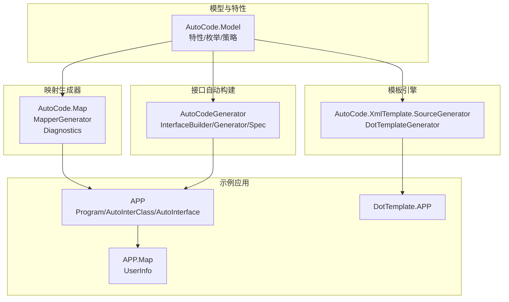
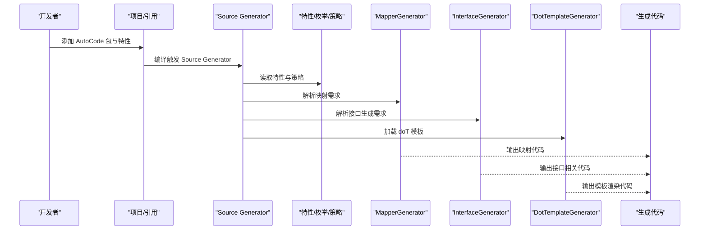
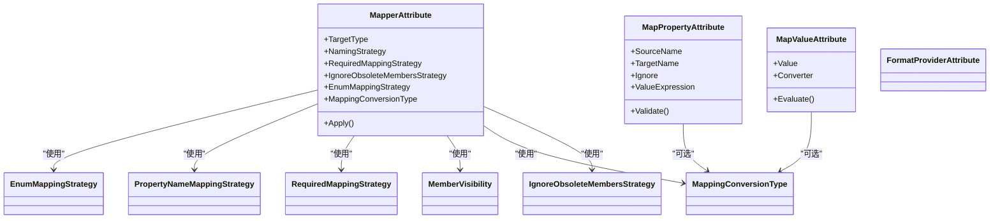
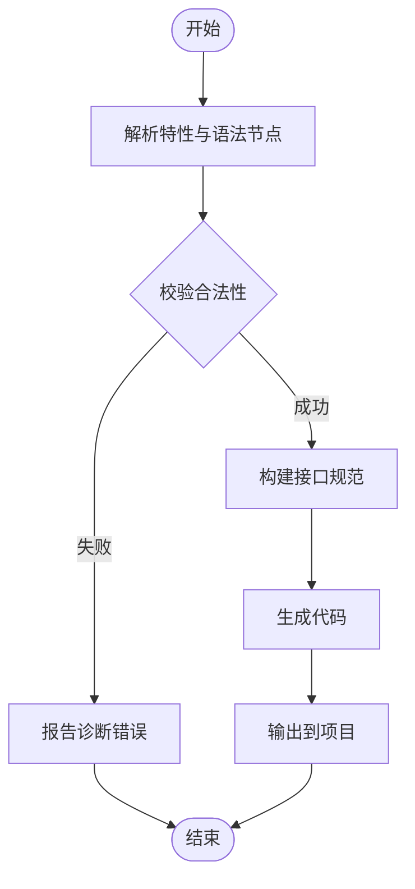
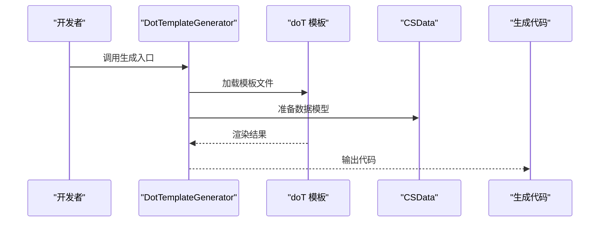
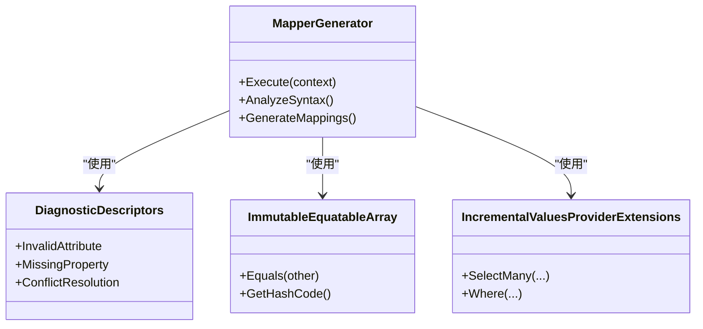
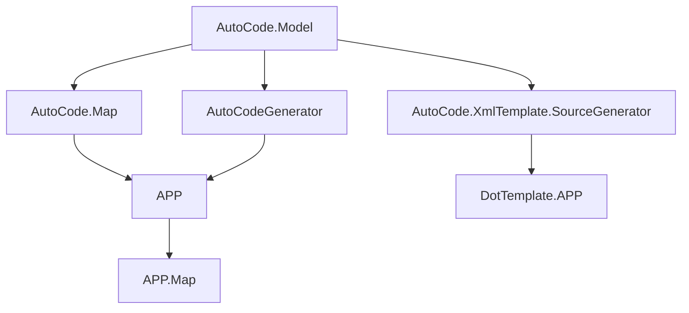

# API参考

<cite>
**本文档引用的文件**   
- [README.md](file://README.md)
- [AutoCode.Model.csproj](file://src/AutoCode.Model/AutoCode.Model.csproj)
- [MapperAttribute.cs](file://src/AutoCode.Model/AutoMapperModel/MapperAttribute.cs)
- [MapPropertyAttribute.cs](file://src/AutoCode.Model/AutoMapperModel/MapPropertyAttribute.cs)
- [MapValueAttribute.cs](file://src/AutoCode.Model/AutoMapperModel/MapValueAttribute.cs)
- [EnumMappingStrategy.cs](file://src/AutoCode.Model/AutoMapperModel/EnumMappingStrategy.cs)
- [PropertyNameMappingStrategy.cs](file://src/AutoCode.Model/AutoMapperModel/PropertyNameMappingStrategy.cs)
- [RequiredMappingStrategy.cs](file://src/AutoCode.Model/AutoMapperModel/RequiredMappingStrategy.cs)
- [MemberVisibility.cs](file://src/AutoCode.Model/AutoMapperModel/MemberVisibility.cs)
- [MappingConversionType.cs](file://src/AutoCode.Model/AutoMapperModel/MappingConversionType.cs)
- [FormatProviderAttribute.cs](file://src/AutoCode.Model/AutoMapperModel/FormatProviderAttribute.cs)
- [IgnoreObsoleteMembersStrategy.cs](file://src/AutoCode.Model/AutoMapperModel/IgnoreObsoleteMembersStrategy.cs)
- [AutoInterfaceAttribute.cs](file://src/AutoCode.Model/InterfaceAttribute/AutoInterfaceAttribute.cs)
- [AutoIgnoreAttribute.cs](file://src/AutoCode.Model/InterfaceAttribute/AutoIgnoreAttribute.cs)
- [DotTemplateAttribute.cs](file://src/AutoCode.Model/DotFileAttribute/DotTemplateAttribute.cs)
- [MapperGenerator.cs](file://src/AutoCode.Map/MapperGenerator.cs)
- [DiagnosticDescriptors.cs](file://src/AutoCode.Map/Diagnostics/DiagnosticDescriptors.cs)
- [ImmutableEquatableArray.cs](file://src/AutoCode.Map/Helpers/ImmutableEquatableArray.cs)
- [IncrementalValuesProviderExtensions.cs](file://src/AutoCode.Map/Helpers/IncrementalValuesProviderExtensions.cs)
- [InterfaceBuilder.cs](file://src/AutoCodeGenerator/InterfaceAutoBuilder/InterfaceBuilder.cs)
- [InterfaceGenerator.cs](file://src/AutoCodeGenerator/InterfaceAutoBuilder/InterfaceGenerator.cs)
- [InterfaceSpec.cs](file://src/AutoCodeGenerator/InterfaceAutoBuilder/InterfaceSpec.cs)
- [DotTemplateGenerator.cs](file://src/AutoCode.XmlTemplate.SourceGenerator/DotTemplateGenerator.cs)
- [CSData.cs](file://src/AutoCode.XmlTemplate.SourceGenerator/CSData.cs)
- [SyntaxNodeConvert.cs](file://src/AutoCode.XmlTemplate.SourceGenerator/SyntaxNodeConvert.cs)
- [Program.cs](file://src/APP/Program.cs)
- [AutoInterClass.cs](file://src/APP/AutoInterClass.cs)
- [AutoInterface.cs](file://src/APP/AutoInterface.cs)
- [UserInfo.cs](file://src/APP.Map/UserInfo.cs)
- [Behavior.cs](file://src/Auto.MapModels/Behavior.cs)
</cite>

## 目录
1. [简介](#简介)
2. [项目结构](#项目结构)
3. [核心组件](#核心组件)
4. [架构总览](#架构总览)
5. [详细组件分析](#详细组件分析)
6. [依赖关系分析](#依赖关系分析)
7. [性能考虑](#性能考虑)
8. [故障排查指南](#故障排查指南)
9. [结论](#结论)
10. [附录：API清单与快速导航](#附录api清单与快速导航)

## 简介
本文件为 AutoCode 框架的完整 API 参考文档，聚焦于代码生成器、映射模型属性、接口自动生成以及模板引擎等核心能力。文档按功能模块组织，提供公共类型、属性、方法签名、参数说明、返回值与异常处理约定，并附带使用示例、配置选项与默认值、版本兼容性与弃用警告。读者可据此快速定位所需 API 并正确集成到项目中。

## 项目结构
AutoCode 采用多项目分层组织，核心包含以下模块：
- 模型与特性（AutoCode.Model）：定义映射与接口生成的元数据特性、枚举与策略。
- 映射生成器（AutoCode.Map）：基于 Source Generator 实现对象映射代码生成与诊断。
- 接口自动构建（AutoCodeGenerator）：根据接口特性与规范生成接口实现或辅助类。
- 模板引擎（AutoCode.XmlTemplate.SourceGenerator）：基于 doT 模板的代码生成扩展。
- 应用示例（APP、APP.Map、DotTemplate.APP）：演示如何使用特性与生成器。

**图表来源** 
- [AutoCode.Model.csproj](file://src/AutoCode.Model/AutoCode.Model.csproj)
- [MapperGenerator.cs](file://src/AutoCode.Map/MapperGenerator.cs)
- [InterfaceGenerator.cs](file://src/AutoCodeGenerator/InterfaceAutoBuilder/InterfaceGenerator.cs)
- [DotTemplateGenerator.cs](file://src/AutoCode.XmlTemplate.SourceGenerator/DotTemplateGenerator.cs)
- [Program.cs](file://src/APP/Program.cs)
- [UserInfo.cs](file://src/APP.Map/UserInfo.cs)

**章节来源**
- [README.md](file://README.md)

## 核心组件
本节概述 AutoCode 的关键 API 域：
- 映射特性与策略：用于声明式配置对象映射行为。
- 接口生成特性：用于标记需要自动生成的接口及成员忽略规则。
- 模板生成器：通过 doT 模板驱动代码生成。
- 源生成器入口：MapperGenerator 与 InterfaceGenerator 作为编译期代码生成入口。

**章节来源**
- [MapperAttribute.cs](file://src/AutoCode.Model/AutoMapperModel/MapperAttribute.cs)
- [MapPropertyAttribute.cs](file://src/AutoCode.Model/AutoMapperModel/MapPropertyAttribute.cs)
- [MapValueAttribute.cs](file://src/AutoCode.Model/AutoMapperModel/MapValueAttribute.cs)
- [AutoInterfaceAttribute.cs](file://src/AutoCode.Model/InterfaceAttribute/AutoInterfaceAttribute.cs)
- [AutoIgnoreAttribute.cs](file://src/AutoCode.Model/InterfaceAttribute/AutoIgnoreAttribute.cs)
- [DotTemplateAttribute.cs](file://src/AutoCode.Model/DotFileAttribute/DotTemplateAttribute.cs)
- [MapperGenerator.cs](file://src/AutoCode.Map/MapperGenerator.cs)
- [InterfaceGenerator.cs](file://src/AutoCodeGenerator/InterfaceAutoBuilder/InterfaceGenerator.cs)
- [DotTemplateGenerator.cs](file://src/AutoCode.XmlTemplate.SourceGenerator/DotTemplateGenerator.cs)

## 架构总览
AutoCode 在编译期通过 Source Generator 扫描特性与语法节点，结合模板与策略，生成目标代码。整体流程如下：

**图表来源** 
- [MapperGenerator.cs](file://src/AutoCode.Map/MapperGenerator.cs)
- [InterfaceGenerator.cs](file://src/AutoCodeGenerator/InterfaceAutoBuilder/InterfaceGenerator.cs)
- [DotTemplateGenerator.cs](file://src/AutoCode.XmlTemplate.SourceGenerator/DotTemplateGenerator.cs)
- [AutoCode.Model.csproj](file://src/AutoCode.Model/AutoCode.Model.csproj)

## 详细组件分析

### 映射特性与策略（AutoCode.Model/AutoMapperModel）
该模块提供一组特性与枚举，用于声明式配置对象映射行为，包括命名策略、枚举映射、必需映射、成员可见性、格式化提供者等。

- MapperAttribute
  - 用途：标记映射目标或配置全局映射策略。
  - 关键属性：目标类型、命名策略、必需映射策略、忽略过时成员策略、枚举映射策略、转换类型等。
  - 默认值：未显式设置时采用框架默认策略。
  - 异常：无效属性组合将触发诊断错误。
  - 使用示例：在目标类型上标注以启用映射生成。
  
- MapPropertyAttribute
  - 用途：对单个属性进行映射重命名、条件映射或值覆盖。
  - 关键属性：源属性名、目标属性名、是否忽略、值表达式等。
  - 默认值：未指定时沿用默认映射规则。
  - 异常：属性名冲突或缺失将产生诊断。
  - 使用示例：在目标属性上标注以覆盖默认映射。

- MapValueAttribute
  - 用途：为属性注入固定值或计算值。
  - 关键属性：值表达式、类型转换器等。
  - 默认值：无。
  - 异常：表达式非法将触发诊断。
  - 使用示例：在目标属性上标注以赋值常量或表达式。

- 枚举与策略
  - EnumMappingStrategy：枚举映射策略（如按名称匹配、按值映射）。
  - PropertyNameMappingStrategy：属性名映射策略（如驼峰、下划线）。
  - RequiredMappingStrategy：必需映射策略（严格/宽松）。
  - MemberVisibility：成员可见性（公开/内部/私有）。
  - MappingConversionType：转换类型（隐式/显式/自定义）。
  - FormatProviderAttribute：格式化提供者特性，用于日期、数值等格式。
  - IgnoreObsoleteMembersStrategy：忽略过时成员的开关。

**图表来源** 
- [MapperAttribute.cs](file://src/AutoCode.Model/AutoMapperModel/MapperAttribute.cs)
- [MapPropertyAttribute.cs](file://src/AutoCode.Model/AutoMapperModel/MapPropertyAttribute.cs)
- [MapValueAttribute.cs](file://src/AutoCode.Model/AutoMapperModel/MapValueAttribute.cs)
- [EnumMappingStrategy.cs](file://src/AutoCode.Model/AutoMapperModel/EnumMappingStrategy.cs)
- [PropertyNameMappingStrategy.cs](file://src/AutoCode.Model/AutoMapperModel/PropertyNameMappingStrategy.cs)
- [RequiredMappingStrategy.cs](file://src/AutoCode.Model/AutoMapperModel/RequiredMappingStrategy.cs)
- [MemberVisibility.cs](file://src/AutoCode.Model/AutoMapperModel/MemberVisibility.cs)
- [MappingConversionType.cs](file://src/AutoCode.Model/AutoMapperModel/MappingConversionType.cs)
- [FormatProviderAttribute.cs](file://src/AutoCode.Model/AutoMapperModel/FormatProviderAttribute.cs)
- [IgnoreObsoleteMembersStrategy.cs](file://src/AutoCode.Model/AutoMapperModel/IgnoreObsoleteMembersStrategy.cs)

**章节来源**
- [MapperAttribute.cs](file://src/AutoCode.Model/AutoMapperModel/MapperAttribute.cs)
- [MapPropertyAttribute.cs](file://src/AutoCode.Model/AutoMapperModel/MapPropertyAttribute.cs)
- [MapValueAttribute.cs](file://src/AutoCode.Model/AutoMapperModel/MapValueAttribute.cs)
- [EnumMappingStrategy.cs](file://src/AutoCode.Model/AutoMapperModel/EnumMappingStrategy.cs)
- [PropertyNameMappingStrategy.cs](file://src/AutoCode.Model/AutoMapperModel/PropertyNameMappingStrategy.cs)
- [RequiredMappingStrategy.cs](file://src/AutoCode.Model/AutoMapperModel/RequiredMappingStrategy.cs)
- [MemberVisibility.cs](file://src/AutoCode.Model/AutoMapperModel/MemberVisibility.cs)
- [MappingConversionType.cs](file://src/AutoCode.Model/AutoMapperModel/MappingConversionType.cs)
- [FormatProviderAttribute.cs](file://src/AutoCode.Model/AutoMapperModel/FormatProviderAttribute.cs)
- [IgnoreObsoleteMembersStrategy.cs](file://src/AutoCode.Model/AutoMapperModel/IgnoreObsoleteMembersStrategy.cs)

### 接口自动生成（AutoCode.Model/InterfaceAttribute 与 AutoCodeGenerator）
该模块支持基于特性的接口自动生成，允许标记接口与成员以控制生成行为。

- AutoInterfaceAttribute
  - 用途：标记需要自动生成的接口或类。
  - 关键属性：生成目标、命名空间、基类等。
  - 默认值：按约定推断。
  - 异常：不合法的目标类型将触发诊断。

- AutoIgnoreAttribute
  - 用途：忽略特定成员不参与生成。
  - 关键属性：成员名或模式。
  - 默认值：无。
  - 异常：忽略规则冲突将产生诊断。

- InterfaceBuilder / InterfaceGenerator / InterfaceSpec
  - 职责：解析接口规范、构建生成逻辑、输出代码。
  - 输入：特性与语法树。
  - 输出：C# 接口或实现代码。
  - 错误处理：通过诊断描述符报告问题。

**图表来源** 
- [AutoInterfaceAttribute.cs](file://src/AutoCode.Model/InterfaceAttribute/AutoInterfaceAttribute.cs)
- [AutoIgnoreAttribute.cs](file://src/AutoCode.Model/InterfaceAttribute/AutoIgnoreAttribute.cs)
- [InterfaceBuilder.cs](file://src/AutoCodeGenerator/InterfaceAutoBuilder/InterfaceBuilder.cs)
- [InterfaceGenerator.cs](file://src/AutoCodeGenerator/InterfaceAutoBuilder/InterfaceGenerator.cs)
- [InterfaceSpec.cs](file://src/AutoCodeGenerator/InterfaceAutoBuilder/InterfaceSpec.cs)

**章节来源**
- [AutoInterfaceAttribute.cs](file://src/AutoCode.Model/InterfaceAttribute/AutoInterfaceAttribute.cs)
- [AutoIgnoreAttribute.cs](file://src/AutoCode.Model/InterfaceAttribute/AutoIgnoreAttribute.cs)
- [InterfaceBuilder.cs](file://src/AutoCodeGenerator/InterfaceAutoBuilder/InterfaceBuilder.cs)
- [InterfaceGenerator.cs](file://src/AutoCodeGenerator/InterfaceAutoBuilder/InterfaceGenerator.cs)
- [InterfaceSpec.cs](file://src/AutoCodeGenerator/InterfaceAutoBuilder/InterfaceSpec.cs)

### 模板引擎（AutoCode.XmlTemplate.SourceGenerator）
该模块基于 doT 模板引擎，支持通过模板文件驱动代码生成。

- DotTemplateGenerator
  - 职责：加载模板、渲染上下文、输出代码。
  - 输入：模板路径、数据模型（CSData）、语法节点。
  - 输出：C# 代码片段。
  - 错误处理：模板解析失败或渲染异常将抛出诊断。

- CSData / SyntaxNodeConvert
  - 职责：封装模板数据与语法节点转换工具。
  - 用法：为模板提供结构化数据与便捷访问方法。

**图表来源** 
- [DotTemplateGenerator.cs](file://src/AutoCode.XmlTemplate.SourceGenerator/DotTemplateGenerator.cs)
- [CSData.cs](file://src/AutoCode.XmlTemplate.SourceGenerator/CSData.cs)
- [SyntaxNodeConvert.cs](file://src/AutoCode.XmlTemplate.SourceGenerator/SyntaxNodeConvert.cs)

**章节来源**
- [DotTemplateGenerator.cs](file://src/AutoCode.XmlTemplate.SourceGenerator/DotTemplateGenerator.cs)
- [CSData.cs](file://src/AutoCode.XmlTemplate.SourceGenerator/CSData.cs)
- [SyntaxNodeConvert.cs](file://src/AutoCode.XmlTemplate.SourceGenerator/SyntaxNodeConvert.cs)

### 源生成器入口（AutoCode.Map）
- MapperGenerator
  - 职责：作为 Source Generator 入口，扫描特性与语法节点，协调映射生成。
  - 输入：编译上下文、语法树、特性集合。
  - 输出：映射代码。
  - 错误处理：通过 DiagnosticDescriptors 报告诊断信息。

- Diagnostics
  - 职责：定义诊断 ID、消息与严重级别。
  - 用法：统一错误报告与用户提示。

- Helpers
  - ImmutableEquatableArray：不可变数组，提升比较与缓存效率。
  - IncrementalValuesProviderExtensions：增量值提供扩展，优化生成性能。

**图表来源** 
- [MapperGenerator.cs](file://src/AutoCode.Map/MapperGenerator.cs)
- [DiagnosticDescriptors.cs](file://src/AutoCode.Map/Diagnostics/DiagnosticDescriptors.cs)
- [ImmutableEquatableArray.cs](file://src/AutoCode.Map/Helpers/ImmutableEquatableArray.cs)
- [IncrementalValuesProviderExtensions.cs](file://src/AutoCode.Map/Helpers/IncrementalValuesProviderExtensions.cs)

**章节来源**
- [MapperGenerator.cs](file://src/AutoCode.Map/MapperGenerator.cs)
- [DiagnosticDescriptors.cs](file://src/AutoCode.Map/Diagnostics/DiagnosticDescriptors.cs)
- [ImmutableEquatableArray.cs](file://src/AutoCode.Map/Helpers/ImmutableEquatableArray.cs)
- [IncrementalValuesProviderExtensions.cs](file://src/AutoCode.Map/Helpers/IncrementalValuesProviderExtensions.cs)

### 应用示例（APP、APP.Map、DotTemplate.APP）
- APP
  - Program：演示如何引入并使用 AutoCode 生成的接口与映射。
  - AutoInterClass / AutoInterface：展示接口自动生成的使用方式。

- APP.Map
  - UserInfo：演示映射特性的实际应用。

- DotTemplate.APP
  - 演示模板引擎的使用与数据绑定。

**章节来源**
- [Program.cs](file://src/APP/Program.cs)
- [AutoInterClass.cs](file://src/APP/AutoInterClass.cs)
- [AutoInterface.cs](file://src/APP/AutoInterface.cs)
- [UserInfo.cs](file://src/APP.Map/UserInfo.cs)
- [Behavior.cs](file://src/Auto.MapModels/Behavior.cs)

## 依赖关系分析
AutoCode 各模块之间的依赖关系清晰，特性模块被生成器与模板引擎共同依赖，示例应用消费生成结果。

**图表来源** 
- [AutoCode.Model.csproj](file://src/AutoCode.Model/AutoCode.Model.csproj)
- [MapperGenerator.cs](file://src/AutoCode.Map/MapperGenerator.cs)
- [InterfaceGenerator.cs](file://src/AutoCodeGenerator/InterfaceAutoBuilder/InterfaceGenerator.cs)
- [DotTemplateGenerator.cs](file://src/AutoCode.XmlTemplate.SourceGenerator/DotTemplateGenerator.cs)
- [Program.cs](file://src/APP/Program.cs)
- [UserInfo.cs](file://src/APP.Map/UserInfo.cs)

**章节来源**
- [AutoCode.Model.csproj](file://src/AutoCode.Model/AutoCode.Model.csproj)
- [MapperGenerator.cs](file://src/AutoCode.Map/MapperGenerator.cs)
- [InterfaceGenerator.cs](file://src/AutoCodeGenerator/InterfaceAutoBuilder/InterfaceGenerator.cs)
- [DotTemplateGenerator.cs](file://src/AutoCode.XmlTemplate.SourceGenerator/DotTemplateGenerator.cs)
- [Program.cs](file://src/APP/Program.cs)
- [UserInfo.cs](file://src/APP.Map/UserInfo.cs)

## 性能考虑
- 使用 ImmutableEquatableArray 减少不必要的分配与比较开销。
- 利用 IncrementalValuesProviderExtensions 进行增量分析，避免重复工作。
- 合理配置 RequiredMappingStrategy 与 NamingStrategy，降低生成复杂度。
- 模板渲染前预编译模板，减少运行时开销。

[本节为通用指导，无需具体文件引用]

## 故障排查指南
- 常见诊断错误
  - 无效特性组合：检查 MapperAttribute 的属性搭配是否符合约束。
  - 属性缺失或冲突：确认 MapPropertyAttribute 的源/目标属性存在且唯一。
  - 模板解析失败：验证模板语法与数据模型字段一致性。
- 调试建议
  - 启用详细日志与诊断输出。
  - 逐步缩小范围，定位问题特性或模板。
  - 使用示例项目对比差异。

**章节来源**
- [DiagnosticDescriptors.cs](file://src/AutoCode.Map/Diagnostics/DiagnosticDescriptors.cs)

## 结论
AutoCode 通过特性驱动的声明式配置与 Source Generator 技术，实现了高效的对象映射与接口自动生成。其模块化设计使扩展与维护更加便捷，配合模板引擎可满足多样化代码生成需求。建议在实际使用中遵循最佳实践，合理配置策略与模板，以获得稳定与高性能的生成结果。

[本节为总结，无需具体文件引用]

## 附录：API清单与快速导航
- 映射特性与策略
  - MapperAttribute：[MapperAttribute.cs](file://src/AutoCode.Model/AutoMapperModel/MapperAttribute.cs)
  - MapPropertyAttribute：[MapPropertyAttribute.cs](file://src/AutoCode.Model/AutoMapperModel/MapPropertyAttribute.cs)
  - MapValueAttribute：[MapValueAttribute.cs](file://src/AutoCode.Model/AutoMapperModel/MapValueAttribute.cs)
  - 枚举与策略：[EnumMappingStrategy.cs](file://src/AutoCode.Model/AutoMapperModel/EnumMappingStrategy.cs)、[PropertyNameMappingStrategy.cs](file://src/AutoCode.Model/AutoMapperModel/PropertyNameMappingStrategy.cs)、[RequiredMappingStrategy.cs](file://src/AutoCode.Model/AutoMapperModel/RequiredMappingStrategy.cs)、[MemberVisibility.cs](file://src/AutoCode.Model/AutoMapperModel/MemberVisibility.cs)、[MappingConversionType.cs](file://src/AutoCode.Model/AutoMapperModel/MappingConversionType.cs)、[FormatProviderAttribute.cs](file://src/AutoCode.Model/AutoMapperModel/FormatProviderAttribute.cs)、[IgnoreObsoleteMembersStrategy.cs](file://src/AutoCode.Model/AutoMapperModel/IgnoreObsoleteMembersStrategy.cs)
- 接口自动生成
  - AutoInterfaceAttribute：[AutoInterfaceAttribute.cs](file://src/AutoCode.Model/InterfaceAttribute/AutoInterfaceAttribute.cs)
  - AutoIgnoreAttribute：[AutoIgnoreAttribute.cs](file://src/AutoCode.Model/InterfaceAttribute/AutoIgnoreAttribute.cs)
  - InterfaceBuilder/Generator/Spec：[InterfaceBuilder.cs](file://src/AutoCodeGenerator/InterfaceAutoBuilder/InterfaceBuilder.cs)、[InterfaceGenerator.cs](file://src/AutoCodeGenerator/InterfaceAutoBuilder/InterfaceGenerator.cs)、[InterfaceSpec.cs](file://src/AutoCodeGenerator/InterfaceAutoBuilder/InterfaceSpec.cs)
- 模板引擎
  - DotTemplateGenerator：[DotTemplateGenerator.cs](file://src/AutoCode.XmlTemplate.SourceGenerator/DotTemplateGenerator.cs)
  - CSData/SyntaxNodeConvert：[CSData.cs](file://src/AutoCode.XmlTemplate.SourceGenerator/CSData.cs)、[SyntaxNodeConvert.cs](file://src/AutoCode.XmlTemplate.SourceGenerator/SyntaxNodeConvert.cs)
- 源生成器入口
  - MapperGenerator：[MapperGenerator.cs](file://src/AutoCode.Map/MapperGenerator.cs)
  - Diagnostics：[DiagnosticDescriptors.cs](file://src/AutoCode.Map/Diagnostics/DiagnosticDescriptors.cs)
  - Helpers：[ImmutableEquatableArray.cs](file://src/AutoCode.Map/Helpers/ImmutableEquatableArray.cs)、[IncrementalValuesProviderExtensions.cs](file://src/AutoCode.Map/Helpers/IncrementalValuesProviderExtensions.cs)
- 应用示例
  - APP：[Program.cs](file://src/APP/Program.cs)、[AutoInterClass.cs](file://src/APP/AutoInterClass.cs)、[AutoInterface.cs](file://src/APP/AutoInterface.cs)
  - APP.Map：[UserInfo.cs](file://src/APP.Map/UserInfo.cs)
  - Behavior：[Behavior.cs](file://src/Auto.MapModels/Behavior.cs)

[本节为索引，无需具体文件引用]
