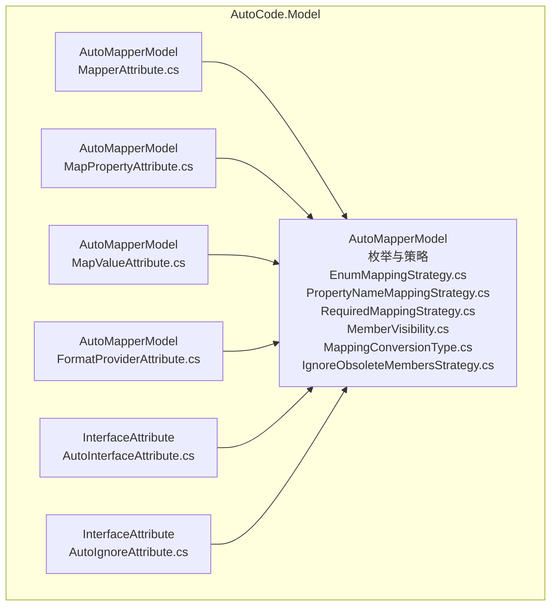
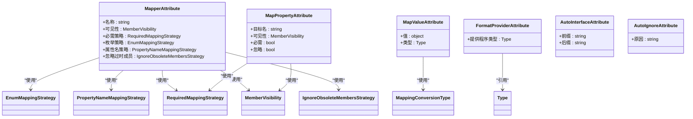
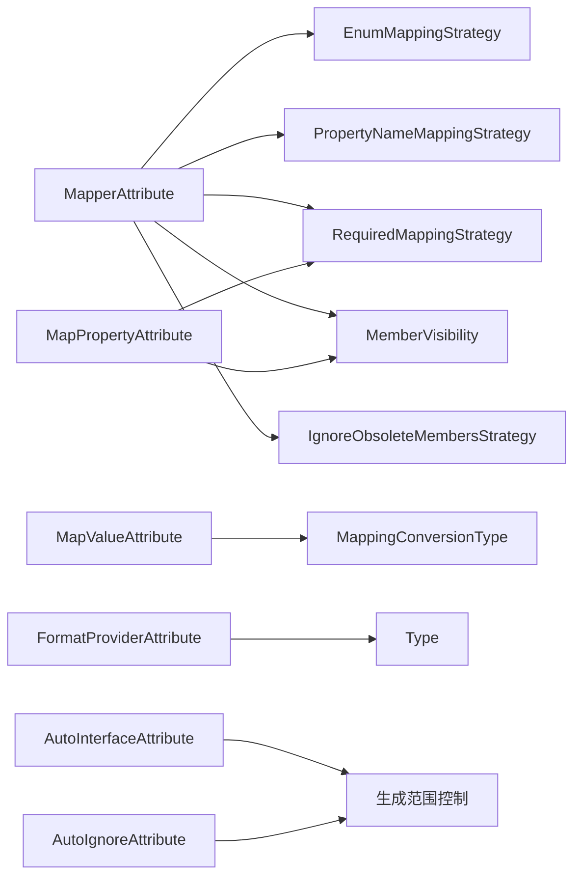

# 属性参考

<cite>
**本文引用的文件**   
- [MapperAttribute.cs](file://src/AutoCode.Model/AutoMapperModel/MapperAttribute.cs)
- [MapPropertyAttribute.cs](file://src/AutoCode.Model/AutoMapperModel/MapPropertyAttribute.cs)
- [MapValueAttribute.cs](file://src/AutoCode.Model/AutoMapperModel/MapValueAttribute.cs)
- [FormatProviderAttribute.cs](file://src/AutoCode.Model/AutoMapperModel/FormatProviderAttribute.cs)
- [AutoInterfaceAttribute.cs](file://src/AutoCode.Model/InterfaceAttribute/AutoInterfaceAttribute.cs)
- [AutoIgnoreAttribute.cs](file://src/AutoCode.Model/InterfaceAttribute/AutoIgnoreAttribute.cs)
- [EnumMappingStrategy.cs](file://src/AutoCode.Model/AutoMapperModel/EnumMappingStrategy.cs)
- [PropertyNameMappingStrategy.cs](file://src/AutoCode.Model/AutoMapperModel/PropertyNameMappingStrategy.cs)
- [RequiredMappingStrategy.cs](file://src/AutoCode.Model/AutoMapperModel/RequiredMappingStrategy.cs)
- [MemberVisibility.cs](file://src/AutoCode.Model/AutoMapperModel/MemberVisibility.cs)
- [MappingConversionType.cs](file://src/AutoCode.Model/AutoMapperModel/MappingConversionType.cs)
- [IgnoreObsoleteMembersStrategy.cs](file://src/AutoCode.Model/AutoMapperModel/IgnoreObsoleteMembersStrategy.cs)
</cite>

## 目录
1. [简介](#简介)
2. [项目结构](#项目结构)
3. [核心组件](#核心组件)
4. [架构总览](#架构总览)
5. [详细组件分析](#详细组件分析)
6. [依赖关系分析](#依赖关系分析)
7. [性能考虑](#性能考虑)
8. [故障排查指南](#故障排查指南)
9. [结论](#结论)
10. [附录](#附录)

## 简介
本文件为 AutoCode 框架的属性系统提供完整的 API 参考，覆盖以下核心特性：
- MapperAttribute：用于类级别的映射配置入口
- MapPropertyAttribute：用于属性级别的映射目标与命名策略控制
- MapValueAttribute：用于属性级别的值转换或常量赋值
- FormatProviderAttribute：用于格式化提供程序（如日期、数字）的注入
- AutoInterfaceAttribute：用于接口自动生成标记
- AutoIgnoreAttribute：用于忽略成员或接口的标记

文档将详细说明每个属性的参数、配置选项、默认值与作用机制，并给出优先级与组合使用方式。同时提供常见配置模式与最佳实践建议，帮助开发者高效使用 AutoCode 进行代码生成与映射。

## 项目结构
AutoCode 的属性定义集中在 AutoCode.Model 项目中，按功能划分为 AutoMapperModel 与 InterfaceAttribute 两个命名空间。这些属性被 SourceGenerator 在编译期读取并驱动代码生成。

图表来源
- [MapperAttribute.cs](file://src/AutoCode.Model/AutoMapperModel/MapperAttribute.cs)
- [MapPropertyAttribute.cs](file://src/AutoCode.Model/AutoMapperModel/MapPropertyAttribute.cs)
- [MapValueAttribute.cs](file://src/AutoCode.Model/AutoMapperModel/MapValueAttribute.cs)
- [FormatProviderAttribute.cs](file://src/AutoCode.Model/AutoMapperModel/FormatProviderAttribute.cs)
- [EnumMappingStrategy.cs](file://src/AutoCode.Model/AutoMapperModel/EnumMappingStrategy.cs)
- [PropertyNameMappingStrategy.cs](file://src/AutoCode.Model/AutoMapperModel/PropertyNameMappingStrategy.cs)
- [RequiredMappingStrategy.cs](file://src/AutoCode.Model/AutoMapperModel/RequiredMappingStrategy.cs)
- [MemberVisibility.cs](file://src/AutoCode.Model/AutoMapperModel/MemberVisibility.cs)
- [MappingConversionType.cs](file://src/AutoCode.Model/AutoMapperModel/MappingConversionType.cs)
- [IgnoreObsoleteMembersStrategy.cs](file://src/AutoCode.Model/AutoMapperModel/IgnoreObsoleteMembersStrategy.cs)
- [AutoInterfaceAttribute.cs](file://src/AutoCode.Model/InterfaceAttribute/AutoInterfaceAttribute.cs)
- [AutoIgnoreAttribute.cs](file://src/AutoCode.Model/InterfaceAttribute/AutoIgnoreAttribute.cs)

章节来源
- [MapperAttribute.cs](file://src/AutoCode.Model/AutoMapperModel/MapperAttribute.cs)
- [MapPropertyAttribute.cs](file://src/AutoCode.Model/AutoMapperModel/MapPropertyAttribute.cs)
- [MapValueAttribute.cs](file://src/AutoCode.Model/AutoMapperModel/MapValueAttribute.cs)
- [FormatProviderAttribute.cs](file://src/AutoCode.Model/AutoMapperModel/FormatProviderAttribute.cs)
- [AutoInterfaceAttribute.cs](file://src/AutoCode.Model/InterfaceAttribute/AutoInterfaceAttribute.cs)
- [AutoIgnoreAttribute.cs](file://src/AutoCode.Model/InterfaceAttribute/AutoIgnoreAttribute.cs)

## 核心组件
本节概述各属性的职责与典型用法场景：
- MapperAttribute：声明一个映射上下文或映射规则集，通常作用于类，作为生成器识别映射目标的入口。
- MapPropertyAttribute：对单个属性进行映射目标重命名、可见性控制、是否必需等细粒度设置。
- MapValueAttribute：为属性指定固定值或表达式结果，常用于常量填充或简单转换。
- FormatProviderAttribute：为需要格式化的类型（如 DateTime、decimal）注入格式化提供程序。
- AutoInterfaceAttribute：标记接口以启用自动实现或代理生成。
- AutoIgnoreAttribute：标记成员或接口以跳过生成或映射。

章节来源
- [MapperAttribute.cs](file://src/AutoCode.Model/AutoMapperModel/MapperAttribute.cs)
- [MapPropertyAttribute.cs](file://src/AutoCode.Model/AutoMapperModel/MapPropertyAttribute.cs)
- [MapValueAttribute.cs](file://src/AutoCode.Model/AutoMapperModel/MapValueAttribute.cs)
- [FormatProviderAttribute.cs](file://src/AutoCode.Model/AutoMapperModel/FormatProviderAttribute.cs)
- [AutoInterfaceAttribute.cs](file://src/AutoCode.Model/InterfaceAttribute/AutoInterfaceAttribute.cs)
- [AutoIgnoreAttribute.cs](file://src/AutoCode.Model/InterfaceAttribute/AutoIgnoreAttribute.cs)

## 架构总览
AutoCode 的属性通过 SourceGenerator 在编译期解析，结合枚举与策略类型，驱动生成映射代码或接口实现。下图展示了属性与策略类型的关系以及它们在生成流程中的角色。

图表来源
- [MapperAttribute.cs](file://src/AutoCode.Model/AutoMapperModel/MapperAttribute.cs)
- [MapPropertyAttribute.cs](file://src/AutoCode.Model/AutoMapperModel/MapPropertyAttribute.cs)
- [MapValueAttribute.cs](file://src/AutoCode.Model/AutoMapperModel/MapValueAttribute.cs)
- [FormatProviderAttribute.cs](file://src/AutoCode.Model/AutoMapperModel/FormatProviderAttribute.cs)
- [AutoInterfaceAttribute.cs](file://src/AutoCode.Model/InterfaceAttribute/AutoInterfaceAttribute.cs)
- [AutoIgnoreAttribute.cs](file://src/AutoCode.Model/InterfaceAttribute/AutoIgnoreAttribute.cs)
- [EnumMappingStrategy.cs](file://src/AutoCode.Model/AutoMapperModel/EnumMappingStrategy.cs)
- [PropertyNameMappingStrategy.cs](file://src/AutoCode.Model/AutoMapperModel/PropertyNameMappingStrategy.cs)
- [RequiredMappingStrategy.cs](file://src/AutoCode.Model/AutoMapperModel/RequiredMappingStrategy.cs)
- [MemberVisibility.cs](file://src/AutoCode.Model/AutoMapperModel/MemberVisibility.cs)
- [MappingConversionType.cs](file://src/AutoCode.Model/AutoMapperModel/MappingConversionType.cs)
- [IgnoreObsoleteMembersStrategy.cs](file://src/AutoCode.Model/AutoMapperModel/IgnoreObsoleteMembersStrategy.cs)

## 详细组件分析

### MapperAttribute
- 作用范围：类级别
- 主要用途：声明映射上下文、可见性、必需性、枚举与属性名映射策略、是否忽略过时成员等
- 关键参数（示例字段/属性名以实际定义为准）：
  - 名称：用于标识映射上下文或生成产物命名
  - 可见性：控制生成成员的访问修饰符
  - 必需策略：控制缺失成员的映射行为
  - 枚举策略：控制枚举映射方式
  - 属性名策略：控制属性名匹配与转换规则
  - 忽略过时成员：是否忽略带有过时标记的成员
- 默认值：由属性定义决定，未显式设置的参数采用框架默认策略
- 使用位置：应用于类
- 优先级：类级配置优先于属性级配置；当两者冲突时，以更具体的配置为准
- 组合使用：可与 MapPropertyAttribute、MapValueAttribute、FormatProviderAttribute 配合，细化到属性级的映射与格式化

章节来源
- [MapperAttribute.cs](file://src/AutoCode.Model/AutoMapperModel/MapperAttribute.cs)
- [MemberVisibility.cs](file://src/AutoCode.Model/AutoMapperModel/MemberVisibility.cs)
- [RequiredMappingStrategy.cs](file://src/AutoCode.Model/AutoMapperModel/RequiredMappingStrategy.cs)
- [EnumMappingStrategy.cs](file://src/AutoCode.Model/AutoMapperModel/EnumMappingStrategy.cs)
- [PropertyNameMappingStrategy.cs](file://src/AutoCode.Model/AutoMapperModel/PropertyNameMappingStrategy.cs)
- [IgnoreObsoleteMembersStrategy.cs](file://src/AutoCode.Model/AutoMapperModel/IgnoreObsoleteMembersStrategy.cs)

### MapPropertyAttribute
- 作用范围：属性级别
- 主要用途：对单个属性进行目标名映射、可见性控制、必需性标记、忽略标记等
- 关键参数（示例字段/属性名以实际定义为准）：
  - 目标名：映射后的目标属性名
  - 可见性：生成成员的访问修饰符
  - 必需：是否为必需映射
  - 忽略：是否跳过该属性的映射
- 默认值：未设置时沿用类级 MapperAttribute 的策略
- 使用位置：应用于属性
- 优先级：属性级配置优先于类级配置
- 组合使用：与 MapperAttribute 共同工作，前者提供全局策略，后者提供局部覆盖

章节来源
- [MapPropertyAttribute.cs](file://src/AutoCode.Model/AutoMapperModel/MapPropertyAttribute.cs)
- [MemberVisibility.cs](file://src/AutoCode.Model/AutoMapperModel/MemberVisibility.cs)
- [RequiredMappingStrategy.cs](file://src/AutoCode.Model/AutoMapperModel/RequiredMappingStrategy.cs)

### MapValueAttribute
- 作用范围：属性级别
- 主要用途：为属性指定固定值或表达式结果，适用于常量填充或简单转换
- 关键参数（示例字段/属性名以实际定义为准）：
  - 值：要赋给属性的值
  - 类型：值的类型，用于确保类型安全
- 默认值：无默认值，必须显式提供
- 使用位置：应用于属性
- 优先级：高于默认映射逻辑，直接覆盖映射结果
- 组合使用：与 MapPropertyAttribute 配合，先确定目标名与可见性，再赋值

章节来源
- [MapValueAttribute.cs](file://src/AutoCode.Model/AutoMapperModel/MapValueAttribute.cs)
- [MappingConversionType.cs](file://src/AutoCode.Model/AutoMapperModel/MappingConversionType.cs)

### FormatProviderAttribute
- 作用范围：属性级别
- 主要用途：为需要格式化的类型（如 DateTime、decimal）注入格式化提供程序
- 关键参数（示例字段/属性名以实际定义为准）：
  - 提供程序类型：格式化提供程序的类型
- 默认值：无默认值，需显式指定
- 使用位置：应用于属性
- 优先级：在映射过程中生效，影响最终输出格式
- 组合使用：与 MapPropertyAttribute 和 MapValueAttribute 协同，确保格式化与赋值顺序正确

章节来源
- [FormatProviderAttribute.cs](file://src/AutoCode.Model/AutoMapperModel/FormatProviderAttribute.cs)

### AutoInterfaceAttribute
- 作用范围：接口级别
- 主要用途：标记接口以启用自动实现或代理生成，可配置前后缀等
- 关键参数（示例字段/属性名以实际定义为准）：
  - 前缀：生成实现类的前缀
  - 后缀：生成实现类的后缀
- 默认值：由框架约定
- 使用位置：应用于接口
- 优先级：接口级标记优先于默认生成规则
- 组合使用：与 AutoIgnoreAttribute 配合，选择性忽略某些成员

章节来源
- [AutoInterfaceAttribute.cs](file://src/AutoCode.Model/InterfaceAttribute/AutoInterfaceAttribute.cs)

### AutoIgnoreAttribute
- 作用范围：成员或接口级别
- 主要用途：标记成员或接口以跳过生成或映射
- 关键参数（示例字段/属性名以实际定义为准）：
  - 原因：忽略的原因说明
- 默认值：无默认值
- 使用位置：应用于属性、方法或接口
- 优先级：最高，一旦标记即跳过处理
- 组合使用：与 AutoInterfaceAttribute 配合，精细化控制生成范围

章节来源
- [AutoIgnoreAttribute.cs](file://src/AutoCode.Model/InterfaceAttribute/AutoIgnoreAttribute.cs)

### 策略与枚举
- EnumMappingStrategy：枚举映射策略，控制枚举如何映射为目标类型
- PropertyNameMappingStrategy：属性名映射策略，控制属性名的匹配与转换规则
- RequiredMappingStrategy：必需性策略，控制缺失成员的映射行为
- MemberVisibility：成员可见性，控制生成成员的访问修饰符
- MappingConversionType：映射转换类型，控制值转换的方式
- IgnoreObsoleteMembersStrategy：过时成员忽略策略，控制是否忽略过时成员

章节来源
- [EnumMappingStrategy.cs](file://src/AutoCode.Model/AutoMapperModel/EnumMappingStrategy.cs)
- [PropertyNameMappingStrategy.cs](file://src/AutoCode.Model/AutoMapperModel/PropertyNameMappingStrategy.cs)
- [RequiredMappingStrategy.cs](file://src/AutoCode.Model/AutoMapperModel/RequiredMappingStrategy.cs)
- [MemberVisibility.cs](file://src/AutoCode.Model/AutoMapperModel/MemberVisibility.cs)
- [MappingConversionType.cs](file://src/AutoCode.Model/AutoMapperModel/MappingConversionType.cs)
- [IgnoreObsoleteMembersStrategy.cs](file://src/AutoCode.Model/AutoMapperModel/IgnoreObsoleteMembersStrategy.cs)

## 依赖关系分析
属性之间的依赖关系主要体现在：
- MapperAttribute 作为类级配置，聚合多种策略类型
- MapPropertyAttribute 与 MapValueAttribute 在属性级覆盖或补充类级策略
- FormatProviderAttribute 在格式化阶段介入，依赖类型信息
- AutoInterfaceAttribute 与 AutoIgnoreAttribute 控制接口与成员的生成范围

图表来源
- [MapperAttribute.cs](file://src/AutoCode.Model/AutoMapperModel/MapperAttribute.cs)
- [MapPropertyAttribute.cs](file://src/AutoCode.Model/AutoMapperModel/MapPropertyAttribute.cs)
- [MapValueAttribute.cs](file://src/AutoCode.Model/AutoMapperModel/MapValueAttribute.cs)
- [FormatProviderAttribute.cs](file://src/AutoCode.Model/AutoMapperModel/FormatProviderAttribute.cs)
- [AutoInterfaceAttribute.cs](file://src/AutoCode.Model/InterfaceAttribute/AutoInterfaceAttribute.cs)
- [AutoIgnoreAttribute.cs](file://src/AutoCode.Model/InterfaceAttribute/AutoIgnoreAttribute.cs)
- [EnumMappingStrategy.cs](file://src/AutoCode.Model/AutoMapperModel/EnumMappingStrategy.cs)
- [PropertyNameMappingStrategy.cs](file://src/AutoCode.Model/AutoMapperModel/PropertyNameMappingStrategy.cs)
- [RequiredMappingStrategy.cs](file://src/AutoCode.Model/AutoMapperModel/RequiredMappingStrategy.cs)
- [MemberVisibility.cs](file://src/AutoCode.Model/AutoMapperModel/MemberVisibility.cs)
- [MappingConversionType.cs](file://src/AutoCode.Model/AutoMapperModel/MappingConversionType.cs)
- [IgnoreObsoleteMembersStrategy.cs](file://src/AutoCode.Model/AutoMapperModel/IgnoreObsoleteMembersStrategy.cs)

## 性能考虑
- 编译期解析：属性在编译期被 SourceGenerator 解析，避免运行时开销
- 最小化生成量：合理使用 AutoIgnoreAttribute 减少不必要的生成代码
- 策略选择：选择合适的映射策略可减少运行时转换成本
- 格式化提供程序：仅在必要时注入 FormatProviderAttribute，避免过度格式化

## 故障排查指南
- 属性未生效：检查属性应用的位置与作用域是否正确
- 映射失败：确认 MapPropertyAttribute 的目标名与类型匹配
- 格式化异常：验证 FormatProviderAttribute 提供的类型是否支持相应格式化
- 生成范围错误：使用 AutoIgnoreAttribute 排除不需要生成的成员或接口

## 结论
AutoCode 的属性系统通过清晰的层次结构与策略机制，提供了强大的映射与接口生成功能。合理使用 MapperAttribute、MapPropertyAttribute、MapValueAttribute、FormatProviderAttribute、AutoInterfaceAttribute 与 AutoIgnoreAttribute，可以在保证灵活性的同时提升开发效率。建议遵循本文档的配置模式与最佳实践，以获得稳定且高效的代码生成体验。

## 附录
- 常见配置模式：
  - 类级统一策略 + 属性级精细覆盖
  - 接口自动生成 + 选择性忽略
  - 格式化提供程序按需注入
- 最佳实践：
  - 明确命名策略与可见性，保持一致性
  - 谨慎使用忽略标记，避免遗漏必要成员
  - 合理选择映射策略，平衡性能与可读性