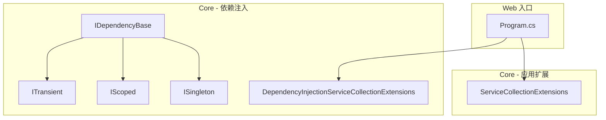
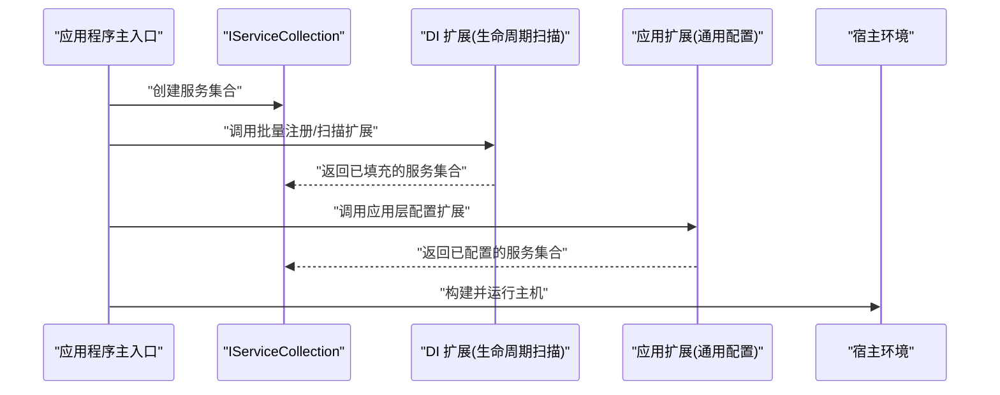
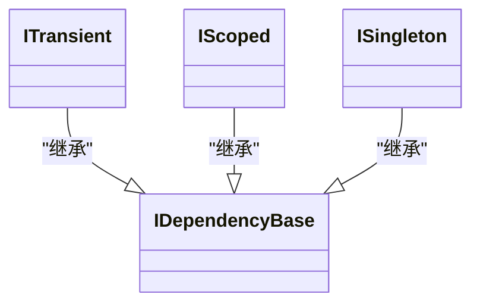
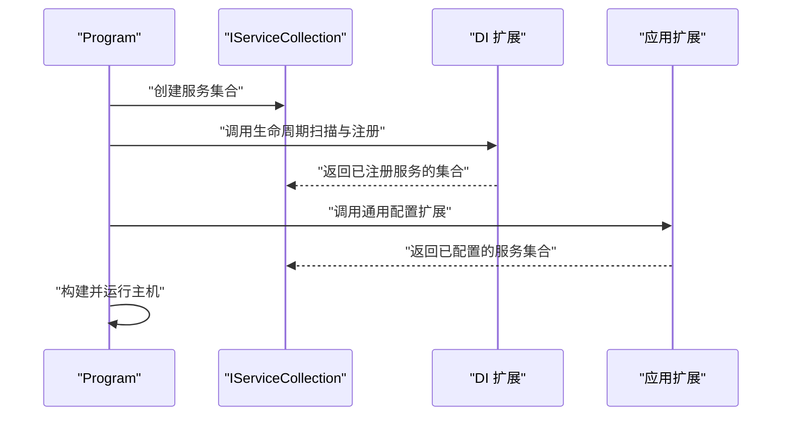
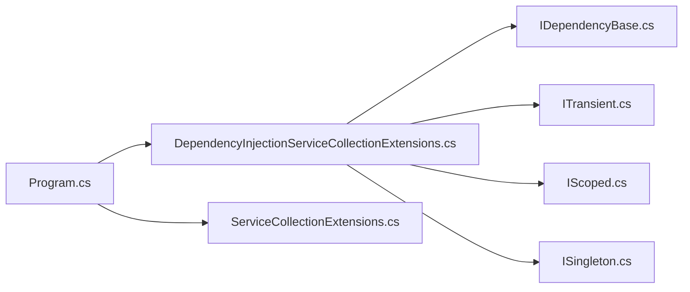

# 扩展方法参考

<cite>
**本文引用的文件**   
- [DependencyInjectionServiceCollectionExtensions.cs](file://src/APP.WebAPI.Core/DependencyInjection/DependencyInjectionServiceCollectionExtensions.cs)
- [ServiceCollectionExtensions.cs](file://src/APP.WebAPI.Core/Application/Extensions/ServiceCollectionExtensions.cs)
- [IDependencyBase.cs](file://src/APP.WebAPI.Core/DependencyInjection/LifeType/IDependencyBase.cs)
- [IScoped.cs](file://src/APP.WebAPI.Core/DependencyInjection/LifeType/IScoped.cs)
- [ISingleton.cs](file://src/APP.WebAPI.Core/DependencyInjection/LifeType/ISingleton.cs)
- [ITransient.cs](file://src/APP.WebAPI.Core/DependencyInjection/LifeType/ITransient.cs)
- [Program.cs](file://src/APP.WebAPI/Program.cs)
</cite>

## 目录
1. [简介](#简介)
2. [项目结构](#项目结构)
3. [核心组件](#核心组件)
4. [架构总览](#架构总览)
5. [详细组件分析](#详细组件分析)
6. [依赖关系分析](#依赖关系分析)
7. [性能考虑](#性能考虑)
8. [故障排查指南](#故障排查指南)
9. [结论](#结论)
10. [附录](#附录)

## 简介
本参考文档聚焦于 AutoCode 框架中与依赖注入和服务注册相关的扩展方法，重点覆盖以下两类：
- DependencyInjectionServiceCollectionExtensions：提供面向生命周期接口的批量服务注册与扫描能力。
- ServiceCollectionExtensions：提供应用层常用的服务配置与便捷注册扩展。

同时，文档将解释这些扩展方法的设计原理、适用场景、参数与返回值约定，并给出在 ASP.NET Core 项目中的使用示例路径与最佳实践建议。

## 项目结构
AutoCode 的依赖注入扩展位于 APP.WebAPI.Core 项目中，围绕生命周期接口（Transient、Scoped、Singleton）与基础接口（IDependencyBase）构建统一的注册策略；应用层扩展位于 Application/Extensions 下，用于简化常见配置流程。

图表来源
- [DependencyInjectionServiceCollectionExtensions.cs](file://src/APP.WebAPI.Core/DependencyInjection/DependencyInjectionServiceCollectionExtensions.cs)
- [ServiceCollectionExtensions.cs](file://src/APP.WebAPI.Core/Application/Extensions/ServiceCollectionExtensions.cs)
- [IDependencyBase.cs](file://src/APP.WebAPI.Core/DependencyInjection/LifeType/IDependencyBase.cs)
- [IScoped.cs](file://src/APP.WebAPI.Core/DependencyInjection/LifeType/IScoped.cs)
- [ISingleton.cs](file://src/APP.WebAPI.Core/DependencyInjection/LifeType/ISingleton.cs)
- [ITransient.cs](file://src/APP.WebAPI.Core/DependencyInjection/LifeType/ITransient.cs)
- [Program.cs](file://src/APP.WebAPI/Program.cs)

章节来源
- [DependencyInjectionServiceCollectionExtensions.cs](file://src/APP.WebAPI.Core/DependencyInjection/DependencyInjectionServiceCollectionExtensions.cs)
- [ServiceCollectionExtensions.cs](file://src/APP.WebAPI.Core/Application/Extensions/ServiceCollectionExtensions.cs)
- [IDependencyBase.cs](file://src/APP.WebAPI.Core/DependencyInjection/LifeType/IDependencyBase.cs)
- [IScoped.cs](file://src/APP.WebAPI.Core/DependencyInjection/LifeType/IScoped.cs)
- [ISingleton.cs](file://src/APP.WebAPI.Core/DependencyInjection/LifeType/ISingleton.cs)
- [ITransient.cs](file://src/APP.WebAPI.Core/DependencyInjection/LifeType/ITransient.cs)
- [Program.cs](file://src/APP.WebAPI/Program.cs)

## 核心组件
本节概述扩展方法所在的核心类型与职责边界：
- IDependencyBase：定义依赖项的基础契约，通常用于标记可被自动发现与注册的类型。
- ITransient / IScoped / ISingleton：分别表示瞬态、作用域、单例三种生命周期，便于按生命周期分类扫描与注册。
- DependencyInjectionServiceCollectionExtensions：基于上述接口对 IServiceCollection 进行扩展，提供批量注册、按程序集扫描、按命名约定过滤等能力。
- ServiceCollectionExtensions：面向应用层的便捷扩展，封装常用配置步骤（如中间件、日志、序列化、健康检查等），减少样板代码。

章节来源
- [IDependencyBase.cs](file://src/APP.WebAPI.Core/DependencyInjection/LifeType/IDependencyBase.cs)
- [IScoped.cs](file://src/APP.WebAPI.Core/DependencyInjection/LifeType/IScoped.cs)
- [ISingleton.cs](file://src/APP.WebAPI.Core/DependencyInjection/LifeType/ISingleton.cs)
- [ITransient.cs](file://src/APP.WebAPI.Core/DependencyInjection/LifeType/ITransient.cs)
- [DependencyInjectionServiceCollectionExtensions.cs](file://src/APP.WebAPI.Core/DependencyInjection/DependencyInjectionServiceCollectionExtensions.cs)
- [ServiceCollectionExtensions.cs](file://src/APP.WebAPI.Core/Application/Extensions/ServiceCollectionExtensions.cs)

## 架构总览
下图展示了扩展方法在启动管线中的位置与调用顺序：Program 初始化容器后，依次调用 DI 扩展与应用扩展，完成服务注册与通用配置。

图表来源
- [Program.cs](file://src/APP.WebAPI/Program.cs)
- [DependencyInjectionServiceCollectionExtensions.cs](file://src/APP.WebAPI.Core/DependencyInjection/DependencyInjectionServiceCollectionExtensions.cs)
- [ServiceCollectionExtensions.cs](file://src/APP.WebAPI.Core/Application/Extensions/ServiceCollectionExtensions.cs)

## 详细组件分析

### 生命周期接口设计
- IDependencyBase：作为所有可注入依赖的基类或标记接口，便于统一识别与处理。
- ITransient / IScoped / ISingleton：继承自 IDependencyBase，明确声明生命周期，供扫描器按类别注册。

图表来源
- [IDependencyBase.cs](file://src/APP.WebAPI.Core/DependencyInjection/LifeType/IDependencyBase.cs)
- [IScoped.cs](file://src/APP.WebAPI.Core/DependencyInjection/LifeType/IScoped.cs)
- [ISingleton.cs](file://src/APP.WebAPI.Core/DependencyInjection/LifeType/ISingleton.cs)
- [ITransient.cs](file://src/APP.WebAPI.Core/DependencyInjection/LifeType/ITransient.cs)

章节来源
- [IDependencyBase.cs](file://src/APP.WebAPI.Core/DependencyInjection/LifeType/IDependencyBase.cs)
- [IScoped.cs](file://src/APP.WebAPI.Core/DependencyInjection/LifeType/IScoped.cs)
- [ISingleton.cs](file://src/APP.WebAPI.Core/DependencyInjection/LifeType/ISingleton.cs)
- [ITransient.cs](file://src/APP.WebAPI.Core/DependencyInjection/LifeType/ITransient.cs)

### DependencyInjectionServiceCollectionExtensions
该扩展为 IServiceCollection 提供依赖注入相关的能力，典型功能包括：
- 按程序集扫描实现指定生命周期接口的类型，并自动注册到容器中。
- 支持按命名约定或自定义筛选条件排除/包含特定类型。
- 支持一次性注册多个程序集，避免重复遍历。
- 提供重载以允许传入额外配置（如忽略某些命名空间、仅注册公共类等）。

使用要点
- 适用于“约定优于配置”的场景，减少手动 AddTransient/AddScoped/AddSingleton 的样板代码。
- 建议在启动阶段集中调用一次，避免重复扫描影响性能。
- 若存在循环依赖，应通过重构或引入工厂模式解决。

章节来源
- [DependencyInjectionServiceCollectionExtensions.cs](file://src/APP.WebAPI.Core/DependencyInjection/DependencyInjectionServiceCollectionExtensions.cs)

### ServiceCollectionExtensions
该扩展聚焦应用层通用配置的便捷封装，典型功能包括：
- 快速启用常用中间件（如异常处理、请求日志、路由等）。
- 统一配置 JSON 序列化、模型验证、CORS、认证等。
- 集成健康检查、指标收集、外部服务连接串管理等。
- 提供链式 API，提升可读性与可维护性。

使用要点
- 将分散的配置逻辑收敛到单一调用点，降低启动复杂度。
- 可按环境切换不同配置分支（开发/生产）。
- 与 DI 扩展配合使用，确保服务注册与配置顺序正确。

章节来源
- [ServiceCollectionExtensions.cs](file://src/APP.WebAPI.Core/Application/Extensions/ServiceCollectionExtensions.cs)

### 在 Program.cs 中的组合使用
Program 中通常会先构建 IServiceCollection，然后依次调用 DI 扩展与应用扩展，最后构建并运行主机。

图表来源
- [Program.cs](file://src/APP.WebAPI/Program.cs)
- [DependencyInjectionServiceCollectionExtensions.cs](file://src/APP.WebAPI.Core/DependencyInjection/DependencyInjectionServiceCollectionExtensions.cs)
- [ServiceCollectionExtensions.cs](file://src/APP.WebAPI.Core/Application/Extensions/ServiceCollectionExtensions.cs)

章节来源
- [Program.cs](file://src/APP.WebAPI/Program.cs)

## 依赖关系分析
- DI 扩展依赖生命周期接口（IDependencyBase、ITransient、IScoped、ISingleton）来识别与分类待注册的类型。
- 应用扩展依赖 .NET 内置的 IServiceCollection 与常用中间件/配置 API，提供高层封装。
- Program 作为入口，串联 DI 扩展与应用扩展，形成完整的启动流程。

图表来源
- [Program.cs](file://src/APP.WebAPI/Program.cs)
- [DependencyInjectionServiceCollectionExtensions.cs](file://src/APP.WebAPI.Core/DependencyInjection/DependencyInjectionServiceCollectionExtensions.cs)
- [ServiceCollectionExtensions.cs](file://src/APP.WebAPI.Core/Application/Extensions/ServiceCollectionExtensions.cs)
- [IDependencyBase.cs](file://src/APP.WebAPI.Core/DependencyInjection/LifeType/IDependencyBase.cs)
- [IScoped.cs](file://src/APP.WebAPI.Core/DependencyInjection/LifeType/IScoped.cs)
- [ISingleton.cs](file://src/APP.WebAPI.Core/DependencyInjection/LifeType/ISingleton.cs)
- [ITransient.cs](file://src/APP.WebAPI.Core/DependencyInjection/LifeType/ITransient.cs)

章节来源
- [Program.cs](file://src/APP.WebAPI/Program.cs)
- [DependencyInjectionServiceCollectionExtensions.cs](file://src/APP.WebAPI.Core/DependencyInjection/DependencyInjectionServiceCollectionExtensions.cs)
- [ServiceCollectionExtensions.cs](file://src/APP.WebAPI.Core/Application/Extensions/ServiceCollectionExtensions.cs)
- [IDependencyBase.cs](file://src/APP.WebAPI.Core/DependencyInjection/LifeType/IDependencyBase.cs)
- [IScoped.cs](file://src/APP.WebAPI.Core/DependencyInjection/LifeType/IScoped.cs)
- [ISingleton.cs](file://src/APP.WebAPI.Core/DependencyInjection/LifeType/ISingleton.cs)
- [ITransient.cs](file://src/APP.WebAPI.Core/DependencyInjection/LifeType/ITransient.cs)

## 性能考虑
- 扫描范围控制：仅在启动时执行一次程序集扫描，避免在热路径重复反射。
- 筛选条件优化：通过命名约定或特性标记缩小扫描范围，减少不必要的类型判断。
- 生命周期选择：优先使用 Scoped 或 Transient 以降低全局状态风险；仅在确需共享时使用 Singleton。
- 配置合并：将相似配置合并到单个扩展调用，减少多次遍历与对象分配。
- 延迟初始化：对重型服务采用工厂或 Lazy<T> 按需实例化。

[本节为通用指导，不直接分析具体文件]

## 故障排查指南
常见问题与定位思路：
- 未找到类型：确认程序集是否被正确加载，扫描路径是否包含目标命名空间。
- 循环依赖：检查构造函数注入是否存在环，必要时引入工厂或事件总线解耦。
- 生命周期误用：Singleton 中注入 Scoped/Transient 会导致捕获异常，应调整生命周期或使用工厂。
- 配置顺序错误：确保 DI 扩展先于应用扩展调用，避免后续配置覆盖先前设置。
- 中间件顺序问题：按业务需求调整中间件注册顺序，确保鉴权、日志、异常处理等生效。

章节来源
- [DependencyInjectionServiceCollectionExtensions.cs](file://src/APP.WebAPI.Core/DependencyInjection/DependencyInjectionServiceCollectionExtensions.cs)
- [ServiceCollectionExtensions.cs](file://src/APP.WebAPI.Core/Application/Extensions/ServiceCollectionExtensions.cs)
- [Program.cs](file://src/APP.WebAPI/Program.cs)

## 结论
通过生命周期接口与扩展方法的组合，AutoCode 实现了“约定优于配置”的依赖注入与通用配置体系。开发者只需遵循约定并在 Program 中集中调用扩展方法，即可快速完成服务注册与系统配置，显著提升开发效率与代码一致性。

[本节为总结性内容，不直接分析具体文件]

## 附录
- 使用建议
  - 将业务服务按生命周期接口划分，便于扫描与注册。
  - 将通用配置集中在应用扩展中，保持启动代码简洁。
  - 在单元测试中复用扩展方法，减少重复配置。
- 参考路径
  - 启动入口示例：[Program.cs](file://src/APP.WebAPI/Program.cs)
  - 生命周期接口定义：[IDependencyBase.cs](file://src/APP.WebAPI.Core/DependencyInjection/LifeType/IDependencyBase.cs)、[IScoped.cs](file://src/APP.WebAPI.Core/DependencyInjection/LifeType/IScoped.cs)、[ISingleton.cs](file://src/APP.WebAPI.Core/DependencyInjection/LifeType/ISingleton.cs)、[ITransient.cs](file://src/APP.WebAPI.Core/DependencyInjection/LifeType/ITransient.cs)
  - DI 扩展实现：[DependencyInjectionServiceCollectionExtensions.cs](file://src/APP.WebAPI.Core/DependencyInjection/DependencyInjectionServiceCollectionExtensions.cs)
  - 应用扩展实现：[ServiceCollectionExtensions.cs](file://src/APP.WebAPI.Core/Application/Extensions/ServiceCollectionExtensions.cs)