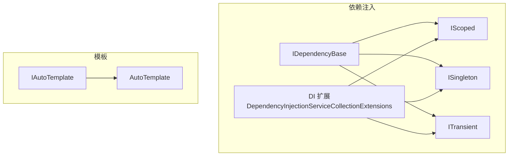
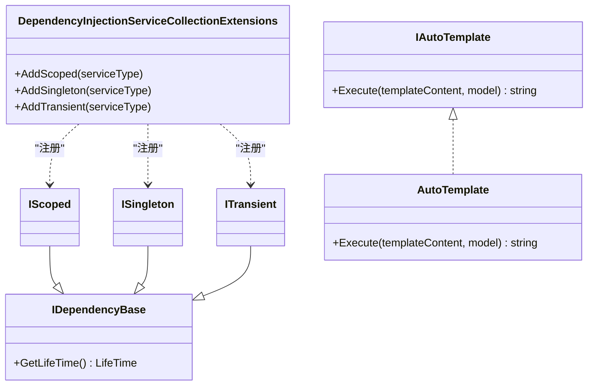
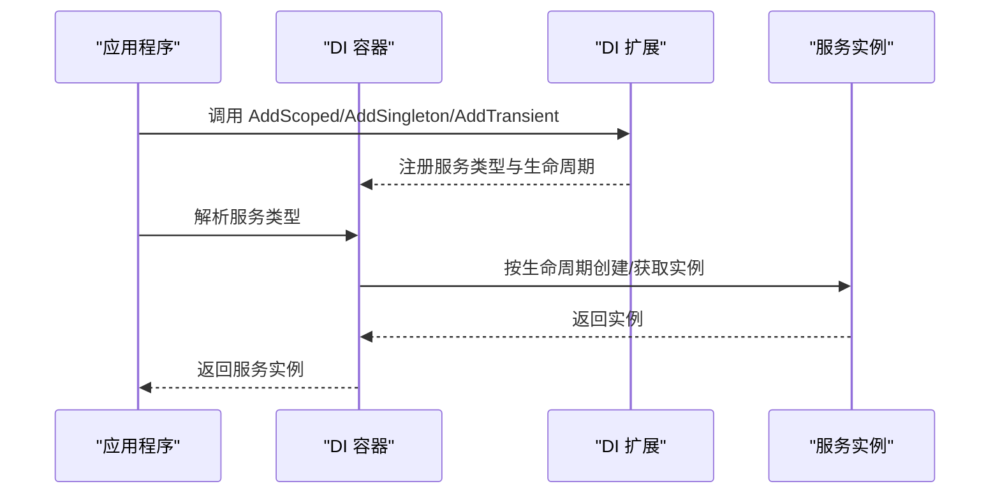
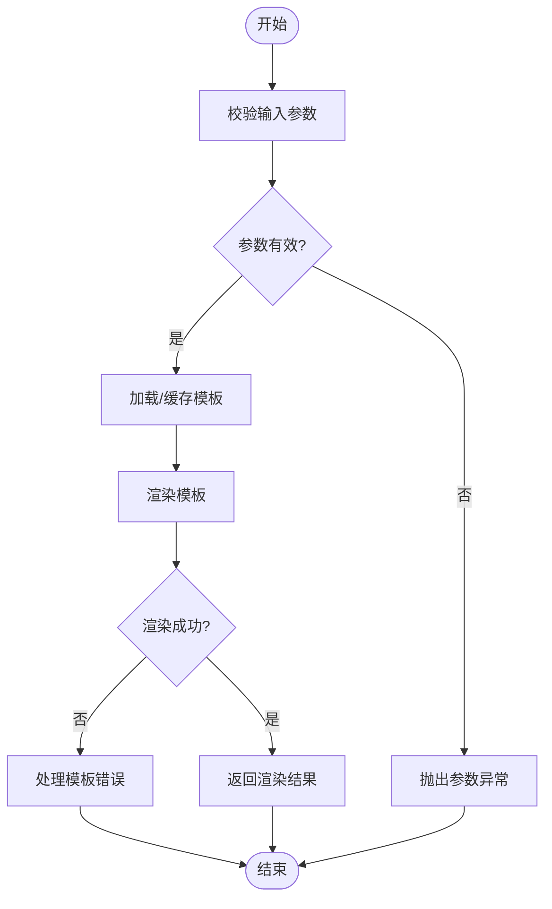
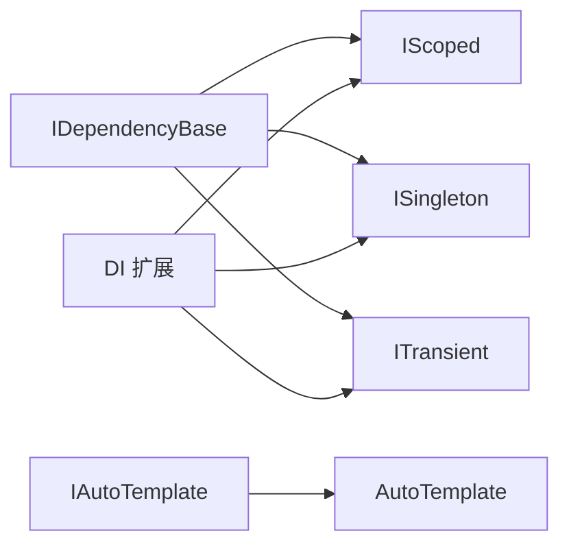

# 接口参考

<cite>
**本文引用的文件**   
- [IDependencyBase.cs](file://src/APP.WebAPI.Core/DependencyInjection/LifeType/IDependencyBase.cs)
- [IScoped.cs](file://src/APP.WebAPI.Core/DependencyInjection/LifeType/IScoped.cs)
- [ISingleton.cs](file://src/APP.WebAPI.Core/DependencyInjection/LifeType/ISingleton.cs)
- [ITransient.cs](file://src/APP.WebAPI.Core/DependencyInjection/LifeType/ITransient.cs)
- [IAutoTemplate.cs](file://src/DotTemplate.APP/IAutoTemplate.cs)
- [AutoTemplate.cs](file://src/DotTemplate.APP/AutoTemplate.cs)
- [DependencyInjectionServiceCollectionExtensions.cs](file://src/APP.WebAPI.Core/DependencyInjection/DependencyInjectionServiceCollectionExtensions.cs)
</cite>

## 目录
1. [简介](#简介)
2. [项目结构](#项目结构)
3. [核心组件](#核心组件)
4. [架构总览](#架构总览)
5. [详细组件分析](#详细组件分析)
6. [依赖关系分析](#依赖关系分析)
7. [性能考量](#性能考量)
8. [故障排查指南](#故障排查指南)
9. [结论](#结论)
10. [附录](#附录)

## 简介
本文件为 AutoCode 框架的接口参考文档，聚焦以下核心接口与模板能力：
- IDependencyBase：依赖注入基类约定
- IScoped、ISingleton、ITransient：生命周期标记接口
- IAutoTemplate：模板执行契约
- AutoTemplate：模板执行实现

文档涵盖方法签名、参数约束、实现要求、生命周期管理、错误处理与边界情况、使用场景与最佳实践，以及与依赖注入容器的集成方式和配置选项。

## 项目结构
与接口相关的代码主要位于以下位置：
- 依赖注入生命周期接口：src/APP.WebAPI.Core/DependencyInjection/LifeType
- 模板接口与实现：src/DotTemplate.APP
- DI 容器扩展：src/APP.WebAPI.Core/DependencyInjection

图表来源
- [IDependencyBase.cs](file://src/APP.WebAPI.Core/DependencyInjection/LifeType/IDependencyBase.cs)
- [IScoped.cs](file://src/APP.WebAPI.Core/DependencyInjection/LifeType/IScoped.cs)
- [ISingleton.cs](file://src/APP.WebAPI.Core/DependencyInjection/LifeType/ISingleton.cs)
- [ITransient.cs](file://src/APP.WebAPI.Core/DependencyInjection/LifeType/ITransient.cs)
- [DependencyInjectionServiceCollectionExtensions.cs](file://src/APP.WebAPI.Core/DependencyInjection/DependencyInjectionServiceCollectionExtensions.cs)
- [IAutoTemplate.cs](file://src/DotTemplate.APP/IAutoTemplate.cs)
- [AutoTemplate.cs](file://src/DotTemplate.APP/AutoTemplate.cs)

章节来源
- [IDependencyBase.cs](file://src/APP.WebAPI.Core/DependencyInjection/LifeType/IDependencyBase.cs)
- [IScoped.cs](file://src/APP.WebAPI.Core/DependencyInjection/LifeType/IScoped.cs)
- [ISingleton.cs](file://src/APP.WebAPI.Core/DependencyInjection/LifeType/ISingleton.cs)
- [ITransient.cs](file://src/APP.WebAPI.Core/DependencyInjection/LifeType/ITransient.cs)
- [IAutoTemplate.cs](file://src/DotTemplate.APP/IAutoTemplate.cs)
- [AutoTemplate.cs](file://src/DotTemplate.APP/AutoTemplate.cs)
- [DependencyInjectionServiceCollectionExtensions.cs](file://src/APP.WebAPI.Core/DependencyInjection/DependencyInjectionServiceCollectionExtensions.cs)

## 核心组件
本节对每个核心接口进行规范说明，包括设计意图、方法签名、参数约束、实现要求、生命周期管理与集成方式。

### IDependencyBase
- 设计意图
  - 作为所有可被依赖注入容器识别的服务基类约定，提供统一的“生命周期选择”入口。
- 方法签名（概念）
  - GetLifeTime() : LifeTime
- 参数约束
  - 无参数
- 返回值
  - 返回服务在容器中的生命周期枚举值
- 实现要求
  - 必须返回有效的生命周期枚举值
  - 若未实现或返回无效值，应抛出明确异常（如 InvalidOperation）
- 生命周期管理
  - 由 DI 容器根据返回值决定实例化策略（瞬态、作用域、单例）
- 错误处理与边界情况
  - 空引用检查：确保上下文有效
  - 非法枚举值：抛出异常并记录诊断信息
- 使用场景
  - 需要以编程方式声明服务生命周期的场景
- 最佳实践
  - 避免在构造函数中执行重逻辑；将初始化放入 GetLifeTime 之外的显式初始化方法
  - 保持 GetLifeTime 幂等且快速

章节来源
- [IDependencyBase.cs](file://src/APP.WebAPI.Core/DependencyInjection/LifeType/IDependencyBase.cs)

### IScoped
- 设计意图
  - 标记服务为“作用域”生命周期，在请求或工作单元内共享同一实例。
- 方法签名（概念）
  - 继承自 IDependencyBase，不新增方法
- 参数约束
  - 无
- 返回值
  - 通过基类 GetLifeTime 返回 Scoped
- 实现要求
  - 仅作为标记接口，无需额外实现
- 生命周期管理
  - 容器在同一作用域内复用同一实例；作用域结束释放
- 错误处理与边界情况
  - 跨作用域共享实例会导致状态污染，应避免持有可变状态
- 使用场景
  - 数据库上下文、请求级缓存、用户会话数据等
- 最佳实践
  - 避免持有长生命周期依赖的单例引用
  - 线程安全：作用域内并发访问需自行保证

章节来源
- [IScoped.cs](file://src/APP.WebAPI.Core/DependencyInjection/LifeType/IScoped.cs)

### ISingleton
- 设计意图
  - 标记服务为“单例”生命周期，应用生命周期内唯一实例。
- 方法签名（概念）
  - 继承自 IDependencyBase，不新增方法
- 参数约束
  - 无
- 返回值
  - 通过基类 GetLifeTime 返回 Singleton
- 实现要求
  - 仅作为标记接口，无需额外实现
- 生命周期管理
  - 容器启动时创建一次，应用退出前一直存在
- 错误处理与边界情况
  - 多线程并发访问需考虑同步
  - 避免捕获请求级资源（如 DbContext）
- 使用场景
  - 配置读取器、日志器、全局缓存（需谨慎）
- 最佳实践
  - 只读或不可变数据优先
  - 外部依赖应为更短生命周期或线程安全

章节来源
- [ISingleton.cs](file://src/APP.WebAPI.Core/DependencyInjection/LifeType/ISingleton.cs)

### ITransient
- 设计意图
  - 标记服务为“瞬态”生命周期，每次解析都创建新实例。
- 方法签名（概念）
  - 继承自 IDependencyBase，不新增方法
- 参数约束
  - 无
- 返回值
  - 通过基类 GetLifeTime 返回 Transient
- 实现要求
  - 仅作为标记接口，无需额外实现
- 生命周期管理
  - 容器每次解析均新建实例，调用方负责释放（如需 IDisposable）
- 错误处理与边界情况
  - 频繁创建可能带来 GC 压力，注意对象大小与创建成本
- 使用场景
  - 轻量、无状态、一次性使用的服务
- 最佳实践
  - 避免持有长生命周期依赖
  - 合理拆分职责，减少构造开销

章节来源
- [ITransient.cs](file://src/APP.WebAPI.Core/DependencyInjection/LifeType/ITransient.cs)

### IAutoTemplate
- 设计意图
  - 定义模板引擎的统一执行契约，便于在不同模板后端间切换。
- 方法签名（概念）
  - Execute(templateContent, model) : string
- 参数约束
  - templateContent：非空字符串，包含模板内容
  - model：可为 null，但模板需兼容空模型
- 返回值
  - 渲染后的字符串结果
- 实现要求
  - 对输入进行校验，抛出自定义异常或标准异常
  - 支持变量替换、条件分支、循环等模板语法（由具体实现决定）
- 错误处理与边界情况
  - 模板语法错误：返回清晰错误消息
  - 大模板渲染：考虑流式或分块渲染
- 使用场景
  - 代码生成、配置文件生成、报表输出
- 最佳实践
  - 模板内容缓存以提升性能
  - 模型序列化前进行验证

章节来源
- [IAutoTemplate.cs](file://src/DotTemplate.APP/IAutoTemplate.cs)

### AutoTemplate（实现）
- 设计意图
  - 提供 IAutoTemplate 的具体实现，完成模板渲染。
- 关键行为
  - 接收模板内容与模型，执行渲染并返回字符串
  - 内部可能使用第三方模板引擎或自定义解析器
- 错误处理
  - 模板解析失败、运行时异常统一包装为业务异常
- 性能优化
  - 编译/缓存模板 AST
  - 重用模型绑定上下文

章节来源
- [AutoTemplate.cs](file://src/DotTemplate.APP/AutoTemplate.cs)

## 架构总览
下图展示了生命周期接口与 DI 扩展之间的关系，以及模板接口的角色。

图表来源
- [IDependencyBase.cs](file://src/APP.WebAPI.Core/DependencyInjection/LifeType/IDependencyBase.cs)
- [IScoped.cs](file://src/APP.WebAPI.Core/DependencyInjection/LifeType/IScoped.cs)
- [ISingleton.cs](file://src/APP.WebAPI.Core/DependencyInjection/LifeType/ISingleton.cs)
- [ITransient.cs](file://src/APP.WebAPI.Core/DependencyInjection/LifeType/ITransient.cs)
- [DependencyInjectionServiceCollectionExtensions.cs](file://src/APP.WebAPI.Core/DependencyInjection/DependencyInjectionServiceCollectionExtensions.cs)
- [IAutoTemplate.cs](file://src/DotTemplate.APP/IAutoTemplate.cs)
- [AutoTemplate.cs](file://src/DotTemplate.APP/AutoTemplate.cs)

## 详细组件分析

### 生命周期接口与 DI 容器集成
- 集成方式
  - 通过 DI 扩展方法按生命周期注册服务类型
  - 容器在解析时依据生命周期创建或复用实例
- 典型流程（序列图）

图表来源
- [DependencyInjectionServiceCollectionExtensions.cs](file://src/APP.WebAPI.Core/DependencyInjection/DependencyInjectionServiceCollectionExtensions.cs)

章节来源
- [DependencyInjectionServiceCollectionExtensions.cs](file://src/APP.WebAPI.Core/DependencyInjection/DependencyInjectionServiceCollectionExtensions.cs)

### 模板执行流程（IAutoTemplate）
- 执行流程（流程图）

图表来源
- [IAutoTemplate.cs](file://src/DotTemplate.APP/IAutoTemplate.cs)
- [AutoTemplate.cs](file://src/DotTemplate.APP/AutoTemplate.cs)

章节来源
- [IAutoTemplate.cs](file://src/DotTemplate.APP/IAutoTemplate.cs)
- [AutoTemplate.cs](file://src/DotTemplate.APP/AutoTemplate.cs)

## 依赖关系分析
- 耦合度
  - 生命周期接口之间松耦合，仅通过基类关联
  - DI 扩展与生命周期接口解耦，通过扩展方法暴露注册能力
- 外部依赖
  - 依赖 .NET 依赖注入容器（Microsoft.Extensions.DependencyInjection）
- 潜在循环依赖
  - 生命周期接口无相互引用，避免循环依赖
- 接口契约
  - IDependencyBase 定义生命周期选择契约
  - IAutoTemplate 定义模板渲染契约

图表来源
- [IDependencyBase.cs](file://src/APP.WebAPI.Core/DependencyInjection/LifeType/IDependencyBase.cs)
- [IScoped.cs](file://src/APP.WebAPI.Core/DependencyInjection/LifeType/IScoped.cs)
- [ISingleton.cs](file://src/APP.WebAPI.Core/DependencyInjection/LifeType/ISingleton.cs)
- [ITransient.cs](file://src/APP.WebAPI.Core/DependencyInjection/LifeType/ITransient.cs)
- [DependencyInjectionServiceCollectionExtensions.cs](file://src/APP.WebAPI.Core/DependencyInjection/DependencyInjectionServiceCollectionExtensions.cs)
- [IAutoTemplate.cs](file://src/DotTemplate.APP/IAutoTemplate.cs)
- [AutoTemplate.cs](file://src/DotTemplate.APP/AutoTemplate.cs)

章节来源
- [IDependencyBase.cs](file://src/APP.WebAPI.Core/DependencyInjection/LifeType/IDependencyBase.cs)
- [IScoped.cs](file://src/APP.WebAPI.Core/DependencyInjection/LifeType/IScoped.cs)
- [ISingleton.cs](file://src/APP.WebAPI.Core/DependencyInjection/LifeType/ISingleton.cs)
- [ITransient.cs](file://src/APP.WebAPI.Core/DependencyInjection/LifeType/ITransient.cs)
- [DependencyInjectionServiceCollectionExtensions.cs](file://src/APP.WebAPI.Core/DependencyInjection/DependencyInjectionServiceCollectionExtensions.cs)
- [IAutoTemplate.cs](file://src/DotTemplate.APP/IAutoTemplate.cs)
- [AutoTemplate.cs](file://src/DotTemplate.APP/AutoTemplate.cs)

## 性能考量
- 生命周期选择
  - 单例适合无状态、高复用服务；避免持有请求级资源
  - 作用域适合请求级上下文；避免跨作用域共享
  - 瞬态适合轻量、一次性服务；避免频繁创建大对象
- 模板渲染
  - 缓存模板 AST 或编译结果
  - 对大模型进行按需字段映射，减少序列化开销
- 内存与 GC
  - 控制对象生命周期，及时释放资源
  - 避免在单例中持有大量临时对象

## 故障排查指南
- 常见问题
  - 生命周期误用导致状态污染或内存泄漏
  - 模板渲染失败：语法错误或模型字段缺失
  - DI 解析失败：未正确注册或循环依赖
- 定位步骤
  - 检查 DI 注册顺序与生命周期
  - 启用详细日志，记录模板渲染过程
  - 使用最小复现用例隔离问题
- 错误处理建议
  - 统一异常封装，区分参数错误与系统错误
  - 提供清晰的错误码与提示

## 结论
- IDependencyBase 及其生命周期子接口提供了清晰的服务生命周期约定
- IAutoTemplate 抽象了模板渲染能力，便于扩展与替换
- 结合 DI 扩展可实现灵活的服务注册与解析
- 遵循最佳实践可有效提升稳定性与性能

## 附录
- 使用示例（路径指引）
  - 生命周期接口定义：[IDependencyBase.cs](file://src/APP.WebAPI.Core/DependencyInjection/LifeType/IDependencyBase.cs)、[IScoped.cs](file://src/APP.WebAPI.Core/DependencyInjection/LifeType/IScoped.cs)、[ISingleton.cs](file://src/APP.WebAPI.Core/DependencyInjection/LifeType/ISingleton.cs)、[ITransient.cs](file://src/APP.WebAPI.Core/DependencyInjection/LifeType/ITransient.cs)
  - 模板接口与实现：[IAutoTemplate.cs](file://src/DotTemplate.APP/IAutoTemplate.cs)、[AutoTemplate.cs](file://src/DotTemplate.APP/AutoTemplate.cs)
  - DI 容器扩展：[DependencyInjectionServiceCollectionExtensions.cs](file://src/APP.WebAPI.Core/DependencyInjection/DependencyInjectionServiceCollectionExtensions.cs)