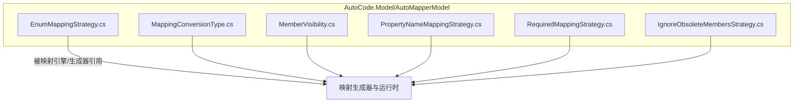
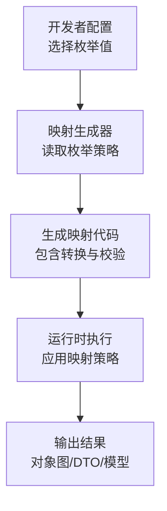
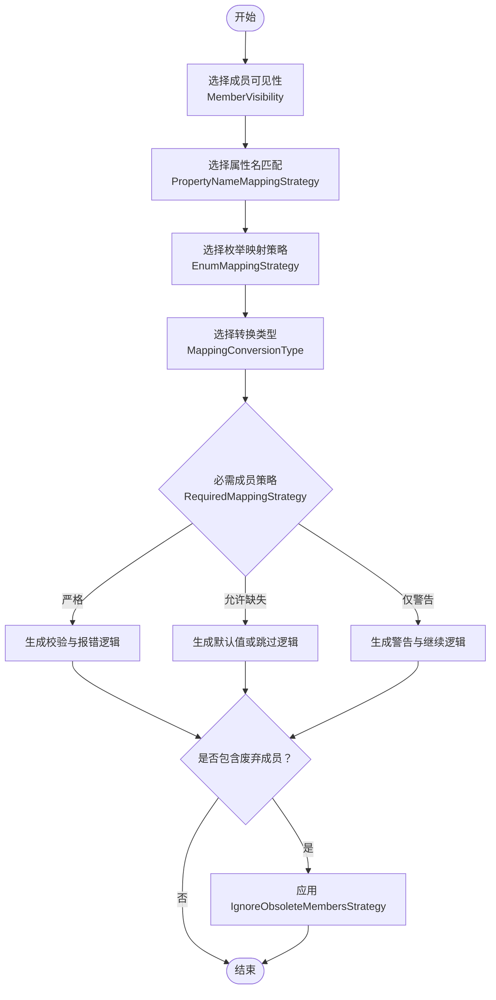
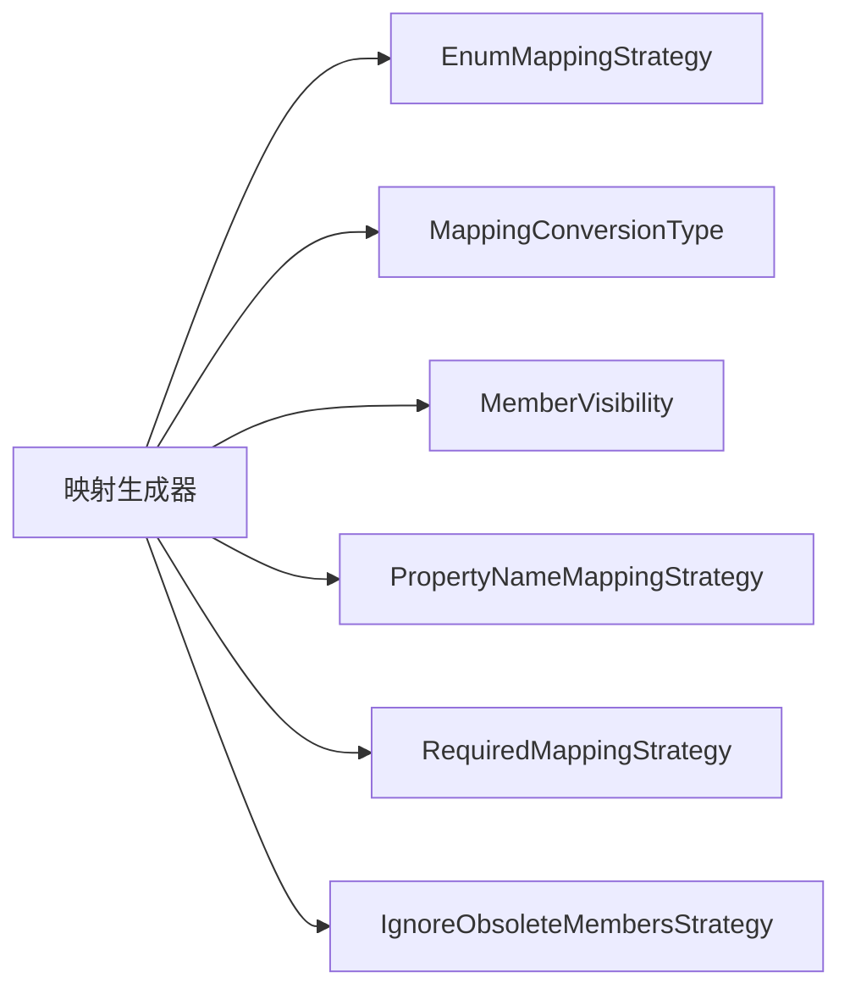

# 枚举参考

<cite>
**本文引用的文件**   
- [EnumMappingStrategy.cs](file://src/AutoCode.Model/AutoMapperModel/EnumMappingStrategy.cs)
- [MappingConversionType.cs](file://src/AutoCode.Model/AutoMapperModel/MappingConversionType.cs)
- [MemberVisibility.cs](file://src/AutoCode.Model/AutoMapperModel/MemberVisibility.cs)
- [PropertyNameMappingStrategy.cs](file://src/AutoCode.Model/AutoMapperModel/PropertyNameMappingStrategy.cs)
- [RequiredMappingStrategy.cs](file://src/AutoCode.Model/AutoMapperModel/RequiredMappingStrategy.cs)
- [IgnoreObsoleteMembersStrategy.cs](file://src/AutoCode.Model/AutoMapperModel/IgnoreObsoleteMembersStrategy.cs)
</cite>

## 目录
1. [简介](#简介)
2. [项目结构](#项目结构)
3. [核心组件](#核心组件)
4. [架构总览](#架构总览)
5. [详细组件分析](#详细组件分析)
6. [依赖关系分析](#依赖关系分析)
7. [性能考虑](#性能考虑)
8. [故障排查指南](#故障排查指南)
9. [结论](#结论)
10. [附录](#附录)

## 简介
本文件为 AutoCode 框架中映射相关枚举类型的权威 API 参考，覆盖以下枚举：
- EnumMappingStrategy
- MappingConversionType
- MemberVisibility
- PropertyNameMappingStrategy
- RequiredMappingStrategy
- IgnoreObsoleteMembersStrategy

文档将逐一说明每个枚举值的含义、适用场景与配置效果，并给出在不同场景下如何选择合适的枚举值。同时解释这些枚举之间的关联关系与组合使用模式，提供性能考量与最佳实践建议，帮助开发者在代码生成与对象映射过程中获得稳定、高效且可维护的结果。

## 项目结构
AutoCode 的映射相关枚举集中定义于 AutoCode.Model 项目的 AutoMapperModel 目录下，便于统一管理与引用。各枚举文件职责单一、命名清晰，便于在源码生成器与运行时策略中复用。

图表来源
- [EnumMappingStrategy.cs](file://src/AutoCode.Model/AutoMapperModel/EnumMappingStrategy.cs)
- [MappingConversionType.cs](file://src/AutoCode.Model/AutoMapperModel/MappingConversionType.cs)
- [MemberVisibility.cs](file://src/AutoCode.Model/AutoMapperModel/MemberVisibility.cs)
- [PropertyNameMappingStrategy.cs](file://src/AutoCode.Model/AutoMapperModel/PropertyNameMappingStrategy.cs)
- [RequiredMappingStrategy.cs](file://src/AutoCode.Model/AutoMapperModel/RequiredMappingStrategy.cs)
- [IgnoreObsoleteMembersStrategy.cs](file://src/AutoCode.Model/AutoMapperModel/IgnoreObsoleteMembersStrategy.cs)

章节来源
- [EnumMappingStrategy.cs](file://src/AutoCode.Model/AutoMapperModel/EnumMappingStrategy.cs)
- [MappingConversionType.cs](file://src/AutoCode.Model/AutoMapperModel/MappingConversionType.cs)
- [MemberVisibility.cs](file://src/AutoCode.Model/AutoMapperModel/MemberVisibility.cs)
- [PropertyNameMappingStrategy.cs](file://src/AutoCode.Model/AutoMapperModel/PropertyNameMappingStrategy.cs)
- [RequiredMappingStrategy.cs](file://src/AutoCode.Model/AutoMapperModel/RequiredMappingStrategy.cs)
- [IgnoreObsoleteMembersStrategy.cs](file://src/AutoCode.Model/AutoMapperModel/IgnoreObsoleteMembersStrategy.cs)

## 核心组件
本节对六个核心枚举进行概览性说明，后续章节将逐项深入。

- EnumMappingStrategy：控制枚举到目标类型（如字符串、数值或其他枚举）的映射策略，影响大小写、命名约定与默认回退行为。
- MappingConversionType：指定属性或成员转换的具体方式，例如直接赋值、构造函数参数、工厂方法等。
- MemberVisibility：限定参与映射的成员可见性范围，如公开、内部、受保护等。
- PropertyNameMappingStrategy：决定属性名匹配规则，如精确匹配、忽略大小写、驼峰/帕斯卡转换等。
- RequiredMappingStrategy：约束必需成员的映射要求，如严格匹配、允许缺失、仅警告等。
- IgnoreObsoleteMembersStrategy：处理标记为废弃的成员时的策略，如忽略、报错或降级兼容。

章节来源
- [EnumMappingStrategy.cs](file://src/AutoCode.Model/AutoMapperModel/EnumMappingStrategy.cs)
- [MappingConversionType.cs](file://src/AutoCode.Model/AutoMapperModel/MappingConversionType.cs)
- [MemberVisibility.cs](file://src/AutoCode.Model/AutoMapperModel/MemberVisibility.cs)
- [PropertyNameMappingStrategy.cs](file://src/AutoCode.Model/AutoMapperModel/PropertyNameMappingStrategy.cs)
- [RequiredMappingStrategy.cs](file://src/AutoCode.Model/AutoMapperModel/RequiredMappingStrategy.cs)
- [IgnoreObsoleteMembersStrategy.cs](file://src/AutoCode.Model/AutoMapperModel/IgnoreObsoleteMembersStrategy.cs)

## 架构总览
下图展示了枚举在 AutoCode 映射系统中的角色与交互关系。生成器根据这些枚举配置生成映射代码；运行时则依据生成的代码执行具体映射逻辑。

[此图为概念性架构图，不直接映射具体源文件，故无图表来源]

## 详细组件分析

### EnumMappingStrategy（枚举映射策略）
- 作用：定义枚举到目标类型的映射行为，包括大小写、命名约定、默认回退等。
- 典型值与含义：
  - 精确匹配：按枚举名称完全一致进行映射。
  - 忽略大小写：忽略大小写差异进行匹配。
  - 转换为字符串：将枚举映射为字符串表示。
  - 转换为数值：将枚举映射为底层整型值。
  - 自定义映射：通过额外配置或特性进行扩展映射。
- 使用场景：
  - 序列化/反序列化时与外部系统保持一致的命名规范。
  - 跨语言或跨平台传输时采用数值化以减少歧义。
- 配置效果：
  - 影响生成代码中的比较与转换分支。
  - 决定未匹配时的默认行为（抛出异常或返回默认值）。
- 与其他枚举的组合：
  - 与 PropertyNameMappingStrategy 配合，确保枚举名与属性名的一致性。
  - 与 MappingConversionType 配合，决定最终转换的实现方式。

章节来源
- [EnumMappingStrategy.cs](file://src/AutoCode.Model/AutoMapperModel/EnumMappingStrategy.cs)

### MappingConversionType（映射转换类型）
- 作用：指定属性或成员转换的具体实现方式。
- 典型值与含义：
  - 直接赋值：简单类型或相同类型间的直接拷贝。
  - 构造函数参数：通过目标类型构造函数传入参数。
  - 工厂方法：调用静态工厂方法创建实例。
  - 自定义转换器：通过扩展点注入自定义转换逻辑。
- 使用场景：
  - DTO 到领域模型的复杂转换。
  - 需要封装初始化逻辑或依赖注入的场景。
- 配置效果：
  - 生成不同的构造或调用代码路径。
  - 影响性能与可读性，需权衡复杂度与效率。
- 与其他枚举的组合：
  - 与 MemberVisibility 配合，限制可访问的成员用于构造或工厂。
  - 与 RequiredMappingStrategy 配合，确保必需参数满足。

章节来源
- [MappingConversionType.cs](file://src/AutoCode.Model/AutoMapperModel/MappingConversionType.cs)

### MemberVisibility（成员可见性）
- 作用：限定哪些成员参与映射。
- 典型值与含义：
  - 公开：仅公开成员参与映射。
  - 内部：包含内部成员。
  - 受保护：包含受保护成员（谨慎使用）。
  - 所有：包含全部可见性级别（可能带来安全风险）。
- 使用场景：
  - 安全敏感场景下限制映射范围。
  - 测试或调试时放宽可见性以覆盖更多成员。
- 配置效果：
  - 生成器过滤可映射的成员集合。
  - 影响生成代码的访问修饰符与反射开销。
- 与其他枚举的组合：
  - 与 PropertyNameMappingStrategy 配合，确保可见成员的名称匹配策略生效。
  - 与 RequiredMappingStrategy 配合，避免对不可见成员做强制要求。

章节来源
- [MemberVisibility.cs](file://src/AutoCode.Model/AutoMapperModel/MemberVisibility.cs)

### PropertyNameMappingStrategy（属性名映射策略）
- 作用：决定属性名匹配与转换的规则。
- 典型值与含义：
  - 精确匹配：严格按名称相等。
  - 忽略大小写：忽略大小写差异。
  - 驼峰转帕斯卡：自动转换命名风格。
  - 前缀/后缀去除：去除公共前缀或后缀后匹配。
- 使用场景：
  - 不同命名规范的系统间集成。
  - 历史遗留代码与现代代码的对接。
- 配置效果：
  - 生成名称规范化与匹配逻辑。
  - 影响映射成功率与性能。
- 与其他枚举的组合：
  - 与 EnumMappingStrategy 配合，确保枚举名与属性名一致。
  - 与 MemberVisibility 配合，限制可见成员内的名称匹配。

章节来源
- [PropertyNameMappingStrategy.cs](file://src/AutoCode.Model/AutoMapperModel/PropertyNameMappingStrategy.cs)

### RequiredMappingStrategy（必需映射策略）
- 作用：约束必需成员的映射要求与错误处理。
- 典型值与含义：
  - 严格：缺失必需成员时报错。
  - 允许缺失：缺失时跳过或设置默认值。
  - 仅警告：缺失时记录警告但不中断。
- 使用场景：
  - 强契约场景下保证数据完整性。
  - 渐进式迁移时容忍部分缺失。
- 配置效果：
  - 生成校验与分支逻辑。
  - 影响运行时的异常与日志行为。
- 与其他枚举的组合：
  - 与 MappingConversionType 配合，确保必需参数的构造或工厂调用成功。
  - 与 MemberVisibility 配合，明确哪些成员被视为必需。

章节来源
- [RequiredMappingStrategy.cs](file://src/AutoCode.Model/AutoMapperModel/RequiredMappingStrategy.cs)

### IgnoreObsoleteMembersStrategy（废弃成员处理策略）
- 作用：处理标记为废弃的成员时的行为。
- 典型值与含义：
  - 忽略：完全忽略废弃成员。
  - 报错：遇到废弃成员时报错。
  - 降级兼容：保留兼容逻辑但发出警告。
- 使用场景：
  - 清理旧版本接口时的平滑过渡。
  - 强制升级时阻断潜在风险。
- 配置效果：
  - 生成器决定是否生成废弃成员的映射代码。
  - 运行时是否触发警告或异常。
- 与其他枚举的组合：
  - 与 RequiredMappingStrategy 配合，决定废弃成员是否计入必需集合。
  - 与 MemberVisibility 配合，限制废弃成员的可见性影响范围。

章节来源
- [IgnoreObsoleteMembersStrategy.cs](file://src/AutoCode.Model/AutoMapperModel/IgnoreObsoleteMembersStrategy.cs)

### 枚举关联与组合使用模式
- 常见组合：
  - 高安全性场景：MemberVisibility=公开 + RequiredMappingStrategy=严格 + IgnoreObsoleteMembersStrategy=报错。
  - 兼容性优先：PropertyNameMappingStrategy=忽略大小写 + EnumMappingStrategy=忽略大小写 + IgnoreObsoleteMembersStrategy=降级兼容。
  - 高性能场景：MappingConversionType=直接赋值 + MemberVisibility=公开 + RequiredMappingStrategy=允许缺失。
- 决策流程：

[此图为概念性流程图，不直接映射具体源文件，故无图表来源]

## 依赖关系分析
- 耦合度：各枚举彼此独立，通过生成器与运行时策略组合使用，耦合度低、内聚性强。
- 外部依赖：主要被映射生成器与运行时模块引用，不直接依赖第三方库。
- 循环依赖：枚举之间无循环依赖，符合单一职责原则。

图表来源
- [EnumMappingStrategy.cs](file://src/AutoCode.Model/AutoMapperModel/EnumMappingStrategy.cs)
- [MappingConversionType.cs](file://src/AutoCode.Model/AutoMapperModel/MappingConversionType.cs)
- [MemberVisibility.cs](file://src/AutoCode.Model/AutoMapperModel/MemberVisibility.cs)
- [PropertyNameMappingStrategy.cs](file://src/AutoCode.Model/AutoMapperModel/PropertyNameMappingStrategy.cs)
- [RequiredMappingStrategy.cs](file://src/AutoCode.Model/AutoMapperModel/RequiredMappingStrategy.cs)
- [IgnoreObsoleteMembersStrategy.cs](file://src/AutoCode.Model/AutoMapperModel/IgnoreObsoleteMembersStrategy.cs)

章节来源
- [EnumMappingStrategy.cs](file://src/AutoCode.Model/AutoMapperModel/EnumMappingStrategy.cs)
- [MappingConversionType.cs](file://src/AutoCode.Model/AutoMapperModel/MappingConversionType.cs)
- [MemberVisibility.cs](file://src/AutoCode.Model/AutoMapperModel/MemberVisibility.cs)
- [PropertyNameMappingStrategy.cs](file://src/AutoCode.Model/AutoMapperModel/PropertyNameMappingStrategy.cs)
- [RequiredMappingStrategy.cs](file://src/AutoCode.Model/AutoMapperModel/RequiredMappingStrategy.cs)
- [IgnoreObsoleteMembersStrategy.cs](file://src/AutoCode.Model/AutoMapperModel/IgnoreObsoleteMembersStrategy.cs)

## 性能考虑
- 直接赋值优于复杂转换：在类型兼容时优先选择直接赋值，减少运行时开销。
- 可见性限制提升效率：限制 MemberVisibility 可减少反射与遍历成本。
- 名称匹配优化：合理选择 PropertyNameMappingStrategy，避免不必要的字符串操作。
- 必需校验成本：严格模式会增加校验分支，建议在热点路径上谨慎使用。
- 废弃成员处理：降级兼容会引入额外判断，建议在稳定期逐步清理。

[本节为通用指导，不直接分析具体文件，故无章节来源]

## 故障排查指南
- 映射失败：检查 PropertyNameMappingStrategy 与 EnumMappingStrategy 是否匹配实际命名。
- 必需成员缺失：确认 RequiredMappingStrategy 与数据来源是否一致，必要时调整策略。
- 废弃成员警告：根据 IgnoreObsoleteMembersStrategy 调整行为，避免误报或漏报。
- 性能问题：评估 MappingConversionType 与 MemberVisibility，简化转换链。

[本节为通用指导，不直接分析具体文件，故无章节来源]

## 结论
通过对 AutoCode 框架中六个关键枚举的全面解析，开发者可以在对象映射与代码生成过程中做出更明智的配置选择。合理组合这些枚举，能够在正确性、性能与可维护性之间取得平衡。建议在生产环境中结合业务需求与安全策略，逐步收敛配置，形成稳定的映射规范。

[本节为总结性内容，不直接分析具体文件，故无章节来源]

## 附录
- 快速对照表（示例）：
  - 高安全：MemberVisibility=公开 + RequiredMappingStrategy=严格 + IgnoreObsoleteMembersStrategy=报错
  - 高兼容：PropertyNameMappingStrategy=忽略大小写 + EnumMappingStrategy=忽略大小写 + IgnoreObsoleteMembersStrategy=降级兼容
  - 高性能：MappingConversionType=直接赋值 + MemberVisibility=公开 + RequiredMappingStrategy=允许缺失

[本节为补充信息，不直接分析具体文件，故无章节来源]