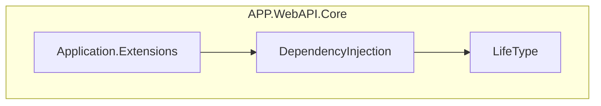
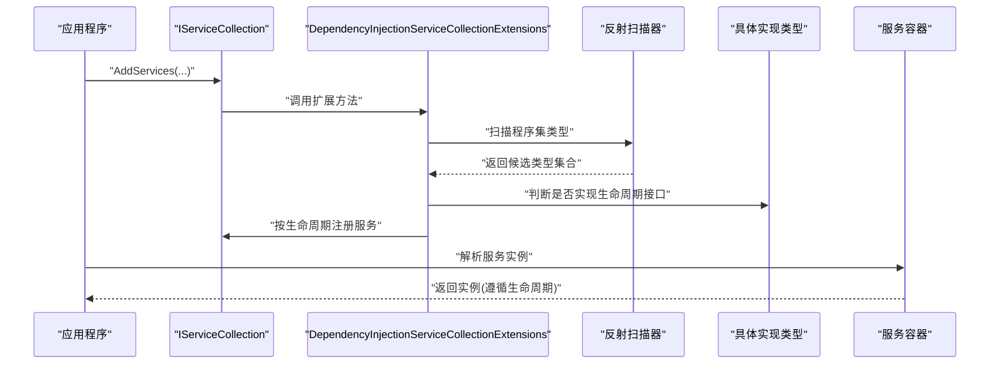
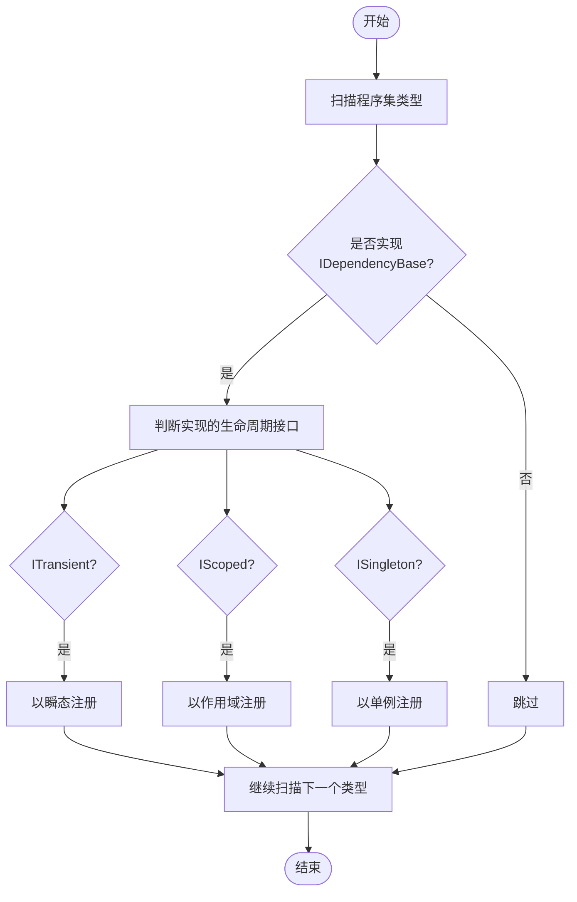
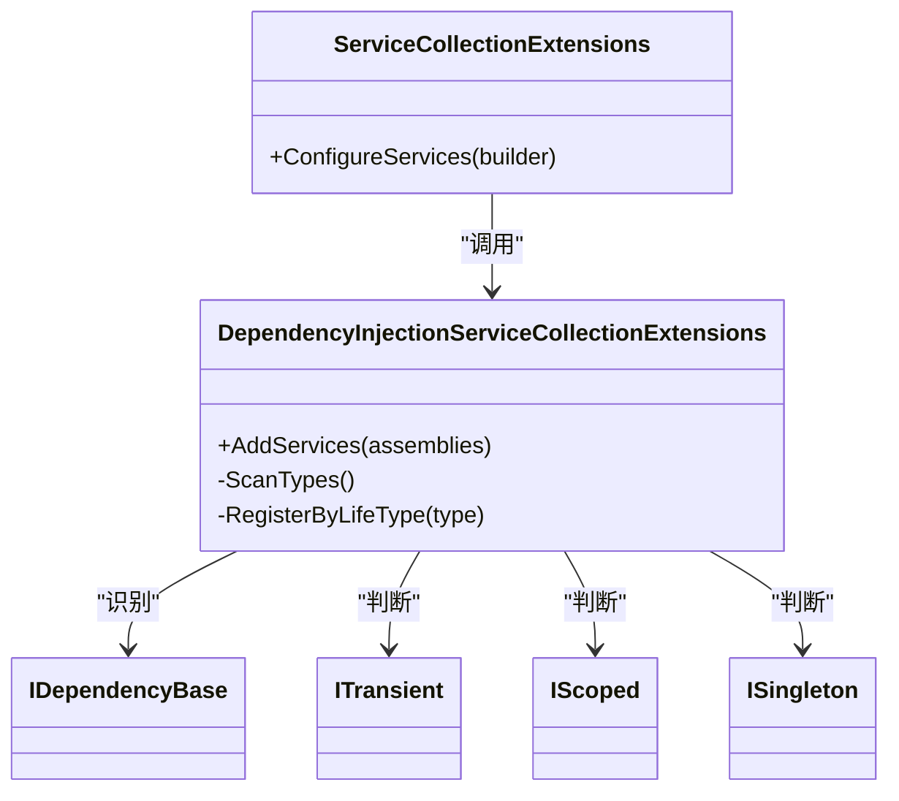

# 依赖注入类

<cite>
**本文引用的文件**   
- [DependencyInjectionServiceCollectionExtensions.cs](file://src/APP.WebAPI.Core/DependencyInjection/DependencyInjectionServiceCollectionExtensions.cs)
- [IDependencyBase.cs](file://src/APP.WebAPI.Core/DependencyInjection/LifeType/IDependencyBase.cs)
- [IScoped.cs](file://src/APP.WebAPI.Core/DependencyInjection/LifeType/IScoped.cs)
- [ISingleton.cs](file://src/APP.WebAPI.Core/DependencyInjection/LifeType/ISingleton.cs)
- [ITransient.cs](file://src/APP.WebAPI.Core/DependencyInjection/LifeType/ITransient.cs)
- [ServiceCollectionExtensions.cs](file://src/APP.WebAPI.Core/Application/Extensions/ServiceCollectionExtensions.cs)
</cite>

## 目录
1. [简介](#简介)
2. [项目结构](#项目结构)
3. [核心组件](#核心组件)
4. [架构总览](#架构总览)
5. [详细组件分析](#详细组件分析)
6. [依赖关系分析](#依赖关系分析)
7. [性能考虑](#性能考虑)
8. [故障排除指南](#故障排除指南)
9. [结论](#结论)
10. [附录](#附录)

## 简介
本文件为依赖注入相关类的权威 API 参考，聚焦以下目标：
- 详细说明 DependencyInjectionServiceCollectionExtensions 与 ServiceCollectionExtensions 扩展方法的用法与行为。
- 深入解释 IDependencyBase 接口及生命周期标记接口（IScoped、ISingleton、ITransient）的设计理念与实现原理。
- 记录服务注册模式、生命周期管理与依赖解析机制。
- 提供完整示例路径，展示如何定义服务接口、实现依赖注入以及解决循环依赖问题。
- 给出容器配置、性能调优与故障排除的实用指南。

## 项目结构
依赖注入相关代码集中在 APP.WebAPI.Core 项目中，按职责划分如下：
- DependencyInjection：容器扩展与生命周期标记接口
- Application：应用层扩展（如 ServiceCollectionExtensions）

图表来源
- [DependencyInjectionServiceCollectionExtensions.cs:1-200](file://src/APP.WebAPI.Core/DependencyInjection/DependencyInjectionServiceCollectionExtensions.cs#L1-L200)
- [ServiceCollectionExtensions.cs:1-200](file://src/APP.WebAPI.Core/Application/Extensions/ServiceCollectionExtensions.cs#L1-L200)

章节来源
- [DependencyInjectionServiceCollectionExtensions.cs:1-200](file://src/APP.WebAPI.Core/DependencyInjection/DependencyInjectionServiceCollectionExtensions.cs#L1-L200)
- [ServiceCollectionExtensions.cs:1-200](file://src/APP.WebAPI.Core/Application/Extensions/ServiceCollectionExtensions.cs#L1-L200)

## 核心组件
- IDependencyBase：所有可被自动发现并注册的服务基接口，用于统一生命周期标记与元数据约定。
- IScoped、ISingleton、ITransient：生命周期标记接口，用于声明式指定服务的生命周期。
- DependencyInjectionServiceCollectionExtensions：基于反射扫描程序集，识别实现了生命周期接口的类型，并批量注册到 IServiceCollection。
- ServiceCollectionExtensions：在应用启动阶段进行容器配置与扩展（例如启用中间件、设置选项等），通常调用上述扩展完成服务注册。

章节来源
- [IDependencyBase.cs:1-200](file://src/APP.WebAPI.Core/DependencyInjection/LifeType/IDependencyBase.cs#L1-L200)
- [IScoped.cs:1-200](file://src/APP.WebAPI.Core/DependencyInjection/LifeType/IScoped.cs#L1-L200)
- [ISingleton.cs:1-200](file://src/APP.WebAPI.Core/DependencyInjection/LifeType/ISingleton.cs#L1-L200)
- [ITransient.cs:1-200](file://src/APP.WebAPI.Core/DependencyInjection/LifeType/ITransient.cs#1-L200)
- [DependencyInjectionServiceCollectionExtensions.cs:1-200](file://src/APP.WebAPI.Core/DependencyInjection/DependencyInjectionServiceCollectionExtensions.cs#L1-L200)
- [ServiceCollectionExtensions.cs:1-200](file://src/APP.WebAPI.Core/Application/Extensions/ServiceCollectionExtensions.cs#L1-L200)

## 架构总览
下图展示了服务从“定义”到“注册”再到“解析”的整体流程，以及各组件之间的交互关系。

图表来源
- [DependencyInjectionServiceCollectionExtensions.cs:1-200](file://src/APP.WebAPI.Core/DependencyInjection/DependencyInjectionServiceCollectionExtensions.cs#L1-L200)
- [ServiceCollectionExtensions.cs:1-200](file://src/APP.WebAPI.Core/Application/Extensions/ServiceCollectionExtensions.cs#L1-L200)

## 详细组件分析

### IDependencyBase 接口
- 设计目的：作为所有可被自动发现并注册的“服务契约”的统一基接口，便于扫描器识别与处理。
- 典型职责：
  - 标识一个类型是“可注册服务”。
  - 承载生命周期相关的元信息或约束（由具体生命周期接口细化）。
- 使用建议：
  - 所有需要被自动注册的类型应直接或间接实现该接口。
  - 避免在基接口中引入复杂逻辑，保持其“标记+元数据”的轻量特性。

章节来源
- [IDependencyBase.cs:1-200](file://src/APP.WebAPI.Core/DependencyInjection/LifeType/IDependencyBase.cs#L1-L200)

### 生命周期接口：IScoped、ISingleton、ITransient
- 设计理念：
  - 通过“标记接口”声明服务生命周期，零侵入、易扩展。
  - 与扫描器配合，自动将实现类型映射到对应的容器注册方式。
- 语义说明：
  - ITransient：每次请求解析都创建新实例。
  - IScoped：在同一作用域内共享同一实例（如 HTTP 请求）。
  - ISingleton：整个应用生命周期内仅一个实例。
- 实现要点：
  - 这些接口通常为“空接口”，仅用于类型识别。
  - 若需额外元数据，可在基接口或自定义属性中扩展。

章节来源
- [IScoped.cs:1-200](file://src/APP.WebAPI.Core/DependencyInjection/LifeType/IScoped.cs#L1-L200)
- [ISingleton.cs:1-200](file://src/APP.WebAPI.Core/DependencyInjection/LifeType/ISingleton.cs#L1-L200)
- [ITransient.cs:1-200](file://src/APP.WebAPI.Core/DependencyInjection/LifeType/ITransient.cs#L1-L200)

### DependencyInjectionServiceCollectionExtensions 扩展
- 功能概述：
  - 提供 AddServices(...) 等扩展方法，自动扫描指定程序集。
  - 识别实现 IDependencyBase 及其生命周期接口的类型，并按生命周期注册。
- 关键行为：
  - 过滤非公共类型、抽象类型、泛型开放类型等。
  - 根据实现的接口决定注册方式（Transient/Scoped/Singleton）。
  - 支持重复注册检测与冲突提示。
- 使用方式：
  - 在应用启动时调用扩展方法，传入要扫描的程序集数组。
  - 推荐仅在开发/测试环境启用全量扫描，生产环境按需缩小范围以提升性能。

章节来源
- [DependencyInjectionServiceCollectionExtensions.cs:1-200](file://src/APP.WebAPI.Core/DependencyInjection/DependencyInjectionServiceCollectionExtensions.cs#L1-L200)

### ServiceCollectionExtensions 扩展
- 功能概述：
  - 封装应用级容器配置，如添加中间件、配置选项、日志、健康检查等。
  - 通常会调用 DependencyInjectionServiceCollectionExtensions 完成服务注册。
- 使用方式：
  - 在 Program/Main 中构建 WebHost/Host 后调用扩展方法。
  - 将业务模块的注册逻辑集中管理，便于维护与测试。

章节来源
- [ServiceCollectionExtensions.cs:1-200](file://src/APP.WebAPI.Core/Application/Extensions/ServiceCollectionExtensions.cs#L1-L200)

### 服务注册与解析流程图

图表来源
- [DependencyInjectionServiceCollectionExtensions.cs:1-200](file://src/APP.WebAPI.Core/DependencyInjection/DependencyInjectionServiceCollectionExtensions.cs#L1-L200)

## 依赖关系分析
- 耦合关系：
  - 扫描器依赖 IDependencyBase 与生命周期接口进行类型识别。
  - ServiceCollectionExtensions 依赖扫描扩展完成注册。
- 潜在风险：
  - 过度扫描导致启动缓慢。
  - 循环依赖在运行时才会暴露，需在设计与扫描策略上规避。

图表来源
- [DependencyInjectionServiceCollectionExtensions.cs:1-200](file://src/APP.WebAPI.Core/DependencyInjection/DependencyInjectionServiceCollectionExtensions.cs#L1-L200)
- [ServiceCollectionExtensions.cs:1-200](file://src/APP.WebAPI.Core/Application/Extensions/ServiceCollectionExtensions.cs#L1-L200)

章节来源
- [DependencyInjectionServiceCollectionExtensions.cs:1-200](file://src/APP.WebAPI.Core/DependencyInjection/DependencyInjectionServiceCollectionExtensions.cs#L1-L200)
- [ServiceCollectionExtensions.cs:1-200](file://src/APP.WebAPI.Core/Application/Extensions/ServiceCollectionExtensions.cs#L1-L200)

## 性能考虑
- 启动性能
  - 限制扫描程序集范围，避免扫描无关库。
  - 合并多次 AddServices 调用，减少反射开销。
- 运行时性能
  - 合理选择生命周期：高频短生命周期的对象优先 Transient；跨请求状态用 Scoped；全局共享用 Singleton。
  - 避免在 Singleton 中注入 Scoped/Transient 服务（会导致捕获异常）。
- 内存与并发
  - Singleton 注意线程安全与资源释放。
  - Scoped 注意作用域边界（如每个 HTTP 请求一个作用域）。

[本节为通用指导，不直接分析具体文件]

## 故障排除指南
- 常见问题
  - 未找到类型：确认类型是否为公共、非抽象、非泛型开放类型，且实现了 IDependencyBase 与对应生命周期接口。
  - 重复注册：确保同一接口只被一种实现注册一次。
  - 循环依赖：重构依赖图，引入工厂或延迟解析（Lazy<T>）打破环。
  - 生命周期误用：Singleton 中注入 Scoped/Transient 会抛出异常，需调整设计。
- 定位技巧
  - 开启详细日志，查看扫描结果与注册列表。
  - 使用最小化程序集扫描，逐步排查问题类型。
  - 在单元测试中构造独立容器，隔离问题。

章节来源
- [DependencyInjectionServiceCollectionExtensions.cs:1-200](file://src/APP.WebAPI.Core/DependencyInjection/DependencyInjectionServiceCollectionExtensions.cs#L1-L200)
- [ServiceCollectionExtensions.cs:1-200](file://src/APP.WebAPI.Core/Application/Extensions/ServiceCollectionExtensions.cs#L1-L200)

## 结论
通过 IDependencyBase 与生命周期标记接口，结合扫描扩展方法，可实现“约定优于配置”的依赖注入体系。合理的使用模式与生命周期选择，能够显著提升系统的可维护性与运行效率。建议在应用启动阶段集中配置，并在测试中验证注册与解析的正确性。

[本节为总结性内容，不直接分析具体文件]

## 附录

### 示例：定义服务接口与实现
- 步骤
  - 定义服务接口并实现 IDependencyBase 与某一生命周期接口。
  - 在实现类中注入所需依赖。
  - 在应用启动时调用 AddServices(...) 完成注册。
  - 在控制器或服务中通过构造函数注入解析。
- 示例路径
  - [DependencyInjectionServiceCollectionExtensions.cs:1-200](file://src/APP.WebAPI.Core/DependencyInjection/DependencyInjectionServiceCollectionExtensions.cs#L1-L200)
  - [ServiceCollectionExtensions.cs:1-200](file://src/APP.WebAPI.Core/Application/Extensions/ServiceCollectionExtensions.cs#L1-L200)

### 示例：解决循环依赖
- 思路
  - 使用 Lazy<T> 延迟解析。
  - 引入工厂或消息总线解耦。
  - 拆分职责，消除环状依赖。
- 示例路径
  - [DependencyInjectionServiceCollectionExtensions.cs:1-200](file://src/APP.WebAPI.Core/DependencyInjection/DependencyInjectionServiceCollectionExtensions.cs#L1-L200)

### 示例：容器配置与扩展
- 步骤
  - 在 Program/Main 中构建 Host。
  - 调用 ServiceCollectionExtensions.ConfigureServices(...)。
  - 在其中调用 AddServices(...) 完成服务注册。
- 示例路径
  - [ServiceCollectionExtensions.cs:1-200](file://src/APP.WebAPI.Core/Application/Extensions/ServiceCollectionExtensions.cs#L1-L200)