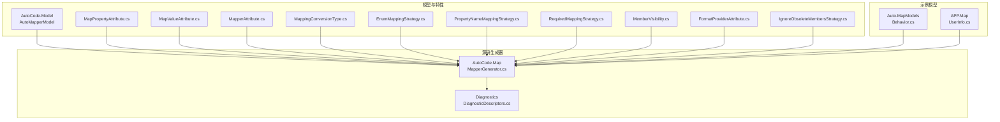
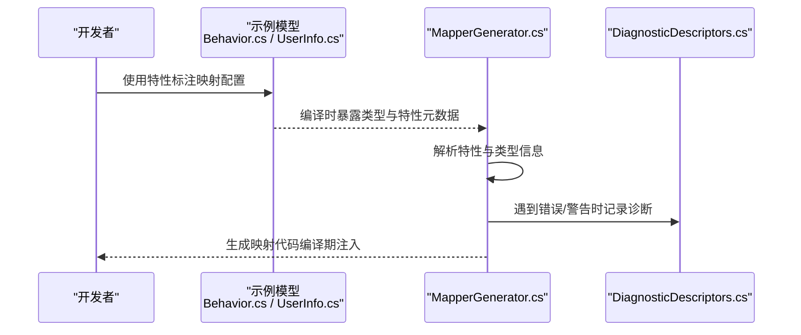
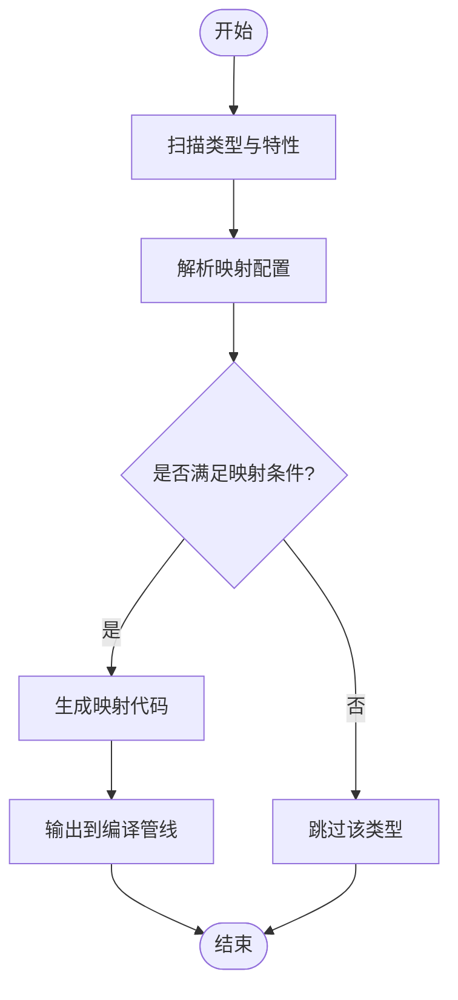
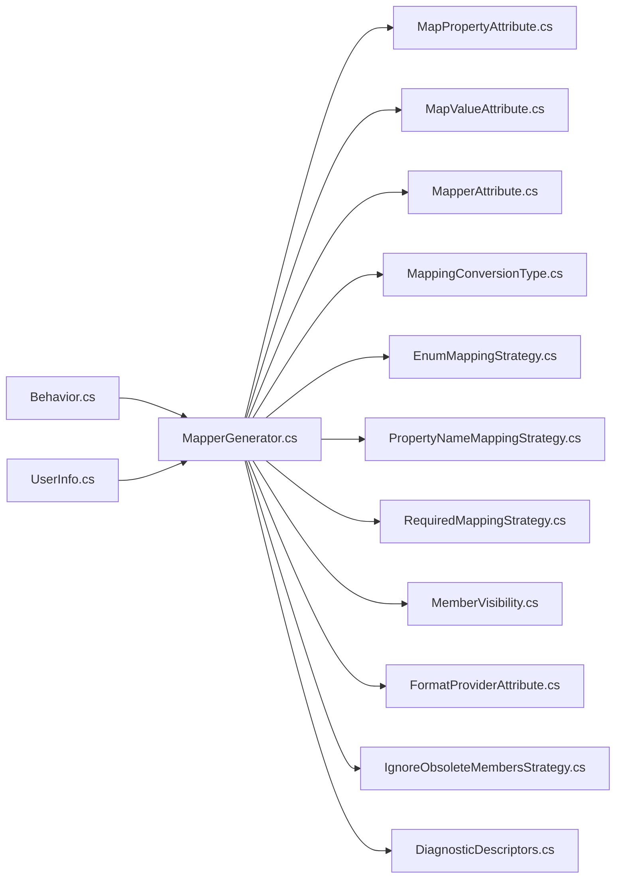

# 映射处理类

<cite>
**本文引用的文件**   
- [MapperGenerator.cs](file://src/AutoCode.Map/MapperGenerator.cs)
- [Behavior.cs](file://src/Auto.MapModels/Behavior.cs)
- [UserInfo.cs](file://src/APP.Map/UserInfo.cs)
- [MapPropertyAttribute.cs](file://src/AutoCode.Model/AutoMapperModel/MapPropertyAttribute.cs)
- [MapValueAttribute.cs](file://src/AutoCode.Model/AutoMapperModel/MapValueAttribute.cs)
- [MapperAttribute.cs](file://src/AutoCode.Model/AutoMapperModel/MapperAttribute.cs)
- [MappingConversionType.cs](file://src/AutoCode.Model/AutoMapperModel/MappingConversionType.cs)
- [EnumMappingStrategy.cs](file://src/AutoCode.Model/AutoMapperModel/EnumMappingStrategy.cs)
- [PropertyNameMappingStrategy.cs](file://src/AutoCode.Model/AutoMapperModel/PropertyNameMappingStrategy.cs)
- [RequiredMappingStrategy.cs](file://src/AutoCode.Model/AutoMapperModel/RequiredMappingStrategy.cs)
- [MemberVisibility.cs](file://src/AutoCode.Model/AutoMapperModel/MemberVisibility.cs)
- [FormatProviderAttribute.cs](file://src/AutoCode.Model/AutoMapperModel/FormatProviderAttribute.cs)
- [IgnoreObsoleteMembersStrategy.cs](file://src/AutoCode.Model/AutoMapperModel/IgnoreObsoleteMembersStrategy.cs)
- [DiagnosticDescriptors.cs](file://src/AutoCode.Map/Diagnostics/DiagnosticDescriptors.cs)
</cite>

## 目录
1. [简介](#简介)
2. [项目结构](#项目结构)
3. [核心组件](#核心组件)
4. [架构总览](#架构总览)
5. [详细组件分析](#详细组件分析)
6. [依赖关系分析](#依赖关系分析)
7. [性能考虑](#性能考虑)
8. [故障排查指南](#故障排查指南)
9. [结论](#结论)
10. [附录](#附录) 

## 简介
本文件为对象映射相关类的详细API参考文档，聚焦于源码生成器中的映射能力。内容涵盖：
- MapperGenerator 的工作原理、配置项与扩展点
- Behavior 模型与 UserInfo 示例类的映射使用方式
- 属性驱动的映射配置（如 MapProperty、MapValue）
- 类型转换规则与复杂对象映射策略
- 简单属性映射、条件映射、集合映射与自定义转换逻辑的示例说明
- 映射性能优化、内存管理与错误处理最佳实践

## 项目结构
本项目采用“模型 + 特性 + 源码生成器”的分层组织方式：
- AutoCode.Model/AutoMapperModel：定义映射相关的特性与枚举，用于声明式配置映射行为
- AutoCode.Map：包含 MapperGenerator 源码生成器实现，负责解析特性并生成映射代码
- Auto.MapModels / APP.Map：提供示例模型与用法（Behavior、UserInfo）
- Diagnostics：诊断描述，用于生成器阶段的错误与警告提示

图表来源 
- [MapperGenerator.cs](file://src/AutoCode.Map/MapperGenerator.cs)
- [MapPropertyAttribute.cs](file://src/AutoCode.Model/AutoMapperModel/MapPropertyAttribute.cs)
- [MapValueAttribute.cs](file://src/AutoCode.Model/AutoMapperModel/MapValueAttribute.cs)
- [MapperAttribute.cs](file://src/AutoCode.Model/AutoMapperModel/MapperAttribute.cs)
- [MappingConversionType.cs](file://src/AutoCode.Model/AutoMapperModel/MappingConversionType.cs)
- [EnumMappingStrategy.cs](file://src/AutoCode.Model/AutoMapperModel/EnumMappingStrategy.cs)
- [PropertyNameMappingStrategy.cs](file://src/AutoCode.Model/AutoMapperModel/PropertyNameMappingStrategy.cs)
- [RequiredMappingStrategy.cs](file://src/AutoCode.Model/AutoMapperModel/RequiredMappingStrategy.cs)
- [MemberVisibility.cs](file://src/AutoCode.Model/AutoMapperModel/MemberVisibility.cs)
- [FormatProviderAttribute.cs](file://src/AutoCode.Model/AutoMapperModel/FormatProviderAttribute.cs)
- [IgnoreObsoleteMembersStrategy.cs](file://src/AutoCode.Model/AutoMapperModel/IgnoreObsoleteMembersStrategy.cs)
- [Behavior.cs](file://src/Auto.MapModels/Behavior.cs)
- [UserInfo.cs](file://src/APP.Map/UserInfo.cs)
- [DiagnosticDescriptors.cs](file://src/AutoCode.Map/Diagnostics/DiagnosticDescriptors.cs)

章节来源
- [MapperGenerator.cs](file://src/AutoCode.Map/MapperGenerator.cs)
- [Behavior.cs](file://src/Auto.MapModels/Behavior.cs)
- [UserInfo.cs](file://src/APP.Map/UserInfo.cs)
- [MapPropertyAttribute.cs](file://src/AutoCode.Model/AutoMapperModel/MapPropertyAttribute.cs)
- [MapValueAttribute.cs](file://src/AutoCode.Model/AutoMapperModel/MapValueAttribute.cs)
- [MapperAttribute.cs](file://src/AutoCode.Model/AutoMapperModel/MapperAttribute.cs)
- [MappingConversionType.cs](file://src/AutoCode.Model/AutoMapperModel/MappingConversionType.cs)
- [EnumMappingStrategy.cs](file://src/AutoCode.Model/AutoMapperModel/EnumMappingStrategy.cs)
- [PropertyNameMappingStrategy.cs](file://src/AutoCode.Model/AutoMapperModel/PropertyNameMappingStrategy.cs)
- [RequiredMappingStrategy.cs](file://src/AutoCode.Model/AutoMapperModel/RequiredMappingStrategy.cs)
- [MemberVisibility.cs](file://src/AutoCode.Model/AutoMapperModel/MemberVisibility.cs)
- [FormatProviderAttribute.cs](file://src/AutoCode.Model/AutoMapperModel/FormatProviderAttribute.cs)
- [IgnoreObsoleteMembersStrategy.cs](file://src/AutoCode.Model/AutoMapperModel/IgnoreObsoleteMembersStrategy.cs)
- [DiagnosticDescriptors.cs](file://src/AutoCode.Map/Diagnostics/DiagnosticDescriptors.cs)

## 核心组件
- MapperGenerator：源码生成器入口，负责扫描标记了映射特性的类型，解析配置，生成高效映射代码。
- 映射特性：
  - MapperAttribute：声明目标映射类型或命名空间策略
  - MapPropertyAttribute：对单个属性进行重命名、忽略、默认值等配置
  - MapValueAttribute：为属性设置常量值或表达式结果
- 类型转换与策略：
  - MappingConversionType：指定转换类型（如直接赋值、字符串格式化、枚举映射等）
  - EnumMappingStrategy：枚举映射策略
  - PropertyNameMappingStrategy：属性名匹配策略（如大小写不敏感、前缀后缀处理）
  - RequiredMappingStrategy：必填映射策略（未映射字段是否报错）
  - MemberVisibility：成员可见性过滤
  - FormatProviderAttribute：格式化提供者（如日期时间、数字格式）
  - IgnoreObsoleteMembersStrategy：忽略过时成员的策略

章节来源
- [MapperGenerator.cs](file://src/AutoCode.Map/MapperGenerator.cs)
- [MapPropertyAttribute.cs](file://src/AutoCode.Model/AutoMapperModel/MapPropertyAttribute.cs)
- [MapValueAttribute.cs](file://src/AutoCode.Model/AutoMapperModel/MapValueAttribute.cs)
- [MapperAttribute.cs](file://src/AutoCode.Model/AutoMapperModel/MapperAttribute.cs)
- [MappingConversionType.cs](file://src/AutoCode.Model/AutoMapperModel/MappingConversionType.cs)
- [EnumMappingStrategy.cs](file://src/AutoCode.Model/AutoMapperModel/EnumMappingStrategy.cs)
- [PropertyNameMappingStrategy.cs](file://src/AutoCode.Model/AutoMapperModel/PropertyNameMappingStrategy.cs)
- [RequiredMappingStrategy.cs](file://src/AutoCode.Model/AutoMapperModel/RequiredMappingStrategy.cs)
- [MemberVisibility.cs](file://src/AutoCode.Model/AutoMapperModel/MemberVisibility.cs)
- [FormatProviderAttribute.cs](file://src/AutoCode.Model/AutoMapperModel/FormatProviderAttribute.cs)
- [IgnoreObsoleteMembersStrategy.cs](file://src/AutoCode.Model/AutoMapperModel/IgnoreObsoleteMembersStrategy.cs)

## 架构总览
下图展示了从“特性标注”到“源码生成”的关键流程，以及示例模型如何参与映射过程。

图表来源 
- [MapperGenerator.cs](file://src/AutoCode.Map/MapperGenerator.cs)
- [Behavior.cs](file://src/Auto.MapModels/Behavior.cs)
- [UserInfo.cs](file://src/APP.Map/UserInfo.cs)
- [DiagnosticDescriptors.cs](file://src/AutoCode.Map/Diagnostics/DiagnosticDescriptors.cs)

## 详细组件分析

### MapperGenerator 工作原理与扩展点
- 工作阶段
  - 扫描程序集中标记了映射特性的类型
  - 解析属性与类型信息，结合特性配置构建映射计划
  - 生成高效的映射方法（通常内联赋值与必要转换）
- 关键能力
  - 属性级映射：支持重命名、忽略、默认值、表达式赋值
  - 类型转换：内置多种转换类型，支持格式化提供者
  - 策略控制：属性名匹配、枚举映射、必填校验、可见性过滤、过时成员忽略
- 扩展点
  - 通过新增 MappingConversionType 扩展新的转换类型
  - 通过自定义特性组合实现更复杂的映射规则
  - 借助诊断描述增强编译期错误提示

图表来源 
- [MapperGenerator.cs](file://src/AutoCode.Map/MapperGenerator.cs)

章节来源
- [MapperGenerator.cs](file://src/AutoCode.Map/MapperGenerator.cs)

### Behavior 模型与映射使用
- Behavior 作为示例模型，可用于演示：
  - 简单属性映射（同名自动映射）
  - 条件映射（基于源值判断目标赋值）
  - 集合映射（数组/列表元素映射）
  - 自定义转换（通过 MapValue 或转换类型）

使用建议
- 在 Behavior 上添加映射特性以声明映射目标与规则
- 利用 MapProperty 对个别属性进行精细化控制
- 使用 MapValue 为固定值或表达式赋值

章节来源
- [Behavior.cs](file://src/Auto.MapModels/Behavior.cs)
- [MapPropertyAttribute.cs](file://src/AutoCode.Model/AutoMapperModel/MapPropertyAttribute.cs)
- [MapValueAttribute.cs](file://src/AutoCode.Model/AutoMapperModel/MapValueAttribute.cs)

### UserInfo 示例类与映射场景
- UserInfo 常用于演示用户信息的映射场景：
  - 基础字段映射（姓名、邮箱、电话等）
  - 日期时间格式化（配合 FormatProviderAttribute）
  - 枚举映射（状态、角色等）
  - 复杂对象嵌套映射（地址、偏好等）

使用建议
- 针对需要格式化的字段使用 FormatProviderAttribute
- 对枚举字段使用 EnumMappingStrategy 配置映射策略
- 对必填字段启用 RequiredMappingStrategy 确保完整性

章节来源
- [UserInfo.cs](file://src/APP.Map/UserInfo.cs)
- [FormatProviderAttribute.cs](file://src/AutoCode.Model/AutoMapperModel/FormatProviderAttribute.cs)
- [EnumMappingStrategy.cs](file://src/AutoCode.Model/AutoMapperModel/EnumMappingStrategy.cs)
- [RequiredMappingStrategy.cs](file://src/AutoCode.Model/AutoMapperModel/RequiredMappingStrategy.cs)

### 属性驱动映射配置详解
- MapPropertyAttribute
  - 用途：对单个属性进行重命名、忽略、默认值、表达式赋值等
  - 适用场景：字段名不一致、需要默认值、条件赋值
- MapValueAttribute
  - 用途：为属性设置常量值或表达式结果
  - 适用场景：固定值填充、计算结果赋值

章节来源
- [MapPropertyAttribute.cs](file://src/AutoCode.Model/AutoMapperModel/MapPropertyAttribute.cs)
- [MapValueAttribute.cs](file://src/AutoCode.Model/AutoMapperModel/MapValueAttribute.cs)

### 类型转换规则与复杂对象映射策略
- MappingConversionType
  - 作用：指定转换类型（如直接赋值、字符串格式化、枚举映射等）
  - 扩展：新增转换类型可覆盖更多场景
- EnumMappingStrategy
  - 作用：枚举映射策略（名称匹配、数值映射、忽略未匹配等）
- PropertyNameMappingStrategy
  - 作用：属性名匹配策略（大小写、前后缀、驼峰/下划线转换）
- RequiredMappingStrategy
  - 作用：必填映射策略（未映射字段是否报错）
- MemberVisibility
  - 作用：成员可见性过滤（仅映射公共成员等）
- FormatProviderAttribute
  - 作用：格式化提供者（日期时间、数字格式等）
- IgnoreObsoleteMembersStrategy
  - 作用：忽略过时成员（避免对已废弃字段进行映射）

章节来源
- [MappingConversionType.cs](file://src/AutoCode.Model/AutoMapperModel/MappingConversionType.cs)
- [EnumMappingStrategy.cs](file://src/AutoCode.Model/AutoMapperModel/EnumMappingStrategy.cs)
- [PropertyNameMappingStrategy.cs](file://src/AutoCode.Model/AutoMapperModel/PropertyNameMappingStrategy.cs)
- [RequiredMappingStrategy.cs](file://src/AutoCode.Model/AutoMapperModel/RequiredMappingStrategy.cs)
- [MemberVisibility.cs](file://src/AutoCode.Model/AutoMapperModel/MemberVisibility.cs)
- [FormatProviderAttribute.cs](file://src/AutoCode.Model/AutoMapperModel/FormatProviderAttribute.cs)
- [IgnoreObsoleteMembersStrategy.cs](file://src/AutoCode.Model/AutoMapperModel/IgnoreObsoleteMembersStrategy.cs)

### 映射示例说明（无代码片段）
- 简单属性映射
  - 场景：源与目标属性名一致，直接赋值
  - 配置：无需额外特性，自动映射
- 条件映射
  - 场景：根据源值决定目标赋值（如空值替换默认值）
  - 配置：使用 MapValue 或表达式
- 集合映射
  - 场景：数组/列表元素逐项映射
  - 配置：确保元素类型可映射或使用自定义转换
- 自定义转换逻辑
  - 场景：复杂类型转换（如字符串转结构化对象）
  - 配置：扩展 MappingConversionType 或在 MapValue 中提供表达式

章节来源
- [MapPropertyAttribute.cs](file://src/AutoCode.Model/AutoMapperModel/MapPropertyAttribute.cs)
- [MapValueAttribute.cs](file://src/AutoCode.Model/AutoMapperModel/MapValueAttribute.cs)
- [MappingConversionType.cs](file://src/AutoCode.Model/AutoMapperModel/MappingConversionType.cs)

## 依赖关系分析
- 生成器依赖
  - MapperGenerator 依赖所有映射特性与策略枚举，用于解析与生成代码
- 模型依赖
  - Behavior 与 UserInfo 作为示例模型，被生成器扫描并生成映射代码
- 诊断依赖
  - DiagnosticDescriptors 提供编译期错误与警告描述

图表来源 
- [MapperGenerator.cs](file://src/AutoCode.Map/MapperGenerator.cs)
- [MapPropertyAttribute.cs](file://src/AutoCode.Model/AutoMapperModel/MapPropertyAttribute.cs)
- [MapValueAttribute.cs](file://src/AutoCode.Model/AutoMapperModel/MapValueAttribute.cs)
- [MapperAttribute.cs](file://src/AutoCode.Model/AutoMapperModel/MapperAttribute.cs)
- [MappingConversionType.cs](file://src/AutoCode.Model/AutoMapperModel/MappingConversionType.cs)
- [EnumMappingStrategy.cs](file://src/AutoCode.Model/AutoMapperModel/EnumMappingStrategy.cs)
- [PropertyNameMappingStrategy.cs](file://src/AutoCode.Model/AutoMapperModel/PropertyNameMappingStrategy.cs)
- [RequiredMappingStrategy.cs](file://src/AutoCode.Model/AutoMapperModel/RequiredMappingStrategy.cs)
- [MemberVisibility.cs](file://src/AutoCode.Model/AutoMapperModel/MemberVisibility.cs)
- [FormatProviderAttribute.cs](file://src/AutoCode.Model/AutoMapperModel/FormatProviderAttribute.cs)
- [IgnoreObsoleteMembersStrategy.cs](file://src/AutoCode.Model/AutoMapperModel/IgnoreObsoleteMembersStrategy.cs)
- [Behavior.cs](file://src/Auto.MapModels/Behavior.cs)
- [UserInfo.cs](file://src/APP.Map/UserInfo.cs)
- [DiagnosticDescriptors.cs](file://src/AutoCode.Map/Diagnostics/DiagnosticDescriptors.cs)

章节来源
- [MapperGenerator.cs](file://src/AutoCode.Map/MapperGenerator.cs)
- [Behavior.cs](file://src/Auto.MapModels/Behavior.cs)
- [UserInfo.cs](file://src/APP.Map/UserInfo.cs)
- [DiagnosticDescriptors.cs](file://src/AutoCode.Map/Diagnostics/DiagnosticDescriptors.cs)

## 性能考虑
- 编译期生成：映射代码在编译期生成，运行时无反射开销
- 最小化转换：优先使用直接赋值与内置转换，减少运行时计算
- 集合映射：批量处理集合元素，避免逐条创建临时对象
- 内存管理：尽量复用对象池（若业务允许），减少GC压力
- 错误处理：尽早失败（编译期诊断），避免运行时代码路径分支过多

[本节为通用指导，不涉及具体文件分析]

## 故障排查指南
- 常见问题
  - 未映射字段：检查 RequiredMappingStrategy 配置与属性名匹配策略
  - 类型不匹配：确认 MappingConversionType 是否支持该转换
  - 枚举映射失败：检查 EnumMappingStrategy 与枚举命名一致性
  - 格式化问题：确认 FormatProviderAttribute 是否正确配置
- 诊断信息
  - 查看 DiagnosticDescriptors 提供的错误与警告描述
  - 根据诊断定位具体类型与属性，修正配置

章节来源
- [DiagnosticDescriptors.cs](file://src/AutoCode.Map/Diagnostics/DiagnosticDescriptors.cs)
- [RequiredMappingStrategy.cs](file://src/AutoCode.Model/AutoMapperModel/RequiredMappingStrategy.cs)
- [PropertyNameMappingStrategy.cs](file://src/AutoCode.Model/AutoMapperModel/PropertyNameMappingStrategy.cs)
- [MappingConversionType.cs](file://src/AutoCode.Model/AutoMapperModel/MappingConversionType.cs)
- [EnumMappingStrategy.cs](file://src/AutoCode.Model/AutoMapperModel/EnumMappingStrategy.cs)
- [FormatProviderAttribute.cs](file://src/AutoCode.Model/AutoMapperModel/FormatProviderAttribute.cs)

## 结论
本映射系统通过“特性 + 源码生成器”的方式，实现了高性能、可扩展的对象映射能力。开发者可通过声明式配置完成简单到复杂的映射需求，同时借助丰富的策略与转换类型满足多样化场景。建议在项目中合理使用 MapProperty、MapValue 与各类策略，以获得最佳的性能与可维护性。

[本节为总结性内容，不涉及具体文件分析]

## 附录
- 最佳实践
  - 明确必填字段，启用 RequiredMappingStrategy
  - 统一属性命名规范，降低手动映射成本
  - 谨慎使用自定义转换，优先选择内置转换类型
  - 定期审查诊断信息，及时修复映射问题

[本节为补充性内容，不涉及具体文件分析]