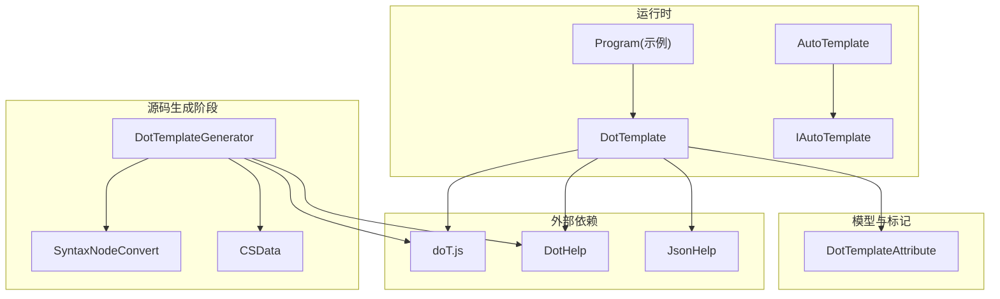
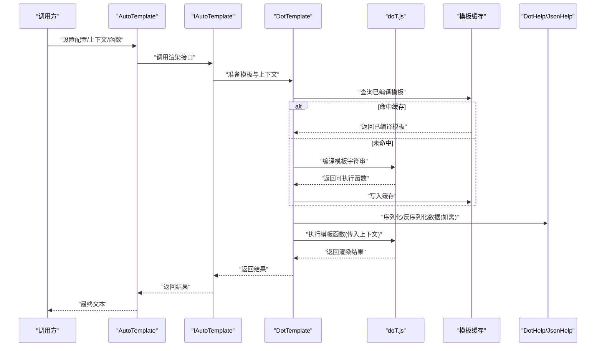
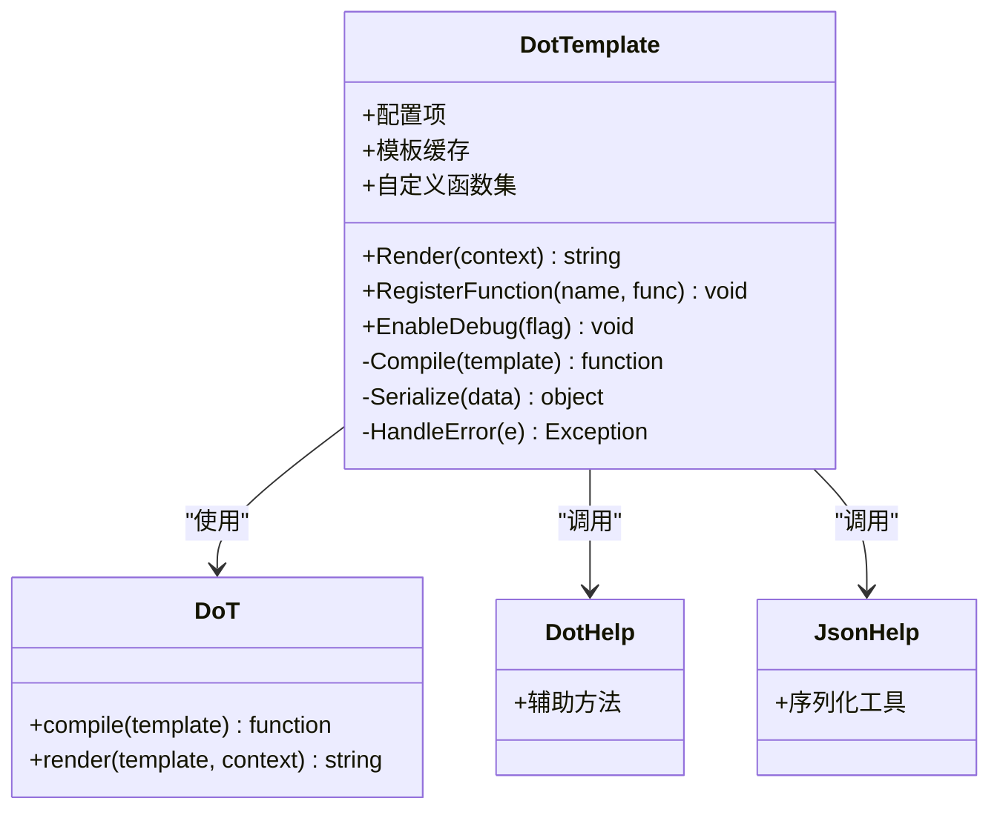
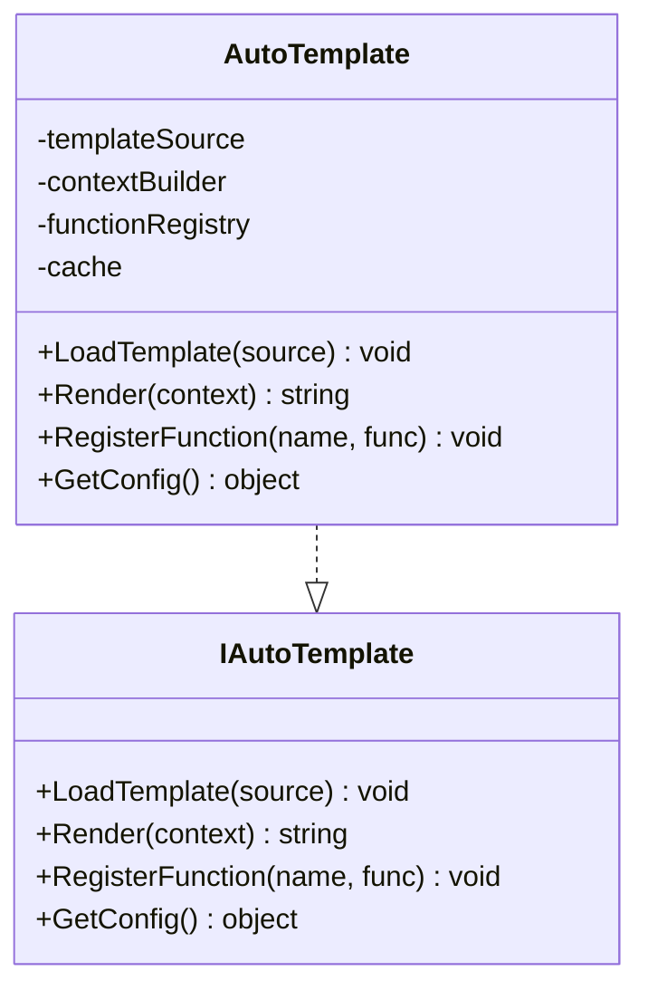
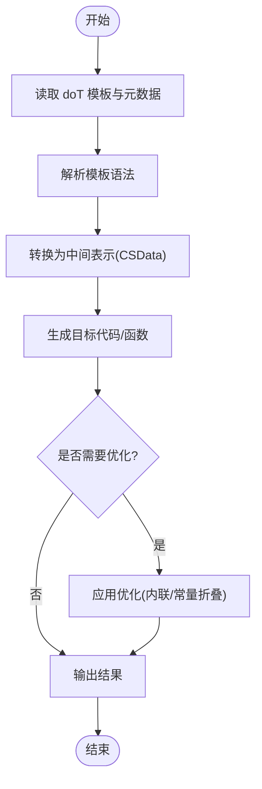
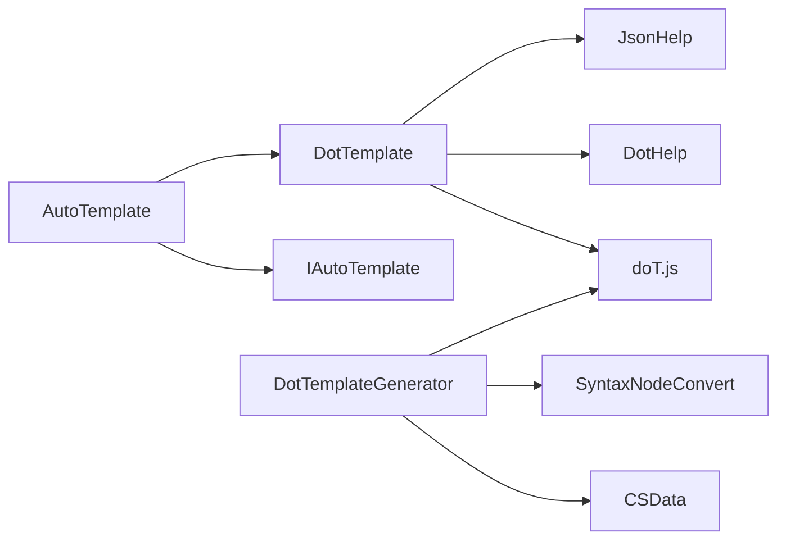

# 模板处理类

<cite>
**本文引用的文件**   
- [DotTemplate.cs](file://src/DotTemplate.APP/DotTemplate.cs)
- [AutoTemplate.cs](file://src/DotTemplate.APP/AutoTemplate.cs)
- [IAutoTemplate.cs](file://src/DotTemplate.APP/IAutoTemplate.cs)
- [Program.cs](file://src/DotTemplate.APP/Program.cs)
- [DotTemplateGenerator.cs](file://src/AutoCode.XmlTemplate.SourceGenerator/DotTemplateGenerator.cs)
- [SyntaxNodeConvert.cs](file://src/AutoCode.XmlTemplate.SourceGenerator/SyntaxNodeConvert.cs)
- [CSData.cs](file://src/AutoCode.XmlTemplate.SourceGenerator/CSData.cs)
- [doT.js](file://src/AutoCode.XmlTemplate.External/doT.js)
- [DotHelp.cs](file://src/AutoCode.XmlTemplate.External/DotHelp.cs)
- [JsonHelp.cs](file://src/AutoCode.XmlTemplate.External/JsonHelp.cs)
- [DotTemplateAttribute.cs](file://src/AutoCode.Model/DotFileAttribute/DotTemplateAttribute.cs)
</cite>

## 目录
1. [简介](#简介)
2. [项目结构](#项目结构)
3. [核心组件](#核心组件)
4. [架构总览](#架构总览)
5. [详细组件分析](#详细组件分析)
6. [依赖关系分析](#依赖关系分析)
7. [性能考虑](#性能考虑)
8. [故障排查指南](#故障排查指南)
9. [结论](#结论)
10. [附录：API参考与示例](#附录api参考与示例)

## 简介
本文件面向模板处理相关类的API参考，重点覆盖以下类型与能力：
- DotTemplate：基于 doT.js 的模板渲染封装，提供配置、变量替换、函数注册、缓存与错误处理。
- AutoTemplate：自动模板基类，简化常用场景下的模板加载与渲染流程。
- IAutoTemplate：自动模板抽象接口，定义统一的能力契约。
- DotTemplateGenerator：源码生成器中的模板处理入口，负责将 doT 模板编译为可执行代码或中间表示，并参与生成管线。

文档同时说明 doT.js 集成方式、模板语法支持、性能优化策略、模板缓存、错误处理与调试方法，并提供完整的代码示例路径，帮助读者快速上手和扩展。

## 项目结构
与模板处理相关的代码主要分布在以下模块：
- DotTemplate.APP：运行时模板引擎封装与示例程序。
- AutoCode.XmlTemplate.SourceGenerator：源码生成阶段的模板处理与代码生成。
- AutoCode.XmlTemplate.External：doT.js 外部依赖与辅助工具（JSON 序列化等）。
- AutoCode.Model：模板属性标记（如 DotTemplateAttribute），用于声明式绑定模板资源。

图表来源
- [DotTemplate.cs](file://src/DotTemplate.APP/DotTemplate.cs)
- [AutoTemplate.cs](file://src/DotTemplate.APP/AutoTemplate.cs)
- [IAutoTemplate.cs](file://src/DotTemplate.APP/IAutoTemplate.cs)
- [Program.cs](file://src/DotTemplate.APP/Program.cs)
- [DotTemplateGenerator.cs](file://src/AutoCode.XmlTemplate.SourceGenerator/DotTemplateGenerator.cs)
- [SyntaxNodeConvert.cs](file://src/AutoCode.XmlTemplate.SourceGenerator/SyntaxNodeConvert.cs)
- [CSData.cs](file://src/AutoCode.XmlTemplate.SourceGenerator/CSData.cs)
- [doT.js](file://src/AutoCode.XmlTemplate.External/doT.js)
- [DotHelp.cs](file://src/AutoCode.XmlTemplate.External/DotHelp.cs)
- [JsonHelp.cs](file://src/AutoCode.XmlTemplate.External/JsonHelp.cs)
- [DotTemplateAttribute.cs](file://src/AutoCode.Model/DotFileAttribute/DotTemplateAttribute.cs)

章节来源
- [DotTemplate.cs](file://src/DotTemplate.APP/DotTemplate.cs)
- [AutoTemplate.cs](file://src/DotTemplate.APP/AutoTemplate.cs)
- [IAutoTemplate.cs](file://src/DotTemplate.APP/IAutoTemplate.cs)
- [Program.cs](file://src/DotTemplate.APP/Program.cs)
- [DotTemplateGenerator.cs](file://src/AutoCode.XmlTemplate.SourceGenerator/DotTemplateGenerator.cs)
- [SyntaxNodeConvert.cs](file://src/AutoCode.XmlTemplate.SourceGenerator/SyntaxNodeConvert.cs)
- [CSData.cs](file://src/AutoCode.XmlTemplate.SourceGenerator/CSData.cs)
- [doT.js](file://src/AutoCode.XmlTemplate.External/doT.js)
- [DotHelp.cs](file://src/AutoCode.XmlTemplate.External/DotHelp.cs)
- [JsonHelp.cs](file://src/AutoCode.XmlTemplate.External/JsonHelp.cs)
- [DotTemplateAttribute.cs](file://src/AutoCode.Model/DotFileAttribute/DotTemplateAttribute.cs)

## 核心组件
本节概述各组件的职责与交互关系，便于快速定位 API 与扩展点。

- DotTemplate：封装 doT.js 的模板编译与渲染，提供配置项（如模板源、上下文对象、自定义函数）、变量替换机制、缓存策略、错误捕获与调试输出。
- AutoTemplate：实现 IAutoTemplate，提供默认模板加载、上下文构建、渲染管道，简化常见用法。
- IAutoTemplate：定义模板加载、渲染、函数注册、配置获取等契约。
- DotTemplateGenerator：在源码生成阶段读取 doT 模板，结合 CSData 与 SyntaxNodeConvert 进行转换，产出目标代码或中间表示，提升运行期性能。

章节来源
- [DotTemplate.cs](file://src/DotTemplate.APP/DotTemplate.cs)
- [AutoTemplate.cs](file://src/DotTemplate.APP/AutoTemplate.cs)
- [IAutoTemplate.cs](file://src/DotTemplate.APP/IAutoTemplate.cs)
- [DotTemplateGenerator.cs](file://src/AutoCode.XmlTemplate.SourceGenerator/DotTemplateGenerator.cs)

## 架构总览
下图展示了从“模板定义”到“渲染输出”的端到端流程，以及源码生成阶段的编译优化路径。

图表来源
- [DotTemplate.cs](file://src/DotTemplate.APP/DotTemplate.cs)
- [AutoTemplate.cs](file://src/DotTemplate.APP/AutoTemplate.cs)
- [IAutoTemplate.cs](file://src/DotTemplate.APP/IAutoTemplate.cs)
- [doT.js](file://src/AutoCode.XmlTemplate.External/doT.js)
- [DotHelp.cs](file://src/AutoCode.XmlTemplate.External/DotHelp.cs)
- [JsonHelp.cs](file://src/AutoCode.XmlTemplate.External/JsonHelp.cs)

## 详细组件分析

### DotTemplate 组件
职责与能力：
- 模板编译与执行：封装 doT.js 的 compile 与 render 流程，支持字符串模板与预编译缓存。
- 配置选项：模板源、上下文对象、是否启用缓存、调试开关、自定义函数集合。
- 变量替换机制：通过上下文对象映射变量名到值，支持嵌套对象与数组遍历。
- 自定义函数注册：允许注入业务函数，供模板中直接调用。
- 错误处理与调试：捕获编译与执行异常，输出诊断信息，支持断点与日志。

关键行为要点：
- 首次渲染时编译模板并缓存，后续请求直接复用，降低 CPU 开销。
- 对复杂数据结构进行安全序列化，避免循环引用导致的异常。
- 提供统一的错误包装，便于上层统一处理与上报。

章节来源
- [DotTemplate.cs](file://src/DotTemplate.APP/DotTemplate.cs)
- [doT.js](file://src/AutoCode.XmlTemplate.External/doT.js)
- [DotHelp.cs](file://src/AutoCode.XmlTemplate.External/DotHelp.cs)
- [JsonHelp.cs](file://src/AutoCode.XmlTemplate.External/JsonHelp.cs)

#### 类图（DotTemplate）

图表来源
- [DotTemplate.cs](file://src/DotTemplate.APP/DotTemplate.cs)
- [doT.js](file://src/AutoCode.XmlTemplate.External/doT.js)
- [DotHelp.cs](file://src/AutoCode.XmlTemplate.External/DotHelp.cs)
- [JsonHelp.cs](file://src/AutoCode.XmlTemplate.External/JsonHelp.cs)

### AutoTemplate 与 IAutoTemplate 组件
职责与能力：
- IAutoTemplate：定义模板加载、渲染、函数注册、配置访问等契约，确保不同实现的一致性。
- AutoTemplate：实现 IAutoTemplate，提供默认模板加载策略（如从嵌入资源或文件系统）、默认上下文构造、默认缓存策略。

关键行为要点：
- 通过接口解耦具体实现，便于替换或扩展（例如基于不同模板引擎的实现）。
- 默认实现聚焦易用性，减少样板代码；高级用户可通过继承或组合扩展行为。

章节来源
- [IAutoTemplate.cs](file://src/DotTemplate.APP/IAutoTemplate.cs)
- [AutoTemplate.cs](file://src/DotTemplate.APP/AutoTemplate.cs)

#### 类图（AutoTemplate 与 IAutoTemplate）

图表来源
- [IAutoTemplate.cs](file://src/DotTemplate.APP/IAutoTemplate.cs)
- [AutoTemplate.cs](file://src/DotTemplate.APP/AutoTemplate.cs)

### DotTemplateGenerator 组件（源码生成阶段）
职责与能力：
- 读取 doT 模板与相关元数据，转换为中间表示或目标代码。
- 与 CSData、SyntaxNodeConvert 协作，完成语法节点到 C# 结构的映射。
- 输出可执行的模板函数或初始化代码，减少运行期编译成本。

关键行为要点：
- 在编译期完成模板解析与优化，提高运行期性能。
- 支持增量生成与诊断信息，便于开发者定位问题。

章节来源
- [DotTemplateGenerator.cs](file://src/AutoCode.XmlTemplate.SourceGenerator/DotTemplateGenerator.cs)
- [SyntaxNodeConvert.cs](file://src/AutoCode.XmlTemplate.SourceGenerator/SyntaxNodeConvert.cs)
- [CSData.cs](file://src/AutoCode.XmlTemplate.SourceGenerator/CSData.cs)

#### 流程图（模板编译与生成）

图表来源
- [DotTemplateGenerator.cs](file://src/AutoCode.XmlTemplate.SourceGenerator/DotTemplateGenerator.cs)
- [SyntaxNodeConvert.cs](file://src/AutoCode.XmlTemplate.SourceGenerator/SyntaxNodeConvert.cs)
- [CSData.cs](file://src/AutoCode.XmlTemplate.SourceGenerator/CSData.cs)

### 示例程序（Program）
职责与能力：
- 演示如何创建 DotTemplate 实例、配置选项、注册自定义函数、加载模板与渲染数据。
- 展示 AutoTemplate 的便捷用法与扩展点。

章节来源
- [Program.cs](file://src/DotTemplate.APP/Program.cs)

## 依赖关系分析
- DotTemplate 依赖 doT.js 作为模板引擎核心，借助 DotHelp 与 JsonHelp 完成数据序列化与辅助操作。
- AutoTemplate 依赖 IAutoTemplate 契约，内部可能组合 DotTemplate 以完成具体渲染。
- DotTemplateGenerator 依赖 CSData 与 SyntaxNodeConvert 完成语法节点转换与数据建模，最终产出目标代码。

图表来源
- [DotTemplate.cs](file://src/DotTemplate.APP/DotTemplate.cs)
- [AutoTemplate.cs](file://src/DotTemplate.APP/AutoTemplate.cs)
- [IAutoTemplate.cs](file://src/DotTemplate.APP/IAutoTemplate.cs)
- [DotTemplateGenerator.cs](file://src/AutoCode.XmlTemplate.SourceGenerator/DotTemplateGenerator.cs)
- [SyntaxNodeConvert.cs](file://src/AutoCode.XmlTemplate.SourceGenerator/SyntaxNodeConvert.cs)
- [CSData.cs](file://src/AutoCode.XmlTemplate.SourceGenerator/CSData.cs)
- [doT.js](file://src/AutoCode.XmlTemplate.External/doT.js)
- [DotHelp.cs](file://src/AutoCode.XmlTemplate.External/DotHelp.cs)
- [JsonHelp.cs](file://src/AutoCode.XmlTemplate.External/JsonHelp.cs)

章节来源
- [DotTemplate.cs](file://src/DotTemplate.APP/DotTemplate.cs)
- [AutoTemplate.cs](file://src/DotTemplate.APP/AutoTemplate.cs)
- [IAutoTemplate.cs](file://src/DotTemplate.APP/IAutoTemplate.cs)
- [DotTemplateGenerator.cs](file://src/AutoCode.XmlTemplate.SourceGenerator/DotTemplateGenerator.cs)
- [SyntaxNodeConvert.cs](file://src/AutoCode.XmlTemplate.SourceGenerator/SyntaxNodeConvert.cs)
- [CSData.cs](file://src/AutoCode.XmlTemplate.SourceGenerator/CSData.cs)
- [doT.js](file://src/AutoCode.XmlTemplate.External/doT.js)
- [DotHelp.cs](file://src/AutoCode.XmlTemplate.External/DotHelp.cs)
- [JsonHelp.cs](file://src/AutoCode.XmlTemplate.External/JsonHelp.cs)

## 性能考虑
- 模板缓存：首次编译后缓存模板函数，避免重复编译带来的 CPU 开销。建议按模板键（名称+版本）进行缓存，防止脏读。
- 上下文对象优化：尽量复用上下文对象，减少频繁分配；对大型对象采用只读视图或投影。
- 自定义函数：将高频调用的逻辑下沉至 C# 层，避免在模板中进行复杂计算。
- 源码生成：利用 DotTemplateGenerator 在编译期生成模板函数，显著降低运行期开销。
- 序列化优化：使用高效的 JSON 序列化策略，避免循环引用与不必要的字段。

[本节为通用指导，不直接分析具体文件]

## 故障排查指南
常见问题与处理方法：
- 模板编译失败：检查模板语法是否正确，确认 doT.js 版本兼容性；开启调试模式查看错误堆栈。
- 变量未替换：确认上下文对象包含所需字段，注意大小写与命名空间；必要时使用 DotHelp 进行数据校验。
- 自定义函数未生效：确认函数注册名称与模板中调用一致；检查作用域与参数传递。
- 性能退化：检查是否存在未命中缓存的情况；评估上下文对象大小与复杂度；考虑源码生成。
- 调试技巧：启用调试开关，输出模板编译与执行日志；使用断点定位异常位置。

章节来源
- [DotTemplate.cs](file://src/DotTemplate.APP/DotTemplate.cs)
- [Program.cs](file://src/DotTemplate.APP/Program.cs)

## 结论
本参考文档系统梳理了模板处理相关类的 API 与实现细节，涵盖运行时渲染与源码生成两个阶段。通过 DotTemplate 与 AutoTemplate/IAutoTemplate 的组合，既能满足简单场景的快速上手，也能支撑复杂业务的扩展需求。配合 doT.js 与 DotTemplateGenerator，可在性能与可维护性之间取得良好平衡。建议在生产环境启用模板缓存与源码生成，并结合调试工具持续优化。

[本节为总结，不直接分析具体文件]

## 附录：API参考与示例

### API 参考概览
- DotTemplate
  - 配置项：模板源、上下文对象、缓存开关、调试开关、自定义函数集合。
  - 渲染方法：Render(context) 返回渲染后的文本。
  - 变量替换：通过上下文对象映射变量名到值，支持嵌套结构与数组遍历。
  - 自定义函数：RegisterFunction(name, func) 注册后可在模板中调用。
  - 错误处理：统一包装异常，提供诊断信息。
- AutoTemplate / IAutoTemplate
  - LoadTemplate(source) 加载模板源。
  - Render(context) 渲染模板。
  - RegisterFunction(name, func) 注册自定义函数。
  - GetConfig() 获取当前配置。
- DotTemplateGenerator
  - 读取模板与元数据，转换为中间表示或目标代码。
  - 与 CSData、SyntaxNodeConvert 协作完成语法节点映射。
  - 输出可执行模板函数或初始化代码。

章节来源
- [DotTemplate.cs](file://src/DotTemplate.APP/DotTemplate.cs)
- [AutoTemplate.cs](file://src/DotTemplate.APP/AutoTemplate.cs)
- [IAutoTemplate.cs](file://src/DotTemplate.APP/IAutoTemplate.cs)
- [DotTemplateGenerator.cs](file://src/AutoCode.XmlTemplate.SourceGenerator/DotTemplateGenerator.cs)
- [SyntaxNodeConvert.cs](file://src/AutoCode.XmlTemplate.SourceGenerator/SyntaxNodeConvert.cs)
- [CSData.cs](file://src/AutoCode.XmlTemplate.SourceGenerator/CSData.cs)

### doT.js 集成与模板语法
- 集成方式：通过 DotTemplate 封装 doT.js 的 compile 与 render，屏蔽底层差异。
- 模板语法：支持表达式、条件分支、循环遍历、局部变量与函数调用；建议在模板中保持简洁，复杂逻辑下沉至 C# 层。
- 性能优化：启用模板缓存与源码生成，减少运行期编译成本。

章节来源
- [doT.js](file://src/AutoCode.XmlTemplate.External/doT.js)
- [DotTemplate.cs](file://src/DotTemplate.APP/DotTemplate.cs)

### 完整示例路径
- 创建 DotTemplate 实例、配置选项、注册自定义函数、加载模板与渲染数据：参见示例程序入口。
- 使用 AutoTemplate 简化模板加载与渲染流程：参见 AutoTemplate 实现与契约。
- 在源码生成阶段处理模板：参见 DotTemplateGenerator 与相关转换类。

章节来源
- [Program.cs](file://src/DotTemplate.APP/Program.cs)
- [AutoTemplate.cs](file://src/DotTemplate.APP/AutoTemplate.cs)
- [IAutoTemplate.cs](file://src/DotTemplate.APP/IAutoTemplate.cs)
- [DotTemplateGenerator.cs](file://src/AutoCode.XmlTemplate.SourceGenerator/DotTemplateGenerator.cs)

### 模板缓存、错误处理与调试
- 模板缓存：按模板键缓存编译后的函数，避免重复编译；建议加入版本号或哈希以支持热更新。
- 错误处理：捕获编译与执行异常，输出诊断信息；提供重试或降级策略。
- 调试功能：启用调试开关，记录模板编译与执行日志；支持断点与堆栈追踪。

章节来源
- [DotTemplate.cs](file://src/DotTemplate.APP/DotTemplate.cs)
- [Program.cs](file://src/DotTemplate.APP/Program.cs)

### 自定义模板与动态内容生成
- 自定义模板：通过 DotTemplateAttribute 声明模板资源，结合 DotTemplate 加载与渲染。
- 复杂数据结构：使用上下文对象承载数据，借助 DotHelp 与 JsonHelp 进行序列化与校验。
- 动态内容生成：在模板中调用注册的自定义函数，实现业务逻辑的动态拼接与格式化。

章节来源
- [DotTemplateAttribute.cs](file://src/AutoCode.Model/DotFileAttribute/DotTemplateAttribute.cs)
- [DotTemplate.cs](file://src/DotTemplate.APP/DotTemplate.cs)
- [DotHelp.cs](file://src/AutoCode.XmlTemplate.External/DotHelp.cs)
- [JsonHelp.cs](file://src/AutoCode.XmlTemplate.External/JsonHelp.cs)
