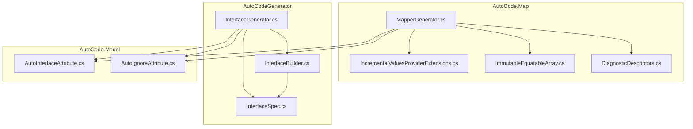
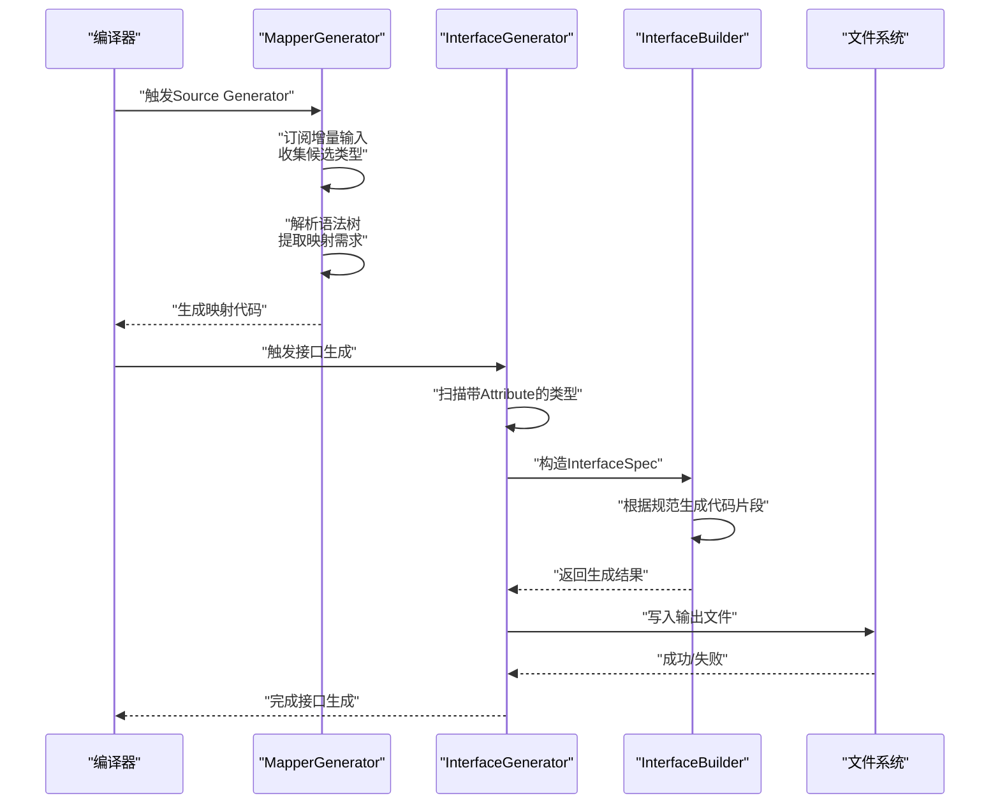
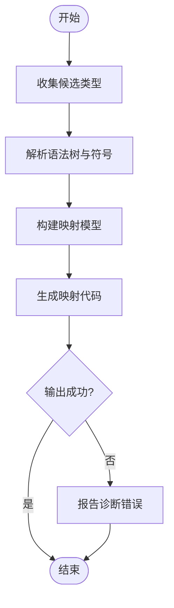
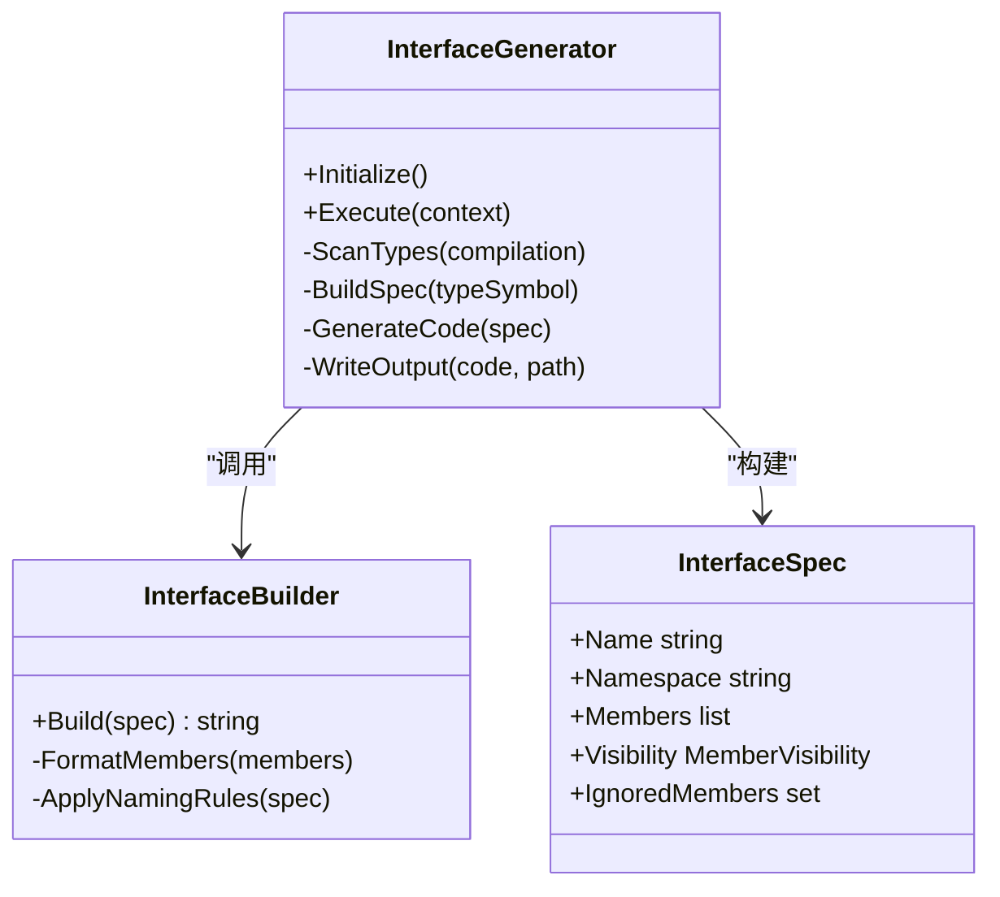
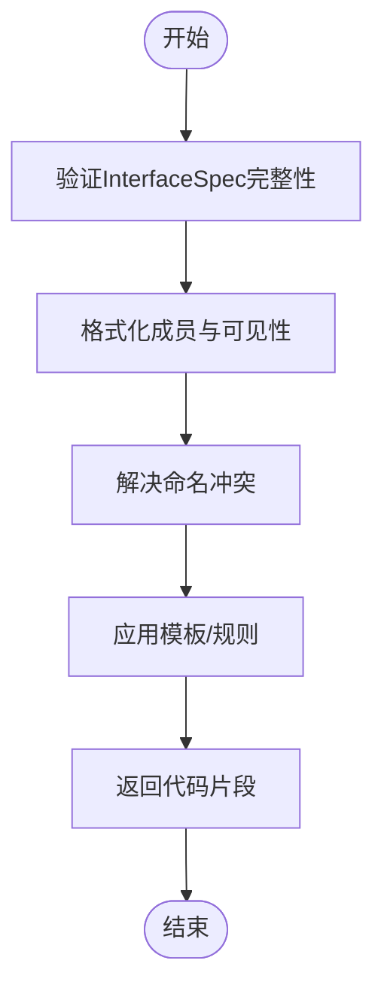
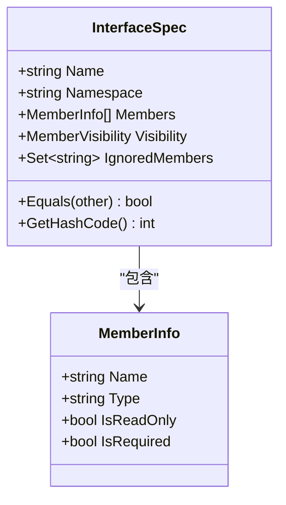
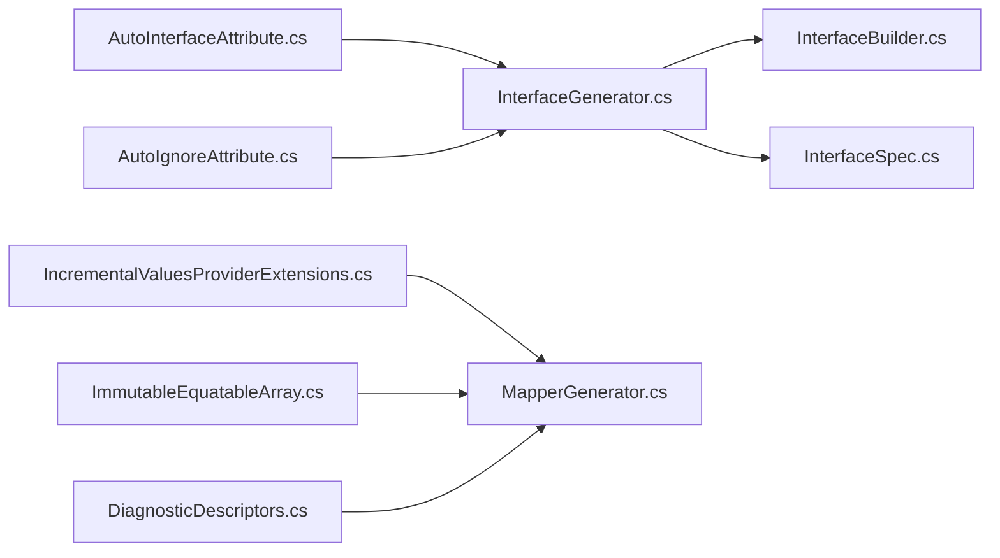

# 源代码生成器类

<cite>
**本文引用的文件**   
- [MapperGenerator.cs](file://src/AutoCode.Map/MapperGenerator.cs)
- [InterfaceBuilder.cs](file://src/AutoCodeGenerator/InterfaceAutoBuilder/InterfaceBuilder.cs)
- [InterfaceGenerator.cs](file://src/AutoCodeGenerator/InterfaceAutoBuilder/InterfaceGenerator.cs)
- [InterfaceSpec.cs](file://src/AutoCodeGenerator/InterfaceAutoBuilder/InterfaceSpec.cs)
- [AutoInterfaceAttribute.cs](file://src/AutoCode.Model/InterfaceAttribute/AutoInterfaceAttribute.cs)
- [AutoIgnoreAttribute.cs](file://src/AutoCode.Model/InterfaceAttribute/AutoIgnoreAttribute.cs)
- [IncrementalValuesProviderExtensions.cs](file://src/AutoCode.Map/Helpers/IncrementalValuesProviderExtensions.cs)
- [ImmutableEquatableArray.cs](file://src/AutoCode.Map/Helpers/ImmutableEquatableArray.cs)
- [DiagnosticDescriptors.cs](file://src/AutoCode.Map/Diagnostics/DiagnosticDescriptors.cs)
</cite>

## 目录
1. [简介](#简介)
2. [项目结构](#项目结构)
3. [核心组件](#核心组件)
4. [架构总览](#架构总览)
5. [详细组件分析](#详细组件分析)
6. [依赖关系分析](#依赖关系分析)
7. [性能考量](#性能考量)
8. [故障排查指南](#故障排查指南)
9. [结论](#结论)
10. [附录](#附录)

## 简介
本文件面向“源代码生成器”相关类的API参考与使用指南，重点覆盖以下核心类：
- MapperGenerator：映射代码生成器（增量式Source Generator）
- InterfaceGenerator：接口代码生成器（增量式Source Generator）
- InterfaceBuilder：接口构建器（负责将语法树信息转换为可生成的中间表示）
- InterfaceSpec：接口规范（描述待生成的接口元数据）

文档将详细说明各组件的职责、输入输出、事件处理、错误处理策略、性能优化要点，并给出如何继承扩展以创建自定义生成器的实践建议。同时提供流程图与时序图，帮助理解从语法树分析到代码输出的完整工作流。

## 项目结构
本项目采用多工程组织，与源代码生成相关的核心代码分布在以下工程中：
- AutoCode.Map：包含MapperGenerator及相关辅助类型（诊断、增量提供者扩展等）
- AutoCodeGenerator：包含InterfaceGenerator、InterfaceBuilder、InterfaceSpec等接口生成相关实现
- AutoCode.Model：包含用于标记的Attribute定义（如AutoInterfaceAttribute、AutoIgnoreAttribute），供生成器识别目标类型

**图表来源** 
- [MapperGenerator.cs](file://src/AutoCode.Map/MapperGenerator.cs)
- [InterfaceGenerator.cs](file://src/AutoCodeGenerator/InterfaceAutoBuilder/InterfaceGenerator.cs)
- [InterfaceBuilder.cs](file://src/AutoCodeGenerator/InterfaceAutoBuilder/InterfaceBuilder.cs)
- [InterfaceSpec.cs](file://src/AutoCodeGenerator/InterfaceAutoBuilder/InterfaceSpec.cs)
- [AutoInterfaceAttribute.cs](file://src/AutoCode.Model/InterfaceAttribute/AutoInterfaceAttribute.cs)
- [AutoIgnoreAttribute.cs](file://src/AutoCode.Model/InterfaceAttribute/AutoIgnoreAttribute.cs)
- [IncrementalValuesProviderExtensions.cs](file://src/AutoCode.Map/Helpers/IncrementalValuesProviderExtensions.cs)
- [ImmutableEquatableArray.cs](file://src/AutoCode.Map/Helpers/ImmutableEquatableArray.cs)
- [DiagnosticDescriptors.cs](file://src/AutoCode.Map/Diagnostics/DiagnosticDescriptors.cs)

**章节来源**
- [MapperGenerator.cs](file://src/AutoCode.Map/MapperGenerator.cs)
- [InterfaceGenerator.cs](file://src/AutoCodeGenerator/InterfaceAutoBuilder/InterfaceGenerator.cs)
- [InterfaceBuilder.cs](file://src/AutoCodeGenerator/InterfaceAutoBuilder/InterfaceBuilder.cs)
- [InterfaceSpec.cs](file://src/AutoCodeGenerator/InterfaceAutoBuilder/InterfaceSpec.cs)
- [AutoInterfaceAttribute.cs](file://src/AutoCode.Model/InterfaceAttribute/AutoInterfaceAttribute.cs)
- [AutoIgnoreAttribute.cs](file://src/AutoCode.Model/InterfaceAttribute/AutoIgnoreAttribute.cs)
- [IncrementalValuesProviderExtensions.cs](file://src/AutoCode.Map/Helpers/IncrementalValuesProviderExtensions.cs)
- [ImmutableEquatableArray.cs](file://src/AutoCode.Map/Helpers/ImmutableEquatableArray.cs)
- [DiagnosticDescriptors.cs](file://src/AutoCode.Map/Diagnostics/DiagnosticDescriptors.cs)

## 核心组件
本节概述四个核心类的职责与协作关系：
- MapperGenerator：作为Source Generator入口，订阅编译时增量输入，解析语法树，收集需要生成映射的类型，调用具体生成逻辑并输出文件。
- InterfaceGenerator：作为接口生成器入口，同样基于增量管道，扫描带有特定Attribute的类型，构造接口规范，驱动构建器生成代码。
- InterfaceBuilder：将抽象的接口规范转化为具体的代码片段或文本，负责模板填充、命名规则、成员排序等。
- InterfaceSpec：承载接口元数据（名称、命名空间、成员列表、可见性、忽略标记等），是生成器与构建器之间的契约对象。

这些组件共同构成“分析—建模—构建—输出”的流水线，确保在增量模式下高效更新。

**章节来源**
- [MapperGenerator.cs](file://src/AutoCode.Map/MapperGenerator.cs)
- [InterfaceGenerator.cs](file://src/AutoCodeGenerator/InterfaceAutoBuilder/InterfaceGenerator.cs)
- [InterfaceBuilder.cs](file://src/AutoCodeGenerator/InterfaceAutoBuilder/InterfaceBuilder.cs)
- [InterfaceSpec.cs](file://src/AutoCodeGenerator/InterfaceAutoBuilder/InterfaceSpec.cs)

## 架构总览
下图展示了从编译器触发到代码输出的关键流程，包括增量输入、语法树分析、模型构建、代码生成与文件写入。

**图表来源** 
- [MapperGenerator.cs](file://src/AutoCode.Map/MapperGenerator.cs)
- [InterfaceGenerator.cs](file://src/AutoCodeGenerator/InterfaceAutoBuilder/InterfaceGenerator.cs)
- [InterfaceBuilder.cs](file://src/AutoCodeGenerator/InterfaceAutoBuilder/InterfaceBuilder.cs)
- [InterfaceSpec.cs](file://src/AutoCodeGenerator/InterfaceAutoBuilder/InterfaceSpec.cs)

## 详细组件分析

### MapperGenerator（映射代码生成器）
- 角色定位：增量Source Generator，负责在编译期扫描源文件，识别需要生成映射的类型，并输出映射代码。
- 输入来源：通过增量管道获取SyntaxTree、Compilation、Attribute信息等；可使用扩展方法提升增量效率。
- 处理流程：
  - 收集候选类型（过滤条件由Attribute或约定决定）
  - 解析语法树，提取类型、成员、属性、泛型等信息
  - 生成映射代码（例如转换方法、初始化逻辑等）
  - 输出到指定文件路径
- 错误处理：通过诊断描述符上报编译期诊断，便于IDE提示与构建失败控制。
- 性能优化：充分利用增量管道，避免重复分析未变更的单元；对集合使用不可变数组以减少分配。

**图表来源** 
- [MapperGenerator.cs](file://src/AutoCode.Map/MapperGenerator.cs)
- [IncrementalValuesProviderExtensions.cs](file://src/AutoCode.Map/Helpers/IncrementalValuesProviderExtensions.cs)
- [ImmutableEquatableArray.cs](file://src/AutoCode.Map/Helpers/ImmutableEquatableArray.cs)
- [DiagnosticDescriptors.cs](file://src/AutoCode.Map/Diagnostics/DiagnosticDescriptors.cs)

**章节来源**
- [MapperGenerator.cs](file://src/AutoCode.Map/MapperGenerator.cs)
- [IncrementalValuesProviderExtensions.cs](file://src/AutoCode.Map/Helpers/IncrementalValuesProviderExtensions.cs)
- [ImmutableEquatableArray.cs](file://src/AutoCode.Map/Helpers/ImmutableEquatableArray.cs)
- [DiagnosticDescriptors.cs](file://src/AutoCode.Map/Diagnostics/DiagnosticDescriptors.cs)

### InterfaceGenerator（接口代码生成器）
- 角色定位：增量Source Generator，扫描带有特定Attribute的类型，生成对应的接口代码。
- 输入来源：编译上下文、语法树、Attribute信息（如AutoInterfaceAttribute、AutoIgnoreAttribute）。
- 处理流程：
  - 遍历候选类型，筛选出被标记的类型
  - 读取类型成员与Attribute配置，构建InterfaceSpec
  - 调用InterfaceBuilder生成接口代码
  - 写入输出文件
- 错误处理：遇到非法标记或无法解析的成员时，上报诊断信息。
- 性能优化：增量管道结合不可变数据结构，减少不必要的重建。

**图表来源** 
- [InterfaceGenerator.cs](file://src/AutoCodeGenerator/InterfaceAutoBuilder/InterfaceGenerator.cs)
- [InterfaceBuilder.cs](file://src/AutoCodeGenerator/InterfaceAutoBuilder/InterfaceBuilder.cs)
- [InterfaceSpec.cs](file://src/AutoCodeGenerator/InterfaceAutoBuilder/InterfaceSpec.cs)

**章节来源**
- [InterfaceGenerator.cs](file://src/AutoCodeGenerator/InterfaceAutoBuilder/InterfaceGenerator.cs)
- [InterfaceBuilder.cs](file://src/AutoCodeGenerator/InterfaceAutoBuilder/InterfaceBuilder.cs)
- [InterfaceSpec.cs](file://src/AutoCodeGenerator/InterfaceAutoBuilder/InterfaceSpec.cs)

### InterfaceBuilder（接口构建器）
- 角色定位：将InterfaceSpec转换为最终代码文本，负责格式化、命名、成员排序、可见性处理等。
- 输入：InterfaceSpec实例，包含接口名称、命名空间、成员列表、可见性等。
- 输出：字符串形式的接口代码片段。
- 关键点：
  - 成员排序策略（按字母顺序、声明顺序或自定义规则）
  - 命名冲突处理（自动添加后缀或前缀）
  - 模板化生成（支持外部模板注入）
- 错误处理：当Spec不完整或成员类型无法解析时，抛出异常或返回空片段，由上层记录诊断。

**图表来源** 
- [InterfaceBuilder.cs](file://src/AutoCodeGenerator/InterfaceAutoBuilder/InterfaceBuilder.cs)
- [InterfaceSpec.cs](file://src/AutoCodeGenerator/InterfaceAutoBuilder/InterfaceSpec.cs)

**章节来源**
- [InterfaceBuilder.cs](file://src/AutoCodeGenerator/InterfaceAutoBuilder/InterfaceBuilder.cs)
- [InterfaceSpec.cs](file://src/AutoCodeGenerator/InterfaceAutoBuilder/InterfaceSpec.cs)

### InterfaceSpec（接口规范）
- 角色定位：承载接口元数据的值对象，作为生成器与构建器之间的契约。
- 主要属性：
  - 名称（Name）
  - 命名空间（Namespace）
  - 成员列表（Members）
  - 可见性（Visibility）
  - 忽略成员集合（IgnoredMembers）
- 设计原则：
  - 不可变性，保证线程安全与增量比较
  - 相等性比较支持快速去重与缓存
- 使用场景：
  - InterfaceGenerator构建Spec后传递给InterfaceBuilder
  - 在增量管道中作为键参与哈希与比较

**图表来源** 
- [InterfaceSpec.cs](file://src/AutoCodeGenerator/InterfaceAutoBuilder/InterfaceSpec.cs)

**章节来源**
- [InterfaceSpec.cs](file://src/AutoCodeGenerator/InterfaceAutoBuilder/InterfaceSpec.cs)

## 依赖关系分析
- Attribute依赖：
  - AutoInterfaceAttribute：用于标记需要生成接口的类型
  - AutoIgnoreAttribute：用于忽略某些成员或类型
- 增量管道依赖：
  - IncrementalValuesProviderExtensions：提供增量处理的扩展方法，提高性能
  - ImmutableEquatableArray：不可变且支持相等性比较的数组，用于缓存与比较
- 诊断依赖：
  - DiagnosticDescriptors：集中定义诊断ID、消息模板、严重级别等

**图表来源** 
- [AutoInterfaceAttribute.cs](file://src/AutoCode.Model/InterfaceAttribute/AutoInterfaceAttribute.cs)
- [AutoIgnoreAttribute.cs](file://src/AutoCode.Model/InterfaceAttribute/AutoIgnoreAttribute.cs)
- [IncrementalValuesProviderExtensions.cs](file://src/AutoCode.Map/Helpers/IncrementalValuesProviderExtensions.cs)
- [ImmutableEquatableArray.cs](file://src/AutoCode.Map/Helpers/ImmutableEquatableArray.cs)
- [DiagnosticDescriptors.cs](file://src/AutoCode.Map/Diagnostics/DiagnosticDescriptors.cs)
- [InterfaceGenerator.cs](file://src/AutoCodeGenerator/InterfaceAutoBuilder/InterfaceGenerator.cs)
- [InterfaceBuilder.cs](file://src/AutoCodeGenerator/InterfaceAutoBuilder/InterfaceBuilder.cs)
- [InterfaceSpec.cs](file://src/AutoCodeGenerator/InterfaceAutoBuilder/InterfaceSpec.cs)
- [MapperGenerator.cs](file://src/AutoCode.Map/MapperGenerator.cs)

**章节来源**
- [AutoInterfaceAttribute.cs](file://src/AutoCode.Model/InterfaceAttribute/AutoInterfaceAttribute.cs)
- [AutoIgnoreAttribute.cs](file://src/AutoCode.Model/InterfaceAttribute/AutoIgnoreAttribute.cs)
- [IncrementalValuesProviderExtensions.cs](file://src/AutoCode.Map/Helpers/IncrementalValuesProviderExtensions.cs)
- [ImmutableEquatableArray.cs](file://src/AutoCode.Map/Helpers/ImmutableEquatableArray.cs)
- [DiagnosticDescriptors.cs](file://src/AutoCode.Map/Diagnostics/DiagnosticDescriptors.cs)
- [InterfaceGenerator.cs](file://src/AutoCodeGenerator/InterfaceAutoBuilder/InterfaceGenerator.cs)
- [InterfaceBuilder.cs](file://src/AutoCodeGenerator/InterfaceAutoBuilder/InterfaceBuilder.cs)
- [InterfaceSpec.cs](file://src/AutoCodeGenerator/InterfaceAutoBuilder/InterfaceSpec.cs)
- [MapperGenerator.cs](file://src/AutoCode.Map/MapperGenerator.cs)

## 性能考量
- 增量管道：充分利用Source Generator的增量能力，仅对变更部分重新分析，避免全量重建。
- 不可变数据结构：使用ImmutableEquatableArray等类型，降低GC压力并支持快速比较。
- 缓存与去重：对已分析的语法树和符号进行缓存，避免重复计算。
- 诊断延迟：仅在必要时上报诊断，减少I/O与UI开销。
- 模板复用：InterfaceBuilder应复用模板与格式化逻辑，避免每次生成都重新解析。

[本节为通用指导，不直接分析具体文件]

## 故障排查指南
- 常见错误：
  - Attribute使用不当：检查AutoInterfaceAttribute与AutoIgnoreAttribute是否正确应用到类型与成员
  - 语法解析失败：确认类型与成员可被Roslyn正确解析，避免复杂表达式或动态类型
  - 输出路径冲突：确保多个生成器不会写入相同文件路径
- 调试技巧：
  - 启用增量日志：观察哪些单元触发了重新生成
  - 打印InterfaceSpec：验证模型是否符合预期
  - 使用诊断消息：通过DiagnosticDescriptors查看具体错误位置与原因
- 恢复策略：
  - 清理中间产物后重新构建
  - 逐步缩小范围，定位问题类型或成员

**章节来源**
- [DiagnosticDescriptors.cs](file://src/AutoCode.Map/Diagnostics/DiagnosticDescriptors.cs)
- [InterfaceSpec.cs](file://src/AutoCodeGenerator/InterfaceAutoBuilder/InterfaceSpec.cs)
- [AutoInterfaceAttribute.cs](file://src/AutoCode.Model/InterfaceAttribute/AutoInterfaceAttribute.cs)
- [AutoIgnoreAttribute.cs](file://src/AutoCode.Model/InterfaceAttribute/AutoIgnoreAttribute.cs)

## 结论
MapperGenerator、InterfaceGenerator、InterfaceBuilder与InterfaceSpec构成了一个清晰、可扩展的源代码生成框架。通过增量管道与不可变数据结构，系统在性能与稳定性之间取得平衡。开发者可基于现有基类快速扩展自定义生成器，遵循统一的规范与错误处理策略，确保生成代码的一致性与可维护性。

[本节为总结性内容，不直接分析具体文件]

## 附录
- 扩展建议：
  - 继承InterfaceGenerator以支持新的Attribute或语言特性
  - 扩展InterfaceBuilder以支持更多模板或格式化规则
  - 在InterfaceSpec中添加新字段以承载额外元数据
- 最佳实践：
  - 保持Spec的不可变性与相等性比较
  - 合理使用诊断消息，避免噪音
  - 在增量管道中尽量早地过滤无用输入

[本节为补充说明，不直接分析具体文件]