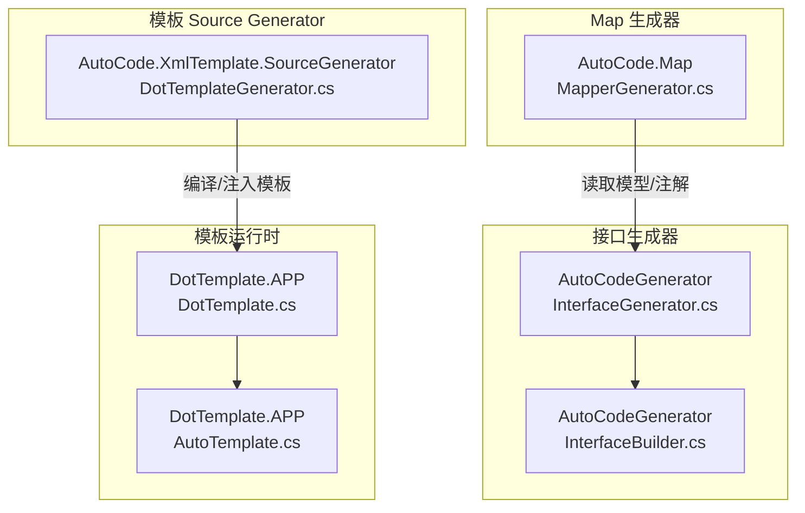
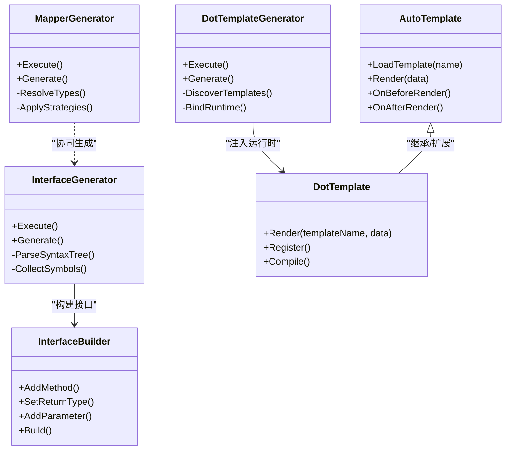
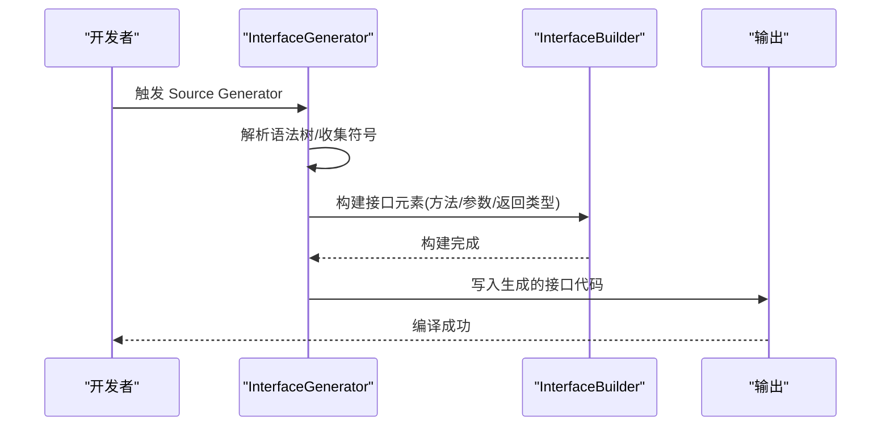
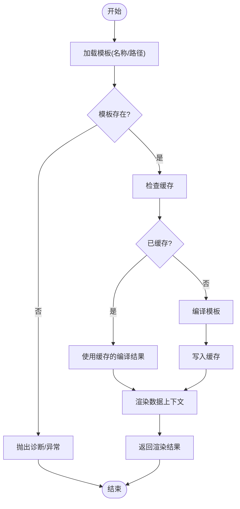
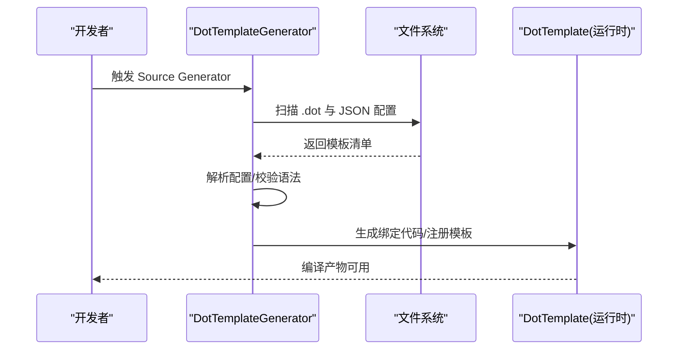
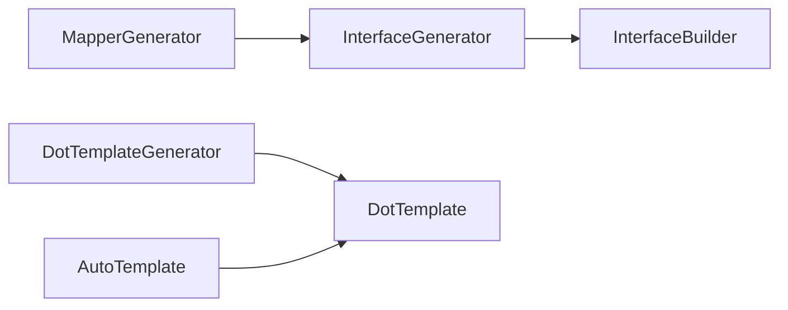

# 类参考

<cite>
**本文引用的文件**   
- [MapperGenerator.cs](file://src/AutoCode.Map/MapperGenerator.cs)
- [InterfaceGenerator.cs](file://src/AutoCodeGenerator/InterfaceAutoBuilder/InterfaceGenerator.cs)
- [InterfaceBuilder.cs](file://src/AutoCodeGenerator/InterfaceAutoBuilder/InterfaceBuilder.cs)
- [DotTemplate.cs](file://src/DotTemplate.APP/DotTemplate.cs)
- [AutoTemplate.cs](file://src/DotTemplate.APP/AutoTemplate.cs)
- [DotTemplateGenerator.cs](file://src/AutoCode.XmlTemplate.SourceGenerator/DotTemplateGenerator.cs)
</cite>

## 目录
1. [简介](#简介)
2. [项目结构](#项目结构)
3. [核心组件](#核心组件)
4. [架构总览](#架构总览)
5. [详细组件分析](#详细组件分析)
6. [依赖关系分析](#依赖关系分析)
7. [性能考量](#性能考量)
8. [故障排查指南](#故障排查指南)
9. [结论](#结论)
10. [附录：使用示例与最佳实践](#附录使用示例与最佳实践)

## 简介
本文件为 AutoCode 框架核心类的 API 参考，聚焦以下关键类：
- MapperGenerator：映射生成器（Source Generator），负责根据属性注解生成映射代码。
- InterfaceGenerator：接口生成器（Source Generator），负责基于类型与注解自动生成接口定义。
- InterfaceBuilder：接口构建器，封装接口元素（方法、参数、返回类型）的构造逻辑。
- DotTemplate：dot 模板引擎封装，支持 JSON 配置与 doT.js 渲染。
- AutoTemplate：模板抽象基类，统一模板加载、渲染与扩展点。
- DotTemplateGenerator：dot 模板 Source Generator，将 dot 模板编译并注入到目标项目中。

文档面向开发者与使用者，既提供高层架构说明，也给出类级别 API 细节、设计模式、继承与依赖关系，以及可操作的调用示例路径。

## 项目结构
AutoCode 由多个子项目组成，核心生成器分布在 Map、SourceGenerator、XmlTemplate.SourceGenerator 等工程中；模板运行时位于 DotTemplate.APP。下图概览了与本文相关的工程与文件组织。

图表来源
- [MapperGenerator.cs](file://src/AutoCode.Map/MapperGenerator.cs)
- [InterfaceGenerator.cs](file://src/AutoCodeGenerator/InterfaceAutoBuilder/InterfaceGenerator.cs)
- [InterfaceBuilder.cs](file://src/AutoCodeGenerator/InterfaceAutoBuilder/InterfaceBuilder.cs)
- [DotTemplate.cs](file://src/DotTemplate.APP/DotTemplate.cs)
- [AutoTemplate.cs](file://src/DotTemplate.APP/AutoTemplate.cs)
- [DotTemplateGenerator.cs](file://src/AutoCode.XmlTemplate.SourceGenerator/DotTemplateGenerator.cs)

章节来源
- [MapperGenerator.cs](file://src/AutoCode.Map/MapperGenerator.cs)
- [InterfaceGenerator.cs](file://src/AutoCodeGenerator/InterfaceAutoBuilder/InterfaceGenerator.cs)
- [InterfaceBuilder.cs](file://src/AutoCodeGenerator/InterfaceAutoBuilder/InterfaceBuilder.cs)
- [DotTemplate.cs](file://src/DotTemplate.APP/DotTemplate.cs)
- [AutoTemplate.cs](file://src/DotTemplate.APP/AutoTemplate.cs)
- [DotTemplateGenerator.cs](file://src/AutoCode.XmlTemplate.SourceGenerator/DotTemplateGenerator.cs)

## 核心组件
本节对每个核心类进行 API 级说明，包括职责、主要成员、设计模式、异常处理与调用要点。为避免泄露实现细节，本节不直接粘贴代码，而通过“片段路径”指向具体源码位置。

### MapperGenerator（映射生成器）
- 职责
  - 作为 Source Generator，扫描模型类型与映射相关注解，生成对应的映射代码（如对象拷贝、DTO 转换）。
  - 依据属性策略（命名策略、忽略规则、枚举映射、值映射等）决定生成行为。
- 关键成员（概念性描述）
  - 构造函数：接收 Source Generator 上下文与诊断信息提供者。
  - Execute/Generate：入口方法，解析语法树、收集符号、生成代码并输出。
  - 内部辅助：类型解析、属性遍历、策略应用、代码文本拼接。
- 设计模式
  - 策略模式：不同映射策略（命名、枚举、值）可插拔。
  - 工厂模式：按注解或约定创建具体的映射生成器实例。
- 异常处理
  - 对不可解析的类型、缺失的属性、冲突的映射规则抛出诊断错误，避免生成失败影响编译。
- 调用示例（路径）
  - 在模型上添加映射注解后，重新编译即可触发生成。参见测试用例中的用法。
  
章节来源
- [MapperGenerator.cs](file://src/AutoCode.Map/MapperGenerator.cs)

### InterfaceGenerator（接口生成器）
- 职责
  - 作为 Source Generator，扫描目标类型与接口注解，自动生成接口定义与方法签名。
  - 支持忽略标记、自动推断返回类型、参数约束等。
- 关键成员（概念性描述）
  - 构造函数：接收上下文与诊断工具。
  - Execute/Generate：入口，解析语法树，识别待生成接口的类型集合。
  - 与 InterfaceBuilder 协作，产出最终接口文本。
- 设计模式
  - 管道模式：解析 -> 过滤 -> 构建 -> 输出。
  - 组合模式：接口由多个方法/参数组合而成。
- 异常处理
  - 对非法注解、循环依赖、无法解析的类型发出诊断，保证生成过程健壮。
- 调用示例（路径）
  - 在类型上标注接口注解，重新编译即生成对应接口。参见测试用例。

章节来源
- [InterfaceGenerator.cs](file://src/AutoCodeGenerator/InterfaceAutoBuilder/InterfaceGenerator.cs)

### InterfaceBuilder（接口构建器）
- 职责
  - 封装接口元素的构建逻辑：方法签名、参数列表、返回类型、访问修饰符、特性附加等。
  - 提供一致的构建 API，屏蔽底层文本拼接细节。
- 关键成员（概念性描述）
  - AddMethod：添加方法定义。
  - SetReturnType：设置返回类型。
  - AddParameter：添加参数及修饰符。
  - Build：生成最终的接口文本。
- 设计模式
  - 建造者模式：逐步构建复杂接口结构。
  - 责任链：校验、格式化、去重等步骤串联。
- 异常处理
  - 对重复方法名、非法类型引用进行校验并抛出诊断。
- 调用示例（路径）
  - 由 InterfaceGenerator 调用，用于拼装接口文本。

章节来源
- [InterfaceBuilder.cs](file://src/AutoCodeGenerator/InterfaceAutoBuilder/InterfaceBuilder.cs)

### DotTemplate（dot 模板引擎封装）
- 职责
  - 封装 doT.js 能力，提供统一的模板渲染接口。
  - 支持从 JSON 配置加载模板、合并数据上下文、缓存编译结果。
- 关键成员（概念性描述）
  - 构造函数：初始化引擎、加载默认配置。
  - Render(templateName, data)：渲染指定模板。
  - Register/Unregister：注册/注销自定义函数或过滤器。
  - Compile/Cache：编译与缓存模板以提升性能。
- 设计模式
  - 适配器模式：适配 doT.js 的 API。
  - 单例/缓存：模板编译结果缓存。
- 异常处理
  - 模板不存在、语法错误、渲染异常均捕获并转换为诊断信息。
- 调用示例（路径）
  - 在业务层通过 AutoTemplate 或直接调用 DotTemplate 渲染模板。

章节来源
- [DotTemplate.cs](file://src/DotTemplate.APP/DotTemplate.cs)

### AutoTemplate（模板抽象基类）
- 职责
  - 定义模板加载、渲染、扩展点的抽象契约。
  - 提供默认实现，简化子类开发。
- 关键成员（概念性描述）
  - LoadTemplate(name)：加载模板内容。
  - Render(data)：渲染模板并返回字符串。
  - OnBeforeRender/OnAfterRender：生命周期钩子，便于扩展。
- 设计模式
  - 模板方法模式：定义渲染流程骨架，子类可覆盖特定步骤。
  - 策略模式：可替换不同的模板引擎实现。
- 异常处理
  - 模板加载失败、渲染异常时抛出明确诊断。
- 调用示例（路径）
  - 继承 AutoTemplate 实现自定义模板源（数据库、远程服务等）。

章节来源
- [AutoTemplate.cs](file://src/DotTemplate.APP/AutoTemplate.cs)

### DotTemplateGenerator（dot 模板 Source Generator）
- 职责
  - 作为 Source Generator，扫描项目中的 dot 模板文件，将其编译为可直接调用的模板资源。
  - 将模板与数据绑定逻辑注入到目标项目，供运行时渲染。
- 关键成员（概念性描述）
  - Execute/Generate：入口，发现模板文件、解析配置、生成绑定代码。
  - 与 DotTemplate 配合，提供高性能渲染。
- 设计模式
  - 插件化：模板以文件形式存在，按需加载。
  - 增量编译：仅处理变更模板，提升构建速度。
- 异常处理
  - 模板语法错误、路径冲突、配置缺失时输出诊断。
- 调用示例（路径）
  - 在项目中放置 dot 模板与 JSON 配置，重新编译即生成绑定代码。

章节来源
- [DotTemplateGenerator.cs](file://src/AutoCode.XmlTemplate.SourceGenerator/DotTemplateGenerator.cs)

## 架构总览
下图展示各核心组件之间的交互关系与数据流向。

图表来源
- [MapperGenerator.cs](file://src/AutoCode.Map/MapperGenerator.cs)
- [InterfaceGenerator.cs](file://src/AutoCodeGenerator/InterfaceAutoBuilder/InterfaceGenerator.cs)
- [InterfaceBuilder.cs](file://src/AutoCodeGenerator/InterfaceAutoBuilder/InterfaceBuilder.cs)
- [DotTemplate.cs](file://src/DotTemplate.APP/DotTemplate.cs)
- [AutoTemplate.cs](file://src/DotTemplate.APP/AutoTemplate.cs)
- [DotTemplateGenerator.cs](file://src/AutoCode.XmlTemplate.SourceGenerator/DotTemplateGenerator.cs)

## 详细组件分析

### 接口生成流程（Sequence）
该序列图展示了从扫描到生成接口的典型调用链。

图表来源
- [InterfaceGenerator.cs](file://src/AutoCodeGenerator/InterfaceAutoBuilder/InterfaceGenerator.cs)
- [InterfaceBuilder.cs](file://src/AutoCodeGenerator/InterfaceAutoBuilder/InterfaceBuilder.cs)

章节来源
- [InterfaceGenerator.cs](file://src/AutoCodeGenerator/InterfaceAutoBuilder/InterfaceGenerator.cs)
- [InterfaceBuilder.cs](file://src/AutoCodeGenerator/InterfaceAutoBuilder/InterfaceBuilder.cs)

### 模板渲染流程（Flowchart）
该流程图展示 DotTemplate 渲染模板的关键步骤。

图表来源
- [DotTemplate.cs](file://src/DotTemplate.APP/DotTemplate.cs)

章节来源
- [DotTemplate.cs](file://src/DotTemplate.APP/DotTemplate.cs)

### 模板 Source Generator 流程（Sequence）
该序列图展示 DotTemplateGenerator 如何发现模板并注入绑定代码。

图表来源
- [DotTemplateGenerator.cs](file://src/AutoCode.XmlTemplate.SourceGenerator/DotTemplateGenerator.cs)
- [DotTemplate.cs](file://src/DotTemplate.APP/DotTemplate.cs)

章节来源
- [DotTemplateGenerator.cs](file://src/AutoCode.XmlTemplate.SourceGenerator/DotTemplateGenerator.cs)
- [DotTemplate.cs](file://src/DotTemplate.APP/DotTemplate.cs)

## 依赖关系分析
- 组件耦合
  - InterfaceGenerator 强依赖 InterfaceBuilder 进行接口元素构建。
  - DotTemplateGenerator 与 DotTemplate 解耦，通过生成的绑定代码连接。
  - AutoTemplate 为抽象基类，DotTemplate 可作为其具体实现之一。
- 外部依赖
  - doT.js：模板渲染引擎。
  - Source Generator 基础设施：语法树解析、诊断输出。
- 潜在循环依赖
  - 生成器之间无直接循环；模板与生成器通过文件与绑定代码间接关联。

图表来源
- [InterfaceGenerator.cs](file://src/AutoCodeGenerator/InterfaceAutoBuilder/InterfaceGenerator.cs)
- [InterfaceBuilder.cs](file://src/AutoCodeGenerator/InterfaceAutoBuilder/InterfaceBuilder.cs)
- [DotTemplateGenerator.cs](file://src/AutoCode.XmlTemplate.SourceGenerator/DotTemplateGenerator.cs)
- [DotTemplate.cs](file://src/DotTemplate.APP/DotTemplate.cs)
- [AutoTemplate.cs](file://src/DotTemplate.APP/AutoTemplate.cs)
- [MapperGenerator.cs](file://src/AutoCode.Map/MapperGenerator.cs)

章节来源
- [InterfaceGenerator.cs](file://src/AutoCodeGenerator/InterfaceAutoBuilder/InterfaceGenerator.cs)
- [InterfaceBuilder.cs](file://src/AutoCodeGenerator/InterfaceAutoBuilder/InterfaceBuilder.cs)
- [DotTemplateGenerator.cs](file://src/AutoCode.XmlTemplate.SourceGenerator/DotTemplateGenerator.cs)
- [DotTemplate.cs](file://src/DotTemplate.APP/DotTemplate.cs)
- [AutoTemplate.cs](file://src/DotTemplate.APP/AutoTemplate.cs)
- [MapperGenerator.cs](file://src/AutoCode.Map/MapperGenerator.cs)

## 性能考量
- 模板编译缓存：DotTemplate 应缓存已编译模板，避免重复编译开销。
- 增量生成：Source Generator 仅处理变更文件，减少构建时间。
- 内存占用：大型模板与大量数据上下文应避免一次性加载，采用流式或分页渲染。
- 诊断优化：尽早失败，快速定位问题，避免后续无效计算。

[本节为通用指导，无需源码引用]

## 故障排查指南
- 常见问题
  - 模板未找到：确认模板名称与路径一致，JSON 配置正确。
  - 模板语法错误：检查 doT.js 语法，确保变量与表达式合法。
  - 生成失败：查看诊断输出，定位注解或类型解析问题。
- 调试建议
  - 启用详细日志，记录模板加载与渲染过程。
  - 使用最小复现项目隔离问题。
  - 分步验证：先模板渲染，再集成 Source Generator。

章节来源
- [DotTemplate.cs](file://src/DotTemplate.APP/DotTemplate.cs)
- [DotTemplateGenerator.cs](file://src/AutoCode.XmlTemplate.SourceGenerator/DotTemplateGenerator.cs)
- [InterfaceGenerator.cs](file://src/AutoCodeGenerator/InterfaceAutoBuilder/InterfaceGenerator.cs)
- [InterfaceBuilder.cs](file://src/AutoCodeGenerator/InterfaceAutoBuilder/InterfaceBuilder.cs)
- [MapperGenerator.cs](file://src/AutoCode.Map/MapperGenerator.cs)

## 结论
AutoCode 的核心类围绕“生成器 + 模板引擎”展开：
- MapperGenerator 与 InterfaceGenerator 分别负责映射与接口代码生成。
- InterfaceBuilder 提供稳定的接口构建 API。
- DotTemplate 与 AutoTemplate 构成灵活的模板渲染体系。
- DotTemplateGenerator 将模板编译并注入运行时代码，提升性能与易用性。

通过合理运用这些类，开发者可以高效扩展 AutoCode 的能力，满足多样化代码生成与模板渲染需求。

[本节为总结，无需源码引用]

## 附录：使用示例与最佳实践
- 接口生成
  - 在类型上添加接口注解，重新编译即可生成接口。参见测试用例中的用法。
- 模板渲染
  - 使用 DotTemplate 渲染模板，或通过 AutoTemplate 继承实现自定义模板源。
- 模板 Source Generator
  - 在项目内放置 .dot 模板与 JSON 配置，重新编译即生成绑定代码。
- 最佳实践
  - 保持模板与数据模型解耦，使用清晰的命名约定。
  - 利用诊断输出快速定位问题。
  - 对常用模板进行缓存，提升渲染性能。

章节来源
- [InterfaceGenerator.cs](file://src/AutoCodeGenerator/InterfaceAutoBuilder/InterfaceGenerator.cs)
- [InterfaceBuilder.cs](file://src/AutoCodeGenerator/InterfaceAutoBuilder/InterfaceBuilder.cs)
- [DotTemplate.cs](file://src/DotTemplate.APP/DotTemplate.cs)
- [AutoTemplate.cs](file://src/DotTemplate.APP/AutoTemplate.cs)
- [DotTemplateGenerator.cs](file://src/AutoCode.XmlTemplate.SourceGenerator/DotTemplateGenerator.cs)
- [MapperGenerator.cs](file://src/AutoCode.Map/MapperGenerator.cs)