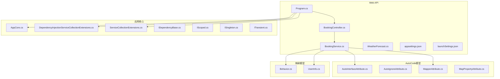
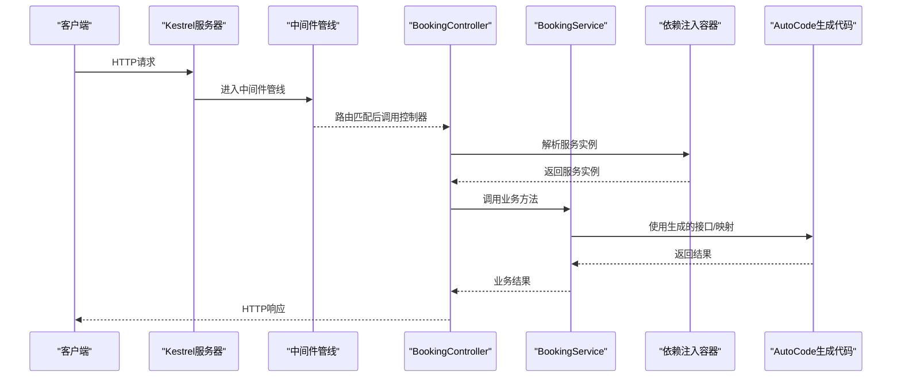
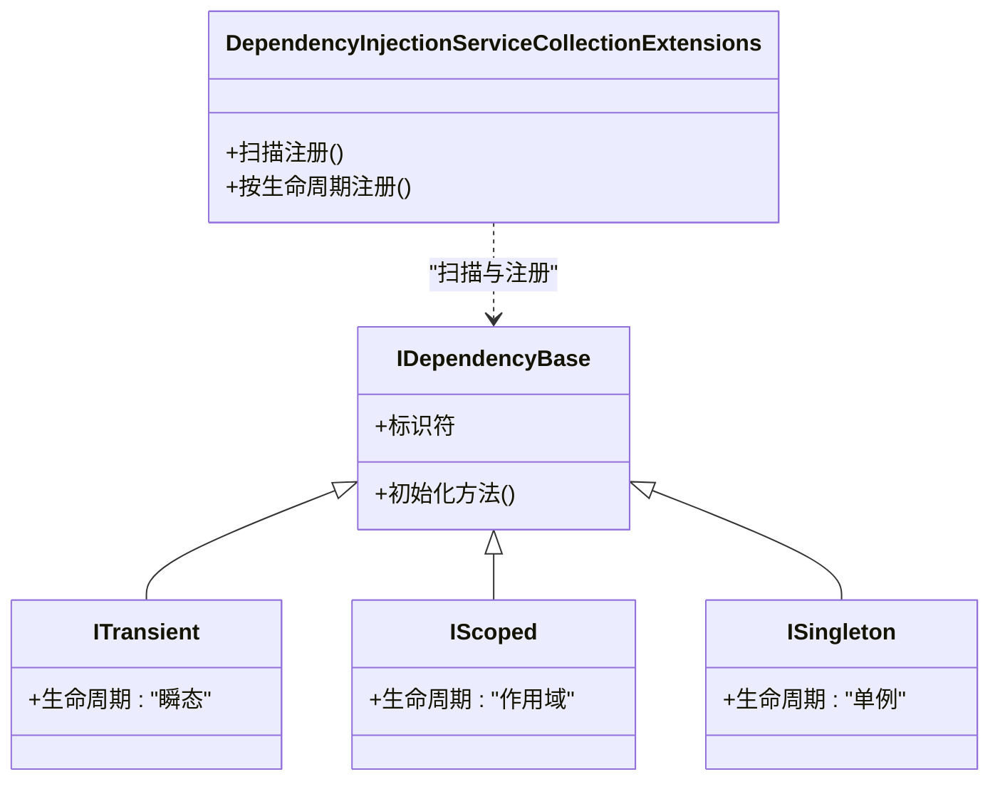
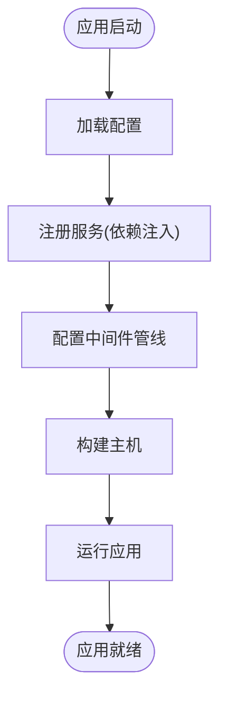
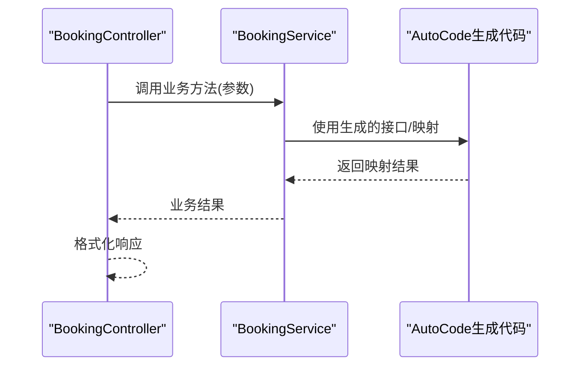
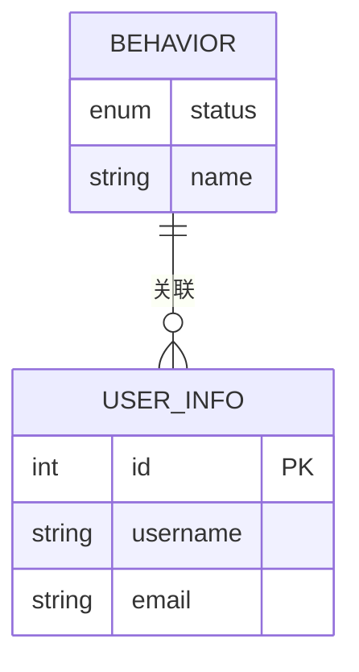
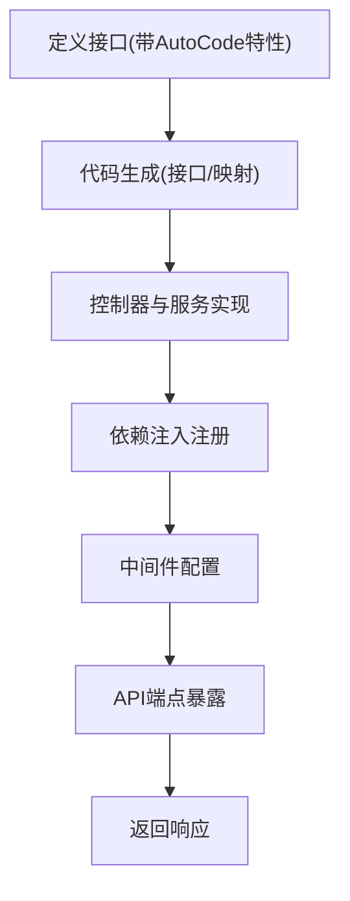
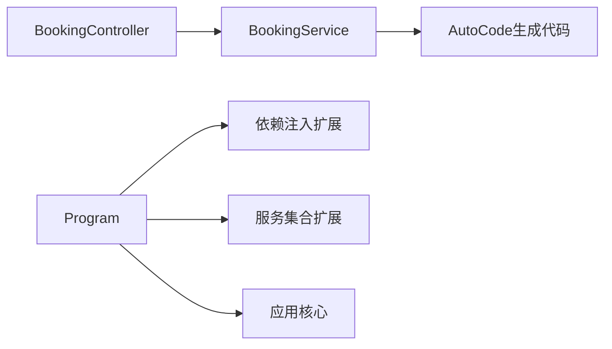

# Web API集成

<cite>
**本文档引用的文件**
- [Program.cs](file://src/APP.WebAPI/Program.cs)
- [BookingController.cs](file://src/APP.WebAPI/Controllers/BookingController.cs)
- [BookingService.cs](file://src/APP.WebAPI/Services/BookingService.cs)
- [ServiceCollectionExtensions.cs](file://src/APP.WebAPI.Core/Application/Extensions/ServiceCollectionExtensions.cs)
- [AppCore.cs](file://src/APP.WebAPI.Core/Application/AppCore.cs)
- [DependencyInjectionServiceCollectionExtensions.cs](file://src/APP.WebAPI.Core/DependencyInjection/DependencyInjectionServiceCollectionExtensions.cs)
- [IDependencyBase.cs](file://src/APP.WebAPI.Core/DependencyInjection/LifeType/IDependencyBase.cs)
- [IScoped.cs](file://src/APP.WebAPI.Core/DependencyInjection/LifeType/IScoped.cs)
- [ISingleton.cs](file://src/APP.WebAPI.Core/DependencyInjection/LifeType/ISingleton.cs)
- [ITransient.cs](file://src/APP.WebAPI.Core/DependencyInjection/LifeType/ITransient.cs)
- [AutoInterfaceAttribute.cs](file://src/AutoCode.Model/InterfaceAttribute/AutoInterfaceAttribute.cs)
- [AutoIgnoreAttribute.cs](file://src/AutoCode.Model/InterfaceAttribute/AutoIgnoreAttribute.cs)
- [MapperAttribute.cs](file://src/AutoCode.Model/AutoMapperModel/MapperAttribute.cs)
- [MapPropertyAttribute.cs](file://src/AutoCode.Model/AutoMapperModel/MapPropertyAttribute.cs)
- [Behavior.cs](file://src/Auto.MapModels/Behavior.cs)
- [UserInfo.cs](file://src/APP.Map/UserInfo.cs)
- [WeatherForecast.cs](file://src/APP.WebAPI/WeatherForecast.cs)
- [appsettings.json](file://src/APP.WebAPI/appsettings.json)
- [launchSettings.json](file://src/APP.WebAPI/Properties/launchSettings.json)
</cite>

## 目录
1. [简介](#简介)
2. [项目结构](#项目结构)
3. [核心组件](#核心组件)
4. [架构总览](#架构总览)
5. [详细组件分析](#详细组件分析)
6. [依赖关系分析](#依赖关系分析)
7. [性能考虑](#性能考虑)
8. [故障排查指南](#故障排查指南)
9. [结论](#结论)
10. [附录](#附录)

## 简介
本文件面向希望在ASP.NET Core Web API中集成AutoCode生成代码的开发者，系统阐述以下主题：
- 依赖注入容器的配置与服务注册机制
- 生命周期管理（Transient、Scoped、Singleton）
- 在控制器与服务中使用AutoCode生成的接口与映射
- 从接口定义到API端点实现的完整工作流
- 中间件配置、异常处理与日志记录的最佳实践

通过本指南，读者可快速搭建一个基于AutoCode的代码生成与Web API集成的最小可用示例，并理解其扩展方式。

## 项目结构
本项目采用分层组织方式：
- APP.WebAPI：Web API入口、控制器、服务、启动配置与运行设置
- APP.WebAPI.Core：应用核心能力，包含依赖注入扩展、应用初始化与生命周期标记接口
- AutoCode相关模型与属性：用于驱动代码生成的元数据与特性
- 映射模型与映射配置：行为定义与用户信息映射
- 其他辅助模块：模板、测试、外部工具等

图表来源
- [Program.cs](file://src/APP.WebAPI/Program.cs)
- [BookingController.cs](file://src/APP.WebAPI/Controllers/BookingController.cs)
- [BookingService.cs](file://src/APP.WebAPI/Services/BookingService.cs)
- [DependencyInjectionServiceCollectionExtensions.cs](file://src/APP.WebAPI.Core/DependencyInjection/DependencyInjectionServiceCollectionExtensions.cs)
- [ServiceCollectionExtensions.cs](file://src/APP.WebAPI.Core/Application/Extensions/ServiceCollectionExtensions.cs)
- [AppCore.cs](file://src/APP.WebAPI.Core/Application/AppCore.cs)
- [IDependencyBase.cs](file://src/APP.WebAPI.Core/DependencyInjection/LifeType/IDependencyBase.cs)
- [IScoped.cs](file://src/APP.WebAPI.Core/DependencyInjection/LifeType/IScoped.cs)
- [ISingleton.cs](file://src/APP.WebAPI.Core/DependencyInjection/LifeType/ISingleton.cs)
- [ITransient.cs](file://src/APP.WebAPI.Core/DependencyInjection/LifeType/ITransient.cs)
- [AutoInterfaceAttribute.cs](file://src/AutoCode.Model/InterfaceAttribute/AutoInterfaceAttribute.cs)
- [AutoIgnoreAttribute.cs](file://src/AutoCode.Model/InterfaceAttribute/AutoIgnoreAttribute.cs)
- [MapperAttribute.cs](file://src/AutoCode.Model/AutoMapperModel/MapperAttribute.cs)
- [MapPropertyAttribute.cs](file://src/AutoCode.Model/AutoMapperModel/MapPropertyAttribute.cs)
- [Behavior.cs](file://src/Auto.MapModels/Behavior.cs)
- [UserInfo.cs](file://src/APP.Map/UserInfo.cs)
- [WeatherForecast.cs](file://src/APP.WebAPI/WeatherForecast.cs)
- [appsettings.json](file://src/APP.WebAPI/appsettings.json)
- [launchSettings.json](file://src/APP.WebAPI/Properties/launchSettings.json)

章节来源
- [Program.cs](file://src/APP.WebAPI/Program.cs)
- [BookingController.cs](file://src/APP.WebAPI/Controllers/BookingController.cs)
- [BookingService.cs](file://src/APP.WebAPI/Services/BookingService.cs)
- [DependencyInjectionServiceCollectionExtensions.cs](file://src/APP.WebAPI.Core/DependencyInjection/DependencyInjectionServiceCollectionExtensions.cs)
- [ServiceCollectionExtensions.cs](file://src/APP.WebAPI.Core/Application/Extensions/ServiceCollectionExtensions.cs)
- [AppCore.cs](file://src/APP.WebAPI.Core/Application/AppCore.cs)
- [IDependencyBase.cs](file://src/APP.WebAPI.Core/DependencyInjection/LifeType/IDependencyBase.cs)
- [IScoped.cs](file://src/APP.WebAPI.Core/DependencyInjection/LifeType/IScoped.cs)
- [ISingleton.cs](file://src/APP.WebAPI.Core/DependencyInjection/LifeType/ISingleton.cs)
- [ITransient.cs](file://src/APP.WebAPI.Core/DependencyInjection/LifeType/ITransient.cs)
- [AutoInterfaceAttribute.cs](file://src/AutoCode.Model/InterfaceAttribute/AutoInterfaceAttribute.cs)
- [AutoIgnoreAttribute.cs](file://src/AutoCode.Model/InterfaceAttribute/AutoIgnoreAttribute.cs)
- [MapperAttribute.cs](file://src/AutoCode.Model/AutoMapperModel/MapperAttribute.cs)
- [MapPropertyAttribute.cs](file://src/AutoCode.Model/AutoMapperModel/MapPropertyAttribute.cs)
- [Behavior.cs](file://src/Auto.MapModels/Behavior.cs)
- [UserInfo.cs](file://src/APP.Map/UserInfo.cs)
- [WeatherForecast.cs](file://src/APP.WebAPI/WeatherForecast.cs)
- [appsettings.json](file://src/APP.WebAPI/appsettings.json)
- [launchSettings.json](file://src/APP.WebAPI/Properties/launchSettings.json)

## 核心组件
- 依赖注入容器扩展：提供统一的扫描与注册逻辑，支持按生命周期接口自动注册
- 应用核心初始化：集中配置中间件、日志、异常处理等通用能力
- 控制器与服务：业务入口与实现，使用AutoCode生成的接口与映射
- AutoCode模型与特性：驱动代码生成的元数据，包括接口生成、忽略规则、映射策略等

章节来源
- [DependencyInjectionServiceCollectionExtensions.cs](file://src/APP.WebAPI.Core/DependencyInjection/DependencyInjectionServiceCollectionExtensions.cs)
- [ServiceCollectionExtensions.cs](file://src/APP.WebAPI.Core/Application/Extensions/ServiceCollectionExtensions.cs)
- [AppCore.cs](file://src/APP.WebAPI.Core/Application/AppCore.cs)
- [IDependencyBase.cs](file://src/APP.WebAPI.Core/DependencyInjection/LifeType/IDependencyBase.cs)
- [IScoped.cs](file://src/APP.WebAPI.Core/DependencyInjection/LifeType/IScoped.cs)
- [ISingleton.cs](file://src/APP.WebAPI.Core/DependencyInjection/LifeType/ISingleton.cs)
- [ITransient.cs](file://src/APP.WebAPI.Core/DependencyInjection/LifeType/ITransient.cs)
- [AutoInterfaceAttribute.cs](file://src/AutoCode.Model/InterfaceAttribute/AutoInterfaceAttribute.cs)
- [AutoIgnoreAttribute.cs](file://src/AutoCode.Model/InterfaceAttribute/AutoIgnoreAttribute.cs)
- [MapperAttribute.cs](file://src/AutoCode.Model/AutoMapperModel/MapperAttribute.cs)
- [MapPropertyAttribute.cs](file://src/AutoCode.Model/AutoMapperModel/MapPropertyAttribute.cs)

## 架构总览
下图展示了从请求进入ASP.NET Core管道，到控制器调用服务，再到AutoCode生成代码参与映射与处理的整体流程。

图表来源
- [Program.cs](file://src/APP.WebAPI/Program.cs)
- [BookingController.cs](file://src/APP.WebAPI/Controllers/BookingController.cs)
- [BookingService.cs](file://src/APP.WebAPI/Services/BookingService.cs)
- [DependencyInjectionServiceCollectionExtensions.cs](file://src/APP.WebAPI.Core/DependencyInjection/DependencyInjectionServiceCollectionExtensions.cs)
- [ServiceCollectionExtensions.cs](file://src/APP.WebAPI.Core/Application/Extensions/ServiceCollectionExtensions.cs)
- [AppCore.cs](file://src/APP.WebAPI.Core/Application/AppCore.cs)

## 详细组件分析

### 依赖注入容器配置与生命周期管理
- 生命周期标记接口：
  - ITransient：每次请求或解析时创建新实例
  - IScoped：每个作用域内共享同一实例（如HTTP请求）
  - ISingleton：应用生命周期内唯一实例
  - IDependencyBase：作为基类或约束，便于统一扫描与注册
- 容器扩展：
  - 通过扩展方法扫描程序集，识别实现了上述接口的类型，并按约定注册到IServiceCollection
  - 支持自定义过滤与命名策略，避免重复注册与冲突

图表来源
- [IDependencyBase.cs](file://src/APP.WebAPI.Core/DependencyInjection/LifeType/IDependencyBase.cs)
- [IScoped.cs](file://src/APP.WebAPI.Core/DependencyInjection/LifeType/IScoped.cs)
- [ISingleton.cs](file://src/APP.WebAPI.Core/DependencyInjection/LifeType/ISingleton.cs)
- [ITransient.cs](file://src/APP.WebAPI.Core/DependencyInjection/LifeType/ITransient.cs)
- [DependencyInjectionServiceCollectionExtensions.cs](file://src/APP.WebAPI.Core/DependencyInjection/DependencyInjectionServiceCollectionExtensions.cs)

章节来源
- [DependencyInjectionServiceCollectionExtensions.cs](file://src/APP.WebAPI.Core/DependencyInjection/DependencyInjectionServiceCollectionExtensions.cs)
- [IDependencyBase.cs](file://src/APP.WebAPI.Core/DependencyInjection/LifeType/IDependencyBase.cs)
- [IScoped.cs](file://src/APP.WebAPI.Core/DependencyInjection/LifeType/IScoped.cs)
- [ISingleton.cs](file://src/APP.WebAPI.Core/DependencyInjection/LifeType/ISingleton.cs)
- [ITransient.cs](file://src/APP.WebAPI.Core/DependencyInjection/LifeType/ITransient.cs)

### 应用核心初始化与中间件配置
- 应用核心：
  - 集中配置日志、异常处理、请求管道中间件
  - 提供统一的启动顺序与错误捕获策略
- 服务集合扩展：
  - 封装常用服务的注册逻辑，简化Program中的配置代码
  - 支持环境区分与配置读取

图表来源
- [AppCore.cs](file://src/APP.WebAPI.Core/Application/AppCore.cs)
- [ServiceCollectionExtensions.cs](file://src/APP.WebAPI.Core/Application/Extensions/ServiceCollectionExtensions.cs)
- [Program.cs](file://src/APP.WebAPI/Program.cs)

章节来源
- [AppCore.cs](file://src/APP.WebAPI.Core/Application/AppCore.cs)
- [ServiceCollectionExtensions.cs](file://src/APP.WebAPI.Core/Application/Extensions/ServiceCollectionExtensions.cs)
- [Program.cs](file://src/APP.WebAPI/Program.cs)

### 控制器与服务中的AutoCode使用
- 控制器：
  - 通过构造函数注入服务实例
  - 调用服务方法，处理输入参数与返回结果
  - 结合AutoCode生成的接口进行解耦与测试
- 服务：
  - 使用AutoCode生成的接口与映射，减少样板代码
  - 结合特性（如MapperAttribute、MapPropertyAttribute）声明映射策略
  - 遵循生命周期接口，确保资源正确释放与复用

图表来源
- [BookingController.cs](file://src/APP.WebAPI/Controllers/BookingController.cs)
- [BookingService.cs](file://src/APP.WebAPI/Services/BookingService.cs)
- [AutoInterfaceAttribute.cs](file://src/AutoCode.Model/InterfaceAttribute/AutoInterfaceAttribute.cs)
- [MapperAttribute.cs](file://src/AutoCode.Model/AutoMapperModel/MapperAttribute.cs)
- [MapPropertyAttribute.cs](file://src/AutoCode.Model/AutoMapperModel/MapPropertyAttribute.cs)

章节来源
- [BookingController.cs](file://src/APP.WebAPI/Controllers/BookingController.cs)
- [BookingService.cs](file://src/APP.WebAPI/Services/BookingService.cs)
- [AutoInterfaceAttribute.cs](file://src/AutoCode.Model/InterfaceAttribute/AutoInterfaceAttribute.cs)
- [MapperAttribute.cs](file://src/AutoCode.Model/AutoMapperModel/MapperAttribute.cs)
- [MapPropertyAttribute.cs](file://src/AutoCode.Model/AutoMapperModel/MapPropertyAttribute.cs)

### 映射模型与AutoCode映射
- 行为模型：
  - 定义行为枚举或状态，供映射与校验使用
- 用户信息映射：
  - 使用AutoCode的映射特性声明字段映射规则
  - 支持忽略属性、重命名字段、转换策略等

图表来源
- [Behavior.cs](file://src/Auto.MapModels/Behavior.cs)
- [UserInfo.cs](file://src/APP.Map/UserInfo.cs)
- [MapperAttribute.cs](file://src/AutoCode.Model/AutoMapperModel/MapperAttribute.cs)
- [MapPropertyAttribute.cs](file://src/AutoCode.Model/AutoMapperModel/MapPropertyAttribute.cs)

章节来源
- [Behavior.cs](file://src/Auto.MapModels/Behavior.cs)
- [UserInfo.cs](file://src/APP.Map/UserInfo.cs)
- [MapperAttribute.cs](file://src/AutoCode.Model/AutoMapperModel/MapperAttribute.cs)
- [MapPropertyAttribute.cs](file://src/AutoCode.Model/AutoMapperModel/MapPropertyAttribute.cs)

### 完整的Web API工作流示例
- 接口定义：
  - 使用AutoInterfaceAttribute标注接口，驱动代码生成
  - 使用AutoIgnoreAttribute忽略不需要暴露的属性
- API端点实现：
  - 控制器接收请求，调用服务层
  - 服务层使用AutoCode生成的映射与接口完成数据处理
  - 返回标准化响应，包含状态码与消息

图表来源
- [AutoInterfaceAttribute.cs](file://src/AutoCode.Model/InterfaceAttribute/AutoInterfaceAttribute.cs)
- [AutoIgnoreAttribute.cs](file://src/AutoCode.Model/InterfaceAttribute/AutoIgnoreAttribute.cs)
- [BookingController.cs](file://src/APP.WebAPI/Controllers/BookingController.cs)
- [BookingService.cs](file://src/APP.WebAPI/Services/BookingService.cs)
- [DependencyInjectionServiceCollectionExtensions.cs](file://src/APP.WebAPI.Core/DependencyInjection/DependencyInjectionServiceCollectionExtensions.cs)
- [ServiceCollectionExtensions.cs](file://src/APP.WebAPI.Core/Application/Extensions/ServiceCollectionExtensions.cs)
- [AppCore.cs](file://src/APP.WebAPI.Core/Application/AppCore.cs)

章节来源
- [AutoInterfaceAttribute.cs](file://src/AutoCode.Model/InterfaceAttribute/AutoInterfaceAttribute.cs)
- [AutoIgnoreAttribute.cs](file://src/AutoCode.Model/InterfaceAttribute/AutoIgnoreAttribute.cs)
- [BookingController.cs](file://src/APP.WebAPI/Controllers/BookingController.cs)
- [BookingService.cs](file://src/APP.WebAPI/Services/BookingService.cs)
- [DependencyInjectionServiceCollectionExtensions.cs](file://src/APP.WebAPI.Core/DependencyInjection/DependencyInjectionServiceCollectionExtensions.cs)
- [ServiceCollectionExtensions.cs](file://src/APP.WebAPI.Core/Application/Extensions/ServiceCollectionExtensions.cs)
- [AppCore.cs](file://src/APP.WebAPI.Core/Application/AppCore.cs)

## 依赖关系分析
- 控制器依赖服务，服务依赖AutoCode生成的接口与映射
- 依赖注入容器负责生命周期管理与实例解析
- 应用核心与扩展方法集中配置中间件与服务注册

图表来源
- [BookingController.cs](file://src/APP.WebAPI/Controllers/BookingController.cs)
- [BookingService.cs](file://src/APP.WebAPI/Services/BookingService.cs)
- [Program.cs](file://src/APP.WebAPI/Program.cs)
- [DependencyInjectionServiceCollectionExtensions.cs](file://src/APP.WebAPI.Core/DependencyInjection/DependencyInjectionServiceCollectionExtensions.cs)
- [ServiceCollectionExtensions.cs](file://src/APP.WebAPI.Core/Application/Extensions/ServiceCollectionExtensions.cs)
- [AppCore.cs](file://src/APP.WebAPI.Core/Application/AppCore.cs)

章节来源
- [BookingController.cs](file://src/APP.WebAPI/Controllers/BookingController.cs)
- [BookingService.cs](file://src/APP.WebAPI/Services/BookingService.cs)
- [Program.cs](file://src/APP.WebAPI/Program.cs)
- [DependencyInjectionServiceCollectionExtensions.cs](file://src/APP.WebAPI.Core/DependencyInjection/DependencyInjectionServiceCollectionExtensions.cs)
- [ServiceCollectionExtensions.cs](file://src/APP.WebAPI.Core/Application/Extensions/ServiceCollectionExtensions.cs)
- [AppCore.cs](file://src/APP.WebAPI.Core/Application/AppCore.cs)

## 性能考虑
- 合理选择生命周期：
  - 短生命周期对象使用Transient，避免不必要的共享状态
  - 请求级资源使用Scoped，确保线程安全与资源释放
  - 无状态且昂贵的对象使用Singleton，提升复用率
- 避免循环依赖：
  - 通过接口解耦与延迟加载降低耦合度
- 映射优化：
  - 使用AutoCode生成的映射减少反射开销
  - 缓存热点映射配置，避免重复计算

[本节为通用指导，不直接分析具体文件]

## 故障排查指南
- 依赖注入失败：
  - 检查是否实现了对应的生命周期接口
  - 确认程序集扫描路径与过滤条件
- 映射异常：
  - 核对AutoCode特性配置是否正确
  - 检查字段名称与类型是否匹配
- 中间件问题：
  - 确认中间件注册顺序
  - 查看日志输出定位异常堆栈

章节来源
- [DependencyInjectionServiceCollectionExtensions.cs](file://src/APP.WebAPI.Core/DependencyInjection/DependencyInjectionServiceCollectionExtensions.cs)
- [ServiceCollectionExtensions.cs](file://src/APP.WebAPI.Core/Application/Extensions/ServiceCollectionExtensions.cs)
- [AppCore.cs](file://src/APP.WebAPI.Core/Application/AppCore.cs)
- [AutoInterfaceAttribute.cs](file://src/AutoCode.Model/InterfaceAttribute/AutoInterfaceAttribute.cs)
- [MapperAttribute.cs](file://src/AutoCode.Model/AutoMapperModel/MapperAttribute.cs)

## 结论
通过AutoCode与ASP.NET Core Web API的集成，可以显著减少样板代码，提升开发效率与代码一致性。借助依赖注入的生命周期管理与中间件配置，能够构建出高内聚、低耦合、易维护的Web API服务。建议在实际项目中结合业务需求，合理设计接口与映射策略，并持续优化性能与稳定性。

[本节为总结性内容，不直接分析具体文件]

## 附录
- 运行设置与环境变量：
  - launchSettings.json：开发环境启动配置
  - appsettings.json：应用配置项（数据库连接、日志级别等）
- 示例数据模型：
  - WeatherForecast：示例天气数据模型，用于演示API返回格式

章节来源
- [launchSettings.json](file://src/APP.WebAPI/Properties/launchSettings.json)
- [appsettings.json](file://src/APP.WebAPI/appsettings.json)
- [WeatherForecast.cs](file://src/APP.WebAPI/WeatherForecast.cs)