# Web API集成

<cite>
**本文档引用的文件**
- [Program.cs](file://src/APP.WebAPI/Program.cs)
- [BookingController.cs](file://src/APP.WebAPI/Controllers/BookingController.cs)
- [UserService.cs](file://src/APP.WebAPI/Services/UserService.cs)
- [OrderServiceV2.cs](file://src/APP.WebAPI/Services/OrderServiceV2.cs)
- [PaymentService.cs](file://src/APP.WebAPI/Services/PaymentService.cs)
- [CustomInterceptHandlers.cs](file://src/APP.WebAPI/Services/CustomInterceptHandlers.cs)
- [UserDto.cs](file://src/APP.WebAPI/Models/UserDto.cs)
- [UserEntity.cs](file://src/APP.WebAPI/Models/UserEntity.cs)
- [Requests.cs](file://src/APP.WebAPI/Models/Requests.cs)
- [ServiceCollectionExtensions.cs](file://src/APP.WebAPI.Core/Application/Extensions/ServiceCollectionExtensions.cs)
- [AppCore.cs](file://src/APP.WebAPI.Core/Application/AppCore.cs)
- [DependencyInjectionServiceCollectionExtensions.cs](file://src/APP.WebAPI.Core/DependencyInjection/DependencyInjectionServiceCollectionExtensions.cs)
- [IDependencyBase.cs](file://src/APP.WebAPI.Core/DependencyInjection/LifeType/IDependencyBase.cs)
- [IScoped.cs](file://src/APP.WebAPI.Core/DependencyInjection/LifeType/IScoped.cs)
- [ISingleton.cs](file://src/APP.WebAPI.Core/DependencyInjection/LifeType/ISingleton.cs)
- [ITransient.cs](file://src/APP.WebAPI.Core/DependencyInjection/LifeType/ITransient.cs)
- [AutoInterfaceAttribute.cs](file://src/AutoCode.Model/InterfaceAttribute/AutoInterfaceAttribute.cs)
- [AutoIgnoreAttribute.cs](file://src/AutoCode.Model/InterfaceAttribute/AutoIgnoreAttribute.cs)
- [MapperAttribute.cs](file://src/AutoCode.Model/AutoMapperModel/MapperAttribute.cs)
- [MapPropertyAttribute.cs](file://src/AutoCode.Model/AutoMapperModel/MapPropertyAttribute.cs)
- [Behavior.cs](file://src/Auto.MapModels/Behavior.cs)
- [UserInfo.cs](file://src/APP.Map/UserInfo.cs)
- [WeatherForecast.cs](file://src/APP.WebAPI/WeatherForecast.cs)
- [appsettings.json](file://src/APP.WebAPI/appsettings.json)
- [launchSettings.json](file://src/APP.WebAPI/Properties/launchSettings.json)
</cite>

## 更新摘要
**所做更改**
- 新增AOP拦截器示例服务，展示OrderServiceV2、PaymentService和CustomInterceptHandlers的实际应用
- 增强了Web API中AOP拦截器的完整工作流展示
- 添加了订单处理和支付服务的AOP拦截实现示例
- 扩展了依赖注入和服务注册的实际应用场景

## 目录
1. [简介](#简介)
2. [项目结构](#项目结构)
3. [核心组件](#核心组件)
4. [架构总览](#架构总览)
5. [详细组件分析](#详细组件分析)
6. [AOP拦截器集成](#aop拦截器集成)
7. [依赖关系分析](#依赖关系分析)
8. [性能考虑](#性能考虑)
9. [故障排查指南](#故障排查指南)
10. [结论](#结论)
11. [附录](#附录)

## 简介
本文件面向希望在ASP.NET Core Web API中集成AutoCode生成代码的开发者，系统阐述以下主题：
- 依赖注入容器的配置与服务注册机制
- 生命周期管理（Transient、Scoped、Singleton）
- 在控制器与服务中使用AutoCode生成的接口与映射
- AOP拦截器在Web API中的实际应用
- 从接口定义到API端点实现的完整工作流
- 中间件配置、异常处理与日志记录的最佳实践

通过本指南，读者可快速搭建一个基于AutoCode的代码生成与Web API集成的最小可用示例，并理解其扩展方式。

## 项目结构
本项目采用分层组织方式：
- APP.WebAPI：Web API入口、控制器、服务、模型、启动配置与运行设置
- APP.WebAPI.Core：应用核心能力，包含依赖注入扩展、应用初始化与生命周期标记接口
- AutoCode相关模型与属性：用于驱动代码生成的元数据与特性
- 映射模型与映射配置：行为定义与用户信息映射
- **新增** AOP拦截器服务：订单处理、支付服务和自定义拦截器实现
- 其他辅助模块：模板、测试、外部工具等

```mermaid
graph TB
subgraph "Web API"
Program["Program.cs"]
Controller["BookingController.cs"]
UserService["UserService.cs"]
OrderServiceV2["OrderServiceV2.cs"]
PaymentService["PaymentService.cs"]
CustomInterceptors["CustomInterceptHandlers.cs"]
UserDto["UserDto.cs"]
UserEntity["UserEntity.cs"]
Requests["Requests.cs"]
Weather["WeatherForecast.cs"]
Settings["appsettings.json"]
Launch["launchSettings.json"]
end
subgraph "应用核心"
AppCore["AppCore.cs"]
DIExt["DependencyInjectionServiceCollectionExtensions.cs"]
SvcExt["ServiceCollectionExtensions.cs"]
IBase["IDependencyBase.cs"]
IScope["IScoped.cs"]
ISingle["ISingleton.cs"]
ITrans["ITransient.cs"]
end
subgraph "AutoCode模型"
AttrIF["AutoInterfaceAttribute.cs"]
AttrIgnore["AutoIgnoreAttribute.cs"]
AttrMap["MapperAttribute.cs"]
AttrProp["MapPropertyAttribute.cs"]
end
subgraph "映射模型"
Behavior["Behavior.cs"]
UserInfo["UserInfo.cs"]
end
Program --> Controller
Program --> UserService
Program --> OrderServiceV2
Program --> PaymentService
Program --> CustomInterceptors
Controller --> Service
UserService --> UserDto
UserService --> UserEntity
OrderServiceV2 --> CustomInterceptors
PaymentService --> CustomInterceptors
Program --> DIExt
Program --> SvcExt
Program --> AppCore
Service --> AttrIF
Service --> AttrMap
Service --> Behavior
Service --> UserInfo
```

图表来源
- [Program.cs](file://src/APP.WebAPI/Program.cs)
- [BookingController.cs](file://src/APP.WebAPI/Controllers/BookingController.cs)
- [UserService.cs](file://src/APP.WebAPI/Services/UserService.cs)
- [OrderServiceV2.cs](file://src/APP.WebAPI/Services/OrderServiceV2.cs)
- [PaymentService.cs](file://src/APP.WebAPI/Services/PaymentService.cs)
- [CustomInterceptHandlers.cs](file://src/APP.WebAPI/Services/CustomInterceptHandlers.cs)
- [UserDto.cs](file://src/APP.WebAPI/Models/UserDto.cs)
- [UserEntity.cs](file://src/APP.WebAPI/Models/UserEntity.cs)
- [Requests.cs](file://src/APP.WebAPI/Models/Requests.cs)
- [DependencyInjectionServiceCollectionExtensions.cs](file://src/APP.WebAPI.Core/DependencyInjection/DependencyInjectionServiceCollectionExtensions.cs)
- [ServiceCollectionExtensions.cs](file://src/APP.WebAPI.Core/Application/Extensions/ServiceCollectionExtensions.cs)
- [AppCore.cs](file://src/APP.WebAPI.Core/Application/AppCore.cs)
- [IDependencyBase.cs](file://src/APP.WebAPI.Core/DependencyInjection/LifeType/IDependencyBase.cs)
- [IScoped.cs](file://src/APP.WebAPI.Core/DependencyInjection/LifeType/IScoped.cs)
- [ISingleton.cs](file://src/APP.WebAPI.Core/DependencyInjection/LifeType/ISingleton.cs)
- [ITransient.cs](file://src/APP.WebAPI.Core/DependencyInjection/LifeType/ITransient.cs)
- [AutoInterfaceAttribute.cs](file://src/AutoCode.Model/InterfaceAttribute/AutoInterfaceAttribute.cs)
- [AutoIgnoreAttribute.cs](file://src/AutoCode.Model/InterfaceAttribute/AutoIgnoreAttribute.cs)
- [MapperAttribute.cs](file://src/AutoCode.Model/AutoMapperModel/MapperAttribute.cs)
- [MapPropertyAttribute.cs](file://src/AutoCode.Model/AutoMapperModel/MapPropertyAttribute.cs)
- [Behavior.cs](file://src/Auto.MapModels/Behavior.cs)
- [UserInfo.cs](file://src/APP.Map/UserInfo.cs)
- [WeatherForecast.cs](file://src/APP.WebAPI/WeatherForecast.cs)
- [appsettings.json](file://src/APP.WebAPI/appsettings.json)
- [launchSettings.json](file://src/APP.WebAPI/Properties/launchSettings.json)

章节来源
- [Program.cs](file://src/APP.WebAPI/Program.cs)
- [BookingController.cs](file://src/APP.WebAPI/Controllers/BookingController.cs)
- [UserService.cs](file://src/APP.WebAPI/Services/UserService.cs)
- [OrderServiceV2.cs](file://src/APP.WebAPI/Services/OrderServiceV2.cs)
- [PaymentService.cs](file://src/APP.WebAPI/Services/PaymentService.cs)
- [CustomInterceptHandlers.cs](file://src/APP.WebAPI/Services/CustomInterceptHandlers.cs)
- [UserDto.cs](file://src/APP.WebAPI/Models/UserDto.cs)
- [UserEntity.cs](file://src/APP.WebAPI/Models/UserEntity.cs)
- [Requests.cs](file://src/APP.WebAPI/Models/Requests.cs)
- [DependencyInjectionServiceCollectionExtensions.cs](file://src/APP.WebAPI.Core/DependencyInjection/DependencyInjectionServiceCollectionExtensions.cs)
- [ServiceCollectionExtensions.cs](file://src/APP.WebAPI.Core/Application/Extensions/ServiceCollectionExtensions.cs)
- [AppCore.cs](file://src/APP.WebAPI.Core/Application/AppCore.cs)
- [IDependencyBase.cs](file://src/APP.WebAPI.Core/DependencyInjection/LifeType/IDependencyBase.cs)
- [IScoped.cs](file://src/APP.WebAPI.Core/DependencyInjection/LifeType/IScoped.cs)
- [ISingleton.cs](file://src/APP.WebAPI.Core/DependencyInjection/LifeType/ISingleton.cs)
- [ITransient.cs](file://src/APP.WebAPI.Core/DependencyInjection/LifeType/ITransient.cs)
- [AutoInterfaceAttribute.cs](file://src/AutoCode.Model/InterfaceAttribute/AutoInterfaceAttribute.cs)
- [AutoIgnoreAttribute.cs](file://src/AutoCode.Model/InterfaceAttribute/AutoIgnoreAttribute.cs)
- [MapperAttribute.cs](file://src/AutoCode.Model/AutoMapperModel/MapperAttribute.cs)
- [MapPropertyAttribute.cs](file://src/AutoCode.Model/AutoMapperModel/MapPropertyAttribute.cs)
- [Behavior.cs](file://src/Auto.MapModels/Behavior.cs)
- [UserInfo.cs](file://src/APP.Map/UserInfo.cs)
- [WeatherForecast.cs](file://src/APP.WebAPI/WeatherForecast.cs)
- [appsettings.json](file://src/APP.WebAPI/appsettings.json)
- [launchSettings.json](file://src/APP.WebAPI/Properties/launchSettings.json)

## 核心组件
- 依赖注入容器扩展：提供统一的扫描与注册逻辑，支持按生命周期接口自动注册
- 应用核心初始化：集中配置中间件、日志、异常处理等通用能力
- 控制器与服务：业务入口与实现，使用AutoCode生成的接口与映射
- AutoCode模型与特性：驱动代码生成的元数据，包括接口生成、忽略规则、映射策略等
- **新增** AOP拦截器服务：订单处理、支付服务和自定义拦截器实现，展示AOP在Web API中的实际应用
- **新增** 用户管理服务：完整的用户CRUD操作示例，展示AutoCode生态系统的实际应用

章节来源
- [DependencyInjectionServiceCollectionExtensions.cs](file://src/APP.WebAPI.Core/DependencyInjection/DependencyInjectionServiceCollectionExtensions.cs)
- [ServiceCollectionExtensions.cs](file://src/APP.WebAPI.Core/Application/Extensions/ServiceCollectionExtensions.cs)
- [AppCore.cs](file://src/APP.WebAPI.Core/Application/AppCore.cs)
- [IDependencyBase.cs](file://src/APP.WebAPI.Core/DependencyInjection/LifeType/IDependencyBase.cs)
- [IScoped.cs](file://src/APP.WebAPI.Core/DependencyInjection/LifeType/IScoped.cs)
- [ISingleton.cs](file://src/APP.WebAPI.Core/DependencyInjection/LifeType/ISingleton.cs)
- [ITransient.cs](file://src/APP.WebAPI.Core/DependencyInjection/LifeType/ITransient.cs)
- [AutoInterfaceAttribute.cs](file://src/AutoCode.Model/InterfaceAttribute/AutoInterfaceAttribute.cs)
- [AutoIgnoreAttribute.cs](file://src/AutoCode.Model/InterfaceAttribute/AutoIgnoreAttribute.cs)
- [MapperAttribute.cs](file://src/AutoCode.Model/AutoMapperModel/MapperAttribute.cs)
- [MapPropertyAttribute.cs](file://src/AutoCode.Model/AutoMapperModel/MapPropertyAttribute.cs)
- [UserService.cs](file://src/APP.WebAPI/Services/UserService.cs)
- [OrderServiceV2.cs](file://src/APP.WebAPI/Services/OrderServiceV2.cs)
- [PaymentService.cs](file://src/APP.WebAPI/Services/PaymentService.cs)
- [CustomInterceptHandlers.cs](file://src/APP.WebAPI/Services/CustomInterceptHandlers.cs)
- [UserDto.cs](file://src/APP.WebAPI/Models/UserDto.cs)
- [UserEntity.cs](file://src/APP.WebAPI/Models/UserEntity.cs)

## 架构总览
下图展示了从请求进入ASP.NET Core管道，到控制器调用服务，再到AutoCode生成代码参与映射与处理的整体流程，包括AOP拦截器的应用。

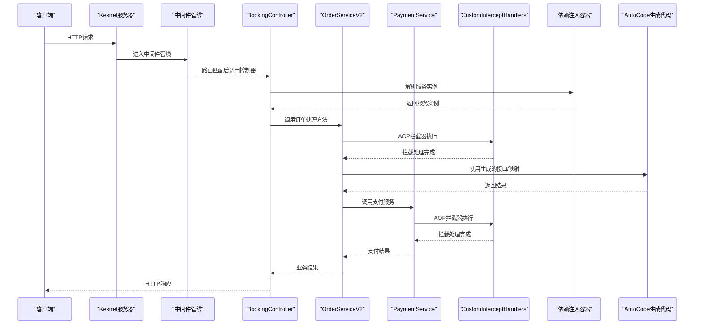

图表来源
- [Program.cs](file://src/APP.WebAPI/Program.cs)
- [BookingController.cs](file://src/APP.WebAPI/Controllers/BookingController.cs)
- [OrderServiceV2.cs](file://src/APP.WebAPI/Services/OrderServiceV2.cs)
- [PaymentService.cs](file://src/APP.WebAPI/Services/PaymentService.cs)
- [CustomInterceptHandlers.cs](file://src/APP.WebAPI/Services/CustomInterceptHandlers.cs)
- [DependencyInjectionServiceCollectionExtensions.cs](file://src/APP.WebAPI.Core/DependencyInjection/DependencyInjectionServiceCollectionExtensions.cs)
- [ServiceCollectionExtensions.cs](file://src/APP.WebAPI.Core/Application/Extensions/ServiceCollectionExtensions.cs)
- [AppCore.cs](file://src/APP.WebAPI.Core/Application/AppCore.cs)

## 详细组件分析

### 依赖注入容器配置与生命周期管理
- 生命周期标记接口：
  - ITransient：每次请求或解析时创建新实例
  - IScoped：每个作用域内共享同一实例（如HTTP请求）
  - ISingleton：应用生命周期内唯一实例
  - IDependencyBase：作为基类或约束，便于统一扫描与注册
- 容器扩展：
  - 通过扩展方法扫描程序集，识别实现了上述接口的类型，并按约定注册到IServiceCollection
  - 支持自定义过滤与命名策略，避免重复注册与冲突

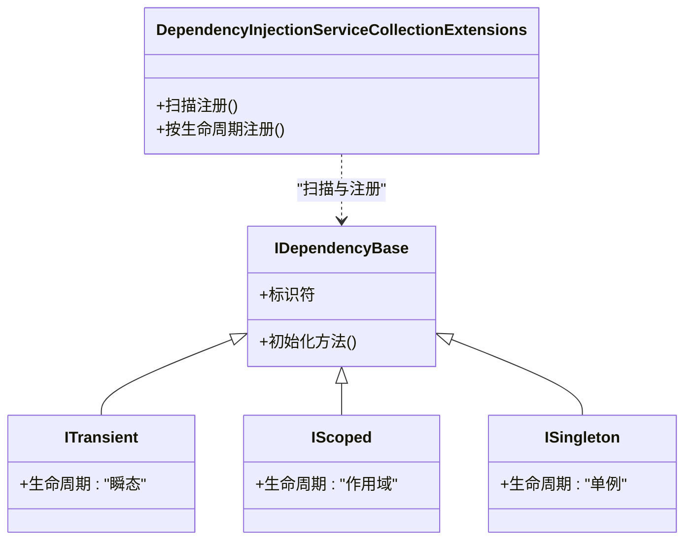

图表来源
- [IDependencyBase.cs](file://src/APP.WebAPI.Core/DependencyInjection/LifeType/IDependencyBase.cs)
- [IScoped.cs](file://src/APP.WebAPI.Core/DependencyInjection/LifeType/IScoped.cs)
- [ISingleton.cs](file://src/APP.WebAPI.Core/DependencyInjection/LifeType/ISingleton.cs)
- [ITransient.cs](file://src/APP.WebAPI.Core/DependencyInjection/LifeType/ITransient.cs)
- [DependencyInjectionServiceCollectionExtensions.cs](file://src/APP.WebAPI.Core/DependencyInjection/DependencyInjectionServiceCollectionExtensions.cs)

章节来源
- [DependencyInjectionServiceCollectionExtensions.cs](file://src/APP.WebAPI.Core/DependencyInjection/DependencyInjectionServiceCollectionExtensions.cs)
- [IDependencyBase.cs](file://src/APP.WebAPI.Core/DependencyInjection/LifeType/IDependencyBase.cs)
- [IScoped.cs](file://src/APP.WebAPI.Core/DependencyInjection/LifeType/IScoped.cs)
- [ISingleton.cs](file://src/APP.WebAPI.Core/DependencyInjection/LifeType/ISingleton.cs)
- [ITransient.cs](file://src/APP.WebAPI.Core/DependencyInjection/LifeType/ITransient.cs)

### 应用核心初始化与中间件配置
- 应用核心：
  - 集中配置日志、异常处理、请求管道中间件
  - 提供统一的启动顺序与错误捕获策略
- 服务集合扩展：
  - 封装常用服务的注册逻辑，简化Program中的配置代码
  - 支持环境区分与配置读取

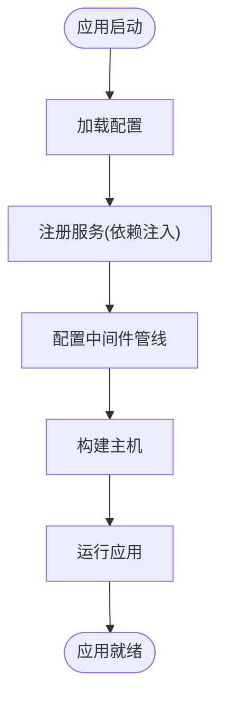

图表来源
- [AppCore.cs](file://src/APP.WebAPI.Core/Application/AppCore.cs)
- [ServiceCollectionExtensions.cs](file://src/APP.WebAPI.Core/Application/Extensions/ServiceCollectionExtensions.cs)
- [Program.cs](file://src/APP.WebAPI/Program.cs)

章节来源
- [AppCore.cs](file://src/APP.WebAPI.Core/Application/AppCore.cs)
- [ServiceCollectionExtensions.cs](file://src/APP.WebAPI.Core/Application/Extensions/ServiceCollectionExtensions.cs)
- [Program.cs](file://src/APP.WebAPI/Program.cs)

### 控制器与服务中的AutoCode使用
- 控制器：
  - 通过构造函数注入服务实例
  - 调用服务方法，处理输入参数与返回结果
  - 结合AutoCode生成的接口进行解耦与测试
- 服务：
  - 使用AutoCode生成的接口与映射，减少样板代码
  - 结合特性（如MapperAttribute、MapPropertyAttribute）声明映射策略
  - 遵循生命周期接口，确保资源正确释放与复用

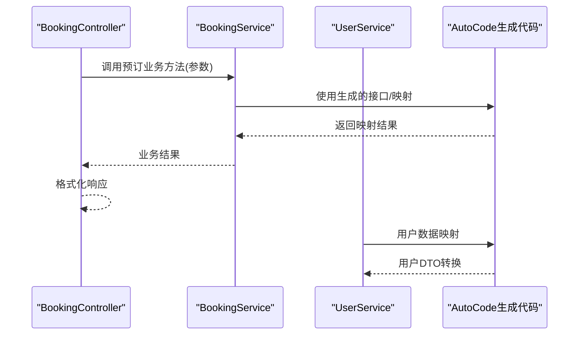

图表来源
- [BookingController.cs](file://src/APP.WebAPI/Controllers/BookingController.cs)
- [UserService.cs](file://src/APP.WebAPI/Services/UserService.cs)
- [AutoInterfaceAttribute.cs](file://src/AutoCode.Model/InterfaceAttribute/AutoInterfaceAttribute.cs)
- [MapperAttribute.cs](file://src/AutoCode.Model/AutoMapperModel/MapperAttribute.cs)
- [MapPropertyAttribute.cs](file://src/AutoCode.Model/AutoMapperModel/MapPropertyAttribute.cs)

章节来源
- [BookingController.cs](file://src/APP.WebAPI/Controllers/BookingController.cs)
- [UserService.cs](file://src/APP.WebAPI/Services/UserService.cs)
- [AutoInterfaceAttribute.cs](file://src/AutoCode.Model/InterfaceAttribute/AutoInterfaceAttribute.cs)
- [MapperAttribute.cs](file://src/AutoCode.Model/AutoMapperModel/MapperAttribute.cs)
- [MapPropertyAttribute.cs](file://src/AutoCode.Model/AutoMapperModel/MapPropertyAttribute.cs)

### 用户管理功能完整示例
**新增** 用户管理功能展示了AutoCode生态系统的完整应用：

- 用户实体模型：
  - UserEntity：数据库实体，包含用户基本信息
  - UserDto：数据传输对象，用于API请求和响应
  - Requests：请求模型，包含用户操作的输入参数
- 用户服务实现：
  - UserService：业务逻辑层，处理用户CRUD操作
  - 使用AutoCode生成的映射进行实体与DTO之间的转换
  - 集成依赖注入，支持生命周期管理

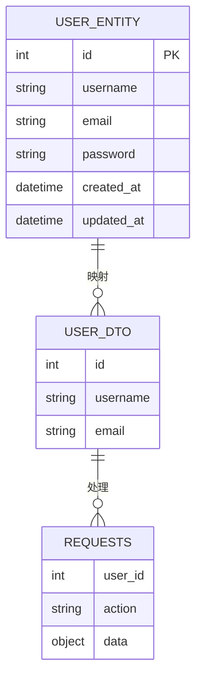

图表来源
- [UserEntity.cs](file://src/APP.WebAPI/Models/UserEntity.cs)
- [UserDto.cs](file://src/APP.WebAPI/Models/UserDto.cs)
- [Requests.cs](file://src/APP.WebAPI/Models/Requests.cs)
- [UserService.cs](file://src/APP.WebAPI/Services/UserService.cs)

章节来源
- [UserEntity.cs](file://src/APP.WebAPI/Models/UserEntity.cs)
- [UserDto.cs](file://src/APP.WebAPI/Models/UserDto.cs)
- [Requests.cs](file://src/APP.WebAPI/Models/Requests.cs)
- [UserService.cs](file://src/APP.WebAPI/Services/UserService.cs)

### 映射模型与AutoCode映射
- 行为模型：
  - 定义行为枚举或状态，供映射与校验使用
- 用户信息映射：
  - 使用AutoCode的映射特性声明字段映射规则
  - 支持忽略属性、重命名字段、转换策略等

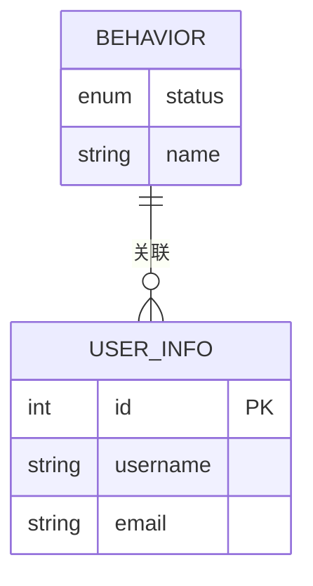

图表来源
- [Behavior.cs](file://src/Auto.MapModels/Behavior.cs)
- [UserInfo.cs](file://src/APP.Map/UserInfo.cs)
- [MapperAttribute.cs](file://src/AutoCode.Model/AutoMapperModel/MapperAttribute.cs)
- [MapPropertyAttribute.cs](file://src/AutoCode.Model/AutoMapperModel/MapPropertyAttribute.cs)

章节来源
- [Behavior.cs](file://src/Auto.MapModels/Behavior.cs)
- [UserInfo.cs](file://src/APP.Map/UserInfo.cs)
- [MapperAttribute.cs](file://src/AutoCode.Model/AutoMapperModel/MapperAttribute.cs)
- [MapPropertyAttribute.cs](file://src/AutoCode.Model/AutoMapperModel/MapPropertyAttribute.cs)

### 完整的Web API工作流示例
- 接口定义：
  - 使用AutoInterfaceAttribute标注接口，驱动代码生成
  - 使用AutoIgnoreAttribute忽略不需要暴露的属性
- API端点实现：
  - 控制器接收请求，调用服务层
  - 服务层使用AutoCode生成的映射与接口完成数据处理
  - 返回标准化响应，包含状态码与消息

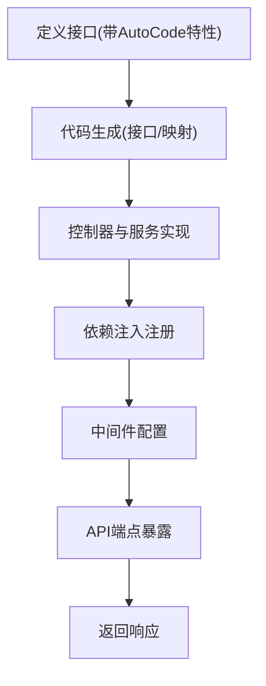

图表来源
- [AutoInterfaceAttribute.cs](file://src/AutoCode.Model/InterfaceAttribute/AutoInterfaceAttribute.cs)
- [AutoIgnoreAttribute.cs](file://src/AutoCode.Model/InterfaceAttribute/AutoIgnoreAttribute.cs)
- [BookingController.cs](file://src/APP.WebAPI/Controllers/BookingController.cs)
- [UserService.cs](file://src/APP.WebAPI/Services/UserService.cs)
- [DependencyInjectionServiceCollectionExtensions.cs](file://src/APP.WebAPI.Core/DependencyInjection/DependencyInjectionServiceCollectionExtensions.cs)
- [ServiceCollectionExtensions.cs](file://src/APP.WebAPI.Core/Application/Extensions/ServiceCollectionExtensions.cs)
- [AppCore.cs](file://src/APP.WebAPI.Core/Application/AppCore.cs)

章节来源
- [AutoInterfaceAttribute.cs](file://src/AutoCode.Model/InterfaceAttribute/AutoInterfaceAttribute.cs)
- [AutoIgnoreAttribute.cs](file://src/AutoCode.Model/InterfaceAttribute/AutoIgnoreAttribute.cs)
- [BookingController.cs](file://src/APP.WebAPI/Controllers/BookingController.cs)
- [UserService.cs](file://src/APP.WebAPI/Services/UserService.cs)
- [DependencyInjectionServiceCollectionExtensions.cs](file://src/APP.WebAPI.Core/DependencyInjection/DependencyInjectionServiceCollectionExtensions.cs)
- [ServiceCollectionExtensions.cs](file://src/APP.WebAPI.Core/Application/Extensions/ServiceCollectionExtensions.cs)
- [AppCore.cs](file://src/APP.WebAPI.Core/Application/AppCore.cs)

## AOP拦截器集成

### AOP拦截器服务架构
**新增** AOP拦截器服务展示了AutoCode在Web API中的高级应用：

- 订单服务（OrderServiceV2）：
  - 演示AOP拦截器在订单处理中的应用
  - 集成事务管理、日志记录和性能监控
  - 使用AutoCode生成的接口和映射
- 支付服务（PaymentService）：
  - 展示支付流程中的AOP拦截器应用
  - 集成安全验证、审计日志和错误处理
  - 与订单服务协同工作
- 自定义拦截器（CustomInterceptHandlers）：
  - 实现通用的横切关注点处理
  - 支持方法调用前后拦截
  - 提供统一的异常处理和日志记录

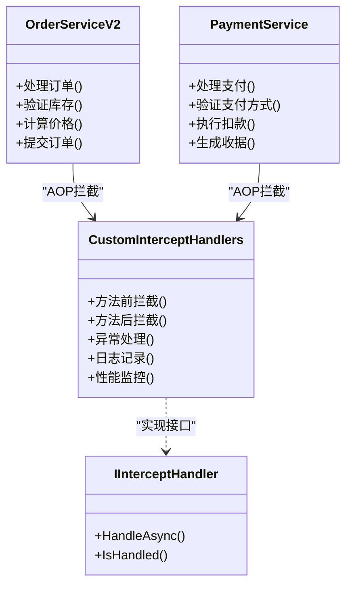

图表来源
- [OrderServiceV2.cs](file://src/APP.WebAPI/Services/OrderServiceV2.cs)
- [PaymentService.cs](file://src/APP.WebAPI/Services/PaymentService.cs)
- [CustomInterceptHandlers.cs](file://src/APP.WebAPI/Services/CustomInterceptHandlers.cs)

章节来源
- [OrderServiceV2.cs](file://src/APP.WebAPI/Services/OrderServiceV2.cs)
- [PaymentService.cs](file://src/APP.WebAPI/Services/PaymentService.cs)
- [CustomInterceptHandlers.cs](file://src/APP.WebAPI/Services/CustomInterceptHandlers.cs)

### AOP拦截器工作流程
**新增** AOP拦截器的工作流程展示了横切关注点的处理方式：

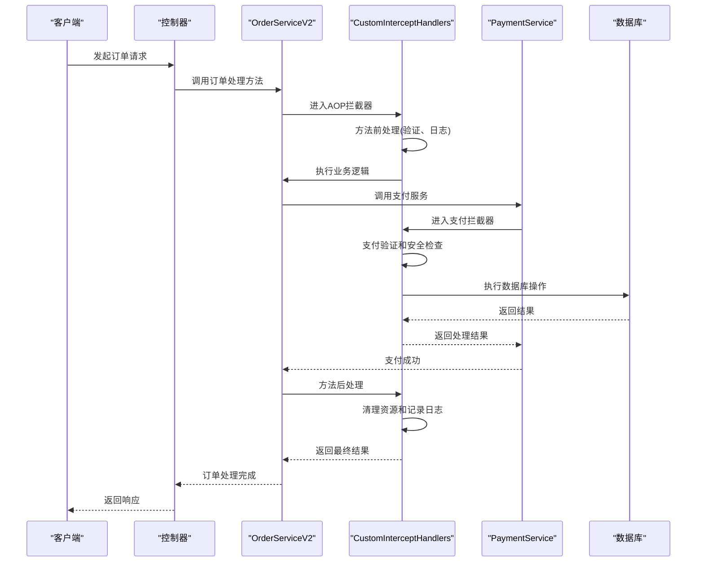

图表来源
- [OrderServiceV2.cs](file://src/APP.WebAPI/Services/OrderServiceV2.cs)
- [PaymentService.cs](file://src/APP.WebAPI/Services/PaymentService.cs)
- [CustomInterceptHandlers.cs](file://src/APP.WebAPI/Services/CustomInterceptHandlers.cs)

章节来源
- [OrderServiceV2.cs](file://src/APP.WebAPI/Services/OrderServiceV2.cs)
- [PaymentService.cs](file://src/APP.WebAPI/Services/PaymentService.cs)
- [CustomInterceptHandlers.cs](file://src/APP.WebAPI/Services/CustomInterceptHandlers.cs)

## 依赖关系分析
- 控制器依赖服务，服务依赖AutoCode生成的接口与映射
- 依赖注入容器负责生命周期管理与实例解析
- 应用核心与扩展方法集中配置中间件与服务注册
- **新增** AOP拦截器服务展示了横切关注点的统一处理
- **新增** 用户管理功能展示了完整的实体-DTO-请求模型转换链

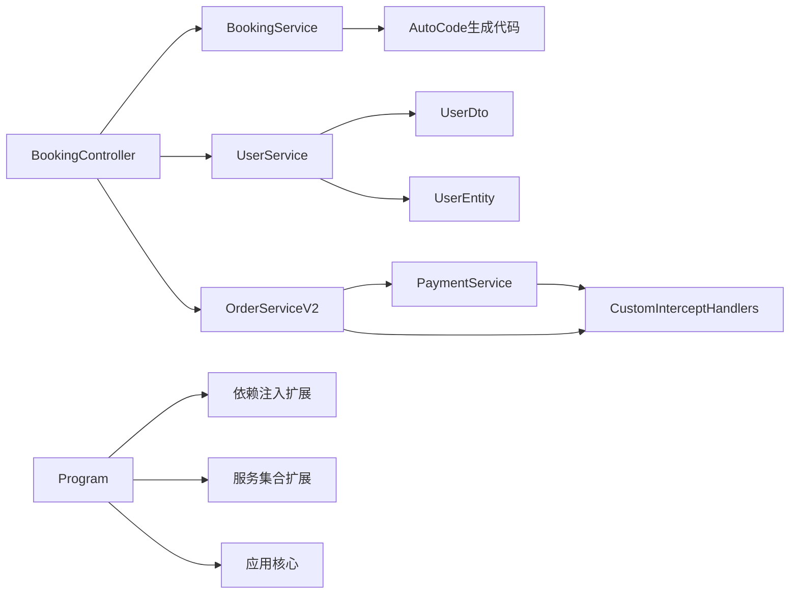

图表来源
- [BookingController.cs](file://src/APP.WebAPI/Controllers/BookingController.cs)
- [UserService.cs](file://src/APP.WebAPI/Services/UserService.cs)
- [OrderServiceV2.cs](file://src/APP.WebAPI/Services/OrderServiceV2.cs)
- [PaymentService.cs](file://src/APP.WebAPI/Services/PaymentService.cs)
- [CustomInterceptHandlers.cs](file://src/APP.WebAPI/Services/CustomInterceptHandlers.cs)
- [UserDto.cs](file://src/APP.WebAPI/Models/UserDto.cs)
- [UserEntity.cs](file://src/APP.WebAPI/Models/UserEntity.cs)
- [Program.cs](file://src/APP.WebAPI/Program.cs)
- [DependencyInjectionServiceCollectionExtensions.cs](file://src/APP.WebAPI.Core/DependencyInjection/DependencyInjectionServiceCollectionExtensions.cs)
- [ServiceCollectionExtensions.cs](file://src/APP.WebAPI.Core/Application/Extensions/ServiceCollectionExtensions.cs)
- [AppCore.cs](file://src/APP.WebAPI.Core/Application/AppCore.cs)

章节来源
- [BookingController.cs](file://src/APP.WebAPI/Controllers/BookingController.cs)
- [UserService.cs](file://src/APP.WebAPI/Services/UserService.cs)
- [OrderServiceV2.cs](file://src/APP.WebAPI/Services/OrderServiceV2.cs)
- [PaymentService.cs](file://src/APP.WebAPI/Services/PaymentService.cs)
- [CustomInterceptHandlers.cs](file://src/APP.WebAPI/Services/CustomInterceptHandlers.cs)
- [UserDto.cs](file://src/APP.WebAPI/Models/UserDto.cs)
- [UserEntity.cs](file://src/APP.WebAPI/Models/UserEntity.cs)
- [Program.cs](file://src/APP.WebAPI/Program.cs)
- [DependencyInjectionServiceCollectionExtensions.cs](file://src/APP.WebAPI.Core/DependencyInjection/DependencyInjectionServiceCollectionExtensions.cs)
- [ServiceCollectionExtensions.cs](file://src/APP.WebAPI.Core/Application/Extensions/ServiceCollectionExtensions.cs)
- [AppCore.cs](file://src/APP.WebAPI.Core/Application/AppCore.cs)

## 性能考虑
- 合理选择生命周期：
  - 短生命周期对象使用Transient，避免不必要的共享状态
  - 请求级资源使用Scoped，确保线程安全与资源释放
  - 无状态且昂贵的对象使用Singleton，提升复用率
- 避免循环依赖：
  - 通过接口解耦与延迟加载降低耦合度
- 映射优化：
  - 使用AutoCode生成的映射减少反射开销
  - 缓存热点映射配置，避免重复计算
- **新增** AOP拦截器性能优化：
  - 拦截器使用轻量级设计，避免阻塞主流程
  - 异步处理耗时操作，提升并发性能
  - 合理的异常处理策略，减少性能损耗
- **新增** 用户管理性能优化：
  - DTO映射使用AutoCode生成的高性能转换器
  - 数据库访问采用适当的查询策略
  - 内存缓存热点用户数据

[本节为通用指导，不直接分析具体文件]

## 故障排查指南
- 依赖注入失败：
  - 检查是否实现了对应的生命周期接口
  - 确认程序集扫描路径与过滤条件
- 映射异常：
  - 核对AutoCode特性配置是否正确
  - 检查字段名称与类型是否匹配
- 中间件问题：
  - 确认中间件注册顺序
  - 查看日志输出定位异常堆栈
- **新增** AOP拦截器相关问题：
  - 检查拦截器注册顺序和执行时机
  - 确认拦截器异常处理逻辑
  - 验证拦截器与业务逻辑的兼容性
- **新增** 用户管理相关问题：
  - 检查UserDto与UserEntity的字段映射配置
  - 验证请求模型的验证规则
  - 确认服务层的业务逻辑异常处理

章节来源
- [DependencyInjectionServiceCollectionExtensions.cs](file://src/APP.WebAPI.Core/DependencyInjection/DependencyInjectionServiceCollectionExtensions.cs)
- [ServiceCollectionExtensions.cs](file://src/APP.WebAPI.Core/Application/Extensions/ServiceCollectionExtensions.cs)
- [AppCore.cs](file://src/APP.WebAPI.Core/Application/AppCore.cs)
- [AutoInterfaceAttribute.cs](file://src/AutoCode.Model/InterfaceAttribute/AutoInterfaceAttribute.cs)
- [MapperAttribute.cs](file://src/AutoCode.Model/AutoMapperModel/MapperAttribute.cs)
- [OrderServiceV2.cs](file://src/APP.WebAPI/Services/OrderServiceV2.cs)
- [PaymentService.cs](file://src/APP.WebAPI/Services/PaymentService.cs)
- [CustomInterceptHandlers.cs](file://src/APP.WebAPI/Services/CustomInterceptHandlers.cs)
- [UserService.cs](file://src/APP.WebAPI/Services/UserService.cs)
- [UserDto.cs](file://src/APP.WebAPI/Models/UserDto.cs)
- [UserEntity.cs](file://src/APP.WebAPI/Models/UserEntity.cs)

## 结论
通过AutoCode与ASP.NET Core Web API的集成，可以显著减少样板代码，提升开发效率与代码一致性。借助依赖注入的生命周期管理与中间件配置，能够构建出高内聚、低耦合、易维护的Web API服务。**新增的AOP拦截器服务**进一步展示了AutoCode生态系统的高级应用能力，从接口定义到API端点的完整工作流，包括横切关注点的统一处理。建议在实际项目中结合业务需求，合理设计接口与映射策略，并持续优化性能与稳定性。

[本节为总结性内容，不直接分析具体文件]

## 附录
- 运行设置与环境变量：
  - launchSettings.json：开发环境启动配置
  - appsettings.json：应用配置项（数据库连接、日志级别等）
- 示例数据模型：
  - WeatherForecast：示例天气数据模型，用于演示API返回格式
- **新增** AOP拦截器示例：
  - OrderServiceV2：订单服务示例，展示AOP拦截器的实际应用
  - PaymentService：支付服务示例，演示复杂业务流程中的横切关注点处理
  - CustomInterceptHandlers：自定义拦截器实现，提供统一的横切功能
- **新增** 用户管理示例：
  - UserEntity：用户实体模型，包含完整的用户信息字段
  - UserDto：用户数据传输对象，用于API交互
  - Requests：用户操作请求模型，支持多种用户管理操作
  - UserService：用户服务实现，展示完整的CRUD操作

章节来源
- [launchSettings.json](file://src/APP.WebAPI/Properties/launchSettings.json)
- [appsettings.json](file://src/APP.WebAPI/appsettings.json)
- [WeatherForecast.cs](file://src/APP.WebAPI/WeatherForecast.cs)
- [OrderServiceV2.cs](file://src/APP.WebAPI/Services/OrderServiceV2.cs)
- [PaymentService.cs](file://src/APP.WebAPI/Services/PaymentService.cs)
- [CustomInterceptHandlers.cs](file://src/APP.WebAPI/Services/CustomInterceptHandlers.cs)
- [UserEntity.cs](file://src/APP.WebAPI/Models/UserEntity.cs)
- [UserDto.cs](file://src/APP.WebAPI/Models/UserDto.cs)
- [Requests.cs](file://src/APP.WebAPI/Models/Requests.cs)
- [UserService.cs](file://src/APP.WebAPI/Services/UserService.cs)