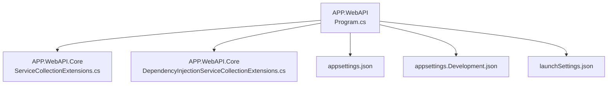
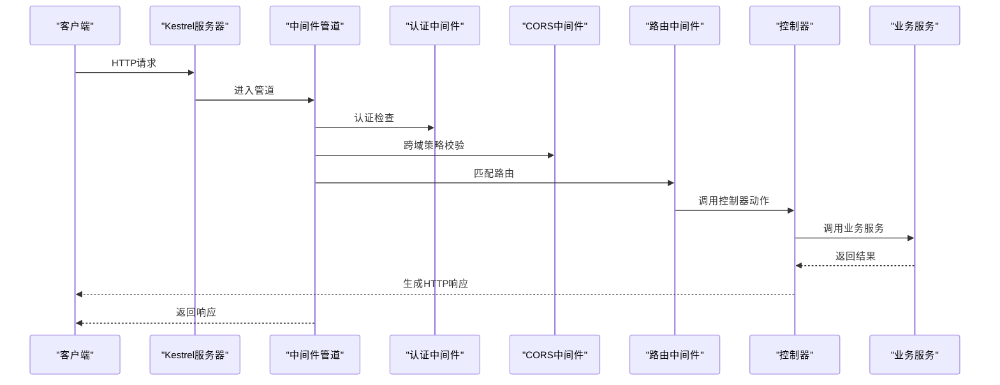
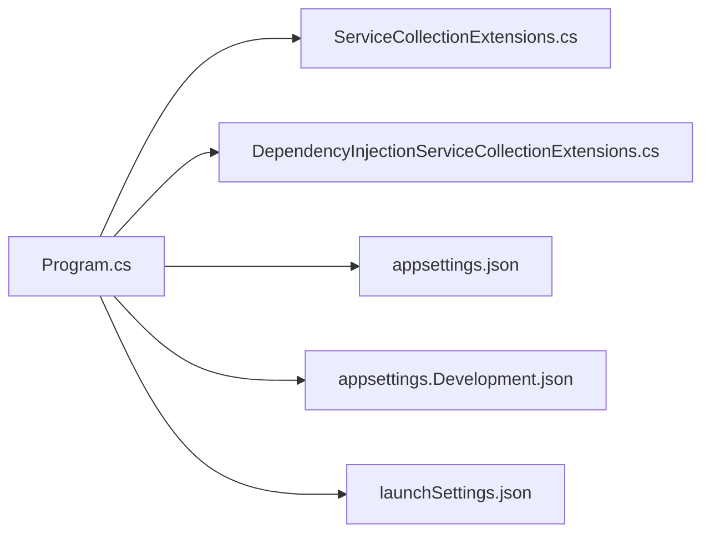

# 中间件集成

<cite>
**本文档引用的文件**   
- [Program.cs](file://src/APP.WebAPI/Program.cs)
- [appsettings.json](file://src/APP.WebAPI/appsettings.json)
- [appsettings.Development.json](file://src/APP.WebAPI/appsettings.Development.json)
- [launchSettings.json](file://src/APP.WebAPI/Properties/launchSettings.json)
- [ServiceCollectionExtensions.cs](file://src/APP.WebAPI.Core/Application/Extensions/ServiceCollectionExtensions.cs)
- [DependencyInjectionServiceCollectionExtensions.cs](file://src/APP.WebAPI.Core/DependencyInjection/DependencyInjectionServiceCollectionExtensions.cs)
</cite>

## 目录
1. [简介](#简介)
2. [项目结构](#项目结构)
3. [核心组件](#核心组件)
4. [架构总览](#架构总览)
5. [详细组件分析](#详细组件分析)
6. [依赖关系分析](#依赖关系分析)
7. [性能考虑](#性能考虑)
8. [故障排查指南](#故障排查指南)
9. [结论](#结论)
10. [附录](#附录)

## 简介
本章节面向AutoCode项目中ASP.NET Core的中间件集成，重点说明如何在Program.cs中构建请求管道、注册自定义中间件的顺序与执行流程，并给出日志记录、异常处理、CORS等常用中间件的集成方式。同时提供appsettings配置文件的结构与选项说明，区分开发与生产环境差异，并附带调试技巧与性能优化建议。

## 项目结构
本项目采用分层组织：Web API入口位于APP.WebAPI，核心服务扩展与依赖注入在APP.WebAPI.Core中实现。Program.cs负责应用启动、服务注册与中间件管道构建；配置文件集中在appsettings.*与launchSettings.json中。

图表来源
- [Program.cs](file://src/APP.WebAPI/Program.cs)
- [ServiceCollectionExtensions.cs](file://src/APP.WebAPI.Core/Application/Extensions/ServiceCollectionExtensions.cs)
- [DependencyInjectionServiceCollectionExtensions.cs](file://src/APP.WebAPI.Core/DependencyInjection/DependencyInjectionServiceCollectionExtensions.cs)
- [appsettings.json](file://src/APP.WebAPI/appsettings.json)
- [appsettings.Development.json](file://src/APP.WebAPI/appsettings.Development.json)
- [launchSettings.json](file://src/APP.WebAPI/Properties/launchSettings.json)

章节来源
- [Program.cs](file://src/APP.WebAPI/Program.cs)
- [ServiceCollectionExtensions.cs](file://src/APP.WebAPI.Core/Application/Extensions/ServiceCollectionExtensions.cs)
- [DependencyInjectionServiceCollectionExtensions.cs](file://src/APP.WebAPI.Core/DependencyInjection/DependencyInjectionServiceCollectionExtensions.cs)
- [appsettings.json](file://src/APP.WebAPI/appsettings.json)
- [appsettings.Development.json](file://src/APP.WebAPI/appsettings.Development.json)
- [launchSettings.json](file://src/APP.WebAPI/Properties/launchSettings.json)

## 核心组件
- Program.cs：应用入口，负责创建Host、加载配置、注册服务与构建中间件管道。
- ServiceCollectionExtensions.cs：集中扩展IServiceCollection，封装业务相关服务的注册逻辑。
- DependencyInjectionServiceCollectionExtensions.cs：通用依赖注入扩展，按生命周期（瞬态、作用域、单例）扫描并注册接口与实现。
- appsettings.json与appsettings.Development.json：应用配置与环境差异化设置。
- launchSettings.json：开发时运行参数与环境变量。

章节来源
- [Program.cs](file://src/APP.WebAPI/Program.cs)
- [ServiceCollectionExtensions.cs](file://src/APP.WebAPI.Core/Application/Extensions/ServiceCollectionExtensions.cs)
- [DependencyInjectionServiceCollectionExtensions.cs](file://src/APP.WebAPI.Core/DependencyInjection/DependencyInjectionServiceCollectionExtensions.cs)
- [appsettings.json](file://src/APP.WebAPI/appsettings.json)
- [appsettings.Development.json](file://src/APP.WebAPI/appsettings.Development.json)
- [launchSettings.json](file://src/APP.WebAPI/Properties/launchSettings.json)

## 架构总览
下图展示ASP.NET Core中间件管道的典型执行路径，以及在本项目中的集成点。请求从进入Kestrel开始，依次经过认证、CORS、路由、控制器、业务服务等阶段，最终返回响应。

图表来源
- [Program.cs](file://src/APP.WebAPI/Program.cs)

## 详细组件分析

### Program.cs：中间件管道构建与服务注册
- 构建Host与加载配置：通过IHostBuilder或WebApplicationBuilder初始化应用上下文，读取appsettings.*与环境变量。
- 服务注册：调用扩展方法将业务服务、第三方库服务、日志、缓存等注册到DI容器。
- 中间件管道：使用Use*系列方法按顺序注册中间件，确保异常处理、CORS、路由、端点映射等的正确顺序。
- 自定义中间件：可通过UseMiddleware或扩展方法注册，注意其执行顺序对请求处理的影响。

章节来源
- [Program.cs](file://src/APP.WebAPI/Program.cs)

### ServiceCollectionExtensions.cs：服务扩展封装
- 职责：将分散的服务注册逻辑集中管理，提高可读性与可维护性。
- 常见内容：数据库连接、消息队列、外部API客户端、业务领域服务等。
- 最佳实践：按模块划分扩展方法，避免单个类过于庞大。

章节来源
- [ServiceCollectionExtensions.cs](file://src/APP.WebAPI.Core/Application/Extensions/ServiceCollectionExtensions.cs)

### DependencyInjectionServiceCollectionExtensions.cs：依赖注入扩展
- 职责：基于约定自动扫描并注册接口与实现，支持瞬态、作用域、单例生命周期。
- 优势：减少手动注册代码，提升扩展性。
- 注意事项：避免循环依赖，合理选择生命周期。

章节来源
- [DependencyInjectionServiceCollectionExtensions.cs](file://src/APP.WebAPI.Core/DependencyInjection/DependencyInjectionServiceCollectionExtensions.cs)

### appsettings.json与appsettings.Development.json：配置结构与环境差异
- appsettings.json：默认配置，包含连接字符串、日志级别、功能开关等。
- appsettings.Development.json：开发环境覆盖配置，如启用详细错误页、调试日志、本地化设置等。
- 推荐结构：
  - ConnectionStrings：数据库与缓存连接
  - Logging：日志提供者与级别
  - Cors：跨域白名单与允许头
  - AppSettings：应用特性开关

章节来源
- [appsettings.json](file://src/APP.WebAPI/appsettings.json)
- [appsettings.Development.json](file://src/APP.WebAPI/appsettings.Development.json)

### launchSettings.json：开发运行配置
- 用途：定义开发时的启动命令、环境变量、端口、HTTPS设置等。
- 建议：为不同环境创建多个profile，便于快速切换。

章节来源
- [launchSettings.json](file://src/APP.WebAPI/Properties/launchSettings.json)

## 依赖关系分析
下图展示Program.cs与各扩展及配置文件的依赖关系，体现服务注册与中间件管道的组织方式。

图表来源
- [Program.cs](file://src/APP.WebAPI/Program.cs)
- [ServiceCollectionExtensions.cs](file://src/APP.WebAPI.Core/Application/Extensions/ServiceCollectionExtensions.cs)
- [DependencyInjectionServiceCollectionExtensions.cs](file://src/APP.WebAPI.Core/DependencyInjection/DependencyInjectionServiceCollectionExtensions.cs)
- [appsettings.json](file://src/APP.WebAPI/appsettings.json)
- [appsettings.Development.json](file://src/APP.WebAPI/appsettings.Development.json)
- [launchSettings.json](file://src/APP.WebAPI/Properties/launchSettings.json)

章节来源
- [Program.cs](file://src/APP.WebAPI/Program.cs)
- [ServiceCollectionExtensions.cs](file://src/APP.WebAPI.Core/Application/Extensions/ServiceCollectionExtensions.cs)
- [DependencyInjectionServiceCollectionExtensions.cs](file://src/APP.WebAPI.Core/DependencyInjection/DependencyInjectionServiceCollectionExtensions.cs)
- [appsettings.json](file://src/APP.WebAPI/appsettings.json)
- [appsettings.Development.json](file://src/APP.WebAPI/appsettings.Development.json)
- [launchSettings.json](file://src/APP.WebAPI/Properties/launchSettings.json)

## 性能考虑
- 中间件顺序：将耗时较少的中间件前置，减少不必要的处理开销。
- 异步优先：尽量使用异步中间件与服务，避免阻塞线程池。
- 缓存策略：对热点数据使用内存缓存或分布式缓存，降低数据库压力。
- 日志级别：生产环境降低日志级别，避免过多I/O影响性能。
- 资源释放：确保一次性对象与连接的正确释放，避免内存泄漏。

[本节为通用指导，不直接分析具体文件]

## 故障排查指南
- 启用详细错误页：开发环境可在中间件管道中启用DeveloperExceptionPage以获取堆栈信息。
- 日志定位：结合Serilog或内置日志框架，输出关键请求与异常信息。
- CORS问题：检查Origin、AllowedHeaders、AllowedMethods是否匹配。
- 依赖注入失败：确认服务生命周期与构造函数依赖是否正确注册。
- 配置未生效：检查环境变量覆盖与配置文件优先级。

章节来源
- [Program.cs](file://src/APP.WebAPI/Program.cs)
- [appsettings.Development.json](file://src/APP.WebAPI/appsettings.Development.json)

## 结论
通过合理的中间件顺序与清晰的配置结构，可以在AutoCode项目中高效集成ASP.NET Core的日志、异常处理、CORS等功能。借助扩展方法与依赖注入约定，能够显著提升代码的可维护性与扩展性。在生产环境中，应重点关注性能与稳定性，合理调整日志级别与缓存策略。

[本节为总结性内容，不直接分析具体文件]

## 附录
- 中间件调试技巧：
  - 使用浏览器开发者工具查看请求头与响应头。
  - 在中间件中打印关键变量，验证执行顺序。
  - 利用断点与日志输出定位问题。
- 性能优化建议：
  - 启用响应压缩与静态文件缓存。
  - 使用连接池与异步I/O。
  - 监控关键指标（CPU、内存、请求延迟）。

[本节为补充信息，不直接分析具体文件]