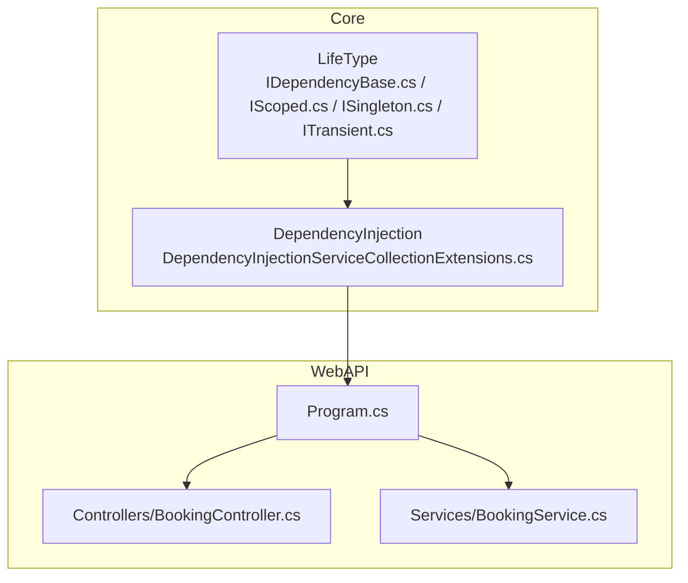
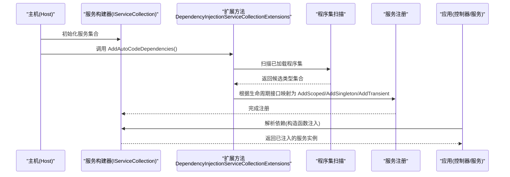
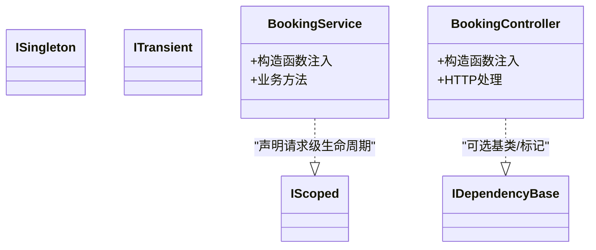
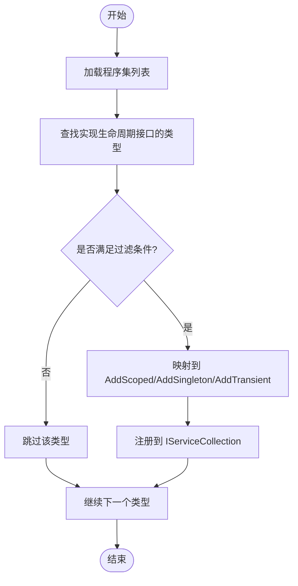
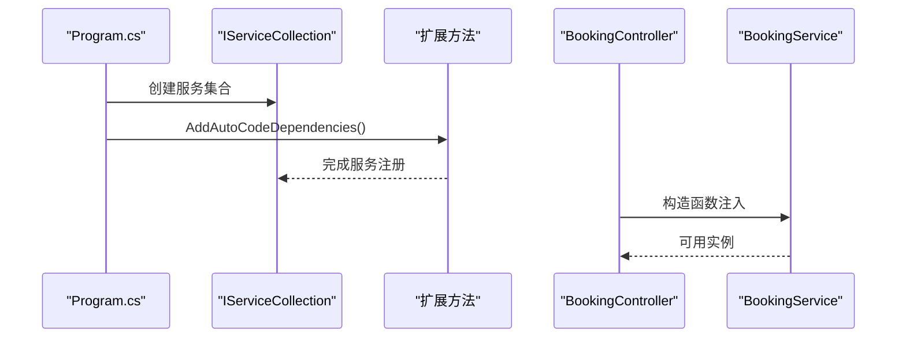
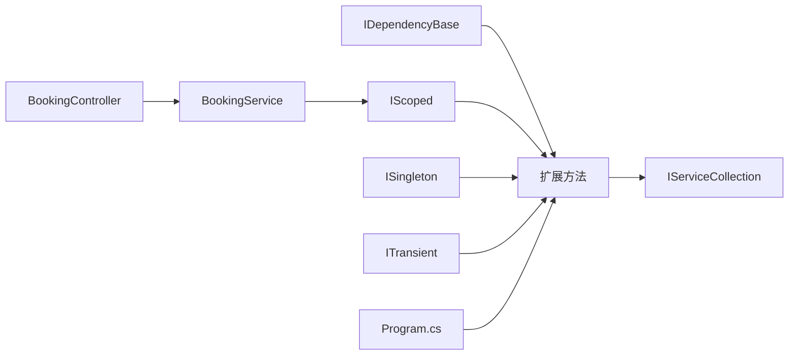

# 依赖注入配置

<cite>
**本文引用的文件**   
- [IDependencyBase.cs](file://src/APP.WebAPI.Core/DependencyInjection/LifeType/IDependencyBase.cs)
- [IScoped.cs](file://src/APP.WebAPI.Core/DependencyInjection/LifeType/IScoped.cs)
- [ISingleton.cs](file://src/APP.WebAPI.Core/DependencyInjection/LifeType/ISingleton.cs)
- [ITransient.cs](file://src/APP.WebAPI.Core/DependencyInjection/LifeType/ITransient.cs)
- [DependencyInjectionServiceCollectionExtensions.cs](file://src/APP.WebAPI.Core/DependencyInjection/DependencyInjectionServiceCollectionExtensions.cs)
- [Program.cs](file://src/APP.WebAPI/Program.cs)
- [BookingController.cs](file://src/APP.WebAPI/Controllers/BookingController.cs)
- [BookingService.cs](file://src/APP.WebAPI/Services/BookingService.cs)
</cite>

## 目录
1. [简介](#简介)
2. [项目结构](#项目结构)
3. [核心组件](#核心组件)
4. [架构总览](#架构总览)
5. [详细组件分析](#详细组件分析)
6. [依赖关系分析](#依赖关系分析)
7. [性能考虑](#性能考虑)
8. [故障排查指南](#故障排查指南)
9. [结论](#结论)
10. [附录](#附录)

## 简介
本文件面向在 ASP.NET Core 项目中集成 AutoCode 的依赖注入（DI）容器配置与使用。重点说明：
- IDependencyBase 接口与生命周期标记接口（IScoped、ISingleton、ITransient）的设计与实现原理
- 如何通过 DependencyInjectionServiceCollectionExtensions 扩展方法完成服务的自动扫描与手动注册
- 在 ASP.NET Core 中正确配置和注入 AutoCode 生成服务的具体步骤
- 生命周期管理的最佳实践与常见陷阱规避

## 项目结构
AutoCode 的 DI 相关能力集中在 APP.WebAPI.Core 项目的 DependencyInjection 目录下，包含生命周期类型定义与扩展方法；ASP.NET Core 应用入口位于 APP.WebAPI 项目的 Program.cs，控制器与服务示例位于 Controllers 与 Services 目录。

图表来源 
- [DependencyInjectionServiceCollectionExtensions.cs](file://src/APP.WebAPI.Core/DependencyInjection/DependencyInjectionServiceCollectionExtensions.cs)
- [IDependencyBase.cs](file://src/APP.WebAPI.Core/DependencyInjection/LifeType/IDependencyBase.cs)
- [IScoped.cs](file://src/APP.WebAPI.Core/DependencyInjection/LifeType/IScoped.cs)
- [ISingleton.cs](file://src/APP.WebAPI.Core/DependencyInjection/LifeType/ISingleton.cs)
- [ITransient.cs](file://src/APP.WebAPI.Core/DependencyInjection/LifeType/ITransient.cs)
- [Program.cs](file://src/APP.WebAPI/Program.cs)
- [BookingController.cs](file://src/APP.WebAPI/Controllers/BookingController.cs)
- [BookingService.cs](file://src/APP.WebAPI/Services/BookingService.cs)

章节来源
- [DependencyInjectionServiceCollectionExtensions.cs](file://src/APP.WebAPI.Core/DependencyInjection/DependencyInjectionServiceCollectionExtensions.cs)
- [Program.cs](file://src/APP.WebAPI/Program.cs)

## 核心组件
- IDependencyBase：作为所有可被自动发现并注册的依赖基类或标记接口，用于统一标识“需要由容器管理”的类型。
- 生命周期标记接口：
  - IScoped：请求级生命周期，每个请求创建一次实例
  - ISingleton：单例生命周期，整个应用程序域内仅一个实例
  - ITransient：瞬态生命周期，每次解析都创建新实例
- DependencyInjectionServiceCollectionExtensions：提供 AddAutoCodeDependencies 等扩展方法，支持按约定自动扫描并注册实现了上述接口的类型，也支持手动指定类型进行注册。

章节来源
- [IDependencyBase.cs](file://src/APP.WebAPI.Core/DependencyInjection/LifeType/IDependencyBase.cs)
- [IScoped.cs](file://src/APP.WebAPI.Core/DependencyInjection/LifeType/IScoped.cs)
- [ISingleton.cs](file://src/APP.WebAPI.Core/DependencyInjection/LifeType/ISingleton.cs)
- [ITransient.cs](file://src/APP.WebAPI.Core/DependencyInjection/LifeType/ITransient.cs)
- [DependencyInjectionServiceCollectionExtensions.cs](file://src/APP.WebAPI.Core/DependencyInjection/DependencyInjectionServiceCollectionExtensions.cs)

## 架构总览
下图展示了 AutoCode 依赖注入在 ASP.NET Core 中的整体流程：启动时通过扩展方法扫描程序集，识别实现了生命周期接口的类型，并将其以对应生命周期注册到 IServiceCollection；运行时由框架解析依赖并注入到控制器或服务。

图表来源 
- [DependencyInjectionServiceCollectionExtensions.cs](file://src/APP.WebAPI.Core/DependencyInjection/DependencyInjectionServiceCollectionExtensions.cs)
- [Program.cs](file://src/APP.WebAPI/Program.cs)

## 详细组件分析

### 生命周期接口与基类设计
- IDependencyBase：作为统一的依赖标记，便于扩展方法在扫描时快速筛选目标类型。
- IScoped、ISingleton、ITransient：分别映射到 .NET DI 的 Scoped、Singleton、Transient 生命周期。实现这些接口即声明了该类型的期望生命周期。

图表来源 
- [IDependencyBase.cs](file://src/APP.WebAPI.Core/DependencyInjection/LifeType/IDependencyBase.cs)
- [IScoped.cs](file://src/APP.WebAPI.Core/DependencyInjection/LifeType/IScoped.cs)
- [ISingleton.cs](file://src/APP.WebAPI.Core/DependencyInjection/LifeType/ISingleton.cs)
- [ITransient.cs](file://src/APP.WebAPI.Core/DependencyInjection/LifeType/ITransient.cs)
- [BookingService.cs](file://src/APP.WebAPI/Services/BookingService.cs)
- [BookingController.cs](file://src/APP.WebAPI/Controllers/BookingController.cs)

章节来源
- [IDependencyBase.cs](file://src/APP.WebAPI.Core/DependencyInjection/LifeType/IDependencyBase.cs)
- [IScoped.cs](file://src/APP.WebAPI.Core/DependencyInjection/LifeType/IScoped.cs)
- [ISingleton.cs](file://src/APP.WebAPI.Core/DependencyInjection/LifeType/ISingleton.cs)
- [ITransient.cs](file://src/APP.WebAPI.Core/DependencyInjection/LifeType/ITransient.cs)
- [BookingService.cs](file://src/APP.WebAPI/Services/BookingService.cs)
- [BookingController.cs](file://src/APP.WebAPI/Controllers/BookingController.cs)

### 扩展方法与自动扫描机制
- 扩展方法通常提供如下能力：
  - 自动扫描当前程序集或指定程序集，查找实现了 IScoped、ISingleton、ITransient 的类型
  - 将匹配到的类型以对应的生命周期添加到 IServiceCollection
  - 支持忽略某些命名空间或类型的前缀过滤
  - 支持手动追加注册（覆盖或补充）
- 典型调用位置在 Program.cs 的 ConfigureServices 阶段。

图表来源 
- [DependencyInjectionServiceCollectionExtensions.cs](file://src/APP.WebAPI.Core/DependencyInjection/DependencyInjectionServiceCollectionExtensions.cs)

章节来源
- [DependencyInjectionServiceCollectionExtensions.cs](file://src/APP.WebAPI.Core/DependencyInjection/DependencyInjectionServiceCollectionExtensions.cs)

### 在 ASP.NET Core 中的配置与注入
- 在 Program.cs 中调用扩展方法进行自动注册
- 在控制器或服务中通过构造函数注入所需服务
- 确保实现了对应生命周期接口的服务类型已被扫描到

图表来源 
- [Program.cs](file://src/APP.WebAPI/Program.cs)
- [DependencyInjectionServiceCollectionExtensions.cs](file://src/APP.WebAPI.Core/DependencyInjection/DependencyInjectionServiceCollectionExtensions.cs)
- [BookingController.cs](file://src/APP.WebAPI/Controllers/BookingController.cs)
- [BookingService.cs](file://src/APP.WebAPI/Services/BookingService.cs)

章节来源
- [Program.cs](file://src/APP.WebAPI/Program.cs)
- [BookingController.cs](file://src/APP.WebAPI/Controllers/BookingController.cs)
- [BookingService.cs](file://src/APP.WebAPI/Services/BookingService.cs)

## 依赖关系分析
- 低耦合：生命周期接口与具体实现解耦，扩展方法只依赖接口契约
- 高内聚：生命周期判定逻辑集中在扩展方法内部，便于维护与扩展
- 外部依赖：.NET 内置的 IServiceCollection 与反射 API（用于程序集扫描）

图表来源 
- [IDependencyBase.cs](file://src/APP.WebAPI.Core/DependencyInjection/LifeType/IDependencyBase.cs)
- [IScoped.cs](file://src/APP.WebAPI.Core/DependencyInjection/LifeType/IScoped.cs)
- [ISingleton.cs](file://src/APP.WebAPI.Core/DependencyInjection/LifeType/ISingleton.cs)
- [ITransient.cs](file://src/APP.WebAPI.Core/DependencyInjection/LifeType/ITransient.cs)
- [DependencyInjectionServiceCollectionExtensions.cs](file://src/APP.WebAPI.Core/DependencyInjection/DependencyInjectionServiceCollectionExtensions.cs)
- [Program.cs](file://src/APP.WebAPI/Program.cs)
- [BookingController.cs](file://src/APP.WebAPI/Controllers/BookingController.cs)
- [BookingService.cs](file://src/APP.WebAPI/Services/BookingService.cs)

章节来源
- [DependencyInjectionServiceCollectionExtensions.cs](file://src/APP.WebAPI.Core/DependencyInjection/DependencyInjectionServiceCollectionExtensions.cs)
- [Program.cs](file://src/APP.WebAPI/Program.cs)

## 性能考虑
- 程序集扫描开销：建议在启动阶段一次性完成，避免重复扫描；必要时限制扫描范围（如排除测试程序集）
- 生命周期选择：
  - Singleton 适合无状态、线程安全的共享资源（如配置缓存）
  - Scoped 适合请求级上下文（如数据库连接、工作单元）
  - Transient 适合轻量、无状态的短生命周期对象
- 避免循环依赖：通过接口抽象与合理的分层减少环引用
- 延迟解析：对重型依赖可使用 Lazy<T> 或工厂模式按需创建

[本节为通用指导，不直接分析具体文件]

## 故障排查指南
- 未找到类型：确认程序集已加载且未被过滤规则排除
- 生命周期冲突：检查是否存在同一接口多个实现且未明确指定
- 循环依赖异常：重构依赖关系或使用工厂/事件总线解耦
- 作用域误用：不要在 Singleton 中注入 Scoped/Transient 服务，避免捕获作用域对象
- 构造器参数缺失：确保所有依赖都已注册并可解析

章节来源
- [DependencyInjectionServiceCollectionExtensions.cs](file://src/APP.WebAPI.Core/DependencyInjection/DependencyInjectionServiceCollectionExtensions.cs)
- [Program.cs](file://src/APP.WebAPI/Program.cs)

## 结论
通过 IDependencyBase 与生命周期标记接口，配合扩展方法的自动扫描与注册机制，AutoCode 能够在 ASP.NET Core 中以约定优于配置的方式高效管理依赖。合理选择生命周期、遵循最佳实践，可以显著提升系统的可维护性与运行效率。

[本节为总结性内容，不直接分析具体文件]

## 附录
- 常用扩展方法建议：
  - AddAutoCodeDependencies：默认自动扫描当前程序集
  - AddAutoCodeDependenciesFromAssembly：指定程序集进行扫描
  - AddAutoCodeDependenciesExcludeNamespaces：排除特定命名空间
- 手动注册示例场景：
  - 第三方库类型无法修改以实现生命周期接口时，使用手动注册
  - 需要覆盖默认行为或添加额外配置时

[本节为补充信息，不直接分析具体文件]