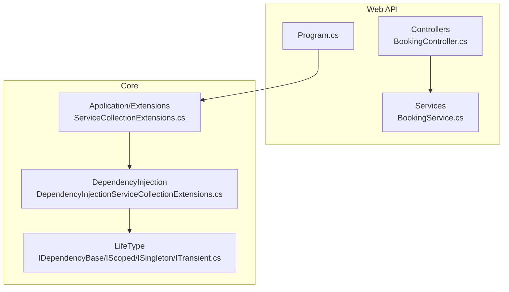
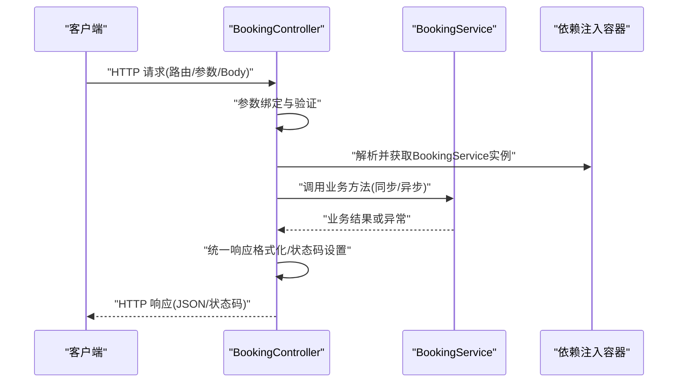
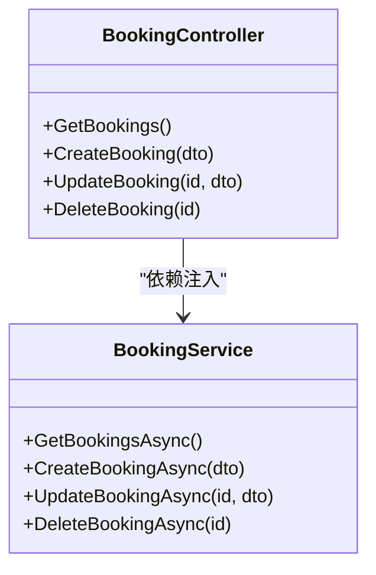
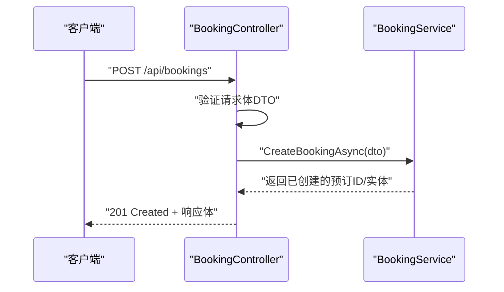
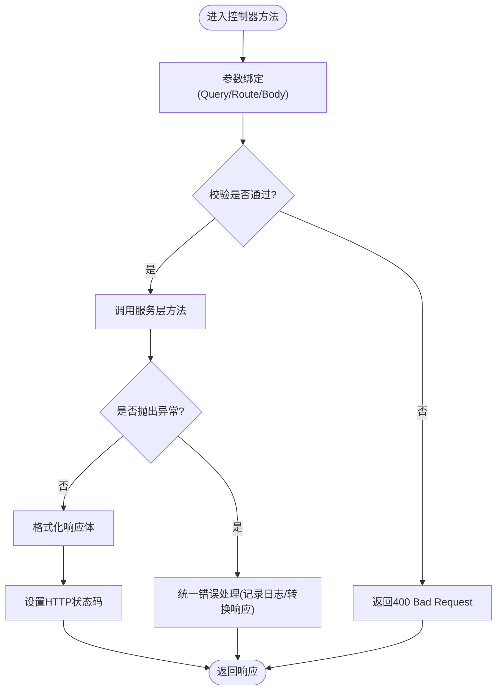
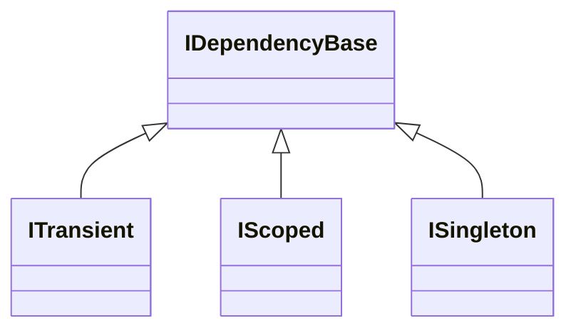
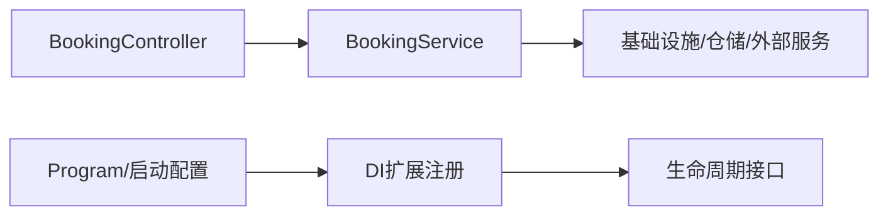

# 控制器使用

<cite>
**本文档引用的文件**   
- [BookingController.cs](file://src/APP.WebAPI/Controllers/BookingController.cs)
- [BookingService.cs](file://src/APP.WebAPI/Services/BookingService.cs)
- [Program.cs](file://src/APP.WebAPI/Program.cs)
- [ServiceCollectionExtensions.cs](file://src/APP.WebAPI.Core/Application/Extensions/ServiceCollectionExtensions.cs)
- [DependencyInjectionServiceCollectionExtensions.cs](file://src/APP.WebAPI.Core/DependencyInjection/DependencyInjectionServiceCollectionExtensions.cs)
- [IDependencyBase.cs](file://src/APP.WebAPI.Core/DependencyInjection/LifeType/IDependencyBase.cs)
- [IScoped.cs](file://src/APP.WebAPI.Core/DependencyInjection/LifeType/IScoped.cs)
- [ISingleton.cs](file://src/APP.WebAPI.Core/DependencyInjection/LifeType/ISingleton.cs)
- [ITransient.cs](file://src/APP.WebAPI.Core/DependencyInjection/LifeType/ITransient.cs)
</cite>

## 目录
1. [简介](#简介)
2. [项目结构](#项目结构)
3. [核心组件](#核心组件)
4. [架构总览](#架构总览)
5. [详细组件分析](#详细组件分析)
6. [依赖关系分析](#依赖关系分析)
7. [性能考虑](#性能考虑)
8. [故障排查指南](#故障排查指南)
9. [结论](#结论)
10. [附录](#附录)

## 简介
本文件面向在ASP.NET Core Web API中使用AutoCode生成代码的开发者，重点说明如何在BookingController中实现依赖注入、参数绑定、返回值处理与错误处理；如何调用BookingService中的业务逻辑；如何处理异步操作与异常；并提供完整的控制器实现示例（以路径引用形式），涵盖HTTP状态码设置、响应格式化与验证处理。同时给出控制器测试最佳实践与性能优化建议。

## 项目结构
本项目采用分层组织：Web API层（Controllers）、服务层（Services）、核心依赖注入扩展（Core）以及AutoCode相关工具与模型。BookingController位于Web API层，BookingService位于服务层，依赖注入通过Core层的扩展进行注册。

图表来源
- [BookingController.cs](file://src/APP.WebAPI/Controllers/BookingController.cs)
- [BookingService.cs](file://src/APP.WebAPI/Services/BookingService.cs)
- [Program.cs](file://src/APP.WebAPI/Program.cs)
- [ServiceCollectionExtensions.cs](file://src/APP.WebAPI.Core/Application/Extensions/ServiceCollectionExtensions.cs)
- [DependencyInjectionServiceCollectionExtensions.cs](file://src/APP.WebAPI.Core/DependencyInjection/DependencyInjectionServiceCollectionExtensions.cs)
- [IDependencyBase.cs](file://src/APP.WebAPI.Core/DependencyInjection/LifeType/IDependencyBase.cs)
- [IScoped.cs](file://src/APP.WebAPI.Core/DependencyInjection/LifeType/IScoped.cs)
- [ISingleton.cs](file://src/APP.WebAPI.Core/DependencyInjection/LifeType/ISingleton.cs)
- [ITransient.cs](file://src/APP.WebAPI.Core/DependencyInjection/LifeType/ITransient.cs)

章节来源
- [Program.cs](file://src/APP.WebAPI/Program.cs)
- [ServiceCollectionExtensions.cs](file://src/APP.WebAPI.Core/Application/Extensions/ServiceCollectionExtensions.cs)
- [DependencyInjectionServiceCollectionExtensions.cs](file://src/APP.WebAPI.Core/DependencyInjection/DependencyInjectionServiceCollectionExtensions.cs)

## 核心组件
- BookingController：负责HTTP请求入口、参数绑定、校验、调用服务层、统一返回格式与错误处理。
- BookingService：封装业务逻辑，提供同步/异步方法供控制器调用。
- 依赖注入扩展：集中注册服务生命周期（Transient/Scoped/Singleton），便于控制器通过构造函数注入。

章节来源
- [BookingController.cs](file://src/APP.WebAPI/Controllers/BookingController.cs)
- [BookingService.cs](file://src/APP.WebAPI/Services/BookingService.cs)
- [ServiceCollectionExtensions.cs](file://src/APP.WebAPI.Core/Application/Extensions/ServiceCollectionExtensions.cs)
- [DependencyInjectionServiceCollectionExtensions.cs](file://src/APP.WebAPI.Core/DependencyInjection/DependencyInjectionServiceCollectionExtensions.cs)

## 架构总览
下图展示从HTTP请求到控制器、再到服务层的调用流程，以及统一的响应与错误处理模式。

图表来源
- [BookingController.cs](file://src/APP.WebAPI/Controllers/BookingController.cs)
- [BookingService.cs](file://src/APP.WebAPI/Services/BookingService.cs)
- [DependencyInjectionServiceCollectionExtensions.cs](file://src/APP.WebAPI.Core/DependencyInjection/DependencyInjectionServiceCollectionExtensions.cs)

## 详细组件分析

### BookingController 实现模式
- 依赖注入
  - 通过构造函数注入BookingService实例，由DI容器根据生命周期策略解析。
  - 建议在Core层通过扩展方法统一注册服务，确保生命周期正确。
- 参数绑定
  - 使用[FromQuery]、[FromBody]、[FromRoute]等特性完成参数绑定。
  - 对复杂类型使用DTO接收请求体，避免直接暴露领域模型。
- 返回值处理
  - 统一包装响应对象，包含数据、消息与状态码。
  - 成功时返回2xx状态码，失败时返回4xx/5xx并附带错误信息。
- 错误处理
  - 捕获异常并转换为标准错误响应。
  - 区分可预期业务异常与系统异常，记录日志并返回合适状态码。
- 异步操作
  - 控制器方法使用async/await调用服务的异步方法。
  - 避免阻塞线程，提升吞吐能力。

章节来源
- [BookingController.cs](file://src/APP.WebAPI/Controllers/BookingController.cs)

#### 类图（控制器与服务）

图表来源
- [BookingController.cs](file://src/APP.WebAPI/Controllers/BookingController.cs)
- [BookingService.cs](file://src/APP.WebAPI/Services/BookingService.cs)

### BookingService 业务逻辑调用
- 同步/异步方法设计
  - 对外暴露异步方法，内部可组合同步IO或第三方调用。
- 输入校验与业务规则
  - 在服务层进行业务规则校验，抛出业务异常以便控制器统一处理。
- 事务与一致性
  - 涉及多步写操作时使用事务边界，保证一致性。
- 异常处理
  - 将底层异常包装为业务异常，保留上下文信息。

章节来源
- [BookingService.cs](file://src/APP.WebAPI/Services/BookingService.cs)

#### 序列图（典型创建预订流程）

图表来源
- [BookingController.cs](file://src/APP.WebAPI/Controllers/BookingController.cs)
- [BookingService.cs](file://src/APP.WebAPI/Services/BookingService.cs)

#### 流程图（参数绑定与校验）

图表来源
- [BookingController.cs](file://src/APP.WebAPI/Controllers/BookingController.cs)

### 依赖注入与生命周期
- 生命周期接口
  - ITransient：每次请求或解析时创建新实例。
  - IScoped：每个作用域（通常为一次HTTP请求）创建一次。
  - ISingleton：应用生命周期内唯一实例。
  - IDependencyBase：作为依赖基类，便于统一注册。
- 注册方式
  - 通过DependencyInjectionServiceCollectionExtensions集中扫描并注册实现了上述接口的服务。
  - 在Program或应用启动阶段调用扩展方法完成注册。

章节来源
- [IDependencyBase.cs](file://src/APP.WebAPI.Core/DependencyInjection/LifeType/IDependencyBase.cs)
- [IScoped.cs](file://src/APP.WebAPI.Core/DependencyInjection/LifeType/IScoped.cs)
- [ISingleton.cs](file://src/APP.WebAPI.Core/DependencyInjection/LifeType/ISingleton.cs)
- [ITransient.cs](file://src/APP.WebAPI.Core/DependencyInjection/LifeType/ITransient.cs)
- [DependencyInjectionServiceCollectionExtensions.cs](file://src/APP.WebAPI.Core/DependencyInjection/DependencyInjectionServiceCollectionExtensions.cs)
- [ServiceCollectionExtensions.cs](file://src/APP.WebAPI.Core/Application/Extensions/ServiceCollectionExtensions.cs)

#### 类图（生命周期接口）

图表来源
- [IDependencyBase.cs](file://src/APP.WebAPI.Core/DependencyInjection/LifeType/IDependencyBase.cs)
- [IScoped.cs](file://src/APP.WebAPI.Core/DependencyInjection/LifeType/IScoped.cs)
- [ISingleton.cs](file://src/APP.WebAPI.Core/DependencyInjection/LifeType/ISingleton.cs)
- [ITransient.cs](file://src/APP.WebAPI.Core/DependencyInjection/LifeType/ITransient.cs)

## 依赖关系分析
- 控制器依赖服务：BookingController依赖BookingService，通过构造函数注入。
- 服务可能依赖仓储或外部资源：BookingService内部可进一步依赖数据库访问或第三方服务。
- DI扩展集中管理生命周期：通过Core层的扩展方法统一注册，降低耦合度。

图表来源
- [BookingController.cs](file://src/APP.WebAPI/Controllers/BookingController.cs)
- [BookingService.cs](file://src/APP.WebAPI/Services/BookingService.cs)
- [DependencyInjectionServiceCollectionExtensions.cs](file://src/APP.WebAPI.Core/DependencyInjection/DependencyInjectionServiceCollectionExtensions.cs)
- [ServiceCollectionExtensions.cs](file://src/APP.WebAPI.Core/Application/Extensions/ServiceCollectionExtensions.cs)

章节来源
- [BookingController.cs](file://src/APP.WebAPI/Controllers/BookingController.cs)
- [BookingService.cs](file://src/APP.WebAPI/Services/BookingService.cs)
- [DependencyInjectionServiceCollectionExtensions.cs](file://src/APP.WebAPI.Core/DependencyInjection/DependencyInjectionServiceCollectionExtensions.cs)

## 性能考虑
- 异步优先：控制器与服务层均使用异步方法，避免阻塞线程池。
- 合理生命周期：
  - 无状态服务使用Transient或Scoped，减少锁竞争。
  - 只读缓存或配置服务使用Singleton，避免重复初始化。
- 参数绑定优化：
  - 使用DTO限制请求体大小，避免反序列化大对象。
  - 启用模型验证以减少无效请求进入业务层。
- 响应格式化：
  - 统一响应包装，减少分支判断开销。
  - 按需序列化字段，避免多余数据。
- 异常处理：
  - 快速失败，避免深层嵌套try-catch。
  - 记录必要上下文，避免过度日志影响性能。

## 故障排查指南
- 常见问题
  - 依赖未注册：检查DI扩展是否正确调用，服务是否实现对应生命周期接口。
  - 参数绑定失败：确认路由、查询参数名称与DTO属性一致，启用模型验证。
  - 异步异常未捕获：确保控制器与服务层都正确处理异常并返回统一错误响应。
- 定位步骤
  - 查看控制器方法入口的参数绑定与验证结果。
  - 在服务层关键路径添加日志，确认业务异常类型与堆栈。
  - 检查DI生命周期是否导致共享状态冲突（如单例持有可变状态）。

章节来源
- [BookingController.cs](file://src/APP.WebAPI/Controllers/BookingController.cs)
- [BookingService.cs](file://src/APP.WebAPI/Services/BookingService.cs)
- [DependencyInjectionServiceCollectionExtensions.cs](file://src/APP.WebAPI.Core/DependencyInjection/DependencyInjectionServiceCollectionExtensions.cs)

## 结论
通过在BookingController中遵循依赖注入、参数绑定、统一响应与错误处理的模式，结合BookingService的业务封装与异步处理，可以构建出高内聚、低耦合且易于测试的Web API。配合Core层的依赖注入扩展，能够统一管理生命周期，提升可维护性与性能。

## 附录
- 控制器实现示例（路径引用）
  - 控制器方法与依赖注入：[BookingController.cs](file://src/APP.WebAPI/Controllers/BookingController.cs)
  - 服务层异步调用与异常处理：[BookingService.cs](file://src/APP.WebAPI/Services/BookingService.cs)
  - 依赖注入注册与生命周期：[DependencyInjectionServiceCollectionExtensions.cs](file://src/APP.WebAPI.Core/DependencyInjection/DependencyInjectionServiceCollectionExtensions.cs)
  - 应用启动与扩展调用：[Program.cs](file://src/APP.WebAPI/Program.cs)
- 控制器测试最佳实践
  - 使用Mock框架模拟BookingService，隔离外部依赖。
  - 覆盖正常路径与异常路径，验证HTTP状态码与响应体结构。
  - 针对参数绑定与验证场景构造边界用例。
- 性能优化建议
  - 启用异步流水线，避免阻塞。
  - 合理选择生命周期，避免不必要的对象创建。
  - 精简响应体，按需序列化字段。
  - 使用连接池与缓存减少I/O开销。
