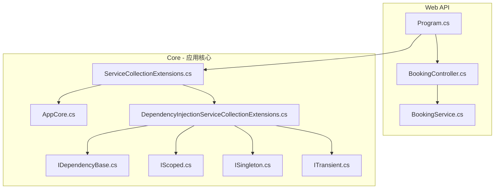
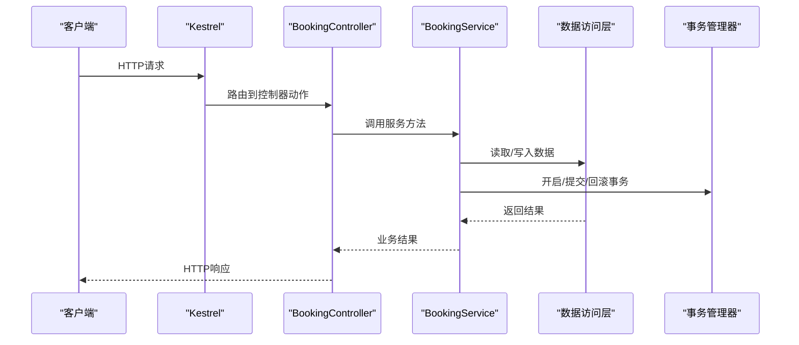
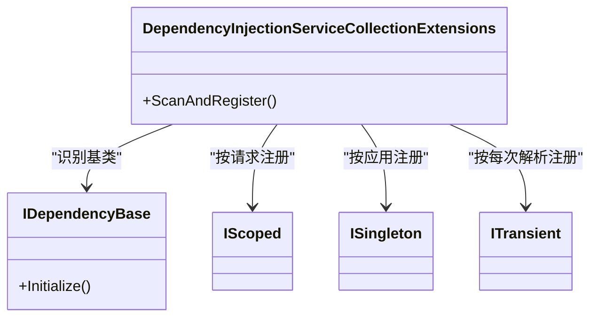
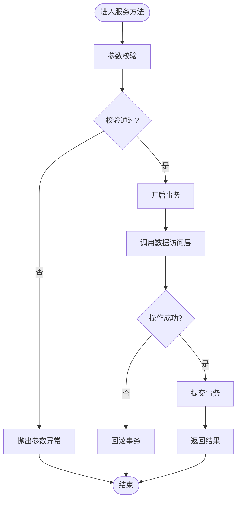
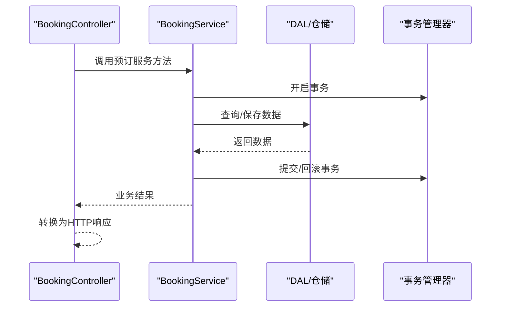
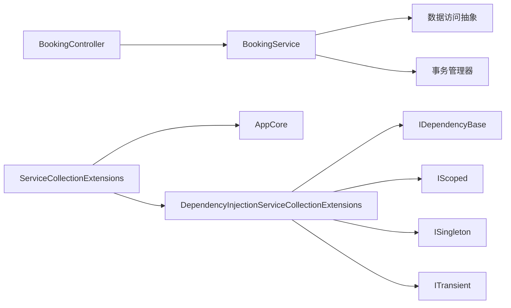

# 服务层架构

<cite>
**本文引用的文件**   
- [APP.WebAPI/Program.cs](file://src/APP.WebAPI/Program.cs)
- [APP.WebAPI/Controllers/BookingController.cs](file://src/APP.WebAPI/Controllers/BookingController.cs)
- [APP.WebAPI/Services/BookingService.cs](file://src/APP.WebAPI/Services/BookingService.cs)
- [APP.WebAPI.Core/Application/AppCore.cs](file://src/APP.WebAPI.Core/Application/AppCore.cs)
- [APP.WebAPI.Core/Application/Extensions/ServiceCollectionExtensions.cs](file://src/APP.WebAPI.Core/Application/Extensions/ServiceCollectionExtensions.cs)
- [APP.WebAPI.Core/DependencyInjection/DependencyInjectionServiceCollectionExtensions.cs](file://src/APP.WebAPI.Core/DependencyInjection/DependencyInjectionServiceCollectionExtensions.cs)
- [APP.WebAPI.Core/DependencyInjection/LifeType/IDependencyBase.cs](file://src/APP.WebAPI.Core/DependencyInjection/LifeType/IDependencyBase.cs)
- [APP.WebAPI.Core/DependencyInjection/LifeType/IScoped.cs](file://src/APP.WebAPI.Core/DependencyInjection/LifeType/IScoped.cs)
- [APP.WebAPI.Core/DependencyInjection/LifeType/ISingleton.cs](file://src/APP.WebAPI.Core/DependencyInjection/LifeType/ISingleton.cs)
- [APP.WebAPI.Core/DependencyInjection/LifeType/ITransient.cs](file://src/APP.WebAPI.Core/DependencyInjection/LifeType/ITransient.cs)
</cite>

## 目录
1. [简介](#简介)
2. [项目结构](#项目结构)
3. [核心组件](#核心组件)
4. [架构总览](#架构总览)
5. [详细组件分析](#详细组件分析)
6. [依赖关系分析](#依赖关系分析)
7. [性能考量](#性能考量)
8. [故障排查指南](#故障排查指南)
9. [结论](#结论)
10. [附录](#附录)

## 简介
本文件聚焦于AutoCode在Web API服务层的架构设计与实现模式，重点说明：
- AppCore核心类的作用与配置方式
- ServiceCollectionExtensions扩展方法的注册机制
- BookingService等具体服务的实现模式（业务逻辑封装、数据访问抽象、事务管理）
- 服务层与控制器之间的交互模式
- 跨领域服务的组织方式
- 服务层测试策略与性能监控最佳实践

## 项目结构
本项目采用分层与模块化组织：
- APP.WebAPI：Web入口、控制器与服务示例
- APP.WebAPI.Core：应用核心、依赖注入扩展、生命周期接口定义
- 其他模块（如Map、Model、SourceGenerator等）与本主题相关度较低，此处不展开

图表来源
- [APP.WebAPI/Program.cs](file://src/APP.WebAPI/Program.cs)
- [APP.WebAPI/Controllers/BookingController.cs](file://src/APP.WebAPI/Controllers/BookingController.cs)
- [APP.WebAPI/Services/BookingService.cs](file://src/APP.WebAPI/Services/BookingService.cs)
- [APP.WebAPI.Core/Application/AppCore.cs](file://src/APP.WebAPI.Core/Application/AppCore.cs)
- [APP.WebAPI.Core/Application/Extensions/ServiceCollectionExtensions.cs](file://src/APP.WebAPI.Core/Application/Extensions/ServiceCollectionExtensions.cs)
- [APP.WebAPI.Core/DependencyInjection/DependencyInjectionServiceCollectionExtensions.cs](file://src/APP.WebAPI.Core/DependencyInjection/DependencyInjectionServiceCollectionExtensions.cs)
- [APP.WebAPI.Core/DependencyInjection/LifeType/IDependencyBase.cs](file://src/APP.WebAPI.Core/DependencyInjection/LifeType/IDependencyBase.cs)
- [APP.WebAPI.Core/DependencyInjection/LifeType/IScoped.cs](file://src/APP.WebAPI.Core/DependencyInjection/LifeType/IScoped.cs)
- [APP.WebAPI.Core/DependencyInjection/LifeType/ISingleton.cs](file://src/APP.WebAPI.Core/DependencyInjection/LifeType/ISingleton.cs)
- [APP.WebAPI.Core/DependencyInjection/LifeType/ITransient.cs](file://src/APP.WebAPI.Core/DependencyInjection/LifeType/ITransient.cs)

章节来源
- [APP.WebAPI/Program.cs](file://src/APP.WebAPI/Program.cs)
- [APP.WebAPI.Core/Application/Extensions/ServiceCollectionExtensions.cs](file://src/APP.WebAPI.Core/Application/Extensions/ServiceCollectionExtensions.cs)

## 核心组件
- AppCore：承载应用级配置与能力聚合，通常用于集中初始化或提供全局访问点。
- ServiceCollectionExtensions：对IServiceCollection进行扩展，统一注册应用服务、中间件与基础设施。
- DependencyInjectionServiceCollectionExtensions：基于生命周期接口的自动扫描与注册扩展。
- 生命周期接口（IDependencyBase、IScoped、ISingleton、ITransient）：约定服务生命周期与基类契约。

章节来源
- [APP.WebAPI.Core/Application/AppCore.cs](file://src/APP.WebAPI.Core/Application/AppCore.cs)
- [APP.WebAPI.Core/Application/Extensions/ServiceCollectionExtensions.cs](file://src/APP.WebAPI.Core/Application/Extensions/ServiceCollectionExtensions.cs)
- [APP.WebAPI.Core/DependencyInjection/DependencyInjectionServiceCollectionExtensions.cs](file://src/APP.WebAPI.Core/DependencyInjection/DependencyInjectionServiceCollectionExtensions.cs)
- [APP.WebAPI.Core/DependencyInjection/LifeType/IDependencyBase.cs](file://src/APP.WebAPI.Core/DependencyInjection/LifeType/IDependencyBase.cs)
- [APP.WebAPI.Core/DependencyInjection/LifeType/IScoped.cs](file://src/APP.WebAPI.Core/DependencyInjection/LifeType/IScoped.cs)
- [APP.WebAPI.Core/DependencyInjection/LifeType/ISingleton.cs](file://src/APP.WebAPI.Core/DependencyInjection/LifeType/ISingleton.cs)
- [APP.WebAPI.Core/DependencyInjection/LifeType/ITransient.cs](file://src/APP.WebAPI.Core/DependencyInjection/LifeType/ITransient.cs)

## 架构总览
整体流程从Web入口启动，通过扩展方法完成服务注册，控制器通过依赖注入获取服务实例，服务内部封装业务逻辑并调用数据访问层（DAL），必要时使用事务管理器保证一致性。

图表来源
- [APP.WebAPI/Program.cs](file://src/APP.WebAPI/Program.cs)
- [APP.WebAPI/Controllers/BookingController.cs](file://src/APP.WebAPI/Controllers/BookingController.cs)
- [APP.WebAPI/Services/BookingService.cs](file://src/APP.WebAPI/Services/BookingService.cs)

## 详细组件分析

### AppCore 核心类
- 作用：集中应用配置、能力聚合与可选的全局访问点；便于在扩展方法中复用。
- 配置方式：通常在扩展方法中创建或注入AppCore实例，供后续服务初始化使用。
- 典型职责：
  - 加载配置源（如appsettings）
  - 暴露统一的配置访问器
  - 初始化日志、缓存、消息队列等基础设施

章节来源
- [APP.WebAPI.Core/Application/AppCore.cs](file://src/APP.WebAPI.Core/Application/AppCore.cs)

### ServiceCollectionExtensions 扩展方法
- 作用：对IServiceCollection进行扩展，统一注册应用服务、中间件与基础设施。
- 设计要点：
  - 将AppCore作为配置中心注入
  - 按命名空间或特性扫描注册服务
  - 支持环境区分（开发/生产）的差异化注册

章节来源
- [APP.WebAPI.Core/Application/Extensions/ServiceCollectionExtensions.cs](file://src/APP.WebAPI.Core/Application/Extensions/ServiceCollectionExtensions.cs)

### 依赖注入扩展与生命周期约定
- DependencyInjectionServiceCollectionExtensions：基于约定的自动扫描与注册，减少样板代码。
- 生命周期接口：
  - IDependencyBase：基础契约，可包含初始化钩子
  - IScoped：请求级别生命周期
  - ISingleton：应用级别单例
  - ITransient：每次解析新建实例

图表来源
- [APP.WebAPI.Core/DependencyInjection/DependencyInjectionServiceCollectionExtensions.cs](file://src/APP.WebAPI.Core/DependencyInjection/DependencyInjectionServiceCollectionExtensions.cs)
- [APP.WebAPI.Core/DependencyInjection/LifeType/IDependencyBase.cs](file://src/APP.WebAPI.Core/DependencyInjection/LifeType/IDependencyBase.cs)
- [APP.WebAPI.Core/DependencyInjection/LifeType/IScoped.cs](file://src/APP.WebAPI.Core/DependencyInjection/LifeType/IScoped.cs)
- [APP.WebAPI.Core/DependencyInjection/LifeType/ISingleton.cs](file://src/APP.WebAPI.Core/DependencyInjection/LifeType/ISingleton.cs)
- [APP.WebAPI.Core/DependencyInjection/LifeType/ITransient.cs](file://src/APP.WebAPI.Core/DependencyInjection/LifeType/ITransient.cs)

章节来源
- [APP.WebAPI.Core/DependencyInjection/DependencyInjectionServiceCollectionExtensions.cs](file://src/APP.WebAPI.Core/DependencyInjection/DependencyInjectionServiceCollection.cs)
- [APP.WebAPI.Core/DependencyInjection/LifeType/IDependencyBase.cs](file://src/APP.WebAPI.Core/DependencyInjection/LifeType/IDependencyBase.cs)
- [APP.WebAPI.Core/DependencyInjection/LifeType/IScoped.cs](file://src/APP.WebAPI.Core/DependencyInjection/LifeType/IScoped.cs)
- [APP.WebAPI.Core/DependencyInjection/LifeType/ISingleton.cs](file://src/APP.WebAPI.Core/DependencyInjection/LifeType/ISingleton.cs)
- [APP.WebAPI.Core/DependencyInjection/LifeType/ITransient.cs](file://src/APP.WebAPI.Core/DependencyInjection/LifeType/ITransient.cs)

### BookingService 服务实现模式
- 业务逻辑封装：将领域规则集中在服务层，避免在控制器中堆积逻辑。
- 数据访问抽象：通过仓储或DAL接口隔离数据库细节，便于替换与测试。
- 事务管理：在服务方法内统一开启、提交或回滚事务，确保一致性。

图表来源
- [APP.WebAPI/Services/BookingService.cs](file://src/APP.WebAPI/Services/BookingService.cs)

章节来源
- [APP.WebAPI/Services/BookingService.cs](file://src/APP.WebAPI/Services/BookingService.cs)

### 控制器与服务层交互模式
- 控制器仅负责HTTP协议处理、参数绑定与响应格式化。
- 控制器通过DI获取服务实例，调用服务方法完成业务编排。
- 错误处理与状态码由控制器统一处理，服务层专注业务语义。

图表来源
- [APP.WebAPI/Controllers/BookingController.cs](file://src/APP.WebAPI/Controllers/BookingController.cs)
- [APP.WebAPI/Services/BookingService.cs](file://src/APP.WebAPI/Services/BookingService.cs)

章节来源
- [APP.WebAPI/Controllers/BookingController.cs](file://src/APP.WebAPI/Controllers/BookingController.cs)
- [APP.WebAPI/Services/BookingService.cs](file://src/APP.WebAPI/Services/BookingService.cs)

### 跨领域服务的组织方式
- 按领域划分服务命名空间与类名，保持高内聚低耦合。
- 通过统一的扩展方法进行跨领域服务注册，避免分散配置。
- 使用共享的基础设施（如日志、配置、缓存）通过AppCore或公共库提供。

章节来源
- [APP.WebAPI.Core/Application/Extensions/ServiceCollectionExtensions.cs](file://src/APP.WebAPI.Core/Application/Extensions/ServiceCollectionExtensions.cs)
- [APP.WebAPI.Core/Application/AppCore.cs](file://src/APP.WebAPI.Core/Application/AppCore.cs)

## 依赖关系分析
- 控制器依赖服务接口（通过DI容器解析）。
- 服务依赖数据访问抽象（仓储/DAL）与事务管理器。
- 扩展方法依赖AppCore与生命周期接口，完成服务注册。

图表来源
- [APP.WebAPI/Controllers/BookingController.cs](file://src/APP.WebAPI/Controllers/BookingController.cs)
- [APP.WebAPI/Services/BookingService.cs](file://src/APP.WebAPI/Services/BookingService.cs)
- [APP.WebAPI.Core/Application/Extensions/ServiceCollectionExtensions.cs](file://src/APP.WebAPI.Core/Application/Extensions/ServiceCollectionExtensions.cs)
- [APP.WebAPI.Core/Application/AppCore.cs](file://src/APP.WebAPI.Core/Application/AppCore.cs)
- [APP.WebAPI.Core/DependencyInjection/DependencyInjectionServiceCollectionExtensions.cs](file://src/APP.WebAPI.Core/DependencyInjection/DependencyInjectionServiceCollectionExtensions.cs)
- [APP.WebAPI.Core/DependencyInjection/LifeType/IDependencyBase.cs](file://src/APP.WebAPI.Core/DependencyInjection/LifeType/IDependencyBase.cs)
- [APP.WebAPI.Core/DependencyInjection/LifeType/IScoped.cs](file://src/APP.WebAPI.Core/DependencyInjection/LifeType/IScoped.cs)
- [APP.WebAPI.Core/DependencyInjection/LifeType/ISingleton.cs](file://src/APP.WebAPI.Core/DependencyInjection/LifeType/ISingleton.cs)
- [APP.WebAPI.Core/DependencyInjection/LifeType/ITransient.cs](file://src/APP.WebAPI.Core/DependencyInjection/LifeType/ITransient.cs)

章节来源
- [APP.WebAPI/Controllers/BookingController.cs](file://src/APP.WebAPI/Controllers/BookingController.cs)
- [APP.WebAPI/Services/BookingService.cs](file://src/APP.WebAPI/Services/BookingService.cs)
- [APP.WebAPI.Core/Application/Extensions/ServiceCollectionExtensions.cs](file://src/APP.WebAPI.Core/Application/Extensions/ServiceCollectionExtensions.cs)

## 性能考量
- 合理选择生命周期：
  - 无状态服务优先使用Transient或Scoped，避免不必要的单例共享。
  - 重资源对象（如连接池）使用Singleton并按需注入。
- 控制事务边界：
  - 尽量缩小事务范围，减少锁持有时间。
  - 避免在服务层进行长耗时I/O。
- 异步与并发：
  - 使用异步I/O提升吞吐。
  - 注意线程安全与上下文传递。
- 缓存策略：
  - 热点数据使用内存缓存或分布式缓存。
  - 合理设置过期与失效策略。

[本节为通用指导，无需特定文件引用]

## 故障排查指南
- 依赖注入问题：
  - 检查扩展方法是否正确注册所有服务。
  - 确认生命周期接口实现正确。
- 事务异常：
  - 检查事务开启/提交/回滚路径是否覆盖所有分支。
  - 捕获并记录底层异常信息。
- 性能瓶颈：
  - 使用性能分析工具定位慢查询与CPU热点。
  - 审查N+1查询与过度同步。

章节来源
- [APP.WebAPI.Core/Application/Extensions/ServiceCollectionExtensions.cs](file://src/APP.WebAPI.Core/Application/Extensions/ServiceCollectionExtensions.cs)
- [APP.WebAPI.Core/DependencyInjection/DependencyInjectionServiceCollectionExtensions.cs](file://src/APP.WebAPI.Core/DependencyInjection/DependencyInjectionServiceCollectionExtensions.cs)
- [APP.WebAPI/Services/BookingService.cs](file://src/APP.WebAPI/Services/BookingService.cs)

## 结论
本架构通过AppCore集中配置、扩展方法统一注册、生命周期接口约定以及服务层清晰的分层与事务管理，实现了高内聚、低耦合且易于测试与维护的Web API服务层。控制器专注于HTTP协议处理，服务层专注业务编排与数据一致性，配合合理的生命周期与性能策略，可在复杂业务场景下保持稳定与高效。

[本节为总结性内容，无需特定文件引用]

## 附录
- 建议的服务层测试策略：
  - 单元测试：针对服务方法，使用Mock数据访问层与事务管理器。
  - 集成测试：验证真实依赖（如数据库）的事务行为与异常路径。
  - 端到端测试：模拟HTTP请求，验证控制器到服务再到数据访问的完整链路。
- 性能监控最佳实践：
  - 接入APM（如Application Insights、OpenTelemetry）收集指标与追踪。
  - 关键路径埋点：服务方法耗时、数据库执行时间、缓存命中率。
  - 告警与仪表盘：设置阈值与可视化面板，快速定位问题。

[本节为通用指导，无需特定文件引用]
