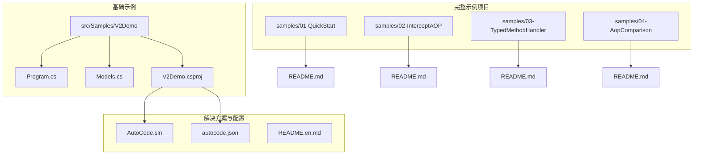
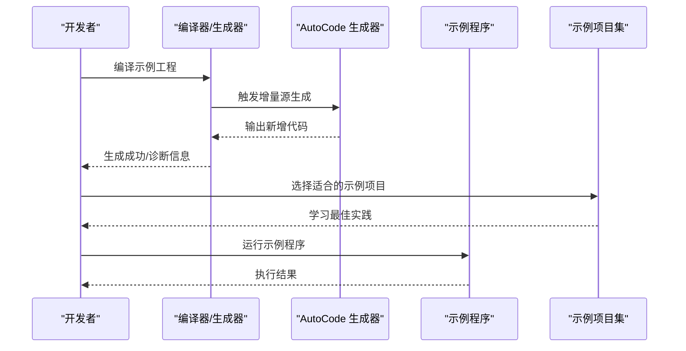
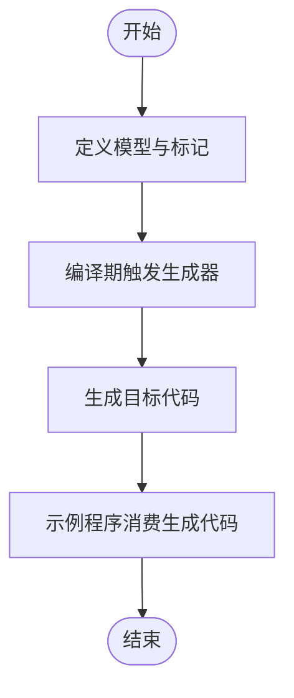
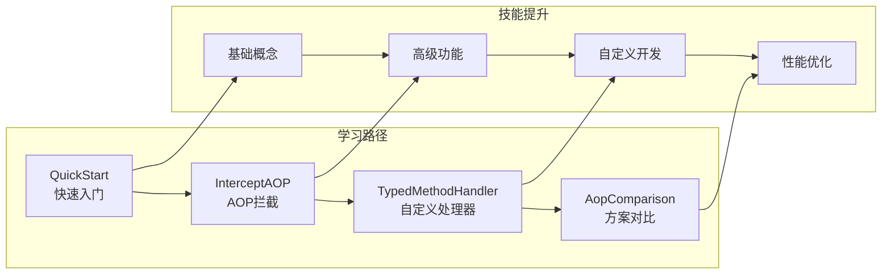
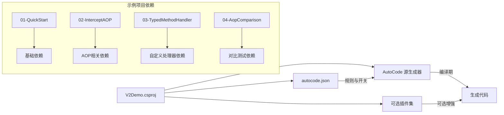

# V2示例项目

<cite>
**本文档引用的文件**   
- [Program.cs](file://src/Samples/V2Demo/Program.cs)
- [Models.cs](file://src/Samples/V2Demo/Models.cs)
- [V2Demo.csproj](file://src/Samples/V2Demo/V2Demo.csproj)
- [AutoCode.sln](file://src/AutoCode.sln)
- [autocode.json](file://src/autocode.json)
- [README.en.md](file://README.en.md)
- [README.md](file://samples/01-QuickStart/README.md)
- [README.md](file://samples/02-InterceptAOP/README.md)
- [README.md](file://samples/03-TypedMethodHandler/README.md)
- [README.md](file://samples/04-AopComparison/README.md)
</cite>

## 更新摘要
**所做更改**   
- 新增了四个完整的示例项目：01-QuickStart、02-InterceptAOP、03-TypedMethodHandler、04-AopComparison
- 为每个示例项目添加了详细的README文档和使用说明
- 扩展了项目结构部分，包含新的示例项目介绍
- 更新了架构总览，展示完整的示例生态系统
- 新增示例项目对比和选择指南

## 目录
1. [简介](#简介)
2. [项目结构](#项目结构)
3. [核心组件](#核心组件)
4. [架构总览](#架构总览)
5. [详细组件分析](#详细组件分析)
6. [示例项目详解](#示例项目详解)
7. [依赖关系分析](#依赖关系分析)
8. [性能考虑](#性能考虑)
9. [故障排查指南](#故障排查指南)
10. [结论](#结论)
11. [附录](#附录) 

## 简介
本仓库是一个基于 AutoCode 的示例与工具集合，重点展示了 V2 版本的代码生成能力与使用方式。V2Demo 作为入口示例，演示了如何通过属性标记、配置与生成器协作，快速生成 DTO、接口、控制器、映射等代码，从而减少样板代码并提升一致性。

**更新** 现在包含了四个完整的示例项目，涵盖了从基础入门到高级AOP拦截的完整学习路径，每个示例都配有详细的README文档和实际使用场景演示。

该文档面向希望理解 V2 示例项目结构与运行方式的读者，既包含高层概览，也提供代码级分析与可视化图示，帮助初学者与有经验的开发者快速上手。

## 项目结构
V2 示例位于 src/Samples/V2Demo 下，包含最小可运行的示例工程：
- Program.cs：示例程序的入口，展示如何启用或触发代码生成相关的能力（例如通过命令行参数或运行时初始化）。
- Models.cs：定义用于演示的属性标记与模型类型，供生成器识别与处理。
- V2Demo.csproj：示例项目的工程文件，声明对 AutoCode 相关包/工程的引用。

此外，根目录下的 autocode.json 为全局配置项，AutoCode.sln 为解决方案文件，README.en.md 提供了英文说明背景。

**新增** samples 目录下包含了四个完整的示例项目：
- 01-QuickStart：快速入门示例，展示最基本的AutoCode使用
- 02-InterceptAOP：AOP拦截功能演示，展示方法拦截和横切关注点
- 03-TypedMethodHandler：类型化方法处理器，展示自定义处理器开发
- 04-AopComparison：AOP方案对比，展示不同AOP实现的性能和功能差异

图表来源 
- [Program.cs](file://src/Samples/V2Demo/Program.cs)
- [Models.cs](file://src/Samples/V2Demo/Models.cs)
- [V2Demo.csproj](file://src/Samples/V2Demo/V2Demo.csproj)
- [README.md](file://samples/01-QuickStart/README.md)
- [README.md](file://samples/02-InterceptAOP/README.md)
- [README.md](file://samples/03-TypedMethodHandler/README.md)
- [README.md](file://samples/04-AopComparison/README.md)

章节来源
- [Program.cs](file://src/Samples/V2Demo/Program.cs)
- [Models.cs](file://src/Samples/V2Demo/Models.cs)
- [V2Demo.csproj](file://src/Samples/V2Demo/V2Demo.csproj)
- [AutoCode.sln](file://src/AutoCode.sln)
- [autocode.json](file://src/autocode.json)
- [README.en.md](file://README.en.md)

## 核心组件
- 示例程序入口（Program.cs）：负责启动示例应用，并在构建期或运行期触发代码生成流程（如增量源生成器、CLI 命令等）。
- 模型与标记（Models.cs）：定义用于驱动生成器的属性标记与基础模型，是生成器识别输入的关键。
- 工程文件（V2Demo.csproj）：声明对 AutoCode 相关库的引用，确保生成器在编译时可用。

这些组件共同构成 V2 示例的最小闭环：通过模型标记描述意图，由生成器产出目标代码，最终被示例程序消费。

**新增** 完整的示例项目体系：
- QuickStart示例：最简化的入门案例，适合初次接触AutoCode的开发者
- InterceptAOP示例：展示AOP拦截功能的完整实现，包括日志记录、权限验证等横切关注点
- TypedMethodHandler示例：演示如何开发自定义的类型化方法处理器
- AopComparison示例：对比不同AOP实现方案的优缺点和性能表现

章节来源
- [Program.cs](file://src/Samples/V2Demo/Program.cs)
- [Models.cs](file://src/Samples/V2Demo/Models.cs)
- [V2Demo.csproj](file://src/Samples/V2Demo/V2Demo.csproj)

## 架构总览
V2 示例采用"属性标记 + 代码生成"的架构模式：
- 输入层：在 Models.cs 中使用属性标记表达业务意图（如 DTO、实体、接口、控制器等）。
- 生成层：AutoCode 的生成器在编译期扫描源代码，解析标记并生成对应代码。
- 消费层：Program.cs 调用生成的代码完成示例功能。

**更新** 完整的示例生态系统展示了从简单到复杂的渐进式学习路径：

图表来源 
- [Program.cs](file://src/Samples/V2Demo/Program.cs)
- [Models.cs](file://src/Samples/V2Demo/Models.cs)
- [V2Demo.csproj](file://src/Samples/V2Demo/V2Demo.csproj)
- [README.md](file://samples/01-QuickStart/README.md)
- [README.md](file://samples/02-InterceptAOP/README.md)
- [README.md](file://samples/03-TypedMethodHandler/README.md)
- [README.md](file://samples/04-AopComparison/README.md)

## 详细组件分析

### 示例程序入口（Program.cs）
- 职责：初始化示例环境，必要时触发生成器或读取生成产物，执行演示逻辑。
- 关键点：
  - 若使用增量源生成器，通常在编译阶段自动完成，无需显式调用。
  - 若需要 CLI 或运行时扩展，可通过命令行参数或环境变量控制行为。
- 建议：保持入口简洁，将复杂逻辑下沉到服务或生成器中。

章节来源
- [Program.cs](file://src/Samples/V2Demo/Program.cs)

### 模型与标记（Models.cs）
- 职责：定义用于驱动生成器的属性标记与基础模型类型。
- 关键点：
  - 属性标记应清晰表达意图（如 DTO、实体、接口、控制器等）。
  - 模型类型需满足生成器的约束（命名、可见性、依赖等）。
- 建议：集中管理标记与模型，便于统一维护与演进。

章节来源
- [Models.cs](file://src/Samples/V2Demo/Models.cs)

### 工程文件（V2Demo.csproj）
- 职责：声明对 AutoCode 相关包的引用，确保生成器在编译期可用。
- 关键点：
  - 引用 AutoCode.SourceGenerator 或相关包以启用增量源生成。
  - 可选引入 CLI 或插件包以扩展生成能力。
- 建议：按需引用，避免不必要的依赖膨胀。

章节来源
- [V2Demo.csproj](file://src/Samples/V2Demo/V2Demo.csproj)

### 概念性概览
下图展示了 V2 示例从"标记定义"到"代码生成"再到"程序消费"的概念流程，不直接映射具体文件，但有助于理解整体思路。

[本图为概念性流程图，未直接映射具体源码文件]

## 示例项目详解

### QuickStart 快速入门示例
**新增** 01-QuickStart 是最基础的示例项目，适合初次接触 AutoCode 的开发者。该项目展示了如何使用最简单的属性标记来生成代码，包括基本的DTO生成、接口定义等核心功能。

主要特点：
- 极简的项目结构，便于理解核心概念
- 完整的README文档，详细说明每一步操作
- 涵盖AutoCode最常用的功能和配置选项

### InterceptAOP AOP拦截示例
**新增** 02-InterceptAOP 展示了AutoCode的强大AOP功能。该项目演示了如何实现方法拦截、日志记录、异常处理、权限验证等横切关注点。

主要特点：
- 完整的AOP拦截器实现
- 多种拦截场景的演示
- 性能优化和最佳实践指导

### TypedMethodHandler 类型化方法处理器示例
**新增** 03-TypedMethodHandler 展示了如何开发自定义的类型化方法处理器。该项目演示了如何处理特定类型的业务逻辑，以及如何与AutoCode框架深度集成。

主要特点：
- 自定义处理器开发指南
- 类型安全的处理方法
- 与现有生态系统的无缝集成

### AopComparison AOP方案对比示例
**新增** 04-AopComparison 提供了不同AOP实现方案的对比分析。该项目通过实际的代码示例和性能测试，帮助开发者选择合适的AOP方案。

主要特点：
- 多种AOP实现方案的对比
- 性能基准测试结果
- 适用场景分析和选型建议

**图表来源**
- [README.md](file://samples/01-QuickStart/README.md)
- [README.md](file://samples/02-InterceptAOP/README.md)
- [README.md](file://samples/03-TypedMethodHandler/README.md)
- [README.md](file://samples/04-AopComparison/README.md)

## 依赖关系分析
V2 示例依赖 AutoCode 生态中的若干组件，包括：
- 源生成器：在编译期扫描并生成代码。
- 可选插件：如 WebApi、Dto、Mapper、Validation 等，按需启用。
- 配置文件：autocode.json 用于全局行为控制。

**更新** 完整的示例项目体系展示了不同的依赖组合和使用模式：

图表来源 
- [V2Demo.csproj](file://src/Samples/V2Demo/V2Demo.csproj)
- [autocode.json](file://src/autocode.json)
- [README.md](file://samples/01-QuickStart/README.md)
- [README.md](file://samples/02-InterceptAOP/README.md)
- [README.md](file://samples/03-TypedMethodHandler/README.md)
- [README.md](file://samples/04-AopComparison/README.md)

章节来源
- [V2Demo.csproj](file://src/Samples/V2Demo/V2Demo.csproj)
- [autocode.json](file://src/autocode.json)

## 性能考虑
- 增量源生成：利用 Roslyn 增量生成机制，仅重新处理变更部分，缩短编译时间。
- 选择性启用插件：仅引入必要的插件，减少生成开销。
- 合理组织模型与标记：避免过深的继承与循环依赖，降低生成复杂度。
- 缓存与并行：在大型项目中，结合 MSBuild 并行与缓存策略提升构建速度。

**新增** 示例项目中的性能优化实践：
- AopComparison示例展示了不同AOP实现的性能对比
- 各示例项目都包含了性能优化的最佳实践
- 提供了基准测试和性能监控的方法

[本节为通用指导，不直接分析具体文件]

## 故障排查指南
常见问题与定位方法：
- 生成失败或无输出：
  - 检查是否已正确引用 AutoCode 源生成器包。
  - 确认 Models.cs 中的标记语法与约束是否符合生成器要求。
  - 查看编译输出中的诊断信息，定位错误位置。
- 生成代码不符合预期：
  - 核对 autocode.json 的配置项是否正确。
  - 检查模型命名、可见性与依赖关系。
- 运行时报错：
  - 确认生成代码已成功编译并被引用。
  - 检查 Program.cs 的调用路径与参数。

**新增** 示例项目常见问题：
- QuickStart示例：检查基础配置和依赖引用
- InterceptAOP示例：验证拦截器注册和生命周期管理
- TypedMethodHandler示例：确认处理器实现和类型匹配
- AopComparison示例：比较不同方案的配置差异

章节来源
- [V2Demo.csproj](file://src/Samples/V2Demo/V2Demo.csproj)
- [Models.cs](file://src/Samples/V2Demo/Models.cs)
- [Program.cs](file://src/Samples/V2Demo/Program.cs)
- [autocode.json](file://src/autocode.json)

## 结论
V2 示例项目以最小化的方式展示了 AutoCode 的核心价值：通过属性标记驱动代码生成，显著减少样板代码并提升一致性。配合增量源生成与可选插件，可在不同场景下灵活扩展。

**更新** 现在提供的四个完整示例项目构成了一个完整的学习和实践体系：
- QuickStart适合初学者快速上手
- InterceptAOP展示高级AOP功能
- TypedMethodHandler指导自定义开发
- AopComparison帮助技术选型

建议在实际项目中按模块逐步引入，并结合配置与最佳实践优化构建性能与可维护性。

[本节为总结性内容，不直接分析具体文件]

## 附录
- 解决方案与配置：
  - AutoCode.sln：解决方案文件，便于统一管理多个工程。
  - autocode.json：全局配置，控制生成器行为与插件启用。
- 英文说明：
  - README.en.md：提供英文背景与使用说明，可作为补充参考。

**新增** 示例项目文档：
- 01-QuickStart/README.md：快速入门指南
- 02-InterceptAOP/README.md：AOP拦截功能详解
- 03-TypedMethodHandler/README.md：自定义处理器开发指南
- 04-AopComparison/README.md：AOP方案对比分析

章节来源
- [AutoCode.sln](file://src/AutoCode.sln)
- [autocode.json](file://src/autocode.json)
- [README.en.md](file://README.en.md)
- [README.md](file://samples/01-QuickStart/README.md)
- [README.md](file://samples/02-InterceptAOP/README.md)
- [README.md](file://samples/03-TypedMethodHandler/README.md)
- [README.md](file://samples/04-AopComparison/README.md)