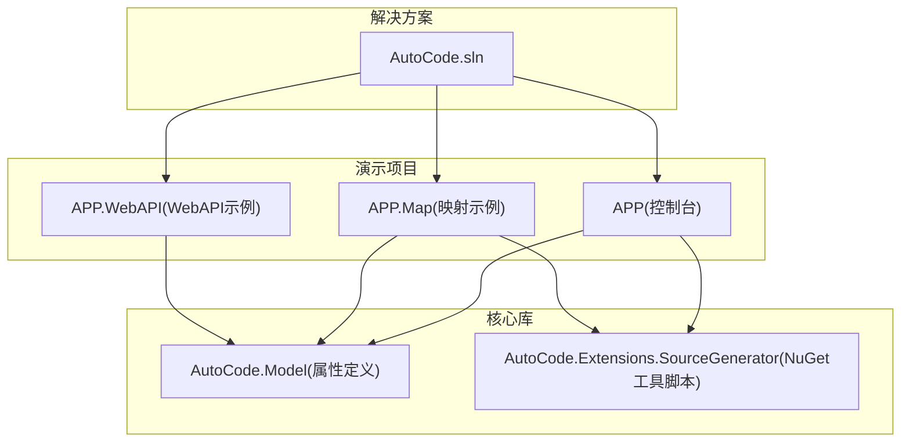
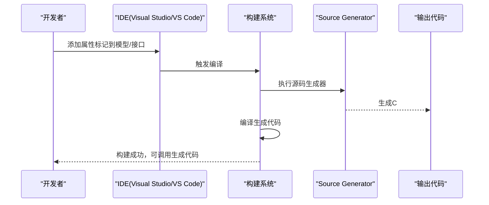
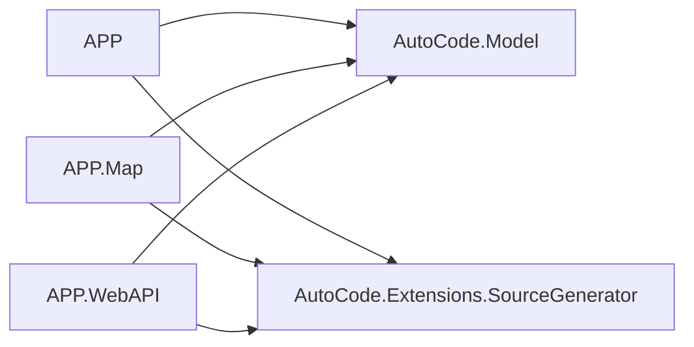

# 快速开始

<cite>
**本文引用的文件**   
- [README.md](file://README.md)
- [README.en.md](file://README.en.md)
- [AutoCode.sln](file://src/AutoCode.sln)
- [APP.csproj](file://src/APP/APP.csproj)
- [Program.cs](file://src/APP/Program.cs)
- [AutoInterface.cs](file://src/APP/AutoInterface.cs)
- [AutoInterClass.cs](file://src/APP/AutoInterClass.cs)
- [APP.Map.csproj](file://src/APP.Map/APP.Map.csproj)
- [UserInfo.cs](file://src/APP.Map/UserInfo.cs)
- [MapperAttribute.cs](file://src/AutoCode.Model/AutoMapperModel/MapperAttribute.cs)
- [MapPropertyAttribute.cs](file://src/AutoCode.Model/AutoMapperModel/MapPropertyAttribute.cs)
- [DotTemplateAttribute.cs](file://src/AutoCode.Model/DotFileAttribute/DotTemplateAttribute.cs)
- [AutoInterfaceAttribute.cs](file://src/AutoCode.Model/InterfaceAttribute/AutoInterfaceAttribute.cs)
- [AutoCode.SourceGenerator.Extensions.csproj](file://src/AutoCode.Extensions.SourceGenerator/NugetPackage/tools/install.ps1)
- [install.ps1](file://src/AutoCode.Extensions.SourceGenerator/NugetPackage/tools/install.ps1)
- [init.ps1](file://src/AutoCode.Extensions.SourceGenerator/NugetPackage/tools/init.ps1)
- [uninstall.ps1](file://src/AutoCode.Extensions.SourceGenerator/NugetPackage/tools/uninstall.ps1)
</cite>

## 目录
1. [简介](#简介)
2. [项目结构](#项目结构)
3. [核心组件](#核心组件)
4. [架构总览](#架构总览)
5. [详细组件分析](#详细组件分析)
6. [依赖关系分析](#依赖关系分析)
7. [性能注意事项](#性能注意事项)
8. [故障排除指南](#故障排除指南)
9. [结论](#结论)
10. [附录](#附录)

## 简介
本快速开始指南面向初次接触 AutoCode 的开发者，目标是在15分钟内完成环境准备、安装配置与第一个示例运行。AutoCode 通过 Source Generator（源码生成器）在编译期根据属性标记自动生成接口、映射代码等，减少样板代码，提升开发效率。

- 适用场景：为模型类自动生成映射、为接口自动生成实现骨架、基于模板的代码生成等。
- 核心价值：零运行时开销、编译期生成、与现有 .NET 生态无缝集成。

## 项目结构
仓库采用多项目解决方案组织，核心包含：
- APP：演示控制台应用，展示如何使用 AutoCode 生成的接口与实现。
- APP.Map：演示映射功能的简单模型与配置。
- AutoCode.Model：定义各类属性（如 MapperAttribute、MapPropertyAttribute、AutoInterfaceAttribute、DotTemplateAttribute）。
- AutoCode.Extensions.SourceGenerator：NuGet 包工具脚本（install/init/uninstall），用于初始化或卸载扩展。
- 其他：WebAPI 示例、SourceGenerator 实现、测试与模板资源等。

图表来源 
- [AutoCode.sln](file://src/AutoCode.sln)
- [APP.csproj](file://src/APP/APP.csproj)
- [APP.Map.csproj](file://src/APP.Map/APP.Map.csproj)

章节来源
- [AutoCode.sln](file://src/AutoCode.sln)
- [APP.csproj](file://src/APP/APP.csproj)
- [APP.Map.csproj](file://src/APP.Map/APP.Map.csproj)

## 核心组件
- 属性驱动的代码生成：通过特性（Attribute）标注源类型，触发编译期生成。
- 接口生成：使用 AutoInterfaceAttribute 标注接口，生成对应实现骨架。
- 映射生成：使用 MapperAttribute、MapPropertyAttribute 标注类型与成员，生成映射代码。
- 模板生成：使用 DotTemplateAttribute 结合 doT.js 模板进行代码生成。

章节来源
- [MapperAttribute.cs](file://src/AutoCode.Model/AutoMapperModel/MapperAttribute.cs)
- [MapPropertyAttribute.cs](file://src/AutoCode.Model/AutoMapperModel/MapPropertyAttribute.cs)
- [AutoInterfaceAttribute.cs](file://src/AutoCode.Model/InterfaceAttribute/AutoInterfaceAttribute.cs)
- [DotTemplateAttribute.cs](file://src/AutoCode.Model/DotFileAttribute/DotTemplateAttribute.cs)

## 架构总览
AutoCode 的工作流分为“标注 → 解析 → 生成 → 集成”四个阶段：
- 标注：在模型或接口上添加属性标记。
- 解析：Source Generator 在编译时扫描并解析属性。
- 生成：根据属性与模板生成 C# 代码文件。
- 集成：生成的代码直接参与后续编译与运行。

[此图为概念流程图，不绑定具体文件]

## 详细组件分析

### 环境要求
- .NET 版本：建议使用 .NET 6 或更高版本（与当前解决方案中的项目目标一致）。
- IDE：Visual Studio 2022 或 VS Code（需安装 C# 扩展）。
- 包管理：NuGet（可通过 Visual Studio 包管理器或命令行安装）。

章节来源
- [APP.csproj](file://src/APP/APP.csproj)
- [APP.Map.csproj](file://src/APP.Map/APP.Map.csproj)

### 安装步骤
- 方式一：通过 NuGet 安装 AutoCode 相关包（参考仓库中提供的 install 脚本）。
- 方式二：将 AutoCode.Extensions.SourceGenerator 作为项目引用或 NuGet 包引入。
- 初始化：运行 init.ps1 以初始化工具链；如需移除，运行 uninstall.ps1。

章节来源
- [install.ps1](file://src/AutoCode.Extensions.SourceGenerator/NugetPackage/tools/install.ps1)
- [init.ps1](file://src/AutoCode.Extensions.SourceGenerator/NugetPackage/tools/init.ps1)
- [uninstall.ps1](file://src/AutoCode.Extensions.SourceGenerator/NugetPackage/tools/uninstall.ps1)
- [AutoCode.SourceGenerator.Extensions.csproj](file://src/AutoCode.Extensions.SourceGenerator/NugetPackage/tools/install.ps1)

### 基本使用示例（从零开始）
- 新建一个 .NET 控制台项目（或使用现有 APP 项目）。
- 添加 AutoCode 相关 NuGet 包或引用。
- 在模型或接口上添加属性标记（如 MapperAttribute、AutoInterfaceAttribute）。
- 编译项目，查看生成代码（可在“显示所有文件”中查看生成结果）。
- 在 Program.cs 中调用生成的接口或映射方法。

章节来源
- [Program.cs](file://src/APP/Program.cs)
- [AutoInterface.cs](file://src/APP/AutoInterface.cs)
- [AutoInterClass.cs](file://src/APP/AutoInterClass.cs)
- [UserInfo.cs](file://src/APP.Map/UserInfo.cs)

### 添加第一个属性与生成代码
- 在模型类上使用 MapperAttribute 指定映射目标。
- 对需要映射的成员使用 MapPropertyAttribute 进行字段映射。
- 在接口上使用 AutoInterfaceAttribute 生成实现骨架。
- 编译后，检查生成代码是否按预期创建。

章节来源
- [MapperAttribute.cs](file://src/AutoCode.Model/AutoMapperModel/MapperAttribute.cs)
- [MapPropertyAttribute.cs](file://src/AutoCode.Model/AutoMapperModel/MapPropertyAttribute.cs)
- [AutoInterfaceAttribute.cs](file://src/AutoCode.Model/InterfaceAttribute/AutoInterfaceAttribute.cs)

### 集成生成的代码
- 在业务层直接调用生成的接口方法或映射函数。
- 确保生成代码所在命名空间已正确引入。
- 若出现未找到符号错误，请确认生成器已启用且编译成功。

章节来源
- [Program.cs](file://src/APP/Program.cs)
- [AutoInterface.cs](file://src/APP/AutoInterface.cs)
- [AutoInterClass.cs](file://src/APP/AutoInterClass.cs)

### 常见配置选项
- 映射策略：枚举转换、忽略废弃成员、必需映射策略等。
- 名称映射策略：属性名匹配规则（如大小写、前缀后缀处理）。
- 可见性控制：生成成员的访问修饰符（public/internal 等）。
- 模板变量：自定义 doT.js 模板中的变量与逻辑。

章节来源
- [EnumMappingStrategy.cs](file://src/AutoCode.Model/AutoMapperModel/EnumMappingStrategy.cs)
- [IgnoreObsoleteMembersStrategy.cs](file://src/AutoCode.Model/AutoMapperModel/IgnoreObsoleteMembersStrategy.cs)
- [RequiredMappingStrategy.cs](file://src/AutoCode.Model/AutoMapperModel/RequiredMappingStrategy.cs)
- [PropertyNameMappingStrategy.cs](file://src/AutoCode.Model/AutoMapperModel/PropertyNameMappingStrategy.cs)
- [MemberVisibility.cs](file://src/AutoCode.Model/AutoMapperModel/MemberVisibility.cs)
- [FormatProviderAttribute.cs](file://src/AutoCode.Model/AutoMapperModel/FormatProviderAttribute.cs)
- [MappingConversionType.cs](file://src/AutoCode.Model/AutoMapperModel/MappingConversionType.cs)

### 故障排除提示
- 生成器未生效：确认已安装并启用 Source Generator；清理并重新构建。
- 找不到符号：检查命名空间导入与生成代码是否成功。
- 模板渲染失败：验证模板语法与变量是否正确。
- 权限问题：Windows 下执行 PowerShell 脚本可能被阻止，需在安全设置中允许执行。

章节来源
- [install.ps1](file://src/AutoCode.Extensions.SourceGenerator/NugetPackage/tools/install.ps1)
- [init.ps1](file://src/AutoCode.Extensions.SourceGenerator/NugetPackage/tools/init.ps1)
- [uninstall.ps1](file://src/AutoCode.Extensions.SourceGenerator/NugetPackage/tools/uninstall.ps1)

## 依赖关系分析
- APP 与 APP.Map 依赖 AutoCode.Model（属性定义）。
- Source Generator 在编译时扫描属性并生成代码，不引入运行时依赖。
- WebAPI 示例同样依赖 AutoCode.Model，便于在 API 层使用生成代码。

图表来源 
- [APP.csproj](file://src/APP/APP.csproj)
- [APP.Map.csproj](file://src/APP.Map/APP.Map.csproj)

章节来源
- [APP.csproj](file://src/APP/APP.csproj)
- [APP.Map.csproj](file://src/APP.Map/APP.Map.csproj)

## 性能注意事项
- 生成器在编译期运行，不会增加运行时开销。
- 大型项目中建议增量构建以减少生成时间。
- 避免在热点路径频繁反射或动态加载，优先使用生成代码。

[本节为通用指导，不绑定具体文件]

## 故障排除指南
- 构建失败：检查 .NET SDK 版本与项目目标框架一致性。
- 生成器报错：查看诊断信息（IDE 输出窗口），定位属性使用错误。
- 脚本执行被阻止：在 PowerShell 中设置执行策略为 RemoteSigned 或 Bypass。
- 模板变量缺失：确保模板所需变量已在生成器上下文中提供。

章节来源
- [install.ps1](file://src/AutoCode.Extensions.SourceGenerator/NugetPackage/tools/install.ps1)
- [init.ps1](file://src/AutoCode.Extensions.SourceGenerator/NugetPackage/tools/init.ps1)
- [uninstall.ps1](file://src/AutoCode.Extensions.SourceGenerator/NugetPackage/tools/uninstall.ps1)

## 结论
通过本快速开始，你应已完成环境准备、安装配置与第一个示例运行。AutoCode 通过属性驱动的源码生成显著减少样板代码，提高开发效率。建议在复杂场景中结合模板与映射策略，进一步定制生成行为。

[本节为总结，不绑定具体文件]

## 附录
- 官方文档与示例：参考 README 与仓库内示例项目。
- 社区与支持：遇到问题可查看诊断信息与脚本日志。

章节来源
- [README.md](file://README.md)
- [README.en.md](file://README.en.md)