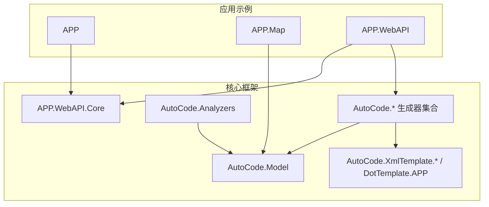
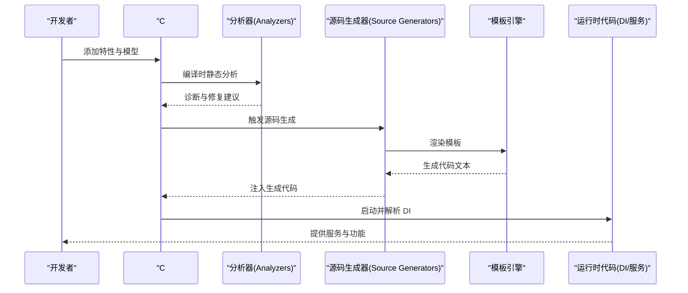
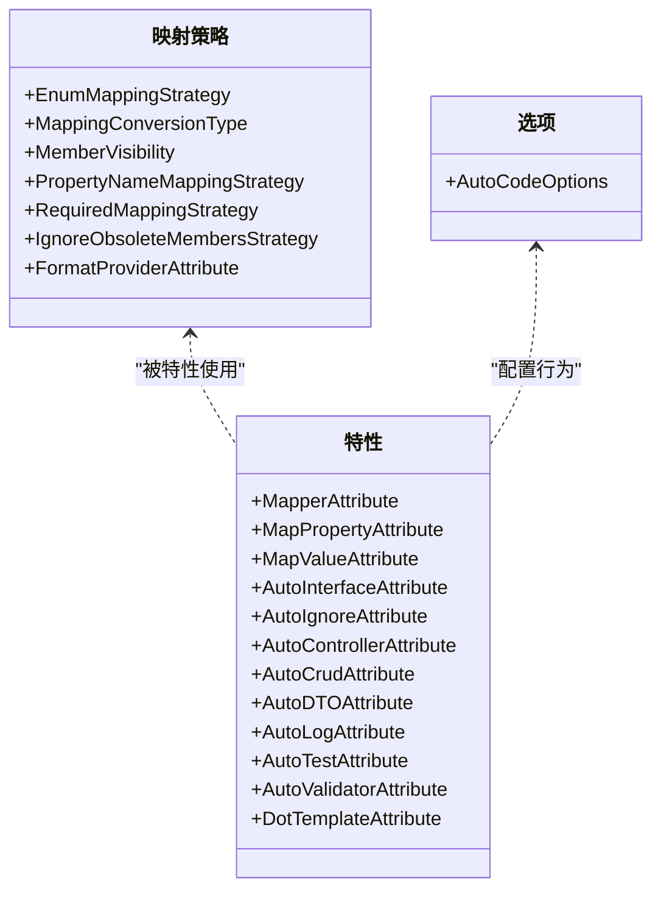
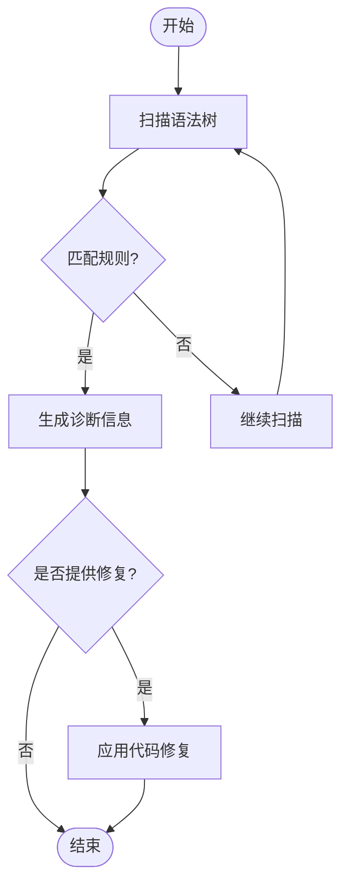
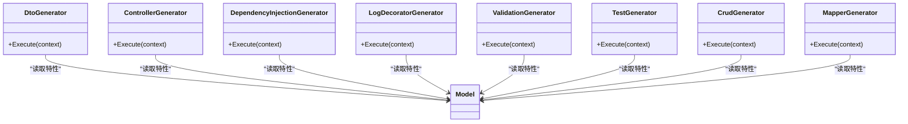
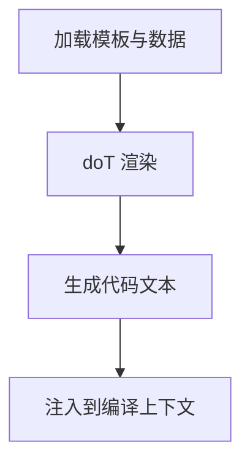
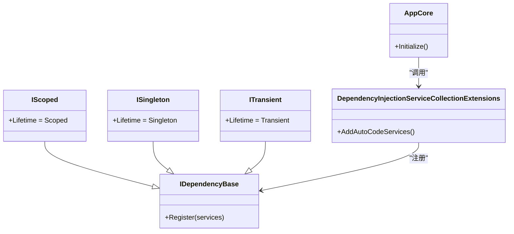
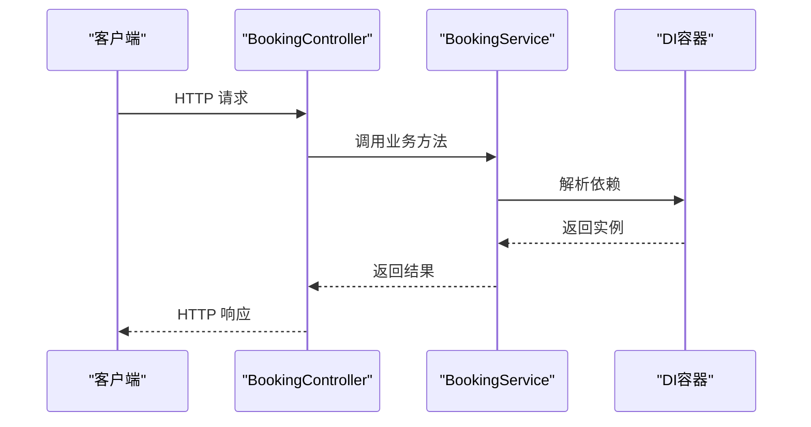
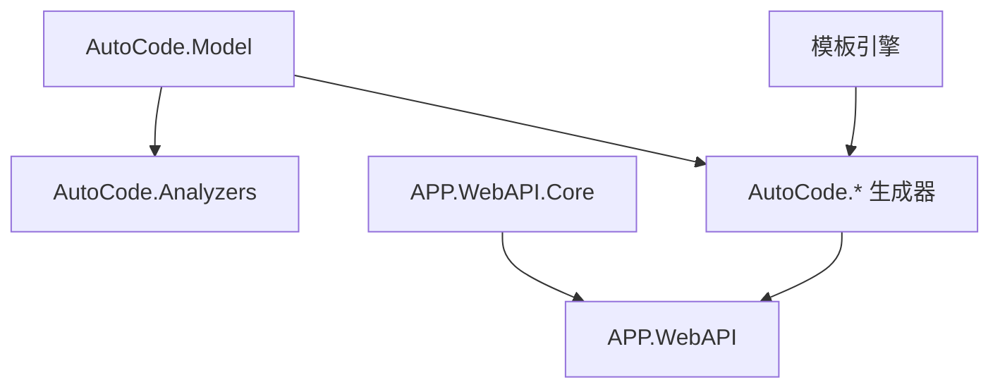

# 示例实现和文档

<cite>
**本文档引用的文件**   
- [README.md](file://README.md)
- [AutoCode.sln](file://src/AutoCode.sln)
- [Program.cs](file://src/APP/Program.cs)
- [AnalyzerDemo.cs](file://src/APP/AnalyzerDemo.cs)
- [AutoInterface.cs](file://src/APP/AutoInterface.cs)
- [UserInfo.cs](file://src/APP.Map/Program.cs)
- [WeatherForecast.cs](file://src/APP.WebAPI/WeatherForecast.cs)
- [Program.cs](file://src/APP.WebAPI/Program.cs)
- [BookingController.cs](file://src/APP.WebAPI/Controllers/BookingController.cs)
- [UserService.cs](file://src/APP.WebAPI/Services/UserService.cs)
- [BookingService.cs](file://src/APP.WebAPI/Services/BookingService.cs)
- [Requests.cs](file://src/APP.WebAPI/Models/Requests.cs)
- [UserDto.cs](file://src/APP.WebAPI/Models/UserDto.cs)
- [UserEntity.cs](file://src/APP.WebAPI/Models/UserEntity.cs)
- [AppCore.cs](file://src/APP.WebAPI.Core/Application/AppCore.cs)
- [ServiceCollectionExtensions.cs](file://src/APP.WebAPI.Core/Application/Extensions/ServiceCollectionExtensions.cs)
- [DependencyInjectionServiceCollectionExtensions.cs](file://src/APP.WebAPI.Core/DependencyInjection/DependencyInjectionServiceCollectionExtensions.cs)
- [IDependencyBase.cs](file://src/APP.WebAPI.Core/DependencyInjection/LifeType/IDependencyBase.cs)
- [IScoped.cs](file://src/APP.WebAPI.Core/DependencyInjection/LifeType/IScoped.cs)
- [ISingleton.cs](file://src/APP.WebAPI.Core/DependencyInjection/LifeType/ISingleton.cs)
- [ITransient.cs](file://src/APP.WebAPI.Core/DependencyInjection/LifeType/ITransient.cs)
- [Behavior.cs](file://src/Auto.MapModels/Behavior.cs)
- [InterfaceDivergenceAnalyzer.cs](file://src/AutoCode.Analyzers/Analyzers/InterfaceDivergenceAnalyzer.cs)
- [LayerViolationAnalyzer.cs](file://src/AutoCode.Analyzers/Analyzers/LayerViolationAnalyzer.cs)
- [MissingAutoInterfaceAnalyzer.cs](file://src/AutoCode.Analyzers/Analyzers/MissingAutoInterfaceAnalyzer.cs)
- [NamingConventionAnalyzer.cs](file://src/AutoCode.Analyzers/Analyzers/NamingConventionAnalyzer.cs)
- [UnusedAutoIgnoreAnalyzer.cs](file://src/AutoCode.Analyzers/Analyzers/UnusedAutoIgnoreAnalyzer.cs)
- [AddAutoInterfaceCodeFix.cs](file://src/AutoCode.Analyzers/CodeFixes/AddAutoInterfaceCodeFix.cs)
- [RemoveAutoIgnoreCodeFix.cs](file://src/AutoCode.Analyzers/CodeFixes/RemoveAutoIgnoreCodeFix.cs)
- [AutoCodeDiagnosticDescriptors.cs](file://src/AutoCode.Analyzers/Diagnostics/AutoCodeDiagnosticDescriptors.cs)
- [CrudGenerator.cs](file://src/AutoCode.Crud/CrudGenerator.cs)
- [DependencyInjectionGenerator.cs](file://src/AutoCode.DependencyInjection/DependencyInjectionGenerator.cs)
- [DtoGenerator.cs](file://src/AutoCode.Dto/DtoGenerator.cs)
- [LogDecoratorGenerator.cs](file://src/AutoCode.Logging/LogDecoratorGenerator.cs)
- [MapperGenerator.cs](file://src/AutoCode.Map/MapperGenerator.cs)
- [AutoMapGenerator.cs](file://src/AutoCode.MapDebug/AutoMapGenerator.cs)
- [GenerateMapping.cs](file://src/AutoCode.MapDebug/GenerateMapping.cs)
- [EnumMappingStrategy.cs](file://src/AutoCode.Model/AutoMapperModel/EnumMappingStrategy.cs)
- [FormatProviderAttribute.cs](file://src/AutoCode.Model/AutoMapperModel/FormatProviderAttribute.cs)
- [IgnoreObsoleteMembersStrategy.cs](file://src/AutoCode.Model/AutoMapperModel/IgnoreObsoleteMembersStrategy.cs)
- [MapPropertyAttribute.cs](file://src/AutoCode.Model/AutoMapperModel/MapPropertyAttribute.cs)
- [MapValueAttribute.cs](file://src/AutoCode.Model/AutoMapperModel/MapValueAttribute.cs)
- [MapperAttribute.cs](file://src/AutoCode.Model/AutoMapperModel/MapperAttribute.cs)
- [MappingConversionType.cs](file://src/AutoCode.Model/AutoMapperModel/MappingConversionType.cs)
- [MemberVisibility.cs](file://src/AutoCode.Model/AutoMapperModel/MemberVisibility.cs)
- [PropertyNameMappingStrategy.cs](file://src/AutoCode.Model/AutoMapperModel/PropertyNameMappingStrategy.cs)
- [RequiredMappingStrategy.cs](file://src/AutoCode.Model/AutoMapperModel/RequiredMappingStrategy.cs)
- [DotTemplateAttribute.cs](file://src/AutoCode.Model/DotFileAttribute/DotTemplateAttribute.cs)
- [AutoIgnoreAttribute.cs](file://src/AutoCode.Model/InterfaceAttribute/AutoIgnoreAttribute.cs)
- [AutoInterfaceAttribute.cs](file://src/AutoCode.Model/InterfaceAttribute/AutoInterfaceAttribute.cs)
- [AutoCodeOptions.cs](file://src/AutoCode.Model/AutoCodeOptions.cs)
- [AutoControllerAttribute.cs](file://src/AutoCode.Model/AutoControllerAttribute.cs)
- [AutoCrudAttribute.cs](file://src/AutoCode.Model/AutoCrudAttribute.cs)
- [AutoDTOAttribute.cs](file://src/AutoCode.Model/AutoDTOAttribute.cs)
- [AutoLogAttribute.cs](file://src/AutoCode.Model/AutoLogAttribute.cs)
- [AutoTestAttribute.cs](file://src/AutoCode.Model/AutoTestAttribute.cs)
- [AutoValidatorAttribute.cs](file://src/AutoCode.Model/AutoValidatorAttribute.cs)
- [TestGenerator.cs](file://src/AutoCode.Testing/TestGenerator.cs)
- [ValidationGenerator.cs](file://src/AutoCode.Validation/ValidationGenerator.cs)
- [ControllerGenerator.cs](file://src/AutoCode.WebApi/ControllerGenerator.cs)
- [CSData.cs](file://src/AutoCode.XmlTemplate.SourceGenerator/CSData.cs)
- [DotTemplateGenerator.cs](file://src/AutoCode.XmlTemplate.SourceGenerator/DotTemplateGenerator.cs)
- [SyntaxNodeConvert.cs](file://src/AutoCode.XmlTemplate.SourceGenerator/SyntaxNodeConvert.cs)
- [InterfaceBuilder.cs](file://src/AutoCodeGenerator/InterfaceAutoBuilder/InterfaceBuilder.cs)
- [InterfaceGenerator.cs](file://src/AutoCodeGenerator/InterfaceAutoBuilder/InterfaceGenerator.cs)
- [InterfaceSpec.cs](file://src/AutoCodeGenerator/InterfaceAutoBuilder/InterfaceSpec.cs)
- [AutoTemplate.cs](file://src/DotTemplate.APP/AutoTemplate.cs)
- [DotTemplate.cs](file://src/DotTemplate.APP/DotTemplate.cs)
- [IAutoTemplate.cs](file://src/DotTemplate.APP/IAutoTemplate.cs)
</cite>

## 目录
1. [简介](#简介)
2. [项目结构](#项目结构)
3. [核心组件](#核心组件)
4. [架构总览](#架构总览)
5. [详细组件分析](#详细组件分析)
6. [依赖关系分析](#依赖关系分析)
7. [性能考虑](#性能考虑)
8. [故障排查指南](#故障排查指南)
9. [结论](#结论)
10. [附录](#附录)

## 简介
本仓库是一个面向 .NET 的“代码生成与分析”平台，围绕 Source Generator、Roslyn Analyzers、模板引擎与依赖注入扩展等能力，提供从接口自动生成、DTO/CRUD/控制器/日志装饰器/验证器/测试用例生成，到映射（Mapper）与诊断规则的一体化解决方案。通过属性标记与约定驱动，开发者可以在编译期自动产出大量样板代码，提升一致性与可维护性。

## 项目结构
整体采用多项目分层组织：
- 应用层示例：APP、APP.Map、APP.WebAPI
- 核心框架与扩展：APP.WebAPI.Core、AutoCode.* 系列库（模型、分析器、生成器、模板、WebApi、DI、日志、校验、测试等）
- 模板与外部工具：AutoCode.XmlTemplate.*、DotTemplate.APP
- 工程与配置：AutoCode.sln、工作流、编辑器配置

图表来源
- [AutoCode.sln](file://src/AutoCode.sln)
- [Program.cs](file://src/APP.WebAPI/Program.cs)
- [AppCore.cs](file://src/APP.WebAPI.Core/Application/AppCore.cs)

章节来源
- [AutoCode.sln](file://src/AutoCode.sln)

## 核心组件
- 模型与属性定义：AutoCode.Model 集中定义了用于驱动代码生成的各类特性与策略枚举，如 Mapper、AutoInterface、AutoDTO、AutoController、AutoLog、AutoValidator、AutoTest、AutoCrud 等。
- 分析器与诊断：AutoCode.Analyzers 提供命名规范、层违规、接口分歧、缺失 AutoInterface、未使用的 AutoIgnore 等诊断与修复。
- 代码生成器：AutoCode.* 系列包含 DtoGenerator、ControllerGenerator、DependencyInjectionGenerator、LogDecoratorGenerator、ValidationGenerator、TestGenerator、CrudGenerator、MapperGenerator 等。
- 模板系统：AutoCode.XmlTemplate.SourceGenerator 与 DotTemplate.APP 提供 doT.js 驱动的模板渲染能力。
- WebAPI 集成：APP.WebAPI.Core 提供 DI 生命周期接口与扩展；APP.WebAPI 为示例 API 服务。

章节来源
- [AutoCode.Model.csproj](file://src/AutoCode.Model/AutoCode.Model.csproj)
- [AutoCode.Analyzers.csproj](file://src/AutoCode.Analyzers/AutoCode.Analyzers.csproj)
- [AutoCode.DependencyInjection.csproj](file://src/AutoCode.DependencyInjection/AutoCode.DependencyInjection.csproj)
- [AutoCode.Dto.csproj](file://src/AutoCode.Dto/AutoCode.Dto.csproj)
- [AutoCode.WebApi.csproj](file://src/AutoCode.WebApi/AutoCode.WebApi.csproj)
- [AutoCode.Logging.csproj](file://src/AutoCode.Logging/AutoCode.Logging.csproj)
- [AutoCode.Validation.csproj](file://src/AutoCode.Validation/AutoCode.Validation.csproj)
- [AutoCode.Testing.csproj](file://src/AutoCode.Testing/AutoCode.Testing.csproj)
- [AutoCode.Crud.csproj](file://src/AutoCode.Crud/AutoCode.Crud.csproj)
- [AutoCode.Map.csproj](file://src/AutoCode.Map/AutoCode.Map.csproj)
- [AutoCode.DotTemplate.SourceGenerator.csproj](file://src/AutoCode.XmlTemplate.SourceGenerator/AutoCode.DotTemplate.SourceGenerator.csproj)
- [AutoTemplate.cs](file://src/DotTemplate.APP/AutoTemplate.cs)
- [DotTemplate.cs](file://src/DotTemplate.APP/DotTemplate.cs)

## 架构总览
系统以“属性 + 约定”驱动 Roslyn 分析与源码生成，结合模板引擎输出目标代码，并通过 DI 扩展在运行时装配。

图表来源
- [InterfaceGenerator.cs](file://src/AutoCodeGenerator/InterfaceAutoBuilder/InterfaceGenerator.cs)
- [MapperGenerator.cs](file://src/AutoCode.Map/MapperGenerator.cs)
- [DependencyInjectionServiceCollectionExtensions.cs](file://src/APP.WebAPI.Core/DependencyInjection/DependencyInjectionServiceCollectionExtensions.cs)

## 详细组件分析

### 模型与特性体系（AutoCode.Model）
- 作用：集中定义所有驱动生成与分析的特性与策略，确保各生成器与分析器共享一致的元数据契约。
- 关键内容：
  - 映射相关：MapperAttribute、MapPropertyAttribute、MapValueAttribute、EnumMappingStrategy、MappingConversionType、MemberVisibility、PropertyNameMappingStrategy、RequiredMappingStrategy、IgnoreObsoleteMembersStrategy、FormatProviderAttribute
  - 接口与忽略：AutoInterfaceAttribute、AutoIgnoreAttribute、DotTemplateAttribute
  - 通用特性：AutoControllerAttribute、AutoCrudAttribute、AutoDTOAttribute、AutoLogAttribute、AutoTestAttribute、AutoValidatorAttribute
  - 选项：AutoCodeOptions

图表来源
- [EnumMappingStrategy.cs](file://src/AutoCode.Model/AutoMapperModel/EnumMappingStrategy.cs)
- [MapPropertyAttribute.cs](file://src/AutoCode.Model/AutoMapperModel/MapPropertyAttribute.cs)
- [MapperAttribute.cs](file://src/AutoCode.Model/AutoMapperModel/MapperAttribute.cs)
- [AutoInterfaceAttribute.cs](file://src/AutoCode.Model/InterfaceAttribute/AutoInterfaceAttribute.cs)
- [AutoIgnoreAttribute.cs](file://src/AutoCode.Model/InterfaceAttribute/AutoIgnoreAttribute.cs)
- [AutoCodeOptions.cs](file://src/AutoCode.Model/AutoCodeOptions.cs)

章节来源
- [AutoCode.Model.csproj](file://src/AutoCode.Model/AutoCode.Model.csproj)

### 分析器与诊断（AutoCode.Analyzers）
- 作用：在编译期对代码进行静态检查，发现命名不规范、层间违规、接口定义分歧、缺失 AutoInterface、未使用的 AutoIgnore 等问题，并提供快速修复。
- 关键分析器：
  - InterfaceDivergenceAnalyzer：检测接口与实现之间的分歧
  - LayerViolationAnalyzer：检测跨层调用违规
  - MissingAutoInterfaceAnalyzer：检测应标注 AutoInterface 的类型
  - NamingConventionAnalyzer：命名规范检查
  - UnusedAutoIgnoreAnalyzer：检测未使用的 AutoIgnore
- 代码修复：AddAutoInterfaceCodeFix、RemoveAutoIgnoreCodeFix
- 诊断描述：AutoCodeDiagnosticDescriptors

图表来源
- [InterfaceDivergenceAnalyzer.cs](file://src/AutoCode.Analyzers/Analyzers/InterfaceDivergenceAnalyzer.cs)
- [LayerViolationAnalyzer.cs](file://src/AutoCode.Analyzers/Analyzers/LayerViolationAnalyzer.cs)
- [MissingAutoInterfaceAnalyzer.cs](file://src/AutoCode.Analyzers/Analyzers/MissingAutoInterfaceAnalyzer.cs)
- [NamingConventionAnalyzer.cs](file://src/AutoCode.Analyzers/Analyzers/NamingConventionAnalyzer.cs)
- [UnusedAutoIgnoreAnalyzer.cs](file://src/AutoCode.Analyzers/Analyzers/UnusedAutoIgnoreAnalyzer.cs)
- [AddAutoInterfaceCodeFix.cs](file://src/AutoCode.Analyzers/CodeFixes/AddAutoInterfaceCodeFix.cs)
- [RemoveAutoIgnoreCodeFix.cs](file://src/AutoCode.Analyzers/CodeFixes/RemoveAutoIgnoreCodeFix.cs)
- [AutoCodeDiagnosticDescriptors.cs](file://src/AutoCode.Analyzers/Diagnostics/AutoCodeDiagnosticDescriptors.cs)

章节来源
- [AutoCode.Analyzers.csproj](file://src/AutoCode.Analyzers/AutoCode.Analyzers.csproj)

### 源码生成器（AutoCode.* 系列）
- DtoGenerator：根据 DTO 特性生成数据传输对象
- ControllerGenerator：根据控制器特性生成 WebAPI 控制器骨架
- DependencyInjectionGenerator：根据生命周期接口生成 DI 注册逻辑
- LogDecoratorGenerator：生成日志装饰器
- ValidationGenerator：生成验证器
- TestGenerator：生成单元测试骨架
- CrudGenerator：生成 CRUD 操作
- MapperGenerator：基于映射特性与策略生成映射代码

图表来源
- [DtoGenerator.cs](file://src/AutoCode.Dto/DtoGenerator.cs)
- [ControllerGenerator.cs](file://src/AutoCode.WebApi/ControllerGenerator.cs)
- [DependencyInjectionGenerator.cs](file://src/AutoCode.DependencyInjection/DependencyInjectionGenerator.cs)
- [LogDecoratorGenerator.cs](file://src/AutoCode.Logging/LogDecoratorGenerator.cs)
- [ValidationGenerator.cs](file://src/AutoCode.Validation/ValidationGenerator.cs)
- [TestGenerator.cs](file://src/AutoCode.Testing/TestGenerator.cs)
- [CrudGenerator.cs](file://src/AutoCode.Crud/CrudGenerator.cs)
- [MapperGenerator.cs](file://src/AutoCode.Map/MapperGenerator.cs)

章节来源
- [AutoCode.Dto.csproj](file://src/AutoCode.Dto/AutoCode.Dto.csproj)
- [AutoCode.WebApi.csproj](file://src/AutoCode.WebApi/AutoCode.WebApi.csproj)
- [AutoCode.DependencyInjection.csproj](file://src/AutoCode.DependencyInjection/AutoCode.DependencyInjection.csproj)
- [AutoCode.Logging.csproj](file://src/AutoCode.Logging/AutoCode.Logging.csproj)
- [AutoCode.Validation.csproj](file://src/AutoCode.Validation/AutoCode.Validation.csproj)
- [AutoCode.Testing.csproj](file://src/AutoCode.Testing/AutoCode.Testing.csproj)
- [AutoCode.Crud.csproj](file://src/AutoCode.Crud/AutoCode.Crud.csproj)
- [AutoCode.Map.csproj](file://src/AutoCode.Map/AutoCode.Map.csproj)

### 模板引擎（AutoCode.XmlTemplate.SourceGenerator 与 DotTemplate.APP）
- 作用：基于 doT.js 模板渲染生成代码，支持 JSON 配置与 C# 数据结构绑定。
- 关键组件：
  - DotTemplateGenerator：模板加载与渲染入口
  - CSData：C# 数据结构映射
  - SyntaxNodeConvert：语法节点转换辅助
  - AutoTemplate/DotTemplate：运行时模板封装

图表来源
- [DotTemplateGenerator.cs](file://src/AutoCode.XmlTemplate.SourceGenerator/DotTemplateGenerator.cs)
- [CSData.cs](file://src/AutoCode.XmlTemplate.SourceGenerator/CSData.cs)
- [SyntaxNodeConvert.cs](file://src/AutoCode.XmlTemplate.SourceGenerator/SyntaxNodeConvert.cs)
- [AutoTemplate.cs](file://src/DotTemplate.APP/AutoTemplate.cs)
- [DotTemplate.cs](file://src/DotTemplate.APP/DotTemplate.cs)

章节来源
- [AutoCode.DotTemplate.SourceGenerator.csproj](file://src/AutoCode.XmlTemplate.SourceGenerator/AutoCode.DotTemplate.SourceGenerator.csproj)
- [AutoTemplate.cs](file://src/DotTemplate.APP/AutoTemplate.cs)

### 依赖注入扩展（APP.WebAPI.Core）
- 作用：提供统一的 DI 生命周期接口与扩展方法，简化服务注册。
- 关键接口：
  - IDependencyBase：基础依赖接口
  - IScoped、ISingleton、ITransient：生命周期标识
  - DependencyInjectionServiceCollectionExtensions：扩展注册方法
  - AppCore：应用核心初始化

图表来源
- [IDependencyBase.cs](file://src/APP.WebAPI.Core/DependencyInjection/LifeType/IDependencyBase.cs)
- [IScoped.cs](file://src/APP.WebAPI.Core/DependencyInjection/LifeType/IScoped.cs)
- [ISingleton.cs](file://src/APP.WebAPI.Core/DependencyInjection/LifeType/ISingleton.cs)
- [ITransient.cs](file://src/APP.WebAPI.Core/DependencyInjection/LifeType/ITransient.cs)
- [DependencyInjectionServiceCollectionExtensions.cs](file://src/APP.WebAPI.Core/DependencyInjection/DependencyInjectionServiceCollectionExtensions.cs)
- [AppCore.cs](file://src/APP.WebAPI.Core/Application/AppCore.cs)

章节来源
- [APP.WebAPI.Core.csproj](file://src/APP.WebAPI.Core/APP.WebAPI.Core.csproj)

### WebAPI 示例（APP.WebAPI）
- 作用：展示控制器、服务、模型与 DI 的使用方式。
- 关键组件：
  - BookingController：示例控制器
  - UserService、BookingService：业务服务
  - Requests、UserDto、UserEntity：请求与数据模型
  - Program：应用入口与中间件配置

图表来源
- [BookingController.cs](file://src/APP.WebAPI/Controllers/BookingController.cs)
- [BookingService.cs](file://src/APP.WebAPI/Services/BookingService.cs)
- [UserService.cs](file://src/APP.WebAPI/Services/UserService.cs)
- [Requests.cs](file://src/APP.WebAPI/Models/Requests.cs)
- [UserDto.cs](file://src/APP.WebAPI/Models/UserDto.cs)
- [UserEntity.cs](file://src/APP.WebAPI/Models/UserEntity.cs)
- [Program.cs](file://src/APP.WebAPI/Program.cs)

章节来源
- [APP.WebAPI.csproj](file://src/APP.WebAPI/APP.WebAPI.csproj)

### 其他示例与调试
- APP：演示 Analyzer 与 AutoInterface 的使用
- APP.Map：演示映射与程序入口
- AutoCode.MapDebug：映射调试生成

章节来源
- [Program.cs](file://src/APP/Program.cs)
- [AnalyzerDemo.cs](file://src/APP/AnalyzerDemo.cs)
- [AutoInterface.cs](file://src/APP/AutoInterface.cs)
- [UserInfo.cs](file://src/APP.Map/Program.cs)
- [AutoMapGenerator.cs](file://src/AutoCode.MapDebug/AutoMapGenerator.cs)
- [GenerateMapping.cs](file://src/AutoCode.MapDebug/GenerateMapping.cs)

## 依赖关系分析
- 模块耦合：
  - 生成器与分析器均依赖 AutoCode.Model 提供的特性与策略
  - 模板引擎为生成器提供渲染能力
  - APP.WebAPI.Core 为 WebAPI 示例提供 DI 基础设施
- 外部依赖：
  - Roslyn（Source Generators、Analyzers）
  - doT.js 模板引擎
  - ASP.NET Core（WebAPI）

图表来源
- [AutoCode.Model.csproj](file://src/AutoCode.Model/AutoCode.Model.csproj)
- [AutoCode.Analyzers.csproj](file://src/AutoCode.Analyzers/AutoCode.Analyzers.csproj)
- [AutoCode.DependencyInjection.csproj](file://src/AutoCode.DependencyInjection/AutoCode.DependencyInjection.csproj)
- [AutoCode.Dto.csproj](file://src/AutoCode.Dto/AutoCode.Dto.csproj)
- [AutoCode.WebApi.csproj](file://src/AutoCode.WebApi/AutoCode.WebApi.csproj)
- [AutoCode.Logging.csproj](file://src/AutoCode.Logging/AutoCode.Logging.csproj)
- [AutoCode.Validation.csproj](file://src/AutoCode.Validation/AutoCode.Validation.csproj)
- [AutoCode.Testing.csproj](file://src/AutoCode.Testing/AutoCode.Testing.csproj)
- [AutoCode.Crud.csproj](file://src/AutoCode.Crud/AutoCode.Crud.csproj)
- [AutoCode.Map.csproj](file://src/AutoCode.Map/AutoCode.Map.csproj)
- [AutoCode.DotTemplate.SourceGenerator.csproj](file://src/AutoCode.XmlTemplate.SourceGenerator/AutoCode.DotTemplate.SourceGenerator.csproj)
- [APP.WebAPI.Core.csproj](file://src/APP.WebAPI.Core/APP.WebAPI.Core.csproj)
- [APP.WebAPI.csproj](file://src/APP.WebAPI/APP.WebAPI.csproj)

章节来源
- [AutoCode.sln](file://src/AutoCode.sln)

## 性能考虑
- 编译期开销：大量 Source Generator 与分析器会增加构建时间，建议按需启用或增量构建。
- 模板渲染：复杂模板可能导致生成耗时增加，建议精简模板与数据量。
- DI 注册：避免在启动时执行重型逻辑，尽量延迟初始化。
- 缓存与复用：合理复用已生成的代码片段，减少重复计算。

## 故障排查指南
- 常见诊断问题：
  - 命名不规范：查看 NamingConventionAnalyzer 的诊断信息
  - 层间违规：参考 LayerViolationAnalyzer 的建议
  - 接口分歧：依据 InterfaceDivergenceAnalyzer 修正
  - 缺失 AutoInterface：使用 AddAutoInterfaceCodeFix 快速修复
  - 未使用的 AutoIgnore：使用 RemoveAutoIgnoreCodeFix 清理
- 生成失败：
  - 检查特性是否正确标注
  - 确认模板数据与语法节点转换无误
  - 查看生成器日志与错误输出
- 运行时报错：
  - 检查 DI 生命周期与注册顺序
  - 确认服务依赖可用且非空引用

章节来源
- [AutoCodeDiagnosticDescriptors.cs](file://src/AutoCode.Analyzers/Diagnostics/AutoCodeDiagnosticDescriptors.cs)
- [AddAutoInterfaceCodeFix.cs](file://src/AutoCode.Analyzers/CodeFixes/AddAutoInterfaceCodeFix.cs)
- [RemoveAutoIgnoreCodeFix.cs](file://src/AutoCode.Analyzers/CodeFixes/RemoveAutoIgnoreCodeFix.cs)

## 结论
本项目通过特性驱动与 Roslyn 技术栈，实现了从分析到生成的一体化代码开发体验。借助模板引擎与 DI 扩展，开发者可以高效地构建一致、可维护的 .NET 应用。建议在大型项目中谨慎启用生成器与分析器，并结合 CI 流程保障质量。

## 附录
- 快速开始：
  - 在模型上添加相应特性（如 AutoDTO、AutoController、AutoLog 等）
  - 启用对应生成器与分析器
  - 编译后查看生成的代码与服务
- 最佳实践：
  - 保持特性与策略的一致性
  - 合理使用生命周期接口
  - 控制模板复杂度与数据规模