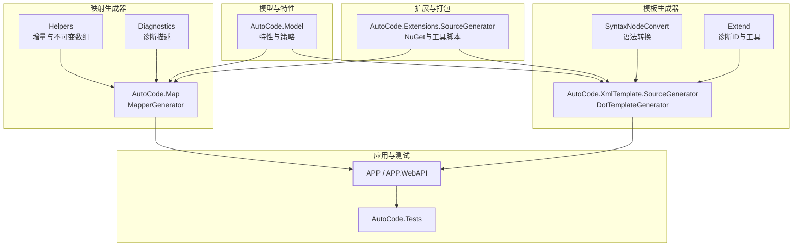
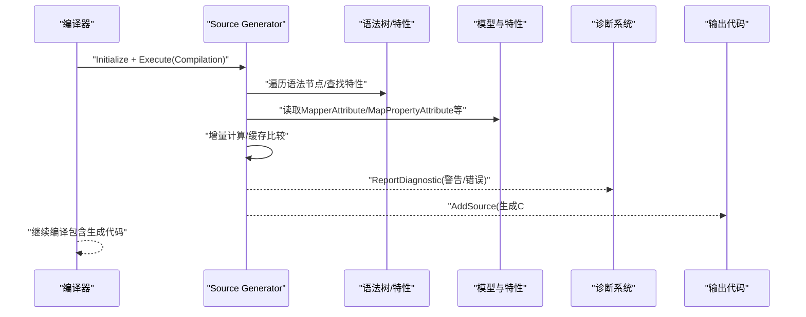
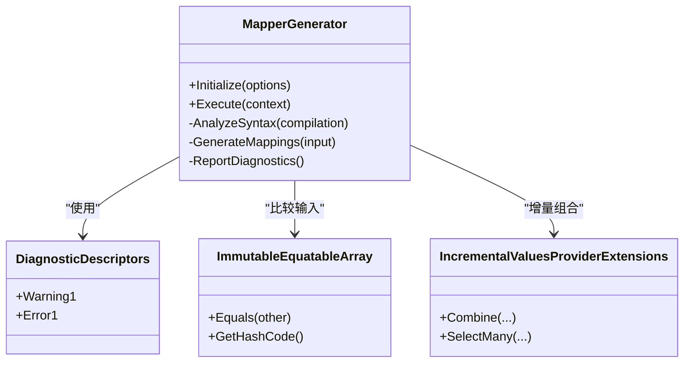
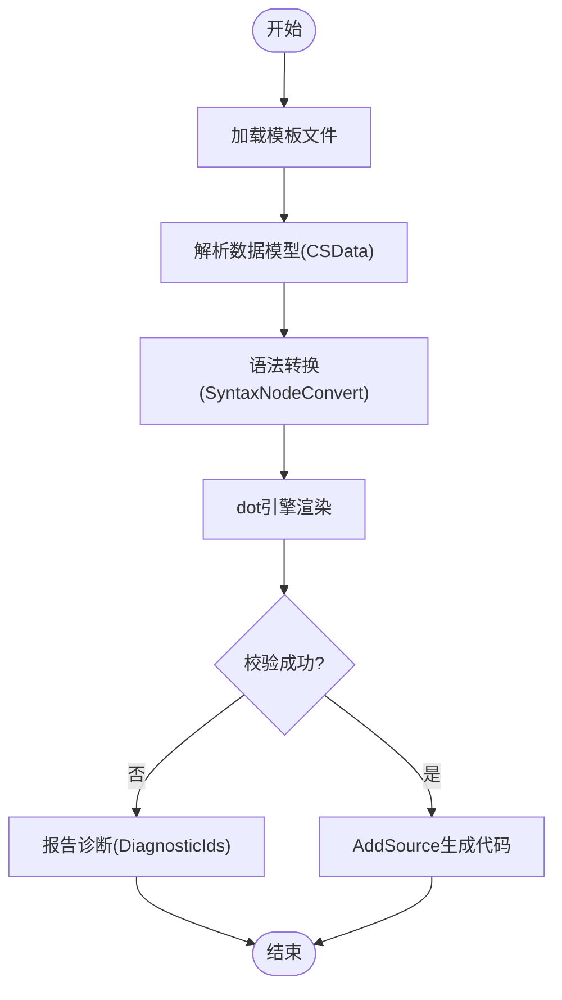
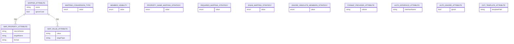
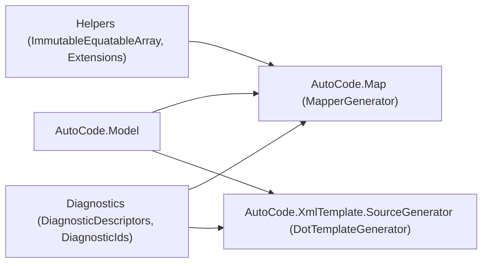

# Source Generator扩展

<cite>
**本文引用的文件**
- [AutoCode.Map.csproj](file://src/AutoCode.Map/AutoCode.Map.csproj)
- [MapperGenerator.cs](file://src/AutoCode.Map/MapperGenerator.cs)
- [DiagnosticDescriptors.cs](file://src/AutoCode.Map/Diagnostics/DiagnosticDescriptors.cs)
- [ImmutableEquatableArray.cs](file://src/AutoCode.Map/Helpers/ImmutableEquatableArray.cs)
- [IncrementalValuesProviderExtensions.cs](file://src/AutoCode.Map/Helpers/IncrementalValuesProviderExtensions.cs)
- [AutoCode.Model.csproj](file://src/AutoCode.Model/AutoCode.Model.csproj)
- [MapperAttribute.cs](file://src/AutoCode.Model/AutoMapperModel/MapperAttribute.cs)
- [MapPropertyAttribute.cs](file://src/AutoCode.Model/AutoMapperModel/MapPropertyAttribute.cs)
- [MapValueAttribute.cs](file://src/AutoCode.Model/AutoMapperModel/MapValueAttribute.cs)
- [MappingConversionType.cs](file://src/AutoCode.Model/AutoMapperModel/MappingConversionType.cs)
- [MemberVisibility.cs](file://src/AutoCode.Model/AutoMapperModel/MemberVisibility.cs)
- [PropertyNameMappingStrategy.cs](file://src/AutoCode.Model/AutoMapperModel/PropertyNameMappingStrategy.cs)
- [RequiredMappingStrategy.cs](file://src/AutoCode.Model/AutoMapperModel/RequiredMappingStrategy.cs)
- [EnumMappingStrategy.cs](file://src/AutoCode.Model/AutoMapperModel/EnumMappingStrategy.cs)
- [IgnoreObsoleteMembersStrategy.cs](file://src/AutoCode.Model/AutoMapperModel/IgnoreObsoleteMembersStrategy.cs)
- [FormatProviderAttribute.cs](file://src/AutoCode.Model/AutoMapperModel/FormatProviderAttribute.cs)
- [AutoInterfaceAttribute.cs](file://src/AutoCode.Model/InterfaceAttribute/AutoInterfaceAttribute.cs)
- [AutoIgnoreAttribute.cs](file://src/AutoCode.Model/InterfaceAttribute/AutoIgnoreAttribute.cs)
- [DotTemplateAttribute.cs](file://src/AutoCode.Model/DotFileAttribute/DotTemplateAttribute.cs)
- [AutoCode.DotTemplate.SourceGenerator.csproj](file://src/AutoCode.XmlTemplate.SourceGenerator/AutoCode.DotTemplate.SourceGenerator.csproj)
- [DotTemplateGenerator.cs](file://src/AutoCode.XmlTemplate.SourceGenerator/DotTemplateGenerator.cs)
- [SyntaxNodeConvert.cs](file://src/AutoCode.XmlTemplate.SourceGenerator/SyntaxNodeConvert.cs)
- [CSData.cs](file://src/AutoCode.XmlTemplate.SourceGenerator/CSData.cs)
- [DiagnosticIds.cs](file://src/AutoCode.XmlTemplate.SourceGenerator/Extend/DiagnosticIds.cs)
- [DotHelp.cs](file://src/AutoCode.XmlTemplate.SourceGenerator/Extend/DotHelp.cs)
- [AutoCode.SourceGenerator.Extensions.csproj](file://src/AutoCode.Extensions.SourceGenerator/AutoCode.SourceGenerator.Extensions.csproj)
- [AutoCode.sln](file://src/AutoCode.sln)
</cite>

## 目录
1. [简介](#简介)
2. [项目结构](#项目结构)
3. [核心组件](#核心组件)
4. [架构总览](#架构总览)
5. [详细组件分析](#详细组件分析)
6. [依赖关系分析](#依赖关系分析)
7. [性能考虑](#性能考虑)
8. [故障排查指南](#故障排查指南)
9. [结论](#结论)
10. [附录](#附录)

## 简介
本指南面向希望开发.NET Source Generator扩展的工程师，结合仓库中的实际实现，系统讲解Source Generators的工作原理、生命周期与执行管道；详细说明如何创建自定义生成器、处理语法树、生成代码文件与错误诊断；并提供完整的扩展开发示例：自定义分析器、代码转换器与增量生成器。同时涵盖性能优化、调试技巧以及与Visual Studio集成的最佳实践。

## 项目结构
该仓库围绕“映射生成”和“模板生成”两大能力构建，采用分层与按功能划分的组织方式：
- 模型与属性定义层（AutoCode.Model）：集中声明用于驱动生成的特性与枚举策略。
- 映射生成器（AutoCode.Map）：基于增量API的Source Generator，扫描标记了特性的类型并生成映射代码。
- 模板生成器（AutoCode.XmlTemplate.SourceGenerator）：基于dot模板的Source Generator，将模板与数据源合并为C#代码。
- 扩展与工具（AutoCode.Extensions.SourceGenerator）：打包与分发相关配置。
- 应用与测试（APP、APP.WebAPI、AutoCode.Tests等）：演示与验证生成结果。

图表来源
- [AutoCode.Map.csproj](file://src/AutoCode.Map/AutoCode.Map.csproj)
- [AutoCode.DotTemplate.SourceGenerator.csproj](file://src/AutoCode.XmlTemplate.SourceGenerator/AutoCode.DotTemplate.SourceGenerator.csproj)
- [AutoCode.sln](file://src/AutoCode.sln)

章节来源
- [AutoCode.sln](file://src/AutoCode.sln)

## 核心组件
- 映射生成器（MapperGenerator）：实现ISourceGenerator接口，使用增量API（IncrementalValuesProvider）订阅编译输入，解析带有映射特性的类型，生成映射实现。
- 模板生成器（DotTemplateGenerator）：读取模板文件与数据模型，通过dot引擎渲染生成C#代码。
- 诊断系统（DiagnosticDescriptors、DiagnosticIds）：统一描述生成过程中的警告与错误，便于IDE集成显示。
- 辅助库（ImmutableEquatableArray、IncrementalValuesProviderExtensions）：提供不可变集合与增量值扩展，提升比较与缓存效率。
- 模型与特性（AutoCode.Model）：定义MapperAttribute、MapPropertyAttribute、MapValueAttribute等，作为生成器的输入契约。

章节来源
- [MapperGenerator.cs](file://src/AutoCode.Map/MapperGenerator.cs)
- [DiagnosticDescriptors.cs](file://src/AutoCode.Map/Diagnostics/DiagnosticDescriptors.cs)
- [ImmutableEquatableArray.cs](file://src/AutoCode.Map/Helpers/ImmutableEquatableArray.cs)
- [IncrementalValuesProviderExtensions.cs](file://src/AutoCode.Map/Helpers/IncrementalValuesProviderExtensions.cs)
- [AutoCode.Model.csproj](file://src/AutoCode.Model/AutoCode.Model.csproj)
- [MapperAttribute.cs](file://src/AutoCode.Model/AutoMapperModel/MapperAttribute.cs)
- [MapPropertyAttribute.cs](file://src/AutoCode.Model/AutoMapperModel/MapPropertyAttribute.cs)
- [MapValueAttribute.cs](file://src/AutoCode.Model/AutoMapperModel/MapValueAttribute.cs)
- [MappingConversionType.cs](file://src/AutoCode.Model/AutoMapperModel/MappingConversionType.cs)
- [MemberVisibility.cs](file://src/AutoCode.Model/AutoMapperModel/MemberVisibility.cs)
- [PropertyNameMappingStrategy.cs](file://src/AutoCode.Model/AutoMapperModel/PropertyNameMappingStrategy.cs)
- [RequiredMappingStrategy.cs](file://src/AutoCode.Model/AutoMapperModel/RequiredMappingStrategy.cs)
- [EnumMappingStrategy.cs](file://src/AutoCode.Model/AutoMapperModel/EnumMappingStrategy.cs)
- [IgnoreObsoleteMembersStrategy.cs](file://src/AutoCode.Model/AutoMapperModel/IgnoreObsoleteMembersStrategy.cs)
- [FormatProviderAttribute.cs](file://src/AutoCode.Model/AutoMapperModel/FormatProviderAttribute.cs)
- [AutoInterfaceAttribute.cs](file://src/AutoCode.Model/InterfaceAttribute/AutoInterfaceAttribute.cs)
- [AutoIgnoreAttribute.cs](file://src/AutoCode.Model/InterfaceAttribute/AutoIgnoreAttribute.cs)
- [DotTemplateAttribute.cs](file://src/AutoCode.Model/DotFileAttribute/DotTemplateAttribute.cs)

## 架构总览
下图展示了Source Generator在编译时的整体交互流程：编译器调用生成器，生成器读取语法树与特性，进行增量分析与代码生成，并通过诊断API上报问题。

图表来源
- [MapperGenerator.cs](file://src/AutoCode.Map/MapperGenerator.cs)
- [DiagnosticDescriptors.cs](file://src/AutoCode.Map/Diagnostics/DiagnosticDescriptors.cs)
- [MapperAttribute.cs](file://src/AutoCode.Model/AutoMapperModel/MapperAttribute.cs)
- [MapPropertyAttribute.cs](file://src/AutoCode.Model/AutoMapperModel/MapPropertyAttribute.cs)

## 详细组件分析

### 映射生成器（MapperGenerator）
- 职责：实现ISourceGenerator，使用增量API订阅编译输入，识别带有映射特性的类型，生成映射实现。
- 关键点：
  - 增量订阅：通过IncrementalValuesProvider组合多个输入（如语法树、特性、编译选项），减少不必要的重算。
  - 语法分析：定位类/接口、成员、可见性、命名策略等。
  - 代码生成：根据策略生成映射方法或类。
  - 诊断：对不匹配或缺失的配置发出警告/错误。

图表来源
- [MapperGenerator.cs](file://src/AutoCode.Map/MapperGenerator.cs)
- [DiagnosticDescriptors.cs](file://src/AutoCode.Map/Diagnostics/DiagnosticDescriptors.cs)
- [ImmutableEquatableArray.cs](file://src/AutoCode.Map/Helpers/ImmutableEquatableArray.cs)
- [IncrementalValuesProviderExtensions.cs](file://src/AutoCode.Map/Helpers/IncrementalValuesProviderExtensions.cs)

章节来源
- [MapperGenerator.cs](file://src/AutoCode.Map/MapperGenerator.cs)
- [DiagnosticDescriptors.cs](file://src/AutoCode.Map/Diagnostics/DiagnosticDescriptors.cs)
- [ImmutableEquatableArray.cs](file://src/AutoCode.Map/Helpers/ImmutableEquatableArray.cs)
- [IncrementalValuesProviderExtensions.cs](file://src/AutoCode.Map/Helpers/IncrementalValuesProviderExtensions.cs)

### 模板生成器（DotTemplateGenerator）
- 职责：读取模板文件与数据模型，通过dot引擎渲染生成C#代码。
- 关键点：
  - 模板加载：从项目资源或外部文件加载模板。
  - 数据绑定：将CSData等数据结构注入模板上下文。
  - 语法转换：利用SyntaxNodeConvert将抽象语法转换为模板所需的数据结构。
  - 诊断：模板缺失、变量未定义等问题通过DiagnosticIds上报。

图表来源
- [DotTemplateGenerator.cs](file://src/AutoCode.XmlTemplate.SourceGenerator/DotTemplateGenerator.cs)
- [SyntaxNodeConvert.cs](file://src/AutoCode.XmlTemplate.SourceGenerator/SyntaxNodeConvert.cs)
- [CSData.cs](file://src/AutoCode.XmlTemplate.SourceGenerator/CSData.cs)
- [DiagnosticIds.cs](file://src/AutoCode.XmlTemplate.SourceGenerator/Extend/DiagnosticIds.cs)

章节来源
- [DotTemplateGenerator.cs](file://src/AutoCode.XmlTemplate.SourceGenerator/DotTemplateGenerator.cs)
- [SyntaxNodeConvert.cs](file://src/AutoCode.XmlTemplate.SourceGenerator/SyntaxNodeConvert.cs)
- [CSData.cs](file://src/AutoCode.XmlTemplate.SourceGenerator/CSData.cs)
- [DiagnosticIds.cs](file://src/AutoCode.XmlTemplate.SourceGenerator/Extend/DiagnosticIds.cs)

### 模型与特性（AutoCode.Model）
- 作用：定义驱动生成器的元数据契约，包括映射策略、属性映射、枚举策略、可见性等。
- 关键特性：
  - MapperAttribute：标记需要生成映射的类型。
  - MapPropertyAttribute：指定属性映射规则。
  - MapValueAttribute：指定常量值映射。
  - MappingConversionType、MemberVisibility、PropertyNameMappingStrategy、RequiredMappingStrategy、EnumMappingStrategy、IgnoreObsoleteMembersStrategy、FormatProviderAttribute：细化生成行为。
  - AutoInterfaceAttribute、AutoIgnoreAttribute：接口生成控制。
  - DotTemplateAttribute：模板关联。

图表来源
- [MapperAttribute.cs](file://src/AutoCode.Model/AutoMapperModel/MapperAttribute.cs)
- [MapPropertyAttribute.cs](file://src/AutoCode.Model/AutoMapperModel/MapPropertyAttribute.cs)
- [MapValueAttribute.cs](file://src/AutoCode.Model/AutoMapperModel/MapValueAttribute.cs)
- [MappingConversionType.cs](file://src/AutoCode.Model/AutoMapperModel/MappingConversionType.cs)
- [MemberVisibility.cs](file://src/AutoCode.Model/AutoMapperModel/MemberVisibility.cs)
- [PropertyNameMappingStrategy.cs](file://src/AutoCode.Model/AutoMapperModel/PropertyNameMappingStrategy.cs)
- [RequiredMappingStrategy.cs](file://src/AutoCode.Model/AutoMapperModel/RequiredMappingStrategy.cs)
- [EnumMappingStrategy.cs](file://src/AutoCode.Model/AutoMapperModel/EnumMappingStrategy.cs)
- [IgnoreObsoleteMembersStrategy.cs](file://src/AutoCode.Model/AutoMapperModel/IgnoreObsoleteMembersStrategy.cs)
- [FormatProviderAttribute.cs](file://src/AutoCode.Model/AutoMapperModel/FormatProviderAttribute.cs)
- [AutoInterfaceAttribute.cs](file://src/AutoCode.Model/InterfaceAttribute/AutoInterfaceAttribute.cs)
- [AutoIgnoreAttribute.cs](file://src/AutoCode.Model/InterfaceAttribute/AutoIgnoreAttribute.cs)
- [DotTemplateAttribute.cs](file://src/AutoCode.Model/DotFileAttribute/DotTemplateAttribute.cs)

章节来源
- [AutoCode.Model.csproj](file://src/AutoCode.Model/AutoCode.Model.csproj)
- [MapperAttribute.cs](file://src/AutoCode.Model/AutoMapperModel/MapperAttribute.cs)
- [MapPropertyAttribute.cs](file://src/AutoCode.Model/AutoMapperModel/MapPropertyAttribute.cs)
- [MapValueAttribute.cs](file://src/AutoCode.Model/AutoMapperModel/MapValueAttribute.cs)
- [MappingConversionType.cs](file://src/AutoCode.Model/AutoMapperModel/MappingConversionType.cs)
- [MemberVisibility.cs](file://src/AutoCode.Model/AutoMapperModel/MemberVisibility.cs)
- [PropertyNameMappingStrategy.cs](file://src/AutoCode.Model/AutoMapperModel/PropertyNameMappingStrategy.cs)
- [RequiredMappingStrategy.cs](file://src/AutoCode.Model/AutoMapperModel/RequiredMappingStrategy.cs)
- [EnumMappingStrategy.cs](file://src/AutoCode.Model/AutoMapperModel/EnumMappingStrategy.cs)
- [IgnoreObsoleteMembersStrategy.cs](file://src/AutoCode.Model/AutoMapperModel/IgnoreObsoleteMembersStrategy.cs)
- [FormatProviderAttribute.cs](file://src/AutoCode.Model/AutoMapperModel/FormatProviderAttribute.cs)
- [AutoInterfaceAttribute.cs](file://src/AutoCode.Model/InterfaceAttribute/AutoInterfaceAttribute.cs)
- [AutoIgnoreAttribute.cs](file://src/AutoCode.Model/InterfaceAttribute/AutoIgnoreAttribute.cs)
- [DotTemplateAttribute.cs](file://src/AutoCode.Model/DotFileAttribute/DotTemplateAttribute.cs)

### 自定义分析器与代码转换器（概念）
- 自定义分析器：实现IAnalyzer，注册诊断描述符，在语法树上查找模式并报告问题。
- 代码转换器：实现ISyntaxRewriter，重写语法节点以生成新代码片段，常用于重构或辅助生成。
- 与Source Generator协作：分析器负责静态检查，生成器负责代码产出，二者可共享诊断ID与规则。

[本节为概念说明，不直接分析具体文件]

### 增量生成器（概念）
- 增量API：通过IncrementalValuesProvider组合输入，使用ImmutableEquatableArray进行高效比较，避免重复工作。
- 典型流程：收集输入 -> 增量计算 -> 缓存比较 -> 生成代码。

[本节为概念说明，不直接分析具体文件]

## 依赖关系分析
- 生成器依赖模型特性：MapperGenerator与DotTemplateGenerator均依赖AutoCode.Model中的特性与策略。
- 诊断系统解耦：DiagnosticDescriptors与DiagnosticIds分别管理不同模块的诊断信息。
- 辅助库提升性能：ImmutableEquatableArray与IncrementalValuesProviderExtensions为增量计算提供基础。

图表来源
- [AutoCode.Model.csproj](file://src/AutoCode.Model/AutoCode.Model.csproj)
- [AutoCode.Map.csproj](file://src/AutoCode.Map/AutoCode.Map.csproj)
- [AutoCode.DotTemplate.SourceGenerator.csproj](file://src/AutoCode.XmlTemplate.SourceGenerator/AutoCode.DotTemplate.SourceGenerator.csproj)
- [ImmutableEquatableArray.cs](file://src/AutoCode.Map/Helpers/ImmutableEquatableArray.cs)
- [IncrementalValuesProviderExtensions.cs](file://src/AutoCode.Map/Helpers/IncrementalValuesProviderExtensions.cs)
- [DiagnosticDescriptors.cs](file://src/AutoCode.Map/Diagnostics/DiagnosticDescriptors.cs)
- [DiagnosticIds.cs](file://src/AutoCode.XmlTemplate.SourceGenerator/Extend/DiagnosticIds.cs)

章节来源
- [AutoCode.Map.csproj](file://src/AutoCode.Map/AutoCode.Map.csproj)
- [AutoCode.DotTemplate.SourceGenerator.csproj](file://src/AutoCode.XmlTemplate.SourceGenerator/AutoCode.DotTemplate.SourceGenerator.csproj)
- [AutoCode.Model.csproj](file://src/AutoCode.Model/AutoCode.Model.csproj)

## 性能考虑
- 使用增量API：尽可能使用IncrementalValuesProvider组合输入，减少不必要的重新分析。
- 不可变比较：使用ImmutableEquatableArray实现高效的相等性比较，避免频繁GC。
- 延迟计算：仅在必要时进行昂贵的操作（如IO、复杂解析）。
- 缓存中间结果：将分析结果缓存到增量上下文中，避免重复计算。
- 最小化输出：仅生成必要的代码，避免冗余类型与方法。

[本节提供通用指导，不直接分析具体文件]

## 故障排查指南
- 常见问题：
  - 特性未正确引用：确保目标项目引用AutoCode.Model并正确使用特性。
  - 模板路径错误：检查DotTemplateAttribute中的路径是否正确。
  - 诊断未显示：确认DiagnosticDescriptors与DiagnosticIds已正确注册。
- 调试技巧：
  - 启用Source Generator日志：在项目中设置环境变量或MSBuild属性以输出详细日志。
  - 使用VS“查看生成输出”：观察生成器执行过程与错误信息。
  - 断点调试：在生成器的Execute方法中设置断点，逐步检查输入与输出。
- 常见错误与修复：
  - 类型不匹配：检查MapPropertyAttribute与目标类型的成员是否一致。
  - 枚举映射失败：确认EnumMappingStrategy与枚举值对应关系。
  - 模板渲染异常：检查CSData结构与模板变量名是否匹配。

章节来源
- [DiagnosticDescriptors.cs](file://src/AutoCode.Map/Diagnostics/DiagnosticDescriptors.cs)
- [DiagnosticIds.cs](file://src/AutoCode.XmlTemplate.SourceGenerator/Extend/DiagnosticIds.cs)
- [DotTemplateGenerator.cs](file://src/AutoCode.XmlTemplate.SourceGenerator/DotTemplateGenerator.cs)
- [MapperGenerator.cs](file://src/AutoCode.Map/MapperGenerator.cs)

## 结论
本指南基于仓库中的实际实现，系统阐述了.NET Source Generator的开发要点：从工作原理与生命周期，到增量API的使用、语法树处理、代码生成与诊断；并结合映射生成器与模板生成器的案例，提供了完整的扩展开发示例。通过遵循性能优化与调试最佳实践，开发者可以构建高效、可维护的代码生成扩展。

## 附录
- 参考项目文件：
  - [AutoCode.sln](file://src/AutoCode.sln)
  - [AutoCode.Map.csproj](file://src/AutoCode.Map/AutoCode.Map.csproj)
  - [AutoCode.DotTemplate.SourceGenerator.csproj](file://src/AutoCode.XmlTemplate.SourceGenerator/AutoCode.DotTemplate.SourceGenerator.csproj)
  - [AutoCode.Model.csproj](file://src/AutoCode.Model/AutoCode.Model.csproj)
  - [AutoCode.SourceGenerator.Extensions.csproj](file://src/AutoCode.Extensions.SourceGenerator/AutoCode.SourceGenerator.Extensions.csproj)