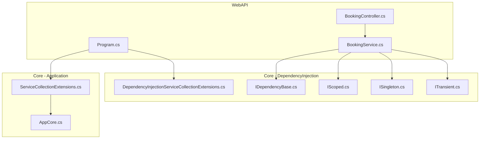
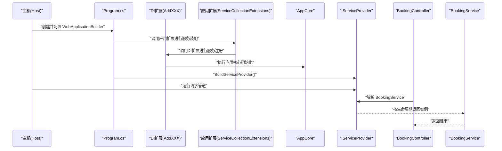
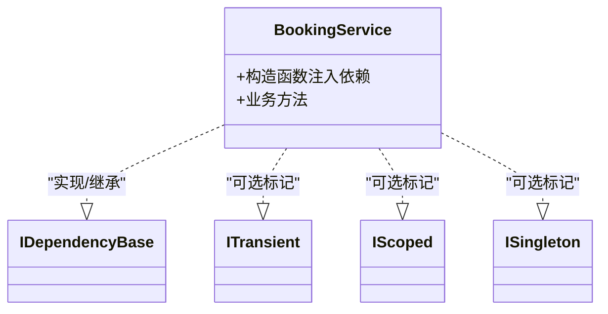
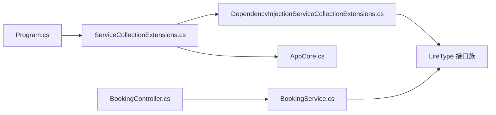

# 依赖注入扩展

<cite>
**本文引用的文件**   
- [src/APP.WebAPI.Core/DependencyInjection/DependencyInjectionServiceCollectionExtensions.cs](file://src/APP.WebAPI.Core/DependencyInjection/DependencyInjectionServiceCollectionExtensions.cs)
- [src/APP.WebAPI.Core/DependencyInjection/LifeType/IDependencyBase.cs](file://src/APP.WebAPI.Core/DependencyInjection/LifeType/IDependencyBase.cs)
- [src/APP.WebAPI.Core/DependencyInjection/LifeType/IScoped.cs](file://src/APP.WebAPI.Core/DependencyInjection/LifeType/IScoped.cs)
- [src/APP.WebAPI.Core/DependencyInjection/LifeType/ISingleton.cs](file://src/APP.WebAPI.Core/DependencyInjection/LifeType/ISingleton.cs)
- [src/APP.WebAPI.Core/DependencyInjection/LifeType/ITransient.cs](file://src/APP.WebAPI.Core/DependencyInjection/LifeType/ITransient.cs)
- [src/APP.WebAPI.Core/Application/Extensions/ServiceCollectionExtensions.cs](file://src/APP.WebAPI.Core/Application/Extensions/ServiceCollectionExtensions.cs)
- [src/APP.WebAPI.Core/Application/AppCore.cs](file://src/APP.WebAPI.Core/Application/AppCore.cs)
- [src/APP.WebAPI/Program.cs](file://src/APP.WebAPI/Program.cs)
- [src/APP.WebAPI/Services/BookingService.cs](file://src/APP.WebAPI/Services/BookingService.cs)
- [src/APP.WebAPI/Controllers/BookingController.cs](file://src/APP.WebAPI/Controllers/BookingController.cs)
</cite>

## 目录
1. [简介](#简介)
2. [项目结构](#项目结构)
3. [核心组件](#核心组件)
4. [架构总览](#架构总览)
5. [详细组件分析](#详细组件分析)
6. [依赖关系分析](#依赖关系分析)
7. [性能与内存管理](#性能与内存管理)
8. [故障排查指南](#故障排查指南)
9. [结论](#结论)
10. [附录：DI扩展开发示例](#附录di扩展开发示例)

## 简介
本指南围绕 .NET 依赖注入（DI）容器的扩展机制，结合仓库中的实现，系统讲解服务注册模式、生命周期管理、自定义服务提供者、中间件与工厂模式的实践。文档同时给出自动服务发现、条件注册与模块化配置的开发示例，并总结容器性能优化、内存管理与线程安全的最佳实践，帮助读者构建高性能、可维护的 DI 扩展体系。

## 项目结构
本项目采用分层组织方式，核心 DI 扩展位于 APP.WebAPI.Core 模块中，Web API 应用通过 Program 启动时装配 DI 容器，业务服务与控制器通过构造函数注入使用服务。

图表来源 
- [src/APP.WebAPI/Program.cs](file://src/APP.WebAPI/Program.cs)
- [src/APP.WebAPI.Core/Application/Extensions/ServiceCollectionExtensions.cs](file://src/APP.WebAPI.Core/Application/Extensions/ServiceCollectionExtensions.cs)
- [src/APP.WebAPI.Core/DependencyInjection/DependencyInjectionServiceCollectionExtensions.cs](file://src/APP.WebAPI.Core/DependencyInjection/DependencyInjectionServiceCollectionExtensions.cs)
- [src/APP.WebAPI.Core/Application/AppCore.cs](file://src/APP.WebAPI.Core/Application/AppCore.cs)
- [src/APP.WebAPI/Controllers/BookingController.cs](file://src/APP.WebAPI/Controllers/BookingController.cs)
- [src/APP.WebAPI/Services/BookingService.cs](file://src/APP.WebAPI/Services/BookingService.cs)
- [src/APP.WebAPI.Core/DependencyInjection/LifeType/IDependencyBase.cs](file://src/APP.WebAPI.Core/DependencyInjection/LifeType/IDependencyBase.cs)
- [src/APP.WebAPI.Core/DependencyInjection/LifeType/IScoped.cs](file://src/APP.WebAPI.Core/DependencyInjection/LifeType/IScoped.cs)
- [src/APP.WebAPI.Core/DependencyInjection/LifeType/ISingleton.cs](file://src/APP.WebAPI.Core/DependencyInjection/LifeType/ISingleton.cs)
- [src/APP.WebAPI.Core/DependencyInjection/LifeType/ITransient.cs](file://src/APP.WebAPI.Core/DependencyInjection/LifeType/ITransient.cs)

章节来源
- [src/APP.WebAPI/Program.cs](file://src/APP.WebAPI/Program.cs)
- [src/APP.WebAPI.Core/Application/Extensions/ServiceCollectionExtensions.cs](file://src/APP.WebAPI.Core/Application/Extensions/ServiceCollectionExtensions.cs)
- [src/APP.WebAPI.Core/DependencyInjection/DependencyInjectionServiceCollectionExtensions.cs](file://src/APP.WebAPI.Core/DependencyInjection/DependencyInjectionServiceCollectionExtensions.cs)

## 核心组件
- 生命周期标记接口
  - IDependencyBase：作为所有可注入类型的基类或约定入口，便于统一识别与处理。
  - ITransient、IScoped、ISingleton：分别表示瞬态、作用域与单例的生命周期标记，用于在自动扫描注册时决定服务的生命周期策略。
- 扩展方法
  - DependencyInjectionServiceCollectionExtensions：提供 AddXXX 等扩展方法，封装服务注册逻辑，支持按约定自动发现与批量注册。
  - ServiceCollectionExtensions（Application 层）：面向应用的组合式装配，将各模块的服务注册集中管理，便于条件化与模块化配置。
- 应用核心
  - AppCore：承载应用级初始化与配置，通常由 Program 调用以完成 DI 容器构建前的准备工作。

章节来源
- [src/APP.WebAPI.Core/DependencyInjection/LifeType/IDependencyBase.cs](file://src/APP.WebAPI.Core/DependencyInjection/LifeType/IDependencyBase.cs)
- [src/APP.WebAPI.Core/DependencyInjection/LifeType/ITransient.cs](file://src/APP.WebAPI.Core/DependencyInjection/LifeType/ITransient.cs)
- [src/APP.WebAPI.Core/DependencyInjection/LifeType/IScoped.cs](file://src/APP.WebAPI.Core/DependencyInjection/LifeType/IScoped.cs)
- [src/APP.WebAPI.Core/DependencyInjection/LifeType/ISingleton.cs](file://src/APP.WebAPI.Core/DependencyInjection/LifeType/ISingleton.cs)
- [src/APP.WebAPI.Core/DependencyInjection/DependencyInjectionServiceCollectionExtensions.cs](file://src/APP.WebAPI.Core/DependencyInjection/DependencyInjectionServiceCollectionExtensions.cs)
- [src/APP.WebAPI.Core/Application/Extensions/ServiceCollectionExtensions.cs](file://src/APP.WebAPI.Core/Application/Extensions/ServiceCollectionExtensions.cs)
- [src/APP.WebAPI.Core/Application/AppCore.cs](file://src/APP.WebAPI.Core/Application/AppCore.cs)

## 架构总览
下图展示了从应用启动到服务解析的关键路径，以及 DI 扩展如何介入服务注册与生命周期管理。

图表来源 
- [src/APP.WebAPI/Program.cs](file://src/APP.WebAPI/Program.cs)
- [src/APP.WebAPI.Core/Application/Extensions/ServiceCollectionExtensions.cs](file://src/APP.WebAPI.Core/Application/Extensions/ServiceCollectionExtensions.cs)
- [src/APP.WebAPI.Core/DependencyInjection/DependencyInjectionServiceCollectionExtensions.cs](file://src/APP.WebAPI.Core/DependencyInjection/DependencyInjectionServiceCollectionExtensions.cs)
- [src/APP.WebAPI.Core/Application/AppCore.cs](file://src/APP.WebAPI.Core/Application/AppCore.cs)
- [src/APP.WebAPI/Controllers/BookingController.cs](file://src/APP.WebAPI/Controllers/BookingController.cs)
- [src/APP.WebAPI/Services/BookingService.cs](file://src/APP.WebAPI/Services/BookingService.cs)

## 详细组件分析

### 生命周期标记接口族
- IDependencyBase：定义统一的标识或基行为，便于在反射扫描时快速筛选可注入类型。
- ITransient、IScoped、ISingleton：作为生命周期标记，配合扩展方法实现“按约定注册”的能力。服务实现只需继承或实现对应标记，即可被自动识别并按指定生命周期注册。

图表来源 
- [src/APP.WebAPI.Core/DependencyInjection/LifeType/IDependencyBase.cs](file://src/APP.WebAPI.Core/DependencyInjection/IDependencyBase.cs)
- [src/APP.WebAPI.Core/DependencyInjection/LifeType/ITransient.cs](file://src/APP.WebAPI.Core/DependencyInjection/LifeType/ITransient.cs)
- [src/APP.WebAPI.Core/DependencyInjection/LifeType/IScoped.cs](file://src/APP.WebAPI.Core/DependencyInjection/LifeType/IScoped.cs)
- [src/APP.WebAPI.Core/DependencyInjection/LifeType/ISingleton.cs](file://src/APP.WebAPI.Core/DependencyInjection/LifeType/ISingleton.cs)
- [src/APP.WebAPI/Services/BookingService.cs](file://src/APP.WebAPI/Services/BookingService.cs)

章节来源
- [src/APP.WebAPI.Core/DependencyInjection/LifeType/IDependencyBase.cs](file://src/APP.WebAPI.Core/DependencyInjection/LifeType/IDependencyBase.cs)
- [src/APP.WebAPI.Core/DependencyInjection/LifeType/ITransient.cs](file://src/APP.WebAPI.Core/DependencyInjection/LifeType/ITransient.cs)
- [src/APP.WebAPI.Core/DependencyInjection/LifeType/IScoped.cs](file://src/APP.WebAPI.Core/DependencyInjection/LifeType/IScoped.cs)
- [src/APP.WebAPI.Core/DependencyInjection/LifeType/ISingleton.cs](file://src/APP.WebAPI.Core/DependencyInjection/LifeType/ISingleton.cs)
- [src/APP.WebAPI/Services/BookingService.cs](file://src/APP.WebAPI/Services/BookingService.cs)

### 依赖注入扩展方法（服务注册中枢）
- 职责：提供 AddXXX 系列扩展方法，封装反射扫描、条件判断、生命周期选择与批量注册逻辑。
- 关键点：
  - 自动服务发现：基于约定（如实现 IDependencyBase 且带有生命周期标记）扫描程序集，避免手工逐个注册。
  - 条件注册：根据环境、配置或运行时标志决定是否注册某服务。
  - 工厂模式：在复杂构造场景下，通过 Func<> 或自定义工厂委托按需创建实例。
  - 中间件集成：在 ASP.NET Core 管道中，通过 UseMiddleware 注册中间件，并在中间件中解析或使用 DI 服务。

章节来源
- [src/APP.WebAPI.Core/DependencyInjection/DependencyInjectionServiceCollectionExtensions.cs](file://src/APP.WebAPI.Core/DependencyInjection/DependencyInjectionServiceCollectionExtensions.cs)

### 应用层装配（ServiceCollectionExtensions）
- 职责：聚合各模块的 DI 注册，形成清晰的分层装配边界；支持模块化配置与条件启用。
- 典型流程：
  - 调用 DI 扩展方法进行服务注册。
  - 调用 AppCore 完成应用级初始化。
  - 暴露统一的 AddApplicationServices 等方法供 Program 调用。

章节来源
- [src/APP.WebAPI.Core/Application/Extensions/ServiceCollectionExtensions.cs](file://src/APP.WebAPI.Core/Application/Extensions/ServiceCollectionExtensions.cs)
- [src/APP.WebAPI.Core/Application/AppCore.cs](file://src/APP.WebAPI.Core/Application/AppCore.cs)

### 应用启动（Program）
- 职责：创建 WebApplicationBuilder，调用应用扩展完成 DI 装配，构建 IServiceProvider，运行应用。
- 关键点：
  - 在 BuildServiceProvider 之前完成所有服务注册。
  - 确保中间件与服务注册的顺序正确。
  - 避免在静态上下文或过早阶段访问 IServiceProvider。

章节来源
- [src/APP.WebAPI/Program.cs](file://src/APP.WebAPI/Program.cs)

### 控制器与服务（BookingController / BookingService）
- BookingController：通过构造函数注入 BookingService，演示控制器层对 DI 的使用。
- BookingService：业务实现，可通过实现 IDependencyBase 及生命周期标记参与自动注册。

章节来源
- [src/APP.WebAPI/Controllers/BookingController.cs](file://src/APP.WebAPI/Controllers/BookingController.cs)
- [src/APP.WebAPI/Services/BookingService.cs](file://src/APP.WebAPI/Services/BookingService.cs)

## 依赖关系分析
- 低耦合高内聚：通过接口与标记分离关注点，服务实现仅关注业务，生命周期由标记决定。
- 扩展点清晰：DI 扩展与应用扩展解耦，便于在不同层次进行模块化装配。
- 潜在循环依赖：应避免在服务之间形成循环引用；必要时引入工厂或延迟解析（Func<T>）。

图表来源 
- [src/APP.WebAPI/Program.cs](file://src/APP.WebAPI/Program.cs)
- [src/APP.WebAPI.Core/Application/Extensions/ServiceCollectionExtensions.cs](file://src/APP.WebAPI.Core/Application/Extensions/ServiceCollectionExtensions.cs)
- [src/APP.WebAPI.Core/DependencyInjection/DependencyInjectionServiceCollectionExtensions.cs](file://src/APP.WebAPI.Core/DependencyInjection/DependencyInjectionServiceCollectionExtensions.cs)
- [src/APP.WebAPI.Core/DependencyInjection/LifeType/IDependencyBase.cs](file://src/APP.WebAPI.Core/DependencyInjection/LifeType/IDependencyBase.cs)
- [src/APP.WebAPI.Core/DependencyInjection/LifeType/IScoped.cs](file://src/APP.WebAPI.Core/DependencyInjection/LifeType/IScoped.cs)
- [src/APP.WebAPI.Core/DependencyInjection/LifeType/ISingleton.cs](file://src/APP.WebAPI.Core/DependencyInjection/LifeType/ISingleton.cs)
- [src/APP.WebAPI.Core/DependencyInjection/LifeType/ITransient.cs](file://src/APP.WebAPI.Core/DependencyInjection/LifeType/ITransient.cs)
- [src/APP.WebAPI.Core/Application/AppCore.cs](file://src/APP.WebAPI.Core/Application/AppCore.cs)
- [src/APP.WebAPI/Controllers/BookingController.cs](file://src/APP.WebAPI/Controllers/BookingController.cs)
- [src/APP.WebAPI/Services/BookingService.cs](file://src/APP.WebAPI/Services/BookingService.cs)

章节来源
- [src/APP.WebAPI/Program.cs](file://src/APP.WebAPI/Program.cs)
- [src/APP.WebAPI.Core/Application/Extensions/ServiceCollectionExtensions.cs](file://src/APP.WebAPI.Core/Application/Extensions/ServiceCollectionExtensions.cs)
- [src/APP.WebAPI.Core/DependencyInjection/DependencyInjectionServiceCollectionExtensions.cs](file://src/APP.WebAPI.Core/DependencyInjection/DependencyInjectionServiceCollectionExtensions.cs)

## 性能与内存管理
- 生命周期选择
  - 单例：适合无状态、线程安全的服务，减少对象分配与 GC 压力。
  - 作用域：适合与请求相关的资源（如 DbContext），避免跨请求共享导致并发问题。
  - 瞬态：轻量、短生命周期对象，频繁创建销毁，注意不要持有长生命周期依赖。
- 反射与扫描
  - 控制扫描范围，避免全程序集扫描带来的启动开销。
  - 缓存反射结果（类型元数据、属性信息等），减少重复计算。
- 工厂与延迟解析
  - 使用 Func<T> 或 Lazy<T> 延迟创建昂贵对象，降低冷启动成本。
  - 避免在单例中持有瞬态或服务作用域依赖，防止意外提升生命周期。
- 线程安全
  - 单例服务必须保证线程安全；避免共享可变状态。
  - 作用域服务仅在作用域内可见，天然隔离请求上下文。
- 内存管理
  - 及时释放非托管资源（实现 IDisposable）。
  - 避免在容器中注册大型对象为单例，除非确有必要。
- 监控与诊断
  - 记录服务解析耗时与失败率，定位瓶颈。
  - 使用性能计数器或分布式追踪评估 DI 对整体性能的影响。

[本节为通用指导，不直接分析具体文件]

## 故障排查指南
- 常见错误
  - 未注册服务：检查是否遗漏 AddXXX 调用或扫描范围不正确。
  - 循环依赖：重构设计，引入工厂或拆分职责。
  - 生命周期误用：单例中注入作用域/瞬态导致异常或泄漏。
  - 中间件顺序：UseMiddleware 位置不当导致服务不可用。
- 调试建议
  - 在 Program 中打印已注册服务清单，核对期望。
  - 使用 try-catch 捕获解析异常，输出详细堆栈。
  - 逐步禁用模块装配，定位问题来源。

章节来源
- [src/APP.WebAPI/Program.cs](file://src/APP.WebAPI/Program.cs)
- [src/APP.WebAPI.Core/Application/Extensions/ServiceCollectionExtensions.cs](file://src/APP.WebAPI.Core/Application/Extensions/ServiceCollectionExtensions.cs)
- [src/APP.WebAPI.Core/DependencyInjection/DependencyInjectionServiceCollectionExtensions.cs](file://src/APP.WebAPI.Core/DependencyInjection/DependencyInjectionServiceCollectionExtensions.cs)

## 结论
通过统一的标记接口与扩展方法，本项目实现了可配置、可扩展、可维护的 DI 体系。借助自动服务发现、条件注册与模块化装配，开发者可以快速构建高性能的依赖注入方案。遵循生命周期与线程安全最佳实践，可有效避免常见陷阱，提升系统稳定性与可观测性。

[本节为总结性内容，不直接分析具体文件]

## 附录：DI扩展开发示例
以下示例展示如何在现有基础上完善 DI 扩展，包括自动服务发现、条件注册与模块化配置。请根据实际代码位置替换路径。

- 自动服务发现
  - 在 DI 扩展中扫描包含 IDependencyBase 的程序集，识别实现类及其生命周期标记。
  - 按标记选择 RegisterTransient/RegisterScoped/RegisterSingleton。
  - 缓存扫描结果，避免重复反射。
- 条件注册
  - 基于环境变量或配置开关，动态决定是否注册某服务。
  - 提供 IsEnabled() 或 ShouldRegister() 判定方法，便于单元测试与多环境部署。
- 模块化配置
  - 每个模块提供独立的 AddModuleServices(IServiceCollection) 方法。
  - 在应用扩展中组合调用，形成清晰的装配边界。
- 工厂模式
  - 对于复杂构造，使用 Func<T> 或自定义工厂委托，按需创建实例。
  - 避免在工厂中持有长生命周期依赖，防止生命周期错配。
- 中间件集成
  - 在 Program 中通过 UseMiddleware 注册中间件。
  - 中间件构造函数注入所需服务，确保生命周期正确。
- 容器性能优化
  - 限制扫描范围，优先使用已知程序集列表。
  - 预编译表达式树替代反射调用，提升解析速度。
  - 避免在热路径上频繁解析服务，尽量复用已解析实例。
- 内存管理与线程安全
  - 明确区分单例与作用域服务，避免跨作用域共享。
  - 实现 IDisposable 并正确释放资源。
  - 单例服务内部保持无状态或并发安全。

章节来源
- [src/APP.WebAPI.Core/DependencyInjection/DependencyInjectionServiceCollectionExtensions.cs](file://src/APP.WebAPI.Core/DependencyInjection/DependencyInjectionServiceCollectionExtensions.cs)
- [src/APP.WebAPI.Core/Application/Extensions/ServiceCollectionExtensions.cs](file://src/APP.WebAPI.Core/Application/Extensions/ServiceCollectionExtensions.cs)
- [src/APP.WebAPI.Core/Application/AppCore.cs](file://src/APP.WebAPI.Core/Application/AppCore.cs)
- [src/APP.WebAPI/Program.cs](file://src/APP.WebAPI/Program.cs)
- [src/APP.WebAPI/Controllers/BookingController.cs](file://src/APP.WebAPI/Controllers/BookingController.cs)
- [src/APP.WebAPI/Services/BookingService.cs](file://src/APP.WebAPI/Services/BookingService.cs)
