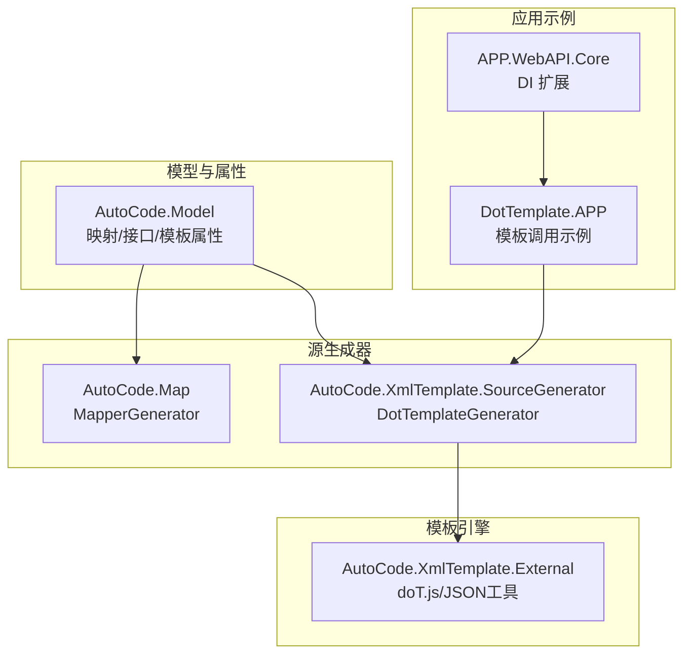
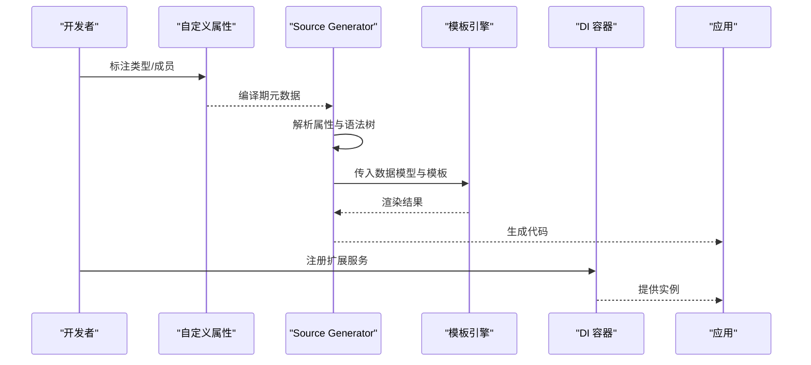
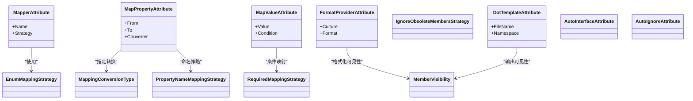
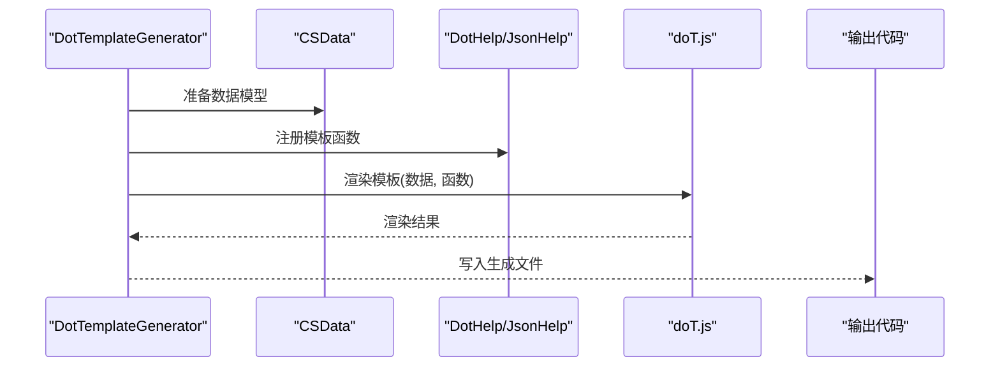
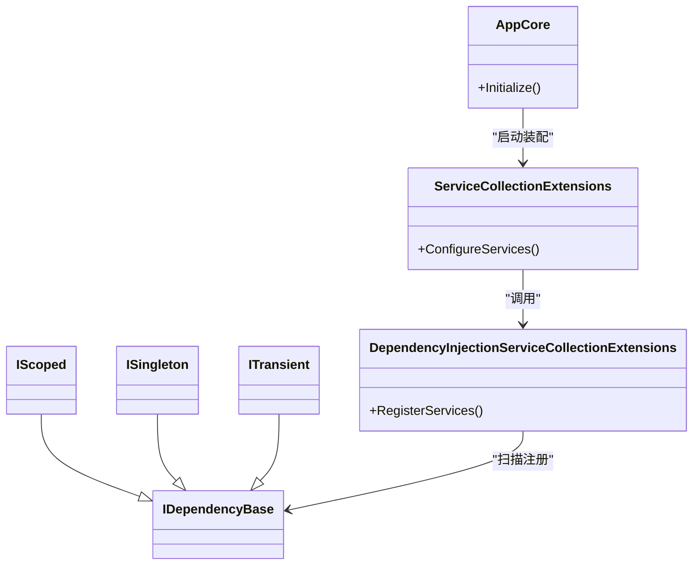
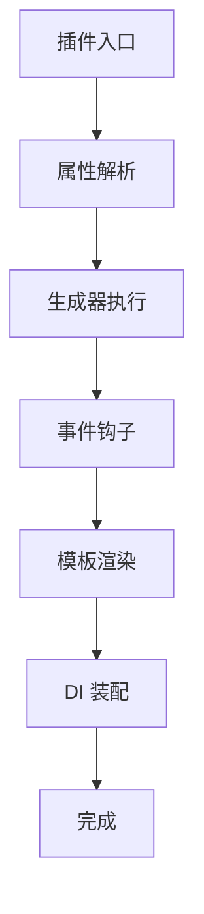
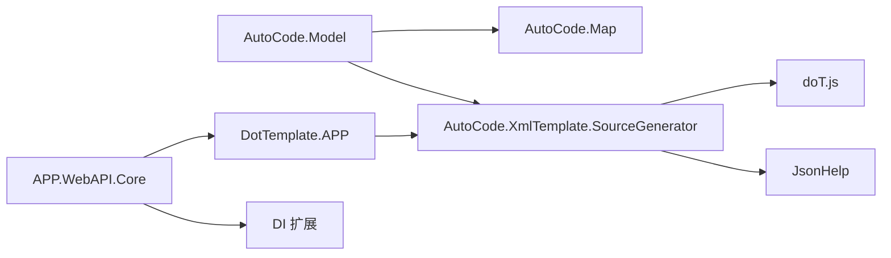

# 扩展开发

<cite>
**本文引用的文件**   
- [README.md](file://README.md)
- [AutoCode.Model.csproj](file://src/AutoCode.Model/AutoCode.Model.csproj)
- [MapperAttribute.cs](file://src/AutoCode.Model/AutoMapperModel/MapperAttribute.cs)
- [MapPropertyAttribute.cs](file://src/AutoCode.Model/AutoMapperModel/MapPropertyAttribute.cs)
- [MapValueAttribute.cs](file://src/AutoCode.Model/AutoMapperModel/MapValueAttribute.cs)
- [FormatProviderAttribute.cs](file://src/AutoCode.Model/AutoMapperModel/FormatProviderAttribute.cs)
- [EnumMappingStrategy.cs](file://src/AutoCode.Model/AutoMapperModel/EnumMappingStrategy.cs)
- [MappingConversionType.cs](file://src/AutoCode.Model/AutoMapperModel/MappingConversionType.cs)
- [PropertyNameMappingStrategy.cs](file://src/AutoCode.Model/AutoMapperModel/PropertyNameMappingStrategy.cs)
- [RequiredMappingStrategy.cs](file://src/AutoCode.Model/AutoMapperModel/RequiredMappingStrategy.cs)
- [IgnoreObsoleteMembersStrategy.cs](file://src/AutoCode.Model/AutoMapperModel/IgnoreObsoleteMembersStrategy.cs)
- [MemberVisibility.cs](file://src/AutoCode.Model/AutoMapperModel/MemberVisibility.cs)
- [DotTemplateAttribute.cs](file://src/AutoCode.Model/DotFileAttribute/DotTemplateAttribute.cs)
- [AutoInterfaceAttribute.cs](file://src/AutoCode.Model/InterfaceAttribute/AutoInterfaceAttribute.cs)
- [AutoIgnoreAttribute.cs](file://src/AutoCode.Model/InterfaceAttribute/AutoIgnoreAttribute.cs)
- [MapperGenerator.cs](file://src/AutoCode.Map/MapperGenerator.cs)
- [DiagnosticDescriptors.cs](file://src/AutoCode.Map/Diagnostics/DiagnosticDescriptors.cs)
- [ImmutableEquatableArray.cs](file://src/AutoCode.Map/Helpers/ImmutableEquatableArray.cs)
- [IncrementalValuesProviderExtensions.cs](file://src/AutoCode.Map/Helpers/IncrementalValuesProviderExtensions.cs)
- [AutoCode.DotTemplate.SourceGenerator.csproj](file://src/AutoCode.XmlTemplate.SourceGenerator/AutoCode.DotTemplate.SourceGenerator.csproj)
- [DotTemplateGenerator.cs](file://src/AutoCode.XmlTemplate.SourceGenerator/DotTemplateGenerator.cs)
- [CSData.cs](file://src/AutoCode.XmlTemplate.SourceGenerator/CSData.cs)
- [SyntaxNodeConvert.cs](file://src/AutoCode.XmlTemplate.SourceGenerator/SyntaxNodeConvert.cs)
- [DotHelp.cs](file://src/AutoCode.XmlTemplate.SourceGenerator/Extend/DotHelp.cs)
- [DiagnosticIds.cs](file://src/AutoCode.XmlTemplate.SourceGenerator/Extend/DiagnosticIds.cs)
- [doT.js](file://src/AutoCode.XmlTemplate.External/doT.js)
- [JsonHelp.cs](file://src/AutoCode.XmlTemplate.External/JsonHelp.cs)
- [DotHelp.cs](file://src/AutoCode.XmlTemplate.External/DotHelp.cs)
- [AutoTemplate.cs](file://src/DotTemplate.APP/AutoTemplate.cs)
- [DotTemplate.cs](file://src/DotTemplate.APP/DotTemplate.cs)
- [IAutoTemplate.cs](file://src/DotTemplate.APP/IAutoTemplate.cs)
- [Program.cs](file://src/DotTemplate.APP/Program.cs)
- [DependencyInjectionServiceCollectionExtensions.cs](file://src/APP.WebAPI.Core/DependencyInjection/DependencyInjectionServiceCollectionExtensions.cs)
- [IDependencyBase.cs](file://src/APP.WebAPI.Core/DependencyInjection/LifeType/IDependencyBase.cs)
- [IScoped.cs](file://src/APP.WebAPI.Core/DependencyInjection/LifeType/IScoped.cs)
- [ISingleton.cs](file://src/APP.WebAPI.Core/DependencyInjection/LifeType/ISingleton.cs)
- [ITransient.cs](file://src/APP.WebAPI.Core/DependencyInjection/LifeType/ITransient.cs)
- [ServiceCollectionExtensions.cs](file://src/APP.WebAPI.Core/Application/Extensions/ServiceCollectionExtensions.cs)
- [AppCore.cs](file://src/APP.WebAPI.Core/Application/AppCore.cs)
</cite>

## 目录
1. [简介](#简介)
2. [项目结构](#项目结构)
3. [核心组件](#核心组件)
4. [架构总览](#架构总览)
5. [详细组件分析](#详细组件分析)
6. [依赖关系分析](#依赖关系分析)
7. [性能考量](#性能考量)
8. [故障排查指南](#故障排查指南)
9. [结论](#结论)
10. [附录](#附录)

## 简介
本文件面向希望在 AutoCode 框架中开发自定义扩展的开发者，系统讲解如何创建自定义属性、扩展 Source Generator、为模板引擎添加自定义函数、以及扩展依赖注入容器。文档同时阐述插件架构、事件系统与扩展机制，并提供从示例到打包发布与版本管理的完整实践路径。读者无需深入源码即可上手扩展开发，同时提供源码级参考以便进阶定制。

## 项目结构
AutoCode 采用“模型定义 + 源生成器 + 模板引擎 + 应用集成”的分层组织方式：
- 模型与属性定义位于 AutoCode.Model，用于声明映射策略、接口生成标记、模板绑定等元数据。
- 源生成器实现位于 AutoCode.Map 与 AutoCode.XmlTemplate.SourceGenerator，分别负责 Map 代码生成与 Dot 模板渲染。
- 模板引擎外部库与帮助方法位于 AutoCode.XmlTemplate.External，封装 doT.js 与 JSON 处理。
- 应用层示例位于 DotTemplate.APP 与 APP.WebAPI.Core，演示模板调用与依赖注入扩展点。

图表来源
- [AutoCode.Model.csproj](file://src/AutoCode.Model/AutoCode.Model.csproj)
- [MapperGenerator.cs](file://src/AutoCode.Map/MapperGenerator.cs)
- [AutoCode.DotTemplate.SourceGenerator.csproj](file://src/AutoCode.XmlTemplate.SourceGenerator/AutoCode.DotTemplate.SourceGenerator.csproj)
- [doT.js](file://src/AutoCode.XmlTemplate.External/doT.js)
- [AutoTemplate.cs](file://src/DotTemplate.APP/AutoTemplate.cs)
- [DependencyInjectionServiceCollectionExtensions.cs](file://src/APP.WebAPI.Core/DependencyInjection/DependencyInjectionServiceCollectionExtensions.cs)

章节来源
- [README.md](file://README.md)

## 核心组件
- 自定义属性（模型层）
  - 映射相关：MapperAttribute、MapPropertyAttribute、MapValueAttribute、FormatProviderAttribute、枚举/命名/必需/可见性等策略类型。
  - 模板绑定：DotTemplateAttribute。
  - 接口生成：AutoInterfaceAttribute、AutoIgnoreAttribute。
- 源生成器（编译期代码生成）
  - MapperGenerator：解析映射属性并生成映射代码。
  - DotTemplateGenerator：解析模板与数据模型，调用模板引擎输出目标代码。
- 模板引擎（运行时/生成期渲染）
  - doT.js：模板渲染核心。
  - JsonHelp/DotHelp：JSON 序列化与模板辅助函数。
- 依赖注入（DI 容器扩展）
  - IDependencyBase/IScoped/ISingleton/ITransient：生命周期约定。
  - DependencyInjectionServiceCollectionExtensions：扫描并注册服务。
  - ServiceCollectionExtensions/AppCore：应用启动时的装配入口。

章节来源
- [MapperAttribute.cs](file://src/AutoCode.Model/AutoMapperModel/MapperAttribute.cs)
- [MapPropertyAttribute.cs](file://src/AutoCode.Model/AutoMapperModel/MapPropertyAttribute.cs)
- [MapValueAttribute.cs](file://src/AutoCode.Model/AutoMapperModel/MapValueAttribute.cs)
- [FormatProviderAttribute.cs](file://src/AutoCode.Model/AutoMapperModel/FormatProviderAttribute.cs)
- [EnumMappingStrategy.cs](file://src/AutoCode.Model/AutoMapperModel/EnumMappingStrategy.cs)
- [MappingConversionType.cs](file://src/AutoCode.Model/AutoMapperModel/MappingConversionType.cs)
- [PropertyNameMappingStrategy.cs](file://src/AutoCode.Model/AutoMapperModel/PropertyNameMappingStrategy.cs)
- [RequiredMappingStrategy.cs](file://src/AutoCode.Model/AutoMapperModel/RequiredMappingStrategy.cs)
- [IgnoreObsoleteMembersStrategy.cs](file://src/AutoCode.Model/AutoMapperModel/IgnoreObsoleteMembersStrategy.cs)
- [MemberVisibility.cs](file://src/AutoCode.Model/AutoMapperModel/MemberVisibility.cs)
- [DotTemplateAttribute.cs](file://src/AutoCode.Model/DotFileAttribute/DotTemplateAttribute.cs)
- [AutoInterfaceAttribute.cs](file://src/AutoCode.Model/InterfaceAttribute/AutoInterfaceAttribute.cs)
- [AutoIgnoreAttribute.cs](file://src/AutoCode.Model/InterfaceAttribute/AutoIgnoreAttribute.cs)
- [MapperGenerator.cs](file://src/AutoCode.Map/MapperGenerator.cs)
- [AutoCode.DotTemplate.SourceGenerator.csproj](file://src/AutoCode.XmlTemplate.SourceGenerator/AutoCode.DotTemplate.SourceGenerator.csproj)
- [DotTemplateGenerator.cs](file://src/AutoCode.XmlTemplate.SourceGenerator/DotTemplateGenerator.cs)
- [doT.js](file://src/AutoCode.XmlTemplate.External/doT.js)
- [JsonHelp.cs](file://src/AutoCode.XmlTemplate.External/JsonHelp.cs)
- [DotHelp.cs](file://src/AutoCode.XmlTemplate.External/DotHelp.cs)
- [IDependencyBase.cs](file://src/APP.WebAPI.Core/DependencyInjection/LifeType/IDependencyBase.cs)
- [IScoped.cs](file://src/APP.WebAPI.Core/DependencyInjection/LifeType/IScoped.cs)
- [ISingleton.cs](file://src/APP.WebAPI.Core/DependencyInjection/LifeType/ISingleton.cs)
- [ITransient.cs](file://src/APP.WebAPI.Core/DependencyInjection/LifeType/ITransient.cs)
- [DependencyInjectionServiceCollectionExtensions.cs](file://src/APP.WebAPI.Core/DependencyInjection/DependencyInjectionServiceCollectionExtensions.cs)
- [ServiceCollectionExtensions.cs](file://src/APP.WebAPI.Core/Application/Extensions/ServiceCollectionExtensions.cs)
- [AppCore.cs](file://src/APP.WebAPI.Core/Application/AppCore.cs)

## 架构总览
AutoCode 的扩展体系围绕“属性驱动 + 源生成 + 模板渲染 + DI 装配”展开：
- 开发者通过自定义属性描述意图（如映射规则、模板绑定、接口生成）。
- 源生成器在编译期读取这些属性，结合语法树与增量分析，生成目标代码。
- 模板引擎在生成期或运行期根据数据模型渲染模板，产出最终代码或配置。
- DI 容器按约定自动发现并注册扩展服务，支持生命周期管理。

图表来源
- [MapperGenerator.cs](file://src/AutoCode.Map/MapperGenerator.cs)
- [DotTemplateGenerator.cs](file://src/AutoCode.XmlTemplate.SourceGenerator/DotTemplateGenerator.cs)
- [doT.js](file://src/AutoCode.XmlTemplate.External/doT.js)
- [DependencyInjectionServiceCollectionExtensions.cs](file://src/APP.WebAPI.Core/DependencyInjection/DependencyInjectionServiceCollectionExtensions.cs)

## 详细组件分析

### 自定义属性扩展（模型层）
- 设计要点
  - 使用特性类承载元数据，供源生成器读取。
  - 将策略与枚举分离，便于组合与扩展。
  - 保持属性不可变与可序列化，利于跨阶段传递。
- 关键类型
  - 映射属性：MapperAttribute、MapPropertyAttribute、MapValueAttribute、FormatProviderAttribute。
  - 策略枚举：EnumMappingStrategy、MappingConversionType、PropertyNameMappingStrategy、RequiredMappingStrategy、MemberVisibility、IgnoreObsoleteMembersStrategy。
  - 模板与接口：DotTemplateAttribute、AutoInterfaceAttribute、AutoIgnoreAttribute。
- 扩展建议
  - 新增属性时，同步更新诊断信息与测试用例。
  - 对复杂属性提供默认值与校验逻辑。

图表来源
- [MapperAttribute.cs](file://src/AutoCode.Model/AutoMapperModel/MapperAttribute.cs)
- [MapPropertyAttribute.cs](file://src/AutoCode.Model/AutoMapperModel/MapPropertyAttribute.cs)
- [MapValueAttribute.cs](file://src/AutoCode.Model/AutoMapperModel/MapValueAttribute.cs)
- [FormatProviderAttribute.cs](file://src/AutoCode.Model/AutoMapperModel/FormatProviderAttribute.cs)
- [EnumMappingStrategy.cs](file://src/AutoCode.Model/AutoMapperModel/EnumMappingStrategy.cs)
- [MappingConversionType.cs](file://src/AutoCode.Model/AutoMapperModel/MappingConversionType.cs)
- [PropertyNameMappingStrategy.cs](file://src/AutoCode.Model/AutoMapperModel/PropertyNameMappingStrategy.cs)
- [RequiredMappingStrategy.cs](file://src/AutoCode.Model/AutoMapperModel/RequiredMappingStrategy.cs)
- [IgnoreObsoleteMembersStrategy.cs](file://src/AutoCode.Model/AutoMapperModel/IgnoreObsoleteMembersStrategy.cs)
- [MemberVisibility.cs](file://src/AutoCode.Model/AutoMapperModel/MemberVisibility.cs)
- [DotTemplateAttribute.cs](file://src/AutoCode.Model/DotFileAttribute/DotTemplateAttribute.cs)
- [AutoInterfaceAttribute.cs](file://src/AutoCode.Model/InterfaceAttribute/AutoInterfaceAttribute.cs)
- [AutoIgnoreAttribute.cs](file://src/AutoCode.Model/InterfaceAttribute/AutoIgnoreAttribute.cs)

章节来源
- [AutoCode.Model.csproj](file://src/AutoCode.Model/AutoCode.Model.csproj)

### Source Generator 扩展点（Map 生成器）
- 扩展点
  - 在 MapperGenerator 中解析属性与语法节点，构建中间表示，再输出代码。
  - 借助 ImmutableEquatableArray 与 IncrementalValuesProviderExtensions 提升增量分析性能。
  - 通过 DiagnosticDescriptors 统一错误与警告信息。
- 扩展步骤
  - 新增属性后，在生成器中识别并转换为中间模型。
  - 编写转换逻辑与代码生成片段。
  - 补充诊断与单元测试覆盖边界情况。

```mermaid
flowchart TD
Start(["开始"]) --> Parse["解析语法树与属性"]
Parse --> BuildModel["构建中间模型"]
BuildModel --> Validate{"验证通过?"}
Validate --> |否| EmitDiag["发出诊断信息"]
Validate --> |是| Generate["生成代码"]
Generate --> End(["结束"])
EmitDiag --> End
```

图表来源
- [MapperGenerator.cs](file://src/AutoCode.Map/MapperGenerator.cs)
- [DiagnosticDescriptors.cs](file://src/AutoCode.Map/Diagnostics/DiagnosticDescriptors.cs)
- [ImmutableEquatableArray.cs](file://src/AutoCode.Map/Helpers/ImmutableEquatableArray.cs)
- [IncrementalValuesProviderExtensions.cs](file://src/AutoCode.Map/Helpers/IncrementalValuesProviderExtensions.cs)

章节来源
- [MapperGenerator.cs](file://src/AutoCode.Map/MapperGenerator.cs)

### 模板引擎扩展（Dot 模板与自定义函数）
- 扩展点
  - DotTemplateGenerator 负责加载模板与数据模型，调用 doT.js 进行渲染。
  - 通过 Extend/DotHelp 与 External/DotHelp 暴露模板函数，支持 JSON 处理与字符串操作。
- 自定义函数
  - 在 DotHelp 中添加新函数，确保幂等与异常安全。
  - 在 CSData 中定义数据模型字段，供模板访问。
  - 在 SyntaxNodeConvert 中将语法节点转换为模板可用数据。

图表来源
- [DotTemplateGenerator.cs](file://src/AutoCode.XmlTemplate.SourceGenerator/DotTemplateGenerator.cs)
- [CSData.cs](file://src/AutoCode.XmlTemplate.SourceGenerator/CSData.cs)
- [SyntaxNodeConvert.cs](file://src/AutoCode.XmlTemplate.SourceGenerator/SyntaxNodeConvert.cs)
- [DotHelp.cs](file://src/AutoCode.XmlTemplate.SourceGenerator/Extend/DotHelp.cs)
- [JsonHelp.cs](file://src/AutoCode.XmlTemplate.External/JsonHelp.cs)
- [doT.js](file://src/AutoCode.XmlTemplate.External/doT.js)

章节来源
- [AutoCode.DotTemplate.SourceGenerator.csproj](file://src/AutoCode.XmlTemplate.SourceGenerator/AutoCode.DotTemplate.SourceGenerator.csproj)

### 依赖注入容器扩展
- 扩展点
  - 通过 IDependencyBase 及其生命周期接口（IScoped/ISingleton/ITransient）约定服务类型。
  - DependencyInjectionServiceCollectionExtensions 扫描程序集并注册服务。
  - ServiceCollectionExtensions 与 AppCore 提供应用启动时的装配入口。
- 扩展步骤
  - 实现生命周期接口以声明服务。
  - 在扩展方法中注册服务（含工厂方法与参数注入）。
  - 在应用启动时调用扩展方法进行装配。

图表来源
- [IDependencyBase.cs](file://src/APP.WebAPI.Core/DependencyInjection/LifeType/IDependencyBase.cs)
- [IScoped.cs](file://src/APP.WebAPI.Core/DependencyInjection/LifeType/IScoped.cs)
- [ISingleton.cs](file://src/APP.WebAPI.Core/DependencyInjection/LifeType/ISingleton.cs)
- [ITransient.cs](file://src/APP.WebAPI.Core/DependencyInjection/LifeType/ITransient.cs)
- [DependencyInjectionServiceCollectionExtensions.cs](file://src/APP.WebAPI.Core/DependencyInjection/DependencyInjectionServiceCollectionExtensions.cs)
- [ServiceCollectionExtensions.cs](file://src/APP.WebAPI.Core/Application/Extensions/ServiceCollectionExtensions.cs)
- [AppCore.cs](file://src/APP.WebAPI.Core/Application/AppCore.cs)

章节来源
- [DependencyInjectionServiceCollectionExtensions.cs](file://src/APP.WebAPI.Core/DependencyInjection/DependencyInjectionServiceCollectionExtensions.cs)

### 概念总览（不直接对应源码）
- 插件架构
  - 以“属性 + 生成器 + 模板 + DI”为核心，各模块松耦合，通过约定与接口协作。
- 事件系统
  - 可在生成器与模板渲染的关键阶段插入钩子（例如预处理数据、后处理输出），通过委托或回调机制实现。
- 扩展机制
  - 新增属性、新增生成器、新增模板函数、新增 DI 服务均可独立演进，互不影响。

[本图为概念流程，不直接映射具体源码]

## 依赖关系分析
- 内部依赖
  - AutoCode.Model 被所有生成器与模板模块引用。
  - AutoCode.Map 与 AutoCode.XmlTemplate.SourceGenerator 依赖模型与外部模板库。
  - 应用示例依赖生成器与模板库，并通过 DI 扩展装配服务。
- 外部依赖
  - doT.js 作为模板引擎核心。
  - .NET 源生成器 API 与增量分析 API。
  - Microsoft.Extensions.DependencyInjection。

图表来源
- [AutoCode.Model.csproj](file://src/AutoCode.Model/AutoCode.Model.csproj)
- [MapperGenerator.cs](file://src/AutoCode.Map/MapperGenerator.cs)
- [AutoCode.DotTemplate.SourceGenerator.csproj](file://src/AutoCode.XmlTemplate.SourceGenerator/AutoCode.DotTemplate.SourceGenerator.csproj)
- [doT.js](file://src/AutoCode.XmlTemplate.External/doT.js)
- [JsonHelp.cs](file://src/AutoCode.XmlTemplate.External/JsonHelp.cs)
- [AutoTemplate.cs](file://src/DotTemplate.APP/AutoTemplate.cs)
- [DependencyInjectionServiceCollectionExtensions.cs](file://src/APP.WebAPI.Core/DependencyInjection/DependencyInjectionServiceCollectionExtensions.cs)

章节来源
- [AutoCode.Model.csproj](file://src/AutoCode.Model/AutoCode.Model.csproj)

## 性能考量
- 增量分析
  - 使用 IncrementalValuesProviderExtensions 减少不必要的重新生成。
  - 利用 ImmutableEquatableArray 避免重复计算与内存分配。
- 模板渲染
  - 缓存已编译的模板函数，避免重复编译开销。
  - 控制数据模型大小，仅传递必要字段。
- 源生成器
  - 尽早失败（快速校验属性与语法），减少后续处理成本。
  - 并行处理多个文件，但注意线程安全与资源竞争。

[本节为通用指导，不直接分析具体文件]

## 故障排查指南
- 常见问题
  - 属性未生效：检查属性是否被正确标注且生成器是否包含相应解析逻辑。
  - 模板渲染失败：确认模板语法与提供的数据模型字段一致，检查自定义函数是否正确注册。
  - DI 装配失败：确认服务实现了生命周期接口并在扩展方法中注册。
- 诊断信息
  - 通过 DiagnosticDescriptors 定位问题，查看生成的诊断消息与位置。
- 调试技巧
  - 在生成器中输出中间模型与日志，逐步缩小问题范围。
  - 使用最小复现工程隔离问题。

章节来源
- [DiagnosticDescriptors.cs](file://src/AutoCode.Map/Diagnostics/DiagnosticDescriptors.cs)

## 结论
AutoCode 的扩展体系以属性为中心、以源生成为核心、以模板为表达、以 DI 为装配，形成高内聚低耦合的可扩展架构。遵循本文档的扩展模式与最佳实践，开发者可以高效地创建自定义属性、扩展生成器、添加模板函数与集成第三方库，并以模块化方式发布与维护扩展包。

## 附录
- 扩展开发清单
  - 新增属性：定义属性类、默认值与校验；更新生成器解析；补充诊断与测试。
  - 新增生成器：实现增量分析与代码生成；接入现有数据模型；完善错误处理。
  - 新增模板函数：在 DotHelp 中实现；确保幂等与异常安全；提供示例模板。
  - 新增 DI 服务：实现生命周期接口；在扩展方法中注册；在应用启动装配。
- 打包与发布
  - 使用 NuGet 打包生成器与模板扩展；维护版本号与变更日志；提供安装脚本与示例工程。
- 版本管理
  - 语义化版本控制；向后兼容策略；弃用通知与迁移指南。

[本节为通用指导，不直接分析具体文件]
