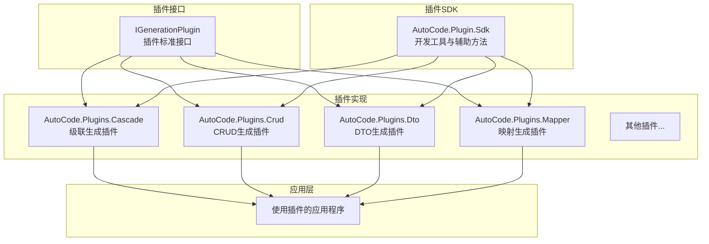
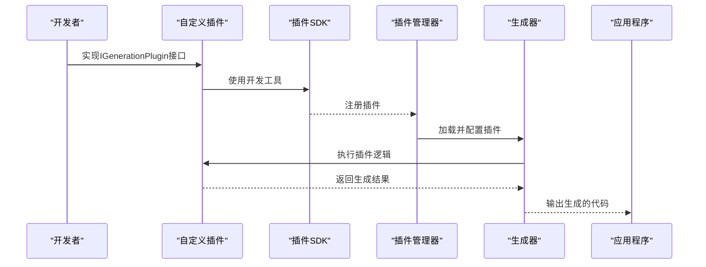
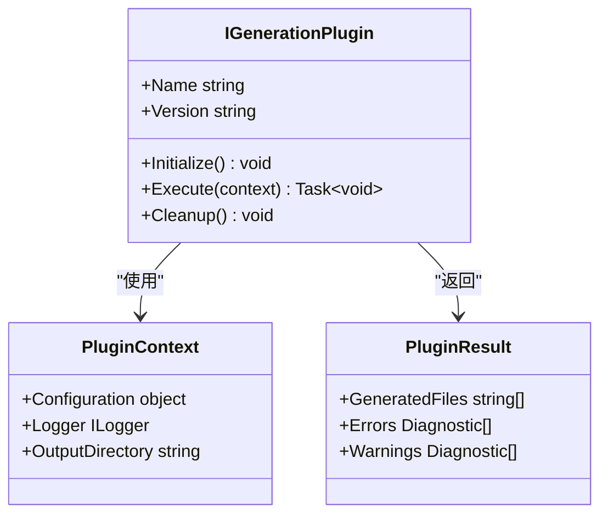
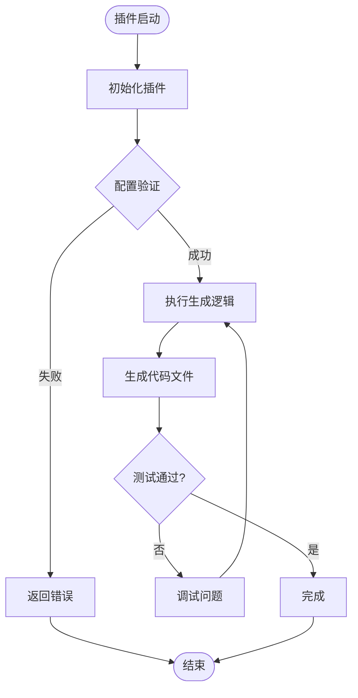

# 扩展开发

<cite>
**本文引用的文件**   
- [README.md](file://README.md)
- [IGenerationPlugin.cs](file://src/AutoCode.Engine/Plugin/IGenerationPlugin.cs)
- [AutoCode.Plugin.Sdk.csproj](file://src/AutoCode.Plugin.Sdk/AutoCode.Plugin.Sdk.csproj)
- [PluginDevTools.cs](file://src/AutoCode.Plugin.Sdk/PluginDevTools.cs)
- [CascadeGenerator.cs](file://src/AutoCode.Plugins.Cascade/CascadeGenerator.cs)
- [CrudGenerator.cs](file://src/AutoCode.Plugins.Crud/CrudGenerator.cs)
- [DependencyInjectionGenerator.cs](file://src/AutoCode.Plugins.DependencyInjection/DependencyInjectionGenerator.cs)
- [DtoGenerator.cs](file://src/AutoCode.Plugins.Dto/DtoGenerator.cs)
- [InterfaceGenerator.cs](file://src/AutoCode.Plugins.Interface/InterfaceGenerator.cs)
- [LogDecoratorGenerator.cs](file://src/AutoCode.Plugins.Logging/LogDecoratorGenerator.cs)
- [MapperGenerator.cs](file://src/AutoCode.Plugins.Mapper/MapperGenerator.cs)
- [TestGenerator.cs](file://src/AutoCode.Plugins.Testing/TestGenerator.cs)
- [ValidationGenerator.cs](file://src/AutoCode.Plugins.Validation/ValidationGenerator.cs)
- [ControllerGenerator.cs](file://src/AutoCode.Plugins.WebApi/ControllerGenerator.cs)
</cite>

## 更新摘要
**所做更改**   
- 新增基于IGenerationPlugin接口的插件架构章节
- 更新插件SDK和开发工具说明
- 添加新插件示例和实现模式
- 重构扩展开发流程以适配新架构

## 目录
1. [简介](#简介)
2. [项目结构](#项目结构)
3. [核心组件](#核心组件)
4. [架构总览](#架构总览)
5. [详细组件分析](#详细组件分析)
6. [依赖关系分析](#依赖关系分析)
7. [性能考量](#性能考量)
8. [故障排查指南](#故障排查指南)
9. [结论](#结论)
10. [附录](#附录)

## 简介
本文件面向希望在 AutoCode 框架中开发自定义扩展的开发者，系统讲解如何基于新的插件架构创建自定义插件。文档重点介绍IGenerationPlugin接口、插件SDK的使用，以及从传统扩展方式迁移到新插件架构的实践路径。读者无需深入源码即可上手插件开发，同时提供源码级参考以便进阶定制。

## 项目结构
AutoCode 采用"插件架构 + 生成器 + 模板引擎 + 应用集成"的分层组织方式：
- 插件接口定义位于 AutoCode.Engine/Plugin，提供IGenerationPlugin标准接口。
- 插件SDK位于 AutoCode.Plugin.Sdk，包含开发工具和辅助方法。
- 具体插件实现位于 AutoCode.Plugins.* 命名空间下，每个功能模块对应一个插件。
- 应用层示例位于各插件项目中，演示插件的使用和配置。

**图表来源**
- [IGenerationPlugin.cs](file://src/AutoCode.Engine/Plugin/IGenerationPlugin.cs)
- [AutoCode.Plugin.Sdk.csproj](file://src/AutoCode.Plugin.Sdk/AutoCode.Plugin.Sdk.csproj)
- [CascadeGenerator.cs](file://src/AutoCode.Plugins.Cascade/CascadeGenerator.cs)
- [CrudGenerator.cs](file://src/AutoCode.Plugins.Crud/CrudGenerator.cs)
- [DtoGenerator.cs](file://src/AutoCode.Plugins.Dto/DtoGenerator.cs)
- [MapperGenerator.cs](file://src/AutoCode.Plugins.Mapper/MapperGenerator.cs)

## 核心组件
- **插件接口（IGenerationPlugin）**
  - 定义插件的标准接口，包括初始化、执行和清理方法。
  - 支持插件生命周期管理和错误处理。
- **插件SDK（AutoCode.Plugin.Sdk）**
  - 提供PluginDevTools等开发辅助工具。
  - 包含插件注册、发现和加载机制。
- **插件实现**
  - 各个功能插件如CRUD、DTO、Mapper等。
  - 每个插件实现IGenerationPlugin接口。
- **插件配置**
  - 通过配置文件或属性声明插件行为。
  - 支持插件参数和选项配置。

**章节来源**
- [IGenerationPlugin.cs](file://src/AutoCode.Engine/Plugin/IGenerationPlugin.cs)
- [AutoCode.Plugin.Sdk.csproj](file://src/AutoCode.Plugin.Sdk/AutoCode.Plugin.Sdk.csproj)
- [PluginDevTools.cs](file://src/AutoCode.Plugin.Sdk/PluginDevTools.cs)

## 架构总览
AutoCode 的新插件架构围绕"接口驱动 + 插件管理 + 生成器执行"展开：
- 开发者通过实现IGenerationPlugin接口创建自定义插件。
- 插件SDK提供统一的开发工具和辅助方法。
- 插件管理器负责插件的发现、加载和执行。
- 生成器在编译期根据插件配置执行相应的代码生成逻辑。

**图表来源**
- [IGenerationPlugin.cs](file://src/AutoCode.Engine/Plugin/IGenerationPlugin.cs)
- [PluginDevTools.cs](file://src/AutoCode.Plugin.Sdk/PluginDevTools.cs)

## 详细组件分析

### IGenerationPlugin接口
- **设计要点**
  - 定义插件的标准生命周期方法。
  - 支持异步执行和错误处理。
  - 提供插件元数据和配置访问。
- **关键方法**
  - Initialize：插件初始化方法。
  - Execute：插件主要执行逻辑。
  - Cleanup：插件清理资源。
- **扩展建议**
  - 实现异常处理和日志记录。
  - 支持插件配置验证。
  - 提供插件状态监控。

**图表来源**
- [IGenerationPlugin.cs](file://src/AutoCode.Engine/Plugin/IGenerationPlugin.cs)

**章节来源**
- [IGenerationPlugin.cs](file://src/AutoCode.Engine/Plugin/IGenerationPlugin.cs)

### 插件SDK开发工具
- **工具类**
  - PluginDevTools：提供插件开发辅助方法。
  - 代码生成工具：简化代码片段生成。
  - 诊断工具：帮助调试和错误定位。
- **开发流程**
  - 创建插件项目并引用SDK。
  - 实现IGenerationPlugin接口。
  - 使用SDK工具进行开发和测试。
- **最佳实践**
  - 使用SDK提供的日志记录。
  - 遵循插件命名约定。
  - 提供完整的插件文档。

**章节来源**
- [PluginDevTools.cs](file://src/AutoCode.Plugin.Sdk/PluginDevTools.cs)
- [AutoCode.Plugin.Sdk.csproj](file://src/AutoCode.Plugin.Sdk/AutoCode.Plugin.Sdk.csproj)

### 插件实现示例
- **CRUD插件**
  - 实现CRUD操作代码生成。
  - 支持数据库实体映射。
  - 提供API控制器生成。
- **DTO插件**
  - 生成数据传输对象。
  - 支持属性映射和验证。
  - 集成序列化配置。
- **Mapper插件**
  - 生成对象映射代码。
  - 支持复杂类型转换。
  - 优化映射性能。

**图表来源**
- [CrudGenerator.cs](file://src/AutoCode.Plugins.Crud/CrudGenerator.cs)
- [DtoGenerator.cs](file://src/AutoCode.Plugins.Dto/DtoGenerator.cs)
- [MapperGenerator.cs](file://src/AutoCode.Plugins.Mapper/MapperGenerator.cs)

**章节来源**
- [CrudGenerator.cs](file://src/AutoCode.Plugins.Crud/CrudGenerator.cs)
- [DtoGenerator.cs](file://src/AutoCode.Plugins.Dto/DtoGenerator.cs)
- [MapperGenerator.cs](file://src/AutoCode.Plugins.Mapper/MapperGenerator.cs)

### 插件配置与管理
- **配置方式**
  - 通过JSON配置文件声明插件。
  - 支持插件参数和选项设置。
  - 提供默认配置和覆盖机制。
- **管理功能**
  - 插件发现自动扫描。
  - 版本兼容性检查。
  - 依赖关系管理。
- **部署方式**
  - NuGet包分发。
  - 动态加载机制。
  - 热更新支持。

**章节来源**
- [AutoCode.Plugin.Sdk.csproj](file://src/AutoCode.Plugin.Sdk/AutoCode.Plugin.Sdk.csproj)

## 依赖关系分析
- **内部依赖**
  - AutoCode.Engine提供插件接口定义。
  - AutoCode.Plugin.Sdk提供开发工具。
  - 各插件项目依赖接口和SDK。
- **外部依赖**
  - .NET源生成器API。
  - 增量分析API。
  - 反射和动态加载库。

**图表来源**
- [IGenerationPlugin.cs](file://src/AutoCode.Engine/Plugin/IGenerationPlugin.cs)
- [AutoCode.Plugin.Sdk.csproj](file://src/AutoCode.Plugin.Sdk/AutoCode.Plugin.Sdk.csproj)

## 性能考量
- **插件加载**
  - 延迟加载避免启动开销。
  - 缓存已加载的插件实例。
  - 并行加载多个插件。
- **代码生成**
  - 增量分析减少重复工作。
  - 缓存中间结果。
  - 批量处理文件生成。
- **内存管理**
  - 及时释放插件资源。
  - 避免大对象长时间驻留。
  - 使用对象池优化分配。

## 故障排查指南
- **常见问题**
  - 插件加载失败：检查插件依赖和版本兼容性。
  - 生成代码错误：查看插件日志和诊断信息。
  - 性能问题：分析插件执行时间和内存使用。
- **调试技巧**
  - 启用详细日志记录。
  - 使用SDK提供的调试工具。
  - 创建最小复现案例。
- **解决方案**
  - 检查插件配置是否正确。
  - 验证输入数据和上下文。
  - 更新到最新版本的SDK。

## 结论
AutoCode 的新插件架构提供了统一、可扩展的扩展机制。通过IGenerationPlugin接口和插件SDK，开发者可以轻松地创建自定义插件，实现代码生成功能的扩展和定制。新架构具有良好的性能、可维护性和可扩展性，为AutoCode生态系统的持续发展奠定了坚实基础。

## 附录
- **插件开发清单**
  - 创建插件项目并引用SDK。
  - 实现IGenerationPlugin接口。
  - 编写插件逻辑和错误处理。
  - 添加单元测试和集成测试。
  - 打包发布到NuGet。
- **最佳实践**
  - 遵循插件命名约定。
  - 提供完整的文档和示例。
  - 实现适当的日志记录。
  - 支持插件配置验证。
- **迁移指南**
  - 从传统扩展迁移到新插件架构。
  - 更新现有插件以适配新接口。
  - 利用SDK工具简化迁移过程。