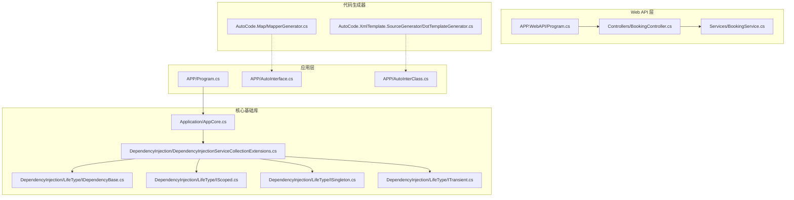
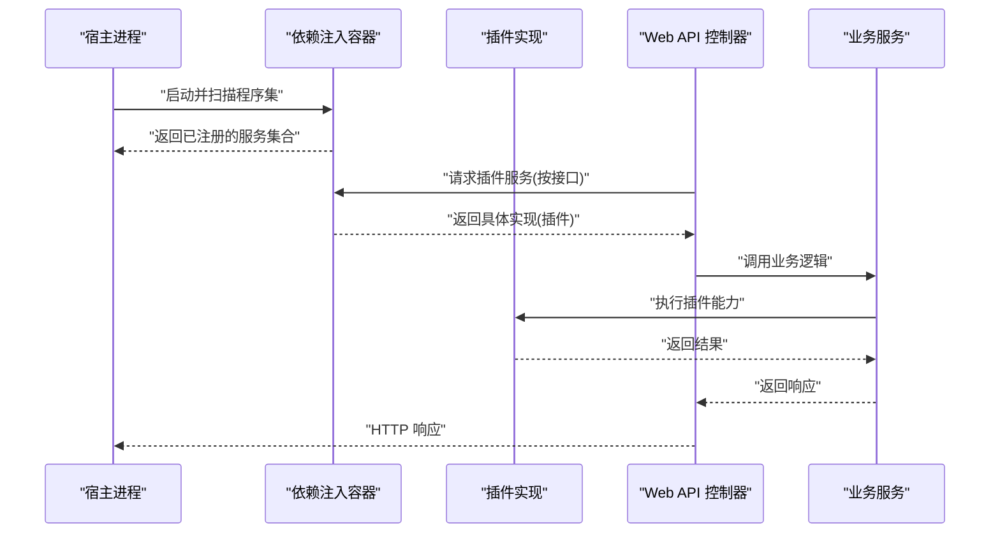
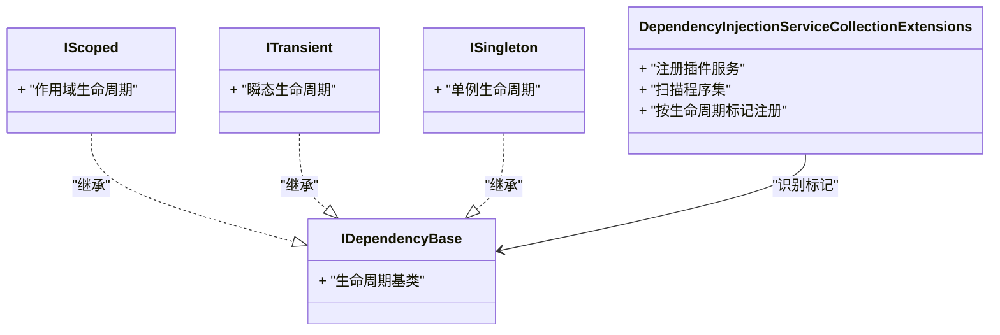
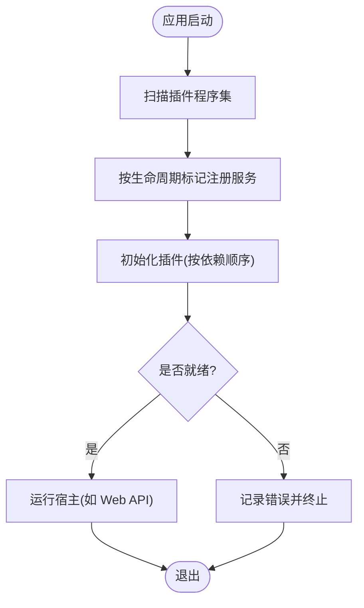
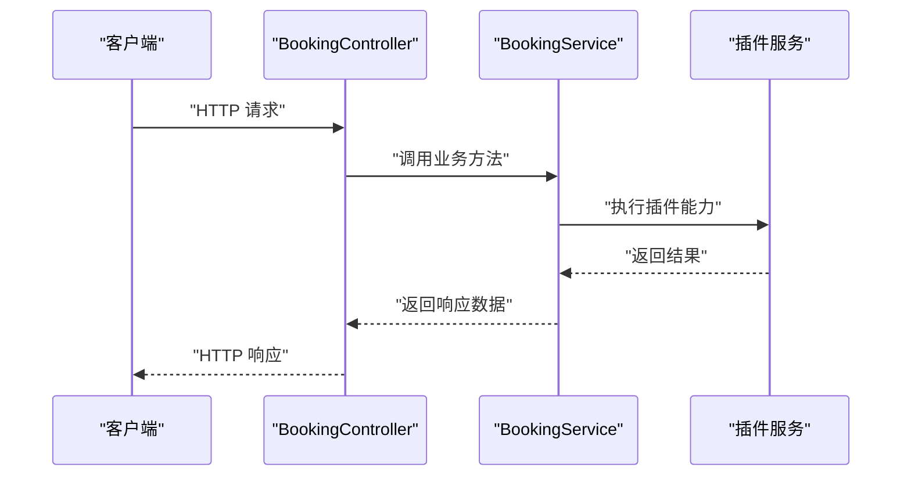
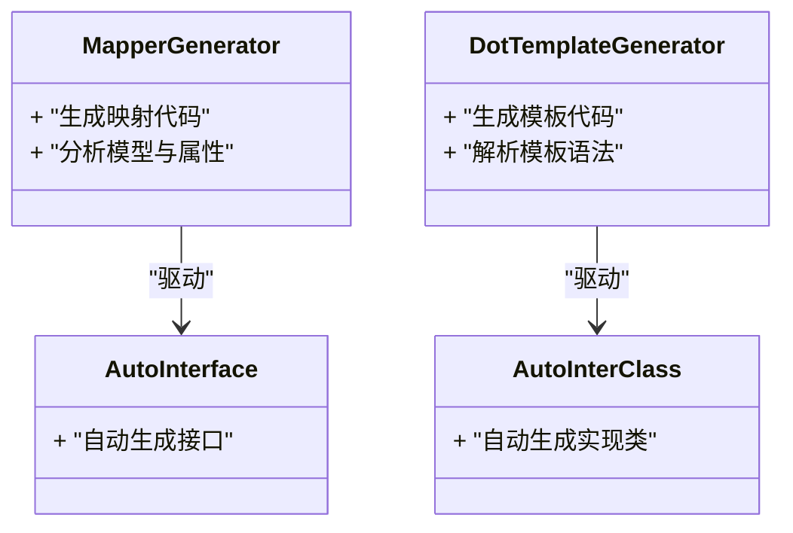
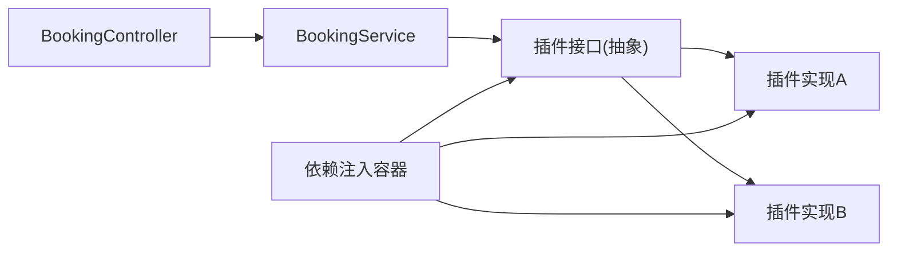

# 插件架构设计

<cite>
**本文引用的文件**   
- [Program.cs](file://src/APP/Program.cs)
- [AutoInterface.cs](file://src/APP/AutoInterface.cs)
- [AutoInterClass.cs](file://src/APP/AutoInterClass.cs)
- [DependencyInjectionServiceCollectionExtensions.cs](file://src/APP.WebAPI.Core/DependencyInjection/DependencyInjectionServiceCollectionExtensions.cs)
- [IDependencyBase.cs](file://src/APP.WebAPI.Core/DependencyInjection/LifeType/IDependencyBase.cs)
- [IScoped.cs](file://src/APP.WebAPI.Core/DependencyInjection/LifeType/IScoped.cs)
- [ISingleton.cs](file://src/APP.WebAPI.Core/DependencyInjection/LifeType/ISingleton.cs)
- [ITransient.cs](file://src/APP.WebAPI.Core/DependencyInjection/LifeType/ITransient.cs)
- [AppCore.cs](file://src/APP.WebAPI.Core/Application/AppCore.cs)
- [BookingController.cs](file://src/APP.WebAPI/Controllers/BookingController.cs)
- [BookingService.cs](file://src/APP.WebAPI/Services/BookingService.cs)
- [Program.cs](file://src/APP.WebAPI/Program.cs)
- [MapperGenerator.cs](file://src/AutoCode.Map/MapperGenerator.cs)
- [DotTemplateGenerator.cs](file://src/AutoCode.XmlTemplate.SourceGenerator/DotTemplateGenerator.cs)
</cite>

## 目录
1. [简介](#简介)
2. [项目结构](#项目结构)
3. [核心组件](#核心组件)
4. [架构总览](#架构总览)
5. [详细组件分析](#详细组件分析)
6. [依赖关系分析](#依赖关系分析)
7. [性能考量](#性能考量)
8. [故障排查指南](#故障排查指南)
9. [结论](#结论)
10. [附录：插件开发示例与最佳实践](#附录插件开发示例与最佳实践)

## 简介
本文件面向“插件架构”的设计目标，结合仓库中的依赖注入、接口生成与模板代码生成等能力，给出松耦合、可动态扩展的插件体系方案。重点覆盖：
- 插件接口定义与约定
- 插件发现与加载机制（基于程序集扫描与DI容器）
- 生命周期管理与版本管理策略
- 事件通信与依赖解析
- 安全隔离与性能优化最佳实践

## 项目结构
该仓库采用分层组织：应用层、Web API 层、核心基础库（依赖注入与应用启动）、以及多个代码生成器与模型库。插件相关的关键点集中在：
- 依赖注入与生命周期标记接口
- 应用启动与扩展点注册
- 控制器与服务作为插件宿主示例
- 代码生成器作为“静态插件”能力的补充

图表来源
- [Program.cs](file://src/APP/Program.cs)
- [AutoInterface.cs](file://src/APP/AutoInterface.cs)
- [AutoInterClass.cs](file://src/APP/AutoInterClass.cs)
- [DependencyInjectionServiceCollectionExtensions.cs](file://src/APP.WebAPI.Core/DependencyInjection/DependencyInjectionServiceCollectionExtensions.cs)
- [IDependencyBase.cs](file://src/APP.WebAPI.Core/DependencyInjection/LifeType/IDependencyBase.cs)
- [IScoped.cs](file://src/APP.WebAPI.Core/DependencyInjection/LifeType/IScoped.cs)
- [ISingleton.cs](file://src/APP.WebAPI.Core/DependencyInjection/LifeType/ISingleton.cs)
- [ITransient.cs](file://src/APP.WebAPI.Core/DependencyInjection/LifeType/ITransient.cs)
- [AppCore.cs](file://src/APP.WebAPI.Core/Application/AppCore.cs)
- [BookingController.cs](file://src/APP.WebAPI/Controllers/BookingController.cs)
- [BookingService.cs](file://src/APP.WebAPI/Services/BookingService.cs)
- [Program.cs](file://src/APP.WebAPI/Program.cs)
- [MapperGenerator.cs](file://src/AutoCode.Map/MapperGenerator.cs)
- [DotTemplateGenerator.cs](file://src/AutoCode.XmlTemplate.SourceGenerator/DotTemplateGenerator.cs)

章节来源
- [Program.cs](file://src/APP/Program.cs)
- [Program.cs](file://src/APP.WebAPI/Program.cs)
- [AppCore.cs](file://src/APP.WebAPI.Core/Application/AppCore.cs)
- [DependencyInjectionServiceCollectionExtensions.cs](file://src/APP.WebAPI.Core/DependencyInjection/DependencyInjectionServiceCollectionExtensions.cs)

## 核心组件
- 依赖注入扩展：提供统一的插件服务注册入口，支持按生命周期标记自动发现与注册。
- 生命周期接口：通过标记接口区分单例、作用域、瞬态等生命周期，便于插件按需选择。
- 应用核心：集中编排应用启动流程，包含插件发现、初始化与资源释放。
- 控制器与服务：作为插件宿主的典型用法，演示如何消费已注册的插件服务。
- 代码生成器：以“编译期插件”的方式扩展映射与模板能力，增强运行时表现。

章节来源
- [DependencyInjectionServiceCollectionExtensions.cs](file://src/APP.WebAPI.Core/DependencyInjection/DependencyInjectionServiceCollectionExtensions.cs)
- [IDependencyBase.cs](file://src/APP.WebAPI.Core/DependencyInjection/LifeType/IDependencyBase.cs)
- [IScoped.cs](file://src/APP.WebAPI.Core/DependencyInjection/LifeType/IScoped.cs)
- [ISingleton.cs](file://src/APP.WebAPI.Core/DependencyInjection/LifeType/ISingleton.cs)
- [ITransient.cs](file://src/APP.WebAPI.Core/DependencyInjection/LifeType/ITransient.cs)
- [AppCore.cs](file://src/APP.WebAPI.Core/Application/AppCore.cs)
- [BookingController.cs](file://src/APP.WebAPI/Controllers/BookingController.cs)
- [BookingService.cs](file://src/APP.WebAPI/Services/BookingService.cs)

## 架构总览
下图展示插件系统从宿主到插件的调用链与数据流，强调松耦合与可扩展性。

图表来源
- [Program.cs](file://src/APP.WebAPI/Program.cs)
- [DependencyInjectionServiceCollectionExtensions.cs](file://src/APP.WebAPI.Core/DependencyInjection/DependencyInjectionServiceCollectionExtensions.cs)
- [BookingController.cs](file://src/APP.WebAPI/Controllers/BookingController.cs)
- [BookingService.cs](file://src/APP.WebAPI/Services/BookingService.cs)

## 详细组件分析

### 依赖注入与生命周期
- 通过标记接口标识插件的生命周期类型，容器在启动时根据标记进行注册。
- 统一扩展方法封装了插件发现与注册逻辑，避免宿主直接耦合具体实现。

图表来源
- [IDependencyBase.cs](file://src/APP.WebAPI.Core/DependencyInjection/LifeType/IDependencyBase.cs)
- [IScoped.cs](file://src/APP.WebAPI.Core/DependencyInjection/LifeType/IScoped.cs)
- [ITransient.cs](file://src/APP.WebAPI.Core/DependencyInjection/LifeType/ITransient.cs)
- [ISingleton.cs](file://src/APP.WebAPI.Core/DependencyInjection/LifeType/ISingleton.cs)
- [DependencyInjectionServiceCollectionExtensions.cs](file://src/APP.WebAPI.Core/DependencyInjection/DependencyInjectionServiceCollectionExtensions.cs)

章节来源
- [DependencyInjectionServiceCollectionExtensions.cs](file://src/APP.WebAPI.Core/DependencyInjection/DependencyInjectionServiceCollectionExtensions.cs)
- [IDependencyBase.cs](file://src/APP.WebAPI.Core/DependencyInjection/LifeType/IDependencyBase.cs)
- [IScoped.cs](file://src/APP.WebAPI.Core/DependencyInjection/LifeType/IScoped.cs)
- [ITransient.cs](file://src/APP.WebAPI.Core/DependencyInjection/LifeType/ITransient.cs)
- [ISingleton.cs](file://src/APP.WebAPI.Core/DependencyInjection/LifeType/ISingleton.cs)

### 应用核心与启动流程
- 应用核心负责编排插件发现、初始化顺序、异常处理与资源释放。
- 控制器与服务作为插件消费者，通过构造函数注入获取插件实例。

图表来源
- [AppCore.cs](file://src/APP.WebAPI.Core/Application/AppCore.cs)
- [Program.cs](file://src/APP.WebAPI/Program.cs)
- [DependencyInjectionServiceCollectionExtensions.cs](file://src/APP.WebAPI.Core/DependencyInjection/DependencyInjectionServiceCollectionExtensions.cs)

章节来源
- [AppCore.cs](file://src/APP.WebAPI.Core/Application/AppCore.cs)
- [Program.cs](file://src/APP.WebAPI/Program.cs)

### 控制器与服务（插件宿主示例）
- 控制器通过 DI 获取插件服务，体现松耦合调用。
- 服务层封装业务逻辑，调用插件完成具体能力。

图表来源
- [BookingController.cs](file://src/APP.WebAPI/Controllers/BookingController.cs)
- [BookingService.cs](file://src/APP.WebAPI/Services/BookingService.cs)

章节来源
- [BookingController.cs](file://src/APP.WebAPI/Controllers/BookingController.cs)
- [BookingService.cs](file://src/APP.WebAPI/Services/BookingService.cs)

### 代码生成器（编译期插件）
- 映射生成器与模板生成器在编译期扩展宿主能力，属于“静态插件”。
- 通过属性或语法节点驱动代码生成，减少运行时开销。

图表来源
- [MapperGenerator.cs](file://src/AutoCode.Map/MapperGenerator.cs)
- [DotTemplateGenerator.cs](file://src/AutoCode.XmlTemplate.SourceGenerator/DotTemplateGenerator.cs)
- [AutoInterface.cs](file://src/APP/AutoInterface.cs)
- [AutoInterClass.cs](file://src/APP/AutoInterClass.cs)

章节来源
- [MapperGenerator.cs](file://src/AutoCode.Map/MapperGenerator.cs)
- [DotTemplateGenerator.cs](file://src/AutoCode.XmlTemplate.SourceGenerator/DotTemplateGenerator.cs)
- [AutoInterface.cs](file://src/APP/AutoInterface.cs)
- [AutoInterClass.cs](file://src/APP/AutoInterClass.cs)

## 依赖关系分析
- 插件与服务之间通过接口解耦，由容器负责实例化与生命周期管理。
- 控制器仅依赖抽象接口，不感知具体插件实现，满足开闭原则。
- 代码生成器与宿主通过约定（属性/语法）协作，降低运行时耦合。

图表来源
- [BookingController.cs](file://src/APP.WebAPI/Controllers/BookingController.cs)
- [BookingService.cs](file://src/APP.WebAPI/Services/BookingService.cs)
- [DependencyInjectionServiceCollectionExtensions.cs](file://src/APP.WebAPI.Core/DependencyInjection/DependencyInjectionServiceCollectionExtensions.cs)

章节来源
- [BookingController.cs](file://src/APP.WebAPI/Controllers/BookingController.cs)
- [BookingService.cs](file://src/APP.WebAPI/Services/BookingService.cs)
- [DependencyInjectionServiceCollectionExtensions.cs](file://src/APP.WebAPI.Core/DependencyInjection/DependencyInjectionServiceCollectionExtensions.cs)

## 性能考量
- 使用合适的生命周期：对无状态且频繁使用的插件优先选择单例；对持有上下文数据的插件使用作用域；对轻量对象使用瞬态。
- 延迟初始化：对重型插件采用惰性加载，仅在首次使用时创建实例。
- 避免反射热点：将常用路径内联或缓存元数据，减少运行时反射成本。
- 并行初始化：对互不依赖的插件并行初始化，缩短启动时间。
- 监控与度量：为关键插件添加耗时与错误率指标，便于定位瓶颈。

[本节为通用指导，无需特定文件引用]

## 故障排查指南
- 插件未加载：检查程序集扫描路径与命名约定，确认生命周期标记正确。
- 循环依赖：通过依赖图分析并拆分职责，引入中间接口或事件总线。
- 版本冲突：使用强命名与版本约束，必要时采用隔离的程序集加载策略。
- 内存泄漏：确保一次性资源实现释放接口，并在应用关闭时统一释放。
- 性能退化：启用性能计数器与日志采样，定位热点方法与阻塞点。

[本节为通用指导，无需特定文件引用]

## 结论
本方案以依赖注入为核心，结合生命周期标记与程序集扫描，构建了松耦合、可扩展的插件体系。控制器与服务作为宿主，通过接口消费插件能力；代码生成器作为编译期插件，进一步增强宿主能力。通过合理的生命周期管理、依赖解析与事件通信机制，可实现高内聚、低耦合的系统架构，并具备良好的可维护性与扩展性。

[本节为总结，无需特定文件引用]

## 附录：插件开发示例与最佳实践

### 插件接口设计
- 定义清晰的插件接口，明确输入输出契约与异常约定。
- 使用最小必要接口，避免过度暴露内部细节。
- 为重要操作定义事件或回调，便于异步与解耦。

章节来源
- [DependencyInjectionServiceCollectionExtensions.cs](file://src/APP.WebAPI.Core/DependencyInjection/DependencyInjectionServiceCollectionExtensions.cs)
- [IDependencyBase.cs](file://src/APP.WebAPI.Core/DependencyInjection/LifeType/IDependencyBase.cs)

### 依赖解析与生命周期
- 通过标记接口声明生命周期，容器自动完成注册与解析。
- 避免在构造中执行重逻辑，改为懒加载或初始化钩子。
- 对共享状态谨慎使用单例，防止并发问题。

章节来源
- [IScoped.cs](file://src/APP.WebAPI.Core/DependencyInjection/LifeType/IScoped.cs)
- [ISingleton.cs](file://src/APP.WebAPI.Core/DependencyInjection/LifeType/ISingleton.cs)
- [ITransient.cs](file://src/APP.WebAPI.Core/DependencyInjection/LifeType/ITransient.cs)

### 事件通信
- 使用发布-订阅模式实现模块间通信，避免直接耦合。
- 事件定义应稳定，向后兼容变更需遵循语义化版本控制。
- 对高频事件进行节流与批处理，降低系统压力。

[本节为通用指导，无需特定文件引用]

### 安全与隔离
- 限制插件权限，最小化文件系统与网络访问。
- 校验插件签名与来源，防止恶意代码注入。
- 使用沙箱或进程隔离，避免插件崩溃影响宿主。

[本节为通用指导，无需特定文件引用]

### 版本管理
- 插件接口采用语义化版本，保持向后兼容。
- 使用特性或元数据标注兼容性范围，容器据此选择合适实现。
- 提供迁移工具与升级脚本，平滑过渡新版本。

[本节为通用指导，无需特定文件引用]

### 完整开发流程示例
- 定义插件接口与生命周期标记。
- 实现插件逻辑，并通过扩展方法注册到容器。
- 在控制器或服务中通过 DI 消费插件。
- 编写单元测试验证插件行为与边界条件。
- 集成测试验证端到端流程与异常场景。

章节来源
- [BookingController.cs](file://src/APP.WebAPI/Controllers/BookingController.cs)
- [BookingService.cs](file://src/APP.WebAPI/Services/BookingService.cs)
- [DependencyInjectionServiceCollectionExtensions.cs](file://src/APP.WebAPI.Core/DependencyInjection/DependencyInjectionServiceCollectionExtensions.cs)
