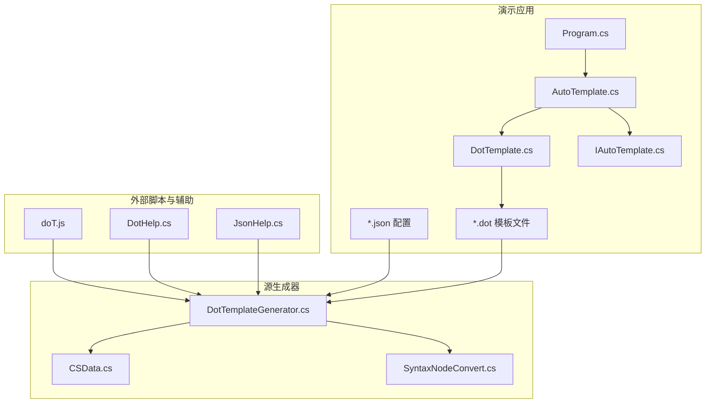
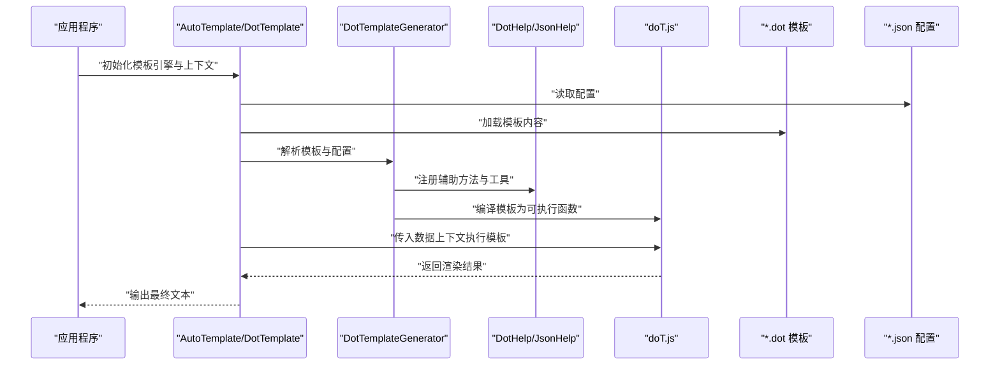
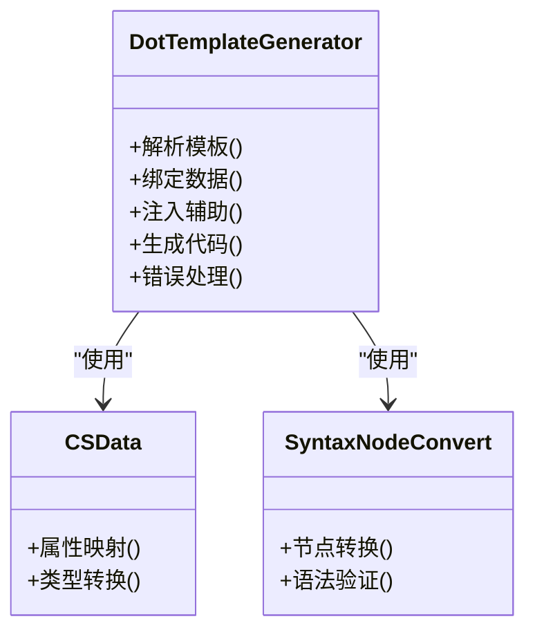
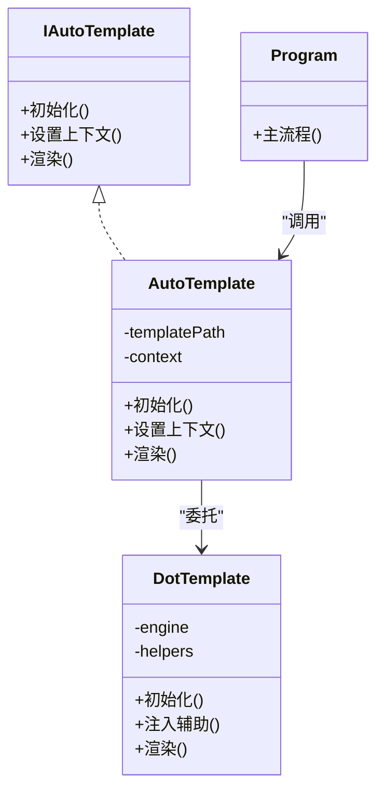
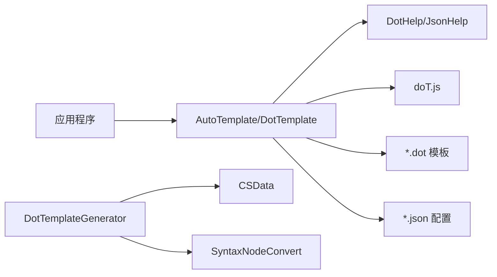

# 模板引擎扩展

<cite>
**本文引用的文件**   
- [doT.js](file://src/AutoCode.XmlTemplate.External/doT.js)
- [DotHelp.cs](file://src/AutoCode.XmlTemplate.External/DotHelp.cs)
- [JsonHelp.cs](file://src/AutoCode.XmlTemplate.External/JsonHelp.cs)
- [DotTemplateGenerator.cs](file://src/AutoCode.XmlTemplate.SourceGenerator/DotTemplateGenerator.cs)
- [CSData.cs](file://src/AutoCode.XmlTemplate.SourceGenerator/CSData.cs)
- [SyntaxNodeConvert.cs](file://src/AutoCode.XmlTemplate.SourceGenerator/SyntaxNodeConvert.cs)
- [AutoTemplate.cs](file://src/DotTemplate.APP/AutoTemplate.cs)
- [DotTemplate.cs](file://src/DotTemplate.APP/DotTemplate.cs)
- [IAutoTemplate.cs](file://src/DotTemplate.APP/IAutoTemplate.cs)
- [Program.cs](file://src/DotTemplate.APP/Program.cs)
- [Template.dot](file://src/DotTemplate.APP/DotTemplate/Template.dot)
- [ObjectCopy.dot](file://src/DotTemplate.APP/DotTemplate/ObjectCopy.dot)
- [Template_Caller.dot](file://src/DotTemplate.APP/DotTemplate/Template_Caller.dot)
- [DotTemplateS.json](file://src/DotTemplate.APP/DotTemplate/DotTemplateS.json)
- [DotTemplateS3.json](file://src/DotTemplate.APP/DotTemplate/DotTemplateS3.json)
- [DotTemplateS4.json](file://src/DotTemplate.APP/DotTemplate/DotTemplateS4.json)
- [DotTemplateS5.json](file://src/DotTemplate.APP/DotTemplate/DotTemplateS5.json)
- [DotTemplateS8.json](file://src/DotTemplate.APP/DotTemplate/DotTemplateS8.json)
</cite>

## 目录
1. [简介](#简介)
2. [项目结构](#项目结构)
3. [核心组件](#核心组件)
4. [架构总览](#架构总览)
5. [详细组件分析](#详细组件分析)
6. [依赖关系分析](#依赖关系分析)
7. [性能考虑](#性能考虑)
8. [故障排查指南](#故障排查指南)
9. [结论](#结论)
10. [附录](#附录)

## 简介
本文件面向希望在 doT.js 模板引擎基础上进行扩展的开发者，系统阐述该仓库中 doT.js 的集成方式、内置能力与扩展机制。文档覆盖：
- doT.js 在 C# 环境中的加载与调用路径
- 如何添加自定义模板函数、过滤器与助手方法
- 复杂数据绑定、条件渲染与循环处理的实践示例
- 模板性能优化、缓存策略与错误处理的最佳实践

本仓库将 doT.js（JavaScript 模板引擎）通过外部脚本注入到运行时，并由 C# 侧提供辅助方法与数据模型，实现“C# 驱动 + JS 模板”的混合生成方案。

## 项目结构
围绕模板引擎扩展的关键目录与文件如下：
- src/AutoCode.XmlTemplate.External：包含 doT.js 源码与 C# 辅助类（如 JSON 序列化、通用帮助方法）
- src/AutoCode.XmlTemplate.SourceGenerator：源生成器，负责读取模板并生成 C# 代码
- src/DotTemplate.APP：演示应用，展示如何使用模板、配置与运行流程

图表来源
- [doT.js](file://src/AutoCode.XmlTemplate.External/doT.js)
- [DotHelp.cs](file://src/AutoCode.XmlTemplate.External/DotHelp.cs)
- [JsonHelp.cs](file://src/AutoCode.XmlTemplate.External/JsonHelp.cs)
- [DotTemplateGenerator.cs](file://src/AutoCode.XmlTemplate.SourceGenerator/DotTemplateGenerator.cs)
- [CSData.cs](file://src/AutoCode.XmlTemplate.SourceGenerator/CSData.cs)
- [SyntaxNodeConvert.cs](file://src/AutoCode.XmlTemplate.SourceGenerator/SyntaxNodeConvert.cs)
- [AutoTemplate.cs](file://src/DotTemplate.APP/AutoTemplate.cs)
- [DotTemplate.cs](file://src/DotTemplate.APP/DotTemplate.cs)
- [IAutoTemplate.cs](file://src/DotTemplate.APP/IAutoTemplate.cs)
- [Program.cs](file://src/DotTemplate.APP/Program.cs)
- [Template.dot](file://src/DotTemplate.APP/DotTemplate/Template.dot)
- [ObjectCopy.dot](file://src/DotTemplate.APP/DotTemplate/ObjectCopy.dot)
- [Template_Caller.dot](file://src/DotTemplate.APP/DotTemplate/Template_Caller.dot)
- [DotTemplateS.json](file://src/DotTemplate.APP/DotTemplate/DotTemplateS.json)
- [DotTemplateS3.json](file://src/DotTemplate.APP/DotTemplate/DotTemplateS3.json)
- [DotTemplateS4.json](file://src/DotTemplate.APP/DotTemplate/DotTemplateS4.json)
- [DotTemplateS5.json](file://src/DotTemplate.APP/DotTemplate/DotTemplateS5.json)
- [DotTemplateS8.json](file://src/DotTemplate.APP/DotTemplate/DotTemplateS8.json)

章节来源
- [doT.js](file://src/AutoCode.XmlTemplate.External/doT.js)
- [DotTemplateGenerator.cs](file://src/AutoCode.XmlTemplate.SourceGenerator/DotTemplateGenerator.cs)
- [AutoTemplate.cs](file://src/DotTemplate.APP/AutoTemplate.cs)
- [DotTemplate.cs](file://src/DotTemplate.APP/DotTemplate.cs)
- [IAutoTemplate.cs](file://src/DotTemplate.APP/IAutoTemplate.cs)
- [Program.cs](file://src/DotTemplate.APP/Program.cs)
- [Template.dot](file://src/DotTemplate.APP/DotTemplate/Template.dot)
- [ObjectCopy.dot](file://src/DotTemplate.APP/DotTemplate/ObjectCopy.dot)
- [Template_Caller.dot](file://src/DotTemplate.APP/DotTemplate/Template_Caller.dot)
- [DotTemplateS.json](file://src/DotTemplate.APP/DotTemplate/DotTemplateS.json)
- [DotTemplateS3.json](file://src/DotTemplate.APP/DotTemplate/DotTemplateS3.json)
- [DotTemplateS4.json](file://src/DotTemplate.APP/DotTemplate/DotTemplateS4.json)
- [DotTemplateS5.json](file://src/DotTemplate.APP/DotTemplate/DotTemplateS5.json)
- [DotTemplateS8.json](file://src/DotTemplate.APP/DotTemplate/DotTemplateS8.json)

## 核心组件
- doT.js：轻量级 JavaScript 模板引擎，支持表达式、循环、条件、局部变量等语法，适合在运行时或编译期生成文本。
- DotTemplateGenerator：源生成器，负责解析 .dot 模板与配置，结合 C# 数据模型生成目标代码。
- DotHelp / JsonHelp：为模板执行提供辅助方法与 JSON 序列化工具，便于在模板中访问结构化数据。
- AutoTemplate / DotTemplate / IAutoTemplate：演示层封装，统一入口用于加载模板、准备上下文数据并执行模板。
- *.dot 模板与 *.json 配置：定义模板内容与参数化配置，支撑不同场景的模板变体。

章节来源
- [doT.js](file://src/AutoCode.XmlTemplate.External/doT.js)
- [DotTemplateGenerator.cs](file://src/AutoCode.XmlTemplate.SourceGenerator/DotTemplateGenerator.cs)
- [DotHelp.cs](file://src/AutoCode.XmlTemplate.External/DotHelp.cs)
- [JsonHelp.cs](file://src/AutoCode.XmlTemplate.External/JsonHelp.cs)
- [AutoTemplate.cs](file://src/DotTemplate.APP/AutoTemplate.cs)
- [DotTemplate.cs](file://src/DotTemplate.APP/DotTemplate.cs)
- [IAutoTemplate.cs](file://src/DotTemplate.APP/IAutoTemplate.cs)

## 架构总览
下图展示了从 C# 调用到 doT.js 模板执行的完整链路，包括数据准备、模板解析、函数扩展与结果输出。

图表来源
- [AutoTemplate.cs](file://src/DotTemplate.APP/AutoTemplate.cs)
- [DotTemplate.cs](file://src/DotTemplate.APP/DotTemplate.cs)
- [DotTemplateGenerator.cs](file://src/AutoCode.XmlTemplate.SourceGenerator/DotTemplateGenerator.cs)
- [DotHelp.cs](file://src/AutoCode.XmlTemplate.External/DotHelp.cs)
- [JsonHelp.cs](file://src/AutoCode.XmlTemplate.External/JsonHelp.cs)
- [doT.js](file://src/AutoCode.XmlTemplate.External/doT.js)
- [Template.dot](file://src/DotTemplate.APP/DotTemplate/Template.dot)
- [DotTemplateS.json](file://src/DotTemplate.APP/DotTemplate/DotTemplateS.json)

## 详细组件分析

### doT.js 模板引擎与扩展点
- 模板语法：支持插值、条件判断、循环、局部变量与包含等常用特性。
- 扩展点：可通过在模板执行前注入全局函数、对象与方法，实现自定义逻辑（例如格式化、校验、业务计算）。
- 性能要点：模板编译一次后复用；避免在模板内执行高开销操作；合理使用局部变量减少重复计算。

章节来源
- [doT.js](file://src/AutoCode.XmlTemplate.External/doT.js)

### 源生成器：DotTemplateGenerator
- 职责：读取模板与配置，构建数据模型，生成 C# 代码或中间表示，供后续执行使用。
- 关键点：
  - 模板解析：识别模板指令与占位符，转换为可执行单元。
  - 数据绑定：将 C# 对象映射到模板上下文，支持嵌套结构与集合遍历。
  - 辅助注入：在生成阶段注入 DotHelp/JsonHelp 等方法，使模板可直接调用。
  - 错误处理：对模板语法与数据缺失进行诊断与提示。

图表来源
- [DotTemplateGenerator.cs](file://src/AutoCode.XmlTemplate.SourceGenerator/DotTemplateGenerator.cs)
- [CSData.cs](file://src/AutoCode.XmlTemplate.SourceGenerator/CSData.cs)
- [SyntaxNodeConvert.cs](file://src/AutoCode.XmlTemplate.SourceGenerator/SyntaxNodeConvert.cs)

章节来源
- [DotTemplateGenerator.cs](file://src/AutoCode.XmlTemplate.SourceGenerator/DotTemplateGenerator.cs)
- [CSData.cs](file://src/AutoCode.XmlTemplate.SourceGenerator/CSData.cs)
- [SyntaxNodeConvert.cs](file://src/AutoCode.XmlTemplate.SourceGenerator/SyntaxNodeConvert.cs)

### 辅助方法：DotHelp 与 JsonHelp
- DotHelp：提供通用工具方法（如字符串处理、日期格式化、条件判断），可在模板中直接调用。
- JsonHelp：负责 JSON 序列化/反序列化，便于在模板中处理复杂数据结构。
- 最佳实践：
  - 保持方法幂等与无副作用，确保模板渲染稳定。
  - 对输入进行校验与默认值处理，避免空引用异常。
  - 将高频方法缓存结果，减少重复计算。

章节来源
- [DotHelp.cs](file://src/AutoCode.XmlTemplate.External/DotHelp.cs)
- [JsonHelp.cs](file://src/AutoCode.XmlTemplate.External/JsonHelp.cs)

### 演示应用：AutoTemplate / DotTemplate / IAutoTemplate
- AutoTemplate：对外暴露统一的模板调用接口，封装初始化、上下文准备与执行流程。
- DotTemplate：具体实现，负责加载模板、注入辅助、执行渲染。
- IAutoTemplate：接口定义，约束模板引擎的行为契约。
- Program：演示入口，展示如何配置模板、准备数据并输出结果。

图表来源
- [IAutoTemplate.cs](file://src/DotTemplate.APP/IAutoTemplate.cs)
- [AutoTemplate.cs](file://src/DotTemplate.APP/AutoTemplate.cs)
- [DotTemplate.cs](file://src/DotTemplate.APP/DotTemplate.cs)
- [Program.cs](file://src/DotTemplate.APP/Program.cs)

章节来源
- [IAutoTemplate.cs](file://src/DotTemplate.APP/IAutoTemplate.cs)
- [AutoTemplate.cs](file://src/DotTemplate.APP/AutoTemplate.cs)
- [DotTemplate.cs](file://src/DotTemplate.APP/DotTemplate.cs)
- [Program.cs](file://src/DotTemplate.APP/Program.cs)

### 模板与配置：*.dot 与 *.json
- 模板文件（*.dot）：定义输出格式与逻辑控制，支持条件分支、循环、插值与函数调用。
- 配置文件（*.json）：参数化模板行为，如字段映射、格式化规则、开关选项等。
- 常见模板：
  - Template.dot：基础模板，展示基本插值与条件渲染。
  - ObjectCopy.dot：对象拷贝相关模板，演示属性遍历与赋值。
  - Template_Caller.dot：调用方模板，展示多模板组合与调用。
  - DotTemplateS*.json：不同场景的配置变体，用于切换模板行为。

章节来源
- [Template.dot](file://src/DotTemplate.APP/DotTemplate/Template.dot)
- [ObjectCopy.dot](file://src/DotTemplate.APP/DotTemplate/ObjectCopy.dot)
- [Template_Caller.dot](file://src/DotTemplate.APP/DotTemplate/Template_Caller.dot)
- [DotTemplateS.json](file://src/DotTemplate.APP/DotTemplate/DotTemplateS.json)
- [DotTemplateS3.json](file://src/DotTemplate.APP/DotTemplate/DotTemplateS3.json)
- [DotTemplateS4.json](file://src/DotTemplate.APP/DotTemplate/DotTemplateS4.json)
- [DotTemplateS5.json](file://src/DotTemplate.APP/DotTemplate/DotTemplateS5.json)
- [DotTemplateS8.json](file://src/DotTemplate.APP/DotTemplate/DotTemplateS8.json)

## 依赖关系分析
- 组件耦合：
  - 演示层（AutoTemplate/DotTemplate）依赖辅助方法（DotHelp/JsonHelp）与模板引擎（doT.js）。
  - 源生成器（DotTemplateGenerator）依赖数据模型（CSData）与语法转换（SyntaxNodeConvert）。
- 外部依赖：
  - doT.js 作为运行时模板引擎，需正确加载与初始化。
  - JSON 配置用于参数化模板行为，需保证键名与模板期望一致。
- 潜在风险：
  - 模板与配置不一致导致渲染失败。
  - 辅助方法未正确处理边界情况引发异常。
  - 模板未缓存导致性能下降。

图表来源
- [AutoTemplate.cs](file://src/DotTemplate.APP/AutoTemplate.cs)
- [DotTemplate.cs](file://src/DotTemplate.APP/DotTemplate.cs)
- [DotHelp.cs](file://src/AutoCode.XmlTemplate.External/DotHelp.cs)
- [JsonHelp.cs](file://src/AutoCode.XmlTemplate.External/JsonHelp.cs)
- [doT.js](file://src/AutoCode.XmlTemplate.External/doT.js)
- [DotTemplateGenerator.cs](file://src/AutoCode.XmlTemplate.SourceGenerator/DotTemplateGenerator.cs)
- [CSData.cs](file://src/AutoCode.XmlTemplate.SourceGenerator/CSData.cs)
- [SyntaxNodeConvert.cs](file://src/AutoCode.XmlTemplate.SourceGenerator/SyntaxNodeConvert.cs)

章节来源
- [AutoTemplate.cs](file://src/DotTemplate.APP/AutoTemplate.cs)
- [DotTemplate.cs](file://src/DotTemplate.APP/DotTemplate.cs)
- [DotHelp.cs](file://src/AutoCode.XmlTemplate.External/DotHelp.cs)
- [JsonHelp.cs](file://src/AutoCode.XmlTemplate.External/JsonHelp.cs)
- [doT.js](file://src/AutoCode.XmlTemplate.External/doT.js)
- [DotTemplateGenerator.cs](file://src/AutoCode.XmlTemplate.SourceGenerator/DotTemplateGenerator.cs)
- [CSData.cs](file://src/AutoCode.XmlTemplate.SourceGenerator/CSData.cs)
- [SyntaxNodeConvert.cs](file://src/AutoCode.XmlTemplate.SourceGenerator/SyntaxNodeConvert.cs)

## 性能考虑
- 模板编译与缓存：
  - 模板应仅编译一次，并在内存中缓存，避免重复解析。
  - 针对多实例场景，使用线程安全的缓存容器。
- 数据准备优化：
  - 在模板执行前完成数据清洗与转换，减少模板内计算。
  - 使用扁平化视图或投影对象，降低模板复杂度。
- 辅助方法设计：
  - 避免在模板中执行 I/O 或网络请求。
  - 对昂贵计算引入缓存或惰性求值。
- 资源管理：
  - 及时释放模板上下文与大对象引用，防止内存泄漏。
  - 限制单次渲染的数据规模，必要时分页或分批处理。

[本节为通用指导，不直接分析具体文件]

## 故障排查指南
- 模板语法错误：
  - 检查 doT.js 语法是否合法，确认插值与循环闭合。
  - 查看源生成器的诊断信息，定位问题行与原因。
- 数据绑定失败：
  - 确认上下文对象属性名与模板期望一致。
  - 检查嵌套结构的空值路径，增加默认值或空合并。
- 辅助方法异常：
  - 在 DotHelp/JsonHelp 中添加输入校验与异常捕获。
  - 记录关键日志以便快速定位问题。
- 性能问题：
  - 使用性能分析工具定位热点模板与辅助方法。
  - 优化数据预处理与模板逻辑，减少重复计算。

章节来源
- [DotTemplateGenerator.cs](file://src/AutoCode.XmlTemplate.SourceGenerator/DotTemplateGenerator.cs)
- [DotHelp.cs](file://src/AutoCode.XmlTemplate.External/DotHelp.cs)
- [JsonHelp.cs](file://src/AutoCode.XmlTemplate.External/JsonHelp.cs)

## 结论
本仓库通过 doT.js 与 C# 辅助方法的协作，实现了灵活且高性能的模板引擎扩展方案。借助源生成器与配置化模板，开发者可以便捷地定制复杂的数据绑定、条件渲染与循环处理逻辑。遵循本文的性能优化与错误处理建议，可进一步提升模板系统的稳定性与可维护性。

[本节为总结性内容，不直接分析具体文件]

## 附录
- 最佳实践清单：
  - 模板与配置分离，便于版本管理与回滚。
  - 辅助方法保持纯函数风格，避免副作用。
  - 对模板进行单元测试，覆盖边界与异常场景。
  - 定期审查模板性能，消除瓶颈。
- 常见问题速查：
  - 模板未生效：检查加载路径与文件名大小写。
  - 数据为空：确认上下文初始化顺序与依赖注入。
  - 渲染缓慢：启用模板缓存与数据预取。

[本节为补充信息，不直接分析具体文件]
