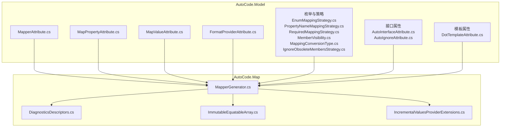
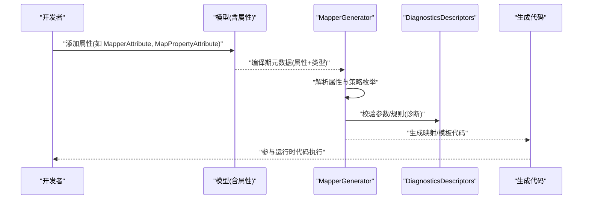
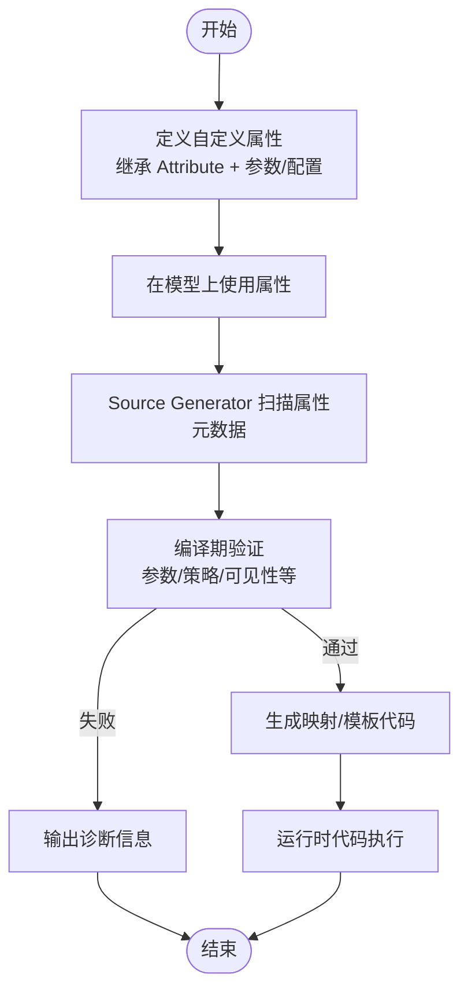
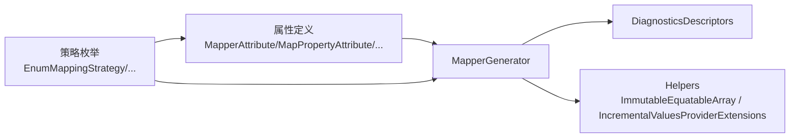

# 自定义属性开发

<cite>
**本文引用的文件**   
- [AutoCode.Model.csproj](file://src/AutoCode.Model/AutoCode.Model.csproj)
- [MapperAttribute.cs](file://src/AutoCode.Model/AutoMapperModel/MapperAttribute.cs)
- [MapPropertyAttribute.cs](file://src/AutoCode.Model/AutoMapperModel/MapPropertyAttribute.cs)
- [MapValueAttribute.cs](file://src/AutoCode.Model/AutoMapperModel/MapValueAttribute.cs)
- [FormatProviderAttribute.cs](file://src/AutoCode.Model/AutoMapperModel/FormatProviderAttribute.cs)
- [EnumMappingStrategy.cs](file://src/AutoCode.Model/AutoMapperModel/EnumMappingStrategy.cs)
- [PropertyNameMappingStrategy.cs](file://src/AutoCode.Model/AutoMapperModel/PropertyNameMappingStrategy.cs)
- [RequiredMappingStrategy.cs](file://src/AutoCode.Model/AutoMapperModel/RequiredMappingStrategy.cs)
- [MemberVisibility.cs](file://src/AutoCode.Model/AutoMapperModel/MemberVisibility.cs)
- [MappingConversionType.cs](file://src/AutoCode.Model/AutoMapperModel/MappingConversionType.cs)
- [IgnoreObsoleteMembersStrategy.cs](file://src/AutoCode.Model/AutoMapperModel/IgnoreObsoleteMembersStrategy.cs)
- [AutoInterfaceAttribute.cs](file://src/AutoCode.Model/InterfaceAttribute/AutoInterfaceAttribute.cs)
- [AutoIgnoreAttribute.cs](file://src/AutoCode.Model/InterfaceAttribute/AutoIgnoreAttribute.cs)
- [DotTemplateAttribute.cs](file://src/AutoCode.Model/DotFileAttribute/DotTemplateAttribute.cs)
- [Behavior.cs](file://src/Auto.MapModels/Behavior.cs)
- [DiagnosticsDescriptors.cs](file://src/AutoCode.Map/Diagnostics/DiagnosticsDescriptors.cs)
- [ImmutableEquatableArray.cs](file://src/AutoCode.Map/Helpers/ImmutableEquatableArray.cs)
- [IncrementalValuesProviderExtensions.cs](file://src/AutoCode.Map/Helpers/IncrementalValuesProviderExtensions.cs)
- [MapperGenerator.cs](file://src/AutoCode.Map/MapperGenerator.cs)
</cite>

## 目录
1. [简介](#简介)
2. [项目结构](#项目结构)
3. [核心组件](#核心组件)
4. [架构总览](#架构总览)
5. [详细组件分析](#详细组件分析)
6. [依赖关系分析](#依赖关系分析)
7. [性能考虑](#性能考虑)
8. [故障排查指南](#故障排查指南)
9. [结论](#结论)
10. [附录](#附录)

## 简介
本文件面向希望在 AutoCode 框架中开发“自定义属性”的开发者，系统讲解 C# 属性的基本结构、在 AutoCode 中的工作原理与最佳实践。内容涵盖：
- 如何继承现有属性基类并扩展参数
- 如何实现属性验证逻辑（编译期诊断）
- 如何处理属性参数与配置选项
- 完整的自定义属性开发示例（定义、元数据处理、编译时验证、运行时行为）
- 属性继承、组合与重用的最佳实践

AutoCode 通过 Source Generator 在编译期读取属性元数据，生成映射或模板代码，从而减少样板代码并提升一致性。

## 项目结构
AutoCode 的属性相关代码主要分布在以下模块：
- 模型与属性定义：AutoCode.Model（包含 AutoMapper 风格属性、接口生成属性、模板属性等）
- 映射生成器：AutoCode.Map（Source Generator，解析属性并生成映射代码）
- 辅助工具：AutoCode.Map 下的 Diagnostics、Helpers 等

图表来源
- [MapperAttribute.cs](file://src/AutoCode.Model/AutoMapperModel/MapperAttribute.cs)
- [MapPropertyAttribute.cs](file://src/AutoCode.Model/AutoMapperModel/MapPropertyAttribute.cs)
- [MapValueAttribute.cs](file://src/AutoCode.Model/AutoMapperModel/MapValueAttribute.cs)
- [FormatProviderAttribute.cs](file://src/AutoCode.Model/AutoMapperModel/FormatProviderAttribute.cs)
- [EnumMappingStrategy.cs](file://src/AutoCode.Model/AutoMapperModel/EnumMappingStrategy.cs)
- [PropertyNameMappingStrategy.cs](file://src/AutoCode.Model/AutoMapperModel/PropertyNameMappingStrategy.cs)
- [RequiredMappingStrategy.cs](file://src/AutoCode.Model/AutoMapperModel/RequiredMappingStrategy.cs)
- [MemberVisibility.cs](file://src/AutoCode.Model/AutoMapperModel/MemberVisibility.cs)
- [MappingConversionType.cs](file://src/AutoCode.Model/AutoMapperModel/MappingConversionType.cs)
- [IgnoreObsoleteMembersStrategy.cs](file://src/AutoCode.Model/AutoMapperModel/IgnoreObsoleteMembersStrategy.cs)
- [AutoInterfaceAttribute.cs](file://src/AutoCode.Model/InterfaceAttribute/AutoInterfaceAttribute.cs)
- [AutoIgnoreAttribute.cs](file://src/AutoCode.Model/InterfaceAttribute/AutoIgnoreAttribute.cs)
- [DotTemplateAttribute.cs](file://src/AutoCode.Model/DotFileAttribute/DotTemplateAttribute.cs)
- [MapperGenerator.cs](file://src/AutoCode.Map/MapperGenerator.cs)
- [DiagnosticsDescriptors.cs](file://src/AutoCode.Map/Diagnostics/DiagnosticsDescriptors.cs)
- [ImmutableEquatableArray.cs](file://src/AutoCode.Map/Helpers/ImmutableEquatableArray.cs)
- [IncrementalValuesProviderExtensions.cs](file://src/AutoCode.Map/Helpers/IncrementalValuesProviderExtensions.cs)

章节来源
- [AutoCode.Model.csproj](file://src/AutoCode.Model/AutoCode.Model.csproj)
- [MapperGenerator.cs](file://src/AutoCode.Map/MapperGenerator.cs)

## 核心组件
- 属性定义层（AutoCode.Model）
  - MapperAttribute：用于标记类型级别的映射规则
  - MapPropertyAttribute：用于字段/属性级别的映射配置
  - MapValueAttribute：为特定目标成员提供常量值映射
  - FormatProviderAttribute：格式化提供者配置
  - 多种策略枚举：控制枚举映射、命名策略、必需映射、成员可见性、转换类型、忽略过时成员等
  - 接口相关属性：AutoInterfaceAttribute、AutoIgnoreAttribute
  - 模板相关属性：DotTemplateAttribute

- 生成器层（AutoCode.Map）
  - MapperGenerator：Source Generator，负责扫描属性、构建元数据、生成映射代码
  - DiagnosticsDescriptors：统一的诊断描述，用于编译期错误/警告
  - Helpers：不可变数组、增量值提供扩展等，提升性能与可比较性

章节来源
- [MapperAttribute.cs](file://src/AutoCode.Model/AutoMapperModel/MapperAttribute.cs)
- [MapPropertyAttribute.cs](file://src/AutoCode.Model/AutoMapperModel/MapPropertyAttribute.cs)
- [MapValueAttribute.cs](file://src/AutoCode.Model/AutoMapperModel/MapValueAttribute.cs)
- [FormatProviderAttribute.cs](file://src/AutoCode.Model/AutoMapperModel/FormatProviderAttribute.cs)
- [EnumMappingStrategy.cs](file://src/AutoCode.Model/AutoMapperModel/EnumMappingStrategy.cs)
- [PropertyNameMappingStrategy.cs](file://src/AutoCode.Model/AutoMapperModel/PropertyNameMappingStrategy.cs)
- [RequiredMappingStrategy.cs](file://src/AutoCode.Model/AutoMapperModel/RequiredMappingStrategy.cs)
- [MemberVisibility.cs](file://src/AutoCode.Model/AutoMapperModel/MemberVisibility.cs)
- [MappingConversionType.cs](file://src/AutoCode.Model/AutoMapperModel/MappingConversionType.cs)
- [IgnoreObsoleteMembersStrategy.cs](file://src/AutoCode.Model/AutoMapperModel/IgnoreObsoleteMembersStrategy.cs)
- [AutoInterfaceAttribute.cs](file://src/AutoCode.Model/InterfaceAttribute/AutoInterfaceAttribute.cs)
- [AutoIgnoreAttribute.cs](file://src/AutoCode.Model/InterfaceAttribute/AutoIgnoreAttribute.cs)
- [DotTemplateAttribute.cs](file://src/AutoCode.Model/DotFileAttribute/DotTemplateAttribute.cs)
- [MapperGenerator.cs](file://src/AutoCode.Map/MapperGenerator.cs)
- [DiagnosticsDescriptors.cs](file://src/AutoCode.Map/Diagnostics/DiagnosticsDescriptors.cs)
- [ImmutableEquatableArray.cs](file://src/AutoCode.Map/Helpers/ImmutableEquatableArray.cs)
- [IncrementalValuesProviderExtensions.cs](file://src/AutoCode.Map/Helpers/IncrementalValuesProviderExtensions.cs)

## 架构总览
AutoCode 的自定义属性工作流如下：
- 开发者在模型上标注属性（如 MapperAttribute、MapPropertyAttribute 等）
- Source Generator（MapperGenerator）在编译期扫描这些属性，提取元数据
- 根据元数据与策略枚举，生成映射代码或模板调用
- 使用 DiagnosticsDescriptors 输出编译期诊断信息（错误或警告）
- 生成的代码参与后续运行时代码执行

图表来源
- [MapperGenerator.cs](file://src/AutoCode.Map/MapperGenerator.cs)
- [DiagnosticsDescriptors.cs](file://src/AutoCode.Map/Diagnostics/DiagnosticsDescriptors.cs)
- [MapperAttribute.cs](file://src/AutoCode.Model/AutoMapperModel/MapperAttribute.cs)
- [MapPropertyAttribute.cs](file://src/AutoCode.Model/AutoMapperModel/MapPropertyAttribute.cs)

## 详细组件分析

### 属性基类与继承模式
- 建议以 System.Attribute 为基类创建自定义属性
- 通过构造函数接收必要参数，并提供可选属性用于配置项
- 若需要与其他属性组合，确保属性支持多实例标注且参数互不冲突

最佳实践
- 将必填参数放在构造函数中，可选配置作为公共只读属性
- 对参数进行基础合法性检查（例如非空、范围），并在生成器中进行深度校验
- 避免在属性中实现复杂逻辑，保持轻量与可序列化

章节来源
- [MapperAttribute.cs](file://src/AutoCode.Model/AutoMapperModel/MapperAttribute.cs)
- [MapPropertyAttribute.cs](file://src/AutoCode.Model/AutoMapperModel/MapPropertyAttribute.cs)
- [MapValueAttribute.cs](file://src/AutoCode.Model/AutoMapperModel/MapValueAttribute.cs)
- [FormatProviderAttribute.cs](file://src/AutoCode.Model/AutoMapperModel/FormatProviderAttribute.cs)

### 属性验证逻辑（编译期诊断）
- 在 Source Generator 中读取属性后，使用 DiagnosticsDescriptors 统一输出诊断
- 常见校验包括：参数有效性、策略兼容性、成员可见性、必需映射缺失等
- 诊断应明确错误位置与修复建议，便于快速定位问题

章节来源
- [DiagnosticsDescriptors.cs](file://src/AutoCode.Map/Diagnostics/DiagnosticsDescriptors.cs)
- [MapperGenerator.cs](file://src/AutoCode.Map/MapperGenerator.cs)

### 处理属性参数与配置选项
- 参数设计原则：最小化必填项，最大化可选配置；使用枚举表达策略
- 常用策略枚举：
  - EnumMappingStrategy：枚举映射策略
  - PropertyNameMappingStrategy：属性名映射策略
  - RequiredMappingStrategy：必需映射策略
  - MemberVisibility：成员可见性
  - MappingConversionType：转换类型
  - IgnoreObsoleteMembersStrategy：忽略过时成员策略
- 组合多个属性时，注意优先级与冲突解决策略

章节来源
- [EnumMappingStrategy.cs](file://src/AutoCode.Model/AutoMapperModel/EnumMappingStrategy.cs)
- [PropertyNameMappingStrategy.cs](file://src/AutoCode.Model/AutoMapperModel/PropertyNameMappingStrategy.cs)
- [RequiredMappingStrategy.cs](file://src/AutoCode.Model/AutoMapperModel/RequiredMappingStrategy.cs)
- [MemberVisibility.cs](file://src/AutoCode.Model/AutoMapperModel/MemberVisibility.cs)
- [MappingConversionType.cs](file://src/AutoCode.Model/AutoMapperModel/MappingConversionType.cs)
- [IgnoreObsoleteMembersStrategy.cs](file://src/AutoCode.Model/AutoMapperModel/IgnoreObsoleteMembersStrategy.cs)

### 完整自定义属性开发示例（端到端流程）
- 定义属性：继承 Attribute，声明构造函数与配置属性
- 元数据处理：在 Source Generator 中读取属性，构建内部模型
- 编译时验证：使用 DiagnosticsDescriptors 输出错误/警告
- 生成代码：根据属性与策略生成映射或模板调用
- 运行时行为：生成的代码参与业务逻辑执行

图表来源
- [MapperGenerator.cs](file://src/AutoCode.Map/MapperGenerator.cs)
- [DiagnosticsDescriptors.cs](file://src/AutoCode.Map/Diagnostics/DiagnosticsDescriptors.cs)
- [MapperAttribute.cs](file://src/AutoCode.Model/AutoMapperModel/MapperAttribute.cs)
- [MapPropertyAttribute.cs](file://src/AutoCode.Model/AutoMapperModel/MapPropertyAttribute.cs)

### 接口与模板相关属性
- 接口生成：AutoInterfaceAttribute、AutoIgnoreAttribute 控制接口自动生成与忽略成员
- 模板生成：DotTemplateAttribute 配合模板引擎生成代码

章节来源
- [AutoInterfaceAttribute.cs](file://src/AutoCode.Model/InterfaceAttribute/AutoInterfaceAttribute.cs)
- [AutoIgnoreAttribute.cs](file://src/AutoCode.Model/InterfaceAttribute/AutoIgnoreAttribute.cs)
- [DotTemplateAttribute.cs](file://src/AutoCode.Model/DotFileAttribute/DotTemplateAttribute.cs)

### 行为与辅助
- Behavior：封装通用行为逻辑，供属性或生成器复用
- ImmutableEquatableArray：不可变数组，提升比较与缓存效率
- IncrementalValuesProviderExtensions：增量值提供扩展，优化 Source Generator 性能

章节来源
- [Behavior.cs](file://src/Auto.MapModels/Behavior.cs)
- [ImmutableEquatableArray.cs](file://src/AutoCode.Map/Helpers/ImmutableEquatableArray.cs)
- [IncrementalValuesProviderExtensions.cs](file://src/AutoCode.Map/Helpers/IncrementalValuesProviderExtensions.cs)

## 依赖关系分析
- 属性定义（AutoCode.Model）被生成器（AutoCode.Map）消费
- 生成器依赖诊断描述与辅助工具，保证编译期质量与性能
- 策略枚举贯穿属性与生成器，形成一致的规则体系

图表来源
- [MapperGenerator.cs](file://src/AutoCode.Map/MapperGenerator.cs)
- [DiagnosticsDescriptors.cs](file://src/AutoCode.Map/Diagnostics/DiagnosticsDescriptors.cs)
- [ImmutableEquatableArray.cs](file://src/AutoCode.Map/Helpers/ImmutableEquatableArray.cs)
- [IncrementalValuesProviderExtensions.cs](file://src/AutoCode.Map/Helpers/IncrementalValuesProviderExtensions.cs)
- [EnumMappingStrategy.cs](file://src/AutoCode.Model/AutoMapperModel/EnumMappingStrategy.cs)
- [PropertyNameMappingStrategy.cs](file://src/AutoCode.Model/AutoMapperModel/PropertyNameMappingStrategy.cs)
- [RequiredMappingStrategy.cs](file://src/AutoCode.Model/AutoMapperModel/RequiredMappingStrategy.cs)
- [MemberVisibility.cs](file://src/AutoCode.Model/AutoMapperModel/MemberVisibility.cs)
- [MappingConversionType.cs](file://src/AutoCode.Model/AutoMapperModel/MappingConversionType.cs)
- [IgnoreObsoleteMembersStrategy.cs](file://src/AutoCode.Model/AutoMapperModel/IgnoreObsoleteMembersStrategy.cs)

章节来源
- [MapperGenerator.cs](file://src/AutoCode.Map/MapperGenerator.cs)
- [AutoCode.Model.csproj](file://src/AutoCode.Model/AutoCode.Model.csproj)

## 性能考虑
- 使用不可变数据结构（如 ImmutableEquatableArray）减少比较开销
- 利用增量值提供（IncrementalValuesProviderExtensions）降低重复计算
- 属性保持轻量，复杂逻辑放入生成器或运行时服务
- 合理划分策略枚举，避免在属性中传递过多字符串参数

[本节为通用指导，无需引用具体文件]

## 故障排查指南
- 编译期错误/警告：查看 DiagnosticsDescriptors 中的诊断消息，定位属性参数或策略冲突
- 常见问题：
  - 属性参数非法（如空值、越界）
  - 策略不兼容（如枚举映射策略与目标类型不匹配）
  - 成员可见性不足导致无法访问
  - 必需映射缺失（RequiredMappingStrategy）
- 调试建议：
  - 简化属性配置，逐步增加复杂度
  - 使用最小复现用例隔离问题
  - 关注生成器输出的诊断信息与位置

章节来源
- [DiagnosticsDescriptors.cs](file://src/AutoCode.Map/Diagnostics/DiagnosticsDescriptors.cs)
- [MapperGenerator.cs](file://src/AutoCode.Map/MapperGenerator.cs)

## 结论
AutoCode 的自定义属性开发围绕“属性定义 + 生成器解析 + 编译期诊断 + 代码生成”的闭环展开。通过清晰的属性结构与策略枚举，结合强大的 Source Generator，开发者可以高效地扩展框架能力，获得一致、可维护的代码生成体验。遵循本文的最佳实践，可以在继承、组合与重用方面取得更好的效果。

[本节为总结，无需引用具体文件]

## 附录
- 参考文件清单与路径已在文档开头列出，便于查阅具体实现细节
- 建议在新增属性时同步更新策略枚举与诊断描述，保持体系一致性

[本节为补充说明，无需引用具体文件]
