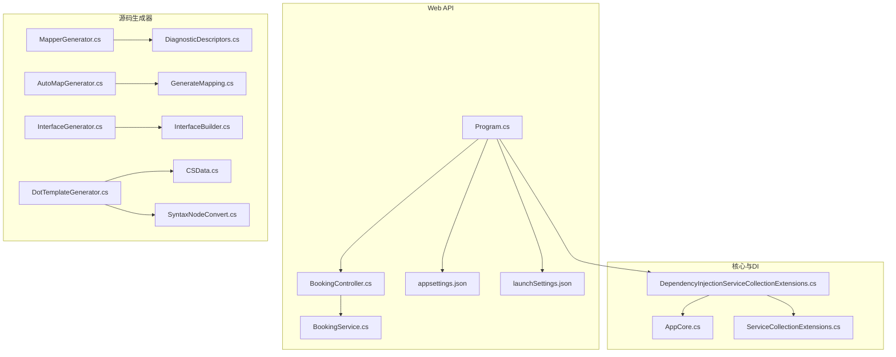
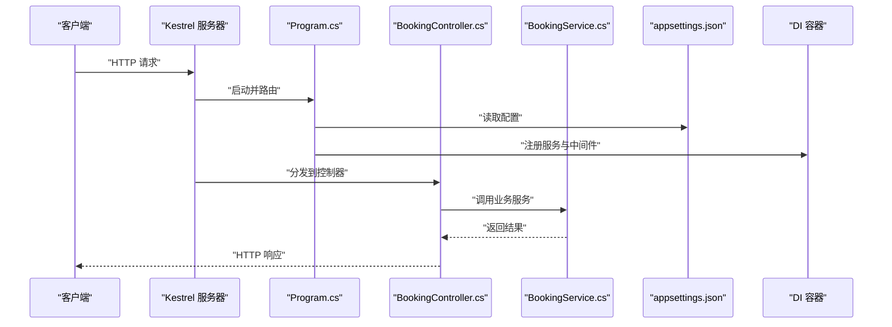
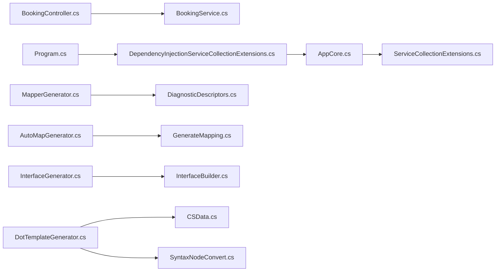

# 故障排除

<cite>
**本文引用的文件**   
- [troubleshooting.md](file://docs/troubleshooting.md)
- [configuration.md](file://docs/configuration.md)
- [V2Gate.cs](file://src/AutoCode.Generators/V2/V2Gate.cs)
- [DtoGenerator.cs](file://src/AutoCode.Generators/V2/DtoGenerator.cs)
- [CodeWriter.cs](file://src/AutoCode.Engine/CodeBuilder/CodeWriter.cs)
- [DiagnosticCollector.cs](file://src/AutoCode.Engine/Diagnostics/DiagnosticCollector.cs)
- [CodeBuilderTests.cs](file://src/AutoCode.Tests.V2/CodeBuilderTests.cs)
</cite>

## 更新摘要
**变更内容**   
- 新增了详细的故障排除章节，涵盖 V1/V2 冲突、可空注解警告、IDE 缓存问题等常见问题的解决方案
- 更新了生成器不生效和类型重复定义的诊断步骤
- 增强了可空注解相关问题的解决方案
- 添加了 IDE 缓存清理和构建服务器重启的具体操作指南

## 目录
1. [简介](#简介)
2. [项目结构](#项目结构)
3. [核心组件](#核心组件)
4. [架构总览](#架构总览)
5. [详细组件分析](#详细组件分析)
6. [依赖关系分析](#依赖关系分析)
7. [性能注意事项](#性能注意事项)
8. [故障排除指南](#故障排除指南)
9. [结论](#结论)
10. [附录](#附录)

## 简介
本指南面向使用 AutoCode 项目的开发者与运维人员，聚焦于编译期、运行期、性能与配置四类常见问题。内容涵盖错误诊断步骤、日志分析方法、问题定位技巧，以及社区支持与贡献流程，帮助用户快速定位并解决问题。

## 项目结构
本项目包含 Web API 应用、依赖注入与扩展、源码生成器（映射、接口、模板）等模块。关键入口与配置文件位于 APP.WebAPI 项目；依赖注入与核心应用在 APP.WebAPI.Core；各类源码生成器分布在 AutoCode.* 命名空间下。



图表来源
- [Program.cs](file://src/APP.WebAPI/Program.cs)
- [BookingController.cs](file://src/APP.WebAPI/Controllers/BookingController.cs)
- [BookingService.cs](file://src/APP.WebAPI/Services/BookingService.cs)
- [appsettings.json](file://src/APP.WebAPI/appsettings.json)
- [launchSettings.json](file://src/APP.WebAPI/Properties/launchSettings.json)
- [DependencyInjectionServiceCollectionExtensions.cs](file://src/APP.WebAPI.Core/DependencyInjection/DependencyInjectionServiceCollectionExtensions.cs)
- [AppCore.cs](file://src/APP.WebAPI.Core/Application/AppCore.cs)
- [ServiceCollectionExtensions.cs](file://src/APP.WebAPI.Core/Application/Extensions/ServiceCollectionExtensions.cs)
- [MapperGenerator.cs](file://src/AutoCode.Map/MapperGenerator.cs)
- [DiagnosticDescriptors.cs](file://src/AutoCode.Map/Diagnostics/DiagnosticDescriptors.cs)
- [AutoMapGenerator.cs](file://src/AutoCode.MapDebug/AutoMapGenerator.cs)
- [GenerateMapping.cs](file://src/AutoCode.MapDebug/GenerateMapping.cs)
- [InterfaceGenerator.cs](file://src/AutoCodeGenerator/InterfaceAutoBuilder/InterfaceGenerator.cs)
- [InterfaceBuilder.cs](file://src/AutoCodeGenerator/InterfaceAutoBuilder/InterfaceBuilder.cs)
- [DotTemplateGenerator.cs](file://src/AutoCode.XmlTemplate.SourceGenerator/DotTemplateGenerator.cs)
- [CSData.cs](file://src/AutoCode.XmlTemplate.SourceGenerator/CSData.cs)
- [SyntaxNodeConvert.cs](file://src/AutoCode.XmlTemplate.SourceGenerator/SyntaxNodeConvert.cs)

章节来源
- [README.md](file://README.md)

## 核心组件
- Web API 启动与配置：Program.cs 负责构建主机、加载配置、注册服务与中间件。
- 控制器与服务：BookingController.cs 暴露 HTTP 端点，BookingService.cs 封装业务逻辑。
- 依赖注入与核心：DependencyInjectionServiceCollectionExtensions.cs 集中注册服务；AppCore.cs 提供核心初始化；ServiceCollectionExtensions.cs 提供扩展方法。
- 源码生成器：MapperGenerator.cs、AutoMapGenerator.cs、InterfaceGenerator.cs、DotTemplateGenerator.cs 等负责在编译期生成代码，提升开发效率。

章节来源
- [Program.cs](file://src/APP.WebAPI/Program.cs)
- [BookingController.cs](file://src/APP.WebAPI/Controllers/BookingController.cs)
- [BookingService.cs](file://src/APP.WebAPI/Services/BookingService.cs)
- [DependencyInjectionServiceCollectionExtensions.cs](file://src/APP.WebAPI.Core/DependencyInjection/DependencyInjectionServiceCollectionExtensions.cs)
- [AppCore.cs](file://src/APP.WebAPI.Core/Application/AppCore.cs)
- [ServiceCollectionExtensions.cs](file://src/APP.WebAPI.Core/Application/Extensions/ServiceCollectionExtensions.cs)

## 架构总览
下图展示请求从进入 Web API 到调用服务与配置的典型路径，以及源码生成器在编译期的作用位置。



图表来源
- [Program.cs](file://src/APP.WebAPI/Program.cs)
- [BookingController.cs](file://src/APP.WebAPI/Controllers/BookingController.cs)
- [BookingService.cs](file://src/APP.WebAPI/Services/BookingService.cs)
- [appsettings.json](file://src/APP.WebAPI/appsettings.json)

## 详细组件分析

### Web API 启动与配置
- 启动流程：Program.cs 中创建主机、加载 appsettings.json 与 launchSettings.json、注册服务与中间件、监听端口。
- 常见配置错误：端口冲突、环境变量未生效、JSON 配置语法错误、缺少必需的配置项。
- 诊断要点：检查 launchSettings.json 的端口设置；确认 appsettings.json 的键值与类型；查看控制台输出中的启动日志。

章节来源
- [Program.cs](file://src/APP.WebAPI/Program.cs)
- [appsettings.json](file://src/APP.WebAPI/appsettings.json)
- [launchSettings.json](file://src/APP.WebAPI/Properties/launchSettings.json)

### 控制器与服务
- BookingController.cs 定义 REST 端点，接收参数并调用 BookingService.cs。
- BookingService.cs 实现具体业务逻辑，可能涉及数据访问或外部服务调用。
- 常见问题：参数绑定失败、服务未正确注册、异常未捕获导致 5xx 响应。
- 诊断要点：检查控制器方法与路由；确认服务生命周期与注册；添加结构化日志记录关键路径。

章节来源
- [BookingController.cs](file://src/APP.WebAPI/Controllers/BookingController.cs)
- [BookingService.cs](file://src/APP.WebAPI/Services/BookingService.cs)

### 依赖注入与核心
- DependencyInjectionServiceCollectionExtensions.cs 集中注册服务，便于统一管理生命周期与作用域。
- AppCore.cs 提供核心初始化逻辑，如数据库连接、缓存、第三方 SDK 初始化。
- ServiceCollectionExtensions.cs 提供通用扩展方法，简化服务注册与配置。
- 常见问题：循环依赖、作用域误用、单例持有瞬态依赖。
- 诊断要点：查看 DI 容器的异常堆栈；检查构造函数注入顺序；避免在服务间共享可变状态。

章节来源
- [DependencyInjectionServiceCollectionExtensions.cs](file://src/APP.WebAPI.Core/DependencyInjection/DependencyInjectionServiceCollectionExtensions.cs)
- [AppCore.cs](file://src/APP.WebAPI.Core/Application/AppCore.cs)
- [ServiceCollectionExtensions.cs](file://src/APP.WebAPI.Core/Application/Extensions/ServiceCollectionExtensions.cs)

### 源码生成器（映射、接口、模板）
- MapperGenerator.cs 与 DiagnosticDescriptors.cs 负责映射代码生成与诊断信息输出。
- AutoMapGenerator.cs 与 GenerateMapping.cs 用于调试与生成映射逻辑。
- InterfaceGenerator.cs 与 InterfaceBuilder.cs 自动生成接口与实现骨架。
- DotTemplateGenerator.cs、CSData.cs、SyntaxNodeConvert.cs 处理模板与语法节点转换。
- 常见问题：模板语法错误、属性名不匹配、生成器版本不一致、增量编译失效。
- 诊断要点：查看生成器诊断消息；启用详细日志；检查模板文件与模型一致性；清理并重建项目。

章节来源
- [MapperGenerator.cs](file://src/AutoCode.Map/MapperGenerator.cs)
- [DiagnosticDescriptors.cs](file://src/AutoCode.Map/Diagnostics/DiagnosticDescriptors.cs)
- [AutoMapGenerator.cs](file://src/AutoCode.MapDebug/AutoMapGenerator.cs)
- [GenerateMapping.cs](file://src/AutoCode.MapDebug/GenerateMapping.cs)
- [InterfaceGenerator.cs](file://src/AutoCodeGenerator/InterfaceAutoBuilder/InterfaceGenerator.cs)
- [InterfaceBuilder.cs](file://src/AutoCodeGenerator/InterfaceAutoBuilder/InterfaceBuilder.cs)
- [DotTemplateGenerator.cs](file://src/AutoCode.XmlTemplate.SourceGenerator/DotTemplateGenerator.cs)
- [CSData.cs](file://src/AutoCode.XmlTemplate.SourceGenerator/CSData.cs)
- [SyntaxNodeConvert.cs](file://src/AutoCode.XmlTemplate.SourceGenerator/SyntaxNodeConvert.cs)

## 依赖关系分析
- Web API 层依赖核心与 DI 扩展，控制器依赖服务，服务依赖基础设施（数据库、缓存、外部 API）。
- 源码生成器作为编译期工具，对运行时无直接依赖，但会影响生成的代码质量与性能。
- 潜在循环依赖：服务之间互相引用；DI 注册不当导致解析失败。
- 建议：通过接口解耦、明确生命周期、避免跨层直接依赖。



图表来源
- [Program.cs](file://src/APP.WebAPI/Program.cs)
- [BookingController.cs](file://src/APP.WebAPI/Controllers/BookingController.cs)
- [BookingService.cs](file://src/APP.WebAPI/Services/BookingService.cs)
- [DependencyInjectionServiceCollectionExtensions.cs](file://src/APP.WebAPI.Core/DependencyInjection/DependencyInjectionServiceCollectionExtensions.cs)
- [AppCore.cs](file://src/APP.WebAPI.Core/Application/AppCore.cs)
- [ServiceCollectionExtensions.cs](file://src/APP.WebAPI.Core/Application/Extensions/ServiceCollectionExtensions.cs)
- [MapperGenerator.cs](file://src/AutoCode.Map/MapperGenerator.cs)
- [DiagnosticDescriptors.cs](file://src/AutoCode.Map/Diagnostics/DiagnosticDescriptors.cs)
- [AutoMapGenerator.cs](file://src/AutoCode.MapDebug/AutoMapGenerator.cs)
- [GenerateMapping.cs](file://src/AutoCode.MapDebug/GenerateMapping.cs)
- [InterfaceGenerator.cs](file://src/AutoCodeGenerator/InterfaceAutoBuilder/InterfaceGenerator.cs)
- [InterfaceBuilder.cs](file://src/AutoCodeGenerator/InterfaceAutoBuilder/InterfaceBuilder.cs)
- [DotTemplateGenerator.cs](file://src/AutoCode.XmlTemplate.SourceGenerator/DotTemplateGenerator.cs)
- [CSData.cs](file://src/AutoCode.XmlTemplate.SourceGenerator/CSData.cs)
- [SyntaxNodeConvert.cs](file://src/AutoCode.XmlTemplate.SourceGenerator/SyntaxNodeConvert.cs)

## 性能注意事项
- 启动优化：延迟加载非关键服务；减少启动时 I/O 操作；合理配置并发线程数。
- 请求处理：避免阻塞调用；使用异步 I/O；限制请求体大小；启用响应压缩。
- 内存管理：避免大对象频繁分配；合理使用单例与缓存；监控 GC 压力。
- 源码生成器：增量编译可减少生成开销；避免在生成器中进行重型计算。

## 故障排除指南

### 生成器不生效 / 没有生成任何代码

#### 症状
标记了 `[AutoInterface]`、`[AutoDTO]` 等特性，编译成功但找不到生成的接口/类。

#### 排查步骤

**1. 确认 NuGet 包或 Analyzer 引用正确**

```xml
<!-- NuGet 方式 -->
<PackageReference Include="AM.AutoCode" Version="2.3.0" />

<!-- 或 ProjectReference 方式（本项目源码消费） -->
<ProjectReference Include="..\AutoCode.Generators\AutoCode.Generators.csproj"
                  OutputItemType="Analyzer" ReferenceOutputAssembly="false" />
```

**2. 检查 CS8785 警告（生成器静默失效）**

编译输出中若出现：

```
warning CS8785: 生成器"XxxGenerator"未能生成源...FileNotFoundException: Could not load file or assembly 'AutoCode.Engine...'
```

说明生成器的依赖程序集未传递给编译器。**此问题已在 2.3.1 修复** — 升级到最新版本即可。若使用 ProjectReference 源码方式引用，确保 `AutoCode.Generators.csproj` 中包含 `GetDependencyTargetPaths` 目标（2.3.1+ 内置）。

**3. 查看生成输出目录**

在 `.csproj` 中添加以下属性后重新编译，生成的 `.g.cs` 文件会输出到 `obj/Debug/<tfm>/generated/` 目录：

```xml
<EmitCompilerGeneratedFiles>true</EmitCompilerGeneratedFiles>
```

**4. 确认特性命名空间**

```csharp
using AutoCode.Model;  // 所有 Auto* 特性所在命名空间
```

### CS0101 / CS0111：类型重复定义

#### 症状
```
error CS0101: 命名空间"MyApp.Models"已经包含"UserDto"的定义
error CS0111: 类型"AutoDependencyInjection"已定义了一个名为"AddAutoDI"的具有相同参数类型的成员
```

#### 原因
V1 与 V2 生成器监听相同特性（如 `[AutoInterface]`、`[AutoDTO]`），当 V2 被启用（`AutoCode_EnableV2=true`）而 V1 也在运行时，同一类型会被生成两次。

#### 解决方案

**默认配置下不应出现此问题**（V2 默认关闭）。若你显式启用了 V2：

```xml
<AutoCode_EnableV2>true</AutoCode_EnableV2>
```

则需确保 V1 不处理相同特性。当前版本 V1 始终运行且不可独立关闭（V1 承担着 `[DotTemplate]`、`[AutoIntercept]` 等独有功能），因此：

- **推荐**：保持默认 `AutoCode_EnableV2` 为 `false`，仅使用 V1
- 如需 V2 特性（级联生成 `[AutoEntity]`、跨类型映射 `[MapFrom]`），注意这些特性 V1 不处理，启用 V2 不会冲突

详细说明见 [V1/V2 迁移指南](v1-v2-migration.md)。

### CS8669：生成代码中的可空注解警告

#### 症状
```
warning CS8669: 对可 null 的引用类型的批注只应在"#nullable"批注上下文中的代码中使用
```

#### 原因
生成的 `.g.cs` 文件包含 `string?` 等可空注解，但文件未声明 `#nullable enable`。

#### 解决方案

**已在 2.3.1 修复**（生成器现在自动输出 `#nullable enable`）。升级即可。

### CS8618：生成的 DTO 属性未初始化

#### 症状
```
warning CS8618: 在退出构造函数时，不可为 null 的属性"Name"必须包含非 null 值
```

#### 解决方案

**已在 2.3.1 修复**：`DtoGenerator` 现在为非空引用类型属性自动生成 `= default!;` 初始化。

### 生成器修改后不生效（IDE 缓存）

#### 症状
修改了特性或配置，但 IDE 中生成的代码没有更新。

#### 解决方案

```bash
# 关闭 Roslyn 构建服务器清除缓存
dotnet build-server shutdown

# 强制全量重建
dotnet build -t:Rebuild
```

在 Visual Studio 中：关闭解决方案 → 删除 `.vs` 目录 → 重新打开。

### NuGet 包方式引用时分析器（AC001 等）不提示

#### 原因
`AM.AutoCode` 包将生成器与分析器打包在 `analyzers/dotnet/cs` 目录，只有**编译时**才会加载。IDE 实时分析需要项目引用了 `AutoCode.Analyzers.dll`。

#### 解决方案
确认使用 2.3.1+ 版本的包，其 analyzers 目录包含完整依赖（`AutoCode.Model.dll`、`AutoCode.Engine.dll`、`System.Text.Json.dll` 等）。

### PDB 文件损坏错误（CS0009）

#### 症状
```
error CS0009: 无法打开元数据文件"...AutoCode.Model.pdb" — Unknown file format
```

#### 解决方案
这是构建缓存损坏，清理后重建：

```bash
dotnet build-server shutdown
# 删除对应项目的 bin/obj 目录后重新构建
dotnet build
```

### 中国大陆网络环境：NuGet/GitHub 访问失败

#### 症状
`dotnet restore` 或 `git pull` 超时：`Failed to connect to github.com:443` / `nuget.org 无法访问`。

#### 解决方案

**Git 代理配置**（以本地代理端口 7890 为例）：

```bash
git config --global http.proxy http://127.0.0.1:7890
git config --global https.proxy http://127.0.0.1:7890
```

**NuGet 镜像**：使用国内镜像源（如华为云、腾讯云镜像），在 `NuGet.config` 中配置。

### IL2026：DataAnnotations 裁剪警告

#### 症状
```
warning IL2026: Using member 'System.ComponentModel.DataAnnotations.MaxLengthAttribute...' can break functionality when trimming
```

#### 说明
这是 .NET 8 对 `DataAnnotations` 部分特性的固有裁剪警告（`MaxLength`/`MinLength` 对非 ICollection 类型使用反射），与 AutoCode 无关。AutoCode 生成的验证代码本身零反射、AOT 兼容。

若项目启用了 `<IsAotCompatible>true</IsAotCompatible>`，可选择：

- 忽略（功能不受影响，仅在 trimming 时可能裁剪反射路径）
- 改用 AutoCode 的 `[AutoValidator]` 编译时验证（完全无反射）

### 获取帮助
- 运行 `dotnet autocode doctor` 自动诊断
- 查看 [配置参考](configuration.md) 确认配置项正确
- 查看 [V1/V2 迁移指南](v1-v2-migration.md) 了解生成器行为差异
- GitHub Issues：<https://github.com/alivy/AutoCode/issues>

**章节来源**
- [troubleshooting.md:7-192](file://docs/troubleshooting.md#L7-L192)
- [V2Gate.cs:7-43](file://src/AutoCode.Generators/V2/V2Gate.cs#L7-L43)
- [DtoGenerator.cs:154-220](file://src/AutoCode.Generators/V2/DtoGenerator.cs#L154-L220)
- [CodeWriter.cs:72-79](file://src/AutoCode.Engine/CodeBuilder/CodeWriter.cs#L72-L79)
- [CodeBuilderTests.cs:42-51](file://src/AutoCode.Tests.V2/CodeBuilderTests.cs#L42-L51)

### 编译期问题
- 症状：生成器报错、模板解析失败、属性映射缺失。
- 诊断步骤：
  - 查看生成器诊断消息与警告列表。
  - 清理并重建项目，确保增量编译状态一致。
  - 检查模板文件与模型定义是否同步更新。
  - 验证生成器版本与目标框架兼容性。
- 常见原因：模板语法错误、属性名不一致、生成器配置不正确。
- 解决建议：修正模板语法；统一命名策略；升级或降级生成器版本以匹配环境。

章节来源
- [MapperGenerator.cs](file://src/AutoCode.Map/MapperGenerator.cs)
- [DiagnosticDescriptors.cs](file://src/AutoCode.Map/Diagnostics/DiagnosticDescriptors.cs)
- [AutoMapGenerator.cs](file://src/AutoCode.MapDebug/AutoMapGenerator.cs)
- [GenerateMapping.cs](file://src/AutoCode.MapDebug/GenerateMapping.cs)
- [InterfaceGenerator.cs](file://src/AutoCodeGenerator/InterfaceAutoBuilder/InterfaceGenerator.cs)
- [InterfaceBuilder.cs](file://src/AutoCodeGenerator/InterfaceAutoBuilder/InterfaceBuilder.cs)
- [DotTemplateGenerator.cs](file://src/AutoCode.XmlTemplate.SourceGenerator/DotTemplateGenerator.cs)
- [CSData.cs](file://src/AutoCode.XmlTemplate.SourceGenerator/CSData.cs)
- [SyntaxNodeConvert.cs](file://src/AutoCode.XmlTemplate.SourceGenerator/SyntaxNodeConvert.cs)

### 运行时异常
- 症状：5xx 错误、空引用异常、依赖解析失败。
- 诊断步骤：
  - 查看应用日志与异常堆栈，定位触发点。
  - 检查控制器输入参数与服务依赖是否正确注册。
  - 验证配置项是否存在且类型正确。
  - 复现问题并缩小范围，逐步隔离模块。
- 常见原因：服务未注册、作用域误用、配置缺失、外部依赖不可用。
- 解决建议：完善 DI 注册；增加健壮的错误处理；为配置项提供默认值与校验。

章节来源
- [Program.cs](file://src/APP.WebAPI/Program.cs)
- [BookingController.cs](file://src/APP.WebAPI/Controllers/BookingController.cs)
- [BookingService.cs](file://src/APP.WebAPI/Services/BookingService.cs)
- [DependencyInjectionServiceCollectionExtensions.cs](file://src/APP.WebAPI.Core/DependencyInjection/DependencyInjectionServiceCollectionExtensions.cs)
- [AppCore.cs](file://src/APP.WebAPI.Core/Application/AppCore.cs)
- [ServiceCollectionExtensions.cs](file://src/APP.WebAPI.Core/Application/Extensions/ServiceCollectionExtensions.cs)

### 性能问题
- 症状：高 CPU、内存泄漏、请求延迟升高。
- 诊断步骤：
  - 使用性能分析工具采集 CPU 与内存快照。
  - 检查慢查询与阻塞调用，优化异步与并发。
  - 分析 GC 行为，减少临时对象分配。
  - 评估源码生成器对构建时间的影响。
- 常见原因：同步 I/O、未释放资源、缓存过大、生成器重复工作。
- 解决建议：引入缓存与连接池；优化算法与数据结构；启用增量编译与并行构建。

### 配置错误
- 症状：启动失败、端口占用、环境变量未生效。
- 诊断步骤：
  - 检查 launchSettings.json 与 appsettings.json 的端口与路径。
  - 验证环境变量优先级与覆盖规则。
  - 查看启动日志中的配置加载信息。
- 常见原因：端口冲突、JSON 格式错误、环境变量命名不规范。
- 解决建议：统一配置命名；使用配置校验；避免硬编码端口。

章节来源
- [Program.cs](file://src/APP.WebAPI/Program.cs)
- [appsettings.json](file://src/APP.WebAPI/appsettings.json)
- [launchSettings.json](file://src/APP.WebAPI/Properties/launchSettings.json)

### 日志分析方法
- 建议启用结构化日志，记录请求 ID、用户标识、关键参数与耗时。
- 将异常堆栈与上下文信息写入日志，便于回溯。
- 使用日志聚合平台进行检索与告警。

### 问题定位技巧
- 最小化复现：剥离无关模块，聚焦问题核心。
- 断点与打印：在关键路径插入断点与日志，观察数据流。
- 对比基线：与正常版本对比差异，定位变更影响。

### 社区支持与贡献
- 社区资源：查阅 README 与文档，参与讨论区与问题跟踪。
- 问题报告模板：描述环境、复现步骤、期望与实际结果、日志与截图。
- 贡献指南：遵循编码规范、提交 PR 前运行测试、保持变更可追溯。

章节来源
- [README.md](file://README.md)

## 结论
通过系统化的故障排除流程，结合日志分析与性能调优，能够快速定位并解决编译、运行、性能与配置类问题。建议团队建立统一的诊断标准与知识库，提升问题解决效率与稳定性。

## 附录
- 相关文档与模型：AutoCode.pdma.json 可用于理解领域模型与数据流转。

章节来源
- [AutoCode.pdma.json](file://src/Doc/AutoCode.pdma.json)