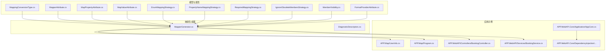
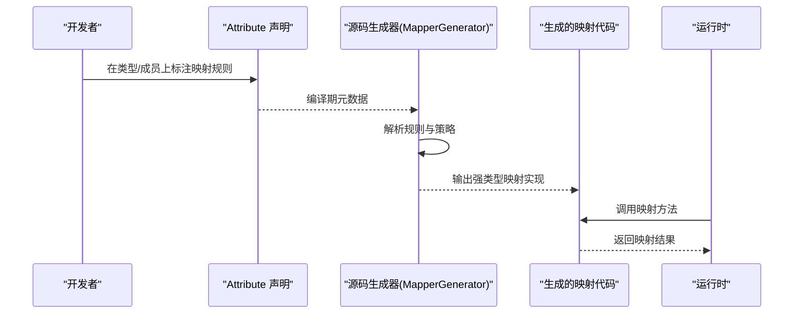
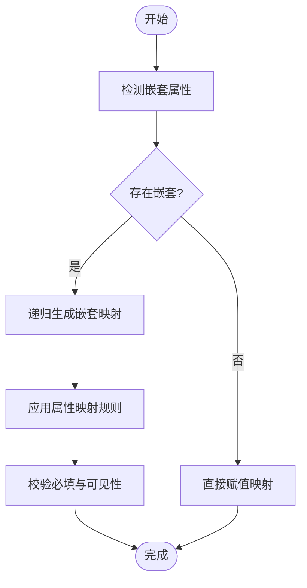
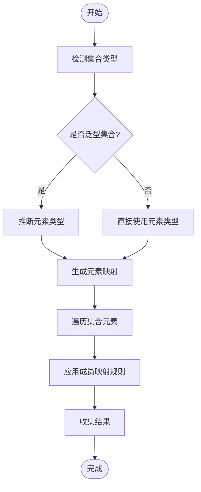
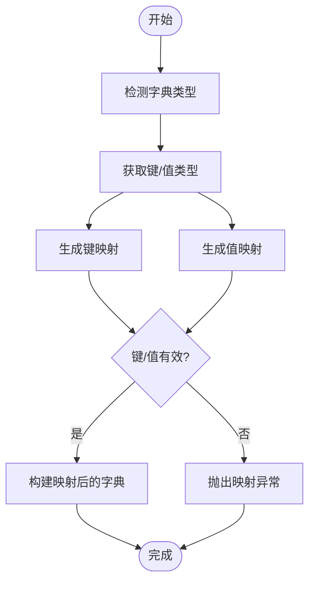
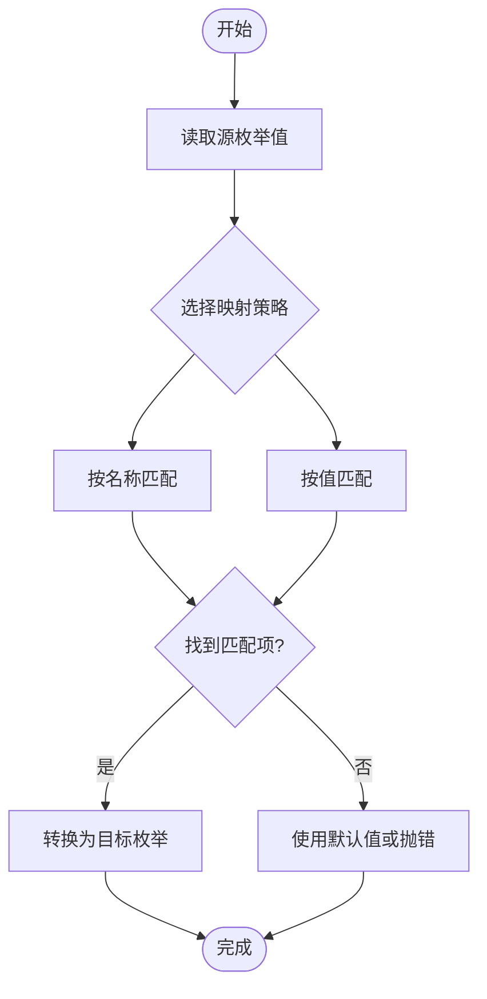
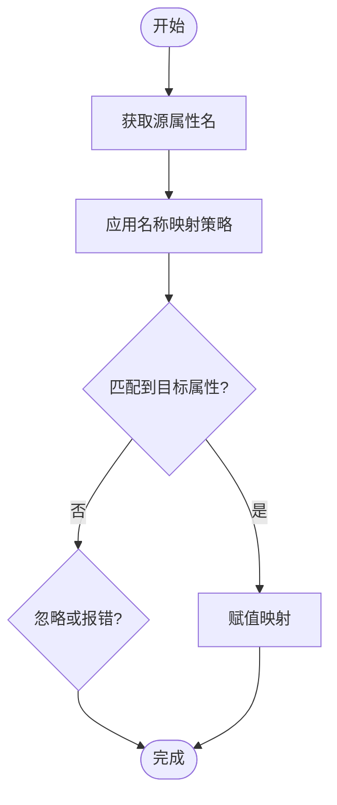
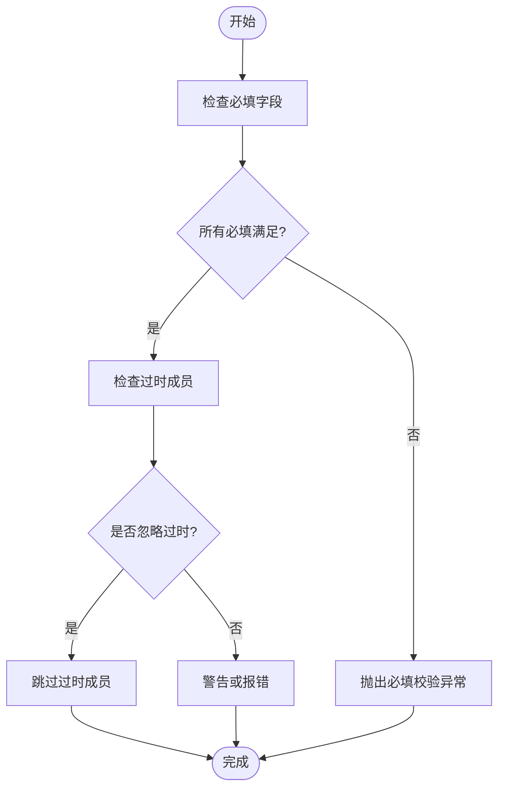
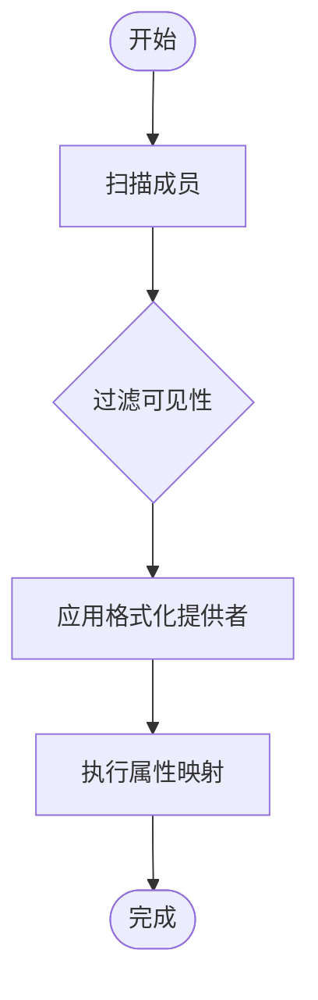
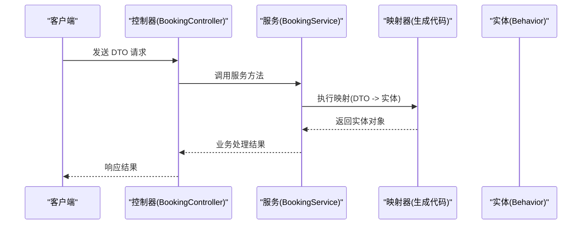

# 复杂类型映射

<cite>
**本文引用的文件**   
- [MappingConversionType.cs](file://src/AutoCode.Model/AutoMapperModel/MappingConversionType.cs)
- [MapperAttribute.cs](file://src/AutoCode.Model/AutoMapperModel/MapperAttribute.cs)
- [MapPropertyAttribute.cs](file://src/AutoCode.Model/AutoMapperModel/MapPropertyAttribute.cs)
- [MapValueAttribute.cs](file://src/AutoCode.Model/AutoMapperModel/MapValueAttribute.cs)
- [EnumMappingStrategy.cs](file://src/AutoCode.Model/AutoMapperModel/EnumMappingStrategy.cs)
- [PropertyNameMappingStrategy.cs](file://src/AutoCode.Model/AutoMapperModel/PropertyNameMappingStrategy.cs)
- [RequiredMappingStrategy.cs](file://src/AutoCode.Model/AutoMapperModel/RequiredMappingStrategy.cs)
- [IgnoreObsoleteMembersStrategy.cs](file://src/AutoCode.Model/AutoMapperModel/IgnoreObsoleteMembersStrategy.cs)
- [MemberVisibility.cs](file://src/AutoCode.Model/AutoMapperModel/MemberVisibility.cs)
- [FormatProviderAttribute.cs](file://src/AutoCode.Model/AutoMapperModel/FormatProviderAttribute.cs)
- [Behavior.cs](file://src/Auto.MapModels/Behavior.cs)
- [UserInfo.cs](file://src/APP.Map/UserInfo.cs)
- [Program.cs](file://src/APP.Map/Program.cs)
- [BookingController.cs](file://src/APP.WebAPI/Controllers/BookingController.cs)
- [BookingService.cs](file://src/APP.WebAPI/Services/BookingService.cs)
- [AppCore.cs](file://src/APP.WebAPI.Core/Application/AppCore.cs)
- [DependencyInjectionServiceCollectionExtensions.cs](file://src/APP.WebAPI.Core/DependencyInjection/DependencyInjectionServiceCollectionExtensions.cs)
- [IDependencyBase.cs](file://src/APP.WebAPI.Core/DependencyInjection/LifeType/IDependencyBase.cs)
- [IScoped.cs](file://src/APP.WebAPI.Core/DependencyInjection/LifeType/IScoped.cs)
- [ISingleton.cs](file://src/APP.WebAPI.Core/DependencyInjection/LifeType/ISingleton.cs)
- [ITransient.cs](file://src/APP.WebAPI.Core/DependencyInjection/LifeType/ITransient.cs)
- [AutoInterface.cs](file://src/APP/AutoInterface.cs)
- [AutoInterClass.cs](file://src/APP/AutoInterClass.cs)
- [Program.cs](file://src/APP/Program.cs)
- [MapperGenerator.cs](file://src/AutoCode.Map/MapperGenerator.cs)
- [DiagnosticDescriptors.cs](file://src/AutoCode.Map/Diagnostics/DiagnosticDescriptors.cs)
</cite>

## 目录
1. [简介](#简介)
2. [项目结构](#项目结构)
3. [核心组件](#核心组件)
4. [架构总览](#架构总览)
5. [详细组件分析](#详细组件分析)
6. [依赖关系分析](#依赖关系分析)
7. [性能考虑](#性能考虑)
8. [故障排查指南](#故障排查指南)
9. [结论](#结论)
10. [附录](#附录)

## 简介
本文件聚焦 AutoCode 映射框架在处理复杂类型时的能力与最佳实践，重点覆盖：
- 嵌套对象映射、集合映射、字典映射的实现方式与配置要点
- 不同转换类型（MappingConversionType）的使用场景与配置方法
- 复杂数据结构的映射示例（DTO 到实体）、数据验证与错误处理
- 性能优化建议与内存管理最佳实践

## 项目结构
AutoCode 映射相关代码主要分布在以下模块：
- 模型与属性定义：AutoCode.Model/AutoMapperModel 下的各类 Attribute 与策略枚举
- 映射生成器：AutoCode.Map 下的 MapperGenerator 与诊断描述
- 应用示例：APP.Map、APP.WebAPI 等用于演示 DTO 与实体的映射使用
- 依赖注入与生命周期：APP.WebAPI.Core 下的 DI 扩展与生命周期接口

**图表来源** 
- [MappingConversionType.cs](file://src/AutoCode.Model/AutoMapperModel/MappingConversionType.cs)
- [MapperAttribute.cs](file://src/AutoCode.Model/AutoMapperModel/MapperAttribute.cs)
- [MapPropertyAttribute.cs](file://src/AutoCode.Model/AutoMapperModel/MapPropertyAttribute.cs)
- [MapValueAttribute.cs](file://src/AutoCode.Model/AutoMapperModel/MapValueAttribute.cs)
- [EnumMappingStrategy.cs](file://src/AutoCode.Model/AutoMapperModel/EnumMappingStrategy.cs)
- [PropertyNameMappingStrategy.cs](file://src/AutoCode.Model/AutoMapperModel/PropertyNameMappingStrategy.cs)
- [RequiredMappingStrategy.cs](file://src/AutoCode.Model/AutoMapperModel/RequiredMappingStrategy.cs)
- [IgnoreObsoleteMembersStrategy.cs](file://src/AutoCode.Model/AutoMapperModel/IgnoreObsoleteMembersStrategy.cs)
- [MemberVisibility.cs](file://src/AutoCode.Model/AutoMapperModel/MemberVisibility.cs)
- [FormatProviderAttribute.cs](file://src/AutoCode.Model/AutoMapperModel/FormatProviderAttribute.cs)
- [MapperGenerator.cs](file://src/AutoCode.Map/MapperGenerator.cs)
- [DiagnosticDescriptors.cs](file://src/AutoCode.Map/Diagnostics/DiagnosticDescriptors.cs)
- [UserInfo.cs](file://src/APP.Map/UserInfo.cs)
- [Program.cs](file://src/APP.Map/Program.cs)
- [BookingController.cs](file://src/APP.WebAPI/Controllers/BookingController.cs)
- [BookingService.cs](file://src/APP.WebAPI/Services/BookingService.cs)
- [AppCore.cs](file://src/APP.WebAPI.Core/Application/AppCore.cs)
- [DependencyInjectionServiceCollectionExtensions.cs](file://src/APP.WebAPI.Core/DependencyInjection/DependencyInjectionServiceCollectionExtensions.cs)

**章节来源**
- [MapperGenerator.cs](file://src/AutoCode.Map/MapperGenerator.cs)
- [DiagnosticDescriptors.cs](file://src/AutoCode.Map/Diagnostics/DiagnosticDescriptors.cs)
- [UserInfo.cs](file://src/APP.Map/UserInfo.cs)
- [Program.cs](file://src/APP.Map/Program.cs)
- [BookingController.cs](file://src/APP.WebAPI/Controllers/BookingController.cs)
- [BookingService.cs](file://src/APP.WebAPI/Services/BookingService.cs)
- [AppCore.cs](file://src/APP.WebAPI.Core/Application/AppCore.cs)
- [DependencyInjectionServiceCollectionExtensions.cs](file://src/APP.WebAPI.Core/DependencyInjection/DependencyInjectionServiceCollectionExtensions.cs)

## 核心组件
- MappingConversionType：定义不同类型之间的转换策略（如值类型、引用类型、集合、字典、枚举等），是复杂类型映射的核心开关。
- MapperAttribute：在类型或成员上声明映射规则，控制源/目标类型的映射行为。
- MapPropertyAttribute：针对具体成员进行映射配置，包括名称策略、忽略、格式化等。
- MapValueAttribute：为特定成员提供固定值或表达式映射。
- 策略枚举与特性：
  - EnumMappingStrategy：枚举映射策略
  - PropertyNameMappingStrategy：属性名映射策略
  - RequiredMappingStrategy：必填映射策略
  - IgnoreObsoleteMembersStrategy：忽略过时成员策略
  - MemberVisibility：成员可见性控制
  - FormatProviderAttribute：格式化提供者配置

这些组件共同构成 AutoCode 的“声明式映射”体系，通过源码生成器在编译期生成高效映射代码，避免运行期反射开销。

**章节来源**
- [MappingConversionType.cs](file://src/AutoCode.Model/AutoMapperModel/MappingConversionType.cs)
- [MapperAttribute.cs](file://src/AutoCode.Model/AutoMapperModel/MapperAttribute.cs)
- [MapPropertyAttribute.cs](file://src/AutoCode.Model/AutoMapperModel/MapPropertyAttribute.cs)
- [MapValueAttribute.cs](file://src/AutoCode.Model/AutoMapperModel/MapValueAttribute.cs)
- [EnumMappingStrategy.cs](file://src/AutoCode.Model/AutoMapperModel/EnumMappingStrategy.cs)
- [PropertyNameMappingStrategy.cs](file://src/AutoCode.Model/AutoMapperModel/PropertyNameMappingStrategy.cs)
- [RequiredMappingStrategy.cs](file://src/AutoCode.Model/AutoMapperModel/RequiredMappingStrategy.cs)
- [IgnoreObsoleteMembersStrategy.cs](file://src/AutoCode.Model/AutoMapperModel/IgnoreObsoleteMembersStrategy.cs)
- [MemberVisibility.cs](file://src/AutoCode.Model/AutoMapperModel/MemberVisibility.cs)
- [FormatProviderAttribute.cs](file://src/AutoCode.Model/AutoMapperModel/FormatProviderAttribute.cs)

## 架构总览
AutoCode 映射框架采用“声明 + 源码生成”的架构：
- 开发者通过 Attribute 声明映射规则（包含复杂类型、集合、字典、枚举等）
- 源码生成器解析 Attribute 并生成强类型映射代码
- 运行时直接调用生成的映射方法，具备高性能与可调试性

**图表来源** 
- [MapperGenerator.cs](file://src/AutoCode.Map/MapperGenerator.cs)
- [MappingConversionType.cs](file://src/AutoCode.Model/AutoMapperModel/MappingConversionType.cs)
- [MapperAttribute.cs](file://src/AutoCode.Model/AutoMapperModel/MapperAttribute.cs)

## 详细组件分析

### 嵌套对象映射
- 适用场景：DTO 中包含子对象，需要递归映射到对应实体
- 配置要点：
  - 使用 MapperAttribute 指定源/目标类型
  - 使用 MapPropertyAttribute 对嵌套属性进行命名或忽略控制
  - 使用 FormatProviderAttribute 控制日期、数值等格式化的提供者
- 实现机制：生成器识别嵌套类型并递归生成映射逻辑，确保每个层级都遵循策略与规则

**图表来源** 
- [MapPropertyAttribute.cs](file://src/AutoCode.Model/AutoMapperModel/MapPropertyAttribute.cs)
- [FormatProviderAttribute.cs](file://src/AutoCode.Model/AutoMapperModel/FormatProviderAttribute.cs)
- [RequiredMappingStrategy.cs](file://src/AutoCode.Model/AutoMapperModel/RequiredMappingStrategy.cs)
- [MemberVisibility.cs](file://src/AutoCode.Model/AutoMapperModel/MemberVisibility.cs)

**章节来源**
- [MapPropertyAttribute.cs](file://src/AutoCode.Model/AutoMapperModel/MapPropertyAttribute.cs)
- [FormatProviderAttribute.cs](file://src/AutoCode.Model/AutoMapperModel/FormatProviderAttribute.cs)
- [RequiredMappingStrategy.cs](file://src/AutoCode.Model/AutoMapperModel/RequiredMappingStrategy.cs)
- [MemberVisibility.cs](file://src/AutoCode.Model/AutoMapperModel/MemberVisibility.cs)

### 集合映射
- 适用场景：将 List/Set/Array 等集合从 DTO 映射到实体集合
- 配置要点：
  - 使用 MappingConversionType 指定集合元素类型转换
  - 使用 MapPropertyAttribute 控制集合成员的映射规则
  - 对于泛型集合，生成器会推断元素类型并生成对应的映射逻辑
- 实现机制：生成器遍历集合元素，逐条应用元素级映射规则，保证类型安全与性能

**图表来源** 
- [MappingConversionType.cs](file://src/AutoCode.Model/AutoMapperModel/MappingConversionType.cs)
- [MapPropertyAttribute.cs](file://src/AutoCode.Model/AutoMapperModel/MapPropertyAttribute.cs)

**章节来源**
- [MappingConversionType.cs](file://src/AutoCode.Model/AutoMapperModel/MappingConversionType.cs)
- [MapPropertyAttribute.cs](file://src/AutoCode.Model/AutoMapperModel/MapPropertyAttribute.cs)

### 字典映射
- 适用场景：将键值对集合（Dictionary/IDictionary）从 DTO 映射到实体
- 配置要点：
  - 使用 MappingConversionType 指定键/值类型转换
  - 使用 MapPropertyAttribute 控制键与值的映射策略
  - 支持自定义键比较器与值转换器（通过格式化提供者）
- 实现机制：生成器根据键/值类型生成映射逻辑，并在必要时进行类型校验与转换

**图表来源** 
- [MappingConversionType.cs](file://src/AutoCode.Model/AutoMapperModel/MappingConversionType.cs)
- [MapPropertyAttribute.cs](file://src/AutoCode.Model/AutoMapperModel/MapPropertyAttribute.cs)

**章节来源**
- [MappingConversionType.cs](file://src/AutoCode.Model/AutoMapperModel/MappingConversionType.cs)
- [MapPropertyAttribute.cs](file://src/AutoCode.Model/AutoMapperModel/MapPropertyAttribute.cs)

### 枚举映射
- 适用场景：将字符串或整型枚举值映射到目标枚举类型
- 配置要点：
  - 使用 EnumMappingStrategy 指定映射策略（如按名称匹配、按值匹配）
  - 使用 MapPropertyAttribute 对枚举成员进行重命名或忽略
- 实现机制：生成器根据策略生成枚举转换逻辑，支持大小写不敏感与默认值回退

**图表来源** 
- [EnumMappingStrategy.cs](file://src/AutoCode.Model/AutoMapperModel/EnumMappingStrategy.cs)
- [MapPropertyAttribute.cs](file://src/AutoCode.Model/AutoMapperModel/MapPropertyAttribute.cs)

**章节来源**
- [EnumMappingStrategy.cs](file://src/AutoCode.Model/AutoMapperModel/EnumMappingStrategy.cs)
- [MapPropertyAttribute.cs](file://src/AutoCode.Model/AutoMapperModel/MapPropertyAttribute.cs)

### 属性名映射策略
- 适用场景：源与目标的属性名不一致时，进行名称转换或重映射
- 配置要点：
  - 使用 PropertyNameMappingStrategy 指定名称转换规则（如驼峰转下划线、前缀去除等）
  - 使用 MapPropertyAttribute 对个别属性进行手动映射
- 实现机制：生成器根据策略生成名称匹配逻辑，支持正则替换与自定义函数

**图表来源** 
- [PropertyNameMappingStrategy.cs](file://src/AutoCode.Model/AutoMapperModel/PropertyNameMappingStrategy.cs)
- [MapPropertyAttribute.cs](file://src/AutoCode.Model/AutoMapperModel/MapPropertyAttribute.cs)

**章节来源**
- [PropertyNameMappingStrategy.cs](file://src/AutoCode.Model/AutoMapperModel/PropertyNameMappingStrategy.cs)
- [MapPropertyAttribute.cs](file://src/AutoCode.Model/AutoMapperModel/MapPropertyAttribute.cs)

### 必填映射与过时成员处理
- 必填映射：
  - 使用 RequiredMappingStrategy 指定必填字段校验
  - 未满足必填条件时抛出映射异常，确保数据完整性
- 过时成员处理：
  - 使用 IgnoreObsoleteMembersStrategy 忽略标记为过时的成员
  - 避免废弃 API 影响映射逻辑

**图表来源** 
- [RequiredMappingStrategy.cs](file://src/AutoCode.Model/AutoMapperModel/RequiredMappingStrategy.cs)
- [IgnoreObsoleteMembersStrategy.cs](file://src/AutoCode.Model/AutoMapperModel/IgnoreObsoleteMembersStrategy.cs)

**章节来源**
- [RequiredMappingStrategy.cs](file://src/AutoCode.Model/AutoMapperModel/RequiredMappingStrategy.cs)
- [IgnoreObsoleteMembersStrategy.cs](file://src/AutoCode.Model/AutoMapperModel/IgnoreObsoleteMembersStrategy.cs)

### 成员可见性与格式化提供者
- 成员可见性：
  - 使用 MemberVisibility 控制哪些成员参与映射（公开、内部、私有等）
  - 提高映射灵活性与安全性
- 格式化提供者：
  - 使用 FormatProviderAttribute 指定日期、数值等的格式化规则
  - 支持区域性设置与自定义格式化器

**图表来源** 
- [MemberVisibility.cs](file://src/AutoCode.Model/AutoMapperModel/MemberVisibility.cs)
- [FormatProviderAttribute.cs](file://src/AutoCode.Model/AutoMapperModel/FormatProviderAttribute.cs)

**章节来源**
- [MemberVisibility.cs](file://src/AutoCode.Model/AutoMapperModel/MemberVisibility.cs)
- [FormatProviderAttribute.cs](file://src/AutoCode.Model/AutoMapperModel/FormatProviderAttribute.cs)

### 复杂数据结构映射示例（DTO 到实体）
- 典型流程：
  - 在 DTO 与实体上使用 MapperAttribute 声明映射关系
  - 对嵌套对象、集合、字典使用 MapPropertyAttribute 与 MappingConversionType 配置
  - 使用 RequiredMappingStrategy 与 IgnoreObsoleteMembersStrategy 进行校验与清理
  - 生成器输出强类型映射代码，运行时直接调用

**图表来源** 
- [BookingController.cs](file://src/APP.WebAPI/Controllers/BookingController.cs)
- [BookingService.cs](file://src/APP.WebAPI/Services/BookingService.cs)
- [Behavior.cs](file://src/Auto.MapModels/Behavior.cs)
- [UserInfo.cs](file://src/APP.Map/UserInfo.cs)

**章节来源**
- [BookingController.cs](file://src/APP.WebAPI/Controllers/BookingController.cs)
- [BookingService.cs](file://src/APP.WebAPI/Services/BookingService.cs)
- [Behavior.cs](file://src/Auto.MapModels/Behavior.cs)
- [UserInfo.cs](file://src/APP.Map/UserInfo.cs)

## 依赖关系分析
AutoCode 映射框架的依赖关系清晰且低耦合：
- 模型层（AutoCode.Model）提供 Attribute 与策略定义
- 生成器（AutoCode.Map）解析 Attribute 并生成映射代码
- 应用层（APP.*）使用生成的映射代码进行数据转换

**图表来源** 
- [MappingConversionType.cs](file://src/AutoCode.Model/AutoMapperModel/MappingConversionType.cs)
- [MapperGenerator.cs](file://src/AutoCode.Map/MapperGenerator.cs)
- [BookingController.cs](file://src/APP.WebAPI/Controllers/BookingController.cs)
- [AppCore.cs](file://src/APP.WebAPI.Core/Application/AppCore.cs)

**章节来源**
- [MappingConversionType.cs](file://src/AutoCode.Model/AutoMapperModel/MappingConversionType.cs)
- [MapperGenerator.cs](file://src/AutoCode.Map/MapperGenerator.cs)
- [BookingController.cs](file://src/APP.WebAPI/Controllers/BookingController.cs)
- [AppCore.cs](file://src/APP.WebAPI.Core/Application/AppCore.cs)

## 性能考虑
- 编译期生成：通过源码生成器在编译期生成强类型映射代码，避免运行期反射开销
- 内存管理：
  - 合理使用集合与字典映射，避免不必要的中间对象创建
  - 对于大对象图，考虑分页或流式处理
- 缓存策略：
  - 对频繁使用的映射器实例进行缓存（结合 DI 生命周期）
  - 避免重复生成相同映射逻辑
- 性能监控：
  - 使用诊断工具跟踪映射耗时与内存分配
  - 针对热点路径进行优化（如减少不必要的类型转换）

[本节为通用指导，无需特定文件来源]

## 故障排查指南
- 常见错误：
  - 必填字段缺失：检查 RequiredMappingStrategy 配置与数据来源
  - 类型不匹配：确认 MappingConversionType 设置与类型兼容性
  - 属性名不匹配：调整 PropertyNameMappingStrategy 或使用 MapPropertyAttribute 手动映射
- 诊断信息：
  - 查看 DiagnosticDescriptors 中的错误描述与修复建议
  - 启用详细日志以定位映射失败的具体步骤
- 调试技巧：
  - 使用 IDE 断点调试生成的映射代码
  - 逐步检查嵌套对象、集合、字典的映射过程

**章节来源**
- [DiagnosticDescriptors.cs](file://src/AutoCode.Map/Diagnostics/DiagnosticDescriptors.cs)

## 结论
AutoCode 映射框架通过声明式 Attribute 与源码生成技术，提供了强大而高效的复杂类型映射能力。合理配置 MappingConversionType、MapPropertyAttribute 与各类策略，可实现嵌套对象、集合、字典、枚举等复杂结构的精准映射。结合性能优化与内存管理最佳实践，可在高并发场景下保持优异表现。

[本节为总结性内容，无需特定文件来源]

## 附录
- 依赖注入与生命周期：
  - IScoped、ISingleton、ITransient 接口定义了不同的生命周期策略
  - DependencyInjectionServiceCollectionExtensions 提供 DI 扩展方法
- 应用入口与示例：
  - APP.Map/Program.cs 展示基础映射用法
  - APP.WebAPI/Controllers/BookingController.cs 与 Services/BookingService.cs 演示 Web API 中的映射集成

**章节来源**
- [IScoped.cs](file://src/APP.WebAPI.Core/DependencyInjection/LifeType/IScoped.cs)
- [ISingleton.cs](file://src/APP.WebAPI.Core/DependencyInjection/LifeType/ISingleton.cs)
- [ITransient.cs](file://src/APP.WebAPI.Core/DependencyInjection/LifeType/ITransient.cs)
- [DependencyInjectionServiceCollectionExtensions.cs](file://src/APP.WebAPI.Core/DependencyInjection/DependencyInjectionServiceCollectionExtensions.cs)
- [Program.cs](file://src/APP.Map/Program.cs)
- [BookingController.cs](file://src/APP.WebAPI/Controllers/BookingController.cs)
- [BookingService.cs](file://src/APP.WebAPI/Services/BookingService.cs)
