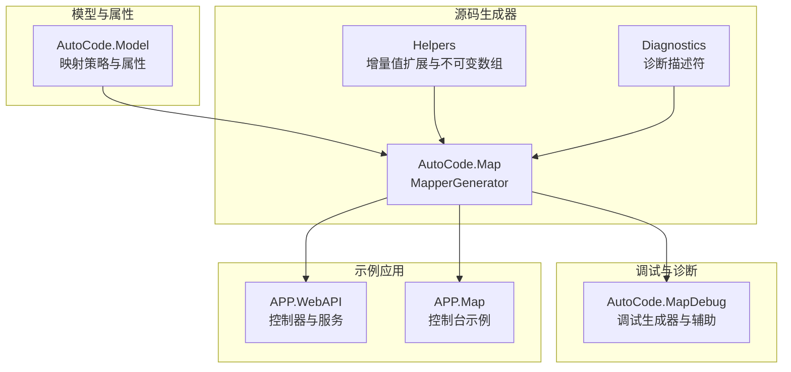
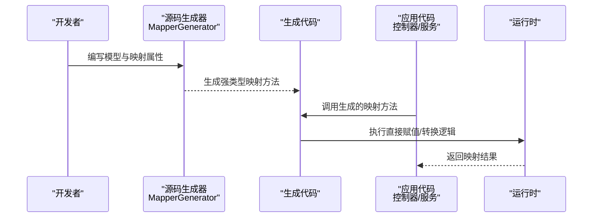
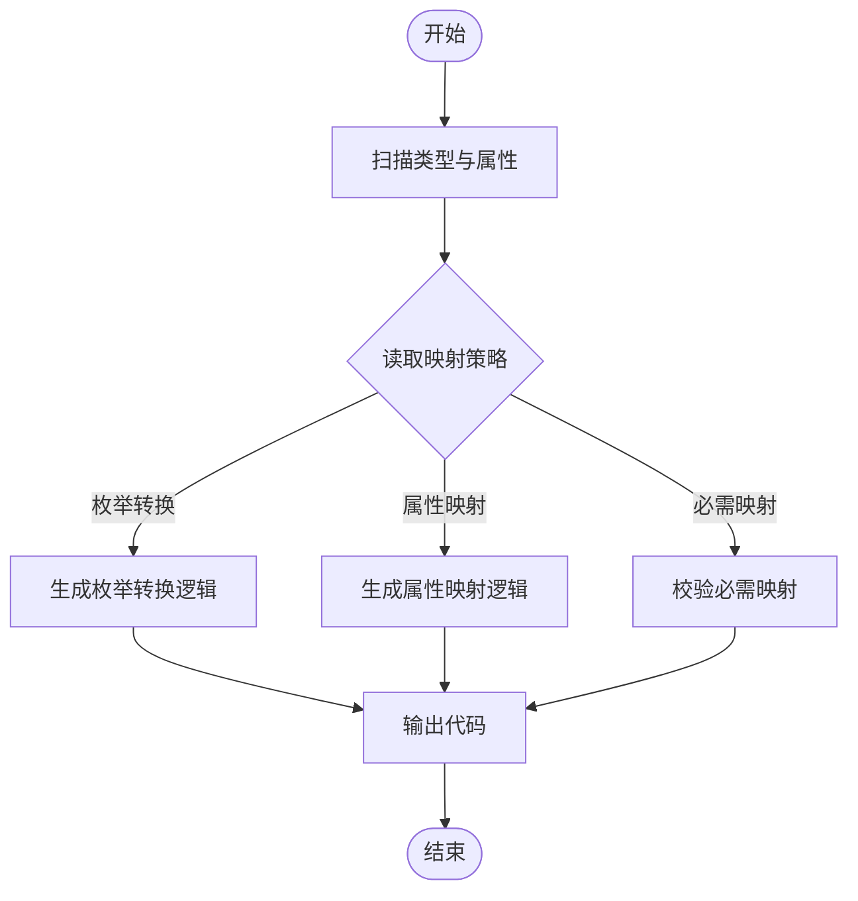
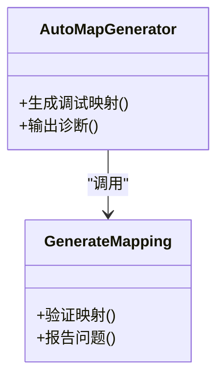
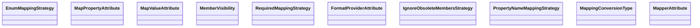
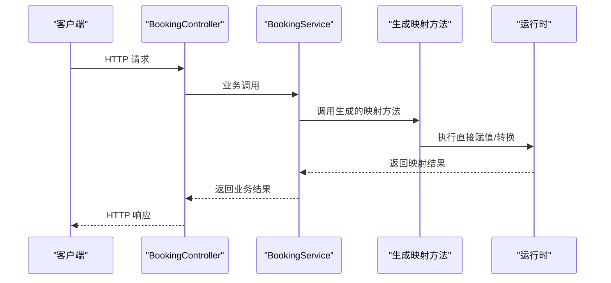
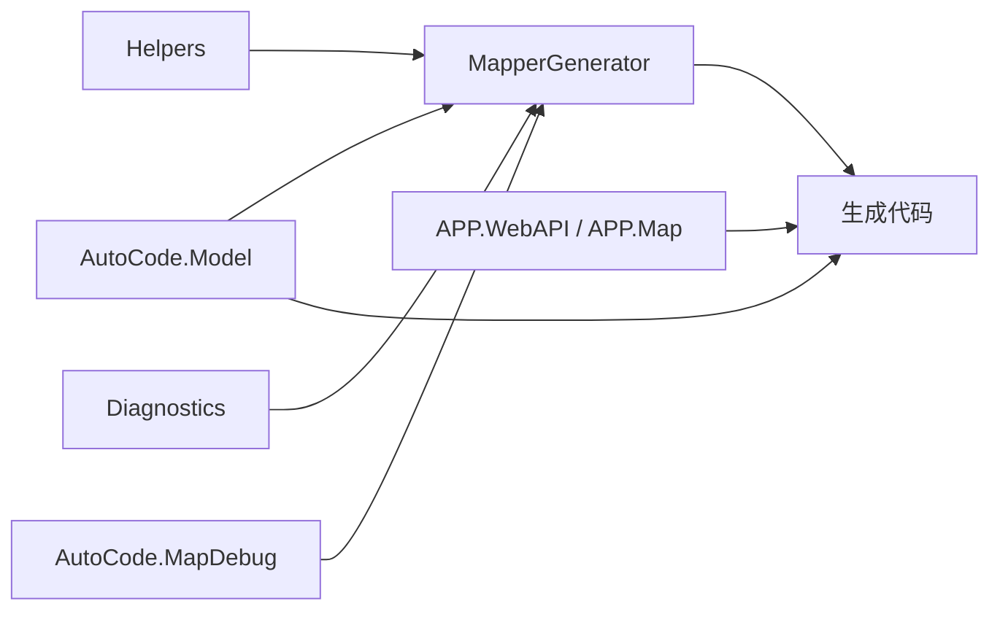

# 性能优化

<cite>
**本文引用的文件**   
- [MapperGenerator.cs](file://src/AutoCode.Map/MapperGenerator.cs)
- [DiagnosticDescriptors.cs](file://src/AutoCode.Map/Diagnostics/DiagnosticDescriptors.cs)
- [ImmutableEquatableArray.cs](file://src/AutoCode.Map/Helpers/ImmutableEquatableArray.cs)
- [IncrementalValuesProviderExtensions.cs](file://src/AutoCode.Map/Helpers/IncrementalValuesProviderExtensions.cs)
- [AutoMapGenerator.cs](file://src/AutoCode.MapDebug/AutoMapGenerator.cs)
- [GenerateMapping.cs](file://src/AutoCode.MapDebug/GenerateMapping.cs)
- [Behavior.cs](file://src/Auto.MapModels/Behavior.cs)
- [EnumMappingStrategy.cs](file://src/AutoCode.Model/AutoMapperModel/EnumMappingStrategy.cs)
- [FormatProviderAttribute.cs](file://src/AutoCode.Model/AutoMapperModel/FormatProviderAttribute.cs)
- [IgnoreObsoleteMembersStrategy.cs](file://src/AutoCode.Model/AutoMapperModel/IgnoreObsoleteMembersStrategy.cs)
- [MapPropertyAttribute.cs](file://src/AutoCode.Model/AutoMapperModel/MapPropertyAttribute.cs)
- [MapValueAttribute.cs](file://src/AutoCode.Model/AutoMapperModel/MapValueAttribute.cs)
- [MapperAttribute.cs](file://src/AutoCode.Model/AutoMapperModel/MapperAttribute.cs)
- [MappingConversionType.cs](file://src/AutoCode.Model/AutoMapperModel/MappingConversionType.cs)
- [MemberVisibility.cs](file://src/AutoCode.Model/AutoMapperModel/MemberVisibility.cs)
- [PropertyNameMappingStrategy.cs](file://src/AutoCode.Model/AutoMapperModel/PropertyNameMappingStrategy.cs)
- [RequiredMappingStrategy.cs](file://src/AutoCode.Model/AutoMapperModel/RequiredMappingStrategy.cs)
- [APP.WebAPI/Controllers/BookingController.cs](file://src/APP.WebAPI/Controllers/BookingController.cs)
- [APP.WebAPI/Services/BookingService.cs](file://src/APP.WebAPI/Services/BookingService.cs)
- [APP.WebAPI/Program.cs](file://src/APP.WebAPI/Program.cs)
- [APP.Map/Program.cs](file://src/APP.Map/Program.cs)
- [UserInfo.cs](file://src/APP.Map/UserInfo.cs)
</cite>

## 目录
1. [简介](#简介)
2. [项目结构](#项目结构)
3. [核心组件](#核心组件)
4. [架构总览](#架构总览)
5. [详细组件分析](#详细组件分析)
6. [依赖关系分析](#依赖关系分析)
7. [性能考量](#性能考量)
8. [故障排查指南](#故障排查指南)
9. [结论](#结论)
10. [附录](#附录)

## 简介
本文件聚焦 AutoCode 映射框架的性能特性与优化策略，重点阐述源代码生成器如何通过编译期代码生成避免反射开销、提升运行时性能；并提供性能监控与基准测试方法、内存使用优化、批量映射处理与缓存策略，以及诊断工具的使用说明，帮助识别和解决性能瓶颈。

## 项目结构
AutoCode 映射框架由“模型与属性定义”“源码生成器（Source Generator）”“调试与诊断”“示例应用”等模块组成：
- 模型与属性定义：位于 AutoCode.Model，提供映射策略、属性映射、枚举转换等元数据。
- 源码生成器：位于 AutoCode.Map，核心为 MapperGenerator，负责扫描类型与属性、生成高性能映射代码。
- 调试与诊断：位于 AutoCode.MapDebug，提供调试用的生成器与辅助类，便于定位问题与验证生成结果。
- 示例应用：APP.WebAPI 与 APP.Map 展示在 Web API 与控制台场景下的使用方式。

图表来源
- [MapperGenerator.cs](file://src/AutoCode.Map/MapperGenerator.cs)
- [IncrementalValuesProviderExtensions.cs](file://src/AutoCode.Map/Helpers/IncrementalValuesProviderExtensions.cs)
- [ImmutableEquatableArray.cs](file://src/AutoCode.Map/Helpers/ImmutableEquatableArray.cs)
- [DiagnosticDescriptors.cs](file://src/AutoCode.Map/Diagnostics/DiagnosticDescriptors.cs)
- [AutoMapGenerator.cs](file://src/AutoCode.MapDebug/AutoMapGenerator.cs)
- [GenerateMapping.cs](file://src/AutoCode.MapDebug/GenerateMapping.cs)
- [Behavior.cs](file://src/Auto.MapModels/Behavior.cs)
- [APP.WebAPI/Controllers/BookingController.cs](file://src/APP.WebAPI/Controllers/BookingController.cs)
- [APP.WebAPI/Services/BookingService.cs](file://src/APP.WebAPI/Services/BookingService.cs)
- [APP.Map/Program.cs](file://src/APP.Map/Program.cs)
- [UserInfo.cs](file://src/APP.Map/UserInfo.cs)

章节来源
- [MapperGenerator.cs](file://src/AutoCode.Map/MapperGenerator.cs)
- [IncrementalValuesProviderExtensions.cs](file://src/AutoCode.Map/Helpers/IncrementalValuesProviderExtensions.cs)
- [ImmutableEquatableArray.cs](file://src/AutoCode.Map/Helpers/ImmutableEquatableArray.cs)
- [DiagnosticDescriptors.cs](file://src/AutoCode.Map/Diagnostics/DiagnosticDescriptors.cs)
- [AutoMapGenerator.cs](file://src/AutoCode.MapDebug/AutoMapGenerator.cs)
- [GenerateMapping.cs](file://src/AutoCode.MapDebug/GenerateMapping.cs)
- [Behavior.cs](file://src/Auto.MapModels/Behavior.cs)
- [APP.WebAPI/Controllers/BookingController.cs](file://src/APP.WebAPI/Controllers/BookingController.cs)
- [APP.WebAPI/Services/BookingService.cs](file://src/APP.WebAPI/Services/BookingService.cs)
- [APP.Map/Program.cs](file://src/APP.Map/Program.cs)
- [UserInfo.cs](file://src/APP.Map/UserInfo.cs)

## 核心组件
- 源码生成器（MapperGenerator）
  - 职责：解析源类型与属性，结合映射策略与属性配置，生成直接赋值或转换的强类型映射代码，避免运行时的反射与装箱拆箱。
  - 关键能力：增量编译、不可变数据结构减少 GC 压力、诊断信息输出。
- 调试与诊断（AutoMapGenerator、GenerateMapping）
  - 职责：在开发阶段辅助生成与验证映射代码，提供诊断与错误提示。
- 模型与属性（AutoCode.Model）
  - 职责：声明映射策略、属性映射规则、枚举转换策略、成员可见性、必需映射策略等，驱动生成器行为。
- 示例应用（APP.WebAPI、APP.Map）
  - 职责：演示如何在 Web API 与控制台中使用生成的映射，体现零反射的高性能路径。

章节来源
- [MapperGenerator.cs](file://src/AutoCode.Map/MapperGenerator.cs)
- [AutoMapGenerator.cs](file://src/AutoCode.MapDebug/AutoMapGenerator.cs)
- [GenerateMapping.cs](file://src/AutoCode.MapDebug/GenerateMapping.cs)
- [EnumMappingStrategy.cs](file://src/AutoCode.Model/AutoMapperModel/EnumMappingStrategy.cs)
- [MapPropertyAttribute.cs](file://src/AutoCode.Model/AutoMapperModel/MapPropertyAttribute.cs)
- [MapValueAttribute.cs](file://src/AutoCode.Model/AutoMapperModel/MapValueAttribute.cs)
- [MapperAttribute.cs](file://src/AutoCode.Model/AutoMapperModel/MapperAttribute.cs)
- [MappingConversionType.cs](file://src/AutoCode.Model/AutoMapperModel/MappingConversionType.cs)
- [MemberVisibility.cs](file://src/AutoCode.Model/AutoMapperModel/MemberVisibility.cs)
- [PropertyNameMappingStrategy.cs](file://src/AutoCode.Model/AutoMapperModel/PropertyNameMappingStrategy.cs)
- [RequiredMappingStrategy.cs](file://src/AutoCode.Model/AutoMapperModel/RequiredMappingStrategy.cs)
- [IgnoreObsoleteMembersStrategy.cs](file://src/AutoCode.Model/AutoMapperModel/IgnoreObsoleteMembersStrategy.cs)
- [APP.WebAPI/Controllers/BookingController.cs](file://src/APP.WebAPI/Controllers/BookingController.cs)
- [APP.WebAPI/Services/BookingService.cs](file://src/APP.WebAPI/Services/BookingService.cs)
- [APP.Map/Program.cs](file://src/APP.Map/Program.cs)
- [UserInfo.cs](file://src/APP.Map/UserInfo.cs)

## 架构总览
下图展示了从源码到生成代码再到运行时调用的整体流程，强调“编译期生成、运行期直调”的高性能路径。

图表来源
- [MapperGenerator.cs](file://src/AutoCode.Map/MapperGenerator.cs)
- [APP.WebAPI/Controllers/BookingController.cs](file://src/APP.WebAPI/Controllers/BookingController.cs)
- [APP.WebAPI/Services/BookingService.cs](file://src/APP.WebAPI/Services/BookingService.cs)
- [APP.Map/Program.cs](file://src/APP.Map/Program.cs)
- [UserInfo.cs](file://src/APP.Map/UserInfo.cs)

## 详细组件分析

### 源码生成器（MapperGenerator）
- 设计要点
  - 增量编译：通过 IncrementalValuesProvider 扩展减少不必要的重新生成。
  - 不可变数据结构：使用 ImmutableEquatableArray 降低哈希比较与分配成本。
  - 诊断输出：DiagnosticDescriptors 提供清晰的构建期诊断信息，便于快速定位问题。
- 性能影响
  - 编译期完成类型分析与代码生成，运行时无反射、无动态查找，显著降低 CPU 与 GC 压力。
  - 增量更新缩短构建时间，提高开发体验。

图表来源
- [MapperGenerator.cs](file://src/AutoCode.Map/MapperGenerator.cs)
- [EnumMappingStrategy.cs](file://src/AutoCode.Model/AutoMapperModel/EnumMappingStrategy.cs)
- [MapPropertyAttribute.cs](file://src/AutoCode.Model/AutoMapperModel/MapPropertyAttribute.cs)
- [RequiredMappingStrategy.cs](file://src/AutoCode.Model/AutoMapperModel/RequiredMappingStrategy.cs)

章节来源
- [MapperGenerator.cs](file://src/AutoCode.Map/MapperGenerator.cs)
- [IncrementalValuesProviderExtensions.cs](file://src/AutoCode.Map/Helpers/IncrementalValuesProviderExtensions.cs)
- [ImmutableEquatableArray.cs](file://src/AutoCode.Map/Helpers/ImmutableEquatableArray.cs)
- [DiagnosticDescriptors.cs](file://src/AutoCode.Map/Diagnostics/DiagnosticDescriptors.cs)

### 调试与诊断（AutoMapGenerator、GenerateMapping）
- 作用
  - 在开发阶段辅助生成与验证映射代码，提供诊断信息与错误提示。
- 使用建议
  - 在本地调试时启用，生产环境可禁用以减少额外开销。
  - 结合日志与断点，快速定位映射失败或不一致的场景。

图表来源
- [AutoMapGenerator.cs](file://src/AutoCode.MapDebug/AutoMapGenerator.cs)
- [GenerateMapping.cs](file://src/AutoCode.MapDebug/GenerateMapping.cs)

章节来源
- [AutoMapGenerator.cs](file://src/AutoCode.MapDebug/AutoMapGenerator.cs)
- [GenerateMapping.cs](file://src/AutoCode.MapDebug/GenerateMapping.cs)

### 模型与属性（AutoCode.Model）
- 关键项
  - 枚举转换策略：控制枚举映射的行为与兼容性。
  - 属性映射与值映射：声明字段级映射规则与常量值注入。
  - 成员可见性与必需映射策略：约束生成器的访问级别与必填校验。
  - 格式化提供者：支持自定义格式化的映射。
- 性能意义
  - 将策略以静态元数据表达，避免运行期决策分支，利于生成器生成最优代码路径。

图表来源
- [EnumMappingStrategy.cs](file://src/AutoCode.Model/AutoMapperModel/EnumMappingStrategy.cs)
- [MapPropertyAttribute.cs](file://src/AutoCode.Model/AutoMapperModel/MapPropertyAttribute.cs)
- [MapValueAttribute.cs](file://src/AutoCode.Model/AutoMapperModel/MapValueAttribute.cs)
- [MemberVisibility.cs](file://src/AutoCode.Model/AutoMapperModel/MemberVisibility.cs)
- [RequiredMappingStrategy.cs](file://src/AutoCode.Model/AutoMapperModel/RequiredMappingStrategy.cs)
- [FormatProviderAttribute.cs](file://src/AutoCode.Model/AutoMapperModel/FormatProviderAttribute.cs)
- [IgnoreObsoleteMembersStrategy.cs](file://src/AutoCode.Model/AutoMapperModel/IgnoreObsoleteMembersStrategy.cs)
- [PropertyNameMappingStrategy.cs](file://src/AutoCode.Model/AutoMapperModel/PropertyNameMappingStrategy.cs)
- [MappingConversionType.cs](file://src/AutoCode.Model/AutoMapperModel/MappingConversionType.cs)
- [MapperAttribute.cs](file://src/AutoCode.Model/AutoMapperModel/MapperAttribute.cs)

章节来源
- [Behavior.cs](file://src/Auto.MapModels/Behavior.cs)
- [EnumMappingStrategy.cs](file://src/AutoCode.Model/AutoMapperModel/EnumMappingStrategy.cs)
- [MapPropertyAttribute.cs](file://src/AutoCode.Model/AutoMapperModel/MapPropertyAttribute.cs)
- [MapValueAttribute.cs](file://src/AutoCode.Model/AutoMapperModel/MapValueAttribute.cs)
- [MemberVisibility.cs](file://src/AutoCode.Model/AutoMapperModel/MemberVisibility.cs)
- [RequiredMappingStrategy.cs](file://src/AutoCode.Model/AutoMapperModel/RequiredMappingStrategy.cs)
- [FormatProviderAttribute.cs](file://src/AutoCode.Model/AutoMapperModel/FormatProviderAttribute.cs)
- [IgnoreObsoleteMembersStrategy.cs](file://src/AutoCode.Model/AutoMapperModel/IgnoreObsoleteMembersStrategy.cs)
- [PropertyNameMappingStrategy.cs](file://src/AutoCode.Model/AutoMapperModel/PropertyNameMappingStrategy.cs)
- [MappingConversionType.cs](file://src/AutoCode.Model/AutoMapperModel/MappingConversionType.cs)
- [MapperAttribute.cs](file://src/AutoCode.Model/AutoMapperModel/MapperAttribute.cs)

### 示例应用（APP.WebAPI、APP.Map）
- 使用模式
  - 控制器与服务层调用生成的映射方法，实现零反射的数据转换。
  - 控制台示例用于快速验证映射效果与性能。
- 性能收益
  - 高并发下保持低延迟与稳定吞吐，GC 压力显著降低。

图表来源
- [APP.WebAPI/Controllers/BookingController.cs](file://src/APP.WebAPI/Controllers/BookingController.cs)
- [APP.WebAPI/Services/BookingService.cs](file://src/APP.WebAPI/Services/BookingService.cs)
- [APP.Map/Program.cs](file://src/APP.Map/Program.cs)
- [UserInfo.cs](file://src/APP.Map/UserInfo.cs)

章节来源
- [APP.WebAPI/Controllers/BookingController.cs](file://src/APP.WebAPI/Controllers/BookingController.cs)
- [APP.WebAPI/Services/BookingService.cs](file://src/APP.WebAPI/Services/BookingService.cs)
- [APP.Map/Program.cs](file://src/APP.Map/Program.cs)
- [UserInfo.cs](file://src/APP.Map/UserInfo.cs)

## 依赖关系分析
- 生成器对模型属性的依赖：通过属性与策略决定生成代码的路径与复杂度。
- 调试组件对生成器的依赖：用于开发与验证，不影响生产路径。
- 应用对生成代码的依赖：直接调用生成的强类型方法，避免运行期查找。

图表来源
- [MapperGenerator.cs](file://src/AutoCode.Map/MapperGenerator.cs)
- [IncrementalValuesProviderExtensions.cs](file://src/AutoCode.Map/Helpers/IncrementalValuesProviderExtensions.cs)
- [ImmutableEquatableArray.cs](file://src/AutoCode.Map/Helpers/ImmutableEquatableArray.cs)
- [DiagnosticDescriptors.cs](file://src/AutoCode.Map/Diagnostics/DiagnosticDescriptors.cs)
- [AutoMapGenerator.cs](file://src/AutoCode.MapDebug/AutoMapGenerator.cs)
- [GenerateMapping.cs](file://src/AutoCode.MapDebug/GenerateMapping.cs)
- [APP.WebAPI/Controllers/BookingController.cs](file://src/APP.WebAPI/Controllers/BookingController.cs)
- [APP.WebAPI/Services/BookingService.cs](file://src/APP.WebAPI/Services/BookingService.cs)
- [APP.Map/Program.cs](file://src/APP.Map/Program.cs)
- [UserInfo.cs](file://src/APP.Map/UserInfo.cs)

章节来源
- [MapperGenerator.cs](file://src/AutoCode.Map/MapperGenerator.cs)
- [IncrementalValuesProviderExtensions.cs](file://src/AutoCode.Map/Helpers/IncrementalValuesProviderExtensions.cs)
- [ImmutableEquatableArray.cs](file://src/AutoCode.Map/Helpers/ImmutableEquatableArray.cs)
- [DiagnosticDescriptors.cs](file://src/AutoCode.Map/Diagnostics/DiagnosticDescriptors.cs)
- [AutoMapGenerator.cs](file://src/AutoCode.MapDebug/AutoMapGenerator.cs)
- [GenerateMapping.cs](file://src/AutoCode.MapDebug/GenerateMapping.cs)
- [APP.WebAPI/Controllers/BookingController.cs](file://src/APP.WebAPI/Controllers/BookingController.cs)
- [APP.WebAPI/Services/BookingService.cs](file://src/APP.WebAPI/Services/BookingService.cs)
- [APP.Map/Program.cs](file://src/APP.Map/Program.cs)
- [UserInfo.cs](file://src/APP.Map/UserInfo.cs)

## 性能考量
- 避免反射开销
  - 通过编译期生成强类型映射方法，运行期直接调用，消除反射查找与动态绑定。
- 内存使用优化
  - 使用不可变数据结构（如 ImmutableEquatableArray）减少分配与哈希比较成本。
  - 尽量复用对象与缓冲，避免频繁创建临时对象。
- 批量映射处理
  - 对集合映射采用循环内联与最小化边界检查，减少装箱拆箱与越界判断。
- 缓存策略
  - 对复杂转换逻辑的结果进行缓存（例如枚举映射表、格式化结果），降低重复计算。
- 增量编译与构建优化
  - 利用增量值提供器仅重新生成变更部分，缩短构建时间，提升开发效率。
- 监控与基准测试
  - 使用性能计数器与 Profiler（如 dotnet-counters、dotnet-trace）采集 CPU、内存与 GC 指标。
  - 建立基准测试套件，对比不同映射策略与数据规模下的吞吐与延迟。

[本节为通用指导，不直接分析具体文件]

## 故障排查指南
- 诊断信息
  - 查看 DiagnosticDescriptors 提供的诊断消息，定位映射配置错误或类型不匹配。
- 调试生成器
  - 使用 AutoMapGenerator 与 GenerateMapping 在开发阶段验证生成结果与问题根因。
- 常见问题
  - 枚举映射不一致：检查 EnumMappingStrategy 与目标类型定义。
  - 必需映射缺失：根据 RequiredMappingStrategy 的提示补齐映射。
  - 属性可见性限制：确认 MemberVisibility 与目标成员的访问级别。
- 性能瓶颈定位
  - 通过 Profiler 热点分析，关注生成代码中的复杂转换与循环路径。
  - 结合日志与诊断输出，缩小问题范围并复现场景。

章节来源
- [DiagnosticDescriptors.cs](file://src/AutoCode.Map/Diagnostics/DiagnosticDescriptors.cs)
- [AutoMapGenerator.cs](file://src/AutoCode.MapDebug/AutoMapGenerator.cs)
- [GenerateMapping.cs](file://src/AutoCode.MapDebug/GenerateMapping.cs)
- [EnumMappingStrategy.cs](file://src/AutoCode.Model/AutoMapperModel/EnumMappingStrategy.cs)
- [RequiredMappingStrategy.cs](file://src/AutoCode.Model/AutoMapperModel/RequiredMappingStrategy.cs)
- [MemberVisibility.cs](file://src/AutoCode.Model/AutoMapperModel/MemberVisibility.cs)

## 结论
AutoCode 映射框架通过源码生成技术将映射逻辑前置到编译期，避免了运行期的反射与动态查找，显著提升性能与稳定性。配合不可变数据结构、增量编译、批量映射与缓存策略，可在高并发场景下保持低延迟与稳定的吞吐。借助诊断与调试工具，能够快速定位与解决性能瓶颈，确保映射路径的最优执行。

[本节为总结，不直接分析具体文件]

## 附录
- 最佳实践
  - 明确声明映射策略与属性，避免运行期歧义。
  - 合理使用枚举映射与格式化提供者，减少分支与转换成本。
  - 在高频路径中启用缓存，避免重复计算。
  - 持续进行基准测试与性能回归检测。
- 参考文件
  - 源码生成器与调试组件：见“核心组件”与“详细组件分析”。
  - 模型与属性：见“模型与属性（AutoCode.Model）”。
  - 示例应用：见“示例应用（APP.WebAPI、APP.Map）”。

[本节为补充内容，不直接分析具体文件]
