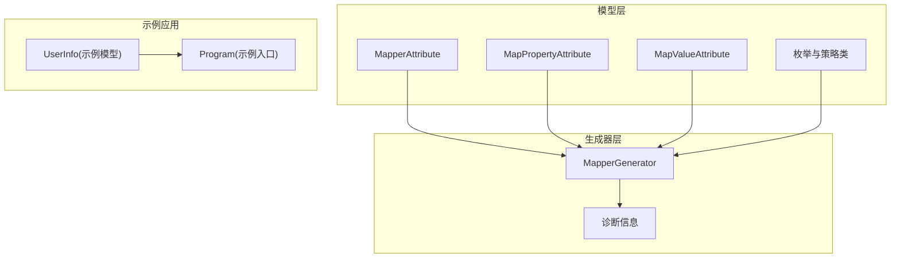
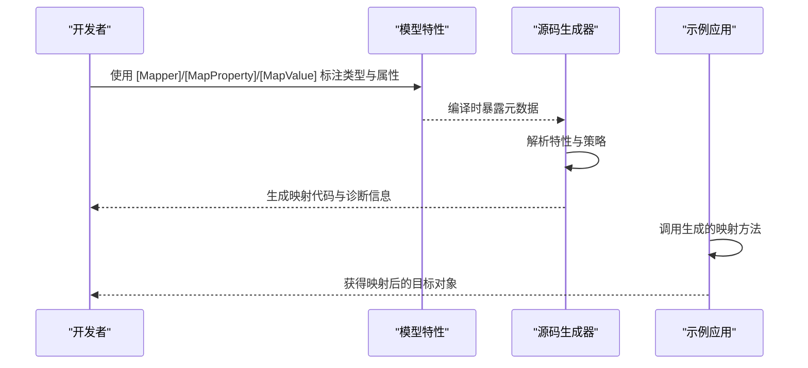
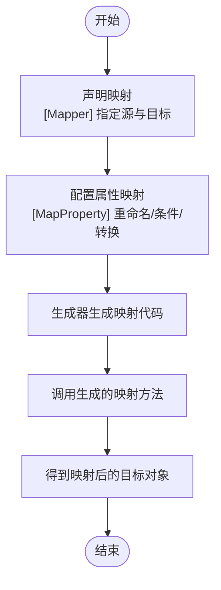
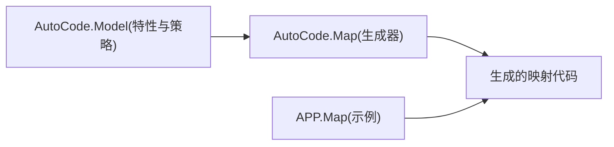

# 映射基础

<cite>
**本文引用的文件**   
- [MapperAttribute.cs](file://src/AutoCode.Model/AutoMapperModel/MapperAttribute.cs)
- [MapPropertyAttribute.cs](file://src/AutoCode.Model/AutoMapperModel/MapPropertyAttribute.cs)
- [MapValueAttribute.cs](file://src/AutoCode.Model/AutoMapperModel/MapValueAttribute.cs)
- [EnumMappingStrategy.cs](file://src/AutoCode.Model/AutoMapperModel/EnumMappingStrategy.cs)
- [PropertyNameMappingStrategy.cs](file://src/AutoCode.Model/AutoMapperModel/PropertyNameMappingStrategy.cs)
- [RequiredMappingStrategy.cs](file://src/AutoCode.Model/AutoMapperModel/RequiredMappingStrategy.cs)
- [MappingConversionType.cs](file://src/AutoCode.Model/AutoMapperModel/MappingConversionType.cs)
- [MemberVisibility.cs](file://src/AutoCode.Model/AutoMapperModel/MemberVisibility.cs)
- [FormatProviderAttribute.cs](file://src/AutoCode.Model/AutoMapperModel/FormatProviderAttribute.cs)
- [IgnoreObsoleteMembersStrategy.cs](file://src/AutoCode.Model/AutoMapperModel/IgnoreObsoleteMembersStrategy.cs)
- [MapperGenerator.cs](file://src/AutoCode.Map/MapperGenerator.cs)
- [DiagnosticDescriptors.cs](file://src/AutoCode.Map/Diagnostics/DiagnosticDescriptors.cs)
- [UserInfo.cs](file://src/APP.Map/UserInfo.cs)
- [Program.cs](file://src/APP.Map/Program.cs)
</cite>

## 目录
1. [简介](#简介)
2. [项目结构](#项目结构)
3. [核心组件](#核心组件)
4. [架构总览](#架构总览)
5. [详细组件分析](#详细组件分析)
6. [依赖关系分析](#依赖关系分析)
7. [性能考虑](#性能考虑)
8. [故障排查指南](#故障排查指南)
9. [结论](#结论)
10. [附录](#附录)

## 简介
本章节面向初学者，系统介绍 AutoCode 映射框架的基础概念与使用方法。重点包括：
- 使用 [Mapper] 属性声明源类型与目标类型的映射关系
- 使用 [MapProperty] 属性进行属性重命名、条件映射与值转换
- 通过简单示例理解一对一属性映射的基本模式
- 常见映射场景与最佳实践，帮助你快速上手自动映射功能

## 项目结构
AutoCode 的映射能力由“模型定义 + 源码生成器”两部分组成：
- 模型定义位于 AutoCode.Model，包含所有用于描述映射行为的特性（如 [Mapper]、[MapProperty]、[MapValue] 等）
- 源码生成器位于 AutoCode.Map，负责扫描带有特性的类型并生成映射代码
- APP.Map 提供实际的使用示例，展示如何声明映射并在运行时调用生成的映射方法

图表来源 
- [MapperAttribute.cs](file://src/AutoCode.Model/AutoMapperModel/MapperAttribute.cs)
- [MapPropertyAttribute.cs](file://src/AutoCode.Model/AutoMapperModel/MapPropertyAttribute.cs)
- [MapValueAttribute.cs](file://src/AutoCode.Model/AutoMapperModel/MapValueAttribute.cs)
- [EnumMappingStrategy.cs](file://src/AutoCode.Model/AutoMapperModel/EnumMappingStrategy.cs)
- [PropertyNameMappingStrategy.cs](file://src/AutoCode.Model/AutoMapperModel/PropertyNameMappingStrategy.cs)
- [RequiredMappingStrategy.cs](file://src/AutoCode.Model/AutoMapperModel/RequiredMappingStrategy.cs)
- [MappingConversionType.cs](file://src/AutoCode.Model/AutoMapperModel/MappingConversionType.cs)
- [MemberVisibility.cs](file://src/AutoCode.Model/AutoMapperModel/MemberVisibility.cs)
- [FormatProviderAttribute.cs](file://src/AutoCode.Model/AutoMapperModel/FormatProviderAttribute.cs)
- [IgnoreObsoleteMembersStrategy.cs](file://src/AutoCode.Model/AutoMapperModel/IgnoreObsoleteMembersStrategy.cs)
- [MapperGenerator.cs](file://src/AutoCode.Map/MapperGenerator.cs)
- [DiagnosticDescriptors.cs](file://src/AutoCode.Map/Diagnostics/DiagnosticDescriptors.cs)
- [UserInfo.cs](file://src/APP.Map/UserInfo.cs)
- [Program.cs](file://src/APP.Map/Program.cs)

章节来源
- [MapperAttribute.cs](file://src/AutoCode.Model/AutoMapperModel/MapperAttribute.cs)
- [MapPropertyAttribute.cs](file://src/AutoCode.Model/AutoMapperModel/MapPropertyAttribute.cs)
- [MapValueAttribute.cs](file://src/AutoCode.Model/AutoMapperModel/MapValueAttribute.cs)
- [MapperGenerator.cs](file://src/AutoCode.Map/MapperGenerator.cs)
- [UserInfo.cs](file://src/APP.Map/UserInfo.cs)
- [Program.cs](file://src/APP.Map/Program.cs)

## 核心组件
- 映射特性（Attributes）
  - [Mapper]：声明一个映射关系，指定源类型与目标类型
  - [MapProperty]：对单个属性进行重命名、条件映射或值转换
  - [MapValue]：为特定值或范围提供转换逻辑
- 策略与枚举
  - 枚举映射策略、属性名映射策略、必需映射策略、成员可见性、格式化提供者等
- 源码生成器
  - 扫描带有特性的类型，生成高性能映射代码
  - 在编译期输出诊断信息，帮助定位配置问题

章节来源
- [MapperAttribute.cs](file://src/AutoCode.Model/AutoMapperModel/MapperAttribute.cs)
- [MapPropertyAttribute.cs](file://src/AutoCode.Model/AutoMapperModel/MapPropertyAttribute.cs)
- [MapValueAttribute.cs](file://src/AutoCode.Model/AutoMapperModel/MapValueAttribute.cs)
- [EnumMappingStrategy.cs](file://src/AutoCode.Model/AutoMapperModel/EnumMappingStrategy.cs)
- [PropertyNameMappingStrategy.cs](file://src/AutoCode.Model/AutoMapperModel/PropertyNameMappingStrategy.cs)
- [RequiredMappingStrategy.cs](file://src/AutoCode.Model/AutoMapperModel/RequiredMappingStrategy.cs)
- [MappingConversionType.cs](file://src/AutoCode.Model/AutoMapperModel/MappingConversionType.cs)
- [MemberVisibility.cs](file://src/AutoCode.Model/AutoMapperModel/MemberVisibility.cs)
- [FormatProviderAttribute.cs](file://src/AutoCode.Model/AutoMapperModel/FormatProviderAttribute.cs)
- [IgnoreObsoleteMembersStrategy.cs](file://src/AutoCode.Model/AutoMapperModel/IgnoreObsoleteMembersStrategy.cs)
- [MapperGenerator.cs](file://src/AutoCode.Map/MapperGenerator.cs)
- [DiagnosticDescriptors.cs](file://src/AutoCode.Map/Diagnostics/DiagnosticDescriptors.cs)

## 架构总览
下图展示了从“特性声明”到“生成映射代码”的整体流程，以及示例应用如何使用生成的映射方法。

图表来源 
- [MapperAttribute.cs](file://src/AutoCode.Model/AutoMapperModel/MapperAttribute.cs)
- [MapPropertyAttribute.cs](file://src/AutoCode.Model/AutoMapperModel/MapPropertyAttribute.cs)
- [MapValueAttribute.cs](file://src/AutoCode.Model/AutoMapperModel/MapValueAttribute.cs)
- [MapperGenerator.cs](file://src/AutoCode.Map/MapperGenerator.cs)
- [UserInfo.cs](file://src/APP.Map/UserInfo.cs)
- [Program.cs](file://src/APP.Map/Program.cs)

## 详细组件分析

### [Mapper] 属性：源类型与目标类型配置
- 作用：声明一对源类型与目标类型的映射关系
- 典型用法：在源类型上添加 [Mapper]，指定目标类型；生成器会据此生成映射方法
- 适用场景：DTO 与领域模型之间的双向或单向映射

章节来源
- [MapperAttribute.cs](file://src/AutoCode.Model/AutoMapperModel/MapperAttribute.cs)

### [MapProperty] 属性：属性重命名、条件映射与值转换
- 属性重命名：将源属性的名称映射到目标属性的不同名称
- 条件映射：根据条件决定是否映射某个属性或跳过空值
- 值转换：结合 [MapValue] 或内置转换规则，对属性值进行转换
- 常用组合：[MapProperty(Name=..., Condition=..., Value=...)]

章节来源
- [MapPropertyAttribute.cs](file://src/AutoCode.Model/AutoMapperModel/MapPropertyAttribute.cs)
- [MapValueAttribute.cs](file://src/AutoCode.Model/AutoMapperModel/MapValueAttribute.cs)

### 映射策略与枚举
- 枚举映射策略：控制枚举值的匹配与转换方式
- 属性名映射策略：决定属性名的匹配规则（大小写、前缀后缀等）
- 必需映射策略：强制要求某些属性必须存在映射，避免遗漏
- 成员可见性：控制是否映射私有/内部成员
- 格式化提供者：为数值/日期等类型提供自定义格式

章节来源
- [EnumMappingStrategy.cs](file://src/AutoCode.Model/AutoMapperModel/EnumMappingStrategy.cs)
- [PropertyNameMappingStrategy.cs](file://src/AutoCode.Model/AutoMapperModel/PropertyNameMappingStrategy.cs)
- [RequiredMappingStrategy.cs](file://src/AutoCode.Model/AutoMapperModel/RequiredMappingStrategy.cs)
- [MemberVisibility.cs](file://src/AutoCode.Model/AutoMapperModel/MemberVisibility.cs)
- [FormatProviderAttribute.cs](file://src/AutoCode.Model/AutoMapperModel/FormatProviderAttribute.cs)
- [IgnoreObsoleteMembersStrategy.cs](file://src/AutoCode.Model/AutoMapperModel/IgnoreObsoleteMembersStrategy.cs)

### 源码生成器与诊断
- MapperGenerator：解析特性与策略，生成映射代码
- DiagnosticDescriptors：定义编译期诊断消息，便于定位配置错误

章节来源
- [MapperGenerator.cs](file://src/AutoCode.Map/MapperGenerator.cs)
- [DiagnosticDescriptors.cs](file://src/AutoCode.Map/Diagnostics/DiagnosticDescriptors.cs)

### 示例：一对一属性映射
- 在示例项目中，通过 UserInfo 与 Program 演示了基本的映射声明与调用
- 步骤概览：
  1) 在源类型上使用 [Mapper] 声明目标类型
  2) 使用 [MapProperty] 处理属性重命名或值转换
  3) 运行程序，调用生成的映射方法获取目标对象

图表来源 
- [UserInfo.cs](file://src/APP.Map/UserInfo.cs)
- [Program.cs](file://src/APP.Map/Program.cs)
- [MapperAttribute.cs](file://src/AutoCode.Model/AutoMapperModel/MapperAttribute.cs)
- [MapPropertyAttribute.cs](file://src/AutoCode.Model/AutoMapperModel/MapPropertyAttribute.cs)
- [MapperGenerator.cs](file://src/AutoCode.Map/MapperGenerator.cs)

章节来源
- [UserInfo.cs](file://src/APP.Map/UserInfo.cs)
- [Program.cs](file://src/APP.Map/Program.cs)

## 依赖关系分析
- 模型层（AutoCode.Model）提供所有映射相关的特性与策略
- 生成器层（AutoCode.Map）依赖模型层，解析特性并生成映射代码
- 示例应用（APP.Map）依赖生成器产出的映射方法

图表来源 
- [MapperAttribute.cs](file://src/AutoCode.Model/AutoMapperModel/MapperAttribute.cs)
- [MapPropertyAttribute.cs](file://src/AutoCode.Model/AutoMapperModel/MapPropertyAttribute.cs)
- [MapValueAttribute.cs](file://src/AutoCode.Model/AutoMapperModel/MapValueAttribute.cs)
- [MapperGenerator.cs](file://src/AutoCode.Map/MapperGenerator.cs)
- [UserInfo.cs](file://src/APP.Map/UserInfo.cs)
- [Program.cs](file://src/APP.Map/Program.cs)

章节来源
- [MapperAttribute.cs](file://src/AutoCode.Model/AutoMapperModel/MapperAttribute.cs)
- [MapPropertyAttribute.cs](file://src/AutoCode.Model/AutoMapperModel/MapPropertyAttribute.cs)
- [MapValueAttribute.cs](file://src/AutoCode.Model/AutoMapperModel/MapValueAttribute.cs)
- [MapperGenerator.cs](file://src/AutoCode.Map/MapperGenerator.cs)
- [UserInfo.cs](file://src/APP.Map/UserInfo.cs)
- [Program.cs](file://src/APP.Map/Program.cs)

## 性能考虑
- 生成器在编译期生成映射代码，避免了反射带来的运行时开销
- 合理配置 [MapProperty] 的条件映射可减少不必要的赋值操作
- 使用合适的枚举映射策略与属性名映射策略，降低生成代码复杂度
- 对于复杂值转换，优先使用轻量级转换逻辑，避免在映射路径中引入重型计算

## 故障排查指南
- 检查 [Mapper] 是否正确声明源与目标类型
- 确认 [MapProperty] 的属性名与目标类型一致，避免拼写错误
- 查看生成器的诊断信息，定位配置错误或未满足的必需映射
- 若出现空引用或类型不匹配，检查 [MapValue] 的转换逻辑与条件表达式

章节来源
- [DiagnosticDescriptors.cs](file://src/AutoCode.Map/Diagnostics/DiagnosticDescriptors.cs)
- [MapperGenerator.cs](file://src/AutoCode.Map/MapperGenerator.cs)

## 结论
通过 [Mapper] 与 [MapProperty] 的组合，AutoCode 映射框架提供了简洁而强大的自动映射能力。借助编译期生成的高性能映射代码，你可以在保持代码可读性的同时，显著提升开发效率。建议从简单的“一对一属性映射”入手，逐步掌握条件映射与值转换的高级用法。

## 附录
- 常见映射场景
  - DTO 到领域模型的单向映射
  - 领域模型到 DTO 的双向映射
  - 枚举值与字符串之间的转换
  - 日期时间格式的本地化转换
- 最佳实践
  - 明确定义源与目标的属性对应关系，避免隐式映射歧义
  - 使用 [MapProperty] 显式处理重命名与转换，提高可维护性
  - 利用必需映射策略确保关键属性不被遗漏
  - 在生成器诊断提示下及时修正配置，保证编译期质量