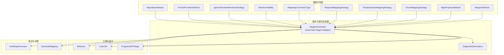
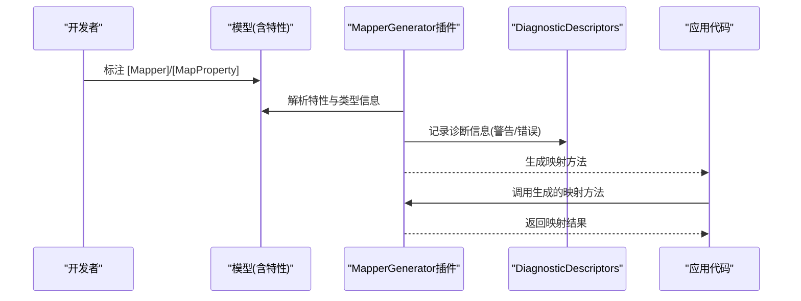
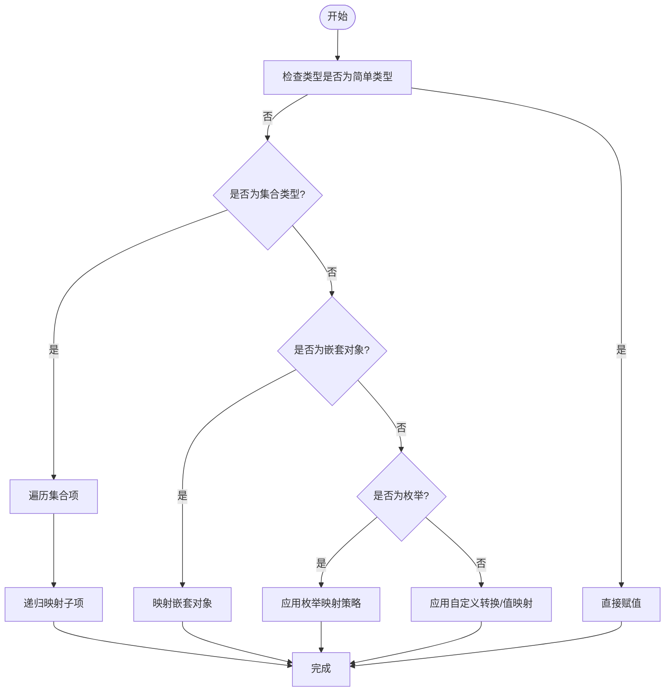
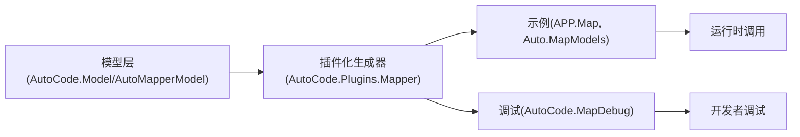

# 映射框架

<cite>
**本文档引用的文件**   
- [MapperAttribute.cs](file://src/AutoCode.Model/AutoMapperModel/MapperAttribute.cs)
- [MapPropertyAttribute.cs](file://src/AutoCode.Model/AutoMapperModel/MapPropertyAttribute.cs)
- [EnumMappingStrategy.cs](file://src/AutoCode.Model/AutoMapperModel/EnumMappingStrategy.cs)
- [PropertyNameMappingStrategy.cs](file://src/AutoCode.Model/AutoMapperModel/PropertyNameMappingStrategy.cs)
- [RequiredMappingStrategy.cs](file://src/AutoCode.Model/AutoMapperModel/RequiredMappingStrategy.cs)
- [MappingConversionType.cs](file://src/AutoCode.Model/AutoMapperModel/MappingConversionType.cs)
- [MemberVisibility.cs](file://src/AutoCode.Model/AutoMapperModel/MemberVisibility.cs)
- [IgnoreObsoleteMembersStrategy.cs](file://src/AutoCode.Model/AutoMapperModel/IgnoreObsoleteMembersStrategy.cs)
- [FormatProviderAttribute.cs](file://src/AutoCode.Model/AutoMapperModel/FormatProviderAttribute.cs)
- [MapValueAttribute.cs](file://src/AutoCode.Model/AutoMapperModel/MapValueAttribute.cs)
- [MapperGenerator.cs](file://src/AutoCode.Plugins.Mapper/MapperGenerator.cs)
- [DiagnosticDescriptors.cs](file://src/AutoCode.Map/Diagnostics/DiagnosticDescriptors.cs)
- [Behavior.cs](file://src/Auto.MapModels/Behavior.cs)
- [UserInfo.cs](file://src/APP.Map/UserInfo.cs)
- [Program.cs](file://src/APP.Map/Program.cs)
- [AutoMapGenerator.cs](file://src/AutoCode.MapDebug/AutoMapGenerator.cs)
- [GenerateMapping.cs](file://src/AutoCode.MapDebug/GenerateMapping.cs)
</cite>

## 更新摘要
**所做更改**   
- 更新了 MapperGenerator 的位置信息，从 AutoCode.Map 迁移到 AutoCode.Plugins.Mapper 命名空间
- 反映了 V2 版本中插件生态系统的架构变更
- 更新了项目结构图和依赖关系分析以反映新的插件架构

## 目录
1. [简介](#简介)
2. [项目结构](#项目结构)
3. [核心组件](#核心组件)
4. [架构总览](#架构总览)
5. [详细组件分析](#详细组件分析)
6. [依赖关系分析](#依赖关系分析)
7. [性能考虑](#性能考虑)
8. [故障排查指南](#故障排查指南)
9. [结论](#结论)
10. [附录](#附录)

## 简介
本文件全面介绍 AutoCode 的自动映射框架，聚焦于基于源码生成器的对象映射能力。框架通过特性（如 [Mapper]、[MapProperty]）声明式配置映射规则，在编译期自动生成高效映射代码，支持复杂类型映射、枚举转换、属性重命名与条件映射等场景，并提供诊断与调试工具辅助问题定位与优化。

**更新** V2 版本中，MapperGenerator 已迁移到 AutoCode.Plugins.Mapper 命名空间，作为插件生态系统的一部分，提供更好的模块化和可扩展性。

## 项目结构
AutoCode 的映射能力由"模型定义 + 插件化源码生成器"两部分组成：
- 模型定义位于 AutoCode.Model/AutoMapperModel，包含各类特性与策略枚举，用于声明映射行为。
- **插件化源码生成器**位于 AutoCode.Plugins.Mapper，核心为 MapperGenerator，负责解析特性并生成映射实现。
- 示例与演示位于 APP.Map 与 Auto.MapModels，展示如何使用特性进行一对一、一对多、嵌套对象等映射。
- 调试与诊断位于 AutoCode.MapDebug 与 Diagnostics，提供生成映射查看与诊断信息。

**图表来源**
- [MapperAttribute.cs](file://src/AutoCode.Model/AutoMapperModel/MapperAttribute.cs)
- [MapPropertyAttribute.cs](file://src/AutoCode.Model/AutoMapperModel/MapPropertyAttribute.cs)
- [EnumMappingStrategy.cs](file://src/AutoCode.Model/AutoMapperModel/EnumMappingStrategy.cs)
- [PropertyNameMappingStrategy.cs](file://src/AutoCode.Model/AutoMapperModel/PropertyNameMappingStrategy.cs)
- [RequiredMappingStrategy.cs](file://src/AutoCode.Model/AutoMapperModel/RequiredMappingStrategy.cs)
- [MappingConversionType.cs](file://src/AutoCode.Model/AutoMapperModel/MappingConversionType.cs)
- [MemberVisibility.cs](file://src/AutoCode.Model/AutoMapperModel/MemberVisibility.cs)
- [IgnoreObsoleteMembersStrategy.cs](file://src/AutoCode.Model/AutoMapperModel/IgnoreObsoleteMembersStrategy.cs)
- [FormatProviderAttribute.cs](file://src/AutoCode.Model/AutoMapperModel/FormatProviderAttribute.cs)
- [MapValueAttribute.cs](file://src/AutoCode.Model/AutoMapperModel/MapValueAttribute.cs)
- [MapperGenerator.cs](file://src/AutoCode.Plugins.Mapper/MapperGenerator.cs)
- [DiagnosticDescriptors.cs](file://src/AutoCode.Map/Diagnostics/DiagnosticDescriptors.cs)
- [Behavior.cs](file://src/Auto.MapModels/Behavior.cs)
- [UserInfo.cs](file://src/APP.Map/UserInfo.cs)
- [Program.cs](file://src/APP.Map/Program.cs)
- [AutoMapGenerator.cs](file://src/AutoCode.MapDebug/AutoMapGenerator.cs)
- [GenerateMapping.cs](file://src/AutoCode.MapDebug/GenerateMapping.cs)

章节来源
- [MapperAttribute.cs](file://src/AutoCode.Model/AutoMapperModel/MapperAttribute.cs)
- [MapPropertyAttribute.cs](file://src/AutoCode.Model/AutoMapperModel/MapPropertyAttribute.cs)
- [MapperGenerator.cs](file://src/AutoCode.Plugins.Mapper/MapperGenerator.cs)
- [Behavior.cs](file://src/Auto.MapModels/Behavior.cs)
- [UserInfo.cs](file://src/APP.Map/UserInfo.cs)
- [Program.cs](file://src/APP.Map/Program.cs)

## 核心组件
- 特性与策略（模型层）
  - [Mapper]：声明一个映射源与目标类型对，并可配置全局映射策略（如枚举转换、属性名匹配、必需成员策略、可见性控制等）。
  - [MapProperty]：针对单个属性的映射规则，包括目标属性重命名、值映射、格式化提供者、条件映射等。
  - 策略枚举：
    - EnumMappingStrategy：枚举映射策略（如按名称、按值、自定义转换等）。
    - PropertyNameMappingStrategy：属性名匹配策略（如大小写不敏感、下划线转驼峰等）。
    - RequiredMappingStrategy：必需成员策略（如要求源/目标存在对应成员）。
    - MappingConversionType：映射转换类型（如直接赋值、表达式转换、委托转换等）。
    - MemberVisibility：成员可见性（如仅公开属性、包含私有字段等）。
    - IgnoreObsoleteMembersStrategy：忽略过时成员的开关。
  - 其他：
    - FormatProviderAttribute：为数值或日期时间等类型的格式化/解析提供 IFormatProvider。
    - MapValueAttribute：为特定值映射提供常量或表达式映射。

- **插件化源码生成器（实现层）**
  - **MapperGenerator（AutoCode.Plugins.Mapper）**：解析带有 [Mapper]/[MapProperty] 的类型与成员，结合策略生成高性能映射代码（避免反射开销），并输出诊断信息。作为插件生态系统的一部分，提供更好的模块化和扩展性。
  - DiagnosticDescriptors：集中管理诊断 ID、消息模板与严重级别，便于错误提示与定位。

- 示例与调试
  - Behavior、UserInfo：演示不同映射场景（一对一、一对多、嵌套对象、枚举转换等）。
  - Program(APP.Map)：调用生成的映射方法，验证映射结果。
  - AutoMapGenerator、GenerateMapping：辅助查看生成映射的代码或中间表示，便于调试。

章节来源
- [MapperAttribute.cs](file://src/AutoCode.Model/AutoMapperModel/MapperAttribute.cs)
- [MapPropertyAttribute.cs](file://src/AutoCode.Model/AutoMapperModel/MapPropertyAttribute.cs)
- [EnumMappingStrategy.cs](file://src/AutoCode.Model/AutoMapperModel/EnumMappingStrategy.cs)
- [PropertyNameMappingStrategy.cs](file://src/AutoCode.Model/AutoMapperModel/PropertyNameMappingStrategy.cs)
- [RequiredMappingStrategy.cs](file://src/AutoCode.Model/AutoMapperModel/RequiredMappingStrategy.cs)
- [MappingConversionType.cs](file://src/AutoCode.Model/AutoMapperModel/MappingConversionType.cs)
- [MemberVisibility.cs](file://src/AutoCode.Model/AutoMapperModel/MemberVisibility.cs)
- [IgnoreObsoleteMembersStrategy.cs](file://src/AutoCode.Model/AutoMapperModel/IgnoreObsoleteMembersStrategy.cs)
- [FormatProviderAttribute.cs](file://src/AutoCode.Model/AutoMapperModel/FormatProviderAttribute.cs)
- [MapValueAttribute.cs](file://src/AutoCode.Model/AutoMapperModel/MapValueAttribute.cs)
- [MapperGenerator.cs](file://src/AutoCode.Plugins.Mapper/MapperGenerator.cs)
- [DiagnosticDescriptors.cs](file://src/AutoCode.Map/Diagnostics/DiagnosticDescriptors.cs)
- [Behavior.cs](file://src/Auto.MapModels/Behavior.cs)
- [UserInfo.cs](file://src/APP.Map/UserInfo.cs)
- [Program.cs](file://src/APP.Map/Program.cs)
- [AutoMapGenerator.cs](file://src/AutoCode.MapDebug/AutoMapGenerator.cs)
- [GenerateMapping.cs](file://src/AutoCode.MapDebug/GenerateMapping.cs)

## 架构总览
AutoCode 映射框架采用"声明式特性 + 插件化编译期源码生成"的架构：
- 开发者在模型上标注 [Mapper]、[MapProperty] 等特性，描述映射意图。
- **插件化的源码生成器**在编译时读取这些特性与类型信息，生成高效的映射实现代码。
- 运行时直接调用生成的映射方法，无反射开销，具备接近手写代码的性能。
- 诊断系统提供清晰的错误信息与定位，调试工具帮助查看生成代码。

**更新** V2 版本引入了插件生态系统，MapperGenerator 现在作为独立插件存在于 AutoCode.Plugins.Mapper 命名空间中，提供了更好的模块化架构和扩展能力。

**图表来源**
- [MapperAttribute.cs](file://src/AutoCode.Model/AutoMapperModel/MapperAttribute.cs)
- [MapPropertyAttribute.cs](file://src/AutoCode.Model/AutoMapperModel/MapPropertyAttribute.cs)
- [MapperGenerator.cs](file://src/AutoCode.Plugins.Mapper/MapperGenerator.cs)
- [DiagnosticDescriptors.cs](file://src/AutoCode.Map/Diagnostics/DiagnosticDescriptors.cs)

## 详细组件分析

### 特性与策略详解
- [Mapper]
  - 作用：声明源类型到目标类型的映射，可配置全局策略（枚举、属性名、必需成员、可见性等）。
  - 典型用法：在类上标注，指定源/目标类型及策略选项。
  - 影响范围：该映射内的所有属性默认遵循此策略，除非被 [MapProperty] 覆盖。

- [MapProperty]
  - 作用：针对单个属性的映射规则，支持重命名、值映射、格式化、条件映射等。
  - 典型用法：在目标属性上标注，指定源属性名、值映射表达式或格式化提供者。

- 策略枚举
  - EnumMappingStrategy：控制枚举如何映射（名称匹配、值匹配、自定义转换）。
  - PropertyNameMappingStrategy：控制属性名如何匹配（大小写、分隔符转换等）。
  - RequiredMappingStrategy：控制是否要求源/目标成员必须存在。
  - MappingConversionType：控制转换方式（直接赋值、表达式、委托等）。
  - MemberVisibility：控制成员可见性（公开/私有等）。
  - IgnoreObsoleteMembersStrategy：控制是否忽略标记为过时的成员。

- 其他特性
  - FormatProviderAttribute：为数值/日期时间等提供格式化/解析上下文。
  - MapValueAttribute：为特定值映射提供常量或表达式。

章节来源
- [MapperAttribute.cs](file://src/AutoCode.Model/AutoMapperModel/MapperAttribute.cs)
- [MapPropertyAttribute.cs](file://src/AutoCode.Model/AutoMapperModel/MapPropertyAttribute.cs)
- [EnumMappingStrategy.cs](file://src/AutoCode.Model/AutoMapperModel/EnumMappingStrategy.cs)
- [PropertyNameMappingStrategy.cs](file://src/AutoCode.Model/AutoMapperModel/PropertyNameMappingStrategy.cs)
- [RequiredMappingStrategy.cs](file://src/AutoCode.Model/AutoMapperModel/RequiredMappingStrategy.cs)
- [MappingConversionType.cs](file://src/AutoCode.Model/AutoMapperModel/MappingConversionType.cs)
- [MemberVisibility.cs](file://src/AutoCode.Model/AutoMapperModel/MemberVisibility.cs)
- [IgnoreObsoleteMembersStrategy.cs](file://src/AutoCode.Model/AutoMapperModel/IgnoreObsoleteMembersStrategy.cs)
- [FormatProviderAttribute.cs](file://src/AutoCode.Model/AutoMapperModel/FormatProviderAttribute.cs)
- [MapValueAttribute.cs](file://src/AutoCode.Model/AutoMapperModel/MapValueAttribute.cs)

### 插件化源码生成器与诊断
- **MapperGenerator（AutoCode.Plugins.Mapper）**
  - 职责：解析特性与类型，生成映射代码；处理复杂类型、集合、嵌套对象、枚举转换等。
  - 输出：生成映射方法与辅助方法，确保类型安全与性能。
  - 集成：作为插件生态系统的一部分，与诊断系统协作，输出清晰的错误与警告信息。
  - **V2 改进**：迁移到独立的插件命名空间，提供更好的模块化和扩展性。

- DiagnosticDescriptors
  - 职责：集中管理诊断 ID、消息模板与严重级别，统一错误提示格式。
  - 使用：在解析失败、类型不匹配、策略冲突等场景输出诊断。

章节来源
- [MapperGenerator.cs](file://src/AutoCode.Plugins.Mapper/MapperGenerator.cs)
- [DiagnosticDescriptors.cs](file://src/AutoCode.Map/Diagnostics/DiagnosticDescriptors.cs)

### 示例与调试
- Behavior、UserInfo
  - 用途：演示不同映射场景（一对一、一对多、嵌套对象、枚举转换等）。
  - 特点：通过特性声明映射规则，无需手写映射代码。

- Program(APP.Map)
  - 用途：调用生成的映射方法，验证映射结果。
  - 流程：创建源对象 -> 调用映射方法 -> 检查目标对象。

- AutoMapGenerator、GenerateMapping
  - 用途：辅助查看生成映射的代码或中间表示，便于调试。
  - 价值：快速定位映射规则问题，优化映射逻辑。

章节来源
- [Behavior.cs](file://src/Auto.MapModels/Behavior.cs)
- [UserInfo.cs](file://src/APP.Map/UserInfo.cs)
- [Program.cs](file://src/APP.Map/Program.cs)
- [AutoMapGenerator.cs](file://src/AutoCode.MapDebug/AutoMapGenerator.cs)
- [GenerateMapping.cs](file://src/AutoCode.MapDebug/GenerateMapping.cs)

### 复杂类型映射与策略流程图
以下流程图展示了复杂类型映射的核心决策路径（概念性说明，非具体代码）：

**图表来源**
- [MapperGenerator.cs](file://src/AutoCode.Plugins.Mapper/MapperGenerator.cs)
- [EnumMappingStrategy.cs](file://src/AutoCode.Model/AutoMapperModel/EnumMappingStrategy.cs)
- [MappingConversionType.cs](file://src/AutoCode.Model/AutoMapperModel/MappingConversionType.cs)

## 依赖关系分析
- 模型层（AutoCode.Model/AutoMapperModel）
  - 提供特性与策略枚举，供生成器解析。
  - 低耦合，仅定义元数据。

- **插件化生成器层（AutoCode.Plugins.Mapper）**
  - 依赖模型层特性与策略。
  - 输出映射代码，依赖 .NET 源码生成器 API。
  - **V2 改进**：作为独立插件存在，提供更好的模块化和扩展性。

- 示例层（APP.Map、Auto.MapModels）
  - 使用特性声明映射，调用生成的映射方法。
  - 与生成器解耦，仅依赖生成的代码。

- 调试层（AutoCode.MapDebug）
  - 依赖生成器输出，提供调试工具。

**图表来源**
- [MapperAttribute.cs](file://src/AutoCode.Model/AutoMapperModel/MapperAttribute.cs)
- [MapPropertyAttribute.cs](file://src/AutoCode.Model/AutoMapperModel/MapPropertyAttribute.cs)
- [MapperGenerator.cs](file://src/AutoCode.Plugins.Mapper/MapperGenerator.cs)
- [Behavior.cs](file://src/Auto.MapModels/Behavior.cs)
- [UserInfo.cs](file://src/APP.Map/UserInfo.cs)
- [Program.cs](file://src/APP.Map/Program.cs)
- [AutoMapGenerator.cs](file://src/AutoCode.MapDebug/AutoMapGenerator.cs)
- [GenerateMapping.cs](file://src/AutoCode.Mapdebug/GenerateMapping.cs)

章节来源
- [MapperAttribute.cs](file://src/AutoCode.Model/AutoMapperModel/MapperAttribute.cs)
- [MapPropertyAttribute.cs](file://src/AutoCode.Model/AutoMapperModel/MapPropertyAttribute.cs)
- [MapperGenerator.cs](file://src/AutoCode.Plugins.Mapper/MapperGenerator.cs)
- [Behavior.cs](file://src/Auto.MapModels/Behavior.cs)
- [UserInfo.cs](file://src/APP.Map/UserInfo.cs)
- [Program.cs](file://src/APP.Map/Program.cs)
- [AutoMapGenerator.cs](file://src/AutoCode.MapDebug/AutoMapGenerator.cs)
- [GenerateMapping.cs](file://src/AutoCode.MapDebug/GenerateMapping.cs)

## 性能考虑
- 编译期生成：避免运行期反射，提升性能。
- 直接赋值优先：简单类型与集合项尽量使用直接赋值。
- 缓存策略：对于复杂映射，可考虑缓存映射实例（若框架支持）。
- 最小化转换：减少不必要的类型转换与装箱拆箱。
- 选择性映射：仅映射需要的属性，避免冗余操作。
- **V2 性能优势**：插件化架构允许更细粒度的性能优化和按需加载。

## 故障排查指南
- 常见错误
  - 类型不匹配：检查源/目标类型是否兼容，必要时使用自定义转换。
  - 属性名不匹配：调整属性名匹配策略或使用 [MapProperty] 重命名。
  - 枚举映射失败：确认枚举映射策略是否正确。
  - 必需成员缺失：启用或调整 RequiredMappingStrategy。

- 诊断信息
  - 查看 DiagnosticDescriptors 中的错误消息与严重级别。
  - 使用调试工具（AutoMapGenerator、GenerateMapping）查看生成代码。

- 调试技巧
  - 逐步检查特性标注是否正确。
  - 简化映射规则，逐步定位问题。
  - 使用单元测试验证映射结果。
  - **V2 调试改进**：插件化架构使得问题隔离和调试更加容易。

章节来源
- [DiagnosticDescriptors.cs](file://src/AutoCode.Map/Diagnostics/DiagnosticDescriptors.cs)
- [AutoMapGenerator.cs](file://src/AutoCode.MapDebug/AutoMapGenerator.cs)
- [GenerateMapping.cs](file://src/AutoCode.MapDebug/GenerateMapping.cs)

## 结论
AutoCode 的自动映射框架通过声明式特性与**插件化源码生成技术**，提供了高效、灵活的对象映射解决方案。V2 版本将 MapperGenerator 迁移到 AutoCode.Plugins.Mapper 命名空间，作为插件生态系统的一部分，提供了更好的模块化架构和扩展能力。框架支持复杂类型映射、枚举转换、属性重命名与条件映射等丰富场景，并通过诊断与调试工具提升开发体验。建议在实际项目中合理配置策略，优化映射性能，并利用调试工具快速定位问题。

## 附录
- 最佳实践
  - 明确映射意图：使用 [Mapper] 清晰声明源/目标类型。
  - 精细化控制：使用 [MapProperty] 针对属性定制映射规则。
  - 策略一致性：保持属性名匹配与枚举映射策略的一致性。
  - 性能优先：优先使用直接赋值与简单转换，避免复杂表达式。
  - 测试驱动：编写单元测试验证映射结果的正确性。
  - **V2 插件化实践**：利用插件生态系统进行功能扩展和定制化开发。