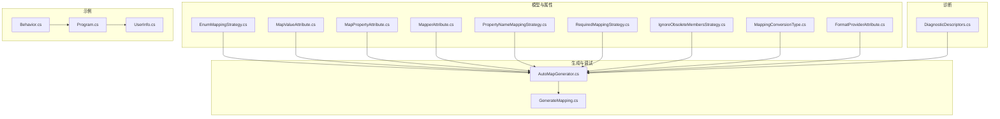
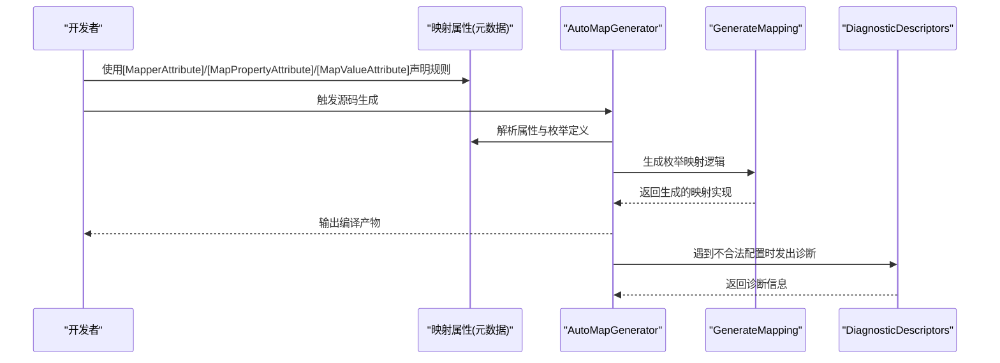
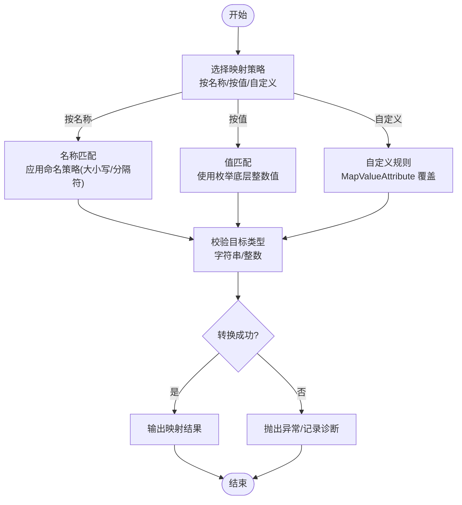
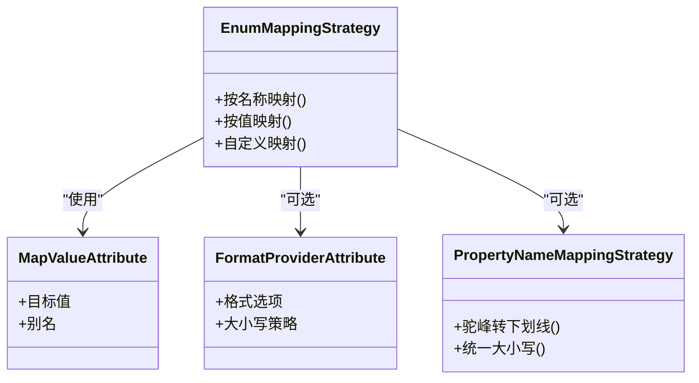
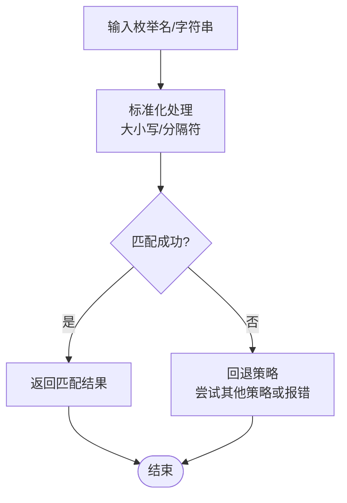
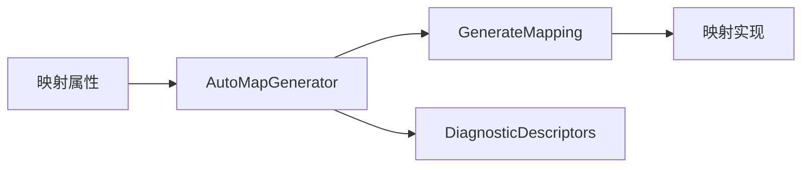

# 枚举映射

<cite>
**本文引用的文件**   
- [EnumMappingStrategy.cs](file://src/AutoCode.Model/AutoMapperModel/EnumMappingStrategy.cs)
- [MapValueAttribute.cs](file://src/AutoCode.Model/AutoMapperModel/MapValueAttribute.cs)
- [MapPropertyAttribute.cs](file://src/AutoCode.Model/AutoMapperModel/MapPropertyAttribute.cs)
- [MapperAttribute.cs](file://src/AutoCode.Model/AutoMapperModel/MapperAttribute.cs)
- [PropertyNameMappingStrategy.cs](file://src/AutoCode.Model/AutoMapperModel/PropertyNameMappingStrategy.cs)
- [RequiredMappingStrategy.cs](file://src/AutoCode.Model/AutoMapperModel/RequiredMappingStrategy.cs)
- [IgnoreObsoleteMembersStrategy.cs](file://src/AutoCode.Model/AutoMapperModel/IgnoreObsoleteMembersStrategy.cs)
- [MappingConversionType.cs](file://src/AutoCode.Model/AutoMapperModel/MappingConversionType.cs)
- [FormatProviderAttribute.cs](file://src/AutoCode.Model/AutoMapperModel/FormatProviderAttribute.cs)
- [Behavior.cs](file://src/Auto.MapModels/Behavior.cs)
- [AutoMapGenerator.cs](file://src/AutoCode.MapDebug/AutoMapGenerator.cs)
- [GenerateMapping.cs](file://src/AutoCode.MapDebug/GenerateMapping.cs)
- [Diagnostics.cs](file://src/AutoCode.Map/Diagnostics/DiagnosticDescriptors.cs)
- [Program.cs](file://src/APP/Program.cs)
- [UserInfo.cs](file://src/APP.Map/UserInfo.cs)
</cite>

## 目录
1. [简介](#简介)
2. [项目结构](#项目结构)
3. [核心组件](#核心组件)
4. [架构总览](#架构总览)
5. [详细组件分析](#详细组件分析)
6. [依赖关系分析](#依赖关系分析)
7. [性能考虑](#性能考虑)
8. [故障排查指南](#故障排查指南)
9. [结论](#结论)
10. [附录](#附录)

## 简介
本文件系统性介绍 AutoCode 的枚举映射功能，重点覆盖以下方面：
- 枚举映射策略 EnumMappingStrategy 的分类与适用场景（按名称映射、按值映射、自定义映射规则）
- 枚举与字符串、整数之间的转换机制
- 命名约定处理与大小写转换
- 错误处理与调试技巧
- 丰富的示例说明（以路径引用形式提供，避免直接展示代码内容）

## 项目结构
与枚举映射相关的核心代码主要分布在以下模块：
- 模型与属性定义：AutoCode.Model/AutoMapperModel
- 映射生成与调试：AutoCode.MapDebug
- 诊断与错误描述：AutoCode.Map/Diagnostics
- 示例应用：APP、APP.Map

图表来源
- [EnumMappingStrategy.cs](file://src/AutoCode.Model/AutoMapperModel/EnumMappingStrategy.cs)
- [MapValueAttribute.cs](file://src/AutoCode.Model/AutoMapperModel/MapValueAttribute.cs)
- [MapPropertyAttribute.cs](file://src/AutoCode.Model/AutoMapperModel/MapPropertyAttribute.cs)
- [MapperAttribute.cs](file://src/AutoCode.Model/AutoMapperModel/MapperAttribute.cs)
- [PropertyNameMappingStrategy.cs](file://src/AutoCode.Model/AutoMapperModel/PropertyNameMappingStrategy.cs)
- [RequiredMappingStrategy.cs](file://src/AutoCode.Model/AutoMapperModel/RequiredMappingStrategy.cs)
- [IgnoreObsoleteMembersStrategy.cs](file://src/AutoCode.Model/AutoMapperModel/IgnoreObsoleteMembersStrategy.cs)
- [MappingConversionType.cs](file://src/AutoCode.Model/AutoMapperModel/MappingConversionType.cs)
- [FormatProviderAttribute.cs](file://src/AutoCode.Model/AutoMapperModel/FormatProviderAttribute.cs)
- [AutoMapGenerator.cs](file://src/AutoCode.MapDebug/AutoMapGenerator.cs)
- [GenerateMapping.cs](file://src/AutoCode.MapDebug/GenerateMapping.cs)
- [DiagnosticDescriptors.cs](file://src/AutoCode.Map/Diagnostics/DiagnosticDescriptors.cs)
- [Behavior.cs](file://src/Auto.MapModels/Behavior.cs)
- [Program.cs](file://src/APP/Program.cs)
- [UserInfo.cs](file://src/APP.Map/UserInfo.cs)

章节来源
- [EnumMappingStrategy.cs](file://src/AutoCode.Model/AutoMapperModel/EnumMappingStrategy.cs)
- [MapValueAttribute.cs](file://src/AutoCode.Model/AutoMapperModel/MapValueAttribute.cs)
- [MapPropertyAttribute.cs](file://src/AutoCode.Model/AutoMapperModel/MapPropertyAttribute.cs)
- [MapperAttribute.cs](file://src/AutoCode.Model/AutoMapperModel/MapperAttribute.cs)
- [PropertyNameMappingStrategy.cs](file://src/AutoCode.Model/AutoMapperModel/PropertyNameMappingStrategy.cs)
- [RequiredMappingStrategy.cs](file://src/AutoCode.Model/AutoMapperModel/RequiredMappingStrategy.cs)
- [IgnoreObsoleteMembersStrategy.cs](file://src/AutoCode.Model/AutoMapperModel/IgnoreObsoleteMembersStrategy.cs)
- [MappingConversionType.cs](file://src/AutoCode.Model/AutoMapperModel/MappingConversionType.cs)
- [FormatProviderAttribute.cs](file://src/AutoCode.Model/AutoMapperModel/FormatProviderAttribute.cs)
- [AutoMapGenerator.cs](file://src/AutoCode.MapDebug/AutoMapGenerator.cs)
- [GenerateMapping.cs](file://src/AutoCode.MapDebug/GenerateMapping.cs)
- [DiagnosticDescriptors.cs](file://src/AutoCode.Map/Diagnostics/DiagnosticDescriptors.cs)
- [Behavior.cs](file://src/Auto.MapModels/Behavior.cs)
- [Program.cs](file://src/APP/Program.cs)
- [UserInfo.cs](file://src/APP.Map/UserInfo.cs)

## 核心组件
- 枚举映射策略 EnumMappingStrategy：定义枚举映射的核心策略类型，支持按名称匹配、按值匹配以及自定义规则。
- MapValueAttribute：用于为枚举成员指定自定义映射值或别名，便于与外部系统保持一致。
- MapPropertyAttribute：在属性级别控制映射行为，包括是否忽略、目标类型、格式提供者等。
- MapperAttribute：声明类级别的映射配置，可设置全局的枚举映射策略、命名策略、必需映射策略等。
- PropertyNameMappingStrategy：命名映射策略，决定如何对属性名进行规范化（如驼峰、下划线、大小写转换）。
- RequiredMappingStrategy：必需映射策略，控制未映射成员的报错或警告行为。
- IgnoreObsoleteMembersStrategy：忽略过时成员的策略，避免对标记为废弃的成员进行映射。
- MappingConversionType：映射转换类型，指示枚举与字符串、整数之间的转换方向与方式。
- FormatProviderAttribute：格式化提供者，用于自定义枚举到字符串的格式输出（如区域性、大小写、前缀后缀等）。

章节来源
- [EnumMappingStrategy.cs](file://src/AutoCode.Model/AutoMapperModel/EnumMappingStrategy.cs)
- [MapValueAttribute.cs](file://src/AutoCode.Model/AutoMapperModel/MapValueAttribute.cs)
- [MapPropertyAttribute.cs](file://src/AutoCode.Model/AutoMapperModel/MapPropertyAttribute.cs)
- [MapperAttribute.cs](file://src/AutoCode.Model/AutoMapperModel/MapperAttribute.cs)
- [PropertyNameMappingStrategy.cs](file://src/AutoCode.Model/AutoMapperModel/PropertyNameMappingStrategy.cs)
- [RequiredMappingStrategy.cs](file://src/AutoCode.Model/AutoMapperModel/RequiredMappingStrategy.cs)
- [IgnoreObsoleteMembersStrategy.cs](file://src/AutoCode.Model/AutoMapperModel/IgnoreObsoleteMembersStrategy.cs)
- [MappingConversionType.cs](file://src/AutoCode.Model/AutoMapperModel/MappingConversionType.cs)
- [FormatProviderAttribute.cs](file://src/AutoCode.Model/AutoMapperModel/FormatProviderAttribute.cs)

## 架构总览
AutoCode 的枚举映射由“属性声明 + 生成器”两部分组成：
- 属性声明层：通过 MapperAttribute、MapPropertyAttribute、MapValueAttribute、FormatProviderAttribute 等元数据描述映射规则。
- 生成器层：AutoMapGenerator 读取元数据并生成映射代码；GenerateMapping 负责具体映射逻辑的构建；DiagnosticDescriptors 提供诊断信息。

图表来源
- [MapperAttribute.cs](file://src/AutoCode.Model/AutoMapperModel/MapperAttribute.cs)
- [MapPropertyAttribute.cs](file://src/AutoCode.Model/AutoMapperModel/MapPropertyAttribute.cs)
- [MapValueAttribute.cs](file://src/AutoCode.Model/AutoMapperModel/MapValueAttribute.cs)
- [AutoMapGenerator.cs](file://src/AutoCode.MapDebug/AutoMapGenerator.cs)
- [GenerateMapping.cs](file://src/AutoCode.MapDebug/GenerateMapping.cs)
- [DiagnosticDescriptors.cs](file://src/AutoCode.Map/Diagnostics/DiagnosticDescriptors.cs)

## 详细组件分析

### 枚举映射策略 EnumMappingStrategy
- 按名称映射：将枚举成员名与目标字符串或整数值进行名称匹配，通常配合命名策略（如驼峰转下划线、统一大小写）使用。
- 按值映射：直接使用枚举的底层整数值进行映射，适合与数据库或协议中固定整型字段对齐。
- 自定义映射规则：通过 MapValueAttribute 为特定枚举成员指定别名或目标值，覆盖默认策略。

图表来源
- [EnumMappingStrategy.cs](file://src/AutoCode.Model/AutoMapperModel/EnumMappingStrategy.cs)
- [MapValueAttribute.cs](file://src/AutoCode.Model/AutoMapperModel/MapValueAttribute.cs)
- [PropertyNameMappingStrategy.cs](file://src/AutoCode.Model/AutoMapperModel/PropertyNameMappingStrategy.cs)

章节来源
- [EnumMappingStrategy.cs](file://src/AutoCode.Model/AutoMapperModel/EnumMappingStrategy.cs)
- [MapValueAttribute.cs](file://src/AutoCode.Model/AutoMapperModel/MapValueAttribute.cs)
- [PropertyNameMappingStrategy.cs](file://src/AutoCode.Model/AutoMapperModel/PropertyNameMappingStrategy.cs)

### 枚举与字符串、整数转换
- 枚举到字符串：
  - 按名称：根据枚举成员名生成字符串，可结合 FormatProviderAttribute 控制格式（如首字母大写、加前缀）。
  - 按值：将底层整数值转换为字符串表示。
  - 自定义：通过 MapValueAttribute 指定目标字符串。
- 字符串到枚举：
  - 按名称：将字符串与枚举成员名匹配（支持大小写不敏感、分隔符归一化）。
  - 按值：将字符串解析为整数后与枚举值匹配。
  - 自定义：优先使用 MapValueAttribute 指定的别名。
- 枚举到整数：
  - 直接取底层整数值。
  - 可通过自定义规则覆盖。
- 整数到枚举：
  - 将整数与枚举值匹配。
  - 非法值需进行错误处理（抛出异常或返回默认值）。

图表来源
- [EnumMappingStrategy.cs](file://src/AutoCode.Model/AutoMapperModel/EnumMappingStrategy.cs)
- [MapValueAttribute.cs](file://src/AutoCode.Model/AutoMapperModel/MapValueAttribute.cs)
- [FormatProviderAttribute.cs](file://src/AutoCode.Model/AutoMapperModel/FormatProviderAttribute.cs)
- [PropertyNameMappingStrategy.cs](file://src/AutoCode.Model/AutoMapperModel/PropertyNameMappingStrategy.cs)

章节来源
- [EnumMappingStrategy.cs](file://src/AutoCode.Model/AutoMapperModel/EnumMappingStrategy.cs)
- [MapValueAttribute.cs](file://src/AutoCode.Model/AutoMapperModel/MapValueAttribute.cs)
- [FormatProviderAttribute.cs](file://src/AutoCode.Model/AutoMapperModel/FormatProviderAttribute.cs)
- [PropertyNameMappingStrategy.cs](file://src/AutoCode.Model/AutoMapperModel/PropertyNameMappingStrategy.cs)

### 命名约定处理与大小写转换
- 命名策略：通过 PropertyNameMappingStrategy 控制属性名的规范化，例如将 PascalCase 转为 snake_case。
- 大小写转换：在枚举到字符串或字符串到枚举时，支持统一大小写（如全部小写、首字母大写），提升兼容性。
- 分隔符处理：针对下划线、连字符等分隔符进行归一化，确保不同系统的枚举名能正确匹配。

图表来源
- [PropertyNameMappingStrategy.cs](file://src/AutoCode.Model/AutoMapperModel/PropertyNameMappingStrategy.cs)
- [EnumMappingStrategy.cs](file://src/AutoCode.Model/AutoMapperModel/EnumMappingStrategy.cs)

章节来源
- [PropertyNameMappingStrategy.cs](file://src/AutoCode.Model/AutoMapperModel/PropertyNameMappingStrategy.cs)
- [EnumMappingStrategy.cs](file://src/AutoCode.Model/AutoMapperModel/EnumMappingStrategy.cs)

### 示例：Behavior 枚举映射
- Behavior 枚举定义了行为状态，可用于演示按名称、按值与自定义映射。
- 在 APP 或 APP.Map 项目中，可通过 Program.cs 和 UserInfo.cs 展示如何使用映射结果。

章节来源
- [Behavior.cs](file://src/Auto.MapModels/Behavior.cs)
- [Program.cs](file://src/APP/Program.cs)
- [UserInfo.cs](file://src/APP.Map/UserInfo.cs)

## 依赖关系分析
- 属性层依赖：MapperAttribute、MapPropertyAttribute、MapValueAttribute、FormatProviderAttribute 共同描述映射规则。
- 生成器依赖：AutoMapGenerator 读取上述属性并调用 GenerateMapping 生成映射代码。
- 诊断依赖：DiagnosticDescriptors 提供错误信息与诊断码，帮助定位问题。

图表来源
- [MapperAttribute.cs](file://src/AutoCode.Model/AutoMapperModel/MapperAttribute.cs)
- [MapPropertyAttribute.cs](file://src/AutoCode.Model/AutoMapperModel/MapPropertyAttribute.cs)
- [MapValueAttribute.cs](file://src/AutoCode.Model/AutoMapperModel/MapValueAttribute.cs)
- [FormatProviderAttribute.cs](file://src/AutoCode.Model/AutoMapperModel/FormatProviderAttribute.cs)
- [AutoMapGenerator.cs](file://src/AutoCode.MapDebug/AutoMapGenerator.cs)
- [GenerateMapping.cs](file://src/AutoCode.MapDebug/GenerateMapping.cs)
- [DiagnosticDescriptors.cs](file://src/AutoCode.Map/Diagnostics/DiagnosticDescriptors.cs)

章节来源
- [MapperAttribute.cs](file://src/AutoCode.Model/AutoMapperModel/MapperAttribute.cs)
- [MapPropertyAttribute.cs](file://src/AutoCode.Model/AutoMapperModel/MapPropertyAttribute.cs)
- [MapValueAttribute.cs](file://src/AutoCode.Model/AutoMapperModel/MapValueAttribute.cs)
- [FormatProviderAttribute.cs](file://src/AutoCode.Model/AutoMapperModel/FormatProviderAttribute.cs)
- [AutoMapGenerator.cs](file://src/AutoCode.MapDebug/AutoMapGenerator.cs)
- [GenerateMapping.cs](file://src/AutoCode.MapDebug/GenerateMapping.cs)
- [DiagnosticDescriptors.cs](file://src/AutoCode.Map/Diagnostics/DiagnosticDescriptors.cs)

## 性能考虑
- 预计算映射表：对于高频使用的枚举映射，建议在生成阶段构建静态映射表，减少运行时查找开销。
- 避免不必要的字符串操作：尽量在生成阶段完成大小写与分隔符标准化，降低运行时的字符串处理成本。
- 选择性启用诊断：在生产环境关闭详细诊断以减少额外开销。

## 故障排查指南
- 常见错误：
  - 枚举成员名与目标字符串不一致导致匹配失败。
  - 整数值越界或重复导致映射冲突。
  - 命名策略与大小写设置不当导致无法匹配。
- 诊断信息：
  - 查看 DiagnosticDescriptors 中的错误码与描述，快速定位问题。
- 调试技巧：
  - 使用 AutoMapGenerator 的调试输出，检查生成的映射代码。
  - 在单元测试中验证枚举映射的正确性，覆盖边界情况（空值、非法值）。

章节来源
- [DiagnosticDescriptors.cs](file://src/AutoCode.Map/Diagnostics/DiagnosticDescriptors.cs)
- [AutoMapGenerator.cs](file://src/AutoCode.MapDebug/AutoMapGenerator.cs)

## 结论
AutoCode 的枚举映射功能通过灵活的属性声明与强大的生成器，支持多种映射策略与转换方式。合理选择映射策略、规范命名约定、充分利用自定义规则与格式化提供者，可以显著提升映射的准确性与可维护性。遇到问题时，借助诊断信息与调试工具可以快速定位并解决。

## 附录
- 最佳实践：
  - 明确枚举映射策略，避免混用按名称与按值映射。
  - 使用 MapValueAttribute 为关键枚举成员指定稳定别名。
  - 在团队内统一命名约定，减少映射歧义。
- 参考示例：
  - Behavior 枚举映射示例：[Behavior.cs](file://src/Auto.MapModels/Behavior.cs)
  - 应用入口与用户信息映射：[Program.cs](file://src/APP/Program.cs)、[UserInfo.cs](file://src/APP.Map/UserInfo.cs)