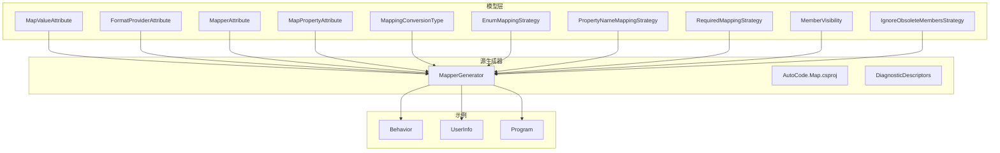
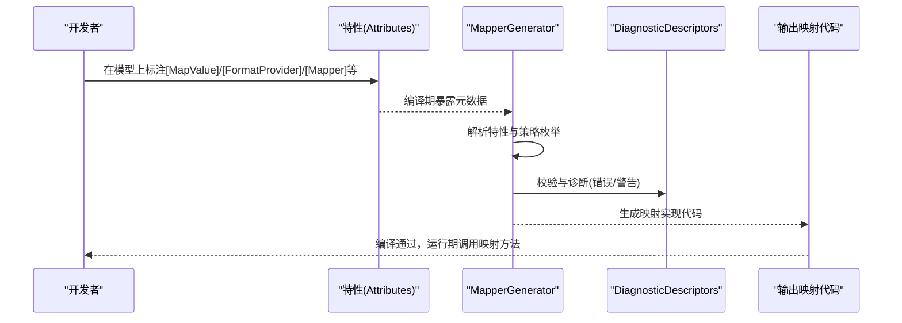
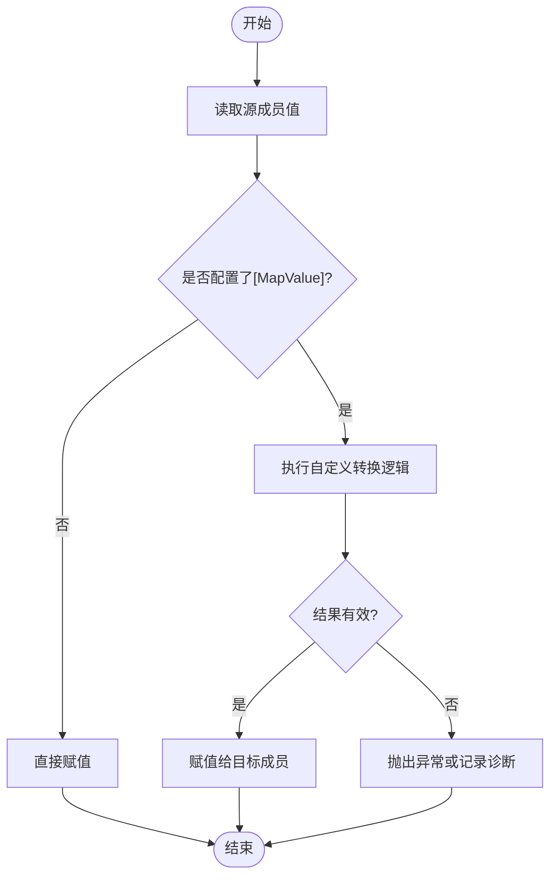
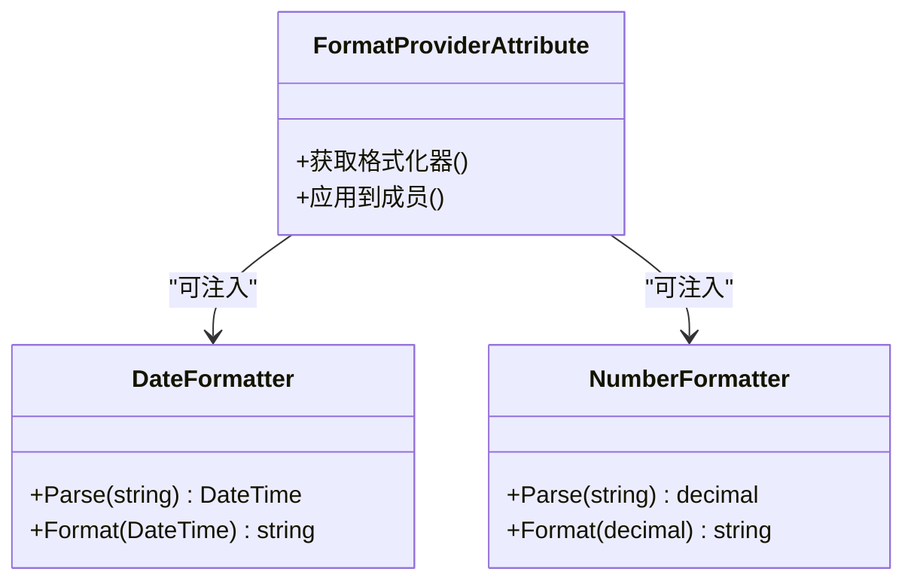
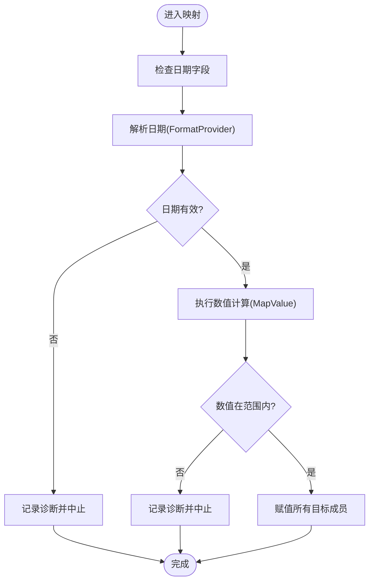
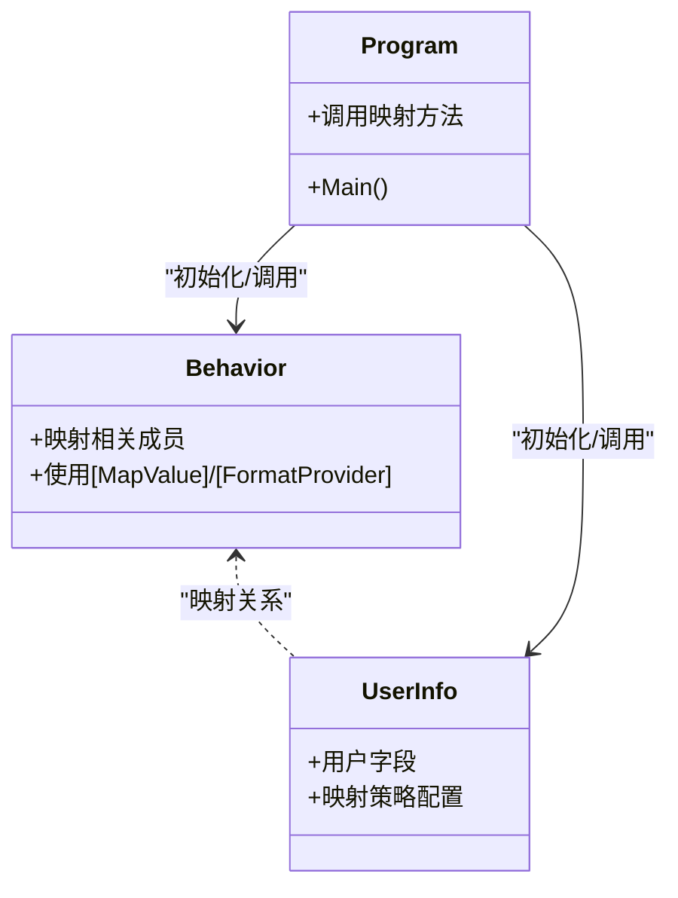
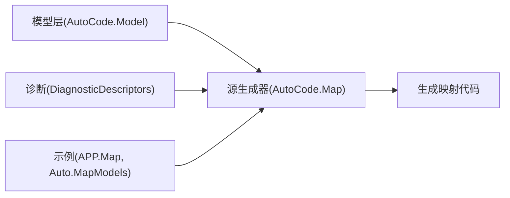

# 自定义映射规则

<cite>
**本文引用的文件**   
- [MapValueAttribute.cs](file://src/AutoCode.Model/AutoMapperModel/MapValueAttribute.cs)
- [FormatProviderAttribute.cs](file://src/AutoCode.Model/AutoMapperModel/FormatProviderAttribute.cs)
- [MapperAttribute.cs](file://src/AutoCode.Model/AutoMapperModel/MapperAttribute.cs)
- [MapPropertyAttribute.cs](file://src/AutoCode.Model/AutoMapperModel/MapPropertyAttribute.cs)
- [MappingConversionType.cs](file://src/AutoCode.Model/AutoMapperModel/MappingConversionType.cs)
- [EnumMappingStrategy.cs](file://src/AutoCode.Model/AutoMapperModel/EnumMappingStrategy.cs)
- [PropertyNameMappingStrategy.cs](file://src/AutoCode.Model/AutoMapperModel/PropertyNameMappingStrategy.cs)
- [RequiredMappingStrategy.cs](file://src/AutoCode.Model/AutoMapperModel/RequiredMappingStrategy.cs)
- [MemberVisibility.cs](file://src/AutoCode.Model/AutoMapperModel/MemberVisibility.cs)
- [IgnoreObsoleteMembersStrategy.cs](file://src/AutoCode.Model/AutoMapperModel/IgnoreObsoleteMembersStrategy.cs)
- [AutoCode.Map.csproj](file://src/AutoCode.Map/AutoCode.Map.csproj)
- [MapperGenerator.cs](file://src/AutoCode.Map/MapperGenerator.cs)
- [DiagnosticDescriptors.cs](file://src/AutoCode.Map/Diagnostics/DiagnosticDescriptors.cs)
- [Behavior.cs](file://src/Auto.MapModels/Behavior.cs)
- [UserInfo.cs](file://src/APP.Map/UserInfo.cs)
- [Program.cs](file://src/APP.Map/Program.cs)
</cite>

## 目录
1. [简介](#简介)
2. [项目结构](#项目结构)
3. [核心组件](#核心组件)
4. [架构总览](#架构总览)
5. [详细组件分析](#详细组件分析)
6. [依赖关系分析](#依赖关系分析)
7. [性能考虑](#性能考虑)
8. [故障排查指南](#故障排查指南)
9. [结论](#结论)
10. [附录](#附录)

## 简介
本文件面向开发者，系统说明如何在 AutoCode 映射框架中创建和配置自定义映射规则。重点涵盖：
- 使用 [MapValue] 属性定义自定义值转换器
- 使用 [FormatProvider] 属性注入格式化器以支持日期、数值等格式转换
- 结合复杂业务逻辑（日期格式转换、数值计算、数据验证）实现高级映射
- 利用诊断与调试信息定位并修复映射问题

## 项目结构
本项目采用“模型 + 源生成器”的架构：
- 模型层提供映射相关的特性与策略枚举
- 源生成器在编译期读取特性，生成高效映射代码
- 应用示例展示如何声明式地配置映射行为

**图表来源** 
- [MapValueAttribute.cs](file://src/AutoCode.Model/AutoMapperModel/MapValueAttribute.cs)
- [FormatProviderAttribute.cs](file://src/AutoCode.Model/AutoMapperModel/FormatProviderAttribute.cs)
- [MapperAttribute.cs](file://src/AutoCode.Model/AutoMapperModel/MapperAttribute.cs)
- [MapPropertyAttribute.cs](file://src/AutoCode.Model/AutoMapperModel/MapPropertyAttribute.cs)
- [MappingConversionType.cs](file://src/AutoCode.Model/AutoMapperModel/MappingConversionType.cs)
- [EnumMappingStrategy.cs](file://src/AutoCode.Model/AutoMapperModel/EnumMappingStrategy.cs)
- [PropertyNameMappingStrategy.cs](file://src/AutoCode.Model/AutoMapperModel/PropertyNameMappingStrategy.cs)
- [RequiredMappingStrategy.cs](file://src/AutoCode.Model/AutoMapperModel/RequiredMappingStrategy.cs)
- [MemberVisibility.cs](file://src/AutoCode.Model/AutoMapperModel/MemberVisibility.cs)
- [IgnoreObsoleteMembersStrategy.cs](file://src/AutoCode.Model/AutoMapperModel/IgnoreObsoleteMembersStrategy.cs)
- [AutoCode.Map.csproj](file://src/AutoCode.Map/AutoCode.Map.csproj)
- [MapperGenerator.cs](file://src/AutoCode.Map/MapperGenerator.cs)
- [DiagnosticDescriptors.cs](file://src/AutoCode.Map/Diagnostics/DiagnosticDescriptors.cs)
- [Behavior.cs](file://src/Auto.MapModels/Behavior.cs)
- [UserInfo.cs](file://src/APP.Map/UserInfo.cs)
- [Program.cs](file://src/APP.Map/Program.cs)

**章节来源**
- [AutoCode.Map.csproj](file://src/AutoCode.Map/AutoCode.Map.csproj)
- [MapperGenerator.cs](file://src/AutoCode.Map/MapperGenerator.cs)

## 核心组件
- MapValueAttribute：用于为成员映射指定自定义值转换逻辑或常量值
- FormatProviderAttribute：为成员映射注入格式化器，支持日期、数值等格式化处理
- MapperAttribute：标记映射目标类型或方法，启用自动映射生成
- MapPropertyAttribute：精细控制成员映射策略（如忽略、重命名、可见性）
- MappingConversionType：定义映射转换类型（如直接赋值、枚举转换、表达式转换等）
- 其他策略枚举：枚举映射策略、属性名映射策略、必需映射策略、成员可见性、忽略过时成员策略

这些组件共同构成声明式映射配置的基础，由源生成器解析并在编译期生成高性能映射代码。

**章节来源**
- [MapValueAttribute.cs](file://src/AutoCode.Model/AutoMapperModel/MapValueAttribute.cs)
- [FormatProviderAttribute.cs](file://src/AutoCode.Model/AutoMapperModel/FormatProviderAttribute.cs)
- [MapperAttribute.cs](file://src/AutoCode.Model/AutoMapperModel/MapperAttribute.cs)
- [MapPropertyAttribute.cs](file://src/AutoCode.Model/AutoMapperModel/MapPropertyAttribute.cs)
- [MappingConversionType.cs](file://src/AutoCode.Model/AutoMapperModel/MappingConversionType.cs)
- [EnumMappingStrategy.cs](file://src/AutoCode.Model/AutoMapperModel/EnumMappingStrategy.cs)
- [PropertyNameMappingStrategy.cs](file://src/AutoCode.Model/AutoMapperModel/PropertyNameMappingStrategy.cs)
- [RequiredMappingStrategy.cs](file://src/AutoCode.Model/AutoMapperModel/RequiredMappingStrategy.cs)
- [MemberVisibility.cs](file://src/AutoCode.Model/AutoMapperModel/MemberVisibility.cs)
- [IgnoreObsoleteMembersStrategy.cs](file://src/AutoCode.Model/AutoMapperModel/IgnoreObsoleteMembersStrategy.cs)

## 架构总览
下图展示了从源码到生成映射代码的关键流程，以及各组件之间的协作关系。

**图表来源** 
- [MapperGenerator.cs](file://src/AutoCode.Map/MapperGenerator.cs)
- [DiagnosticDescriptors.cs](file://src/AutoCode.Map/Diagnostics/DiagnosticDescriptors.cs)
- [MapValueAttribute.cs](file://src/AutoCode.Model/AutoMapperModel/MapValueAttribute.cs)
- [FormatProviderAttribute.cs](file://src/AutoCode.Model/AutoMapperModel/FormatProviderAttribute.cs)
- [MapperAttribute.cs](file://src/AutoCode.Model/AutoMapperModel/MapperAttribute.cs)

## 详细组件分析

### MapValue 属性：自定义值转换器
- 用途：为特定成员映射提供自定义值转换逻辑或固定值
- 典型用法：
  - 将源字段转换为目标字段时执行自定义计算
  - 根据条件返回常量或表达式结果
  - 与 MapProperty 配合，限定作用域与可见性
- 建议实践：
  - 保持转换逻辑幂等且无副作用
  - 对可能失败的操作进行防御性检查
  - 避免在转换中进行昂贵 IO 操作

**图表来源** 
- [MapValueAttribute.cs](file://src/AutoCode.Model/AutoMapperModel/MapValueAttribute.cs)
- [MapPropertyAttribute.cs](file://src/AutoCode.Model/AutoMapperModel/MapPropertyAttribute.cs)

**章节来源**
- [MapValueAttribute.cs](file://src/AutoCode.Model/AutoMapperModel/MapValueAttribute.cs)
- [MapPropertyAttribute.cs](file://src/AutoCode.Model/AutoMapperModel/MapPropertyAttribute.cs)

### FormatProvider 属性：格式化器注入
- 用途：为成员映射注入格式化器，统一处理日期、数值等格式转换
- 典型用法：
  - 日期字符串与 DateTime 互转
  - 数值精度控制与本地化格式
  - 自定义 IFormattable/IConvertible 实现
- 建议实践：
  - 确保格式化器线程安全
  - 对无效输入提供默认值或明确错误
  - 避免在格式化器中引入外部状态

**图表来源** 
- [FormatProviderAttribute.cs](file://src/AutoCode.Model/AutoMapperModel/FormatProviderAttribute.cs)

**章节来源**
- [FormatProviderAttribute.cs](file://src/AutoCode.Model/AutoMapperModel/FormatProviderAttribute.cs)

### 复杂业务映射示例：日期、数值与验证
- 日期格式转换：
  - 使用 [FormatProvider] 注入日期格式化器
  - 在 [MapValue] 中组合日期解析与校验逻辑
- 数值计算：
  - 在 [MapValue] 中执行算术运算或精度处理
  - 结合 [MapProperty] 限制可见性与映射范围
- 数据验证：
  - 在转换前进行非空、范围、格式校验
  - 遇到非法输入时抛出异常或返回诊断信息

**图表来源** 
- [MapValueAttribute.cs](file://src/AutoCode.Model/AutoMapperModel/MapValueAttribute.cs)
- [FormatProviderAttribute.cs](file://src/AutoCode.Model/AutoMapperModel/FormatProviderAttribute.cs)
- [MapPropertyAttribute.cs](file://src/AutoCode.Model/AutoMapperModel/MapPropertyAttribute.cs)

**章节来源**
- [MapValueAttribute.cs](file://src/AutoCode.Model/AutoMapperModel/MapValueAttribute.cs)
- [FormatProviderAttribute.cs](file://src/AutoCode.Model/AutoMapperModel/FormatProviderAttribute.cs)
- [MapPropertyAttribute.cs](file://src/AutoCode.Model/AutoMapperModel/MapPropertyAttribute.cs)

### 示例模型与程序入口
- Behavior：演示如何使用映射特性与策略
- UserInfo：展示用户信息的映射配置
- Program：作为示例程序的入口，触发映射生成与调用

**图表来源** 
- [Behavior.cs](file://src/Auto.MapModels/Behavior.cs)
- [UserInfo.cs](file://src/APP.Map/UserInfo.cs)
- [Program.cs](file://src/APP.Map/Program.cs)

**章节来源**
- [Behavior.cs](file://src/Auto.MapModels/Behavior.cs)
- [UserInfo.cs](file://src/APP.Map/UserInfo.cs)
- [Program.cs](file://src/APP.Map/Program.cs)

## 依赖关系分析
- 源生成器依赖模型层特性与策略枚举
- 诊断描述符提供统一的错误与警告信息
- 示例项目引用模型层与生成器，验证映射行为

**图表来源** 
- [AutoCode.Map.csproj](file://src/AutoCode.Map/AutoCode.Map.csproj)
- [MapperGenerator.cs](file://src/AutoCode.Map/MapperGenerator.cs)
- [DiagnosticDescriptors.cs](file://src/AutoCode.Map/Diagnostics/DiagnosticDescriptors.cs)
- [Behavior.cs](file://src/Auto.MapModels/Behavior.cs)
- [UserInfo.cs](file://src/APP.Map/UserInfo.cs)

**章节来源**
- [AutoCode.Map.csproj](file://src/AutoCode.Map/AutoCode.Map.csproj)
- [MapperGenerator.cs](file://src/AutoCode.Map/MapperGenerator.cs)
- [DiagnosticDescriptors.cs](file://src/AutoCode.Map/Diagnostics/DiagnosticDescriptors.cs)

## 性能考虑
- 编译期生成映射代码，运行时无反射开销
- 避免在 [MapValue] 中执行耗时操作（IO、网络请求）
- 合理使用 [MapProperty] 减少不必要的成员映射
- 格式化器应缓存实例，避免重复创建

## 故障排查指南
- 查看诊断信息：
  - 关注编译器输出的诊断消息，定位特性使用错误或类型不匹配
- 常见错误：
  - [MapValue] 返回值类型与目标成员不兼容
  - [FormatProvider] 未正确注入或格式化器不可用
  - 必填字段缺失导致映射失败
- 调试建议：
  - 简化映射规则，逐步添加逻辑定位问题
  - 使用最小复现示例隔离错误
  - 检查目标类型的可见性与构造函数

**章节来源**
- [DiagnosticDescriptors.cs](file://src/AutoCode.Map/Diagnostics/DiagnosticDescriptors.cs)

## 结论
通过 [MapValue] 与 [FormatProvider] 的组合，开发者可以灵活定义复杂的映射规则，满足日期转换、数值计算与数据验证等业务需求。结合源生成器的编译期优化与诊断信息，能够高效构建高性能、易维护的映射实现。

## 附录
- 最佳实践清单：
  - 保持转换逻辑简洁、幂等、无副作用
  - 对输入进行充分校验，提供明确的错误信息
  - 使用策略枚举精细化控制映射行为
  - 定期审查诊断消息，及时修复潜在问题