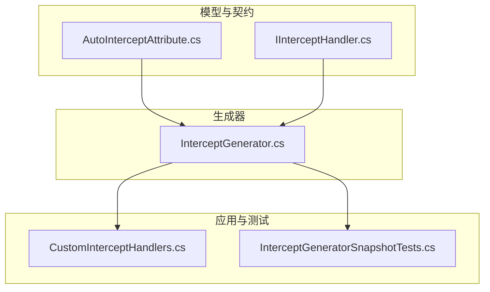
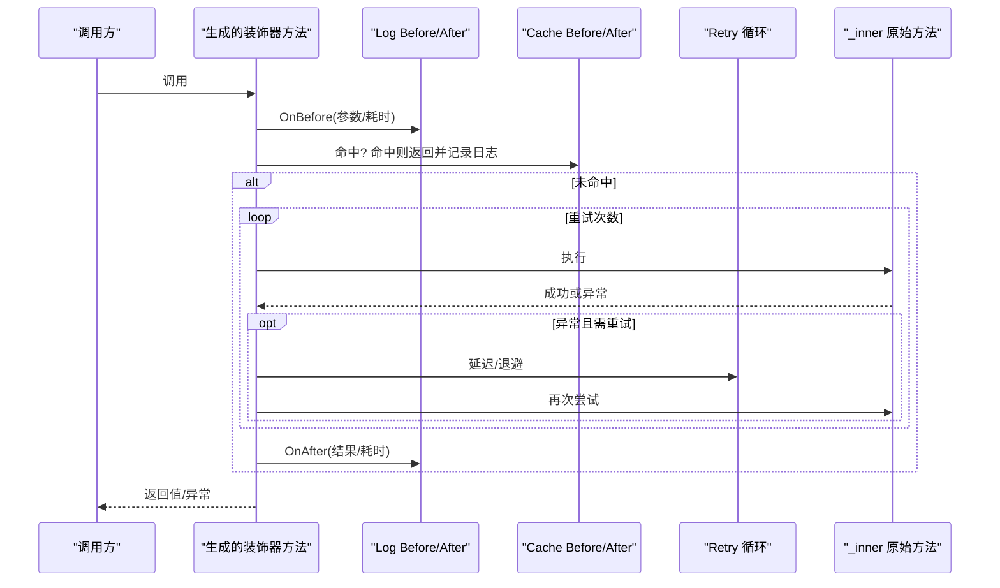
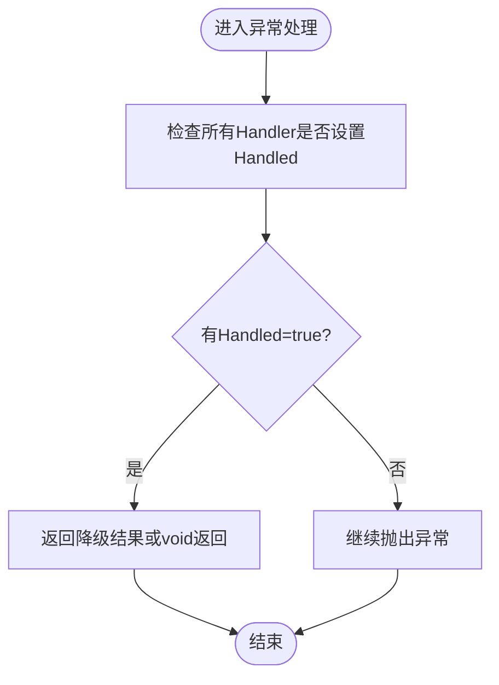
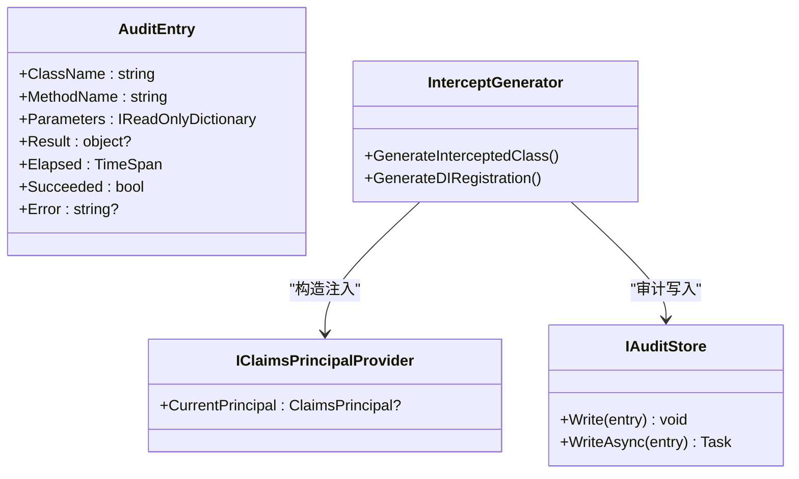
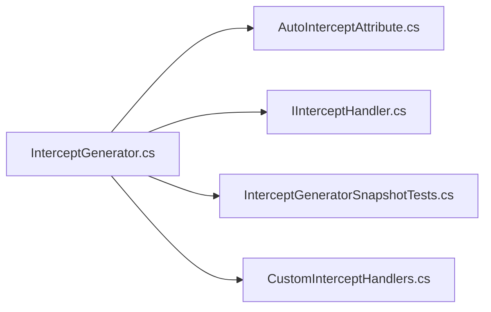

# AOP拦截器改进计划

<cite>
**本文引用的文件**
- [2026-09-02-aop-improvements.md](file://docs/superpowers/plans/2026-09-02-aop-improvements.md)
- [2026-09-02-aop-improvements-design.md](file://docs/superpowers/specs/2026-09-02-aop-improvements-design.md)
- [InterceptGenerator.cs](file://src/AutoCode.Generators/V1/InterceptGenerator.cs)
- [AutoInterceptAttribute.cs](file://src/AutoCode.Model/AutoInterceptAttribute.cs)
- [IInterceptHandler.cs](file://src/AutoCode.Model/IInterceptHandler.cs)
- [CustomInterceptHandlers.cs](file://src/APP.WebAPI/Services/CustomInterceptHandlers.cs)
- [InterceptGeneratorSnapshotTests.cs](file://src/AutoCode.Tests.V2/Snapshots/InterceptGeneratorSnapshotTests.cs)
</cite>

## 目录
1. [引言](#引言)
2. [项目结构](#项目结构)
3. [核心组件](#核心组件)
4. [架构总览](#架构总览)
5. [详细组件分析](#详细组件分析)
6. [依赖关系分析](#依赖关系分析)
7. [性能考量](#性能考量)
8. [故障排查指南](#故障排查指南)
9. [结论](#结论)
10. [附录](#附录)

## 引言
本计划旨在将 AutoCode.Intercept 从“声明了12种拦截器但仅部分生效”的状态，升级为“12/12可用、声明必生效、顺序可配、增量缓存健全”的完整编译时AOP框架。改进分为四个阶段：对齐现有声明与实现、补齐四种拦截器（Authorize/Transaction/Audit/Profiling）、修复语言特性与语义问题、重构为顺序表驱动并加固增量缓存。全程遵循快照先行与TDD纪律，确保生成代码稳定可靠。

## 项目结构
围绕AOP拦截器的关键位置如下：
- 模型与契约层：AutoCode.Model 提供拦截类型枚举、上下文对象、自定义拦截器接口以及新增运行时抽象。
- 生成器：V1/InterceptGenerator.cs 是核心生成逻辑，负责解析特性、生成Args记录、装饰器类与DI注册。
- 示例与测试：APP.WebAPI 中的自定义拦截器示例；V2测试套件通过快照锁定生成结果。

图表来源
- [AutoInterceptAttribute.cs:1-156](file://src/AutoCode.Model/AutoInterceptAttribute.cs#L1-L156)
- [IInterceptHandler.cs:1-218](file://src/AutoCode.Model/IInterceptHandler.cs#L1-L218)
- [InterceptGenerator.cs:1-200](file://src/AutoCode.Generators/V1/InterceptGenerator.cs#L1-L200)
- [CustomInterceptHandlers.cs:1-128](file://src/APP.WebAPI/Services/CustomInterceptHandlers.cs#L1-L128)
- [InterceptGeneratorSnapshotTests.cs:1-38](file://src/AutoCode.Tests.V2/Snapshots/InterceptGeneratorSnapshotTests.cs#L1-L38)

章节来源
- [2026-09-02-aop-improvements-design.md:1-180](file://docs/superpowers/specs/2026-09-02-aop-improvements-design.md#L1-L180)
- [2026-09-02-aop-improvements.md:1-800](file://docs/superpowers/plans/2026-09-02-aop-improvements.md#L1-L800)

## 核心组件
- InterceptType 枚举：定义全部12种拦截器（Log/Cache/Retry/CircuitBreaker/Validate/Authorize/Metrics/Tracing/Transaction/Audit/Throttle/Profiling），支持组合使用。
- 拦截上下文：InterceptContext/MethodContext 提供执行信息、短路/降级标记、标签共享等能力。
- 自定义拦截器：IInterceptHandler/IMethodHandler<TArgs,TResult>/IAsyncMethodHandler<TArgs,TResult> 及其基类，支持同步/异步强类型处理器。
- 生成器：InterceptGenerator 解析特性、生成Args记录、装饰器类、DI注册，并输出诊断提示。

章节来源
- [AutoInterceptAttribute.cs:1-156](file://src/AutoCode.Model/AutoInterceptAttribute.cs#L1-L156)
- [IInterceptHandler.cs:1-218](file://src/AutoCode.Model/IInterceptHandler.cs#L1-L218)
- [InterceptGenerator.cs:1-200](file://src/AutoCode.Generators/V1/InterceptGenerator.cs#L1-L200)

## 架构总览
改进后的AOP管线以“顺序表驱动”为目标，每种拦截器对应独立emit函数，按PipelineOrder正序发射Before段，After/Exception段同样按正序发射，保证直觉一致（如Log After在Audit之前）。当前生成器已具备基础管线骨架，后续阶段将逐步将条件分支抽取为顺序表驱动的emit函数。

图表来源
- [InterceptGenerator.cs:454-481](file://src/AutoCode.Generators/V1/InterceptGenerator.cs#L454-L481)

## 详细组件分析

### 阶段1：声明与实现对齐（修假功能）
- Handled降级真正生效：在catch块中检查任一Handler是否设置Handled=true，若为真则返回降级结果或void返回，否则继续抛出异常；重试耗尽后最终异常路径也走同一逻辑。
- IAsyncMethodHandler识别与await调用：解析IsAsyncHandler并在三处（OnBefore/OnAfter/OnException）生成await调用；对同步方法挂载异步Handler给出AC9004错误诊断。
- LogResult/ExcludeMethods生效：LogResult在After日志中追加结果摘要；ExcludeMethods解析为排除列表，匹配的方法透传不拦截。

图表来源
- [2026-09-02-aop-improvements.md:32-165](file://docs/superpowers/plans/2026-09-02-aop-improvements.md#L32-L165)
- [2026-09-02-aop-improvements-design.md:39-61](file://docs/superpowers/specs/2026-09-02-aop-improvements-design.md#L39-L61)

章节来源
- [2026-09-02-aop-improvements.md:32-165](file://docs/superpowers/plans/2026-09-02-aop-improvements.md#L32-L165)
- [2026-09-02-aop-improvements-design.md:39-61](file://docs/superpowers/specs/2026-09-02-aop-improvements-design.md#L39-L61)

### 阶段2：四种拦截器落地（12/12可用）
- Authorize：注入IClaimsPrincipalProvider，Before段校验认证与角色，缺失或未认证抛UnauthorizedAccessException；提供AC9006提示需注册Provider，AC9010提示AuthorizePolicy暂未实现。
- Transaction：基于System.Transactions.TransactionScope，异步启用AsyncFlow，成功Complete，异常由scope dispose回滚；支持超时与隔离级别配置。
- Audit：成功与异常路径均写入IAuditStore，支持Sensitive参数脱敏；异步方法WriteAsync，同步Write。
- Profiling：零新注入，Before取GC内存，After计算GC增量+耗时；可选采集Process指标；阈值控制输出。

图表来源
- [2026-09-02-aop-improvements-design.md:62-93](file://docs/superpowers/specs/2026-09-02-aop-improvements-design.md#L62-L93)
- [AutoInterceptAttribute.cs:1-156](file://src/AutoCode.Model/AutoInterceptAttribute.cs#L1-L156)

章节来源
- [2026-09-02-aop-improvements-design.md:62-93](file://docs/superpowers/specs/2026-09-02-aop-improvements-design.md#L62-L93)

### 阶段3：语言特性与语义修复
- 泛型方法：捕获TypeParameters与where约束，Args record与方法签名同步泛型化。
- ref/out/in/params：ParamInfo增加RefKind，方法签名保留修饰符；强类型Handler中ref/out不可进record位置参数，给出AC9100提示。
- 方法重载消歧：Args record命名加入参数类型短名拼接，冲突时追加序号。
- Retry+CancellationToken：检测末位CancellationToken，透传给Task.Delay并在每次重试前ThrowIfCancellationRequested。
- Throttle真·每秒限流：固定窗口计数，达到MaxRequestsPerSecond等待至下一窗口。
- Retry异常类型过滤：新增RetryOnExceptionTypes属性，生成when条件过滤。
- CircuitBreaker半开状态机：Closed→Open→HalfOpen→Closed/Open，静态per-class共享。
- Cache语义：null结果不写入缓存；命中分支补日志。

章节来源
- [2026-09-02-aop-improvements-design.md:94-130](file://docs/superpowers/specs/2026-09-02-aop-improvements-design.md#L94-L130)

### 阶段4：顺序可配 + 架构加固
- PipelineOrder：新增属性，逗号分隔拦截器名；生成器重构为顺序表驱动，每种拦截器抽为独立emit函数，按表发射；未知名给出AC9007警告。
- 默认顺序：Validate → Authorize → Custom(OnBefore) → Throttle → Cache → CircuitBreaker → Tracing → Log → Retry → Transaction → [调用_inner] → Custom(OnAfter/OnException) → Audit → Profiling → Metrics。
- 模型record化：InterceptInfo/InterceptMethodInfo/ParamInfo/CustomHandlerInfo改record + ImmutableEquatableArray，修复增量缓存失效；新增缓存哨兵测试。
- 文档同步：README/CHANGELOG/samples更新，APP.WebAPI示例补全四种新拦截器演示。

章节来源
- [2026-09-02-aop-improvements-design.md:131-152](file://docs/superpowers/specs/2026-09-02-aop-improvements-design.md#L131-L152)
- [2026-09-02-aop-improvements.md:1-800](file://docs/superpowers/plans/2026-09-02-aop-improvements.md#L1-L800)

## 依赖关系分析
- 生成器依赖模型契约：InterceptGenerator读取AutoInterceptAttribute与IInterceptHandler相关类型进行解析与生成。
- 运行时抽象解耦：Authorize/Audit等拦截器通过IClaimsPrincipalProvider/IAuditStore注入，避免绑定具体框架（如ASP.NET Core）。
- 测试快照锁定：InterceptGeneratorSnapshotTests通过Verify锁定生成文本，确保重构前后行为等价。

图表来源
- [InterceptGenerator.cs:1-200](file://src/AutoCode.Generators/V1/InterceptGenerator.cs#L1-L200)
- [AutoInterceptAttribute.cs:1-156](file://src/AutoCode.Model/AutoInterceptAttribute.cs#L1-L156)
- [IInterceptHandler.cs:1-218](file://src/AutoCode.Model/IInterceptHandler.cs#L1-L218)
- [InterceptGeneratorSnapshotTests.cs:1-38](file://src/AutoCode.Tests.V2/Snapshots/InterceptGeneratorSnapshotTests.cs#L1-L38)
- [CustomInterceptHandlers.cs:1-128](file://src/APP.WebAPI/Services/CustomInterceptHandlers.cs#L1-L128)

章节来源
- [InterceptGenerator.cs:1-200](file://src/AutoCode.Generators/V1/InterceptGenerator.cs#L1-L200)
- [AutoInterceptAttribute.cs:1-156](file://src/AutoCode.Model/AutoInterceptAttribute.cs#L1-L156)
- [IInterceptHandler.cs:1-218](file://src/AutoCode.Model/IInterceptHandler.cs#L1-L218)
- [InterceptGeneratorSnapshotTests.cs:1-38](file://src/AutoCode.Tests.V2/Snapshots/InterceptGeneratorSnapshotTests.cs#L1-L38)
- [CustomInterceptHandlers.cs:1-128](file://src/APP.WebAPI/Services/CustomInterceptHandlers.cs#L1-L128)

## 性能考量
- 增量缓存：阶段4将模型record化并使用ImmutableEquatableArray，修复增量缓存失效问题，提升重复构建效率。
- 限流策略：Throttle采用固定窗口计数，避免并发许可误用，确保MaxRequestsPerSecond名实相符。
- 事务范围：TransactionScope在异步场景启用AsyncFlow，减少跨线程上下文切换开销。
- 性能分析：Profiling可选采集Process指标，默认仅GC增量+耗时，降低开销。

[本节为通用指导，无需特定文件引用]

## 故障排查指南
- AC9001：类未实现接口，装饰器模式需要接口。
- AC9002：Cache用于无返回值方法无效。
- AC9003：自定义拦截器未实现接口。
- AC9004：异步Handler挂载在同步方法上，无法await。
- AC9005：ProfilingIncludeProcess=true时的开销提示。
- AC9006：启用Authorize需注册IClaimsPrincipalProvider。
- AC9007：PipelineOrder含未知拦截器名。
- AC9008：Handler同时实现IInterceptHandler与IMethodHandler/IAsyncMethodHandler，编译期禁止。
- AC9010：AuthorizePolicy暂未实现策略检查，请使用AuthorizeRoles。

章节来源
- [2026-09-02-aop-improvements-design.md:153-163](file://docs/superpowers/specs/2026-09-02-aop-improvements-design.md#L153-L163)

## 结论
通过四阶段渐进交付，本项目将补齐缺失的拦截器实现、修复语言特性与语义问题、引入顺序可配的管线架构，并加固增量缓存。配合严格的快照测试与TDD纪律，确保生成代码稳定、可维护、可扩展，最终达成“12/12可用、声明必生效”的目标。

[本节为总结性内容，无需特定文件引用]

## 附录
- 实施步骤与任务清单详见计划文档，包含失败测试编写、实现、快照入库与复跑确认等流程。
- 设计文档明确了架构原则、阶段目标、交付物与风险约束。

章节来源
- [2026-09-02-aop-improvements.md:1-800](file://docs/superpowers/plans/2026-09-02-aop-improvements.md#L1-L800)
- [2026-09-02-aop-improvements-design.md:1-180](file://docs/superpowers/specs/2026-09-02-aop-improvements-design.md#L1-L180)