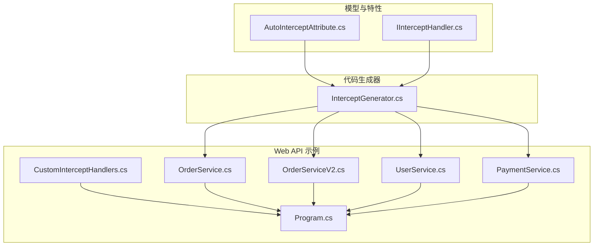
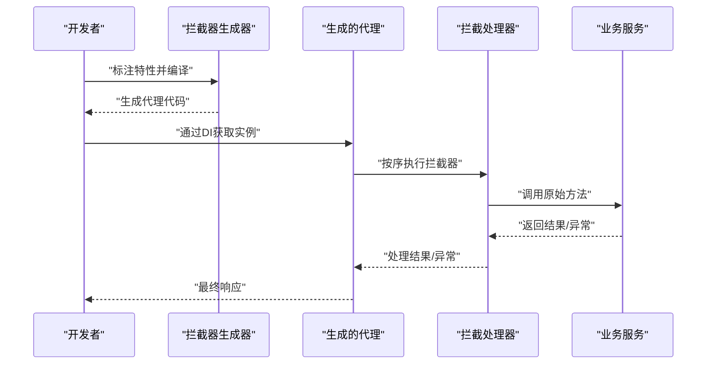
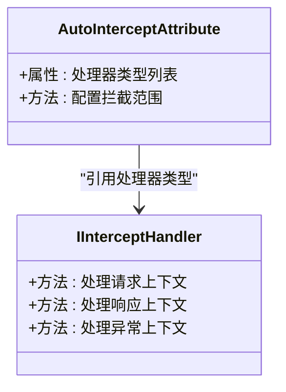
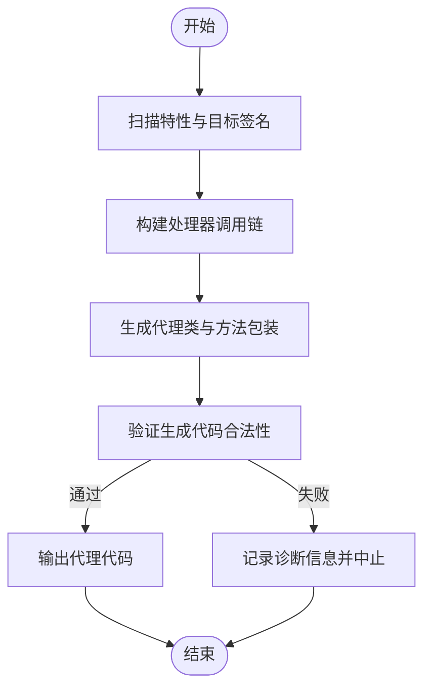
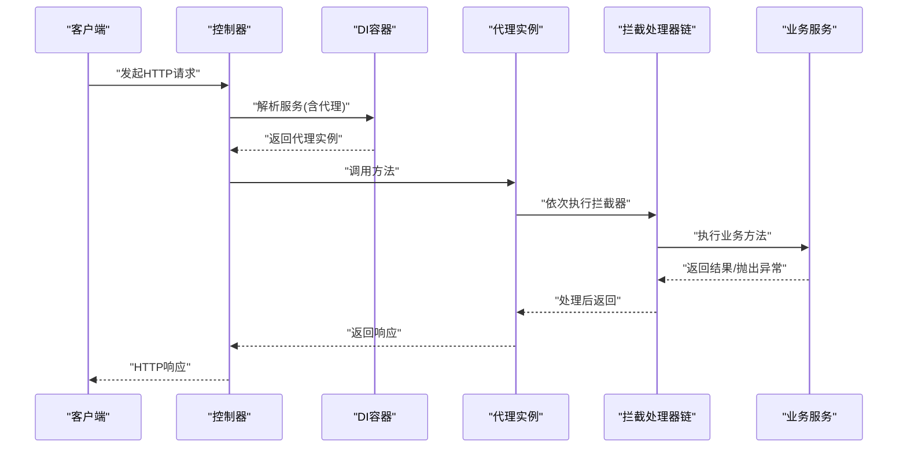
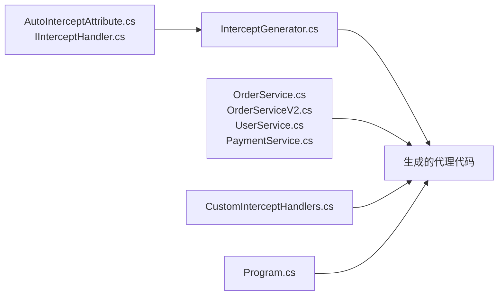

# AOP拦截器系统

<cite>
**本文档引用的文件**   
- [InterceptGenerator.cs](file://src/AutoCode.Intercept/InterceptGenerator.cs)
- [AutoInterceptAttribute.cs](file://src/AutoCode.Model/AutoInterceptAttribute.cs)
- [IInterceptHandler.cs](file://src/AutoCode.Model/IInterceptHandler.cs)
- [CustomInterceptHandlers.cs](file://src/APP.WebAPI/Services/CustomInterceptHandlers.cs)
- [OrderService.cs](file://src/APP.WebAPI/Services/OrderService.cs)
- [OrderServiceV2.cs](file://src/APP.WebAPI/Services/OrderServiceV2.cs)
- [UserService.cs](file://src/APP.WebAPI/Services/UserService.cs)
- [PaymentService.cs](file://src/APP.WebAPI/Services/PaymentService.cs)
- [Program.cs](file://src/APP.WebAPI/Program.cs)
- [README.md](file://samples/02-InterceptAOP/README.md)
</cite>

## 目录
1. [简介](#简介)
2. [项目结构](#项目结构)
3. [核心组件](#核心组件)
4. [架构总览](#架构总览)
5. [详细组件分析](#详细组件分析)
6. [依赖关系分析](#依赖关系分析)
7. [性能考虑](#性能考虑)
8. [故障排查指南](#故障排查指南)
9. [结论](#结论)
10. [附录](#附录)

## 简介
本仓库实现了一套基于源码生成与特性标记的AOP（面向切面编程）拦截器系统。开发者通过为接口或类方法标注拦截特性，由代码生成器在编译期自动生成代理包装与调用链，从而在不侵入业务代码的前提下，统一注入日志、校验、重试、事务等横切关注点。该方案具备以下特点：
- 零运行时反射开销：拦截逻辑在编译期生成，运行时代码直接调用生成的代理。
- 声明式配置：使用特性即可声明拦截目标与处理器，降低样板代码。
- 可扩展性强：自定义拦截处理器只需实现约定接口并注册到容器。
- 与依赖注入集成：生成的代理可无缝接入DI容器生命周期管理。

## 项目结构
围绕AOP拦截器的关键目录与文件如下：
- 模型与特性定义：位于 AutoCode.Model，包含拦截相关特性与处理器接口。
- 拦截器代码生成器：位于 AutoCode.Intercept，负责扫描特性并生成代理代码。
- Web API示例：位于 APP.WebAPI，展示如何声明服务、编写拦截处理器并在应用中启用。
- 样本说明：samples/02-InterceptAOP 提供快速上手说明。

图表来源
- [InterceptGenerator.cs](file://src/AutoCode.Intercept/InterceptGenerator.cs)
- [AutoInterceptAttribute.cs](file://src/AutoCode.Model/AutoInterceptAttribute.cs)
- [IInterceptHandler.cs](file://src/AutoCode.Model/IInterceptHandler.cs)
- [OrderService.cs](file://src/APP.WebAPI/Services/OrderService.cs)
- [OrderServiceV2.cs](file://src/APP.WebAPI/Services/OrderServiceV2.cs)
- [UserService.cs](file://src/APP.WebAPI/Services/UserService.cs)
- [PaymentService.cs](file://src/APP.WebAPI/Services/PaymentService.cs)
- [CustomInterceptHandlers.cs](file://src/APP.WebAPI/Services/CustomInterceptHandlers.cs)
- [Program.cs](file://src/APP.WebAPI/Program.cs)

章节来源
- [README.md](file://samples/02-InterceptAOP/README.md)

## 核心组件
- 拦截特性：用于标注需要被拦截的目标类型或方法，指定要应用的拦截处理器集合。
- 拦截处理器接口：定义拦截上下文与执行流程的契约，供用户实现具体横切逻辑。
- 拦截器生成器：解析特性与目标签名，生成代理类与方法包装，将处理器串联成调用链。
- 示例服务与处理器：演示如何在Web API中声明服务、实现处理器，并通过程序启动时完成装配。

章节来源
- [AutoInterceptAttribute.cs](file://src/AutoCode.Model/AutoInterceptAttribute.cs)
- [IInterceptHandler.cs](file://src/AutoCode.Model/IInterceptHandler.cs)
- [InterceptGenerator.cs](file://src/AutoCode.Intercept/InterceptGenerator.cs)
- [CustomInterceptHandlers.cs](file://src/APP.WebAPI/Services/CustomInterceptHandlers.cs)
- [OrderService.cs](file://src/APP.WebAPI/Services/OrderService.cs)
- [OrderServiceV2.cs](file://src/APP.WebAPI/Services/OrderServiceV2.cs)
- [UserService.cs](file://src/APP.WebAPI/Services/UserService.cs)
- [PaymentService.cs](file://src/APP.WebAPI/Services/PaymentService.cs)

## 架构总览
下图展示了从“声明拦截”到“生成代理”再到“运行时调用”的整体流程。

图表来源
- [InterceptGenerator.cs](file://src/AutoCode.Intercept/InterceptGenerator.cs)
- [IInterceptHandler.cs](file://src/AutoCode.Model/IInterceptHandler.cs)
- [OrderService.cs](file://src/APP.WebAPI/Services/OrderService.cs)
- [CustomInterceptHandlers.cs](file://src/APP.WebAPI/Services/CustomInterceptHandlers.cs)

## 详细组件分析

### 拦截特性与处理器接口
- 拦截特性：用于声明目标类型或方法应被哪些拦截处理器应用，支持细粒度控制。
- 处理器接口：定义统一的拦截入口，便于实现通用横切逻辑（如日志、权限、重试）。

图表来源
- [AutoInterceptAttribute.cs](file://src/AutoCode.Model/AutoInterceptAttribute.cs)
- [IInterceptHandler.cs](file://src/AutoCode.Model/IInterceptHandler.cs)

章节来源
- [AutoInterceptAttribute.cs](file://src/AutoCode.Model/AutoInterceptAttribute.cs)
- [IInterceptHandler.cs](file://src/AutoCode.Model/IInterceptHandler.cs)

### 拦截器代码生成器
拦截器生成器在编译期扫描带有特性的类型与方法，生成对应的代理类与方法包装，将多个处理器串联为调用链，确保顺序可控、异常隔离、返回值透传。

图表来源
- [InterceptGenerator.cs](file://src/AutoCode.Intercept/InterceptGenerator.cs)

章节来源
- [InterceptGenerator.cs](file://src/AutoCode.Intercept/InterceptGenerator.cs)

### 示例服务与处理器
- 示例服务：在订单、用户、支付等服务上标注拦截特性，以启用横切能力。
- 自定义处理器：实现处理器接口，封装通用逻辑（如审计、限流、缓存）。
- 程序启动：在 Program 中注册处理器与服务，使DI容器能够解析并注入代理实例。

图表来源
- [OrderService.cs](file://src/APP.WebAPI/Services/OrderService.cs)
- [OrderServiceV2.cs](file://src/APP.WebAPI/Services/OrderServiceV2.cs)
- [UserService.cs](file://src/APP.WebAPI/Services/UserService.cs)
- [PaymentService.cs](file://src/APP.WebAPI/Services/PaymentService.cs)
- [CustomInterceptHandlers.cs](file://src/APP.WebAPI/Services/CustomInterceptHandlers.cs)
- [Program.cs](file://src/APP.WebAPI/Program.cs)

章节来源
- [OrderService.cs](file://src/APP.WebAPI/Services/OrderService.cs)
- [OrderServiceV2.cs](file://src/APP.WebAPI/Services/OrderServiceV2.cs)
- [UserService.cs](file://src/APP.WebAPI/Services/UserService.cs)
- [PaymentService.cs](file://src/APP.WebAPI/Services/PaymentService.cs)
- [CustomInterceptHandlers.cs](file://src/APP.WebAPI/Services/CustomInterceptHandlers.cs)
- [Program.cs](file://src/APP.WebAPI/Program.cs)

## 依赖关系分析
- 生成器对模型与特性的依赖：生成器读取特性定义与处理器接口，据此生成代理代码。
- 示例服务对生成器的间接依赖：服务本身不直接依赖生成器，但通过特性声明触发生成。
- 处理器与服务的解耦：处理器仅依赖处理器接口，不感知具体服务实现，提升可测试性与复用性。

图表来源
- [AutoInterceptAttribute.cs](file://src/AutoCode.Model/AutoInterceptAttribute.cs)
- [IInterceptHandler.cs](file://src/AutoCode.Model/IInterceptHandler.cs)
- [InterceptGenerator.cs](file://src/AutoCode.Intercept/InterceptGenerator.cs)
- [OrderService.cs](file://src/APP.WebAPI/Services/OrderService.cs)
- [OrderServiceV2.cs](file://src/APP.WebAPI/Services/OrderServiceV2.cs)
- [UserService.cs](file://src/APP.WebAPI/Services/UserService.cs)
- [PaymentService.cs](file://src/APP.WebAPI/Services/PaymentService.cs)
- [CustomInterceptHandlers.cs](file://src/APP.WebAPI/Services/CustomInterceptHandlers.cs)
- [Program.cs](file://src/APP.WebAPI/Program.cs)

章节来源
- [InterceptGenerator.cs](file://src/AutoCode.Intercept/InterceptGenerator.cs)
- [Program.cs](file://src/APP.WebAPI/Program.cs)

## 性能考虑
- 编译时代码生成：避免运行时反射与动态代理带来的额外开销，调用路径最短化。
- 处理器链优化：生成器可按需合并或内联简单处理器，减少方法调用层级。
- 内存占用：代理类与方法体在编译期确定，运行时对象分配稳定，GC压力低。
- 并发安全：处理器应避免持有可变状态；如需状态，建议使用线程局部或外部存储。

[本节为通用指导，不直接分析具体文件]

## 故障排查指南
- 特性未生效：确认目标类型或方法已正确标注拦截特性，且生成器未被禁用。
- 处理器未执行：检查处理器是否实现约定接口，并在程序启动时正确注册。
- 异常被吞掉：查看处理器链中的异常处理逻辑，确保异常向上抛出或被恰当捕获。
- 循环依赖：避免处理器之间相互依赖导致初始化死锁，必要时拆分职责。
- 调试技巧：利用IDE断点定位生成的代理方法，观察处理器执行顺序与参数传递。

章节来源
- [InterceptGenerator.cs](file://src/AutoCode.Intercept/InterceptGenerator.cs)
- [CustomInterceptHandlers.cs](file://src/APP.WebAPI/Services/CustomInterceptHandlers.cs)
- [Program.cs](file://src/APP.WebAPI/Program.cs)

## 结论
本AOP拦截器系统通过“特性声明 + 编译时代码生成”的方式，实现了高性能、可维护、易扩展的横切能力注入。开发者可以专注于业务逻辑，将日志、校验、重试等横切关注点抽象为可复用的处理器，并通过简单的特性标注完成装配。该方案在Web API场景中表现良好，适合大规模微服务与模块化架构。

[本节为总结性内容，不直接分析具体文件]

## 附录
- 快速入门：参考 samples/02-InterceptAOP 的说明文档，了解如何从零搭建拦截器场景。
- 最佳实践：
  - 处理器应保持无状态或最小状态，避免影响并发性能。
  - 合理划分处理器职责，单一职责原则有助于测试与维护。
  - 谨慎处理异常，明确区分业务异常与系统异常。
  - 使用DI生命周期管理处理器，避免单例导致的共享状态问题。

章节来源
- [README.md](file://samples/02-InterceptAOP/README.md)