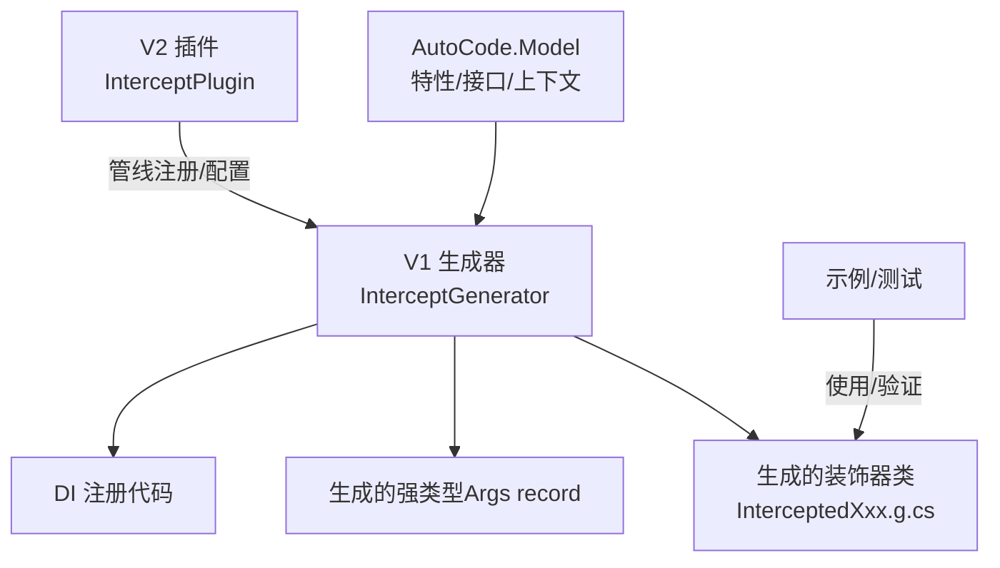
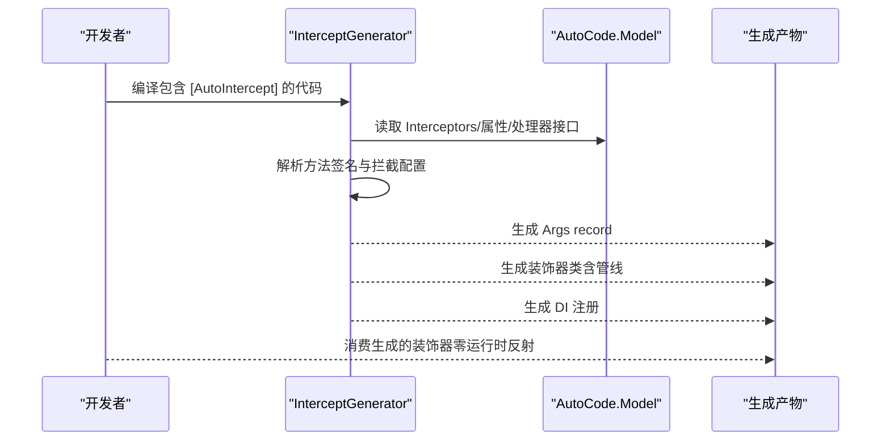
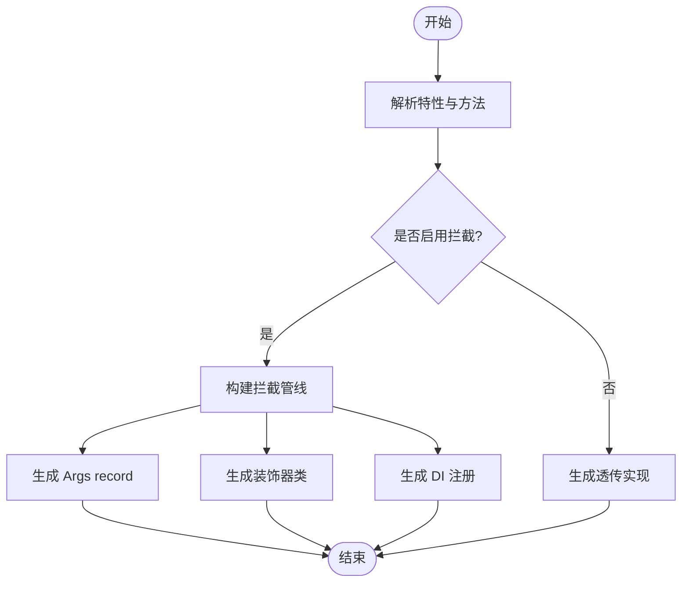
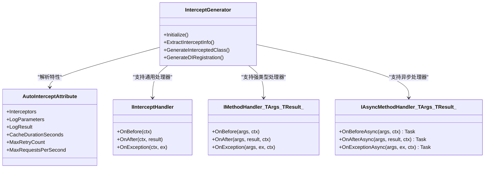

# AOP拦截器设计规格

<cite>
**本文引用的文件**
- [InterceptGenerator.cs](file://src/AutoCode.Generators/V1/InterceptGenerator.cs)
- [AutoInterceptAttribute.cs](file://src/AutoCode.Model/AutoInterceptAttribute.cs)
- [IInterceptHandler.cs](file://src/AutoCode.Model/IInterceptHandler.cs)
- [InterceptPlugin.cs](file://src/AutoCode.Generators/V2/InterceptPlugin.cs)
- [CustomInterceptHandlers.cs](file://src/APP.WebAPI/Services/CustomInterceptHandlers.cs)
- [README.md（02-InterceptAOP）](file://samples/02-InterceptAOP/README.md)
- [2026-09-02-aop-improvements-design.md](file://docs/superpowers/specs/2026-09-02-aop-improvements-design.md)
- [2026-09-02-aop-improvements.md](file://docs/superpowers/plans/2026-09-02-aop-improvements.md)
- [InterceptGeneratorSnapshotTests.cs](file://src/AutoCode.Tests.V2/Snapshots/InterceptGeneratorSnapshotTests.cs)
</cite>

## 目录
1. [引言](#引言)
2. [项目结构](#项目结构)
3. [核心组件](#核心组件)
4. [架构总览](#架构总览)
5. [详细组件分析](#详细组件分析)
6. [依赖关系分析](#依赖关系分析)
7. [性能与可观测性](#性能与可观测性)
8. [故障排查指南](#故障排查指南)
9. [结论](#结论)
10. [附录：四阶段演进路线](#附录四阶段演进路线)

## 引言
本规格文档面向 AutoCode.Intercept 编译时 AOP 拦截器，目标是系统化说明其设计、实现与演进路线。当前实现基于 Roslyn IIncrementalGenerator 在编译期生成装饰器类，将日志、缓存、重试、熔断、限流、指标、追踪等横切关注点以管线方式织入业务方法调用路径，避免运行时动态代理的开销与限制，并支持 NativeAOT。

## 项目结构
- 模型与特性定义位于 AutoCode.Model，提供拦截类型枚举、特性与处理器接口。
- 生成器位于 AutoCode.Generators/V1/InterceptGenerator.cs，负责解析特性、提取信息、生成 Args record、装饰器类与 DI 注册。
- V2 插件入口 InterceptPlugin 仅用于管线注册与钩子扩展，实际生成逻辑仍由 V1 生成器独立承担。
- 示例与测试覆盖典型用法与快照验证。

图表来源
- [InterceptGenerator.cs:1-80](file://src/AutoCode.Generators/V1/InterceptGenerator.cs#L1-L80)
- [InterceptPlugin.cs:10-29](file://src/AutoCode.Generators/V2/InterceptPlugin.cs#L10-L29)
- [AutoInterceptAttribute.cs:5-131](file://src/AutoCode.Model/AutoInterceptAttribute.cs#L5-L131)
- [IInterceptHandler.cs:11-191](file://src/AutoCode.Model/IInterceptHandler.cs#L11-L191)

章节来源
- [InterceptGenerator.cs:1-80](file://src/AutoCode.Generators/V1/InterceptGenerator.cs#L1-L80)
- [InterceptPlugin.cs:10-29](file://src/AutoCode.Generators/V2/InterceptPlugin.cs#L10-L29)
- [AutoInterceptAttribute.cs:5-131](file://src/AutoCode.Model/AutoInterceptAttribute.cs#L5-L131)
- [IInterceptHandler.cs:11-191](file://src/AutoCode.Model/IInterceptHandler.cs#L11-L191)

## 核心组件
- 拦截类型与特性：InterceptType 枚举与 AutoInterceptAttribute，声明要启用的内置拦截器及参数。
- 处理器接口：IInterceptHandler、IMethodHandler<TArgs,TResult>、IAsyncMethodHandler<TArgs,TResult> 及其基类，提供通用与强类型拦截能力。
- 上下文对象：InterceptContext、MethodContext，承载执行信息、短路/降级标记、结果与标签。
- 生成器：InterceptGenerator，解析特性与方法签名，生成 Args record、装饰器类、DI 注册。
- 插件：InterceptPlugin，作为 AutoCode 管线中的拦截插件占位，便于统一管理与扩展。

章节来源
- [AutoInterceptAttribute.cs:5-131](file://src/AutoCode.Model/AutoInterceptAttribute.cs#L5-L131)
- [IInterceptHandler.cs:11-191](file://src/AutoCode.Model/IInterceptHandler.cs#L11-L191)
- [InterceptGenerator.cs:1-80](file://src/AutoCode.Generators/V1/InterceptGenerator.cs#L1-L80)
- [InterceptPlugin.cs:10-29](file://src/AutoCode.Generators/V2/InterceptPlugin.cs#L10-L29)

## 架构总览
编译期通过 Roslyn 扫描带有拦截特性的类与方法，提取拦截配置与方法签名，生成：
- 强类型 Args record（供强类型 Handler 使用）
- 装饰器类（实现原接口，包裹目标方法，按顺序注入各拦截阶段）
- DI 注册片段（自动注入 ILogger、IMemoryCache、Meter 等）

图表来源
- [InterceptGenerator.cs:48-79](file://src/AutoCode.Generators/V1/InterceptGenerator.cs#L48-L79)
- [AutoInterceptAttribute.cs:73-131](file://src/AutoCode.Model/AutoInterceptAttribute.cs#L73-L131)
- [IInterceptHandler.cs:11-191](file://src/AutoCode.Model/IInterceptHandler.cs#L11-L191)

## 详细组件分析

### 拦截类型与特性
- InterceptType 定义了全部内置拦截器：Log、Cache、Retry、CircuitBreaker、Validate、Authorize、Metrics、Tracing、Transaction、Audit、Throttle、Profiling。
- AutoInterceptAttribute 提供每个拦截器的配置项（如 CacheDurationSeconds、MaxRetryCount、MaxRequestsPerSecond 等），并支持 ExcludeMethods、PublicOnly 等通用选项。

章节来源
- [AutoInterceptAttribute.cs:9-54](file://src/AutoCode.Model/AutoInterceptAttribute.cs#L9-L54)
- [AutoInterceptAttribute.cs:73-131](file://src/AutoCode.Model/AutoInterceptAttribute.cs#L73-L131)

### 处理器接口与上下文
- IInterceptHandler：通用拦截器，不感知方法签名，适合横切关注点（日志、指标、并发计数）。
- IMethodHandler<TArgs,TResult>：强类型拦截器，直接拿到类型化参数与返回值。
- IAsyncMethodHandler<TArgs,TResult>：异步强类型拦截器，支持 OnBeforeAsync/OnAfterAsync/OnExceptionAsync。
- InterceptContext/MethodContext：提供 ShortCircuit、Handled、Result、Elapsed、AttemptNumber、ServiceProvider、Tag 等能力。

章节来源
- [IInterceptHandler.cs:11-191](file://src/AutoCode.Model/IInterceptHandler.cs#L11-L191)

### 生成器：InterceptGenerator
- 初始化阶段：订阅语法树，筛选带拦截特性的类，提取拦截信息。
- 信息提取：解析类/方法级特性、自定义处理器、排除方法、方法级覆盖。
- 代码生成：
  - 生成 Args record（强类型参数容器）
  - 生成装饰器类（按顺序注入 Validate → Authorize → Custom(OnBefore) → Throttle → Cache → CircuitBreaker → Tracing → Log → Retry → Transaction → _inner → Custom(OnAfter/OnException) → Audit → Profiling → Metrics）
  - 生成 DI 注册（ILogger、IMemoryCache、Meter 等）
- 诊断：AC9001~AC9100，提示缺失接口、Cache 对 void 无效、自定义处理器未实现接口、已生成 Args 等。

图表来源
- [InterceptGenerator.cs:48-79](file://src/AutoCode.Generators/V1/InterceptGenerator.cs#L48-L79)
- [InterceptGenerator.cs:107-387](file://src/AutoCode.Generators/V1/InterceptGenerator.cs#L107-L387)
- [InterceptGenerator.cs:433-556](file://src/AutoCode.Generators/V1/InterceptGenerator.cs#L433-L556)

章节来源
- [InterceptGenerator.cs:1-80](file://src/AutoCode.Generators/V1/InterceptGenerator.cs#L1-L80)
- [InterceptGenerator.cs:107-387](file://src/AutoCode.Generators/V1/InterceptGenerator.cs#L107-L387)
- [InterceptGenerator.cs:433-556](file://src/AutoCode.Generators/V1/InterceptGenerator.cs#L433-L556)

### 示例与测试
- 示例展示了用 [AutoIntercept] 替代 Castle DynamicProxy 的方式，以及生成后的管线顺序与行为。
- 快照测试锁定生成文本，确保后续重构不破坏既有语义。

章节来源
- [README.md（02-InterceptAOP）:1-197](file://samples/02-InterceptAOP/README.md#L1-L197)
- [InterceptGeneratorSnapshotTests.cs:1-94](file://src/AutoCode.Tests.V2/Snapshots/InterceptGeneratorSnapshotTests.cs#L1-L94)

## 依赖关系分析
- 生成器依赖 AutoCode.Model 的特性与接口；不引入运行时反射。
- 生成的装饰器依赖 Microsoft.Extensions.Logging、Microsoft.Extensions.Caching.Memory、System.Diagnostics.Metrics、System.Diagnostics（按需 using）。
- 自定义处理器通过 IInterceptHandler/IMethodHandler/IAsyncMethodHandler 接入，解耦业务与横切逻辑。
- V2 插件仅做管线注册与配置，不参与具体生成。

图表来源
- [InterceptGenerator.cs:1-80](file://src/AutoCode.Generators/V1/InterceptGenerator.cs#L1-L80)
- [AutoInterceptAttribute.cs:5-131](file://src/AutoCode.Model/AutoInterceptAttribute.cs#L5-L131)
- [IInterceptHandler.cs:11-191](file://src/AutoCode.Model/IInterceptHandler.cs#L11-L191)

章节来源
- [InterceptGenerator.cs:1-80](file://src/AutoCode.Generators/V1/InterceptGenerator.cs#L1-L80)
- [AutoInterceptAttribute.cs:5-131](file://src/AutoCode.Model/AutoInterceptAttribute.cs#L5-L131)
- [IInterceptHandler.cs:11-191](file://src/AutoCode.Model/IInterceptHandler.cs#L11-L191)

## 性能与可观测性
- 零运行时反射：所有拦截逻辑在编译期展开为普通方法调用，NativeAOT 兼容。
- 可观测性：
  - Log：结构化日志，记录开始/完成/异常/耗时，可选记录参数与结果。
  - Metrics：Histogram/Counter 记录耗时与成功/失败计数。
  - Tracing：Activity 创建 Span，携带参数 Tag。
  - Profiling：采集 GC 增量与耗时，可选 Process 级指标。
- 限流：Throttle 使用 SemaphoreSlim 控制并发许可（当前实现为并发数限制，非每秒令牌桶）。

章节来源
- [InterceptGenerator.cs:469-516](file://src/AutoCode.Generators/V1/InterceptGenerator.cs#L469-L516)
- [InterceptGenerator.cs:698-723](file://src/AutoCode.Generators/V1/InterceptGenerator.cs#L698-L723)
- [InterceptGenerator.cs:665-673](file://src/AutoCode.Generators/V1/InterceptGenerator.cs#L665-L673)

## 故障排查指南
- AC9001：类标记了 [AutoIntercept] 但未实现接口 → 补充接口或移除特性。
- AC9002：Cache 不能用于 void/Task 方法 → 改为有返回值的方法或移除 Cache。
- AC9003：自定义处理器未实现接口 → 实现 IInterceptHandler/IMethodHandler。
- AC9100：已生成强类型 Args → 根据提示使用 MethodHandlerBase<TArgs,TResult> 编写处理器。
- 异步处理器挂载到同步方法：应改用 IMethodHandler/IInterceptHandler 或将方法改为异步。
- 事务与分布式限制：Linux 多连接场景下 DTC 升级受限，建议单 DbContext 单连接使用。

章节来源
- [InterceptGenerator.cs:23-47](file://src/AutoCode.Generators/V1/InterceptGenerator.cs#L23-L47)
- [InterceptGenerator.cs:321-328](file://src/AutoCode.Generators/V1/InterceptGenerator.cs#L321-L328)
- [InterceptGenerator.cs:389-419](file://src/AutoCode.Generators/V1/InterceptGenerator.cs#L389-L419)

## 结论
AutoCode.Intercept 通过编译时 AOP 将横切关注点以管线方式织入业务方法，具备零反射、NativeAOT 兼容、强类型安全与丰富可观测性等优势。当前实现覆盖了日志、缓存、重试、熔断、限流、指标、追踪等常用场景，并通过快照测试保障稳定性。未来演进将补齐授权、事务、审计、性能分析等拦截器，并引入顺序可配与增量缓存优化。

## 附录：四阶段演进路线
- 阶段一：对齐声明与实现（Handled 降级生效、IAsyncMethodHandler 识别与 await、LogResult/ExcludeMethods 生效）。
- 阶段二：四种拦截器落地（Authorize、Transaction、Audit、Profiling）。
- 阶段三：语言特性与语义修复（泛型方法、ref/out/in/params、重载消歧、CancellationToken 透传、Throttle 真·每秒限流、Retry 异常类型过滤、CircuitBreaker 半开状态、Cache null 语义）。
- 阶段四：顺序可配与架构加固（PipelineOrder 属性、emit 函数顺序表驱动、模型 record 化、增量缓存哨兵测试、文档与样例同步）。

章节来源
- [2026-09-02-aop-improvements-design.md:1-180](file://docs/superpowers/specs/2026-09-02-aop-improvements-design.md#L1-L180)
- [2026-09-02-aop-improvements.md:1-800](file://docs/superpowers/plans/2026-09-02-aop-improvements.md#L1-L800)