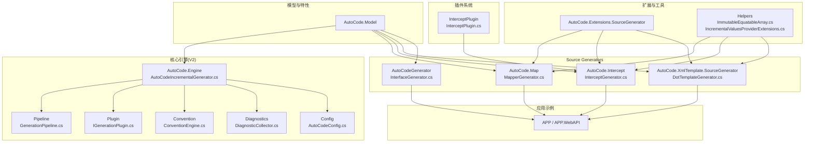
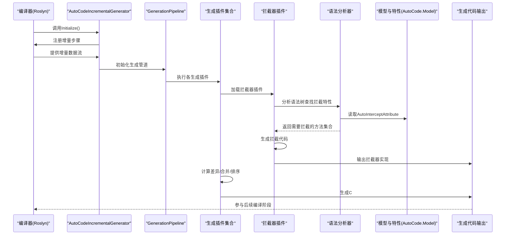
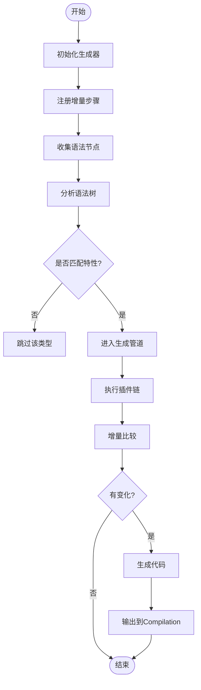
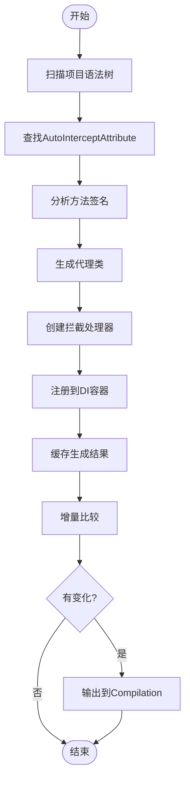
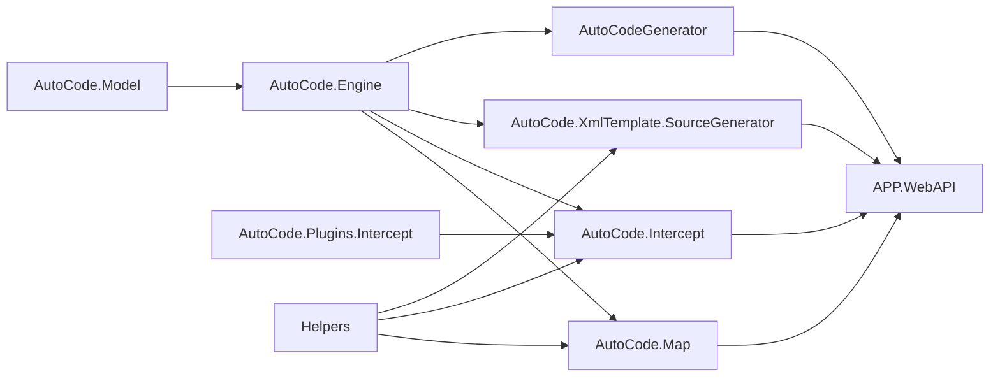

# Source Generator原理

<cite>
**本文档引用的文件**   
- [README.md](file://README.md)
- [AutoCodeIncrementalGenerator.cs](file://src/AutoCode.Engine/Roslyn/AutoCodeIncrementalGenerator.cs)
- [GenerationPipeline.cs](file://src/AutoCode.Engine/Pipeline/GenerationPipeline.cs)
- [GenerationContext.cs](file://src/AutoCode.Engine/Pipeline/GenerationContext.cs)
- [GeneratedFile.cs](file://src/AutoCode.Engine/Pipeline/GeneratedFile.cs)
- [IGenerationPlugin.cs](file://src/AutoCode.Engine/Plugin/IGenerationPlugin.cs)
- [ConventionEngine.cs](file://src/AutoCode.Engine/Convention/ConventionEngine.cs)
- [DiagnosticCollector.cs](file://src/AutoCode.Engine/Diagnostics/DiagnosticCollector.cs)
- [AutoCodeConfig.cs](file://src/AutoCode.Engine/Config/AutoCodeConfig.cs)
- [MapperGenerator.cs](file://src/AutoCode.Map/MapperGenerator.cs)
- [DiagnosticDescriptors.cs](file://src/AutoCode.Map/Diagnostics/DiagnosticDescriptors.cs)
- [ImmutableEquatableArray.cs](file://src/AutoCode.Map/Helpers/ImmutableEquatableArray.cs)
- [IncrementalValuesProviderExtensions.cs](file://src/AutoCode.Map/Helpers/IncrementalValuesProviderExtensions.cs)
- [AutoCode.SourceGenerator.Extensions.csproj](file://src/AutoCode.Extensions.SourceGenerator/AutoCode.SourceGenerator.Extensions.csproj)
- [DotTemplateGenerator.cs](file://src/AutoCode.XmlTemplate.SourceGenerator/DotTemplateGenerator.cs)
- [SyntaxNodeConvert.cs](file://src/AutoCode.XmlTemplate.SourceGenerator/SyntaxNodeConvert.cs)
- [InterfaceGenerator.cs](file://src/AutoCodeGenerator/InterfaceAutoBuilder/InterfaceGenerator.cs)
- [InterfaceBuilder.cs](file://src/AutoCodeGenerator/InterfaceAutoBuilder/InterfaceBuilder.cs)
- [InterfaceSpec.cs](file://src/AutoCodeGenerator/InterfaceAutoBuilder/InterfaceSpec.cs)
- [AutoCode.Model.csproj](file://src/AutoCode.Model/AutoCode.Model.csproj)
- [APP.WebAPI.csproj](file://src/APP.WebAPI/APP.WebAPI.csproj)
- [InterceptGenerator.cs](file://src/AutoCode.Intercept/InterceptGenerator.cs)
- [IInterceptHandler.cs](file://src/AutoCode.Model/IInterceptHandler.cs)
- [AutoInterceptAttribute.cs](file://src/AutoCode.Model/AutoInterceptAttribute.cs)
- [InterceptPlugin.cs](file://src/AutoCode.Plugins.Intercept/InterceptPlugin.cs)
</cite>

## 更新摘要
**所做更改**   
- 新增AOP拦截器生成器章节，详细介绍InterceptGenerator的实现机制和性能优化
- 更新插件系统架构，补充InterceptPlugin的集成方式
- 增强性能优化章节，重点介绍AOP拦截器的增量编译优化技巧
- 更新依赖关系分析，体现AOP拦截器在整体架构中的位置
- 新增拦截器生命周期和缓存机制说明

## 目录
1. [简介](#简介)
2. [项目结构](#项目结构)
3. [核心组件](#核心组件)
4. [架构总览](#架构总览)
5. [详细组件分析](#详细组件分析)
6. [AOP拦截器生成器](#aop拦截器生成器)
7. [依赖关系分析](#依赖关系分析)
8. [性能考虑](#性能考虑)
9. [故障排查指南](#故障排查指南)
10. [结论](#结论)
11. [附录](#附录)

## 简介
本文件面向初学者与高级用户，系统阐述C# Source Generator的工作原理以及AutoCode框架的实现机制。内容覆盖源代码分析、语法树解析、代码生成管道、编译时执行流程、生命周期、增量编译支持、诊断信息生成与错误处理，并提供创建自定义Source Generator的实践路径与优化技巧。

**更新** V2版本引入了全新的AutoCodeIncrementalGenerator，采用增量编译架构，显著提升了性能和可扩展性。新增AOP拦截器生成器，提供强大的方法拦截和横切关注点处理能力。

## 项目结构
AutoCode仓库采用多项目分层组织：
- 模型与特性定义位于AutoCode.Model，用于声明式配置（如映射、接口自动生成、AOP拦截等）。
- **新增** AutoCode.Engine核心引擎，包含增量生成器、管道架构、插件系统和约定引擎。
- Source Generator实现分布在多个项目中：
  - AutoCode.Map：基于ISourceGenerator或IncrementalGenerator的映射生成器。
  - AutoCode.Intercept：**新增** AOP拦截器生成器，提供方法拦截功能。
  - AutoCode.XmlTemplate.SourceGenerator：基于模板的代码生成器。
  - AutoCodeGenerator：接口自动生成的相关逻辑。
- 应用示例与Web API位于APP、APP.WebAPI等，用于验证生成结果。

**图表来源**
- [AutoCode.Engine.csproj](file://src/AutoCode.Engine/AutoCode.Engine.csproj)
- [AutoCodeIncrementalGenerator.cs](file://src/AutoCode.Engine/Roslyn/AutoCodeIncrementalGenerator.cs)
- [GenerationPipeline.cs](file://src/AutoCode.Engine/Pipeline/GenerationPipeline.cs)
- [IGenerationPlugin.cs](file://src/AutoCode.Engine/Plugin/IGenerationPlugin.cs)
- [ConventionEngine.cs](file://src/AutoCode.Engine/Convention/ConventionEngine.cs)
- [DiagnosticCollector.cs](file://src/AutoCode.Engine/Diagnostics/DiagnosticCollector.cs)
- [AutoCodeConfig.cs](file://src/AutoCode.Engine/Config/AutoCodeConfig.cs)
- [InterceptGenerator.cs](file://src/AutoCode.Intercept/InterceptGenerator.cs)
- [InterceptPlugin.cs](file://src/AutoCode.Plugins.Intercept/InterceptPlugin.cs)

## 核心组件
- **AutoCodeIncrementalGenerator**：V2核心增量生成器，负责协调整个生成过程。
- GenerationPipeline：代码生成管道，管理各个生成阶段的执行顺序和数据流转。
- IGenerationPlugin：插件接口，支持可扩展的生成器架构。
- ConventionEngine：约定引擎，处理代码规范和最佳实践检查。
- DiagnosticCollector：诊断收集器，统一管理编译期诊断信息。
- AutoCodeConfig：配置管理器，处理生成器的配置选项。
- MapperGenerator：核心映射生成器，负责扫描类型与属性，生成映射代码。
- **InterceptGenerator**：**新增** AOP拦截器生成器，负责分析方法并生成拦截代码。
- IInterceptHandler：**新增** 拦截处理器接口，定义拦截行为规范。
- AutoInterceptAttribute：**新增** 拦截特性，用于标记需要拦截的方法。
- InterceptPlugin：**新增** 拦截器插件，集成到插件系统中。
- DiagnosticDescriptors：集中管理诊断ID与消息模板，用于在编译期输出提示与错误。
- ImmutableEquatableArray：不可变数组封装，提升增量比较效率。
- IncrementalValuesProviderExtensions：对IncrementalValuesProvider的扩展，简化数据收集与过滤。
- DotTemplateGenerator：基于模板的生成器，结合外部模板文件生成代码。
- InterfaceGenerator/InterfaceBuilder/InterfaceSpec：接口自动生成的规范与构建器。

**章节来源**
- [AutoCodeIncrementalGenerator.cs](file://src/AutoCode.Engine/Roslyn/AutoCodeIncrementalGenerator.cs)
- [GenerationPipeline.cs](file://src/AutoCode.Engine/Pipeline/GenerationPipeline.cs)
- [IGenerationPlugin.cs](file://src/AutoCode.Engine/Plugin/IGenerationPlugin.cs)
- [ConventionEngine.cs](file://src/AutoCode.Engine/Convention/ConventionEngine.cs)
- [DiagnosticCollector.cs](file://src/AutoCode.Engine/Diagnostics/DiagnosticCollector.cs)
- [AutoCodeConfig.cs](file://src/AutoCode.Engine/Config/AutoCodeConfig.cs)
- [MapperGenerator.cs](file://src/AutoCode.Map/MapperGenerator.cs)
- [InterceptGenerator.cs](file://src/AutoCode.Intercept/InterceptGenerator.cs)
- [IInterceptHandler.cs](file://src/AutoCode.Model/IInterceptHandler.cs)
- [AutoInterceptAttribute.cs](file://src/AutoCode.Model/AutoInterceptAttribute.cs)
- [InterceptPlugin.cs](file://src/AutoCode.Plugins.Intercept/InterceptPlugin.cs)
- [DiagnosticDescriptors.cs](file://src/AutoCode.Map/Diagnostics/DiagnosticDescriptors.cs)
- [ImmutableEquatableArray.cs](file://src/AutoCode.Map/Helpers/ImmutableEquatableArray.cs)
- [IncrementalValuesProviderExtensions.cs](file://src/AutoCode.Map/Helpers/IncrementalValuesProviderExtensions.cs)
- [DotTemplateGenerator.cs](file://src/AutoCode.XmlTemplate.SourceGenerator/DotTemplateGenerator.cs)
- [InterfaceGenerator.cs](file://src/AutoCodeGenerator/InterfaceAutoBuilder/InterfaceGenerator.cs)
- [InterfaceBuilder.cs](file://src/AutoCodeGenerator/InterfaceAutoBuilder/InterfaceBuilder.cs)
- [InterfaceSpec.cs](file://src/AutoCodeGenerator/InterfaceAutoBuilder/InterfaceSpec.cs)

## 架构总览
Source Generator在编译阶段由Roslyn驱动，V2版本通过AutoCodeIncrementalGenerator实现了完整的增量编译支持。生命周期包括初始化、接收语法节点、分析、生成代码与输出。AutoCode通过模块化设计将"特性定义""语法分析""代码生成""模板渲染"解耦，便于扩展与维护。

**更新** V2版本引入了全新的生成管道架构，支持插件化扩展和增量编译优化。新增AOP拦截器生成器，提供强大的横切关注点处理能力。

**图表来源**
- [AutoCodeIncrementalGenerator.cs](file://src/AutoCode.Engine/Roslyn/AutoCodeIncrementalGenerator.cs)
- [GenerationPipeline.cs](file://src/AutoCode.Engine/Pipeline/GenerationPipeline.cs)
- [IGenerationPlugin.cs](file://src/AutoCode.Engine/Plugin/IGenerationPlugin.cs)
- [InterceptPlugin.cs](file://src/AutoCode.Plugins.Intercept/InterceptPlugin.cs)
- [AutoCode.Model.csproj](file://src/AutoCode.Model/AutoCode.Model.csproj)

## 详细组件分析

### AutoCodeIncrementalGenerator（核心增量生成器）
- **职责**：V2版本的核心入口点，协调整个代码生成过程。
- **关键点**：
  - 实现IIncrementalGenerator接口，充分利用增量编译能力。
  - 使用IncrementalValuesProvider构建数据流管道。
  - 集成插件系统，支持动态加载不同的生成器。
  - 提供统一的配置管理和诊断收集。
- **优化技巧**：
  - 利用增量缓存避免重复计算。
  - 并行处理独立的生成步骤。
  - 智能依赖分析减少不必要的重新生成。

**图表来源**
- [AutoCodeIncrementalGenerator.cs](file://src/AutoCode.Engine/Roslyn/AutoCodeIncrementalGenerator.cs)
- [GenerationPipeline.cs](file://src/AutoCode.Engine/Pipeline/GenerationPipeline.cs)

**章节来源**
- [AutoCodeIncrementalGenerator.cs](file://src/AutoCode.Engine/Roslyn/AutoCodeIncrementalGenerator.cs)

### 生成管道（GenerationPipeline）
- **职责**：管理代码生成的各个阶段，确保正确的执行顺序和数据流转。
- **关键点**：
  - 定义标准的生成阶段：分析、转换、验证、生成。
  - 支持中间结果的缓存和传递。
  - 提供错误处理和回滚机制。
- **优势**：
  - 清晰的阶段分离便于调试和维护。
  - 支持插件式的阶段扩展。
  - 统一的错误处理和日志记录。

**章节来源**
- [GenerationPipeline.cs](file://src/AutoCode.Engine/Pipeline/GenerationPipeline.cs)
- [GenerationContext.cs](file://src/AutoCode.Engine/Pipeline/GenerationContext.cs)
- [GeneratedFile.cs](file://src/AutoCode.Engine/Pipeline/GeneratedFile.cs)

### 插件系统（IGenerationPlugin）
- **职责**：定义可扩展的生成器接口，支持动态加载不同的代码生成逻辑。
- **关键点**：
  - 统一的插件接口定义。
  - 支持插件间的依赖管理和数据共享。
  - 提供插件生命周期管理。
- **扩展性**：
  - 可以轻松添加新的代码生成器。
  - 支持条件启用和禁用插件。
  - 提供插件配置和参数传递。

**章节来源**
- [IGenerationPlugin.cs](file://src/AutoCode.Engine/Plugin/IGenerationPlugin.cs)

### 约定引擎（ConventionEngine）
- **职责**：处理代码规范和最佳实践检查，确保生成代码的一致性。
- **关键点**：
  - 内置多种命名约定检查。
  - 支持自定义约定规则。
  - 提供友好的错误提示信息。

**章节来源**
- [ConventionEngine.cs](file://src/AutoCode.Engine/Convention/ConventionEngine.cs)

### 诊断收集器（DiagnosticCollector）
- **职责**：统一管理编译期诊断信息，提供丰富的诊断功能。
- **关键点**：
  - 支持不同严重级别的诊断。
  - 提供诊断信息的格式化输出。
  - 集成Visual Studio的诊断显示。

**章节来源**
- [DiagnosticCollector.cs](file://src/AutoCode.Engine/Diagnostics/DiagnosticCollector.cs)

### 配置管理器（AutoCodeConfig）
- **职责**：处理生成器的配置选项，支持多种配置源。
- **关键点**：
  - 支持JSON配置文件。
  - 支持环境变量配置。
  - 提供默认配置和配置验证。

**章节来源**
- [AutoCodeConfig.cs](file://src/AutoCode.Engine/Config/AutoCodeConfig.cs)

### MapperGenerator（映射生成器）
- **职责**：扫描目标类型与属性，依据特性配置生成映射代码。
- **关键点**：
  - 使用IncrementalGenerator或ISourceGenerator进行源码分析。
  - 利用ImmutableEquatableArray进行增量比较，减少重复工作。
  - 通过DiagnosticDescriptors输出诊断信息，辅助调试与定位问题。
- **优化技巧**：
  - 使用IncrementalValuesProvider缓存中间结果。
  - 避免在生成循环中创建大量临时对象。
  - 合理拆分步骤，确保每一步输入稳定可比较。

**图表来源**
- [MapperGenerator.cs](file://src/AutoCode.Map/MapperGenerator.cs)
- [ImmutableEquatableArray.cs](file://src/AutoCode.Map/Helpers/ImmutableEquatableArray.cs)

**章节来源**
- [MapperGenerator.cs](file://src/AutoCode.Map/MapperGenerator.cs)
- [ImmutableEquatableArray.cs](file://src/AutoCode.Map/Helpers/ImmutableEquatableArray.cs)

### 诊断与错误处理（DiagnosticDescriptors）
- **职责**：集中定义诊断ID、标题、消息模板与严重级别。
- **关键点**：
  - 为每个诊断场景提供唯一ID，便于筛选与统计。
  - 使用本地化友好的消息模板，提升可读性。
  - 在关键路径抛出诊断，帮助开发者快速定位问题。

**章节来源**
- [DiagnosticDescriptors.cs](file://src/AutoCode.Map/Diagnostics/DiagnosticDescriptors.cs)

### 增量支持（IncrementalValuesProviderExtensions）
- **职责**：对增量数据源进行扩展，简化过滤、分组与聚合。
- **关键点**：
  - 提供链式操作，提高可读性与复用性。
  - 保证输入输出的稳定性，利于增量比较。
  - 与ImmutableEquatableArray配合，降低内存分配与比较开销。

**章节来源**
- [IncrementalValuesProviderExtensions.cs](file://src/AutoCode.Map/Helpers/IncrementalValuesProviderExtensions.cs)
- [ImmutableEquatableArray.cs](file://src/AutoCode.Map/Helpers/ImmutableEquatableArray.cs)

### 模板生成器（DotTemplateGenerator）
- **职责**：基于外部模板文件渲染生成代码。
- **关键点**：
  - 加载模板文件，解析占位符与表达式。
  - 将模型数据注入模板，生成最终代码。
  - 支持多种模板格式，便于扩展。

**章节来源**
- [DotTemplateGenerator.cs](file://src/AutoCode.XmlTemplate.SourceGenerator/DotTemplateGenerator.cs)
- [SyntaxNodeConvert.cs](file://src/AutoCode.XmlTemplate.SourceGenerator/SyntaxNodeConvert.cs)

### 接口自动生成（InterfaceGenerator/InterfaceBuilder/InterfaceSpec）
- **职责**：根据特性与规范自动生成接口定义。
- **关键点**：
  - InterfaceSpec定义接口规格（名称、方法、参数等）。
  - InterfaceBuilder负责拼装接口代码。
  - InterfaceGenerator协调分析与生成流程。

**章节来源**
- [InterfaceGenerator.cs](file://src/AutoCodeGenerator/InterfaceAutoBuilder/InterfaceGenerator.cs)
- [InterfaceBuilder.cs](file://src/AutoCodeGenerator/InterfaceAutoBuilder/InterfaceBuilder.cs)
- [InterfaceSpec.cs](file://src/AutoCodeGenerator/InterfaceAutoBuilder/InterfaceSpec.cs)

## AOP拦截器生成器

### InterceptGenerator（AOP拦截器核心生成器）
- **职责**：分析带有AutoInterceptAttribute特性的方法，生成相应的拦截器代码。
- **核心功能**：
  - 扫描项目中的所有类和方法，识别带有拦截特性的目标方法。
  - 生成拦截器代理类，实现IInterceptHandler接口。
  - 创建拦截器工厂，支持运行时拦截器的动态装配。
  - 集成依赖注入容器，自动注册拦截器实例。
- **增量优化**：
  - 使用IncrementalValuesProvider缓存已分析的语法节点。
  - 通过哈希比较确定是否需要重新生成拦截器。
  - 支持部分重建，仅更新发生变化的拦截器。

**图表来源**
- [InterceptGenerator.cs](file://src/AutoCode.Intercept/InterceptGenerator.cs)
- [IInterceptHandler.cs](file://src/AutoCode.Model/IInterceptHandler.cs)
- [AutoInterceptAttribute.cs](file://src/AutoCode.Model/AutoInterceptAttribute.cs)

**章节来源**
- [InterceptGenerator.cs](file://src/AutoCode.Intercept/InterceptGenerator.cs)
- [IInterceptHandler.cs](file://src/AutoCode.Model/IInterceptHandler.cs)
- [AutoInterceptAttribute.cs](file://src/AutoCode.Model/AutoInterceptAttribute.cs)

### InterceptPlugin（拦截器插件）
- **职责**：作为插件系统中的拦截器生成器，提供标准化的插件接口实现。
- **关键特性**：
  - 实现IGenerationPlugin接口，遵循插件规范。
  - 支持插件配置和参数传递。
  - 提供插件生命周期管理（初始化、执行、清理）。
  - 与其他插件的数据共享和依赖管理。

**章节来源**
- [InterceptPlugin.cs](file://src/AutoCode.Plugins.Intercept/InterceptPlugin.cs)

### 拦截器生命周期管理
- **初始化阶段**：
  - 扫描项目中的拦截特性标记。
  - 构建拦截器依赖图。
  - 预编译拦截器模板。
- **执行阶段**：
  - 按依赖顺序生成拦截器代码。
  - 处理循环依赖和冲突检测。
  - 生成单元测试脚手架。
- **清理阶段**：
  - 释放临时资源。
  - 清理缓存数据。
  - 输出性能统计信息。

### 拦截器缓存机制
- **缓存策略**：
  - 基于方法签名的哈希值作为缓存键。
  - 支持多级缓存（内存缓存、磁盘缓存）。
  - 缓存失效策略：特性变更、依赖变更、模板变更。
- **性能优化**：
  - 使用ImmutableEquatableArray存储缓存项。
  - 支持并发访问的线程安全缓存。
  - 定期清理过期缓存项。

**章节来源**
- [InterceptGenerator.cs](file://src/AutoCode.Intercept/InterceptGenerator.cs)
- [InterceptPlugin.cs](file://src/AutoCode.Plugins.Intercept/InterceptPlugin.cs)

## 依赖关系分析
AutoCode各模块之间松耦合，V2版本通过核心引擎进一步增强了模块化程度，主要依赖关系如下：
- AutoCode.Model：被所有生成器依赖，提供特性与基础类型。
- **新增** AutoCode.Engine：核心引擎，被所有其他生成器依赖，提供基础设施。
- AutoCode.Map：依赖AutoCode.Model与Helpers，实现映射生成。
- **新增** AutoCode.Intercept：依赖AutoCode.Model与Engine，实现AOP拦截器生成。
- AutoCode.XmlTemplate.SourceGenerator：依赖AutoCode.Model与模板引擎。
- AutoCodeGenerator：依赖AutoCode.Model，实现接口生成。
- **新增** AutoCode.Plugins.Intercept：依赖AutoCode.Engine，实现拦截器插件。
- 应用项目（APP.WebAPI等）引用上述生成器，参与编译时生成。

**图表来源**
- [AutoCode.Model.csproj](file://src/AutoCode.Model/AutoCode.Model.csproj)
- [AutoCode.Engine.csproj](file://src/AutoCode.Engine/AutoCode.Engine.csproj)
- [AutoCode.Map/MapperGenerator.cs](file://src/AutoCode.Map/MapperGenerator.cs)
- [AutoCode.Intercept/InterceptGenerator.cs](file://src/AutoCode.Intercept/InterceptGenerator.cs)
- [AutoCode.Plugins.Intercept/InterceptPlugin.cs](file://src/AutoCode.Plugins.Intercept/InterceptPlugin.cs)
- [AutoCode.XmlTemplate.SourceGenerator/DotTemplateGenerator.cs](file://src/AutoCode.XmlTemplate.SourceGenerator/DotTemplateGenerator.cs)
- [AutoCodeGenerator/InterfaceGenerator.cs](file://src/AutoCodeGenerator/InterfaceAutoBuilder/InterfaceGenerator.cs)
- [APP.WebAPI.csproj](file://src/APP.WebAPI/APP.WebAPI.csproj)

**章节来源**
- [AutoCode.Model.csproj](file://src/AutoCode.Model/AutoCode.Model.csproj)
- [AutoCode.Engine.csproj](file://src/AutoCode.Engine/AutoCode.Engine.csproj)
- [APP.WebAPI.csproj](file://src/APP.WebAPI/APP.WebAPI.csproj)

## 性能考虑
- **增量编译优化**：
  - 使用AutoCodeIncrementalGenerator替代传统ISourceGenerator，充分利用增量能力。
  - 对输入数据进行规范化与哈希，确保稳定的比较结果。
  - 利用IncrementalValuesProvider缓存中间结果。
  - **新增** AOP拦截器使用方法签名哈希进行增量比较，避免不必要的重新生成。
- **内存与分配优化**：
  - 使用ImmutableEquatableArray减少临时对象与GC压力。
  - 避免在生成循环中频繁创建字符串与集合。
  - 实现对象的池化和重用。
  - **新增** 拦截器缓存使用不可变数据结构，减少内存分配。
- **并行与缓存优化**：
  - 将独立步骤并行化，但注意线程安全。
  - 缓存中间结果，避免重复计算。
  - 使用异步处理提高吞吐量。
  - **新增** 拦截器生成支持并行处理不同的方法拦截。
- **诊断与日志优化**：
  - 仅在必要时输出诊断，避免过多I/O。
  - 使用结构化日志记录关键路径耗时。
  - 提供性能监控和分析工具。
  - **新增** 拦截器性能统计，监控生成时间和内存使用。
- **AOP拦截器特定优化**：
  - 懒加载拦截器实例，减少启动时间。
  - 支持拦截器链的编译时优化。
  - 使用委托而非反射调用，提升执行性能。
  - 缓存拦截器元数据，避免重复解析。

## 故障排查指南
- **常见问题**：
  - 未正确注册分析动作，导致无法捕获语法节点。
  - 增量比较不稳定，导致重复生成。
  - 诊断信息缺失，难以定位问题。
  - 插件加载失败或配置错误。
  - **新增** AOP拦截器循环依赖导致的生成失败。
  - **新增** 拦截器特性配置错误导致的运行时异常。
- **排查步骤**：
  - 检查Initialize中的注册逻辑。
  - 验证ImmutableEquatableArray的使用是否正确。
  - 查看DiagnosticDescriptors中的ID与消息是否完整。
  - 启用详细日志，观察生成器执行路径。
  - 检查插件配置和依赖关系。
  - **新增** 检查拦截器依赖图和循环依赖检测。
  - **新增** 验证AutoInterceptAttribute的配置语法。
- **调试技巧**：
  - 使用Visual Studio的"显示生成的代码"功能。
  - 在生成器中插入断点，观察执行路径。
  - 启用详细日志，记录关键步骤耗时。
  - 使用性能分析工具识别瓶颈。
  - **新增** 使用拦截器性能分析工具，监控拦截效果。
  - **新增** 启用拦截器调试模式，查看详细调用栈。

**章节来源**
- [DiagnosticDescriptors.cs](file://src/AutoCode.Map/Diagnostics/DiagnosticDescriptors.cs)
- [ImmutableEquatableArray.cs](file://src/AutoCode.Map/Helpers/ImmutableEquatableArray.cs)
- [DiagnosticCollector.cs](file://src/AutoCode.Engine/Diagnostics/DiagnosticCollector.cs)
- [InterceptGenerator.cs](file://src/AutoCode.Intercept/InterceptGenerator.cs)

## 结论
AutoCode框架V2版本通过引入AutoCodeIncrementalGenerator和全新的生成管道架构，实现了更加高效和可扩展的Source Generator体系。新增的AOP拦截器生成器提供了强大的横切关注点处理能力，支持方法拦截、事务管理、日志记录等常见需求。无论是映射生成、模板渲染、接口自动生成还是AOP拦截，都遵循一致的分析与生成流程。对于初学者，建议从ISourceGenerator入门，逐步过渡到IncrementalGenerator；对于高级用户，应重点关注增量比较、内存管理与并行优化，并利用插件系统扩展功能。

## 附录
- **创建自定义Source Generator的步骤**：
  - 实现ISourceGenerator或IncrementalGenerator接口。
  - 使用SyntaxReceiver或IncrementalSteps收集语法节点。
  - 基于AutoCode.Model中的特性进行过滤与转换。
  - 生成代码并添加到Compilation。
  - 使用DiagnosticDescriptors输出诊断信息。
  - **V2新增**：继承IGenerationPlugin接口，实现插件化生成器。
  - **新增**：参考InterceptGenerator实现AOP拦截器生成器。
- **调试技巧**：
  - 使用Visual Studio的"显示生成的代码"功能。
  - 在生成器中插入断点，观察执行路径。
  - 启用详细日志，记录关键步骤耗时。
  - **V2新增**：使用DiagnosticCollector进行统一诊断管理。
  - **新增**：使用拦截器调试工具，监控拦截效果。
- **性能优化最佳实践**：
  - 优先使用IncrementalGenerator而非ISourceGenerator。
  - 合理使用ImmutableEquatableArray进行增量比较。
  - 避免在生成过程中进行I/O操作。
  - 利用并行处理提高性能。
  - **V2新增**：利用GenerationPipeline的缓存机制。
  - **新增**：使用懒加载和缓存策略优化AOP拦截器性能。
  - **新增**：避免在拦截器中执行耗时操作，使用异步处理。