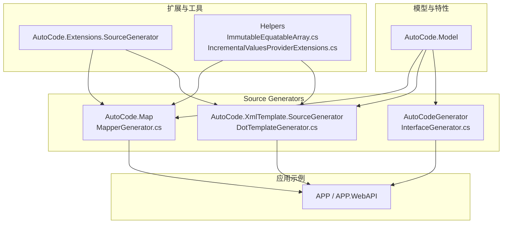
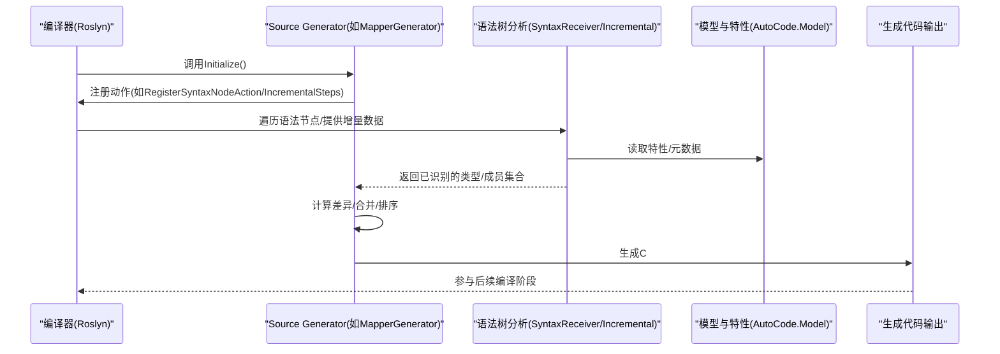
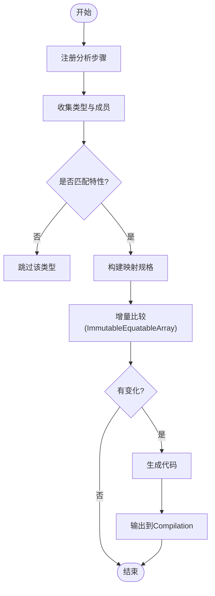
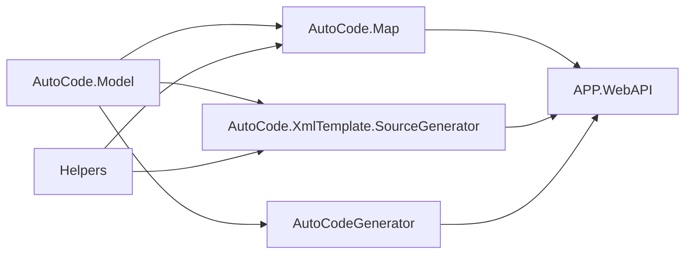

# Source Generator原理

<cite>
**本文档引用的文件**   
- [README.md](file://README.md)
- [MapperGenerator.cs](file://src/AutoCode.Map/MapperGenerator.cs)
- [DiagnosticDescriptors.cs](file://src/AutoCode.Map/Diagnostics/DiagnosticDescriptors.cs)
- [ImmutableEquatableArray.cs](file://src/AutoCode.Map/Helpers/ImmutableEquatableArray.cs)
- [IncrementalValuesProviderExtensions.cs](file://src/AutoCode.Map/Helpers/IncrementalValuesProviderExtensions.cs)
- [AutoCode.SourceGenerator.Extensions.csproj](file://src/AutoCode.Extensions.SourceGenerator/AutoCode.SourceGenerator.Extensions.csproj)
- [DotTemplateGenerator.cs](file://src/AutoCode.XmlTemplate.SourceGenerator/DotTemplateGenerator.cs)
- [SyntaxNodeConvert.cs](file://src/AutoCode.XmlTemplate.SourceGenerator/SyntaxNodeConvert.cs)
- [InterfaceGenerator.cs](file://src/AutoCodeGenerator/InterfaceAutoBuilder/InterfaceGenerator.cs)
- [InterfaceBuilder.cs](file://src/AutoCodeGenerator/InterfaceAutoBuilder/InterfaceBuilder.cs)
- [InterfaceSpec.cs](file://src/AutoCodeGenerator/InterfaceAutoBuilder/InterfaceSpec.cs)
- [AutoCode.Model.csproj](file://src/AutoCode.Model/AutoCode.Model.csproj)
- [APP.WebAPI.csproj](file://src/APP.WebAPI/APP.WebAPI.csproj)
</cite>

## 目录
1. [简介](#简介)
2. [项目结构](#项目结构)
3. [核心组件](#核心组件)
4. [架构总览](#架构总览)
5. [详细组件分析](#详细组件分析)
6. [依赖关系分析](#依赖关系分析)
7. [性能考虑](#性能考虑)
8. [故障排查指南](#故障排查指南)
9. [结论](#结论)
10. [附录](#附录)

## 简介
本文件面向初学者与高级用户，系统阐述C# Source Generator的工作原理以及AutoCode框架的实现机制。内容覆盖源代码分析、语法树解析、代码生成管道、编译时执行流程、生命周期、增量编译支持、诊断信息生成与错误处理，并提供创建自定义Source Generator的实践路径与优化技巧。

## 项目结构
AutoCode仓库采用多项目分层组织：
- 模型与特性定义位于AutoCode.Model，用于声明式配置（如映射、接口自动生成等）。
- Source Generator实现分布在多个项目中：
  - AutoCode.Map：基于ISourceGenerator或IncrementalGenerator的映射生成器。
  - AutoCode.XmlTemplate.SourceGenerator：基于模板的代码生成器。
  - AutoCodeGenerator：接口自动生成的相关逻辑。
- 应用示例与Web API位于APP、APP.WebAPI等，用于验证生成结果。

图表来源
- [AutoCode.Model.csproj](file://src/AutoCode.Model/AutoCode.Model.csproj)
- [MapperGenerator.cs](file://src/AutoCode.Map/MapperGenerator.cs)
- [DotTemplateGenerator.cs](file://src/AutoCode.XmlTemplate.SourceGenerator/DotTemplateGenerator.cs)
- [InterfaceGenerator.cs](file://src/AutoCodeGenerator/InterfaceAutoBuilder/InterfaceGenerator.cs)
- [ImmutableEquatableArray.cs](file://src/AutoCode.Map/Helpers/ImmutableEquatableArray.cs)
- [IncrementalValuesProviderExtensions.cs](file://src/AutoCode.Map/Helpers/IncrementalValuesProviderExtensions.cs)
- [AutoCode.Extensions.SourceGenerator.Extensions.csproj](file://src/AutoCode.Extensions.SourceGenerator/AutoCode.SourceGenerator.Extensions.csproj)

章节来源
- [README.md](file://README.md)

## 核心组件
- MapperGenerator：核心映射生成器，负责扫描类型与属性，生成映射代码。
- DiagnosticDescriptors：集中管理诊断ID与消息模板，用于在编译期输出提示与错误。
- ImmutableEquatableArray：不可变数组封装，提升增量比较效率。
- IncrementalValuesProviderExtensions：对IncrementalValuesProvider的扩展，简化数据收集与过滤。
- DotTemplateGenerator：基于模板的生成器，结合外部模板文件生成代码。
- InterfaceGenerator/InterfaceBuilder/InterfaceSpec：接口自动生成的规范与构建器。

章节来源
- [MapperGenerator.cs](file://src/AutoCode.Map/MapperGenerator.cs)
- [DiagnosticDescriptors.cs](file://src/AutoCode.Map/Diagnostics/DiagnosticDescriptors.cs)
- [ImmutableEquatableArray.cs](file://src/AutoCode.Map/Helpers/ImmutableEquatableArray.cs)
- [IncrementalValuesProviderExtensions.cs](file://src/AutoCode.Map/Helpers/IncrementalValuesProviderExtensions.cs)
- [DotTemplateGenerator.cs](file://src/AutoCode.XmlTemplate.SourceGenerator/DotTemplateGenerator.cs)
- [InterfaceGenerator.cs](file://src/AutoCodeGenerator/InterfaceAutoBuilder/InterfaceGenerator.cs)
- [InterfaceBuilder.cs](file://src/AutoCodeGenerator/InterfaceAutoBuilder/InterfaceBuilder.cs)
- [InterfaceSpec.cs](file://src/AutoCodeGenerator/InterfaceAutoBuilder/InterfaceSpec.cs)

## 架构总览
Source Generator在编译阶段由Roslyn驱动，生命周期包括初始化、接收语法节点、分析、生成代码与输出。AutoCode通过模块化设计将“特性定义”“语法分析”“代码生成”“模板渲染”解耦，便于扩展与维护。

图表来源
- [MapperGenerator.cs](file://src/AutoCode.Map/MapperGenerator.cs)
- [AutoCode.Model.csproj](file://src/AutoCode.Model/AutoCode.Model.csproj)

## 详细组件分析

### MapperGenerator（映射生成器）
- 职责：扫描目标类型与属性，依据特性配置生成映射代码。
- 关键点：
  - 使用IncrementalGenerator或ISourceGenerator进行源码分析。
  - 利用ImmutableEquatableArray进行增量比较，减少重复工作。
  - 通过DiagnosticDescriptors输出诊断信息，辅助调试与定位问题。
- 优化技巧：
  - 使用IncrementalValuesProvider缓存中间结果。
  - 避免在生成循环中创建大量临时对象。
  - 合理拆分步骤，确保每一步输入稳定可比较。

图表来源
- [MapperGenerator.cs](file://src/AutoCode.Map/MapperGenerator.cs)
- [ImmutableEquatableArray.cs](file://src/AutoCode.Map/Helpers/ImmutableEquatableArray.cs)

章节来源
- [MapperGenerator.cs](file://src/AutoCode.Map/MapperGenerator.cs)
- [ImmutableEquatableArray.cs](file://src/AutoCode.Map/Helpers/ImmutableEquatableArray.cs)

### 诊断与错误处理（DiagnosticDescriptors）
- 职责：集中定义诊断ID、标题、消息模板与严重级别。
- 关键点：
  - 为每个诊断场景提供唯一ID，便于筛选与统计。
  - 使用本地化友好的消息模板，提升可读性。
  - 在关键路径抛出诊断，帮助开发者快速定位问题。

章节来源
- [DiagnosticDescriptors.cs](file://src/AutoCode.Map/Diagnostics/DiagnosticDescriptors.cs)

### 增量支持（IncrementalValuesProviderExtensions）
- 职责：对增量数据源进行扩展，简化过滤、分组与聚合。
- 关键点：
  - 提供链式操作，提高可读性与复用性。
  - 保证输入输出的稳定性，利于增量比较。
  - 与ImmutableEquatableArray配合，降低内存分配与比较开销。

章节来源
- [IncrementalValuesProviderExtensions.cs](file://src/AutoCode.Map/Helpers/IncrementalValuesProviderExtensions.cs)
- [ImmutableEquatableArray.cs](file://src/AutoCode.Map/Helpers/ImmutableEquatableArray.cs)

### 模板生成器（DotTemplateGenerator）
- 职责：基于外部模板文件渲染生成代码。
- 关键点：
  - 加载模板文件，解析占位符与表达式。
  - 将模型数据注入模板，生成最终代码。
  - 支持多种模板格式，便于扩展。

章节来源
- [DotTemplateGenerator.cs](file://src/AutoCode.XmlTemplate.SourceGenerator/DotTemplateGenerator.cs)
- [SyntaxNodeConvert.cs](file://src/AutoCode.XmlTemplate.SourceGenerator/SyntaxNodeConvert.cs)

### 接口自动生成（InterfaceGenerator/InterfaceBuilder/InterfaceSpec）
- 职责：根据特性与规范自动生成接口定义。
- 关键点：
  - InterfaceSpec定义接口规格（名称、方法、参数等）。
  - InterfaceBuilder负责拼装接口代码。
  - InterfaceGenerator协调分析与生成流程。

章节来源
- [InterfaceGenerator.cs](file://src/AutoCodeGenerator/InterfaceAutoBuilder/InterfaceGenerator.cs)
- [InterfaceBuilder.cs](file://src/AutoCodeGenerator/InterfaceAutoBuilder/InterfaceBuilder.cs)
- [InterfaceSpec.cs](file://src/AutoCodeGenerator/InterfaceAutoBuilder/InterfaceSpec.cs)

## 依赖关系分析
AutoCode各模块之间松耦合，主要依赖关系如下：
- AutoCode.Model：被所有生成器依赖，提供特性与基础类型。
- AutoCode.Map：依赖AutoCode.Model与Helpers，实现映射生成。
- AutoCode.XmlTemplate.SourceGenerator：依赖AutoCode.Model与模板引擎。
- AutoCodeGenerator：依赖AutoCode.Model，实现接口生成。
- 应用项目（APP.WebAPI等）引用上述生成器，参与编译时生成。

图表来源
- [AutoCode.Model.csproj](file://src/AutoCode.Model/AutoCode.Model.csproj)
- [AutoCode.Map/MapperGenerator.cs](file://src/AutoCode.Map/MapperGenerator.cs)
- [AutoCode.XmlTemplate.SourceGenerator/DotTemplateGenerator.cs](file://src/AutoCode.XmlTemplate.SourceGenerator/DotTemplateGenerator.cs)
- [AutoCodeGenerator/InterfaceGenerator.cs](file://src/AutoCodeGenerator/InterfaceAutoBuilder/InterfaceGenerator.cs)
- [APP.WebAPI.csproj](file://src/APP.WebAPI/APP.WebAPI.csproj)

章节来源
- [AutoCode.Model.csproj](file://src/AutoCode.Model/AutoCode.Model.csproj)
- [APP.WebAPI.csproj](file://src/APP.WebAPI/APP.WebAPI.csproj)

## 性能考虑
- 增量编译：
  - 使用IncrementalGenerator替代ISourceGenerator，充分利用增量能力。
  - 对输入数据进行规范化与哈希，确保稳定的比较结果。
- 内存与分配：
  - 使用ImmutableEquatableArray减少临时对象与GC压力。
  - 避免在生成循环中频繁创建字符串与集合。
- 并行与缓存：
  - 将独立步骤并行化，但注意线程安全。
  - 缓存中间结果，避免重复计算。
- 诊断与日志：
  - 仅在必要时输出诊断，避免过多I/O。
  - 使用结构化日志记录关键路径耗时。

[本节为通用指导，不直接分析具体文件]

## 故障排查指南
- 常见问题：
  - 未正确注册分析动作，导致无法捕获语法节点。
  - 增量比较不稳定，导致重复生成。
  - 诊断信息缺失，难以定位问题。
- 排查步骤：
  - 检查Initialize中的注册逻辑。
  - 验证ImmutableEquatableArray的使用是否正确。
  - 查看DiagnosticDescriptors中的ID与消息是否完整。
  - 启用详细日志，观察生成器执行路径。

章节来源
- [DiagnosticDescriptors.cs](file://src/AutoCode.Map/Diagnostics/DiagnosticDescriptors.cs)
- [ImmutableEquatableArray.cs](file://src/AutoCode.Map/Helpers/ImmutableEquatableArray.cs)

## 结论
AutoCode框架通过清晰的模块化设计与增量编译优化，实现了高效的Source Generator体系。无论是映射生成、模板渲染还是接口自动生成，都遵循一致的分析与生成流程。对于初学者，建议从ISourceGenerator入门，逐步过渡到IncrementalGenerator；对于高级用户，应重点关注增量比较、内存管理与并行优化。

[本节为总结性内容，不直接分析具体文件]

## 附录
- 创建自定义Source Generator的步骤：
  - 实现ISourceGenerator或IncrementalGenerator接口。
  - 使用SyntaxReceiver或IncrementalSteps收集语法节点。
  - 基于AutoCode.Model中的特性进行过滤与转换。
  - 生成代码并添加到Compilation。
  - 使用DiagnosticDescriptors输出诊断信息。
- 调试技巧：
  - 使用Visual Studio的“显示生成的代码”功能。
  - 在生成器中插入断点，观察执行路径。
  - 启用详细日志，记录关键步骤耗时。

[本节为实践指导，不直接分析具体文件]
