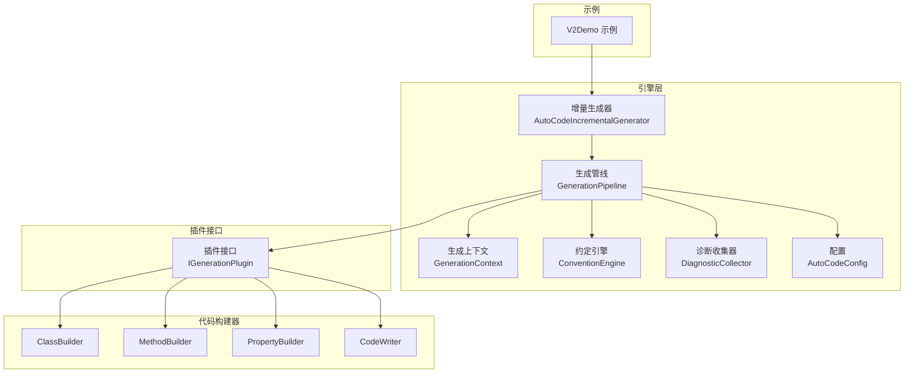
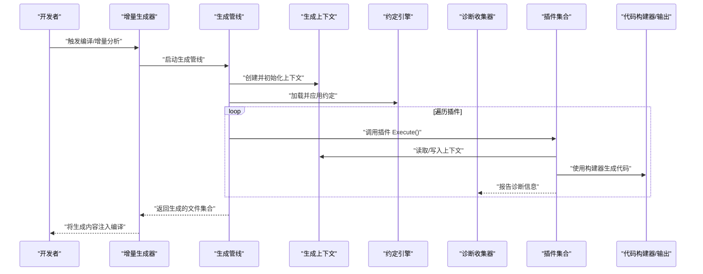
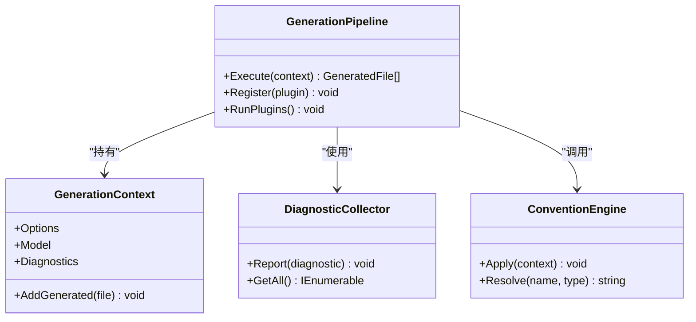
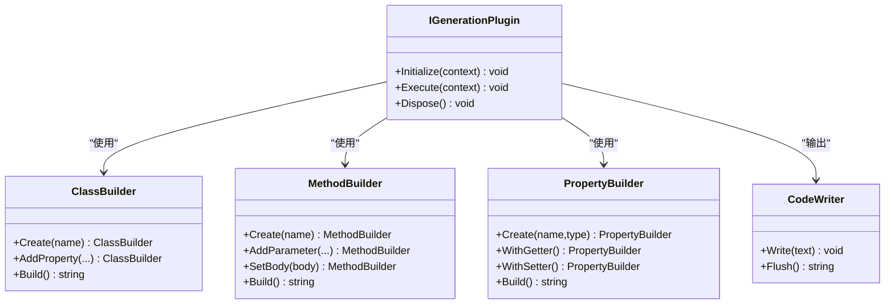
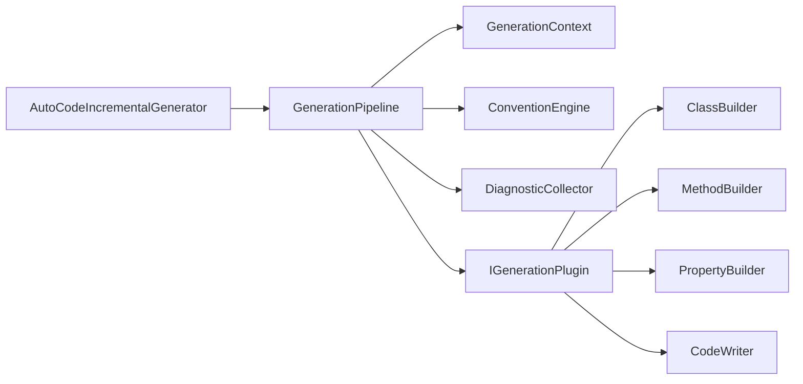

# V2插件架构

<cite>
**本文引用的文件**   
- [AutoCode.Engine.csproj](file://src/AutoCode.Engine/AutoCode.Engine.csproj)
- [GenerationPipeline.cs](file://src/AutoCode.Engine/Pipeline/GenerationPipeline.cs)
- [GenerationContext.cs](file://src/AutoCode.Engine/Pipeline/GenerationContext.cs)
- [GeneratedFile.cs](file://src/AutoCode.Engine/Pipeline/GeneratedFile.cs)
- [ConventionEngine.cs](file://src/AutoCode.Engine/Convention/ConventionEngine.cs)
- [DiagnosticCollector.cs](file://src/AutoCode.Engine/Diagnostics/DiagnosticCollector.cs)
- [AutoCodeConfig.cs](file://src/AutoCode.Engine/Config/AutoCodeConfig.cs)
- [AutoCodeIncrementalGenerator.cs](file://src/AutoCode.Engine/Roslyn/AutoCodeIncrementalGenerator.cs)
- [IGenerationPlugin.cs](file://src/AutoCode.Engine/Plugin/IGenerationPlugin.cs)
- [ClassBuilder.cs](file://src/AutoCode.Engine/CodeBuilder/ClassBuilder.cs)
- [MethodBuilder.cs](file://src/AutoCode.Engine/CodeBuilder/MethodBuilder.cs)
- [PropertyBuilder.cs](file://src/AutoCode.Engine/CodeBuilder/PropertyBuilder.cs)
- [CodeWriter.cs](file://src/AutoCode.Engine/CodeBuilder/CodeWriter.cs)
- [Program.cs](file://src/Samples/V2Demo/Program.cs)
- [Models.cs](file://src/Samples/V2Demo/Models.cs)
- [V2Demo.csproj](file://src/Samples/V2Demo/V2Demo.csproj)
</cite>

## 目录
1. [简介](#简介)
2. [项目结构](#项目结构)
3. [核心组件](#核心组件)
4. [架构总览](#架构总览)
5. [详细组件分析](#详细组件分析)
6. [依赖关系分析](#依赖关系分析)
7. [性能考量](#性能考量)
8. [故障排查指南](#故障排查指南)
9. [结论](#结论)
10. [附录](#附录)

## 简介
本文件系统化阐述 AutoCode 的 V2 插件架构，聚焦于增量源生成器、插件管线、约定引擎与代码构建器的协作方式。读者将了解：
- 插件如何被发现、加载与执行
- 生成上下文如何在插件间传递
- 约定如何影响插件行为
- 诊断信息如何收集与上报
- 代码生成器如何产出高质量 C# 源码

## 项目结构
V2 插件架构的核心位于 AutoCode.Engine 工程，围绕“增量生成器 + 插件管线 + 约定引擎 + 诊断收集 + 配置”展开；Samples/V2Demo 提供最小可运行示例。

图表来源
- [AutoCodeIncrementalGenerator.cs](file://src/AutoCode.Engine/Roslyn/AutoCodeIncrementalGenerator.cs)
- [GenerationPipeline.cs](file://src/AutoCode.Engine/Pipeline/GenerationPipeline.cs)
- [GenerationContext.cs](file://src/AutoCode.Engine/Pipeline/GenerationContext.cs)
- [ConventionEngine.cs](file://src/AutoCode.Engine/Convention/ConventionEngine.cs)
- [DiagnosticCollector.cs](file://src/AutoCode.Engine/Diagnostics/DiagnosticCollector.cs)
- [AutoCodeConfig.cs](file://src/AutoCode.Engine/Config/AutoCodeConfig.cs)
- [IGenerationPlugin.cs](file://src/AutoCode.Engine/Plugin/IGenerationPlugin.cs)
- [ClassBuilder.cs](file://src/AutoCode.Engine/CodeBuilder/ClassBuilder.cs)
- [MethodBuilder.cs](file://src/AutoCode.Engine/CodeBuilder/MethodBuilder.cs)
- [PropertyBuilder.cs](file://src/AutoCode.Engine/CodeBuilder/PropertyBuilder.cs)
- [CodeWriter.cs](file://src/AutoCode.Engine/CodeBuilder/CodeWriter.cs)
- [Program.cs](file://src/Samples/V2Demo/Program.cs)

章节来源
- [AutoCode.Engine.csproj](file://src/AutoCode.Engine/AutoCode.Engine.csproj)
- [V2Demo.csproj](file://src/Samples/V2Demo/V2Demo.csproj)

## 核心组件
- 增量生成器：作为 Roslyn 源生成器入口，负责输入捕获、增量计算与管线调度。
- 生成管线：编排插件执行顺序、上下文传递、错误与诊断汇总。
- 生成上下文：在插件之间共享模型、配置与中间结果。
- 约定引擎：解析并应用命名、可见性、映射等约定，统一插件行为。
- 诊断收集器：集中收集与分析阶段的诊断信息，便于 IDE 提示与构建反馈。
- 配置：集中管理生成器选项与插件开关。
- 插件接口：定义插件生命周期与能力边界。
- 代码构建器：提供类型化 API 用于构造类、方法、属性与输出源码。

章节来源
- [AutoCodeIncrementalGenerator.cs](file://src/AutoCode.Engine/Roslyn/AutoCodeIncrementalGenerator.cs)
- [GenerationPipeline.cs](file://src/AutoCode.Engine/Pipeline/GenerationPipeline.cs)
- [GenerationContext.cs](file://src/AutoCode.Engine/Pipeline/GenerationContext.cs)
- [ConventionEngine.cs](file://src/AutoCode.Engine/Convention/ConventionEngine.cs)
- [DiagnosticCollector.cs](file://src/AutoCode.Engine/Diagnostics/DiagnosticCollector.cs)
- [AutoCodeConfig.cs](file://src/AutoCode.Engine/Config/AutoCodeConfig.cs)
- [IGenerationPlugin.cs](file://src/AutoCode.Engine/Plugin/IGenerationPlugin.cs)
- [ClassBuilder.cs](file://src/AutoCode.Engine/CodeBuilder/ClassBuilder.cs)
- [MethodBuilder.cs](file://src/AutoCode.Engine/CodeBuilder/MethodBuilder.cs)
- [PropertyBuilder.cs](file://src/AutoCode.Engine/CodeBuilder/PropertyBuilder.cs)
- [CodeWriter.cs](file://src/AutoCode.Engine/CodeBuilder/CodeWriter.cs)

## 架构总览
下图展示了从增量生成器到插件执行、再到代码输出的整体流程。

图表来源
- [AutoCodeIncrementalGenerator.cs](file://src/AutoCode.Engine/Roslyn/AutoCodeIncrementalGenerator.cs)
- [GenerationPipeline.cs](file://src/AutoCode.Engine/Pipeline/GenerationPipeline.cs)
- [GenerationContext.cs](file://src/AutoCode.Engine/Pipeline/GenerationContext.cs)
- [ConventionEngine.cs](file://src/AutoCode.Engine/Convention/ConventionEngine.cs)
- [DiagnosticCollector.cs](file://src/AutoCode.Engine/Diagnostics/DiagnosticCollector.cs)
- [IGenerationPlugin.cs](file://src/AutoCode.Engine/Plugin/IGenerationPlugin.cs)
- [ClassBuilder.cs](file://src/AutoCode.Engine/CodeBuilder/ClassBuilder.cs)
- [MethodBuilder.cs](file://src/AutoCode.Engine/CodeBuilder/MethodBuilder.cs)
- [PropertyBuilder.cs](file://src/AutoCode.Engine/CodeBuilder/PropertyBuilder.cs)
- [CodeWriter.cs](file://src/AutoCode.Engine/CodeBuilder/CodeWriter.cs)

## 详细组件分析

### 增量生成器（Roslyn）
- 职责：捕获输入语法树、驱动增量计算、调用生成管线、注册生成文件。
- 关键点：
  - 增量输入过滤以减少不必要工作
  - 与生成管线解耦，便于扩展
  - 将诊断与生成结果回传给编译器

章节来源
- [AutoCodeIncrementalGenerator.cs](file://src/AutoCode.Engine/Roslyn/AutoCodeIncrementalGenerator.cs)

### 生成管线与上下文
- 生成管线：
  - 按序执行插件
  - 维护统一的上下文对象
  - 聚合诊断与异常
- 生成上下文：
  - 承载模型、配置、中间产物
  - 提供线程安全访问点（如需要）

图表来源
- [GenerationPipeline.cs](file://src/AutoCode.Engine/Pipeline/GenerationPipeline.cs)
- [GenerationContext.cs](file://src/AutoCode.Engine/Pipeline/GenerationContext.cs)
- [DiagnosticCollector.cs](file://src/AutoCode.Engine/Diagnostics/DiagnosticCollector.cs)
- [ConventionEngine.cs](file://src/AutoCode.Engine/Convention/ConventionEngine.cs)

章节来源
- [GenerationPipeline.cs](file://src/AutoCode.Engine/Pipeline/GenerationPipeline.cs)
- [GenerationContext.cs](file://src/AutoCode.Engine/Pipeline/GenerationContext.cs)
- [DiagnosticCollector.cs](file://src/AutoCode.Engine/Diagnostics/DiagnosticCollector.cs)
- [ConventionEngine.cs](file://src/AutoCode.Engine/Convention/ConventionEngine.cs)

### 插件接口与生命周期
- 插件通过统一接口暴露能力，典型生命周期包括：
  - 初始化：读取配置与上下文
  - 执行：基于上下文生成代码片段或文件
  - 收尾：清理资源、汇总诊断

图表来源
- [IGenerationPlugin.cs](file://src/AutoCode.Engine/Plugin/IGenerationPlugin.cs)
- [ClassBuilder.cs](file://src/AutoCode.Engine/CodeBuilder/ClassBuilder.cs)
- [MethodBuilder.cs](file://src/AutoCode.Engine/CodeBuilder/MethodBuilder.cs)
- [PropertyBuilder.cs](file://src/AutoCode.Engine/CodeBuilder/PropertyBuilder.cs)
- [CodeWriter.cs](file://src/AutoCode.Engine/CodeBuilder/CodeWriter.cs)

章节来源
- [IGenerationPlugin.cs](file://src/AutoCode.Engine/Plugin/IGenerationPlugin.cs)
- [ClassBuilder.cs](file://src/AutoCode.Engine/CodeBuilder/ClassBuilder.cs)
- [MethodBuilder.cs](file://src/AutoCode.Engine/CodeBuilder/MethodBuilder.cs)
- [PropertyBuilder.cs](file://src/AutoCode.Engine/CodeBuilder/PropertyBuilder.cs)
- [CodeWriter.cs](file://src/AutoCode.Engine/CodeBuilder/CodeWriter.cs)

### 约定引擎
- 作用：统一命名策略、可见性规则、成员映射策略等，确保插件输出一致。
- 典型能力：
  - 名称规范化（大小写、前缀后缀）
  - 可见性推导（public/internal/private）
  - 属性/方法生成策略

章节来源
- [ConventionEngine.cs](file://src/AutoCode.Engine/Convention/ConventionEngine.cs)

### 诊断收集器
- 作用：集中记录分析阶段的问题与建议，支持 IDE 快速定位。
- 关键行为：
  - 分类存储（警告/错误/建议）
  - 去重与合并
  - 批量导出供管线汇总

章节来源
- [DiagnosticCollector.cs](file://src/AutoCode.Engine/Diagnostics/DiagnosticCollector.cs)

### 配置系统
- 作用：集中管理生成器选项、插件开关、默认约定等。
- 典型项：
  - 是否启用某插件
  - 命名策略
  - 输出路径与命名空间

章节来源
- [AutoCodeConfig.cs](file://src/AutoCode.Engine/Config/AutoCodeConfig.cs)

### 代码构建器
- 目标：以强类型 API 构建 C# 代码，避免字符串拼接错误。
- 组成：
  - ClassBuilder：构建类声明、继承、实现接口
  - MethodBuilder：构建方法签名与体
  - PropertyBuilder：构建属性及访问器
  - CodeWriter：统一输出与格式化

章节来源
- [ClassBuilder.cs](file://src/AutoCode.Engine/CodeBuilder/ClassBuilder.cs)
- [MethodBuilder.cs](file://src/AutoCode.Engine/CodeBuilder/MethodBuilder.cs)
- [PropertyBuilder.cs](file://src/AutoCode.Engine/CodeBuilder/PropertyBuilder.cs)
- [CodeWriter.cs](file://src/AutoCode.Engine/CodeBuilder/CodeWriter.cs)

### V2Demo 示例
- 目的：演示如何在项目中启用 V2 插件架构并进行最小化使用。
- 要点：
  - 引用 Engine 包
  - 编写模型与简单插件
  - 运行生成并查看输出

章节来源
- [Program.cs](file://src/Samples/V2Demo/Program.cs)
- [Models.cs](file://src/Samples/V2Demo/Models.cs)
- [V2Demo.csproj](file://src/Samples/V2Demo/V2Demo.csproj)

## 依赖关系分析
- 松耦合设计：
  - 增量生成器仅依赖管线与上下文
  - 插件通过接口与构建器交互，不直接依赖具体实现
- 内聚性：
  - 每个模块职责单一，易于测试与替换
- 外部依赖：
  - Roslyn 用于语法分析与增量计算
  - 可选模板/序列化库（由具体插件决定）

图表来源
- [AutoCodeIncrementalGenerator.cs](file://src/AutoCode.Engine/Roslyn/AutoCodeIncrementalGenerator.cs)
- [GenerationPipeline.cs](file://src/AutoCode.Engine/Pipeline/GenerationPipeline.cs)
- [GenerationContext.cs](file://src/AutoCode.Engine/Pipeline/GenerationContext.cs)
- [ConventionEngine.cs](file://src/AutoCode.Engine/Convention/ConventionEngine.cs)
- [DiagnosticCollector.cs](file://src/AutoCode.Engine/Diagnostics/DiagnosticCollector.cs)
- [IGenerationPlugin.cs](file://src/AutoCode.Engine/Plugin/IGenerationPlugin.cs)
- [ClassBuilder.cs](file://src/AutoCode.Engine/CodeBuilder/ClassBuilder.cs)
- [MethodBuilder.cs](file://src/AutoCode.Engine/CodeBuilder/MethodBuilder.cs)
- [PropertyBuilder.cs](file://src/AutoCode.Engine/CodeBuilder/PropertyBuilder.cs)
- [CodeWriter.cs](file://src/AutoCode.Engine/CodeBuilder/CodeWriter.cs)

章节来源
- [AutoCode.Engine.csproj](file://src/AutoCode.Engine/AutoCode.Engine.csproj)

## 性能考量
- 增量计算：仅在相关语法变化时重新生成，减少编译时间。
- 懒加载：插件按需初始化，避免不必要的开销。
- 构建器优化：代码构建器内部缓存常用片段，降低重复计算。
- 诊断批处理：批量收集与输出诊断，减少 IO 与消息开销。

[本节为通用指导，无需引用具体文件]

## 故障排查指南
- 常见问题：
  - 插件未生效：检查插件是否正确注册与启用
  - 生成结果为空：确认上下文模型与约定是否匹配
  - 诊断过多：审查插件中的诊断逻辑与过滤条件
- 排查步骤：
  - 启用详细日志（若插件支持）
  - 逐步禁用插件定位问题
  - 检查生成上下文状态与配置项

章节来源
- [DiagnosticCollector.cs](file://src/AutoCode.Engine/Diagnostics/DiagnosticCollector.cs)
- [GenerationPipeline.cs](file://src/AutoCode.Engine/Pipeline/GenerationPipeline.cs)
- [AutoCodeConfig.cs](file://src/AutoCode.Engine/Config/AutoCodeConfig.cs)

## 结论
V2 插件架构通过清晰的职责划分与松耦合设计，实现了高可扩展、高性能的源码生成体系。增量生成器、插件管线、约定引擎与诊断收集器协同工作，配合强类型的代码构建器，既保证了生成质量，又提升了开发体验。

[本节为总结性内容，无需引用具体文件]

## 附录
- 术语表：
  - 增量生成器：基于 Roslyn 的源码生成机制，支持增量分析
  - 插件：实现统一接口的代码生成单元
  - 约定：统一的命名、可见性与映射策略
  - 诊断：分析阶段的警告、错误与建议信息

[本节为概念性内容，无需引用具体文件]