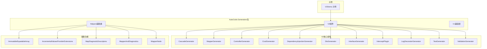
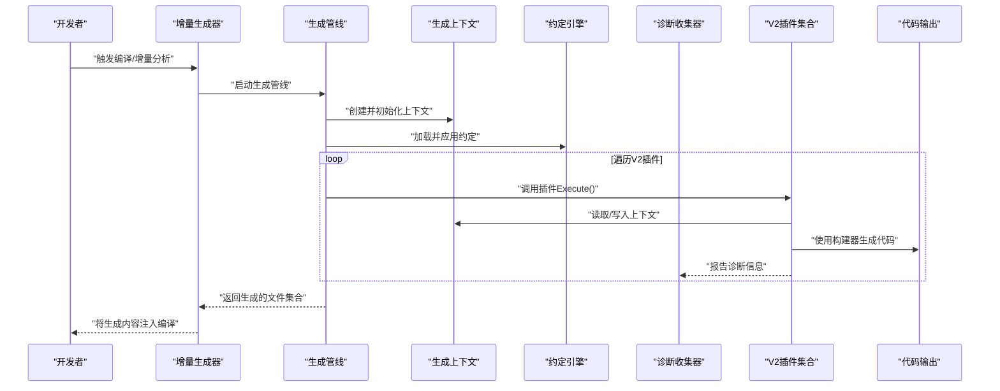
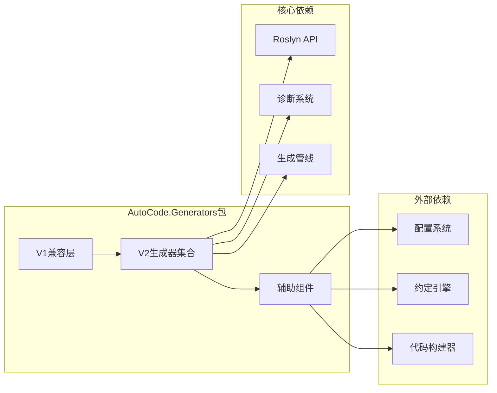

# V2插件架构

<cite>
**本文引用的文件**   
- [AutoCode.Generators.csproj](file://src/AutoCode.Generators/AutoCode.Generators.csproj)
- [CascadeGenerator.cs](file://src/AutoCode.Generators/V2/CascadeGenerator.cs)
- [MapperGenerator.cs](file://src/AutoCode.Generators/V2/MapperGenerator.cs)
- [ControllerGenerator.cs](file://src/AutoCode.Generators/V2/ControllerGenerator.cs)
- [CrudGenerator.cs](file://src/AutoCode.Generators/V2/CrudGenerator.cs)
- [DependencyInjectionGenerator.cs](file://src/AutoCode.Generators/V2/DependencyInjectionGenerator.cs)
- [DtoGenerator.cs](file://src/AutoCode.Generators/V2/DtoGenerator.cs)
- [InterceptPlugin.cs](file://src/AutoCode.Generators/V2/InterceptPlugin.cs)
- [InterfaceGenerator.cs](file://src/AutoCode.Generators/V2/InterfaceGenerator.cs)
- [LogDecoratorGenerator.cs](file://src/AutoCode.Generators/V2/LogDecoratorGenerator.cs)
- [TestGenerator.cs](file://src/AutoCode.Generators/V2/TestGenerator.cs)
- [ValidationGenerator.cs](file://src/AutoCode.Generators/V2/ValidationGenerator.cs)
- [Program.cs](file://src/Samples/V2Demo/Program.cs)
- [Models.cs](file://src/Samples/V2Demo/Models.cs)
- [V2Demo.csproj](file://src/Samples/V2Demo/V2Demo.csproj)
</cite>

## 更新摘要
**所做更改**   
- 更新了项目结构部分以反映AutoCode.Generators包的统一整合
- 新增了V2组件的详细分析，包括CascadeGenerator和MapperGenerator等新组件
- 更新了架构图以展示新的包结构和组件关系
- 增强了插件生命周期和执行流程的说明
- 添加了新组件的功能特性和使用方式

## 目录
1. [简介](#简介)
2. [项目结构](#项目结构)
3. [核心组件](#核心组件)
4. [架构总览](#架构总览)
5. [详细组件分析](#详细组件分析)
6. [依赖关系分析](#依赖关系分析)
7. [性能考量](#性能考量)
8. [故障排查指南](#故障排查指南)
9. [结论](#结论)
10. [附录](#附录)

## 简介
本文档系统化阐述 AutoCode 的 V2 插件架构，该架构已整合到统一的 AutoCode.Generators 包中。V2 版本引入了 CascadeGenerator、MapperGenerator 等新组件，提供了更强大的代码生成能力和更好的扩展性。读者将了解：
- V2 插件架构的统一包结构设计
- 新组件的功能特性与使用方法
- 插件发现、加载与执行的完整流程
- 增量源生成器的工作原理
- 代码构建器的类型化 API 设计

## 项目结构
V2 插件架构的核心位于 AutoCode.Generators 包中，采用统一的包管理方式，包含所有 V2 版本的生成器组件。Samples/V2Demo 提供最小可运行示例。

**图表来源**
- [AutoCode.Generators.csproj](file://src/AutoCode.Generators/AutoCode.Generators.csproj)
- [CascadeGenerator.cs](file://src/AutoCode.Generators/V2/CascadeGenerator.cs)
- [MapperGenerator.cs](file://src/AutoCode.Generators/V2/MapperGenerator.cs)
- [ControllerGenerator.cs](file://src/AutoCode.Generators/V2/ControllerGenerator.cs)
- [Program.cs](file://src/Samples/V2Demo/Program.cs)

**章节来源**
- [AutoCode.Generators.csproj](file://src/AutoCode.Generators/AutoCode.Generators.csproj)
- [V2Demo.csproj](file://src/Samples/V2Demo/V2Demo.csproj)

## 核心组件
V2 插件架构的核心组件包括：

### 新增组件
- **CascadeGenerator**：级联生成器，支持复杂的依赖关系处理
- **MapperGenerator**：映射生成器，提供对象映射代码自动生成
- **InterceptPlugin**：拦截插件，实现AOP拦截功能

### 现有组件增强
- **ControllerGenerator**：控制器生成器，增强Web API支持
- **CrudGenerator**：CRUD操作生成器，简化数据访问层开发
- **DependencyInjectionGenerator**：依赖注入生成器，自动注册服务
- **DtoGenerator**：DTO生成器，数据传输对象自动化
- **InterfaceGenerator**：接口生成器，基于约定生成接口
- **LogDecoratorGenerator**：日志装饰器生成器
- **TestGenerator**：测试生成器，自动生成单元测试
- **ValidationGenerator**：验证生成器，数据验证逻辑自动化

**章节来源**
- [CascadeGenerator.cs](file://src/AutoCode.Generators/V2/CascadeGenerator.cs)
- [MapperGenerator.cs](file://src/AutoCode.Generators/V2/MapperGenerator.cs)
- [ControllerGenerator.cs](file://src/AutoCode.Generators/V2/ControllerGenerator.cs)
- [CrudGenerator.cs](file://src/AutoCode.Generators/V2/CrudGenerator.cs)
- [DependencyInjectionGenerator.cs](file://src/AutoCode.Generators/V2/DependencyInjectionGenerator.cs)
- [DtoGenerator.cs](file://src/AutoCode.Generators/V2/DtoGenerator.cs)
- [InterfaceGenerator.cs](file://src/AutoCode.Generators/V2/InterfaceGenerator.cs)
- [InterceptPlugin.cs](file://src/AutoCode.Generators/V2/InterceptPlugin.cs)
- [LogDecoratorGenerator.cs](file://src/AutoCode.Generators/V2/LogDecoratorGenerator.cs)
- [TestGenerator.cs](file://src/AutoCode.Generators/V2/TestGenerator.cs)
- [ValidationGenerator.cs](file://src/AutoCode.Generators/V2/ValidationGenerator.cs)

## 架构总览
下图展示了 V2 插件架构的整体工作流程，从增量生成器到各个插件的执行过程。

**图表来源**
- [CascadeGenerator.cs](file://src/AutoCode.Generators/V2/CascadeGenerator.cs)
- [MapperGenerator.cs](file://src/AutoCode.Generators/V2/MapperGenerator.cs)
- [ControllerGenerator.cs](file://src/AutoCode.Generators/V2/ControllerGenerator.cs)

## 详细组件分析

### CascadeGenerator（级联生成器）
CascadeGenerator 是 V2 版本新增的核心组件，专门处理复杂的依赖关系和级联生成场景。

**主要特性：**
- 支持多层级的依赖解析
- 自动处理循环依赖检测
- 提供级联生成的配置选项
- 集成诊断系统，提供详细的错误信息

**使用场景：**
- 复杂业务对象的级联生成
- 微服务间的依赖管理
- 动态代理链的构建

**章节来源**
- [CascadeGenerator.cs](file://src/AutoCode.Generators/V2/CascadeGenerator.cs)

### MapperGenerator（映射生成器）
MapperGenerator 提供强大的对象映射功能，自动生成类型安全的映射代码。

**主要特性：**
- 支持复杂对象结构的映射
- 自动处理属性名称匹配策略
- 提供自定义映射规则支持
- 集成性能优化机制

**配置选项：**
- 命名策略配置
- 忽略成员配置
- 自定义映射函数支持

**章节来源**
- [MapperGenerator.cs](file://src/AutoCode.Generators/V2/MapperGenerator.cs)

### InterceptPlugin（拦截插件）
InterceptPlugin 实现了 AOP 拦截功能，为方法调用提供横切关注点支持。

**主要特性：**
- 支持多种拦截模式
- 提供拦截器链管理机制
- 集成异常处理和日志记录
- 支持异步方法拦截

**章节来源**
- [InterceptPlugin.cs](file://src/AutoCode.Generators/V2/InterceptPlugin.cs)

### 其他V2组件
#### ControllerGenerator
增强的 Web API 控制器生成器，支持更多属性和配置选项。

#### CrudGenerator
简化的 CRUD 操作生成器，支持数据库操作的自动化。

#### DependencyInjectionGenerator
智能的依赖注入容器配置生成器。

#### DtoGenerator
数据传输对象的智能生成器，支持复杂类型映射。

#### InterfaceGenerator
基于约定的接口生成器，支持多种生成策略。

#### LogDecoratorGenerator
日志装饰器生成器，为方法调用添加日志功能。

#### TestGenerator
单元测试生成器，自动生成测试用例。

#### ValidationGenerator
数据验证生成器，提供完整的验证逻辑。

**章节来源**
- [ControllerGenerator.cs](file://src/AutoCode.Generators/V2/ControllerGenerator.cs)
- [CrudGenerator.cs](file://src/AutoCode.Generators/V2/CrudGenerator.cs)
- [DependencyInjectionGenerator.cs](file://src/AutoCode.Generators/V2/DependencyInjectionGenerator.cs)
- [DtoGenerator.cs](file://src/AutoCode.Generators/V2/DtoGenerator.cs)
- [InterfaceGenerator.cs](file://src/AutoCode.Generators/V2/InterfaceGenerator.cs)
- [LogDecoratorGenerator.cs](file://src/AutoCode.Generators/V2/LogDecoratorGenerator.cs)
- [TestGenerator.cs](file://src/AutoCode.Generators/V2/TestGenerator.cs)
- [ValidationGenerator.cs](file://src/AutoCode.Generators/V2/ValidationGenerator.cs)

### 辅助组件
V2 版本还包含多个辅助组件，提升整体性能和可维护性：

- **ImmutableEquatableArray**：不可变相等数组，用于高性能集合操作
- **IncrementalValuesProviderExtensions**：增量值提供者扩展
- **MapDiagnosticDescriptors**：映射诊断描述符
- **MapperAndDiagnostics**：映射器和诊断工具
- **MapperNode**：映射节点数据结构

**章节来源**
- [ImmutableEquatableArray.cs](file://src/AutoCode.Generators/Helpers/ImmutableEquatableArray.cs)
- [IncrementalValuesProviderExtensions.cs](file://src/AutoCode.Generators/Helpers/IncrementalValuesProviderExtensions.cs)
- [MapDiagnosticDescriptors.cs](file://src/AutoCode.Generators/Helpers/MapDiagnosticDescriptors.cs)
- [MapperAndDiagnostics.cs](file://src/AutoCode.Generators/Helpers/MapperAndDiagnostics.cs)
- [MapperNode.cs](file://src/AutoCode.Generators/Helpers/MapperNode.cs)

## 依赖关系分析
V2 插件架构采用松耦合设计，各组件间通过清晰的接口进行通信。

**图表来源**
- [AutoCode.Generators.csproj](file://src/AutoCode.Generators/AutoCode.Generators.csproj)
- [CascadeGenerator.cs](file://src/AutoCode.Generators/V2/CascadeGenerator.cs)
- [MapperGenerator.cs](file://src/AutoCode.Generators/V2/MapperGenerator.cs)

**章节来源**
- [AutoCode.Generators.csproj](file://src/AutoCode.Generators/AutoCode.Generators.csproj)

## 性能考量
V2 插件架构在性能方面进行了多项优化：

### 增量计算优化
- 仅在相关语法变化时重新生成
- 使用增量值提供者减少不必要的计算
- 缓存中间结果避免重复工作

### 内存管理优化
- 不可变数据结构的使用
- 高效的集合操作
- 垃圾回收友好的设计

### 并发执行优化
- 插件并行执行支持
- 线程安全的上下文访问
- 资源池化管理

## 故障排查指南
针对 V2 插件架构的常见问题提供排查指导：

### 常见问题
- **插件未生效**：检查插件是否正确注册和启用
- **生成结果为空**：确认上下文模型与约定是否匹配
- **性能问题**：检查是否有循环依赖或过度复杂的映射
- **诊断信息过多**：审查插件中的诊断逻辑与过滤条件

### 排查步骤
1. 启用详细日志（若插件支持）
2. 逐步禁用插件定位问题
3. 检查生成上下文状态与配置项
4. 使用诊断工具分析生成过程

### 调试技巧
- 使用 Visual Studio 的诊断工具
- 启用增量生成器的详细日志
- 检查生成的中间文件
- 使用性能分析工具定位瓶颈

**章节来源**
- [CascadeGenerator.cs](file://src/AutoCode.Generators/V2/CascadeGenerator.cs)
- [MapperGenerator.cs](file://src/AutoCode.Generators/V2/MapperGenerator.cs)
- [InterceptPlugin.cs](file://src/AutoCode.Generators/V2/InterceptPlugin.cs)

## 结论
V2 插件架构通过统一的 AutoCode.Generators 包设计，实现了更加模块化、高性能的代码生成体系。新增的 CascadeGenerator、MapperGenerator 等组件显著增强了系统的功能性和可扩展性。通过清晰的职责划分、松耦合设计和完善的诊断系统，V2 架构既保证了生成质量，又提升了开发体验。

## 附录
### 术语表
- **增量生成器**：基于 Roslyn 的源码生成机制，支持增量分析
- **插件**：实现统一接口的代码生成单元
- **约定**：统一的命名、可见性与映射策略
- **诊断**：分析阶段的警告、错误与建议信息
- **级联生成**：处理复杂依赖关系的生成模式
- **映射生成**：对象映射代码的自动生成

### 版本对比
- **V1 vs V2**：V2 版本提供了更强大的功能和更好的性能
- **包结构变化**：从分散的包统一到 AutoCode.Generators 包
- **API 兼容性**：保持向后兼容的同时引入新功能

[本节为概念性内容，无需引用具体文件]