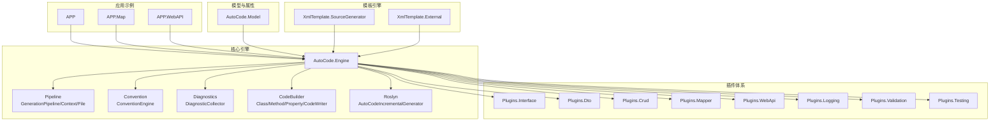
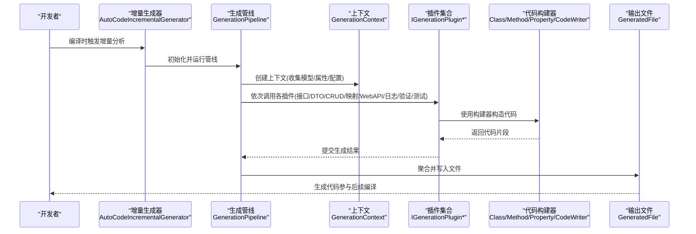
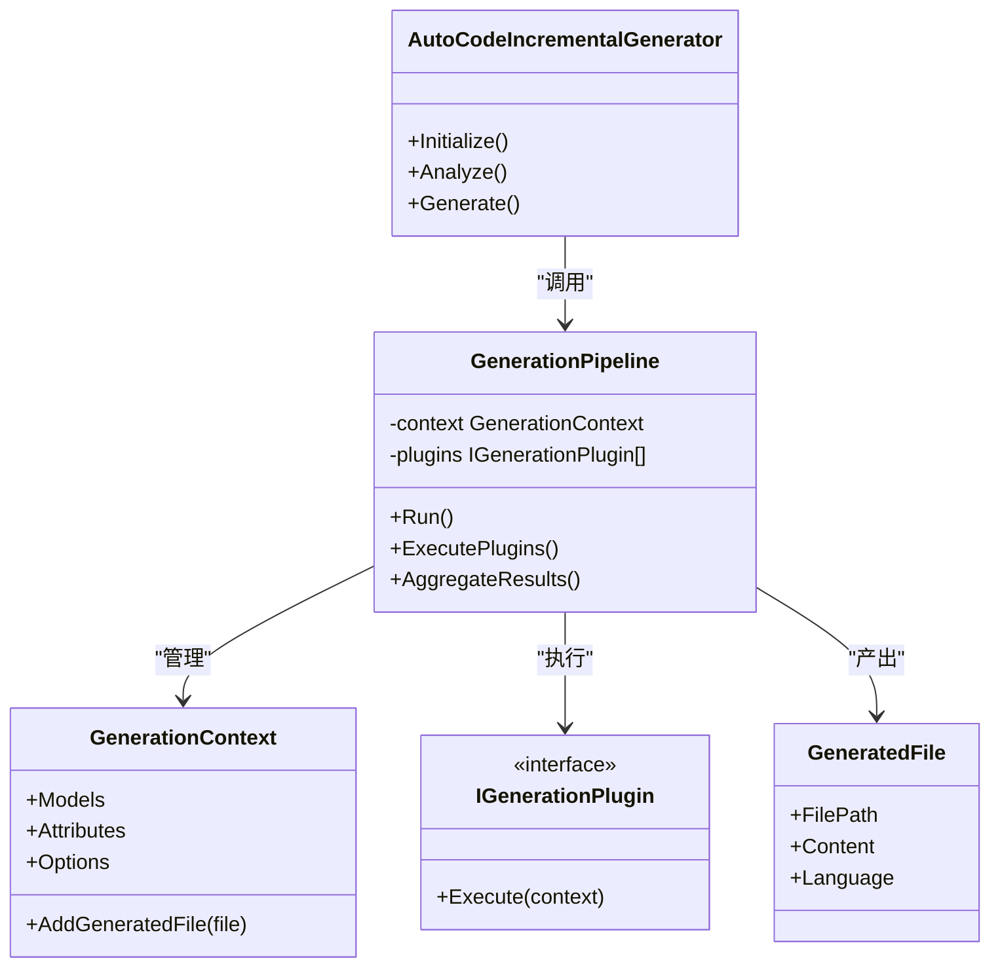
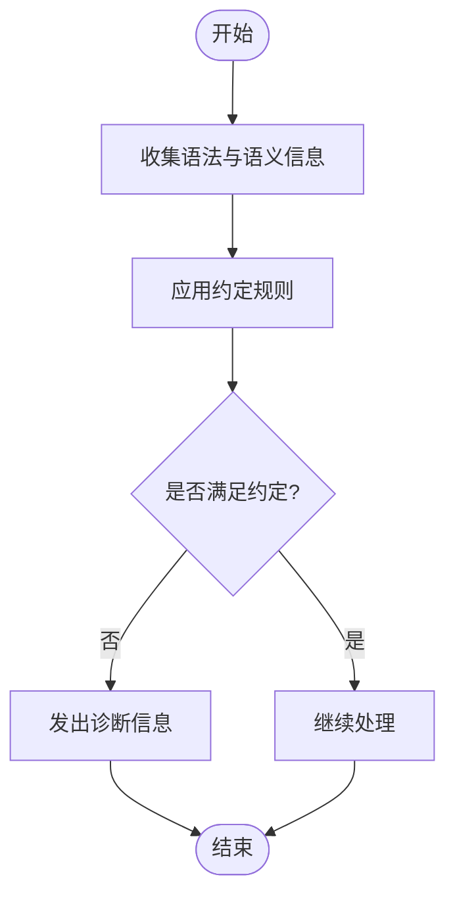
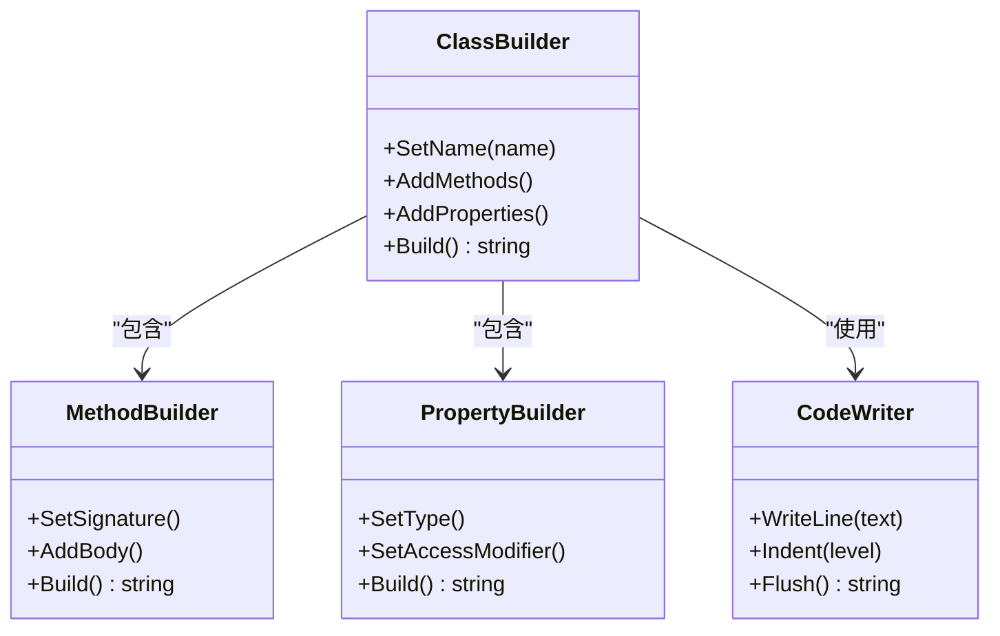
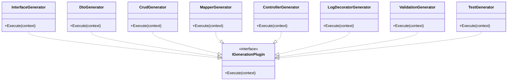
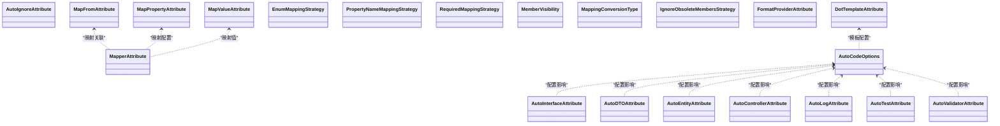
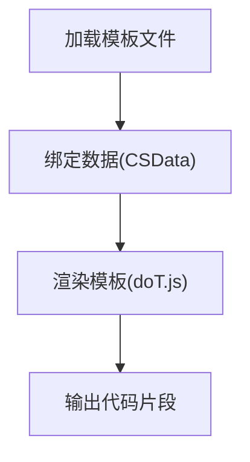
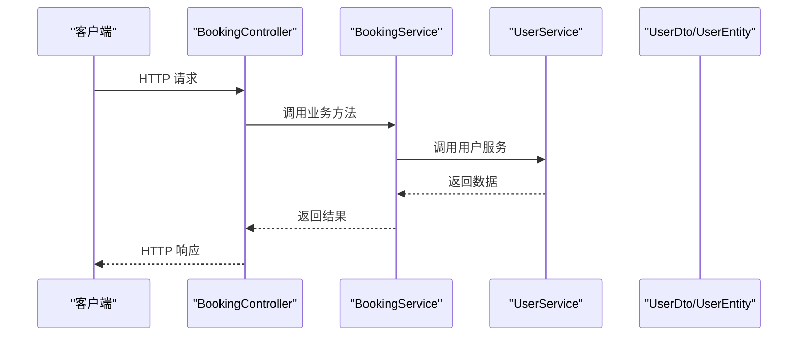
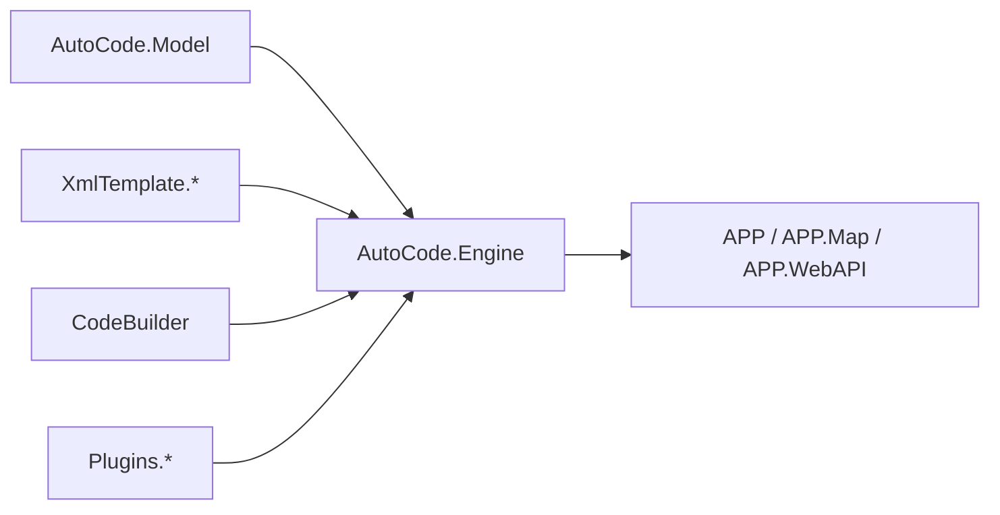

# 代码构建器系统

<cite>
**本文档引用的文件**   
- [README.en.md](file://README.en.md)
- [autocode.json](file://autocode.json)
- [AutoCode.sln](file://AutoCode.sln)
- [Program.cs](file://src/APP/Program.cs)
- [AppCore.cs](file://src/APP.WebAPI.Core/Application/AppCore.cs)
- [DependencyInjectionServiceCollectionExtensions.cs](file://src/APP.WebAPI.Core/DependencyInjection/DependencyInjectionServiceCollectionExtensions.cs)
- [IDependencyBase.cs](file://src/APP.WebAPI.Core/DependencyInjection/LifeType/IDependencyBase.cs)
- [IScoped.cs](file://src/APP.WebAPI.Core/DependencyInjection/LifeType/IScoped.cs)
- [ISingleton.cs](file://src/APP.WebAPI.Core/DependencyInjection/LifeType/ISingleton.cs)
- [ITransient.cs](file://src/APP.WebAPI.Core/DependencyInjection/LifeType/ITransient.cs)
- [AutoCodeIncrementalGenerator.cs](file://src/AutoCode.Engine/Roslyn/AutoCodeIncrementalGenerator.cs)
- [GenerationPipeline.cs](file://src/AutoCode.Engine/Pipeline/GenerationPipeline.cs)
- [GenerationContext.cs](file://src/AutoCode.Engine/Pipeline/GenerationContext.cs)
- [GeneratedFile.cs](file://src/AutoCode.Engine/Pipeline/GeneratedFile.cs)
- [ConventionEngine.cs](file://src/AutoCode.Engine/Convention/ConventionEngine.cs)
- [DiagnosticCollector.cs](file://src/AutoCode.Engine/Diagnostics/DiagnosticCollector.cs)
- [IGenerationPlugin.cs](file://src/AutoCode.Engine/Plugin/IGenerationPlugin.cs)
- [ClassBuilder.cs](file://src/AutoCode.Engine/CodeBuilder/ClassBuilder.cs)
- [MethodBuilder.cs](file://src/AutoCode.Engine/CodeBuilder/MethodBuilder.cs)
- [PropertyBuilder.cs](file://src/AutoCode.Engine/CodeBuilder/PropertyBuilder.cs)
- [CodeWriter.cs](file://src/AutoCode.Engine/CodeBuilder/CodeWriter.cs)
- [AutoCodeConfig.cs](file://src/AutoCode.Engine/Config/AutoCodeConfig.cs)
- [InterfaceGenerator.cs](file://src/AutoCode.Plugins.Interface/InterfaceGenerator.cs)
- [DtoGenerator.cs](file://src/AutoCode.Plugins.Dto/DtoGenerator.cs)
- [CrudGenerator.cs](file://src/AutoCode.Plugins.Crud/CrudGenerator.cs)
- [MapperGenerator.cs](file://src/AutoCode.Plugins.Mapper/MapperGenerator.cs)
- [ControllerGenerator.cs](file://src/AutoCode.Plugins.WebApi/ControllerGenerator.cs)
- [LogDecoratorGenerator.cs](file://src/AutoCode.Plugins.Logging/LogDecoratorGenerator.cs)
- [ValidationGenerator.cs](file://src/AutoCode.Plugins.Validation/ValidationGenerator.cs)
- [TestGenerator.cs](file://src/AutoCode.Plugins.Testing/TestGenerator.cs)
- [AutoInterfaceAttribute.cs](file://src/AutoCode.Model/InterfaceAttribute/AutoInterfaceAttribute.cs)
- [AutoIgnoreAttribute.cs](file://src/AutoCode.Model/InterfaceAttribute/AutoIgnoreAttribute.cs)
- [AutoDTOAttribute.cs](file://src/AutoCode.Model/AutoDTOAttribute.cs)
- [AutoEntityAttribute.cs](file://src/AutoCode.Model/AutoEntityAttribute.cs)
- [AutoControllerAttribute.cs](file://src/AutoCode.Model/AutoControllerAttribute.cs)
- [AutoLogAttribute.cs](file://src/AutoCode.Model/AutoLogAttribute.cs)
- [AutoTestAttribute.cs](file://src/AutoCode.Model/AutoTestAttribute.cs)
- [AutoValidatorAttribute.cs](file://src/AutoCode.Model/AutoValidatorAttribute.cs)
- [AutoCodeOptions.cs](file://src/AutoCode.Model/AutoCodeOptions.cs)
- [MapFromAttribute.cs](file://src/AutoCode.Model/MapFromAttribute.cs)
- [MapperAttribute.cs](file://src/AutoCode.Model/AutoMapperModel/MapperAttribute.cs)
- [MapPropertyAttribute.cs](file://src/AutoCode.Model/AutoMapperModel/MapPropertyAttribute.cs)
- [MapValueAttribute.cs](file://src/AutoCode.Model/AutoMapperModel/MapValueAttribute.cs)
- [EnumMappingStrategy.cs](file://src/AutoCode.Model/AutoMapperModel/EnumMappingStrategy.cs)
- [PropertyNameMappingStrategy.cs](file://src/AutoCode.Model/AutoMapperModel/PropertyNameMappingStrategy.cs)
- [RequiredMappingStrategy.cs](file://src/AutoCode.Model/AutoMapperModel/RequiredMappingStrategy.cs)
- [MemberVisibility.cs](file://src/AutoCode.Model/AutoMapperModel/MemberVisibility.cs)
- [MappingConversionType.cs](file://src/AutoCode.Model/AutoMapperModel/MappingConversionType.cs)
- [IgnoreObsoleteMembersStrategy.cs](file://src/AutoCode.Model/AutoMapperModel/IgnoreObsoleteMembersStrategy.cs)
- [FormatProviderAttribute.cs](file://src/AutoCode.Model/AutoMapperModel/FormatProviderAttribute.cs)
- [DotTemplateAttribute.cs](file://src/AutoCode.Model/DotFileAttribute/DotTemplateAttribute.cs)
- [AutoCode.DotTemplate.SourceGenerator.csproj](file://src/AutoCode.XmlTemplate.SourceGenerator/AutoCode.DotTemplate.SourceGenerator.csproj)
- [DotTemplateGenerator.cs](file://src/AutoCode.XmlTemplate.SourceGenerator/DotTemplateGenerator.cs)
- [CSData.cs](file://src/AutoCode.XmlTemplate.SourceGenerator/CSData.cs)
- [SyntaxNodeConvert.cs](file://src/AutoCode.XmlTemplate.SourceGenerator/SyntaxNodeConvert.cs)
- [doT.js](file://src/AutoCode.XmlTemplate.External/doT.js)
- [DotHelp.cs](file://src/AutoCode.XmlTemplate.External/DotHelp.cs)
- [JsonHelp.cs](file://src/AutoCode.XmlTemplate.External/JsonHelp.cs)
- [AutoTemplate.cs](file://src/DotTemplate.APP/AutoTemplate.cs)
- [DotTemplate.cs](file://src/DotTemplate.APP/DotTemplate.cs)
- [IAutoTemplate.cs](file://src/DotTemplate.APP/IAutoTemplate.cs)
- [Program.cs](file://src/DotTemplate.APP/Program.cs)
- [Behavior.cs](file://src/Auto.MapModels/Behavior.cs)
- [UserInfo.cs](file://src/APP.Map/UserInfo.cs)
- [Program.cs](file://src/APP.Map/Program.cs)
- [BookingController.cs](file://src/APP.WebAPI/Controllers/BookingController.cs)
- [UserService.cs](file://src/APP.WebAPI/Services/UserService.cs)
- [BookingService.cs](file://src/APP.WebAPI/Services/BookingService.cs)
- [UserDto.cs](file://src/APP.WebAPI/Models/UserDto.cs)
- [UserEntity.cs](file://src/APP.WebAPI/Models/UserEntity.cs)
- [Requests.cs](file://src/APP.WebAPI/Models/Requests.cs)
- [WeatherForecast.cs](file://src/APP.WebAPI/WeatherForecast.cs)
- [appsettings.json](file://src/APP.WebAPI/appsettings.json)
- [launchSettings.json](file://src/APP.WebAPI/Properties/launchSettings.json)
- [ci.yml](file://.github/workflows/ci.yml)
</cite>

## 目录
1. [简介](#简介)
2. [项目结构](#项目结构)
3. [核心组件](#核心组件)
4. [架构总览](#架构总览)
5. [详细组件分析](#详细组件分析)
6. [依赖关系分析](#依赖关系分析)
7. [性能考虑](#性能考虑)
8. [故障排查指南](#故障排查指南)
9. [结论](#结论)
10. [附录](#附录)

## 简介
本仓库是一个面向 .NET 的代码构建器与源码生成系统，基于 Roslyn 增量生成器与插件化架构，提供从模型标注到接口、DTO、CRUD、映射、控制器、日志装饰器、验证与测试等全链路代码自动生成能力。系统通过约定驱动（Convention）与属性标注（Attributes）协同工作，结合模板引擎（dotTemplate）实现高度可定制的代码输出，并通过统一的管道（Pipeline）组织生成流程。

## 项目结构
整体采用分层与按功能域划分相结合的组织方式：
- 应用层示例：APP、APP.Map、APP.WebAPI
- 核心引擎：AutoCode.Engine（Roslyn 增量生成、管道、约定、诊断、代码构建器）
- 插件体系：AutoCode.Plugins.*（各生成器插件）
- 模型与属性：AutoCode.Model（标注属性、选项、映射策略）
- 模板引擎：AutoCode.XmlTemplate.SourceGenerator 与 AutoCode.XmlTemplate.External
- CLI 与扩展：AutoCode.Cli、AutoCode.Extensions.SourceGenerator
- 测试与示例：AutoCode.Tests、AutoCode.Tests.V2、Samples/V2Demo

图表来源
- [AutoCode.sln](file://AutoCode.sln)
- [AutoCodeIncrementalGenerator.cs](file://src/AutoCode.Engine/Roslyn/AutoCodeIncrementalGenerator.cs)
- [GenerationPipeline.cs](file://src/AutoCode.Engine/Pipeline/GenerationPipeline.cs)
- [ConventionEngine.cs](file://src/AutoCode.Engine/Convention/ConventionEngine.cs)
- [DiagnosticCollector.cs](file://src/AutoCode.Engine/Diagnostics/DiagnosticCollector.cs)
- [ClassBuilder.cs](file://src/AutoCode.Engine/CodeBuilder/ClassBuilder.cs)
- [InterfaceGenerator.cs](file://src/AutoCode.Plugins.Interface/InterfaceGenerator.cs)
- [DtoGenerator.cs](file://src/AutoCode.Plugins.Dto/DtoGenerator.cs)
- [CrudGenerator.cs](file://src/AutoCode.Plugins.Crud/CrudGenerator.cs)
- [MapperGenerator.cs](file://src/AutoCode.Plugins.Mapper/MapperGenerator.cs)
- [ControllerGenerator.cs](file://src/AutoCode.Plugins.WebApi/ControllerGenerator.cs)
- [LogDecoratorGenerator.cs](file://src/AutoCode.Plugins.Logging/LogDecoratorGenerator.cs)
- [ValidationGenerator.cs](file://src/AutoCode.Plugins.Validation/ValidationGenerator.cs)
- [TestGenerator.cs](file://src/AutoCode.Plugins.Testing/TestGenerator.cs)
- [AutoCode.DotTemplate.SourceGenerator.csproj](file://src/AutoCode.XmlTemplate.SourceGenerator/AutoCode.DotTemplate.SourceGenerator.csproj)
- [doT.js](file://src/AutoCode.XmlTemplate.External/doT.js)

章节来源
- [AutoCode.sln](file://AutoCode.sln)
- [README.en.md](file://README.en.md)

## 核心组件
- 增量生成器入口：负责收集语法树与源文本，触发增量分析并启动生成管线。
- 生成管线：统一编排上下文、插件执行顺序与结果聚合。
- 约定引擎：解析命名约定与规则，辅助插件决策。
- 诊断收集器：汇总与分析过程中的诊断信息。
- 代码构建器：以对象化的方式构造类、方法、属性与代码片段。
- 插件体系：按职责划分的生成器，如接口、DTO、CRUD、映射、Web API、日志、验证、测试。
- 模型与属性：定义标注属性与配置选项，驱动生成行为。
- 模板引擎：支持 dot 模板与外部脚本，增强代码生成的灵活性。

章节来源
- [AutoCodeIncrementalGenerator.cs](file://src/AutoCode.Engine/Roslyn/AutoCodeIncrementalGenerator.cs)
- [GenerationPipeline.cs](file://src/AutoCode.Engine/Pipeline/GenerationPipeline.cs)
- [ConventionEngine.cs](file://src/AutoCode.Engine/Convention/ConventionEngine.cs)
- [DiagnosticCollector.cs](file://src/AutoCode.Engine/Diagnostics/DiagnosticCollector.cs)
- [ClassBuilder.cs](file://src/AutoCode.Engine/CodeBuilder/ClassBuilder.cs)
- [MethodBuilder.cs](file://src/AutoCode.Engine/CodeBuilder/MethodBuilder.cs)
- [PropertyBuilder.cs](file://src/AutoCode.Engine/CodeBuilder/PropertyBuilder.cs)
- [CodeWriter.cs](file://src/AutoCode.Engine/CodeBuilder/CodeWriter.cs)
- [AutoCodeConfig.cs](file://src/AutoCode.Engine/Config/AutoCodeConfig.cs)
- [AutoCodeOptions.cs](file://src/AutoCode.Model/AutoCodeOptions.cs)

## 架构总览
系统以 Roslyn 增量生成器为入口，通过生成管线协调多个插件完成代码生成；约定引擎与诊断收集器贯穿整个流程；代码构建器提供稳定的代码构造能力；模板引擎用于复杂场景的定制化输出。

图表来源
- [AutoCodeIncrementalGenerator.cs](file://src/AutoCode.Engine/Roslyn/AutoCodeIncrementalGenerator.cs)
- [GenerationPipeline.cs](file://src/AutoCode.Engine/Pipeline/GenerationPipeline.cs)
- [GenerationContext.cs](file://src/AutoCode.Engine/Pipeline/GenerationContext.cs)
- [GeneratedFile.cs](file://src/AutoCode.Engine/Pipeline/GeneratedFile.cs)
- [IGenerationPlugin.cs](file://src/AutoCode.Engine/Plugin/IGenerationPlugin.cs)
- [ClassBuilder.cs](file://src/AutoCode.Engine/CodeBuilder/ClassBuilder.cs)
- [MethodBuilder.cs](file://src/AutoCode.Engine/CodeBuilder/MethodBuilder.cs)
- [PropertyBuilder.cs](file://src/AutoCode.Engine/CodeBuilder/PropertyBuilder.cs)
- [CodeWriter.cs](file://src/AutoCode.Engine/CodeBuilder/CodeWriter.cs)

## 详细组件分析

### 增量生成器与管线
- 增量生成器负责在编译期扫描语法树，识别标注属性与模型，并将任务委派给管线。
- 管线维护上下文，按顺序执行插件，聚合生成结果，最终输出文件。

图表来源
- [AutoCodeIncrementalGenerator.cs](file://src/AutoCode.Engine/Roslyn/AutoCodeIncrementalGenerator.cs)
- [GenerationPipeline.cs](file://src/AutoCode.Engine/Pipeline/GenerationPipeline.cs)
- [GenerationContext.cs](file://src/AutoCode.Engine/Pipeline/GenerationContext.cs)
- [GeneratedFile.cs](file://src/AutoCode.Engine/Pipeline/GeneratedFile.cs)
- [IGenerationPlugin.cs](file://src/AutoCode.Engine/Plugin/IGenerationPlugin.cs)

章节来源
- [AutoCodeIncrementalGenerator.cs](file://src/AutoCode.Engine/Roslyn/AutoCodeIncrementalGenerator.cs)
- [GenerationPipeline.cs](file://src/AutoCode.Engine/Pipeline/GenerationPipeline.cs)
- [GenerationContext.cs](file://src/AutoCode.Engine/Pipeline/GenerationContext.cs)
- [GeneratedFile.cs](file://src/AutoCode.Engine/Pipeline/GeneratedFile.cs)

### 约定引擎与诊断收集器
- 约定引擎解析命名规范与规则，辅助插件进行智能推断与校验。
- 诊断收集器汇总错误、警告与建议，便于开发阶段快速定位问题。

图表来源
- [ConventionEngine.cs](file://src/AutoCode.Engine/Convention/ConventionEngine.cs)
- [DiagnosticCollector.cs](file://src/AutoCode.Engine/Diagnostics/DiagnosticCollector.cs)

章节来源
- [ConventionEngine.cs](file://src/AutoCode.Engine/Convention/ConventionEngine.cs)
- [DiagnosticCollector.cs](file://src/AutoCode.Engine/Diagnostics/DiagnosticCollector.cs)

### 代码构建器
- 提供对象化的类、方法、属性构建能力，封装代码片段生成细节，提升一致性与可读性。

图表来源
- [ClassBuilder.cs](file://src/AutoCode.Engine/CodeBuilder/ClassBuilder.cs)
- [MethodBuilder.cs](file://src/AutoCode.Engine/CodeBuilder/MethodBuilder.cs)
- [PropertyBuilder.cs](file://src/AutoCode.Engine/CodeBuilder/PropertyBuilder.cs)
- [CodeWriter.cs](file://src/AutoCode.Engine/CodeBuilder/CodeWriter.cs)

章节来源
- [ClassBuilder.cs](file://src/AutoCode.Engine/CodeBuilder/ClassBuilder.cs)
- [MethodBuilder.cs](file://src/AutoCode.Engine/CodeBuilder/MethodBuilder.cs)
- [PropertyBuilder.cs](file://src/AutoCode.Engine/CodeBuilder/PropertyBuilder.cs)
- [CodeWriter.cs](file://src/AutoCode.Engine/CodeBuilder/CodeWriter.cs)

### 插件体系（接口、DTO、CRUD、映射、Web API、日志、验证、测试）
- 每个插件聚焦单一职责，通过统一接口接入管线，读取上下文中的模型与属性，使用构建器生成目标代码。
- 典型插件包括：
  - 接口生成器：根据实体或 DTO 生成对应接口
  - DTO 生成器：从实体或领域模型生成数据传输对象
  - CRUD 生成器：生成基础增删改查逻辑
  - 映射生成器：生成类型间映射代码
  - Web API 控制器生成器：生成 RESTful 控制器
  - 日志装饰器生成器：注入日志记录逻辑
  - 验证生成器：生成数据验证逻辑
  - 测试生成器：生成单元测试骨架

图表来源
- [InterfaceGenerator.cs](file://src/AutoCode.Plugins.Interface/InterfaceGenerator.cs)
- [DtoGenerator.cs](file://src/AutoCode.Plugins.Dto/DtoGenerator.cs)
- [CrudGenerator.cs](file://src/AutoCode.Plugins.Crud/CrudGenerator.cs)
- [MapperGenerator.cs](file://src/AutoCode.Plugins.Mapper/MapperGenerator.cs)
- [ControllerGenerator.cs](file://src/AutoCode.Plugins.WebApi/ControllerGenerator.cs)
- [LogDecoratorGenerator.cs](file://src/AutoCode.Plugins.Logging/LogDecoratorGenerator.cs)
- [ValidationGenerator.cs](file://src/AutoCode.Plugins.Validation/ValidationGenerator.cs)
- [TestGenerator.cs](file://src/AutoCode.Plugins.Testing/TestGenerator.cs)
- [IGenerationPlugin.cs](file://src/AutoCode.Engine/Plugin/IGenerationPlugin.cs)

章节来源
- [InterfaceGenerator.cs](file://src/AutoCode.Plugins.Interface/InterfaceGenerator.cs)
- [DtoGenerator.cs](file://src/AutoCode.Plugins.Dto/DtoGenerator.cs)
- [CrudGenerator.cs](file://src/AutoCode.Plugins.Crud/CrudGenerator.cs)
- [MapperGenerator.cs](file://src/AutoCode.Plugins.Mapper/MapperGenerator.cs)
- [ControllerGenerator.cs](file://src/AutoCode.Plugins.WebApi/ControllerGenerator.cs)
- [LogDecoratorGenerator.cs](file://src/AutoCode.Plugins.Logging/LogDecoratorGenerator.cs)
- [ValidationGenerator.cs](file://src/AutoCode.Plugins.Validation/ValidationGenerator.cs)
- [TestGenerator.cs](file://src/AutoCode.Plugins.Testing/TestGenerator.cs)

### 模型与属性（标注与配置）
- 通过属性标注驱动生成行为，例如 AutoInterface、AutoDTO、AutoEntity、AutoController、AutoLog、AutoTest、AutoValidator。
- 映射相关属性与策略：MapperAttribute、MapPropertyAttribute、MapValueAttribute、枚举映射策略、属性名映射策略、必需映射策略、成员可见性、转换类型、忽略过时成员、格式化提供者。
- 模板属性：DotTemplateAttribute 用于指定模板文件。

图表来源
- [AutoInterfaceAttribute.cs](file://src/AutoCode.Model/InterfaceAttribute/AutoInterfaceAttribute.cs)
- [AutoIgnoreAttribute.cs](file://src/AutoCode.Model/InterfaceAttribute/AutoIgnoreAttribute.cs)
- [AutoDTOAttribute.cs](file://src/AutoCode.Model/AutoDTOAttribute.cs)
- [AutoEntityAttribute.cs](file://src/AutoCode.Model/AutoEntityAttribute.cs)
- [AutoControllerAttribute.cs](file://src/AutoCode.Model/AutoControllerAttribute.cs)
- [AutoLogAttribute.cs](file://src/AutoCode.Model/AutoLogAttribute.cs)
- [AutoTestAttribute.cs](file://src/AutoCode.Model/AutoTestAttribute.cs)
- [AutoValidatorAttribute.cs](file://src/AutoCode.Model/AutoValidatorAttribute.cs)
- [MapFromAttribute.cs](file://src/AutoCode.Model/MapFromAttribute.cs)
- [MapperAttribute.cs](file://src/AutoCode.Model/AutoMapperModel/MapperAttribute.cs)
- [MapPropertyAttribute.cs](file://src/AutoCode.Model/AutoMapperModel/MapPropertyAttribute.cs)
- [MapValueAttribute.cs](file://src/AutoCode.Model/AutoMapperModel/MapValueAttribute.cs)
- [EnumMappingStrategy.cs](file://src/AutoCode.Model/AutoMapperModel/EnumMappingStrategy.cs)
- [PropertyNameMappingStrategy.cs](file://src/AutoCode.Model/AutoMapperModel/PropertyNameMappingStrategy.cs)
- [RequiredMappingStrategy.cs](file://src/AutoCode.Model/AutoMapperModel/RequiredMappingStrategy.cs)
- [MemberVisibility.cs](file://src/AutoCode.Model/AutoMapperModel/MemberVisibility.cs)
- [MappingConversionType.cs](file://src/AutoCode.Model/AutoMapperModel/MappingConversionType.cs)
- [IgnoreObsoleteMembersStrategy.cs](file://src/AutoCode.Model/AutoMapperModel/IgnoreObsoleteMembersStrategy.cs)
- [FormatProviderAttribute.cs](file://src/AutoCode.Model/AutoMapperModel/FormatProviderAttribute.cs)
- [DotTemplateAttribute.cs](file://src/AutoCode.Model/DotFileAttribute/DotTemplateAttribute.cs)
- [AutoCodeOptions.cs](file://src/AutoCode.Model/AutoCodeOptions.cs)

章节来源
- [AutoInterfaceAttribute.cs](file://src/AutoCode.Model/InterfaceAttribute/AutoInterfaceAttribute.cs)
- [AutoDTOAttribute.cs](file://src/AutoCode.Model/AutoDTOAttribute.cs)
- [AutoEntityAttribute.cs](file://src/AutoCode.Model/AutoEntityAttribute.cs)
- [AutoControllerAttribute.cs](file://src/AutoCode.Model/AutoControllerAttribute.cs)
- [AutoLogAttribute.cs](file://src/AutoCode.Model/AutoLogAttribute.cs)
- [AutoTestAttribute.cs](file://src/AutoCode.Model/AutoTestAttribute.cs)
- [AutoValidatorAttribute.cs](file://src/AutoCode.Model/AutoValidatorAttribute.cs)
- [MapFromAttribute.cs](file://src/AutoCode.Model/MapFromAttribute.cs)
- [MapperAttribute.cs](file://src/AutoCode.Model/AutoMapperModel/MapperAttribute.cs)
- [MapPropertyAttribute.cs](file://src/AutoCode.Model/AutoMapperModel/MapPropertyAttribute.cs)
- [MapValueAttribute.cs](file://src/AutoCode.Model/AutoMapperModel/MapValueAttribute.cs)
- [EnumMappingStrategy.cs](file://src/AutoCode.Model/AutoMapperModel/EnumMappingStrategy.cs)
- [PropertyNameMappingStrategy.cs](file://src/AutoCode.Model/AutoMapperModel/PropertyNameMappingStrategy.cs)
- [RequiredMappingStrategy.cs](file://src/AutoCode.Model/AutoMapperModel/RequiredMappingStrategy.cs)
- [MemberVisibility.cs](file://src/AutoCode.Model/AutoMapperModel/MemberVisibility.cs)
- [MappingConversionType.cs](file://src/AutoCode.Model/AutoMapperModel/MappingConversionType.cs)
- [IgnoreObsoleteMembersStrategy.cs](file://src/AutoCode.Model/AutoMapperModel/IgnoreObsoleteMembersStrategy.cs)
- [FormatProviderAttribute.cs](file://src/AutoCode.Model/AutoMapperModel/FormatProviderAttribute.cs)
- [DotTemplateAttribute.cs](file://src/AutoCode.Model/DotFileAttribute/DotTemplateAttribute.cs)
- [AutoCodeOptions.cs](file://src/AutoCode.Model/AutoCodeOptions.cs)

### 模板引擎（dotTemplate）
- 通过 dot 模板与外部脚本（doT.js）实现灵活的内容生成，适用于复杂代码结构与动态内容。
- 模板生成器负责解析模板、绑定数据、渲染输出。

图表来源
- [AutoCode.DotTemplate.SourceGenerator.csproj](file://src/AutoCode.XmlTemplate.SourceGenerator/AutoCode.DotTemplate.SourceGenerator.csproj)
- [DotTemplateGenerator.cs](file://src/AutoCode.XmlTemplate.SourceGenerator/DotTemplateGenerator.cs)
- [CSData.cs](file://src/AutoCode.XmlTemplate.SourceGenerator/CSData.cs)
- [SyntaxNodeConvert.cs](file://src/AutoCode.XmlTemplate.SourceGenerator/SyntaxNodeConvert.cs)
- [doT.js](file://src/AutoCode.XmlTemplate.External/doT.js)
- [DotHelp.cs](file://src/AutoCode.XmlTemplate.External/DotHelp.cs)
- [JsonHelp.cs](file://src/AutoCode.XmlTemplate.External/JsonHelp.cs)
- [AutoTemplate.cs](file://src/DotTemplate.APP/AutoTemplate.cs)
- [DotTemplate.cs](file://src/DotTemplate.APP/DotTemplate.cs)
- [IAutoTemplate.cs](file://src/DotTemplate.APP/IAutoTemplate.cs)
- [Program.cs](file://src/DotTemplate.APP/Program.cs)

章节来源
- [AutoCode.DotTemplate.SourceGenerator.csproj](file://src/AutoCode.XmlTemplate.SourceGenerator/AutoCode.DotTemplate.SourceGenerator.csproj)
- [DotTemplateGenerator.cs](file://src/AutoCode.XmlTemplate.SourceGenerator/DotTemplateGenerator.cs)
- [CSData.cs](file://src/AutoCode.XmlTemplate.SourceGenerator/CSData.cs)
- [SyntaxNodeConvert.cs](file://src/AutoCode.XmlTemplate.SourceGenerator/SyntaxNodeConvert.cs)
- [doT.js](file://src/AutoCode.XmlTemplate.External/doT.js)
- [DotHelp.cs](file://src/AutoCode.XmlTemplate.External/DotHelp.cs)
- [JsonHelp.cs](file://src/AutoCode.XmlTemplate.External/JsonHelp.cs)
- [AutoTemplate.cs](file://src/DotTemplate.APP/AutoTemplate.cs)
- [DotTemplate.cs](file://src/DotTemplate.APP/DotTemplate.cs)
- [IAutoTemplate.cs](file://src/DotTemplate.APP/IAutoTemplate.cs)
- [Program.cs](file://src/DotTemplate.APP/Program.cs)

### 应用示例与集成点
- APP：演示基本用法与程序入口。
- APP.Map：展示映射模型的配置与使用。
- APP.WebAPI：展示控制器、服务、模型与依赖注入的配置。

图表来源
- [BookingController.cs](file://src/APP.WebAPI/Controllers/BookingController.cs)
- [BookingService.cs](file://src/APP.WebAPI/Services/BookingService.cs)
- [UserService.cs](file://src/APP.WebAPI/Services/UserService.cs)
- [UserDto.cs](file://src/APP.WebAPI/Models/UserDto.cs)
- [UserEntity.cs](file://src/APP.WebAPI/Models/UserEntity.cs)
- [Requests.cs](file://src/APP.WebAPI/Models/Requests.cs)
- [Program.cs](file://src/APP.WebAPI/Program.cs)
- [AppCore.cs](file://src/APP.WebAPI.Core/Application/AppCore.cs)
- [DependencyInjectionServiceCollectionExtensions.cs](file://src/APP.WebAPI.Core/DependencyInjection/DependencyInjectionServiceCollectionExtensions.cs)
- [IDependencyBase.cs](file://src/APP.WebAPI.Core/DependencyInjection/LifeType/IDependencyBase.cs)
- [IScoped.cs](file://src/APP.WebAPI.Core/DependencyInjection/LifeType/IScoped.cs)
- [ISingleton.cs](file://src/APP.WebAPI.Core/DependencyInjection/LifeType/ISingleton.cs)
- [ITransient.cs](file://src/APP.WebAPI.Core/DependencyInjection/LifeType/ITransient.cs)

章节来源
- [Program.cs](file://src/APP/Program.cs)
- [UserInfo.cs](file://src/APP.Map/UserInfo.cs)
- [Program.cs](file://src/APP.Map/Program.cs)
- [BookingController.cs](file://src/APP.WebAPI/Controllers/BookingController.cs)
- [UserService.cs](file://src/APP.WebAPI/Services/UserService.cs)
- [BookingService.cs](file://src/APP.WebAPI/Services/BookingService.cs)
- [UserDto.cs](file://src/APP.WebAPI/Models/UserDto.cs)
- [UserEntity.cs](file://src/APP.WebAPI/Models/UserEntity.cs)
- [Requests.cs](file://src/APP.WebAPI/Models/Requests.cs)
- [WeatherForecast.cs](file://src/APP.WebAPI/WeatherForecast.cs)
- [appsettings.json](file://src/APP.WebAPI/appsettings.json)
- [launchSettings.json](file://src/APP.WebAPI/Properties/launchSettings.json)
- [AppCore.cs](file://src/APP.WebAPI.Core/Application/AppCore.cs)
- [DependencyInjectionServiceCollectionExtensions.cs](file://src/APP.WebAPI.Core/DependencyInjection/DependencyInjectionServiceCollectionExtensions.cs)
- [IDependencyBase.cs](file://src/APP.WebAPI.Core/DependencyInjection/LifeType/IDependencyBase.cs)
- [IScoped.cs](file://src/APP.WebAPI.Core/DependencyInjection/LifeType/IScoped.cs)
- [ISingleton.cs](file://src/APP.WebAPI.Core/DependencyInjection/LifeType/ISingleton.cs)
- [ITransient.cs](file://src/APP.WebAPI.Core/DependencyInjection/LifeType/ITransient.cs)

## 依赖关系分析
- 核心引擎依赖模型与属性定义，以及模板引擎与代码构建器。
- 插件体系通过统一接口与管线协作，避免强耦合。
- 应用示例通过依赖注入与服务扩展点集成生成能力。

图表来源
- [AutoCode.sln](file://AutoCode.sln)
- [AutoCode.Engine.csproj](file://src/AutoCode.Engine/AutoCode.Engine.csproj)
- [AutoCode.Model.csproj](file://src/AutoCode.Model/AutoCode.Model.csproj)
- [AutoCode.DotTemplate.SourceGenerator.csproj](file://src/AutoCode.XmlTemplate.SourceGenerator/AutoCode.DotTemplate.SourceGenerator.csproj)
- [AutoCode.Plugins.Interface.csproj](file://src/AutoCode.Plugins.Interface/AutoCode.Plugins.Interface.csproj)
- [AutoCode.Plugins.Dto.csproj](file://src/AutoCode.Plugins.Dto/AutoCode.Plugins.Dto.csproj)
- [AutoCode.Plugins.Crud.csproj](file://src/AutoCode.Plugins.Crud/AutoCode.Plugins.Crud.csproj)
- [AutoCode.Plugins.Mapper.csproj](file://src/AutoCode.Plugins.Mapper/AutoCode.Plugins.Mapper.csproj)
- [AutoCode.Plugins.WebApi.csproj](file://src/AutoCode.Plugins.WebApi/AutoCode.Plugins.WebApi.csproj)
- [AutoCode.Plugins.Logging.csproj](file://src/AutoCode.Plugins.Logging/AutoCode.Plugins.Logging.csproj)
- [AutoCode.Plugins.Validation.csproj](file://src/AutoCode.Plugins.Validation/AutoCode.Plugins.Validation.csproj)
- [AutoCode.Plugins.Testing.csproj](file://src/AutoCode.Plugins.Testing/AutoCode.Plugins.Testing.csproj)

章节来源
- [AutoCode.sln](file://AutoCode.sln)

## 性能考虑
- 增量生成：利用 Roslyn 增量特性减少不必要的分析与生成开销。
- 管线优化：合理排序插件执行顺序，避免重复计算。
- 构建器复用：共享公共代码片段，降低内存占用。
- 模板渲染：缓存模板解析结果，减少 IO 与解析成本。
- 诊断延迟：仅在必要时收集诊断，避免频繁字符串拼接。

[本节为通用指导，不直接分析具体文件]

## 故障排查指南
- 检查属性标注是否正确，确保模型与插件期望匹配。
- 查看诊断信息，定位命名约定冲突或缺失配置。
- 确认模板文件路径与数据绑定字段正确。
- 验证依赖注入生命周期接口实现是否符合预期。
- 检查 CI 流水线配置，确保生成步骤正常执行。

章节来源
- [DiagnosticCollector.cs](file://src/AutoCode.Engine/Diagnostics/DiagnosticCollector.cs)
- [ci.yml](file://.github/workflows/ci.yml)

## 结论
该代码构建器系统通过模块化与插件化设计，将 Roslyn 增量生成、约定驱动、模板渲染与代码构建有机整合，形成高效、可扩展的代码生成平台。借助丰富的标注属性与策略配置，开发者可以快速生成高质量、一致的代码，显著提升开发效率与可维护性。

[本节为总结性内容，不直接分析具体文件]

## 附录
- 配置文件：autocode.json 用于全局选项与插件开关。
- 解决方案：AutoCode.sln 组织所有项目与依赖。
- 示例模型：Behavior.cs、UserInfo.cs 展示模型与映射用法。

章节来源
- [autocode.json](file://autocode.json)
- [AutoCode.sln](file://AutoCode.sln)
- [Behavior.cs](file://src/Auto.MapModels/Behavior.cs)
- [UserInfo.cs](file://src/APP.Map/UserInfo.cs)