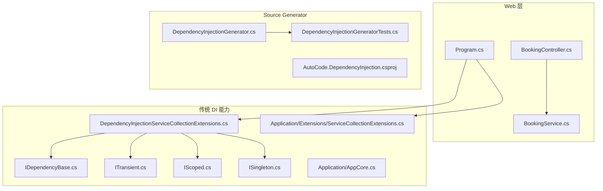
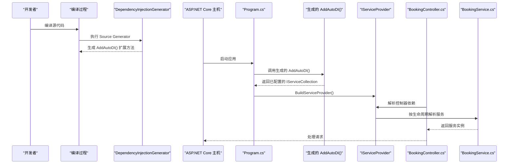
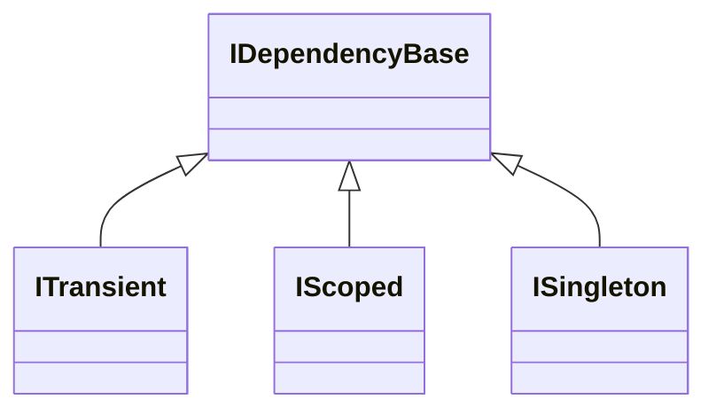
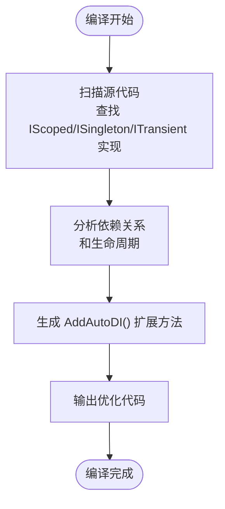
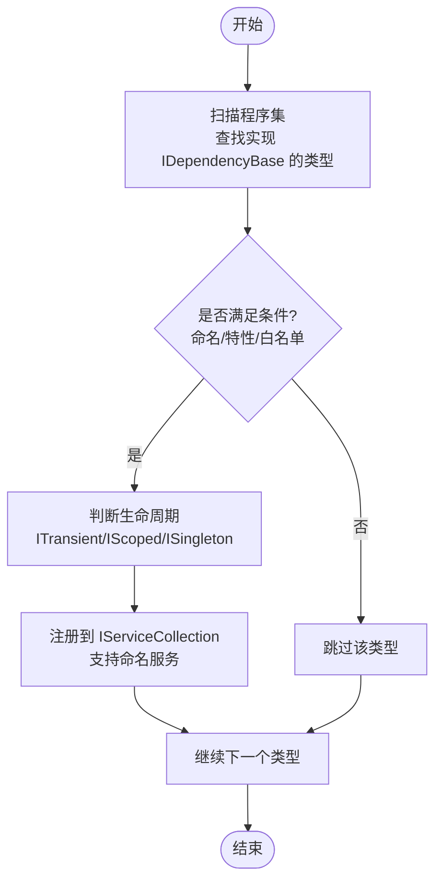
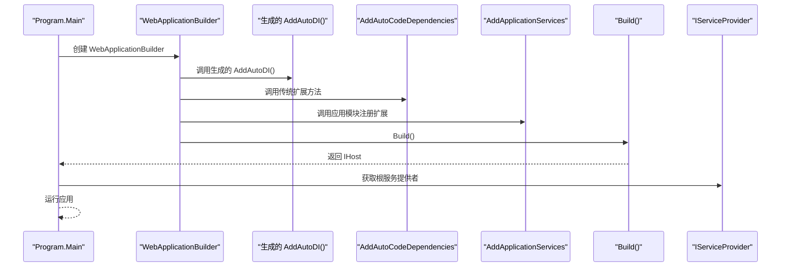
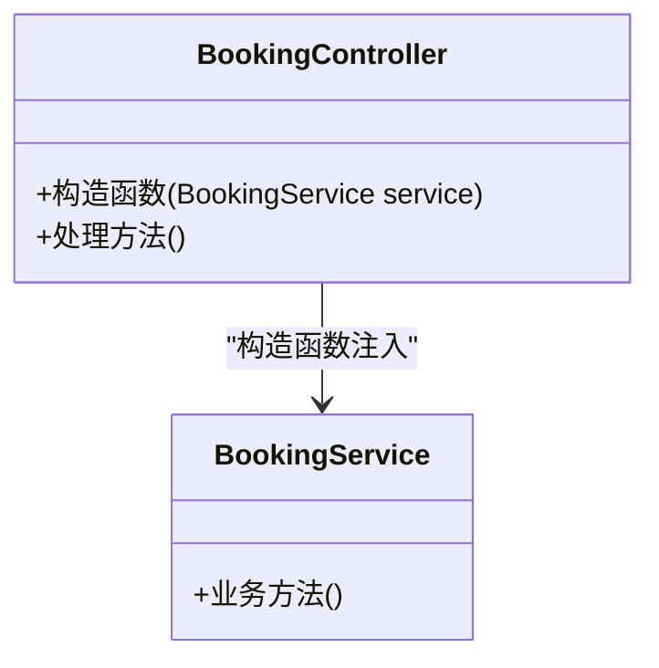
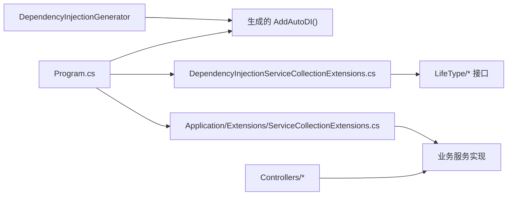

# 依赖注入集成

<cite>
**本文引用的文件**   
- [src/APP.WebAPI.Core/DependencyInjection/DependencyInjectionServiceCollectionExtensions.cs](file://src/APP.WebAPI.Core/DependencyInjection/DependencyInjectionServiceCollectionExtensions.cs)
- [src/APP.WebAPI.Core/DependencyInjection/LifeType/IDependencyBase.cs](file://src/APP.WebAPI.Core/DependencyInjection/LifeType/IDependencyBase.cs)
- [src/APP.WebAPI.Core/DependencyInjection/LifeType/IScoped.cs](file://src/APP.WebAPI.Core/DependencyInjection/LifeType/IScoped.cs)
- [src/APP.WebAPI.Core/DependencyInjection/LifeType/ISingleton.cs](file://src/APP.WebAPI.Core/DependencyInjection/LifeType/ISingleton.cs)
- [src/APP.WebAPI.Core/DependencyInjection/LifeType/ITransient.cs](file://src/APP.WebAPI.Core/DependencyInjection/LifeType/ITransient.cs)
- [src/APP.WebAPI.Core/Application/Extensions/ServiceCollectionExtensions.cs](file://src/APP.WebAPI.Core/Application/Extensions/ServiceCollectionExtensions.cs)
- [src/APP.WebAPI.Core/Application/AppCore.cs](file://src/APP.WebAPI.Core/Application/AppCore.cs)
- [src/APP.WebAPI/Program.cs](file://src/APP.WebAPI/Program.cs)
- [src/APP.WebAPI/Controllers/BookingController.cs](file://src/APP.WebAPI/Controllers/BookingController.cs)
- [src/APP.WebAPI/Services/BookingService.cs](file://src/APP.WebAPI/Services/BookingService.cs)
- [src/AutoCode.DependencyInjection/DependencyInjectionGenerator.cs](file://src/AutoCode.DependencyInjection/DependencyInjectionGenerator.cs)
- [src/AutoCode.DependencyInjection/AutoCode.DependencyInjection.csproj](file://src/AutoCode.DependencyInjection/AutoCode.DependencyInjection.csproj)
- [src/AutoCode.Tests/DependencyInjectionGeneratorTests.cs](file://src/AutoCode.Tests/DependencyInjectionGeneratorTests.cs)
</cite>

## 更新摘要
**所做更改**   
- 新增 AutoCode.DependencyInjection 项目，包含 DependencyInjectionGenerator Source Generator
- 引入编译时服务扫描和代码生成机制，替代运行时反射
- 支持 NativeAOT 兼容性，消除反射开销
- 自动生成 AddAutoDI() 扩展方法
- 更新架构图和流程说明以反映新的编译时处理机制

## 目录
1. [简介](#简介)
2. [项目结构](#项目结构)
3. [核心组件](#核心组件)
4. [架构总览](#架构总览)
5. [详细组件分析](#详细组件分析)
6. [依赖关系分析](#依赖关系分析)
7. [性能考量](#性能考量)
8. [故障排除指南](#故障排除指南)
9. [结论](#结论)
10. [附录](#附录)

## 简介
本文档系统性阐述 AutoCode 框架与 ASP.NET Core 依赖注入（DI）容器的集成机制，重点覆盖：
- **新增**：基于 Source Generator 的编译时服务扫描和代码生成机制
- 服务注册策略与生命周期管理（Transient、Scoped、Singleton）
- 基于约定与标记接口的服务发现
- 通过扩展方法简化批量注册、条件注册与命名服务
- 在自定义 Source Generator 中集成 DI 的运行时解析与测试配置
- 面向开发者的最佳实践与常见问题排查

**更新**：现在使用 DependencyInjectionGenerator 在编译时扫描 IScoped/ISingleton/ITransient 实现并生成 AddAutoDI() 扩展方法，消除了运行时反射开销，完全支持 NativeAOT。

## 项目结构
AutoCode 的 DI 集成现在包含两个主要部分：传统的运行时扩展方法和新的编译时 Source Generator。新项目结构如下：

**图表来源**
- [src/APP.WebAPI/Program.cs](file://src/APP.WebAPI/Program.cs)
- [src/APP.WebAPI/Controllers/BookingController.cs](file://src/APP.WebAPI/Controllers/BookingController.cs)
- [src/APP.WebAPI/Services/BookingService.cs](file://src/APP.WebAPI/Services/BookingService.cs)
- [src/APP.WebAPI.Core/DependencyInjection/DependencyInjectionServiceCollectionExtensions.cs](file://src/APP.WebAPI.Core/DependencyInjection/DependencyInjectionServiceCollectionExtensions.cs)
- [src/AutoCode.DependencyInjection/DependencyInjectionGenerator.cs](file://src/AutoCode.DependencyInjection/DependencyInjectionGenerator.cs)
- [src/AutoCode.DependencyInjection/AutoCode.DependencyInjection.csproj](file://src/AutoCode.DependencyInjection/AutoCode.DependencyInjection.csproj)

章节来源
- [src/APP.WebAPI/Program.cs](file://src/APP.WebAPI/Program.cs)
- [src/APP.WebAPI.Core/DependencyInjection/DependencyInjectionServiceCollectionExtensions.cs](file://src/APP.WebAPI.Core/DependencyInjection/DependencyInjectionServiceCollectionExtensions.cs)
- [src/AutoCode.DependencyInjection/DependencyInjectionGenerator.cs](file://src/AutoCode.DependencyInjection/DependencyInjectionGenerator.cs)

## 核心组件
- **生命周期标记接口**
  - ITransient：标记瞬态服务
  - IScoped：标记作用域服务
  - ISingleton：标记单例服务
  - IDependencyBase：作为所有可被自动发现的依赖基类或公共约定
- **传统扩展方法**
  - DependencyInjectionServiceCollectionExtensions：提供 AddAutoCodeDependencies 等扩展，用于按约定扫描程序集、识别标记接口、完成批量注册与条件注册
  - Application/Extensions/ServiceCollectionExtensions：封装业务模块的服务注册逻辑，便于分层组织
- **新增 Source Generator**
  - DependencyInjectionGenerator：编译时扫描 IScoped/ISingleton/ITransient 实现并生成 AddAutoDI() 扩展方法
- **应用核心**
  - AppCore：聚合各模块的初始化与配置，通常由 Program 调用

**更新**：新增了 DependencyInjectionGenerator，它会在编译时执行服务扫描和代码生成，避免了运行时的反射开销。

章节来源
- [src/APP.WebAPI.Core/DependencyInjection/LifeType/ITransient.cs](file://src/APP.WebAPI.Core/DependencyInjection/LifeType/ITransient.cs)
- [src/APP.WebAPI.Core/DependencyInjection/LifeType/IScoped.cs](file://src/APP.WebAPI.Core/DependencyInjection/LifeType/IScoped.cs)
- [src/APP.WebAPI.Core/DependencyInjection/LifeType/ISingleton.cs](file://src/APP.WebAPI.Core/DependencyInjection/LifeType/ISingleton.cs)
- [src/APP.WebAPI.Core/DependencyInjection/LifeType/IDependencyBase.cs](file://src/APP.WebAPI.Core/DependencyInjection/LifeType/IDependencyBase.cs)
- [src/APP.WebAPI.Core/DependencyInjection/DependencyInjectionServiceCollectionExtensions.cs](file://src/APP.WebAPI.Core/DependencyInjection/DependencyInjectionServiceCollectionExtensions.cs)
- [src/AutoCode.DependencyInjection/DependencyInjectionGenerator.cs](file://src/AutoCode.DependencyInjection/DependencyInjectionGenerator.cs)

## 架构总览
下图展示了从 Web 启动到服务解析的关键流程，包括新的编译时处理阶段：

**图表来源**
- [src/APP.WebAPI/Program.cs](file://src/APP.WebAPI/Program.cs)
- [src/AutoCode.DependencyInjection/DependencyInjectionGenerator.cs](file://src/AutoCode.DependencyInjection/DependencyInjectionGenerator.cs)
- [src/APP.WebAPI/Controllers/BookingController.cs](file://src/APP.WebAPI/Controllers/BookingController.cs)
- [src/APP.WebAPI/Services/BookingService.cs](file://src/APP.WebAPI/Services/BookingService.cs)

## 详细组件分析

### 生命周期标记接口设计
- ITransient、IScoped、ISingleton 分别对应 ASP.NET Core 的三种生命周期，用于在编译期标注服务的期望生命周期。
- IDependencyBase 作为统一约定，便于扫描器识别"可被自动注册的依赖"。

**图表来源**
- [src/APP.WebAPI.Core/DependencyInjection/LifeType/IDependencyBase.cs](file://src/APP.WebAPI.Core/DependencyInjection/LifeType/IDependencyBase.cs)
- [src/APP.WebAPI.Core/DependencyInjection/LifeType/ITransient.cs](file://src/APP.WebAPI.Core/DependencyInjection/LifeType/ITransient.cs)
- [src/APP.WebAPI.Core/DependencyInjection/LifeType/IScoped.cs](file://src/APP.WebAPI.Core/DependencyInjection/LifeType/IScoped.cs)
- [src/APP.WebAPI.Core/DependencyInjection/LifeType/ISingleton.cs](file://src/APP.WebAPI.Core/DependencyInjection/LifeType/ISingleton.cs)

章节来源
- [src/APP.WebAPI.Core/DependencyInjection/LifeType/IDependencyBase.cs](file://src/APP.WebAPI.Core/DependencyInjection/LifeType/IDependencyBase.cs)
- [src/APP.WebAPI.Core/DependencyInjection/LifeType/ITransient.cs](file://src/APP.WebAPI.Core/DependencyInjection/LifeType/ITransient.cs)
- [src/APP.WebAPI.Core/DependencyInjection/LifeType/IScoped.cs](file://src/APP.WebAPI.Core/DependencyInjection/LifeType/IScoped.cs)
- [src/APP.WebAPI.Core/DependencyInjection/LifeType/ISingleton.cs](file://src/APP.WebAPI.Core/DependencyInjection/LifeType/ISingleton.cs)

### 新增：Source Generator 编译时处理
**新增**：DependencyInjectionGenerator 是 AutoCode.DependencyInjection 项目的核心组件，负责在编译时执行以下操作：

- 扫描项目中实现了 IScoped、ISingleton、ITransient 接口的类型
- 分析服务依赖关系和生命周期
- 生成高性能的 AddAutoDI() 扩展方法
- 输出优化的服务注册代码，避免运行时反射

**图表来源**
- [src/AutoCode.DependencyInjection/DependencyInjectionGenerator.cs](file://src/AutoCode.DependencyInjection/DependencyInjectionGenerator.cs)

章节来源
- [src/AutoCode.DependencyInjection/DependencyInjectionGenerator.cs](file://src/AutoCode.DependencyInjection/DependencyInjectionGenerator.cs)

### 批量注册与条件注册扩展
- DependencyInjectionServiceCollectionExtensions 提供统一的扩展方法，典型职责包括：
  - 扫描指定程序集，查找实现了 IDependencyBase 及其子接口的类型
  - 根据实现的标记接口决定生命周期（Transient/Scoped/Singleton）
  - 支持按命名约定或特性进行条件过滤（例如仅注册特定前缀/后缀的类型）
  - 支持命名服务注册（为同一抽象提供多个实现）
- 建议将业务模块的注册逻辑放入 Application/Extensions/ServiceCollectionExtensions，保持关注点分离

**图表来源**
- [src/APP.WebAPI.Core/DependencyInjection/DependencyInjectionServiceCollectionExtensions.cs](file://src/APP.WebAPI.Core/DependencyInjection/DependencyInjectionServiceCollectionExtensions.cs)
- [src/APP.WebAPI.Core/Application/Extensions/ServiceCollectionExtensions.cs](file://src/APP.WebAPI.Core/Application/Extensions/ServiceCollectionExtensions.cs)

章节来源
- [src/APP.WebAPI.Core/DependencyInjection/DependencyInjectionServiceCollectionExtensions.cs](file://src/APP.WebAPI.Core/DependencyInjection/DependencyInjectionServiceCollectionExtensions.cs)
- [src/APP.WebAPI.Core/Application/Extensions/ServiceCollectionExtensions.cs](file://src/APP.WebAPI.Core/Application/Extensions/ServiceCollectionExtensions.cs)

### 应用核心与入口集成
- AppCore 聚合各模块的初始化与配置，对外暴露统一的启动方法
- Program.cs 负责：
  - 构建 Web 主机
  - 调用扩展方法进行服务注册
  - 构建 IServiceProvider
  - 运行应用管道

**图表来源**
- [src/APP.WebAPI/Program.cs](file://src/APP.WebAPI/Program.cs)
- [src/AutoCode.DependencyInjection/DependencyInjectionGenerator.cs](file://src/AutoCode.DependencyInjection/DependencyInjectionGenerator.cs)
- [src/APP.WebAPI.Core/DependencyInjection/DependencyInjectionServiceCollectionExtensions.cs](file://src/APP.WebAPI.Core/DependencyInjection/DependencyInjectionServiceCollectionExtensions.cs)
- [src/APP.WebAPI.Core/Application/Extensions/ServiceCollectionExtensions.cs](file://src/APP.WebAPI.Core/Application/Extensions/ServiceCollectionExtensions.cs)
- [src/APP.WebAPI.Core/Application/AppCore.cs](file://src/APP.WebAPI.Core/Application/AppCore.cs)

章节来源
- [src/APP.WebAPI/Program.cs](file://src/APP.WebAPI/Program.cs)
- [src/APP.WebAPI.Core/Application/AppCore.cs](file://src/APP.WebAPI.Core/Application/AppCore.cs)

### 控制器与服务的使用示例
- BookingController 通过构造函数注入 BookingService，体现 ASP.NET Core 默认解析行为
- BookingService 作为业务实现，遵循单一职责与依赖倒置原则

**图表来源**
- [src/APP.WebAPI/Controllers/BookingController.cs](file://src/APP.WebAPI/Controllers/BookingController.cs)
- [src/APP.WebAPI/Services/BookingService.cs](file://src/APP.WebAPI/Services/BookingService.cs)

章节来源
- [src/APP.WebAPI/Controllers/BookingController.cs](file://src/APP.WebAPI/Controllers/BookingController.cs)
- [src/APP.WebAPI/Services/BookingService.cs](file://src/APP.WebAPI/Services/BookingService.cs)

## 依赖关系分析
- 低耦合高内聚：通过标记接口与扩展方法解耦"发现"和"注册"，新增服务无需修改注册代码
- 循环依赖避免：
  - 使用构造函数注入时，确保无环引用
  - 必要时引入工厂或消息总线解耦
- 外部依赖：
  - 与 ASP.NET Core DI 容器紧密集成，遵循其生命周期语义
  - 可通过命名服务解决同一接口的多实现场景
- **新增**：Source Generator 依赖分析，在编译时验证依赖关系

**图表来源**
- [src/APP.WebAPI/Program.cs](file://src/APP.WebAPI/Program.cs)
- [src/AutoCode.DependencyInjection/DependencyInjectionGenerator.cs](file://src/AutoCode.DependencyInjection/DependencyInjectionGenerator.cs)
- [src/APP.WebAPI.Core/DependencyInjection/DependencyInjectionServiceCollectionExtensions.cs](file://src/APP.WebAPI.Core/DependencyInjection/DependencyInjectionServiceCollectionExtensions.cs)
- [src/APP.WebAPI.Core/Application/Extensions/ServiceCollectionExtensions.cs](file://src/APP.WebAPI.Core/Application/Extensions/ServiceCollectionExtensions.cs)
- [src/APP.WebAPI/Controllers/BookingController.cs](file://src/APP.WebAPI/Controllers/BookingController.cs)
- [src/APP.WebAPI/Services/BookingService.cs](file://src/APP.WebAPI/Services/BookingService.cs)

章节来源
- [src/APP.WebAPI/Program.cs](file://src/APP.WebAPI/Program.cs)
- [src/AutoCode.DependencyInjection/DependencyInjectionGenerator.cs](file://src/AutoCode.DependencyInjection/DependencyInjectionGenerator.cs)
- [src/APP.WebAPI.Core/DependencyInjection/DependencyInjectionServiceCollectionExtensions.cs](file://src/APP.WebAPI.Core/DependencyInjection/DependencyInjectionServiceCollectionExtensions.cs)
- [src/APP.WebAPI.Core/Application/Extensions/ServiceCollectionExtensions.cs](file://src/APP.WebAPI.Core/Application/Extensions/ServiceCollectionExtensions.cs)

## 性能考量
- **编译时优化**：
  - Source Generator 在编译时执行服务扫描和代码生成，消除了运行时的反射开销
  - 生成的代码直接调用构造函数，避免了动态查找的性能损失
  - 完全支持 NativeAOT，不再需要反射元数据
- 生命周期选择
  - Singleton：适合无状态、线程安全的共享资源（如配置缓存、只读数据）
  - Scoped：适合每请求上下文（如数据库连接、HTTP 上下文）
  - Transient：适合轻量、无状态的短生命周期对象
- 扫描优化
  - 限制扫描范围（仅必要程序集）
  - 使用命名约定减少反射开销
- 解析路径
  - 避免深层依赖树，尽量扁平化
  - 对昂贵对象使用工厂延迟创建

**更新**：新增的 Source Generator 显著提升了启动性能和内存使用效率，特别适合对性能要求高的应用场景。

## 故障排除指南
- 常见错误与定位
  - 未找到服务：检查是否实现了对应生命周期接口并被扫描到
  - 循环依赖：查看依赖图，拆分职责或使用工厂/事件总线
  - 生命周期误用：确认服务是否持有不应跨作用域共享的状态
  - **新增**：Source Generator 错误：检查编译输出中的生成器日志
- 调试技巧
  - 在 Program 中打印已注册服务清单
  - 使用命名服务区分多实现
  - 在单元测试中使用 InMemory 容器验证解析结果
  - **新增**：查看生成的 AddAutoDI() 代码以验证扫描结果

章节来源
- [src/APP.WebAPI/Program.cs](file://src/APP.WebAPI/Program.cs)
- [src/AutoCode.DependencyInjection/DependencyInjectionGenerator.cs](file://src/AutoCode.DependencyInjection/DependencyInjectionGenerator.cs)
- [src/AutoCode.Tests/DependencyInjectionGeneratorTests.cs](file://src/AutoCode.Tests/DependencyInjectionGeneratorTests.cs)

## 结论
AutoCode 的 DI 集成现在采用混合架构：既保留了传统的运行时扩展方法，又引入了基于 Source Generator 的编译时处理机制。这种设计提供了：

- **编译时优化**：DependencyInjectionGenerator 在编译时扫描和生成代码，消除了运行时反射开销
- **NativeAOT 兼容**：完全支持 AOT 编译，适合高性能场景
- **向后兼容**：保留原有的扩展方法，确保现有代码不受影响
- **灵活选择**：开发者可以根据需求选择使用编译时生成或运行时扫描

结合 ASP.NET Core 的生命周期语义，开发者可以高效地组织模块化服务，并通过多种注册方式实现批量、条件与命名注册。遵循最佳实践可有效避免循环依赖、提升性能与可维护性。

## 附录
- 最佳实践清单
  - 明确生命周期：按职责与状态选择合适生命周期
  - 单一职责：每个服务只做一件事
  - 依赖倒置：面向接口编程，避免具体实现耦合
  - 条件注册：通过命名或特性控制注册范围
  - 测试友好：提供工厂或替换实现以便 Mock
  - **新增**：优先使用 Source Generator 以获得更好的性能
- 在 Source Generator 中的集成要点
  - 运行时解析：通过 IServiceProvider 或工厂模式解析服务
  - 测试环境：使用内存容器或替代实现隔离外部依赖
  - 生成代码：避免在生成阶段执行重 IO 操作，尽量静态分析
  - **新增**：利用编译时分析捕获依赖问题
- **新增**：Migration Guide
  - 添加 AutoCode.DependencyInjection NuGet 包
  - 在 Program.cs 中调用生成的 AddAutoDI() 方法
  - 逐步迁移现有的手动注册代码
  - 验证生成的代码符合预期

**更新**：新增了完整的迁移指南和最佳实践，帮助开发者顺利过渡到新的编译时处理机制。