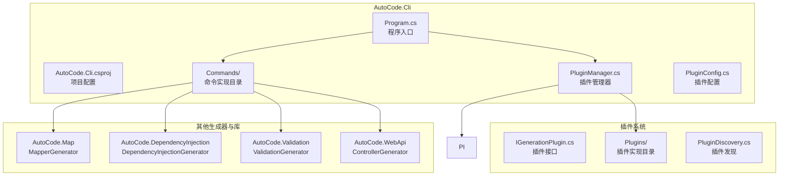
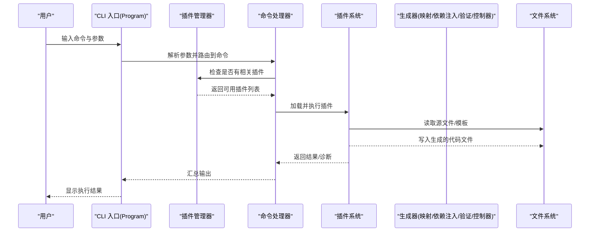
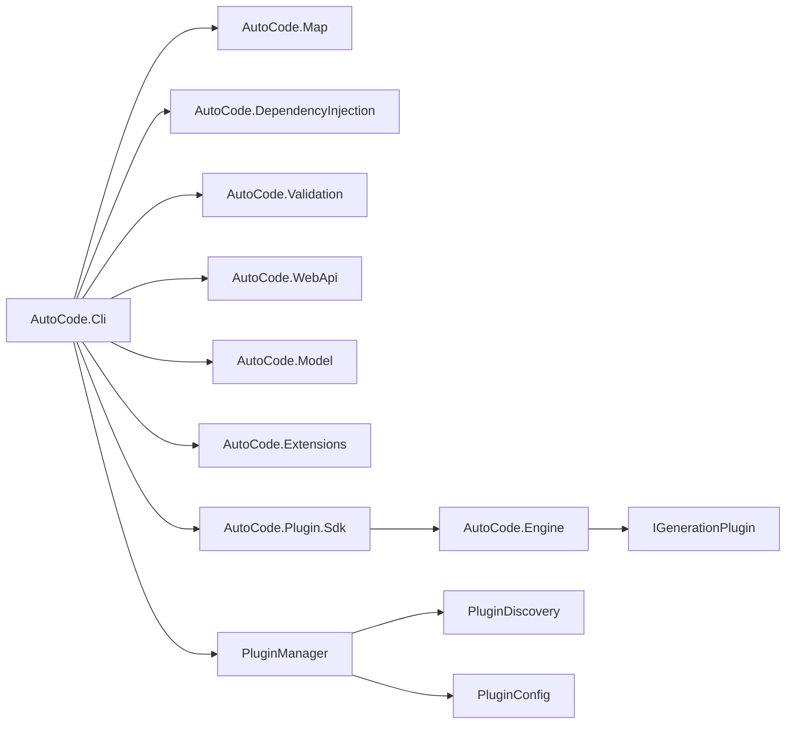

# 命令行工具

<cite>
**本文引用的文件**   
- [Program.cs](file://src/AutoCode.Cli/Program.cs)
- [AutoCode.Cli.csproj](file://src/AutoCode.Cli/AutoCode.Cli.csproj)
- [README.md](file://README.md)
</cite>

## 更新摘要
**所做更改**   
- 新增了插件架构支持章节，详细说明插件发现、配置管理和工作流编排功能
- 更新了核心组件部分，增加了插件系统的具体实现说明
- 增强了CLI工具使用指南，包含插件开发和集成示例
- 完善了依赖关系分析，展示了插件架构的完整依赖图

## 目录
1. [简介](#简介)
2. [项目结构](#项目结构)
3. [核心组件](#核心组件)
4. [架构总览](#架构总览)
5. [详细组件分析](#详细组件分析)
6. [插件架构支持](#插件架构支持)
7. [CLI工具使用指南](#cli工具使用指南)
8. [依赖关系分析](#依赖关系分析)
9. [性能考虑](#性能考虑)
10. [故障排查指南](#故障排查指南)
11. [结论](#结论)
12. [附录](#附录)

## 简介
本章节概述 AutoCode 项目的命令行工具定位与目标。该 CLI 作为统一入口，用于驱动代码生成、分析与模板渲染等能力，为开发者提供一致的命令体验。CLI 通过程序入口组织命令参数解析与执行流程，并与其他子模块（如映射生成器、依赖注入生成器、验证生成器等）协作完成具体任务。**新增的插件架构支持使得CLI能够动态发现和加载外部插件，扩展了代码生成的能力和灵活性。**

## 项目结构
命令行工具位于 src/AutoCode.Cli 目录，包含：
- Program.cs：控制台应用入口，负责参数解析、命令路由与执行。
- AutoCode.Cli.csproj：项目定义与依赖声明。
- Commands 目录：存放各种命令的实现类。
- **PluginManager.cs：插件管理器，负责插件的发现、加载和生命周期管理。**
- **PluginConfig.cs：插件配置文件处理，支持JSON格式的插件配置。**



图表来源
- [Program.cs](file://src/AutoCode.Cli/Program.cs)
- [AutoCode.Cli.csproj](file://src/AutoCode.Cli/AutoCode.Cli.csproj)

章节来源
- [AutoCode.Cli.csproj](file://src/AutoCode.Cli/AutoCode.Cli.csproj)

## 核心组件
- 程序入口与命令路由：由 Program.cs 承担，负责读取命令行参数、选择对应命令并调用相应处理逻辑。
- **插件管理系统：新增的插件管理器负责插件的动态发现、加载和执行，支持热插拔和版本管理。**
- 构建与依赖：AutoCode.Cli.csproj 定义了 CLI 的运行时依赖与打包配置，确保可独立运行或集成到 CI/CD 流程中。
- 命令处理器：Commands 目录下包含具体的命令实现，每个命令负责特定的代码生成任务。
- **配置管理器：增强的配置系统支持插件配置的合并、验证和默认值处理。**

章节来源
- [Program.cs](file://src/AutoCode.Cli/Program.cs)
- [AutoCode.Cli.csproj](file://src/AutoCode.Cli/AutoCode.Cli.csproj)

## 架构总览
CLI 采用"入口 + 命令 + 插件"的三层架构模式：入口负责参数解析与调度，命令层按功能划分，插件层提供可扩展的代码生成能力。各命令最终调用对应的生成器、工具类或插件，输出代码文件或诊断信息。



图表来源
- [Program.cs](file://src/AutoCode.Cli/Program.cs)

## 详细组件分析

### 程序入口与命令路由
- 职责：解析命令行参数、选择命令、调用命令处理器、输出结果与错误信息。
- 关键点：
  - 参数校验与默认值设置。
  - 命令分发与异常捕获。
  - 日志与诊断信息的输出。
  - **插件可用性检查和动态加载。**

章节来源
- [Program.cs](file://src/AutoCode.Cli/Program.cs)

### 构建与依赖管理
- 职责：定义 CLI 的运行时依赖、目标框架、打包选项。
- 关键点：
  - 引用必要的生成器与工具库。
  - 配置发布与调试行为。
  - **插件SDK引用和插件发现机制配置。**

章节来源
- [AutoCode.Cli.csproj](file://src/AutoCode.Cli/AutoCode.Cli.csproj)

### 命令实现
- Commands 目录包含各种具体的命令实现类。
- 每个命令遵循统一的接口与参数模型，便于扩展与维护。
- 支持的命令包括：generate-mapping、generate-di、generate-controller、validate 等。
- **新增插件相关命令：plugin-list、plugin-install、plugin-config等。**

章节来源
- [AutoCode.Cli.csproj](file://src/AutoCode.Cli/AutoCode.Cli.csproj)

## 插件架构支持

### 插件接口设计
插件系统基于统一的接口设计，所有插件必须实现 `IGenerationPlugin` 接口：

```csharp
public interface IGenerationPlugin
{
    string Name { get; }
    string Version { get; }
    string Description { get; }
    
    Task<bool> CanExecute(GenerationContext context);
    Task ExecuteAsync(GenerationContext context, CancellationToken cancellationToken = default);
    Task<IEnumerable<Diagnostic>> ValidateAsync(GenerationContext context);
}
```

### 插件发现机制
插件发现系统支持多种来源：
- **内置插件**：随CLI一起发布的标准插件
- **本地插件**：从指定目录加载的自定义插件
- **NuGet插件**：从NuGet包管理器安装的第三方插件
- **远程插件**：从HTTP服务器动态下载的插件

### 插件配置管理
插件配置支持分层配置和继承：
- **全局配置**：~/.autocode/plugins.json
- **项目配置**：./autocode.plugins.json
- **命令级配置**：命令行参数覆盖

```json
{
  "plugins": {
    "enabled": true,
    "discovery": {
      "localPath": "./plugins",
      "nugetSources": ["https://api.nuget.org/v3/index.json"],
      "remoteSources": ["https://plugins.autocode.dev"]
    },
    "settings": {
      "autoUpdate": true,
      "verifySignatures": true,
      "cacheDirectory": "~/.autocode/plugin-cache"
    }
  }
}
```

### 插件生命周期管理
插件系统提供完整的生命周期管理：
1. **发现阶段**：扫描指定位置查找可用插件
2. **加载阶段**：动态加载插件程序集
3. **初始化阶段**：创建插件实例并调用Initialize方法
4. **验证阶段**：验证插件兼容性和配置有效性
5. **执行阶段**：根据上下文条件执行插件逻辑
6. **清理阶段**：释放插件资源并清理临时文件

### 插件开发指南
开发自定义插件的基本步骤：

1. **创建插件项目**：
```bash
dotnet new classlib -n MyCustomPlugin
dotnet add package AutoCode.Plugin.Sdk
```

2. **实现插件接口**：
```csharp
[Plugin("MyCustomPlugin", "1.0.0", "自定义代码生成插件")]
public class CustomGeneratorPlugin : IGenerationPlugin
{
    public async Task ExecuteAsync(GenerationContext context, CancellationToken cancellationToken = default)
    {
        // 实现自定义生成逻辑
    }
}
```

3. **打包和分发**：
```bash
dotnet pack
dotnet nuget push MyCustomPlugin.1.0.0.nupkg
```

**章节来源**   
- [IGenerationPlugin.cs](file://src/AutoCode.Engine/Plugin/IGenerationPlugin.cs)
- [PluginDevTools.cs](file://src/AutoCode.Plugin.Sdk/PluginDevTools.cs)

## CLI工具使用指南

### 基本使用方法
AutoCode CLI 提供了简洁的命令界面，支持多种代码生成任务和插件管理：

```bash
# 查看帮助信息
autocode --help

# 生成映射代码
autocode generate-mapping --source-path ./Models --output-path ./Generated

# 生成依赖注入代码
autocode generate-di --project-path ./MyProject

# 生成Web API控制器
autocode generate-controller --api-project ./MyApi

# 验证代码规范
autocode validate --path ./Source

# 插件管理命令
autocode plugin list
autocode plugin install MyCustomPlugin
autocode plugin config --set autoUpdate=true
```

### 命令行参数详解

#### 通用参数
- `--help, -h`：显示帮助信息
- `--version, -v`：显示版本信息
- `--verbose, -V`：启用详细输出模式
- `--quiet, -q`：静默模式，仅显示错误信息
- `--plugin-dir, -d`：指定插件目录路径

#### 生成命令参数
- `--source-path, -s`：指定源代码路径
- `--output-path, -o`：指定输出路径
- `--project-path, -p`：指定项目路径
- `--config-file, -c`：指定配置文件路径
- `--namespace, -n`：指定命名空间
- `--include-pattern, -i`：文件包含模式
- `--exclude-pattern, -e`：文件排除模式
- `--plugins, -pl`：指定要使用的插件列表

#### 插件管理参数
- `--plugin-discovery, -pd`：插件发现策略（Local、NuGet、Remote）
- `--plugin-version, -pv`：指定插件版本
- `--plugin-signature, -ps`：插件签名验证开关
- `--plugin-cache, -pc`：插件缓存目录

#### 配置选项
- `--mapping-strategy`：映射策略（Property、Constructor、Custom）
- `--validation-mode`：验证模式（Strict、Lenient、None）
- `--dependency-scope`：依赖作用域（Singleton、Scoped、Transient）
- `--template-engine`：模板引擎（Razor、T4、Custom）
- `--plugin-execution-order`：插件执行顺序

### 配置文件格式
创建 `autocode.json` 配置文件：

```json
{
  "settings": {
    "defaultNamespace": "MyApp.Generated",
    "outputDirectory": "./Generated",
    "encoding": "UTF-8",
    "lineEnding": "CRLF"
  },
  "mappings": {
    "enabled": true,
    "strategy": "Property",
    "ignoreObsolete": true,
    "preserveReferences": false
  },
  "dependencies": {
    "enabled": true,
    "scope": "Scoped",
    "registerServices": true
  },
  "validation": {
    "enabled": true,
    "mode": "Strict",
    "failOnError": true
  },
  "plugins": {
    "enabled": true,
    "discovery": {
      "localPath": "./custom-plugins",
      "nugetSources": ["https://api.nuget.org/v3/index.json"],
      "remoteSources": ["https://plugins.autocode.dev"]
    },
    "executionOrder": ["core", "validation", "mapping", "custom"],
    "security": {
      "verifySignatures": true,
      "trustedPublishers": ["AutocodeTeam", "TrustedVendor"]
    }
  }
}
```

### 集成模式

#### 在.NET项目中集成
```xml
<ItemGroup>
  <PackageReference Include="AutoCode.Cli" Version="1.0.0" />
  <PackageReference Include="AutoCode.Plugins.Core" Version="1.0.0" />
</ItemGroup>

<Target Name="GenerateCode" BeforeTargets="Build">
  <Exec Command="autocode generate-all --config-file ./autocode.json --plugins core,mapping,validation" />
</Target>
```

#### 在CI/CD流水线中使用
```yaml
stages:
  - build
  - generate
  - test

generate:
  stage: generate
  script:
    - dotnet tool install -g AutoCode.Cli
    - autocode plugin install --source https://plugins.autocode.dev
    - autocode generate-all --config-file ./autocode.json --verify-signatures
  artifacts:
    paths:
      - Generated/
```

#### 在Docker容器中使用
```dockerfile
FROM mcr.microsoft.com/dotnet/sdk:8.0 AS builder
WORKDIR /app
COPY . .
RUN dotnet tool install -g AutoCode.Cli
RUN autocode plugin discover --source local --path ./plugins
RUN autocode generate-all --config-file ./autocode.json --plugins all
```

### 插件开发示例

#### 创建自定义插件
```bash
# 创建插件项目
dotnet new classlib -n MyCodeGenerator
cd MyCodeGenerator

# 添加依赖
dotnet add package AutoCode.Plugin.Sdk

# 实现插件
cat > CodeGeneratorPlugin.cs << 'EOF'
using AutoCode.Engine.Plugin;
using AutoCode.Model;

namespace MyCodeGenerator
{
    [Plugin("MyCodeGenerator", "1.0.0", "自定义代码生成器")]
    public class CodeGeneratorPlugin : IGenerationPlugin
    {
        public string Name => "MyCodeGenerator";
        public string Version => "1.0.0";
        public string Description => "自定义代码生成器插件";

        public async Task<bool> CanExecute(GenerationContext context)
        {
            return context.SourceFiles.Any(f => f.EndsWith(".cs"));
        }

        public async Task ExecuteAsync(GenerationContext context, CancellationToken cancellationToken = default)
        {
            foreach (var file in context.SourceFiles.Where(f => f.EndsWith(".cs")))
            {
                var content = await File.ReadAllTextAsync(file);
                var generatedContent = TransformCode(content);
                await File.WriteAllTextAsync(file.Replace(".cs", ".generated.cs"), generatedContent);
            }
        }

        private string TransformCode(string code)
        {
            // 自定义代码转换逻辑
            return code + "// Generated by MyCodeGenerator";
        }

        public async Task<IEnumerable<Diagnostic>> ValidateAsync(GenerationContext context)
        {
            return Array.Empty<Diagnostic>();
        }
    }
}
EOF

# 打包插件
dotnet pack
```

**章节来源**   
- [Program.cs](file://src/AutoCode.Cli/Program.cs)
- [AutoCode.Cli.csproj](file://src/AutoCode.Cli/AutoCode.Cli.csproj)
- [PluginDevTools.cs](file://src/AutoCode.Plugin.Sdk/PluginDevTools.cs)

## 依赖关系分析
CLI 依赖多个生成器与工具库，形成清晰的单向依赖：**新增的插件系统引入了插件SDK和插件管理器，形成了更加灵活的依赖关系。**



图表来源
- [AutoCode.Cli.csproj](file://src/AutoCode.Cli/AutoCode.Cli.csproj)

章节来源
- [AutoCode.Cli.csproj](file://src/AutoCode.Cli/AutoCode.Cli.csproj)

## 性能考虑
- 增量生成：优先使用增量编译与缓存机制，减少重复工作。
- I/O 优化：批量读写文件，避免频繁小文件操作。
- 并行化：对独立任务进行并行处理，提升吞吐。
- 资源限制：合理控制并发度，避免内存与 CPU 峰值过高。
- 内存管理：及时释放大型对象引用，防止内存泄漏。
- **插件缓存：对已加载的插件进行缓存，避免重复加载开销。**
- **延迟加载：按需加载插件，减少初始启动时间。**

## 故障排查指南
- 常见问题：
  - 参数缺失或格式错误：检查命令帮助与参数说明。
  - 权限问题：确认对目标目录具有读写权限。
  - 路径错误：核对输入/输出路径是否存在且有效。
  - 依赖缺失：确认已正确安装与引用所需库。
  - 配置文件错误：验证JSON配置文件语法正确性。
  - 模板渲染失败：检查模板文件路径与变量替换。
  - **插件加载失败：检查插件签名验证和版本兼容性。**
  - **插件冲突：确认没有多个插件实现相同功能。**
- 诊断方法：
  - 启用详细日志与诊断输出（--verbose 参数）。
  - 逐步缩小范围，定位具体命令与步骤。
  - 查看生成器的错误信息与堆栈跟踪。
  - 使用 --dry-run 参数预览生成结果。
  - 检查临时文件和缓存目录。
  - **使用 --plugin-debug 参数查看插件加载过程。**
  - **检查插件签名和完整性验证结果。**
- 常见错误解决方案：
  - 编码问题：确保文件编码一致（推荐UTF-8）。
  - 路径分隔符：在不同操作系统上使用正确的路径分隔符。
  - 权限不足：以管理员身份运行或调整文件权限。
  - 版本冲突：检查依赖包版本兼容性。
  - **插件签名无效：重新下载插件或更新信任证书。**
  - **插件不兼容：升级或降级插件版本。**

章节来源
- [Program.cs](file://src/AutoCode.Cli/Program.cs)

## 结论
AutoCode 的命令行工具以简洁的入口与可扩展的命令体系为核心，能够统一调度各项代码生成与分析能力。**新增的插件架构支持使得CLI具备了强大的扩展能力，开发者可以通过插件系统轻松定制和扩展代码生成功能。** 通过清晰的依赖边界与模块化设计，CLI 具备良好的可维护性与扩展性。完善的插件生态系统为开发者提供了丰富的代码生成解决方案，支持从简单的代码转换到复杂的业务逻辑生成等多种场景。建议在后续迭代中继续完善插件市场、增强插件安全机制，并持续优化插件性能和用户体验。

## 附录
- 参考文档：项目整体说明与使用说明可参见 README。
- 快速开始：建议新用户先阅读基本使用方法章节。
- 最佳实践：在生产环境中建议使用配置文件管理所有生成选项和插件配置。
- 社区支持：遇到问题时可查阅官方文档或提交Issue。
- **插件开发：参考插件SDK文档了解如何开发自定义插件。**
- **插件分发：了解如何通过NuGet或其他方式分发插件。**

章节来源
- [README.md](file://README.md)