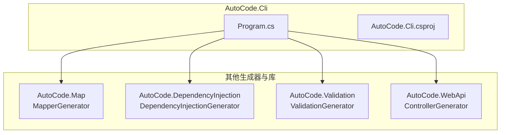
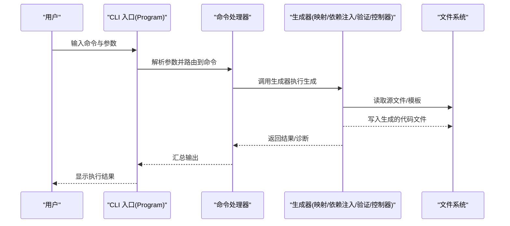
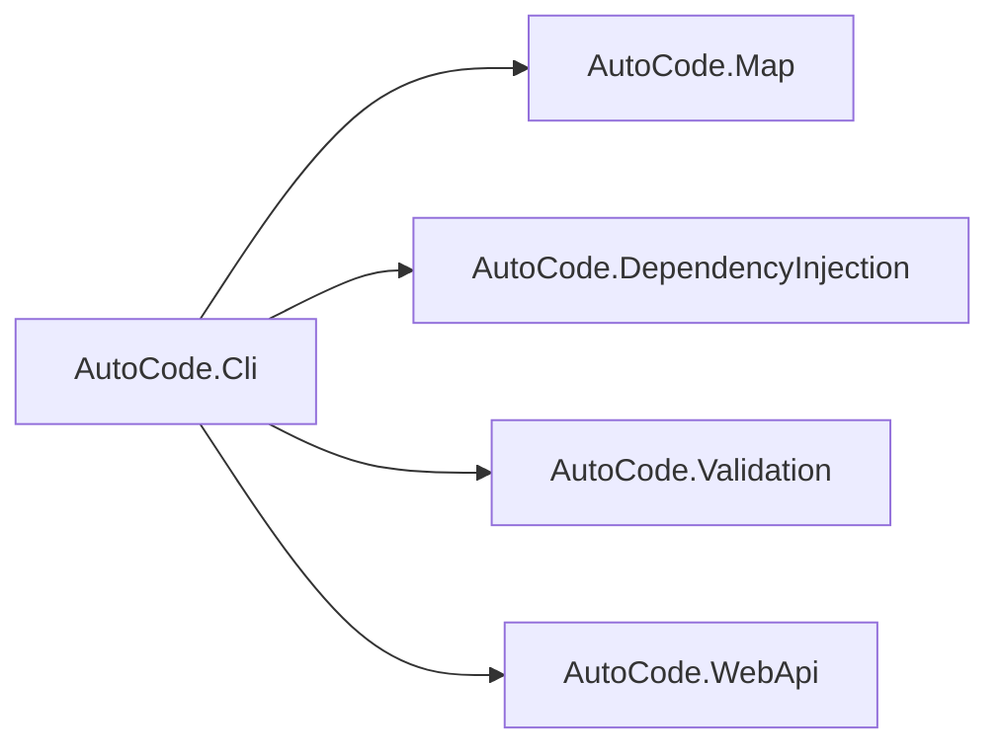

# 命令行工具

<cite>
**本文档引用的文件**   
- [Program.cs](file://src/AutoCode.Cli/Program.cs)
- [AutoCode.Cli.csproj](file://src/AutoCode.Cli/AutoCode.Cli.csproj)
- [README.md](file://README.md)
</cite>

## 目录
1. [简介](#简介)
2. [项目结构](#项目结构)
3. [核心组件](#核心组件)
4. [架构总览](#架构总览)
5. [详细组件分析](#详细组件分析)
6. [依赖关系分析](#依赖关系分析)
7. [性能考虑](#性能考虑)
8. [故障排查指南](#故障排查指南)
9. [结论](#结论)
10. [附录](#附录)

## 简介
本章节概述 AutoCode 项目的命令行工具定位与目标。该 CLI 作为统一入口，用于驱动代码生成、分析与模板渲染等能力，为开发者提供一致的命令体验。CLI 通过程序入口组织命令参数解析与执行流程，并与其他子模块（如映射生成器、依赖注入生成器、验证生成器等）协作完成具体任务。

## 项目结构
命令行工具位于 src/AutoCode.Cli 目录，包含：
- Program.cs：控制台应用入口，负责参数解析、命令路由与执行。
- AutoCode.Cli.csproj：项目定义与依赖声明。

图表来源
- [Program.cs](file://src/AutoCode.Cli/Program.cs)
- [AutoCode.Cli.csproj](file://src/AutoCode.Cli/AutoCode.Cli.csproj)

章节来源
- [AutoCode.Cli.csproj](file://src/AutoCode.Cli/AutoCode.Cli.csproj)

## 核心组件
- 程序入口与命令路由：由 Program.cs 承担，负责读取命令行参数、选择对应命令并调用相应处理逻辑。
- 构建与依赖：AutoCode.Cli.csproj 定义了 CLI 的运行时依赖与打包配置，确保可独立运行或集成到 CI/CD 流程中。

章节来源
- [Program.cs](file://src/AutoCode.Cli/Program.cs)
- [AutoCode.Cli.csproj](file://src/AutoCode.Cli/AutoCode.Cli.csproj)

## 架构总览
CLI 采用“入口 + 命令”模式：入口负责参数解析与调度，命令层按功能划分（例如映射生成、依赖注入生成、控制器生成、验证生成等）。各命令最终调用对应的生成器或工具类，输出代码文件或诊断信息。

图表来源
- [Program.cs](file://src/AutoCode.Cli/Program.cs)

## 详细组件分析

### 程序入口与命令路由
- 职责：解析命令行参数、选择命令、调用命令处理器、输出结果与错误信息。
- 关键点：
  - 参数校验与默认值设置。
  - 命令分发与异常捕获。
  - 日志与诊断信息的输出。

章节来源
- [Program.cs](file://src/AutoCode.Cli/Program.cs)

### 构建与依赖管理
- 职责：定义 CLI 的运行时依赖、目标框架、打包选项。
- 关键点：
  - 引用必要的生成器与工具库。
  - 配置发布与调试行为。

章节来源
- [AutoCode.Cli.csproj](file://src/AutoCode.Cli/AutoCode.Cli.csproj)

### 命令实现（占位）
- 当前 Commands 目录为空，后续可按需添加具体命令实现（如 generate-mapping、generate-di、generate-controller、validate 等）。
- 建议：每个命令一个类，遵循统一的接口与参数模型，便于扩展与维护。

章节来源
- [AutoCode.Cli.csproj](file://src/AutoCode.Cli/AutoCode.Cli.csproj)

## 依赖关系分析
CLI 依赖多个生成器与工具库，形成清晰的单向依赖：CLI 不反向被生成器依赖，保证边界清晰与可测试性。

图表来源
- [AutoCode.Cli.csproj](file://src/AutoCode.Cli/AutoCode.Cli.csproj)

章节来源
- [AutoCode.Cli.csproj](file://src/AutoCode.Cli/AutoCode.Cli.csproj)

## 性能考虑
- 增量生成：优先使用增量编译与缓存机制，减少重复工作。
- I/O 优化：批量读写文件，避免频繁小文件操作。
- 并行化：对独立任务进行并行处理，提升吞吐。
- 资源限制：合理控制并发度，避免内存与 CPU 峰值过高。

[本节为通用指导，不涉及具体文件分析]

## 故障排查指南
- 常见问题：
  - 参数缺失或格式错误：检查命令帮助与参数说明。
  - 权限问题：确认对目标目录具有读写权限。
  - 路径错误：核对输入/输出路径是否存在且有效。
  - 依赖缺失：确认已正确安装与引用所需库。
- 诊断方法：
  - 启用详细日志与诊断输出。
  - 逐步缩小范围，定位具体命令与步骤。
  - 查看生成器的错误信息与堆栈跟踪。

章节来源
- [Program.cs](file://src/AutoCode.Cli/Program.cs)

## 结论
AutoCode 的命令行工具以简洁的入口与可扩展的命令体系为核心，能够统一调度各项代码生成与分析能力。通过清晰的依赖边界与模块化设计，CLI 具备良好的可维护性与扩展性。建议在后续迭代中完善命令集、增强参数校验与错误提示，并持续优化性能与用户体验。

[本节为总结性内容，不涉及具体文件分析]

## 附录
- 参考文档：项目整体说明与使用说明可参见 README。

章节来源
- [README.md](file://README.md)