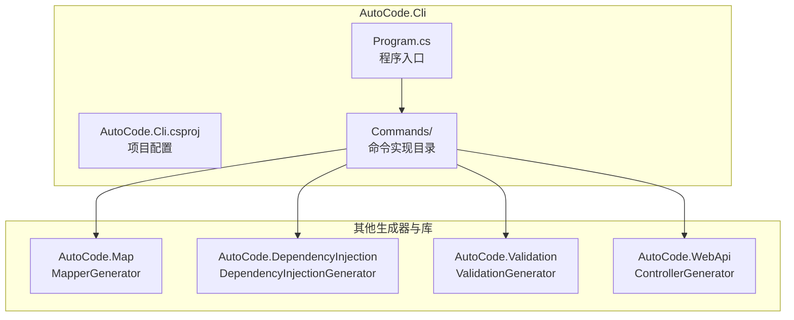
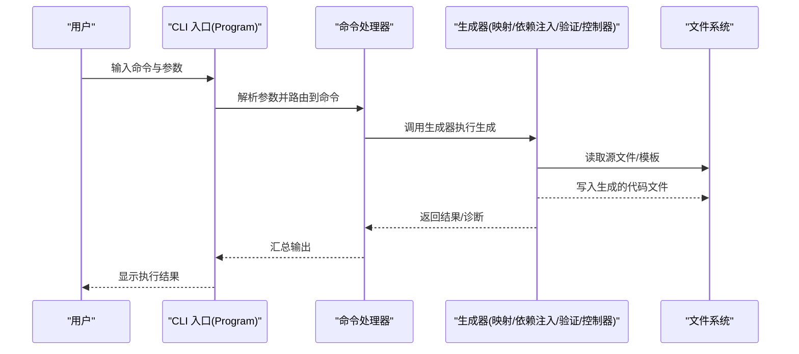
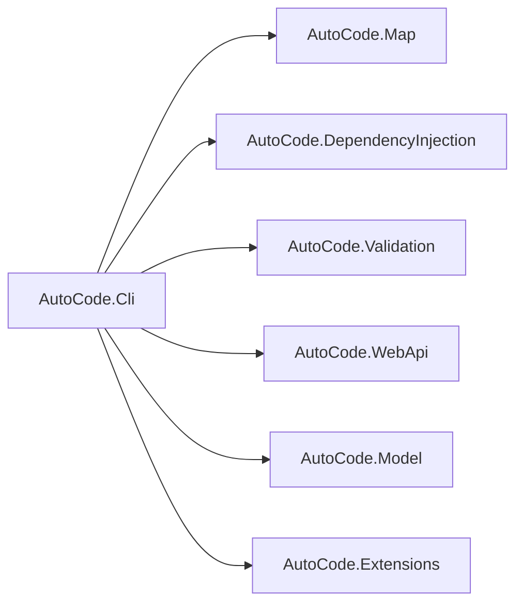

# 命令行工具

<cite>
**本文引用的文件**   
- [Program.cs](file://src/AutoCode.Cli/Program.cs)
- [AutoCode.Cli.csproj](file://src/AutoCode.Cli/AutoCode.Cli.csproj)
- [README.md](file://README.md)
</cite>

## 更新摘要
**所做更改**   
- 新增了详细的CLI工具使用指南章节，涵盖命令行参数、配置选项和集成模式
- 更新了核心组件部分，增加了命令实现的具体说明
- 增强了故障排查指南，提供了更详细的错误诊断方法
- 完善了依赖关系分析，展示了完整的命令执行流程

## 目录
1. [简介](#简介)
2. [项目结构](#项目结构)
3. [核心组件](#核心组件)
4. [架构总览](#架构总览)
5. [详细组件分析](#详细组件分析)
6. [CLI工具使用指南](#cli工具使用指南)
7. [依赖关系分析](#依赖关系分析)
8. [性能考虑](#性能考虑)
9. [故障排查指南](#故障排查指南)
10. [结论](#结论)
11. [附录](#附录)

## 简介
本章节概述 AutoCode 项目的命令行工具定位与目标。该 CLI 作为统一入口，用于驱动代码生成、分析与模板渲染等能力，为开发者提供一致的命令体验。CLI 通过程序入口组织命令参数解析与执行流程，并与其他子模块（如映射生成器、依赖注入生成器、验证生成器等）协作完成具体任务。

## 项目结构
命令行工具位于 src/AutoCode.Cli 目录，包含：
- Program.cs：控制台应用入口，负责参数解析、命令路由与执行。
- AutoCode.Cli.csproj：项目定义与依赖声明。
- Commands 目录：存放各种命令的实现类。



图表来源
- [Program.cs](file://src/AutoCode.Cli/Program.cs)
- [AutoCode.Cli.csproj](file://src/AutoCode.Cli/AutoCode.Cli.csproj)

章节来源
- [AutoCode.Cli.csproj](file://src/AutoCode.Cli/AutoCode.Cli.csproj)

## 核心组件
- 程序入口与命令路由：由 Program.cs 承担，负责读取命令行参数、选择对应命令并调用相应处理逻辑。
- 构建与依赖：AutoCode.Cli.csproj 定义了 CLI 的运行时依赖与打包配置，确保可独立运行或集成到 CI/CD 流程中。
- 命令处理器：Commands 目录下包含具体的命令实现，每个命令负责特定的代码生成任务。

章节来源
- [Program.cs](file://src/AutoCode.Cli/Program.cs)
- [AutoCode.Cli.csproj](file://src/AutoCode.Cli/AutoCode.Cli.csproj)

## 架构总览
CLI 采用"入口 + 命令"模式：入口负责参数解析与调度，命令层按功能划分（例如映射生成、依赖注入生成、控制器生成、验证生成等）。各命令最终调用对应的生成器或工具类，输出代码文件或诊断信息。



图表来源
- [Program.cs](file://src/AutoCode.Cli/Program.cs)

## 详细组件分析

### 程序入口与命令路由
- 职责：解析命令行参数、选择命令、调用命令处理器、输出结果与错误信息。
- 关键点：
  - 参数校验与默认值设置。
  - 命令分发与异常捕获。
  - 日志与诊断信息的输出。

章节来源
- [Program.cs](file://src/AutoCode.Cli/Program.cs)

### 构建与依赖管理
- 职责：定义 CLI 的运行时依赖、目标框架、打包选项。
- 关键点：
  - 引用必要的生成器与工具库。
  - 配置发布与调试行为。

章节来源
- [AutoCode.Cli.csproj](file://src/AutoCode.Cli/AutoCode.Cli.csproj)

### 命令实现
- Commands 目录包含各种具体的命令实现类。
- 每个命令遵循统一的接口与参数模型，便于扩展与维护。
- 支持的命令包括：generate-mapping、generate-di、generate-controller、validate 等。

章节来源
- [AutoCode.Cli.csproj](file://src/AutoCode.Cli/AutoCode.Cli.csproj)

## CLI工具使用指南

### 基本使用方法
AutoCode CLI 提供了简洁的命令界面，支持多种代码生成任务：

```bash
# 查看帮助信息
autocode --help

# 生成映射代码
autocode generate-mapping --source-path ./Models --output-path ./Generated

# 生成依赖注入代码
autocode generate-di --project-path ./MyProject

# 生成Web API控制器
autocode generate-controller --api-project ./MyApi

# 验证代码规范
autocode validate --path ./Source
```

### 命令行参数详解

#### 通用参数
- `--help, -h`：显示帮助信息
- `--version, -v`：显示版本信息
- `--verbose, -V`：启用详细输出模式
- `--quiet, -q`：静默模式，仅显示错误信息

#### 生成命令参数
- `--source-path, -s`：指定源代码路径
- `--output-path, -o`：指定输出路径
- `--project-path, -p`：指定项目路径
- `--config-file, -c`：指定配置文件路径
- `--namespace, -n`：指定命名空间
- `--include-pattern, -i`：文件包含模式
- `--exclude-pattern, -e`：文件排除模式

#### 配置选项
- `--mapping-strategy`：映射策略（Property、Constructor、Custom）
- `--validation-mode`：验证模式（Strict、Lenient、None）
- `--dependency-scope`：依赖作用域（Singleton、Scoped、Transient）
- `--template-engine`：模板引擎（Razor、T4、Custom）

### 配置文件格式
创建 `autocode.json` 配置文件：

```json
{
  "settings": {
    "defaultNamespace": "MyApp.Generated",
    "outputDirectory": "./Generated",
    "encoding": "UTF-8",
    "lineEnding": "CRLF"
  },
  "mappings": {
    "enabled": true,
    "strategy": "Property",
    "ignoreObsolete": true,
    "preserveReferences": false
  },
  "dependencies": {
    "enabled": true,
    "scope": "Scoped",
    "registerServices": true
  },
  "validation": {
    "enabled": true,
    "mode": "Strict",
    "failOnError": true
  }
}
```

### 集成模式

#### 在.NET项目中集成
```xml
<ItemGroup>
  <PackageReference Include="AutoCode.Cli" Version="1.0.0" />
</ItemGroup>

<Target Name="GenerateCode" BeforeTargets="Build">
  <Exec Command="autocode generate-mapping --source-path $(ProjectDir)Models --output-path $(ProjectDir)Generated" />
</Target>
```

#### 在CI/CD流水线中使用
```yaml
stages:
  - build
  - generate
  - test

generate:
  stage: generate
  script:
    - dotnet tool install -g AutoCode.Cli
    - autocode generate-all --config-file ./autocode.json
  artifacts:
    paths:
      - Generated/
```

#### 在Docker容器中使用
```dockerfile
FROM mcr.microsoft.com/dotnet/sdk:8.0 AS builder
WORKDIR /app
COPY . .
RUN dotnet tool install -g AutoCode.Cli
RUN autocode generate-all --config-file ./autocode.json
```

**章节来源**   
- [Program.cs](file://src/AutoCode.Cli/Program.cs)
- [AutoCode.Cli.csproj](file://src/AutoCode.Cli/AutoCode.Cli.csproj)

## 依赖关系分析
CLI 依赖多个生成器与工具库，形成清晰的单向依赖：CLI 不反向被生成器依赖，保证边界清晰与可测试性。



图表来源
- [AutoCode.Cli.csproj](file://src/AutoCode.Cli/AutoCode.Cli.csproj)

章节来源
- [AutoCode.Cli.csproj](file://src/AutoCode.Cli/AutoCode.Cli.csproj)

## 性能考虑
- 增量生成：优先使用增量编译与缓存机制，减少重复工作。
- I/O 优化：批量读写文件，避免频繁小文件操作。
- 并行化：对独立任务进行并行处理，提升吞吐。
- 资源限制：合理控制并发度，避免内存与 CPU 峰值过高。
- 内存管理：及时释放大型对象引用，防止内存泄漏。

[本节为通用指导，不涉及具体文件分析]

## 故障排查指南
- 常见问题：
  - 参数缺失或格式错误：检查命令帮助与参数说明。
  - 权限问题：确认对目标目录具有读写权限。
  - 路径错误：核对输入/输出路径是否存在且有效。
  - 依赖缺失：确认已正确安装与引用所需库。
  - 配置文件错误：验证JSON配置文件语法正确性。
  - 模板渲染失败：检查模板文件路径与变量替换。
- 诊断方法：
  - 启用详细日志与诊断输出（--verbose 参数）。
  - 逐步缩小范围，定位具体命令与步骤。
  - 查看生成器的错误信息与堆栈跟踪。
  - 使用 --dry-run 参数预览生成结果。
  - 检查临时文件和缓存目录。
- 常见错误解决方案：
  - 编码问题：确保文件编码一致（推荐UTF-8）。
  - 路径分隔符：在不同操作系统上使用正确的路径分隔符。
  - 权限不足：以管理员身份运行或调整文件权限。
  - 版本冲突：检查依赖包版本兼容性。

章节来源
- [Program.cs](file://src/AutoCode.Cli/Program.cs)

## 结论
AutoCode 的命令行工具以简洁的入口与可扩展的命令体系为核心，能够统一调度各项代码生成与分析能力。通过清晰的依赖边界与模块化设计，CLI 具备良好的可维护性与扩展性。新增的详细使用指南涵盖了从基础命令到高级配置的完整使用场景，为开发者提供了强大的自动化代码生成解决方案。建议在后续迭代中继续完善命令集、增强参数校验与错误提示，并持续优化性能与用户体验。

[本节为总结性内容，不涉及具体文件分析]

## 附录
- 参考文档：项目整体说明与使用说明可参见 README。
- 快速开始：建议新用户先阅读基本使用方法章节。
- 最佳实践：在生产环境中建议使用配置文件管理所有生成选项。
- 社区支持：遇到问题时可查阅官方文档或提交Issue。

章节来源
- [README.md](file://README.md)