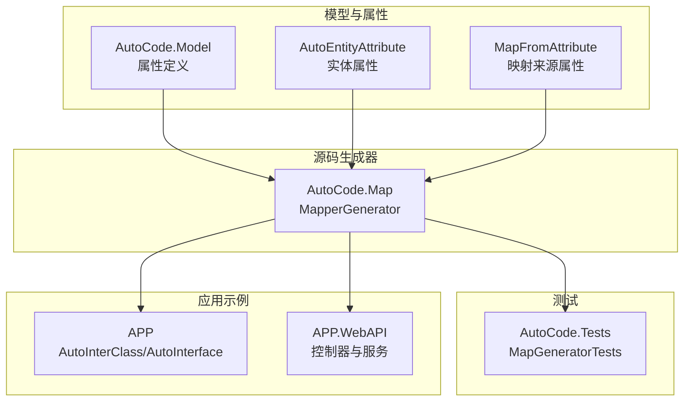
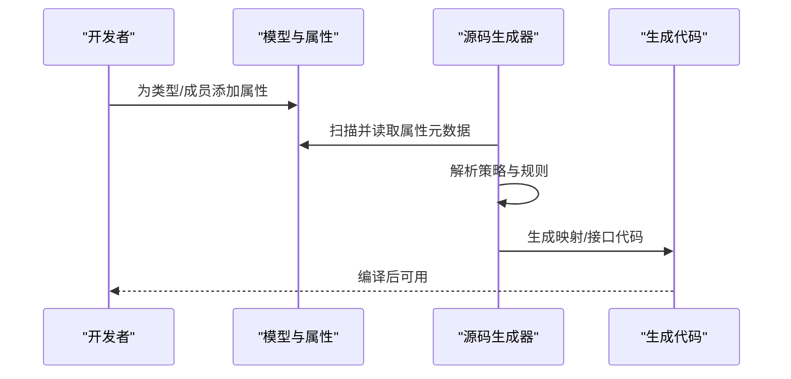
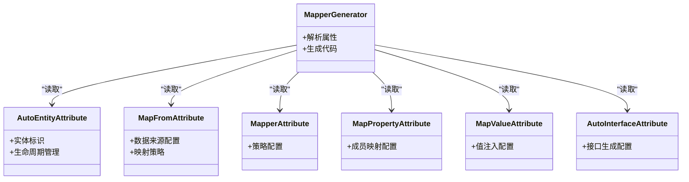

# 属性系统

<cite>
**本文引用的文件**   
- [README.md](file://README.md)
- [README.en.md](file://README.en.md)
- [AutoCode.Model/AutoEntityAttribute.cs](file://src/AutoCode.Model/AutoEntityAttribute.cs)
- [AutoCode.Model/MapFromAttribute.cs](file://src/AutoCode.Model/MapFromAttribute.cs)
- [AutoCode.Model/AutoMapperModel/MapperAttribute.cs](file://src/AutoCode.Model/AutoMapperModel/MapperAttribute.cs)
- [AutoCode.Model/InterfaceAttribute/AutoInterfaceAttribute.cs](file://src/AutoCode.Model/InterfaceAttribute/AutoInterfaceAttribute.cs)
- [AutoCode.Model/AutoMapperModel/MapPropertyAttribute.cs](file://src/AutoCode.Model/AutoMapperModel/MapPropertyAttribute.cs)
- [AutoCode.Model/AutoMapperModel/MapValueAttribute.cs](file://src/AutoCode.Model/AutoMapperModel/MapValueAttribute.cs)
- [AutoCode.Map/MapperGenerator.cs](file://src/AutoCode.Map/MapperGenerator.cs)
- [AutoCode.Tests/MapGeneratorTests.cs](file://src/AutoCode.Tests/MapGeneratorTests.cs)
- [APP/AutoInterClass.cs](file://src/APP/AutoInterClass.cs)
- [APP/AutoInterface.cs](file://src/APP/AutoInterface.cs)
- [APP.WebAPI/Controllers/BookingController.cs](file://src/APP.WebAPI/Controllers/BookingController.cs)
- [APP.WebAPI/Services/BookingService.cs](file://src/APP.WebAPI/Services/BookingService.cs)
</cite>

## 更新摘要
**所做更改**   
- 新增 AutoEntityAttribute 和 MapFromAttribute 的详细说明
- 更新模型框架增强功能介绍
- 扩展元数据驱动代码生成机制说明
- 完善 V2 版本特性与向后兼容性说明

## 目录
1. [简介](#简介)
2. [项目结构](#项目结构)
3. [核心组件](#核心组件)
4. [架构总览](#架构总览)
5. [详细组件分析](#详细组件分析)
6. [依赖关系分析](#依赖关系分析)
7. [性能考量](#性能考量)
8. [故障排查指南](#故障排查指南)
9. [结论](#结论)
10. [附录](#附录)

## 简介
本文件系统性介绍 AutoCode 框架的属性驱动编程模式，重点围绕以下主题：
- 内置属性的作用、配置选项与使用方法：[Mapper]、[AutoInterface]、[MapProperty]、[MapValue]、[AutoEntity]、[MapFrom] 等
- 属性的元数据提取机制、继承与组合使用方式
- 不同场景下的属性配置示例（以路径引用代替代码片段）
- 属性验证规则与默认值处理
- 自定义属性的设计原则、最佳实践与常见陷阱

AutoCode 通过源码生成器在编译期读取类型与成员上的属性元数据，自动生成映射、接口或模板化代码，从而减少样板代码并提升一致性。V2 版本新增了 AutoEntityAttribute 和 MapFromAttribute，进一步增强了元数据驱动的代码生成能力。

## 项目结构
AutoCode 的属性系统与源码生成器分布在多个项目中：
- 属性定义位于 AutoCode.Model 的 AutoMapperModel、InterfaceAttribute 以及根命名空间
- 源码生成器位于 AutoCode.Map 的 MapperGenerator
- 测试用例位于 AutoCode.Tests，覆盖映射生成行为
- 应用层示例位于 APP 与 APP.WebAPI，展示属性在实际业务中的使用

**图表来源**
- [AutoCode.Model/AutoEntityAttribute.cs](file://src/AutoCode.Model/AutoEntityAttribute.cs)
- [AutoCode.Model/MapFromAttribute.cs](file://src/AutoCode.Model/MapFromAttribute.cs)
- [AutoCode.Model/AutoMapperModel/MapperAttribute.cs](file://src/AutoCode.Model/AutoMapperModel/MapperAttribute.cs)
- [AutoCode.Map/MapperGenerator.cs](file://src/AutoCode.Map/MapperGenerator.cs)

**章节来源**
- [README.md](file://README.md)
- [README.en.md](file://README.en.md)

## 核心组件
本节聚焦属性系统的核心组件及其职责：
- 映射相关属性：用于声明类型级与成员级的映射策略、目标字段名、常量值注入等
- 实体管理属性：用于标识和管理实体类型，支持数据库操作和生命周期管理
- 映射来源属性：用于指定数据来源和目标映射关系，简化复杂映射场景
- 接口生成属性：用于自动推导并生成接口，简化契约定义
- 源码生成器：解析属性元数据，生成映射实现或接口代码

关键要点
- 类型级属性通常控制整体映射策略（如命名转换、必需映射策略、枚举策略等）
- 成员级属性用于精细控制字段映射、忽略、常量赋值、格式化等
- 实体属性提供统一的实体标识和管理机制
- 生成器在编译期扫描程序集，收集属性元数据，输出可执行代码

**章节来源**
- [AutoCode.Model/AutoEntityAttribute.cs](file://src/AutoCode.Model/AutoEntityAttribute.cs)
- [AutoCode.Model/MapFromAttribute.cs](file://src/AutoCode.Model/MapFromAttribute.cs)
- [AutoCode.Model/AutoMapperModel/MapperAttribute.cs](file://src/AutoCode.Model/AutoMapperModel/MapperAttribute.cs)
- [AutoCode.Model/AutoMapperModel/MapPropertyAttribute.cs](file://src/AutoCode.Model/AutoMapperModel/MapPropertyAttribute.cs)
- [AutoCode.Model/AutoMapperModel/MapValueAttribute.cs](file://src/AutoCode.Model/AutoMapperModel/MapValueAttribute.cs)
- [AutoCode.Model/InterfaceAttribute/AutoInterfaceAttribute.cs](file://src/AutoCode.Model/InterfaceAttribute/AutoInterfaceAttribute.cs)
- [AutoCode.Map/MapperGenerator.cs](file://src/AutoCode.Map/MapperGenerator.cs)

## 架构总览
下图展示了属性驱动的映射生成流程：从类型与成员上的属性到源码生成器的解析与代码输出。

**图表来源**
- [AutoCode.Model/AutoMapperModel/MapperAttribute.cs](file://src/AutoCode.Model/AutoMapperModel/MapperAttribute.cs)
- [AutoCode.Map/MapperGenerator.cs](file://src/AutoCode.Map/MapperGenerator.cs)

## 详细组件分析

### 实体管理属性：[AutoEntity]
- 作用：标识类型为实体，支持数据库操作、生命周期管理和CRUD操作
- 典型配置项：表名、主键、时间戳、软删除等
- 使用方式：在实体类上标注，由生成器自动生成相应的数据库操作代码
- 默认值：未显式设置时采用约定优于配置的原则
- 验证规则：实体必须包含有效的标识符和必要的生命周期属性

**章节来源**
- [AutoCode.Model/AutoEntityAttribute.cs](file://src/AutoCode.Model/AutoEntityAttribute.cs)
- [AutoCode.Map/MapperGenerator.cs](file://src/AutoCode.Map/MapperGenerator.cs)

### 映射来源属性：[MapFrom]
- 作用：指定数据来源类型和映射关系，支持复杂的跨类型映射场景
- 典型配置项：源类型、映射策略、条件映射、转换函数等
- 使用方式：在目标类型或成员上标注，声明数据来源和映射规则
- 默认值：未设置时按默认映射策略推断
- 验证规则：源类型与目标类型的兼容性检查

**章节来源**
- [AutoCode.Model/MapFromAttribute.cs](file://src/AutoCode.Model/MapFromAttribute.cs)
- [AutoCode.Map/MapperGenerator.cs](file://src/AutoCode.Map/MapperGenerator.cs)

### 映射属性：[Mapper]
- 作用：声明类型级映射策略，影响整个类型的映射行为（如命名转换、必需映射策略、枚举策略等）
- 典型配置项：命名策略、必需映射策略、枚举映射策略、忽略过时成员策略等
- 使用方式：在需要生成映射的类型上添加该属性，配合成员级属性进行细化控制
- 默认值：未显式设置的策略将采用框架默认值
- 验证规则：当必需映射策略开启时，缺失映射的目标成员会触发诊断错误

**章节来源**
- [AutoCode.Model/AutoMapperModel/MapperAttribute.cs](file://src/AutoCode.Model/AutoMapperModel/MapperAttribute.cs)
- [AutoCode.Map/MapperGenerator.cs](file://src/AutoCode.Map/MapperGenerator.cs)

### 映射属性：[MapProperty]
- 作用：对单个成员进行映射配置，包括目标字段名、是否忽略、格式提供者等
- 典型配置项：目标属性名、忽略标志、格式化字符串、条件映射等
- 使用方式：在源类型成员上标注，指定如何映射到目标类型成员
- 默认值：未设置时按默认命名策略推断
- 验证规则：目标成员不存在或类型不兼容时会触发诊断

**章节来源**
- [AutoCode.Model/AutoMapperModel/MapPropertyAttribute.cs](file://src/AutoCode.Model/AutoMapperModel/MapPropertyAttribute.cs)
- [AutoCode.Map/MapperGenerator.cs](file://src/AutoCode.Map/MapperGenerator.cs)

### 映射属性：[MapValue]
- 作用：为成员注入固定值或表达式结果，常用于填充默认值或常量
- 典型配置项：常量值、表达式、条件判断等
- 使用方式：在目标成员上标注，指定要赋值的值或计算逻辑
- 默认值：未提供值时遵循框架默认策略
- 验证规则：值类型与目标成员类型不匹配时触发诊断

**章节来源**
- [AutoCode.Model/AutoMapperModel/MapValueAttribute.cs](file://src/AutoCode.Model/AutoMapperModel/MapValueAttribute.cs)
- [AutoCode.Map/MapperGenerator.cs](file://src/AutoCode.Map/MapperGenerator.cs)

### 接口生成属性：[AutoInterface]
- 作用：基于类型或成员约定自动生成接口，减少手工编写契约代码
- 典型配置项：可见性、成员过滤、忽略规则等
- 使用方式：在类型或命名空间上标注，由生成器产出接口定义
- 默认值：未显式配置时采用默认可见性与成员选择策略
- 验证规则：冲突的成员名或非法标识符会触发诊断

**章节来源**
- [AutoCode.Model/InterfaceAttribute/AutoInterfaceAttribute.cs](file://src/AutoCode.Model/InterfaceAttribute/AutoInterfaceAttribute.cs)
- [AutoCode.Map/MapperGenerator.cs](file://src/AutoCode.Map/MapperGenerator.cs)

### 源码生成器：MapperGenerator
- 作用：编译期扫描属性元数据，解析映射策略，生成映射实现与接口代码
- 输入：类型与成员的属性元数据
- 处理：策略合并、规则校验、代码模板渲染
- 输出：C# 源代码，供后续编译链接

**章节来源**
- [AutoCode.Map/MapperGenerator.cs](file://src/AutoCode.Map/MapperGenerator.cs)

### 测试用例：MapGeneratorTests
- 作用：覆盖映射生成的关键路径，验证属性配置与生成结果的正确性
- 关注点：不同属性组合、边界情况、错误诊断

**章节来源**
- [AutoCode.Tests/MapGeneratorTests.cs](file://src/AutoCode.Tests/MapGeneratorTests.cs)

### 应用示例：接口与控制器
- 接口示例：展示 AutoInterface 的使用与生成效果
- 控制器与服务：展示属性驱动的映射在 Web API 中的应用

**章节来源**
- [APP/AutoInterClass.cs](file://src/APP/AutoInterClass.cs)
- [APP/AutoInterface.cs](file://src/APP/AutoInterface.cs)
- [APP.WebAPI/Controllers/BookingController.cs](file://src/APP.WebAPI/Controllers/BookingController.cs)
- [APP.WebAPI/Services/BookingService.cs](file://src/APP.WebAPI/Services/BookingService.cs)

## 依赖关系分析
属性系统与生成器之间的依赖关系如下：

**图表来源**
- [AutoCode.Model/AutoEntityAttribute.cs](file://src/AutoCode.Model/AutoEntityAttribute.cs)
- [AutoCode.Model/MapFromAttribute.cs](file://src/AutoCode.Model/MapFromAttribute.cs)
- [AutoCode.Model/AutoMapperModel/MapperAttribute.cs](file://src/AutoCode.Model/AutoMapperModel/MapperAttribute.cs)
- [AutoCode.Model/AutoMapperModel/MapPropertyAttribute.cs](file://src/AutoCode.Model/AutoMapperModel/MapPropertyAttribute.cs)
- [AutoCode.Model/AutoMapperModel/MapValueAttribute.cs](file://src/AutoCode.Model/AutoMapperModel/MapValueAttribute.cs)
- [AutoCode.Model/InterfaceAttribute/AutoInterfaceAttribute.cs](file://src/AutoCode.Model/InterfaceAttribute/AutoInterfaceAttribute.cs)
- [AutoCode.Map/MapperGenerator.cs](file://src/AutoCode.Map/MapperGenerator.cs)

**章节来源**
- [AutoCode.Map/MapperGenerator.cs](file://src/AutoCode.Map/MapperGenerator.cs)

## 性能考量
- 编译期生成：避免运行时代码反射带来的开销
- 增量生成：仅重新生成变更部分，缩短构建时间
- 属性复杂度：过多复杂条件与表达式可能增加生成时间与内存占用
- 实体管理开销：大量实体类型会增加元数据处理时间
- 建议：合理拆分类型与属性配置，避免过度复杂的映射逻辑，合理使用实体管理功能

## 故障排查指南
常见问题与定位方法：
- 诊断错误：检查必需映射策略与目标成员是否存在
- 类型不匹配：确认 MapValue 与目标成员类型一致
- 命名冲突：调整 MapProperty 的目标名称或启用命名转换策略
- 生成失败：查看生成器日志与测试用例，定位具体属性配置问题
- 实体相关问题：检查实体标识符和生命周期属性的正确性
- 映射来源错误：确认 MapFrom 指定的源类型存在且可访问

**章节来源**
- [AutoCode.Tests/MapGeneratorTests.cs](file://src/AutoCode.Tests/MapGeneratorTests.cs)
- [AutoCode.Map/MapperGenerator.cs](file://src/AutoCode.Map/MapperGenerator.cs)

## 结论
AutoCode 的属性系统通过声明式配置与编译期生成，显著减少了样板代码并提升了开发效率。V2 版本新增的 AutoEntityAttribute 和 MapFromAttribute 进一步增强了元数据驱动的代码生成能力，使框架在处理复杂实体管理和跨类型映射场景时更加灵活高效。合理使用内置属性与扩展自定义属性，可以在保证一致性的同时灵活应对各种业务需求。

## 附录
- 自定义属性设计原则
  - 单一职责：每个属性只负责一个方面的配置
  - 明确语义：属性名与配置项应清晰表达意图
  - 可组合性：支持与其他属性协同工作
  - 可验证性：提供合理的默认值与诊断信息
- 最佳实践
  - 优先使用类型级属性统一策略，成员级属性做精细化控制
  - 保持命名规范，减少手动映射
  - 利用测试用例覆盖关键路径
  - 合理使用实体管理功能，避免过度抽象
- 常见陷阱
  - 忽略必需映射策略导致的运行时异常
  - 过度使用复杂表达式导致生成性能下降
  - 未考虑类型兼容性引发诊断错误
  - 实体生命周期管理不当导致的资源泄漏
  - 映射来源配置错误引发的编译时错误