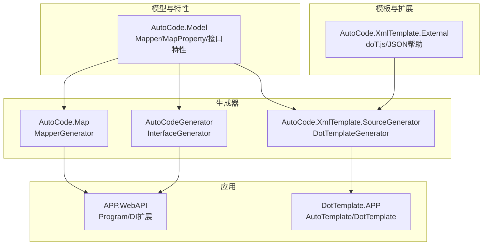
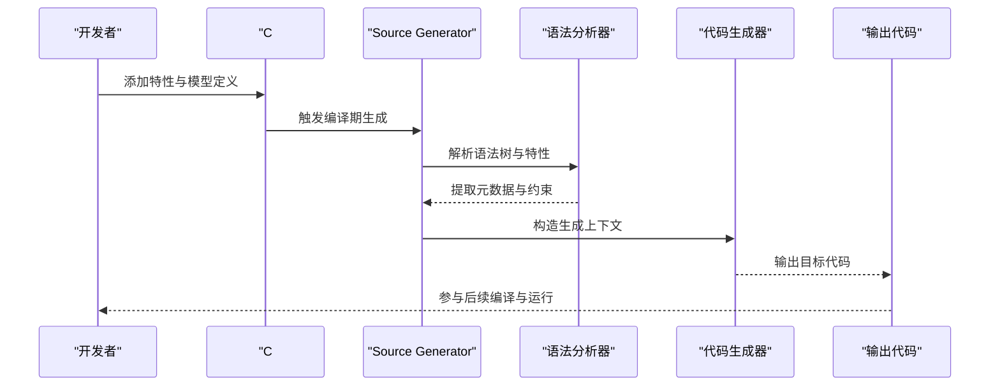
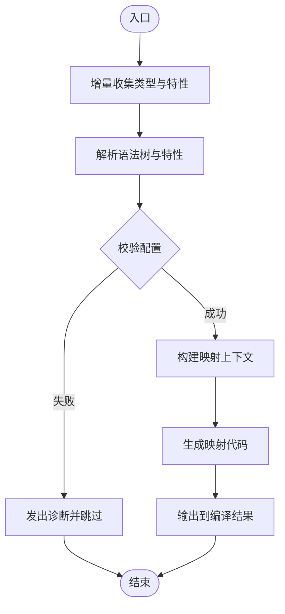
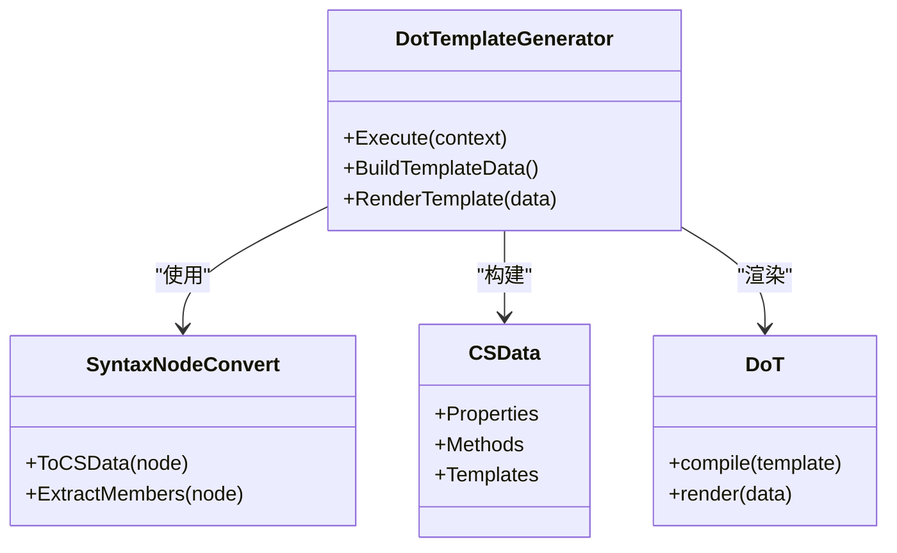
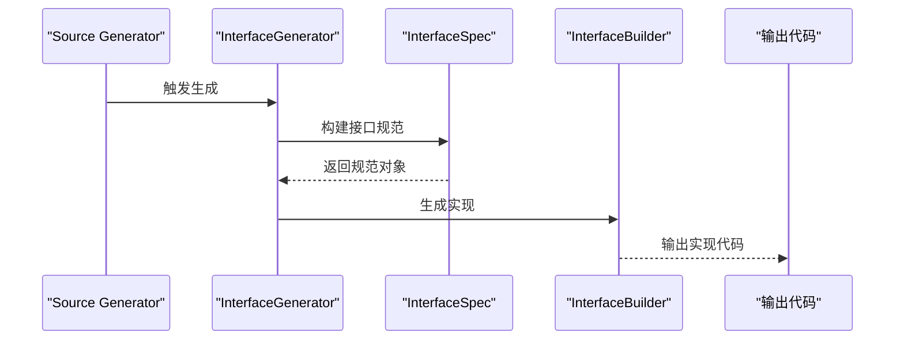
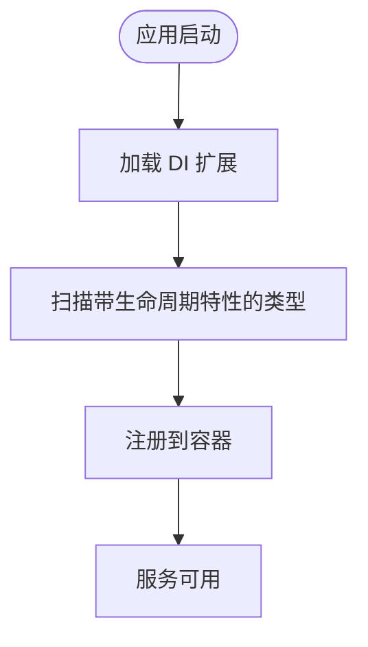
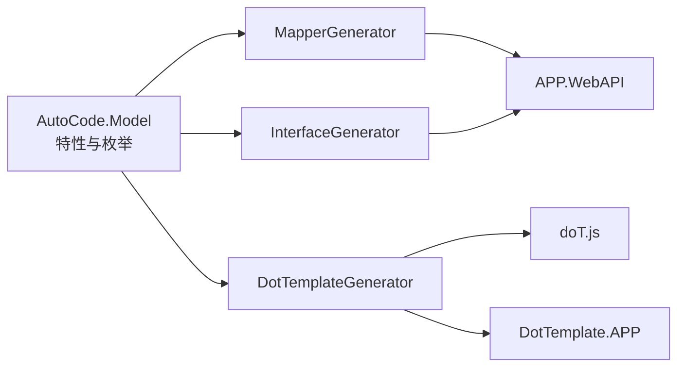

# 核心概念

<cite>
**本文引用的文件**   
- [README.md](file://README.md)
- [README.en.md](file://README.en.md)
- [AutoCode.SourceGenerator.Extensions.csproj](file://src/AutoCode.Extensions.SourceGenerator/AutoCode.SourceGenerator.Extensions.csproj)
- [MapperGenerator.cs](file://src/AutoCode.Map/MapperGenerator.cs)
- [Diagnostics.cs](file://src/AutoCode.Map/Diagnostics/DiagnosticDescriptors.cs)
- [ImmutableEquatableArray.cs](file://src/AutoCode.Map/Helpers/ImmutableEquatableArray.cs)
- [IncrementalValuesProviderExtensions.cs](file://src/AutoCode.Map/Helpers/IncrementalValuesProviderExtensions.cs)
- [Behavior.cs](file://src/Auto.MapModels/Behavior.cs)
- [EnumMappingStrategy.cs](file://src/AutoCode.Model/AutoMapperModel/EnumMappingStrategy.cs)
- [FormatProviderAttribute.cs](file://src/AutoCode.Model/AutoMapperModel/FormatProviderAttribute.cs)
- [IgnoreObsoleteMembersStrategy.cs](file://src/AutoCode.Model/AutoMapperModel/IgnoreObsoleteMembersStrategy.cs)
- [MapPropertyAttribute.cs](file://src/AutoCode.Model/AutoMapperModel/MapPropertyAttribute.cs)
- [MapValueAttribute.cs](file://src/AutoCode.Model/AutoMapperModel/MapValueAttribute.cs)
- [MapperAttribute.cs](file://src/AutoCode.Model/AutoMapperModel/MapperAttribute.cs)
- [MappingConversionType.cs](file://src/AutoCode.Model/AutoMapperModel/MappingConversionType.cs)
- [MemberVisibility.cs](file://src/AutoCode.Model/AutoMapperModel/MemberVisibility.cs)
- [PropertyNameMappingStrategy.cs](file://src/AutoCode.Model/AutoMapperModel/PropertyNameMappingStrategy.cs)
- [RequiredMappingStrategy.cs](file://src/AutoCode.Model/AutoMapperModel/RequiredMappingStrategy.cs)
- [DotTemplateAttribute.cs](file://src/AutoCode.Model/DotFileAttribute/DotTemplateAttribute.cs)
- [AutoIgnoreAttribute.cs](file://src/AutoCode.Model/InterfaceAttribute/AutoIgnoreAttribute.cs)
- [AutoInterfaceAttribute.cs](file://src/AutoCode.Model/InterfaceAttribute/AutoInterfaceAttribute.cs)
- [CSData.cs](file://src/AutoCode.XmlTemplate.SourceGenerator/CSData.cs)
- [DotTemplateGenerator.cs](file://src/AutoCode.XmlTemplate.SourceGenerator/DotTemplateGenerator.cs)
- [SyntaxNodeConvert.cs](file://src/AutoCode.XmlTemplate.SourceGenerator/SyntaxNodeConvert.cs)
- [DiagnosticIds.cs](file://src/AutoCode.XmlTemplate.SourceGenerator/Extend/DiagnosticIds.cs)
- [DotHelp.cs](file://src/AutoCode.XmlTemplate.SourceGenerator/Extend/DotHelp.cs)
- [InterfaceBuilder.cs](file://src/AutoCodeGenerator/InterfaceAutoBuilder/InterfaceBuilder.cs)
- [InterfaceGenerator.cs](file://src/AutoCodeGenerator/InterfaceAutoBuilder/InterfaceGenerator.cs)
- [InterfaceSpec.cs](file://src/AutoCodeGenerator/InterfaceAutoBuilder/InterfaceSpec.cs)
- [Program.cs](file://src/APP.WebAPI/Program.cs)
- [ServiceCollectionExtensions.cs](file://src/APP.WebAPI.Core/Application/Extensions/ServiceCollectionExtensions.cs)
- [DependencyInjectionServiceCollectionExtensions.cs](file://src/APP.WebAPI.Core/DependencyInjection/DependencyInjectionServiceCollectionExtensions.cs)
- [IDependencyBase.cs](file://src/APP.WebAPI.Core/DependencyInjection/LifeType/IDependencyBase.cs)
- [IScoped.cs](file://src/APP.WebAPI.Core/DependencyInjection/LifeType/IScoped.cs)
- [ISingleton.cs](file://src/APP.WebAPI.Core/DependencyInjection/LifeType/ISingleton.cs)
- [ITransient.cs](file://src/APP.WebAPI.Core/DependencyInjection/LifeType/ITransient.cs)
- [AutoTemplate.cs](file://src/DotTemplate.APP/AutoTemplate.cs)
- [DotTemplate.cs](file://src/DotTemplate.APP/DotTemplate.cs)
- [IAutoTemplate.cs](file://src/DotTemplate.APP/IAutoTemplate.cs)
- [doT.js](file://src/AutoCode.XmlTemplate.External/doT.js)
</cite>

## 目录
1. [简介](#简介)
2. [项目结构](#项目结构)
3. [核心组件](#核心组件)
4. [架构总览](#架构总览)
5. [详细组件分析](#详细组件分析)
6. [依赖关系分析](#依赖关系分析)
7. [性能考量](#性能考量)
8. [故障排查指南](#故障排查指南)
9. [结论](#结论)
10. [附录](#附录)

## 简介
本文件面向初学者与高级用户，系统性阐述 AutoCode 框架的核心概念与工作原理。重点包括：
- Source Generator（源生成器）的工作机制与编译期代码生成流程
- 属性驱动编程模式：通过特性声明式配置映射、接口生成与模板渲染
- 模板引擎机制：基于 doT.js 的模板数据绑定与扩展能力
- 依赖注入集成：生命周期标记与自动注册策略
- 编译时分析：语法树解析、增量分析与错误诊断
- 代码生成管道：从输入模型到目标代码的端到端流程

## 项目结构
AutoCode 采用多项目分层组织，围绕“模型定义—生成器—模板—应用”的主线展开：
- 模型与特性：位于 AutoCode.Model，提供 Mapper、MapProperty、AutoInterface 等特性与枚举策略
- 映射生成器：位于 AutoCode.Map，实现 MapperGenerator 与诊断、辅助类型
- 模板生成器：位于 AutoCode.XmlTemplate.SourceGenerator，实现 DotTemplateGenerator 与语法节点转换
- 接口生成器：位于 AutoCodeGenerator，实现 InterfaceGenerator/InterfaceBuilder/InterfaceSpec
- 应用示例：APP、APP.WebAPI、DotTemplate.APP 展示使用方式与 DI 集成
- 外部模板库：AutoCode.XmlTemplate.External 提供 doT.js 与 JSON/帮助工具

图表来源
- [MapperGenerator.cs:1-200](file://src/AutoCode.Map/MapperGenerator.cs#L1-L200)
- [DotTemplateGenerator.cs:1-200](file://src/AutoCode.XmlTemplate.SourceGenerator/DotTemplateGenerator.cs#L1-L200)
- [InterfaceGenerator.cs:1-200](file://src/AutoCodeGenerator/InterfaceAutoBuilder/InterfaceGenerator.cs#L1-L200)
- [Program.cs:1-200](file://src/APP.WebAPI/Program.cs#L1-L200)

章节来源
- [README.md](file://README.md)
- [README.en.md](file://README.en.md)

## 核心组件
- 属性驱动模型：通过特性声明映射规则、成员可见性、命名策略、枚举策略、必填策略等，使生成行为可配置且可读性强
- 映射生成器：扫描带有映射特性的类型，构建映射元数据，输出映射代码
- 模板生成器：将 C# 语法树转换为模板数据，结合 doT 模板生成目标代码
- 接口生成器：根据接口特性自动生成实现或相关代码
- 依赖注入集成：通过生命周期接口与扩展方法，在启动阶段完成服务注册

章节来源
- [MapperAttribute.cs:1-200](file://src/AutoCode.Model/AutoMapperModel/MapperAttribute.cs#L1-L200)
- [MapPropertyAttribute.cs:1-200](file://src/AutoCode.Model/AutoMapperModel/MapPropertyAttribute.cs#L1-L200)
- [AutoInterfaceAttribute.cs:1-200](file://src/AutoCode.Model/InterfaceAttribute/AutoInterfaceAttribute.cs#L1-L200)
- [AutoIgnoreAttribute.cs:1-200](file://src/AutoCode.Model/InterfaceAttribute/AutoIgnoreAttribute.cs#L1-L200)
- [DotTemplateAttribute.cs:1-200](file://src/AutoCode.Model/DotFileAttribute/DotTemplateAttribute.cs#L1-L200)

## 架构总览
AutoCode 的编译期架构由“特性—分析—生成—输出”构成，配合增量分析与诊断系统，确保高效与稳定：

图表来源
- [MapperGenerator.cs:1-200](file://src/AutoCode.Map/MapperGenerator.cs#L1-L200)
- [DotTemplateGenerator.cs:1-200](file://src/AutoCode.XmlTemplate.SourceGenerator/DotTemplateGenerator.cs#L1-L200)
- [InterfaceGenerator.cs:1-200](file://src/AutoCodeGenerator/InterfaceAutoBuilder/InterfaceGenerator.cs#L1-L200)

## 详细组件分析

### 映射生成器（MapperGenerator）
- 功能：识别带有映射特性的类型，解析成员映射、转换策略与命名策略，生成映射代码
- 关键流程：
  - 增量收集：利用 IncrementalValuesProvider 提升性能
  - 元数据构建：读取 MapProperty、MapValue、枚举策略、命名策略等
  - 代码生成：按策略生成映射逻辑
  - 诊断：对非法配置发出诊断信息

图表来源
- [MapperGenerator.cs:1-200](file://src/AutoCode.Map/MapperGenerator.cs#L1-L200)
- [IncrementalValuesProviderExtensions.cs:1-200](file://src/AutoCode.Map/Helpers/IncrementalValuesProviderExtensions.cs#L1-L200)
- [Diagnostics.cs:1-200](file://src/AutoCode.Map/Diagnostics/DiagnosticDescriptors.cs#L1-L200)

章节来源
- [MapperGenerator.cs:1-200](file://src/AutoCode.Map/MapperGenerator.cs#L1-L200)
- [ImmutableEquatableArray.cs:1-200](file://src/AutoCode.Map/Helpers/ImmutableEquatableArray.cs#L1-L200)
- [IncrementalValuesProviderExtensions.cs:1-200](file://src/AutoCode.Map/Helpers/IncrementalValuesProviderExtensions.cs#L1-L200)
- [Diagnostics.cs:1-200](file://src/AutoCode.Map/Diagnostics/DiagnosticDescriptors.cs#L1-L200)

### 模板生成器（DotTemplateGenerator）
- 功能：将 C# 语法树转换为模板数据，结合 doT 模板引擎生成目标代码
- 关键流程：
  - 语法节点转换：将 Roslyn 节点转为 CSData 数据结构
  - 模板数据装配：填充模板变量与集合
  - 模板渲染：调用 doT 模板引擎生成文本
  - 输出：写入生成的代码文件

图表来源
- [DotTemplateGenerator.cs:1-200](file://src/AutoCode.XmlTemplate.SourceGenerator/DotTemplateGenerator.cs#L1-L200)
- [SyntaxNodeConvert.cs:1-200](file://src/AutoCode.XmlTemplate.SourceGenerator/SyntaxNodeConvert.cs#L1-L200)
- [CSData.cs:1-200](file://src/AutoCode.XmlTemplate.SourceGenerator/CSData.cs#L1-L200)
- [doT.js:1-200](file://src/AutoCode.XmlTemplate.External/doT.js#L1-L200)

章节来源
- [DotTemplateGenerator.cs:1-200](file://src/AutoCode.XmlTemplate.SourceGenerator/DotTemplateGenerator.cs#L1-L200)
- [SyntaxNodeConvert.cs:1-200](file://src/AutoCode.XmlTemplate.SourceGenerator/SyntaxNodeConvert.cs#L1-L200)
- [CSData.cs:1-200](file://src/AutoCode.XmlTemplate.SourceGenerator/CSData.cs#L1-L200)
- [doT.js:1-200](file://src/AutoCode.XmlTemplate.External/doT.js#L1-L200)

### 接口生成器（InterfaceGenerator）
- 功能：根据接口特性自动生成实现或相关代码，支持忽略成员、可见性控制等
- 关键流程：
  - 扫描接口与特性
  - 构建接口规范（InterfaceSpec）
  - 生成实现类（InterfaceBuilder）
  - 输出代码

图表来源
- [InterfaceGenerator.cs:1-200](file://src/AutoCodeGenerator/InterfaceAutoBuilder/InterfaceGenerator.cs#L1-L200)
- [InterfaceSpec.cs:1-200](file://src/AutoCodeGenerator/InterfaceAutoBuilder/InterfaceSpec.cs#L1-L200)
- [InterfaceBuilder.cs:1-200](file://src/AutoCodeGenerator/InterfaceAutoBuilder/InterfaceBuilder.cs#L1-L200)

章节来源
- [InterfaceGenerator.cs:1-200](file://src/AutoCodeGenerator/InterfaceAutoBuilder/InterfaceGenerator.cs#L1-L200)
- [InterfaceSpec.cs:1-200](file://src/AutoCodeGenerator/InterfaceAutoBuilder/InterfaceSpec.cs#L1-L200)
- [InterfaceBuilder.cs:1-200](file://src/AutoCodeGenerator/InterfaceAutoBuilder/InterfaceBuilder.cs#L1-L200)

### 依赖注入集成
- 生命周期接口：IScoped、ISingleton、ITransient、IDependencyBase
- 扩展方法：在 Program 中统一注册服务
- 使用方式：在应用启动时调用扩展方法完成自动注册

图表来源
- [Program.cs:1-200](file://src/APP.WebAPI/Program.cs#L1-L200)
- [ServiceCollectionExtensions.cs:1-200](file://src/APP.WebAPI.Core/Application/Extensions/ServiceCollectionExtensions.cs#L1-L200)
- [DependencyInjectionServiceCollectionExtensions.cs:1-200](file://src/APP.WebAPI.Core/DependencyInjection/DependencyInjectionServiceCollectionExtensions.cs#L1-L200)
- [IDependencyBase.cs:1-200](file://src/APP.WebAPI.Core/DependencyInjection/LifeType/IDependencyBase.cs#L1-L200)
- [IScoped.cs:1-200](file://src/APP.WebAPI.Core/DependencyInjection/LifeType/IScoped.cs#L1-L200)
- [ISingleton.cs:1-200](file://src/APP.WebAPI.Core/DependencyInjection/LifeType/ISingleton.cs#L1-L200)
- [ITransient.cs:1-200](file://src/APP.WebAPI.Core/DependencyInjection/LifeType/ITransient.cs#L1-L200)

章节来源
- [Program.cs:1-200](file://src/APP.WebAPI/Program.cs#L1-L200)
- [ServiceCollectionExtensions.cs:1-200](file://src/APP.WebAPI.Core/Application/Extensions/ServiceCollectionExtensions.cs#L1-L200)
- [DependencyInjectionServiceCollectionExtensions.cs:1-200](file://src/APP.WebAPI.Core/DependencyInjection/DependencyInjectionServiceCollectionExtensions.cs#L1-L200)
- [IDependencyBase.cs:1-200](file://src/APP.WebAPI.Core/DependencyInjection/LifeType/IDependencyBase.cs#L1-L200)
- [IScoped.cs:1-200](file://src/APP.WebAPI.Core/DependencyInjection/LifeType/IScoped.cs#L1-L200)
- [ISingleton.cs:1-200](file://src/APP.WebAPI.Core/DependencyInjection/LifeType/ISingleton.cs#L1-L200)
- [ITransient.cs:1-200](file://src/APP.WebAPI.Core/DependencyInjection/LifeType/ITransient.cs#L1-L200)

### 模板引擎机制（doT.js）
- 作用：将结构化数据绑定到模板，生成最终代码
- 关键点：
  - 模板变量与表达式
  - 循环与条件渲染
  - 自定义帮助函数（如 JSON 序列化、字符串处理）

章节来源
- [doT.js:1-200](file://src/AutoCode.XmlTemplate.External/doT.js#L1-L200)
- [JsonHelp.cs:1-200](file://src/AutoCode.XmlTemplate.External/JsonHelp.cs#L1-L200)
- [DotHelp.cs:1-200](file://src/AutoCode.XmlTemplate.External/DotHelp.cs#L1-L200)

## 依赖关系分析
- 生成器之间解耦：MapperGenerator、DotTemplateGenerator、InterfaceGenerator 各自负责特定领域
- 模型与特性为所有生成器提供统一输入
- 模板引擎作为通用渲染层，被模板生成器复用
- DI 扩展与应用启动紧密耦合，便于集中管理

图表来源
- [MapperGenerator.cs:1-200](file://src/AutoCode.Map/MapperGenerator.cs#L1-L200)
- [DotTemplateGenerator.cs:1-200](file://src/AutoCode.XmlTemplate.SourceGenerator/DotTemplateGenerator.cs#L1-L200)
- [InterfaceGenerator.cs:1-200](file://src/AutoCodeGenerator/InterfaceAutoBuilder/InterfaceGenerator.cs#L1-L200)
- [doT.js:1-200](file://src/AutoCode.XmlTemplate.External/doT.js#L1-L200)

章节来源
- [AutoCode.SourceGenerator.Extensions.csproj:1-200](file://src/AutoCode.Extensions.SourceGenerator/AutoCode.SourceGenerator.Extensions.csproj#L1-L200)

## 性能考量
- 增量分析：使用 IncrementalValuesProvider 减少重复工作
- 不可变数组：ImmutableEquatableArray 提升比较与缓存效率
- 诊断延迟：仅在必要时发出诊断，避免阻塞生成流程
- 模板预编译：doT 模板可预编译以减少运行时开销

章节来源
- [IncrementalValuesProviderExtensions.cs:1-200](file://src/AutoCode.Map/Helpers/IncrementalValuesProviderExtensions.cs#L1-L200)
- [ImmutableEquatableArray.cs:1-200](file://src/AutoCode.Map/Helpers/ImmutableEquatableArray.cs#L1-L200)

## 故障排查指南
- 常见诊断：检查特性配置是否合法，成员映射是否存在冲突
- 调试建议：查看生成器输出的中间数据（CSData），确认模板变量是否正确
- 日志定位：启用详细日志，定位生成失败的具体步骤

章节来源
- [Diagnostics.cs:1-200](file://src/AutoCode.Map/Diagnostics/DiagnosticDescriptors.cs#L1-L200)
- [DiagnosticIds.cs:1-200](file://src/AutoCode.XmlTemplate.SourceGenerator/Extend/DiagnosticIds.cs#L1-L200)

## 结论
AutoCode 通过属性驱动与 Source Generator 技术，实现了高效的编译时代码生成。其模块化设计使得映射、模板与接口生成相互独立又协同工作，配合增量分析与诊断系统，提供了良好的性能与可维护性。对于初学者，可从特性使用入手；对于高级用户，可深入生成器内部实现进行定制与优化。

## 附录
- 示例项目：APP、APP.WebAPI、DotTemplate.APP 展示了完整的使用流程
- 模板文件：DotTemplateS*.json 与 *.dot 文件定义了不同场景的模板结构

章节来源
- [Behavior.cs:1-200](file://src/Auto.MapModels/Behavior.cs#L1-L200)
- [AutoTemplate.cs:1-200](file://src/DotTemplate.APP/AutoTemplate.cs#L1-L200)
- [DotTemplate.cs:1-200](file://src/DotTemplate.APP/DotTemplate.cs#L1-L200)
- [IAutoTemplate.cs:1-200](file://src/DotTemplate.APP/IAutoTemplate.cs#L1-L200)