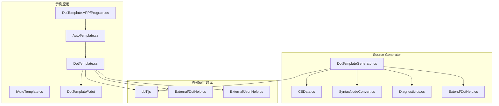
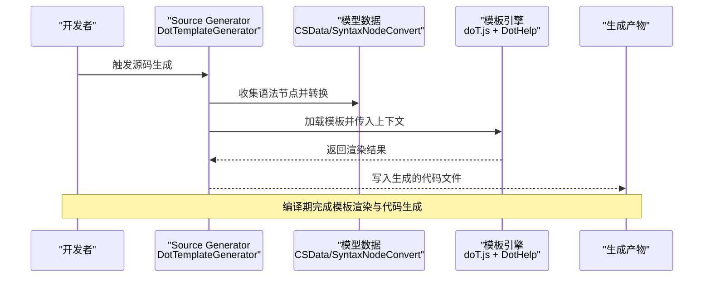
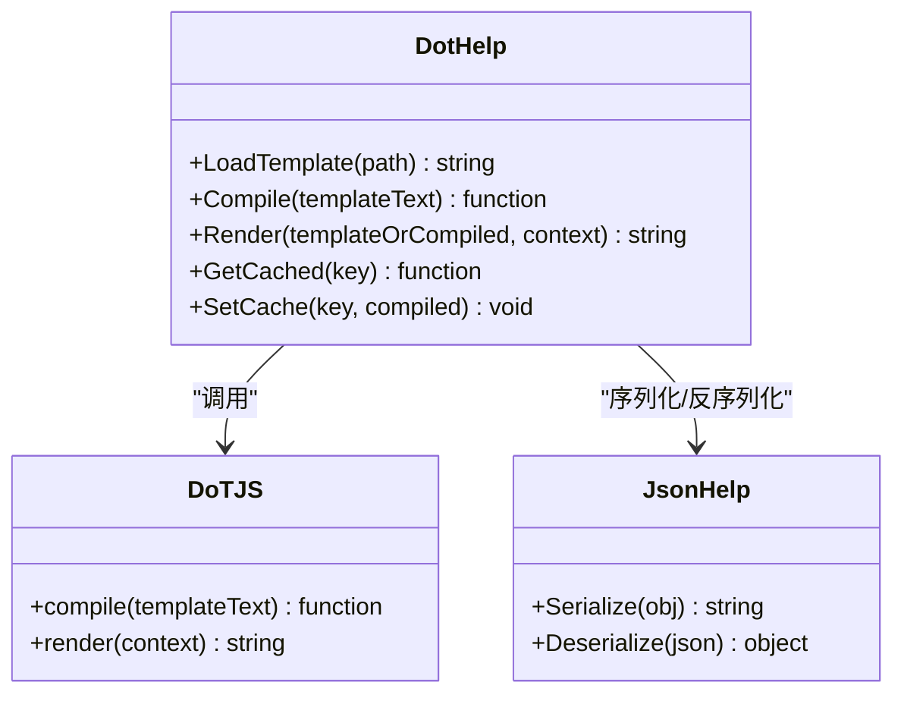
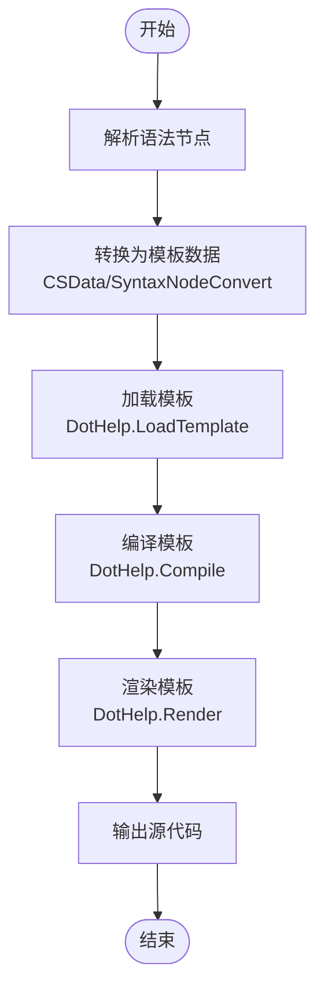
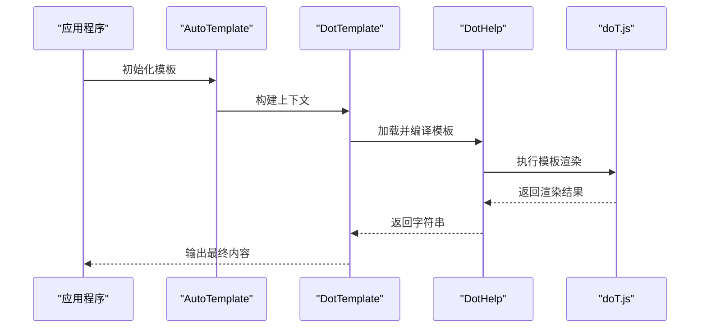
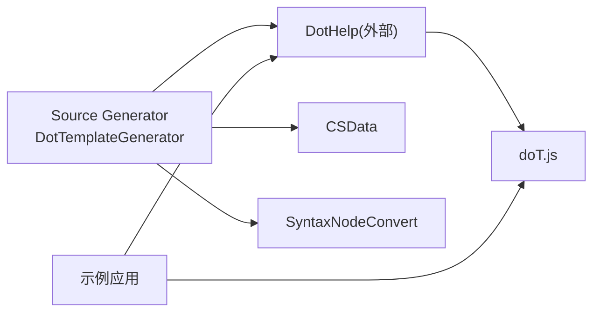

# 模板引擎机制

<cite>
**本文引用的文件**   
- [README.md](file://README.md)
- [DotTemplateGenerator.cs](file://src/AutoCode.XmlTemplate.SourceGenerator/DotTemplateGenerator.cs)
- [CSData.cs](file://src/AutoCode.XmlTemplate.SourceGenerator/CSData.cs)
- [SyntaxNodeConvert.cs](file://src/AutoCode.XmlTemplate.SourceGenerator/SyntaxNodeConvert.cs)
- [DiagnosticIds.cs](file://src/AutoCode.XmlTemplate.SourceGenerator/Extend/DiagnosticIds.cs)
- [DotHelp.cs](file://src/AutoCode.XmlTemplate.SourceGenerator/Extend/DotHelp.cs)
- [doT.js](file://src/AutoCode.XmlTemplate.External/doT.js)
- [DotHelp.cs](file://src/AutoCode.XmlTemplate.External/DotHelp.cs)
- [JsonHelp.cs](file://src/AutoCode.XmlTemplate.External/JsonHelp.cs)
- [AutoTemplate.cs](file://src/DotTemplate.APP/AutoTemplate.cs)
- [DotTemplate.cs](file://src/DotTemplate.APP/DotTemplate.cs)
- [IAutoTemplate.cs](file://src/DotTemplate.APP/IAutoTemplate.cs)
- [Program.cs](file://src/DotTemplate.APP/Program.cs)
- [Template.dot](file://src/DotTemplate.APP/DotTemplate/Template.dot)
- [ObjectCopy.dot](file://src/DotTemplate.APP/DotTemplate/ObjectCopy.dot)
- [Template_Caller.dot](file://src/DotTemplate.APP/DotTemplate/Template_Caller.dot)
</cite>

## 目录
1. [简介](#简介)
2. [项目结构](#项目结构)
3. [核心组件](#核心组件)
4. [架构总览](#架构总览)
5. [详细组件分析](#详细组件分析)
6. [依赖关系分析](#依赖关系分析)
7. [性能考量](#性能考量)
8. [故障排查指南](#故障排查指南)
9. [结论](#结论)
10. [附录：模板开发指南与API参考](#附录模板开发指南与api参考)

## 简介
本文件聚焦 AutoCode 框架中的模板引擎工作机制，围绕 doT.js 的集成方式、模板语法支持、渲染流程展开，并结合 Source Generator 的使用场景，说明如何在编译期通过模板动态生成代码。文档涵盖模板文件结构、变量替换、条件判断与循环控制等核心能力，提供模板设计模式、性能优化技巧与调试方法，并给出面向模板开发者的 API 参考与最佳实践建议。

## 项目结构
AutoCode 的模板相关能力主要分布在以下模块：
- 外部运行时库：doT.js 及 C# 封装（DotHelp、JsonHelp）
- Source Generator：基于 doT.js 的模板解析与代码生成（DotTemplateGenerator、CSData、SyntaxNodeConvert、诊断信息）
- 示例应用：演示模板使用与调用（DotTemplate.APP）

图表来源
- [DotTemplateGenerator.cs](file://src/AutoCode.XmlTemplate.SourceGenerator/DotTemplateGenerator.cs)
- [CSData.cs](file://src/AutoCode.XmlTemplate.SourceGenerator/CSData.cs)
- [SyntaxNodeConvert.cs](file://src/AutoCode.XmlTemplate.SourceGenerator/SyntaxNodeConvert.cs)
- [DiagnosticIds.cs](file://src/AutoCode.XmlTemplate.SourceGenerator/Extend/DiagnosticIds.cs)
- [doT.js](file://src/AutoCode.XmlTemplate.External/doT.js)
- [DotHelp.cs](file://src/AutoCode.XmlTemplate.External/DotHelp.cs)
- [JsonHelp.cs](file://src/AutoCode.XmlTemplate.External/JsonHelp.cs)
- [Program.cs](file://src/DotTemplate.APP/Program.cs)
- [AutoTemplate.cs](file://src/DotTemplate.APP/AutoTemplate.cs)
- [DotTemplate.cs](file://src/DotTemplate.APP/DotTemplate.cs)
- [IAutoTemplate.cs](file://src/DotTemplate.APP/IAutoTemplate.cs)
- [Template.dot](file://src/DotTemplate.APP/DotTemplate/Template.dot)
- [ObjectCopy.dot](file://src/DotTemplate.APP/DotTemplate/ObjectCopy.dot)
- [Template_Caller.dot](file://src/DotTemplate.APP/DotTemplate/Template_Caller.dot)

章节来源
- [README.md](file://README.md)

## 核心组件
- doT.js 运行时：JavaScript 模板引擎，负责模板编译与渲染
- DotHelp（外部）：C# 对 doT.js 的封装，提供模板加载、编译、渲染、缓存等能力
- JsonHelp（外部）：JSON 序列化/反序列化工具，用于在模板与 C# 之间传递数据
- DotTemplateGenerator（Source Generator）：在编译期读取 .dot 模板，结合模型数据生成目标代码
- CSData / SyntaxNodeConvert：将 Roslyn 语法节点转换为模板可用的数据结构
- 示例应用：展示模板定义、上下文构建与调用流程

章节来源
- [doT.js](file://src/AutoCode.XmlTemplate.External/doT.js)
- [DotHelp.cs](file://src/AutoCode.XmlTemplate.External/DotHelp.cs)
- [JsonHelp.cs](file://src/AutoCode.XmlTemplate.External/JsonHelp.cs)
- [DotTemplateGenerator.cs](file://src/AutoCode.XmlTemplate.SourceGenerator/DotTemplateGenerator.cs)
- [CSData.cs](file://src/AutoCode.XmlTemplate.SourceGenerator/CSData.cs)
- [SyntaxNodeConvert.cs](file://src/AutoCode.XmlTemplate.SourceGenerator/SyntaxNodeConvert.cs)

## 架构总览
下图展示了从模板到生成代码的整体流程：Source Generator 在编译期解析模板与模型，调用 doT.js 进行渲染；运行时示例通过 DotHelp 加载模板并渲染输出。

图表来源
- [DotTemplateGenerator.cs](file://src/AutoCode.XmlTemplate.SourceGenerator/DotTemplateGenerator.cs)
- [CSData.cs](file://src/AutoCode.XmlTemplate.SourceGenerator/CSData.cs)
- [SyntaxNodeConvert.cs](file://src/AutoCode.XmlTemplate.SourceGenerator/SyntaxNodeConvert.cs)
- [doT.js](file://src/AutoCode.XmlTemplate.External/doT.js)
- [DotHelp.cs](file://src/AutoCode.XmlTemplate.External/DotHelp.cs)

## 详细组件分析

### doT.js 集成与封装
- 集成方式：将 doT.js 作为外部资源嵌入，并通过 DotHelp 提供 C# 接口，屏蔽 JS 执行细节
- 关键职责：
  - 模板加载：从 .dot 文件或字符串获取模板文本
  - 模板编译：调用 doT.js 编译为可执行函数
  - 渲染执行：传入上下文对象，执行模板并返回结果
  - 缓存策略：避免重复编译，提升性能
- 错误处理：捕获模板语法错误与渲染异常，向上抛出结构化错误信息

图表来源
- [doT.js](file://src/AutoCode.XmlTemplate.External/doT.js)
- [DotHelp.cs](file://src/AutoCode.XmlTemplate.External/DotHelp.cs)
- [JsonHelp.cs](file://src/AutoCode.XmlTemplate.External/JsonHelp.cs)

章节来源
- [doT.js](file://src/AutoCode.XmlTemplate.External/doT.js)
- [DotHelp.cs](file://src/AutoCode.XmlTemplate.External/DotHelp.cs)
- [JsonHelp.cs](file://src/AutoCode.XmlTemplate.External/JsonHelp.cs)

### Source Generator 中的模板引擎使用
- 入口点：DotTemplateGenerator 实现 Roslyn SourceGenerator 接口
- 数据准备：通过 CSData 与 SyntaxNodeConvert 将语法树节点转换为模板可用数据
- 模板渲染：调用 DotHelp 加载模板、编译并渲染，得到目标代码文本
- 诊断与错误：使用 DiagnosticIds 定义诊断 ID，便于定位模板或数据问题

图表来源
- [DotTemplateGenerator.cs](file://src/AutoCode.XmlTemplate.SourceGenerator/DotTemplateGenerator.cs)
- [CSData.cs](file://src/AutoCode.XmlTemplate.SourceGenerator/CSData.cs)
- [SyntaxNodeConvert.cs](file://src/AutoCode.XmlTemplate.SourceGenerator/SyntaxNodeConvert.cs)
- [DiagnosticIds.cs](file://src/AutoCode.XmlTemplate.SourceGenerator/Extend/DiagnosticIds.cs)

章节来源
- [DotTemplateGenerator.cs](file://src/AutoCode.XmlTemplate.SourceGenerator/DotTemplateGenerator.cs)
- [CSData.cs](file://src/AutoCode.XmlTemplate.SourceGenerator/CSData.cs)
- [SyntaxNodeConvert.cs](file://src/AutoCode.XmlTemplate.SourceGenerator/SyntaxNodeConvert.cs)
- [DiagnosticIds.cs](file://src/AutoCode.XmlTemplate.SourceGenerator/Extend/DiagnosticIds.cs)

### 示例应用：模板运行与调用
- 模板定义：位于 DotTemplate/*.dot，包含变量占位、条件分支与循环
- 上下文构建：AutoTemplate/DotTemplate 负责构造模板上下文对象
- 调用流程：Program 启动后加载模板、设置上下文并渲染输出

图表来源
- [Program.cs](file://src/DotTemplate.APP/Program.cs)
- [AutoTemplate.cs](file://src/DotTemplate.APP/AutoTemplate.cs)
- [DotTemplate.cs](file://src/DotTemplate.APP/DotTemplate.cs)
- [IAutoTemplate.cs](file://src/DotTemplate.APP/IAutoTemplate.cs)
- [doT.js](file://src/AutoCode.XmlTemplate.External/doT.js)
- [DotHelp.cs](file://src/AutoCode.XmlTemplate.External/DotHelp.cs)

章节来源
- [Program.cs](file://src/DotTemplate.APP/Program.cs)
- [AutoTemplate.cs](file://src/DotTemplate.APP/AutoTemplate.cs)
- [DotTemplate.cs](file://src/DotTemplate.APP/DotTemplate.cs)
- [IAutoTemplate.cs](file://src/DotTemplate.APP/IAutoTemplate.cs)

## 依赖关系分析
- Source Generator 依赖外部 DotHelp 与 doT.js 进行模板渲染
- 示例应用依赖 DotHelp 与 doT.js 进行运行时模板渲染
- 数据层通过 CSData 与 SyntaxNodeConvert 桥接 Roslyn 与模板引擎

图表来源
- [DotTemplateGenerator.cs](file://src/AutoCode.XmlTemplate.SourceGenerator/DotTemplateGenerator.cs)
- [CSData.cs](file://src/AutoCode.XmlTemplate.SourceGenerator/CSData.cs)
- [SyntaxNodeConvert.cs](file://src/AutoCode.XmlTemplate.SourceGenerator/SyntaxNodeConvert.cs)
- [DotHelp.cs](file://src/AutoCode.XmlTemplate.External/DotHelp.cs)
- [doT.js](file://src/AutoCode.XmlTemplate.External/doT.js)

章节来源
- [DotTemplateGenerator.cs](file://src/AutoCode.XmlTemplate.SourceGenerator/DotTemplateGenerator.cs)
- [CSData.cs](file://src/AutoCode.XmlTemplate.SourceGenerator/CSData.cs)
- [SyntaxNodeConvert.cs](file://src/AutoCode.XmlTemplate.SourceGenerator/SyntaxNodeConvert.cs)
- [DotHelp.cs](file://src/AutoCode.XmlTemplate.External/DotHelp.cs)
- [doT.js](file://src/AutoCode.XmlTemplate.External/doT.js)

## 性能考量
- 模板缓存：避免重复编译相同模板，减少 CPU 开销
- 上下文复用：尽量复用已构建的上下文对象，降低序列化与分配成本
- 增量更新：在 Source Generator 中仅对变更部分进行渲染与生成
- 模板拆分：将大模板拆分为子模板，按需加载与组合
- JSON 优化：减少不必要的字段序列化，提高数据传输效率

[本节为通用指导，不直接分析具体文件]

## 故障排查指南
- 模板语法错误：检查模板语法是否符合 doT.js 规范，确认变量名与路径正确
- 渲染异常：查看上下文是否包含必需字段，确保类型匹配
- 缓存失效：清理缓存键冲突，确保模板版本与缓存一致
- 诊断信息：利用 DiagnosticIds 定位问题位置，结合日志输出上下文快照

章节来源
- [DiagnosticIds.cs](file://src/AutoCode.XmlTemplate.SourceGenerator/Extend/DiagnosticIds.cs)

## 结论
AutoCode 框架通过 doT.js 与 DotHelp 的封装，实现了高效的模板渲染能力，并在 Source Generator 中将其应用于编译期代码生成。通过合理的模板设计、缓存策略与上下文管理，可以在保证可读性与灵活性的同时获得良好的性能表现。

[本节为总结性内容，不直接分析具体文件]

## 附录：模板开发指南与API参考

### 模板语法支持
- 变量替换：使用占位符引用上下文属性
- 条件判断：根据布尔表达式输出不同片段
- 循环控制：遍历集合生成重复结构
- 子模板：引入其他模板片段以复用逻辑

章节来源
- [Template.dot](file://src/DotTemplate.APP/DotTemplate/Template.dot)
- [ObjectCopy.dot](file://src/DotTemplate.APP/DotTemplate/ObjectCopy.dot)
- [Template_Caller.dot](file://src/DotTemplate.APP/DotTemplate/Template_Caller.dot)

### 模板设计模式
- 分层模板：将布局、区块与内容分离，便于维护
- 参数化模板：通过上下文注入差异数据，实现多态生成
- 组合式模板：将多个子模板组合成完整输出

章节来源
- [Template.dot](file://src/DotTemplate.APP/DotTemplate/Template.dot)
- [ObjectCopy.dot](file://src/DotTemplate.APP/DotTemplate/ObjectCopy.dot)
- [Template_Caller.dot](file://src/DotTemplate.APP/DotTemplate/Template_Caller.dot)

### 性能优化技巧
- 启用模板缓存，避免重复编译
- 精简上下文对象，减少序列化开销
- 合理拆分模板，按需加载
- 避免在模板中进行复杂计算，提前在上下文预处理

[本节为通用指导，不直接分析具体文件]

### 调试方法
- 输出中间上下文：打印渲染前的上下文快照
- 逐步渲染：将大模板拆分为小段，逐段验证
- 诊断与日志：结合 DiagnosticIds 与日志定位问题

章节来源
- [DiagnosticIds.cs](file://src/AutoCode.XmlTemplate.SourceGenerator/Extend/DiagnosticIds.cs)

### API 参考（面向模板开发者）
- DotHelp
  - 加载模板：按路径或字符串加载模板文本
  - 编译模板：将模板文本编译为可执行函数
  - 渲染模板：传入上下文对象，返回渲染结果
  - 缓存操作：获取/设置编译后的模板函数
- JsonHelp
  - 序列化：将对象转为 JSON 字符串
  - 反序列化：将 JSON 字符串转为对象
- Source Generator
  - 入口：实现 SourceGenerator 接口，注册模板与数据转换
  - 数据转换：将 Roslyn 节点转换为模板可用数据
  - 诊断：定义诊断 ID，输出错误与警告

章节来源
- [DotHelp.cs](file://src/AutoCode.XmlTemplate.External/DotHelp.cs)
- [JsonHelp.cs](file://src/AutoCode.XmlTemplate.External/JsonHelp.cs)
- [DotTemplateGenerator.cs](file://src/AutoCode.XmlTemplate.SourceGenerator/DotTemplateGenerator.cs)
- [CSData.cs](file://src/AutoCode.XmlTemplate.SourceGenerator/CSData.cs)
- [SyntaxNodeConvert.cs](file://src/AutoCode.XmlTemplate.SourceGenerator/SyntaxNodeConvert.cs)
- [DiagnosticIds.cs](file://src/AutoCode.XmlTemplate.SourceGenerator/Extend/DiagnosticIds.cs)
