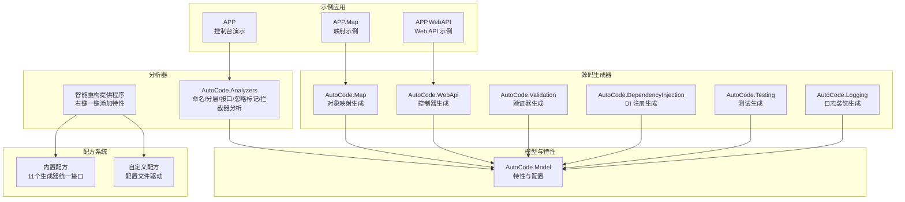
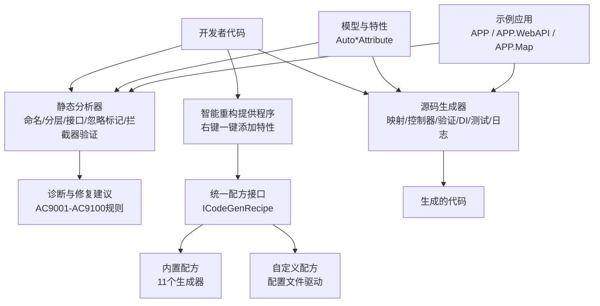
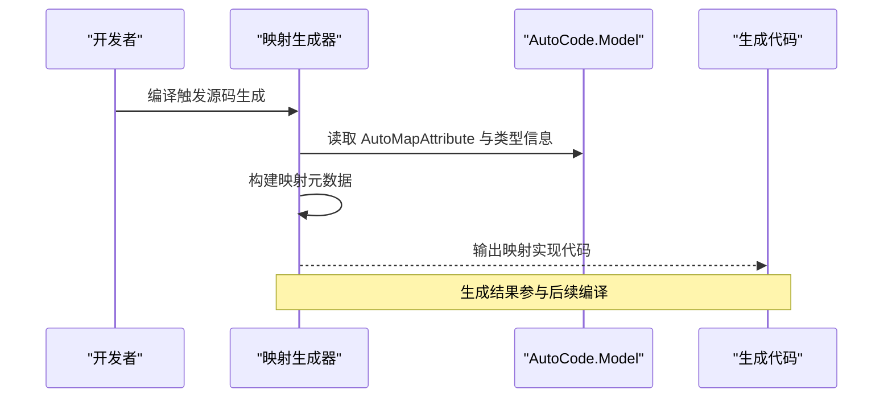
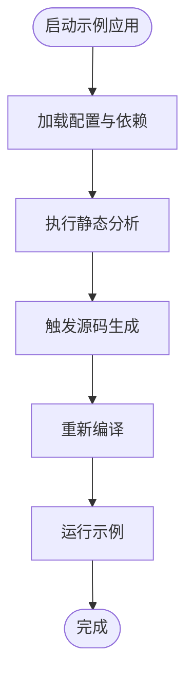
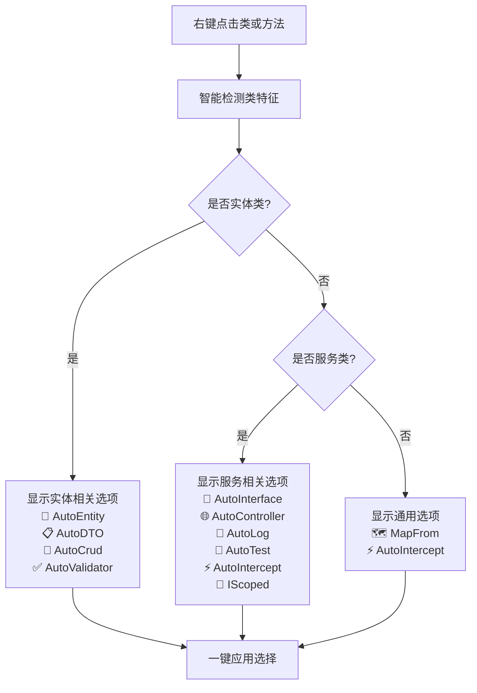
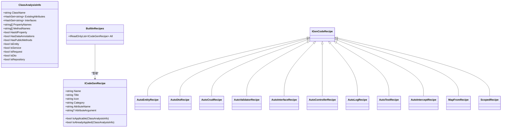
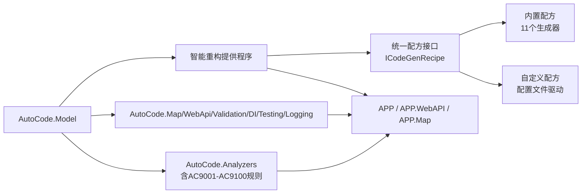

# 静态代码分析器

<cite>
**本文引用的文件**   
- [README.md](file://README.md)
- [AutoCode.sln](file://src/AutoCode.sln)
- [Program.cs](file://src/APP/Program.cs)
- [AnalyzerDemo.cs](file://src/APP/AnalyzerDemo.cs)
- [InterfaceDivergenceAnalyzer.cs](file://src/AutoCode.Analyzers/Analyzers/InterfaceDivergenceAnalyzer.cs)
- [LayerViolationAnalyzer.cs](file://src/AutoCode.Analyzers/Analyzers/LayerViolationAnalyzer.cs)
- [MissingAutoInterfaceAnalyzer.cs](file://src/AutoCode.Analyzers/Analyzers/MissingAutoInterfaceAnalyzer.cs)
- [NamingConventionAnalyzer.cs](file://src/AutoCode.Analyzers/Analyzers/NamingConventionAnalyzer.cs)
- [UnusedAutoIgnoreAnalyzer.cs](file://src/AutoCode.Analyzers/Analyzers/UnusedAutoIgnoreAnalyzer.cs)
- [AddAutoInterfaceCodeFix.cs](file://src/AutoCode.Analyzers/CodeFixes/AddAutoInterfaceCodeFix.cs)
- [AutoCodeRefactoringProvider.cs](file://src/AutoCode.Analyzers/CodeFixes/AutoCodeRefactoringProvider.cs)
- [GenerateHandlerRefactoring.cs](file://src/AutoCode.Analyzers/CodeFixes/GenerateHandlerRefactoring.cs)
- [RemoveAutoIgnoreCodeFix.cs](file://src/AutoCode.Analyzers/CodeFixes/RemoveAutoIgnoreCodeFix.cs)
- [SmartAutoCodeFix.cs](file://src/AutoCode.Analyzers/CodeFixes/SmartAutoCodeFix.cs)
- [AutoCodeDiagnosticDescriptors.cs](file://src/AutoCode.Analyzers/Diagnostics/AutoCodeDiagnosticDescriptors.cs)
- [BuiltInRecipes.cs](file://src/AutoCode.Analyzers/Recipes/BuiltInRecipes.cs)
- [ICodeGenRecipe.cs](file://src/AutoCode.Analyzers/Recipes/ICodeGenRecipe.cs)
- [CustomRecipeAdapter.cs](file://src/AutoCode.Analyzers/Recipes/CustomRecipeAdapter.cs)
- [MapperGenerator.cs](file://src/AutoCode.Map/MapperGenerator.cs)
- [AutoCode.Map.csproj](file://src/AutoCode.Map/AutoCode.Map.csproj)
- [AutoCode.Model.csproj](file://src/AutoCode.Model/AutoCode.Model.csproj)
- [AutoMapAttribute.cs](file://src/AutoCode.Model/AutoMapAttribute.cs)
- [AutoControllerAttribute.cs](file://src/AutoCode.Model/AutoControllerAttribute.cs)
- [AutoDTOAttribute.cs](file://src/AutoCode.Model/AutoDTOAttribute.cs)
- [AutoLogAttribute.cs](file://src/AutoCode.Model/AutoLogAttribute.cs)
- [AutoTestAttribute.cs](file://src/AutoCode.Model/AutoTestAttribute.cs)
- [AutoValidatorAttribute.cs](file://src/AutoCode.Model/AutoValidatorAttribute.cs)
- [Behavior.cs](file://src/Auto.MapModels/Behavior.cs)
- [UserInfo.cs](file://src/APP.Map/UserInfo.cs)
- [Controllers/BookingController.cs](file://src/APP.WebAPI/Controllers/BookingController.cs)
- [Services/BookingService.cs](file://src/APP.WebAPI/Services/BookingService.cs)
- [Services/UserService.cs](file://src/APP.WebAPI/Services/UserService.cs)
- [Models/Requests.cs](file://src/APP.WebAPI/Models/Requests.cs)
- [Models/UserDto.cs](file://src/APP.WebAPI/Models/UserDto.cs)
- [Models/UserEntity.cs](file://src/APP.WebAPI/Models/UserEntity.cs)
- [DependencyInjectionServiceCollectionExtensions.cs](file://src/APP.WebAPI.Core/DependencyInjection/DependencyInjectionServiceCollectionExtensions.cs)
- [AppCore.cs](file://src/APP.WebAPI.Core/Application/AppCore.cs)
- [IServiceCollectionExtensions.cs](file://src/APP.WebAPI.Core/Application/Extensions/ServiceCollectionExtensions.cs)
- [IDependencyBase.cs](file://src/APP.WebAPI.Core/DependencyInjection/LifeType/IDependencyBase.cs)
- [IScoped.cs](file://src/APP.WebAPI.Core/DependencyInjection/LifeType/IScoped.cs)
- [ISingleton.cs](file://src/APP.WebAPI.Core/DependencyInjection/LifeType/ISingleton.cs)
- [ITransient.cs](file://src/APP.WebAPI.Core/DependencyInjection/LifeType/ITransient.cs)
- [AutoCode.Tests.csproj](file://src/AutoCode.Tests/AutoCode.Tests.csproj)
- [AnalyzerTests.cs](file://src/AutoCode.Tests/AnalyzerTests.cs)
- [autocode.json](file://autocode.json)
</cite>

## 更新摘要
**所做更改**   
- 新增智能重构提供程序，支持右键一键添加特性与接口
- 实现智能检测逻辑，自动识别实体类、服务类、请求类等类型特征
- 统一内置配方接口，支持11个生成器的统一管理与扩展
- 增强自定义配方支持，通过配置文件动态注册生成规则
- 更新架构总览图，反映新的智能推荐机制

## 目录
1. [简介](#简介)
2. [项目结构](#项目结构)
3. [核心组件](#核心组件)
4. [架构总览](#架构总览)
5. [详细组件分析](#详细组件分析)
6. [智能重构提供程序](#智能重构提供程序)
7. [内置配方系统](#内置配方系统)
8. [依赖关系分析](#依赖关系分析)
9. [性能考量](#性能考量)
10. [故障排查指南](#故障排查指南)
11. [结论](#结论)
12. [附录](#附录)

## 简介
本项目是一个面向 .NET 的"静态代码分析器与源码生成器"一体化平台。它通过 Roslyn 在编译期对代码进行静态分析，提供诊断与修复建议，并基于约定与特性（Attribute）自动生成接口、映射、控制器、日志装饰、验证规则与测试骨架等代码，从而减少样板代码、统一规范、提升一致性与可维护性。

- 静态分析：命名规范、分层违规、接口分歧、未使用的忽略标记、拦截器验证等。
- 源码生成：DTO 映射、Web API 控制器、依赖注入注册、日志装饰、验证器、测试用例。
- **智能重构**：右键一键添加特性、智能类型识别、统一配方管理。
- 扩展能力：模板引擎与外部扩展支持，便于自定义生成逻辑。

本仓库同时包含示例应用（控制台、WebAPI）、演示与分析器测试，帮助快速上手与验证功能。

## 项目结构
整体采用多项目解决方案组织，按职责划分模块：
- AutoCode.Analyzers：静态分析器与代码修复实现，新增智能重构提供程序。
- AutoCode.Map / AutoCode.WebApi / AutoCode.Validation / AutoCode.DependencyInjection / AutoCode.Testing / AutoCode.Logging：各类源码生成器。
- AutoCode.Model：通用模型与特性定义（如 AutoMapAttribute、AutoControllerAttribute 等）。
- APP / APP.WebAPI / APP.Map：示例应用与映射演示。
- AutoCode.Tests：分析器与生成器的单元测试。
- AutoCode.SourceGenerator.Extensions：NuGet 包与工具脚本。



**图表来源**
- [AutoCode.Analyzers.csproj](file://src/AutoCode.Analyzers/AutoCode.Analyzers.csproj)
- [AutoCode.Map.csproj](file://src/AutoCode.Map/AutoCode.Map.csproj)
- [AutoCode.Model.csproj](file://src/AutoCode.Model/AutoCode.Model.csproj)
- [AutoCode.sln](file://src/AutoCode.sln)

**章节来源**
- [AutoCode.sln](file://src/AutoCode.sln)
- [README.md](file://README.md)

## 核心组件
- 静态分析器集合
  - 命名规范分析器：检查类、方法、属性等是否符合约定。
  - 分层违规分析器：检测跨层调用或不当依赖。
  - 接口分歧分析器：识别接口与其实现之间的不一致。
  - 未使用 AutoIgnore 分析器：提示未被引用的忽略标记。
  - 拦截器验证分析器：验证拦截器实现的正确性和完整性。
- **智能重构提供程序**
  - 右键一键添加：支持 Ctrl+. 快捷键快速添加特性与接口。
  - 智能类型识别：自动识别实体类、服务类、请求类、DTO 等类型特征。
  - 统一配方管理：基于 ICodeGenRecipe 接口的统一推荐机制。
- 代码修复（Code Fix）
  - 自动添加缺失的 AutoInterface。
  - 移除未使用的 AutoIgnore。
  - 智能代码修复：根据上下文自动生成合适的代码。
  - 处理器重构：为拦截器生成处理器代码。
- 诊断描述
  - 统一的诊断 ID、标题、消息模板与严重级别。
- 源码生成器
  - 映射生成器：根据特性与类型信息生成映射代码。
  - Web API 控制器生成器：基于模型与特性生成控制器。
  - 验证器生成器：基于模型字段生成验证规则。
  - DI 注册生成器：扫描生命周期接口并生成注册代码。
  - 测试生成器：为业务逻辑生成基础测试骨架。
  - 日志装饰生成器：为服务方法生成日志包装。
- 模型与特性
  - 定义各生成器所需的特性（如 AutoMapAttribute、AutoControllerAttribute、AutoDTOAttribute、AutoLogAttribute、AutoTestAttribute、AutoValidatorAttribute）。
  - 提供通用选项与枚举策略。

**章节来源**
- [InterfaceDivergenceAnalyzer.cs](file://src/AutoCode.Analyzers/Analyzers/InterfaceDivergenceAnalyzer.cs)
- [LayerViolationAnalyzer.cs](file://src/AutoCode.Analyzers/Analyzers/LayerViolationAnalyzer.cs)
- [MissingAutoInterfaceAnalyzer.cs](file://src/AutoCode.Analyzers/Analyzers/MissingAutoInterfaceAnalyzer.cs)
- [NamingConventionAnalyzer.cs](file://src/AutoCode.Analyzers/Analyzers/NamingConventionAnalyzer.cs)
- [UnusedAutoIgnoreAnalyzer.cs](file://src/AutoCode.Analyzers/Analyzers/UnusedAutoIgnoreAnalyzer.cs)
- [AutoCodeRefactoringProvider.cs](file://src/AutoCode.Analyzers/CodeFixes/AutoCodeRefactoringProvider.cs)
- [AddAutoInterfaceCodeFix.cs](file://src/AutoCode.Analyzers/CodeFixes/AddAutoInterfaceCodeFix.cs)
- [GenerateHandlerRefactoring.cs](file://src/AutoCode.Analyzers/CodeFixes/GenerateHandlerRefactoring.cs)
- [RemoveAutoIgnoreCodeFix.cs](file://src/AutoCode.Analyzers/CodeFixes/RemoveAutoIgnoreCodeFix.cs)
- [SmartAutoCodeFix.cs](file://src/AutoCode.Analyzers/CodeFixes/SmartAutoCodeFix.cs)
- [AutoCodeDiagnosticDescriptors.cs](file://src/AutoCode.Analyzers/Diagnostics/AutoCodeDiagnosticDescriptors.cs)
- [MapperGenerator.cs](file://src/AutoCode.Map/MapperGenerator.cs)
- [AutoCode.Map.csproj](file://src/AutoCode.Map/AutoCode.Map.csproj)
- [AutoCode.Model.csproj](file://src/AutoCode.Model/AutoCode.Model.csproj)
- [AutoMapAttribute.cs](file://src/AutoCode.Model/AutoMapAttribute.cs)
- [AutoControllerAttribute.cs](file://src/AutoCode.Model/AutoControllerAttribute.cs)
- [AutoDTOAttribute.cs](file://src/AutoCode.Model/AutoDTOAttribute.cs)
- [AutoLogAttribute.cs](file://src/AutoCode.Model/AutoLogAttribute.cs)
- [AutoTestAttribute.cs](file://src/AutoCode.Model/AutoTestAttribute.cs)
- [AutoValidatorAttribute.cs](file://src/AutoCode.Model/AutoValidatorAttribute.cs)

## 架构总览
系统由"分析器 + 生成器 + 模型特性 + 智能重构 + 示例应用"构成。分析器在编译期运行，输出诊断；生成器基于特性与语法树生成目标代码；智能重构提供程序通过右键菜单提供一键式开发体验；示例应用展示如何使用这些能力。



**图表来源**
- [AutoCode.Analyzers.csproj](file://src/AutoCode.Analyzers/AutoCode.Analyzers.csproj)
- [AutoCode.Map.csproj](file://src/AutoCode.Map/AutoCode.Map.csproj)
- [AutoCode.Model.csproj](file://src/AutoCode.Model/AutoCode.Model.csproj)
- [Program.cs](file://src/APP/Program.cs)
- [Controllers/BookingController.cs](file://src/APP.WebAPI/Controllers/BookingController.cs)
- [UserInfo.cs](file://src/APP.Map/UserInfo.cs)

## 详细组件分析

### 静态分析器组件
- 命名规范分析器
  - 作用：校验标识符命名是否符合约定（如类名、方法名、属性名等）。
  - 行为：遍历语法节点，匹配命名模式，不符合则报告诊断。
- 分层违规分析器
  - 作用：检测跨层调用（如 UI 直接访问数据层），违反分层架构。
  - 行为：基于命名空间与引用关系判断层级，越界即告警。
- 接口分歧分析器
  - 作用：对比接口与其实现的成员差异，发现新增/删除成员未同步。
  - 行为：收集接口与实现，比较成员集合，输出不一致项。
- 未使用 AutoIgnore 分析器
  - 作用：定位未被任何地方引用的 AutoIgnore 标记，提示清理。
  - 行为：统计引用计数，零引用则报告。
- 拦截器验证分析器
  - 作用：验证拦截器实现是否符合框架要求，确保拦截链正确性。
  - 行为：检查拦截器接口实现、方法签名、异常处理等。
- 代码修复
  - 自动添加缺失的 AutoInterface：为需要暴露接口的类型补全接口声明与实现。
  - 移除未使用的 AutoIgnore：安全删除无引用的忽略标记。
  - 智能代码修复：根据上下文自动生成合适的代码片段。
  - 处理器重构：为拦截器自动生成处理器实现代码。

```mermaid
classDiagram
class InterfaceDivergenceAnalyzer {
+Analyze() void
+ReportDiagnostics() void
}
class LayerViolationAnalyzer {
+Analyze() void
+CheckLayerAccess() void
}
class MissingAutoInterfaceAnalyzer {
+Analyze() void
+FindMissingInterfaces() void
}
class NamingConventionAnalyzer {
+Analyze() void
+ValidateIdentifier() void
}
class UnusedAutoIgnoreAnalyzer {
+Analyze() void
+CountReferences() void
}
class InterceptorValidationAnalyzer {
+Analyze() void
+ValidateInterceptorImplementation() void
}
class AddAutoInterfaceCodeFix {
+ApplyFix() void
+GenerateInterface() void
}
class GenerateHandlerRefactoring {
+ApplyFix() void
+GenerateHandlerCode() void
}
class RemoveAutoIgnoreCodeFix {
+ApplyFix() void
+RemoveUnusedAttribute() void
}
class SmartAutoCodeFix {
+ApplyFix() void
+IntelligentCodeGeneration() void
}
class AutoCodeDiagnosticDescriptors {
+Ids map
+Messages map
+Severity map
}
InterfaceDivergenceAnalyzer --> AutoCodeDiagnosticDescriptors : "使用"
LayerViolationAnalyzer --> AutoCodeDiagnosticDescriptors : "使用"
MissingAutoInterfaceAnalyzer --> AutoCodeDiagnosticDescriptors : "使用"
NamingConventionAnalyzer --> AutoCodeDiagnosticDescriptors : "使用"
UnusedAutoIgnoreAnalyzer --> AutoCodeDiagnosticDescriptors : "使用"
InterceptorValidationAnalyzer --> AutoCodeDiagnosticDescriptors : "使用"
AddAutoInterfaceCodeFix --> AutoCodeDiagnosticDescriptors : "使用"
GenerateHandlerRefactoring --> AutoCodeDiagnosticDescriptors : "使用"
RemoveAutoIgnoreCodeFix --> AutoCodeDiagnosticDescriptors : "使用"
SmartAutoCodeFix --> AutoCodeDiagnosticDescriptors : "使用"
```



**图表来源**
- [InterfaceDivergenceAnalyzer.cs](file://src/AutoCode.Analyzers/Analyzers/InterfaceDivergenceAnalyzer.cs)
- [LayerViolationAnalyzer.cs](file://src/AutoCode.Analyzers/Analyzers/LayerViolationAnalyzer.cs)
- [MissingAutoInterfaceAnalyzer.cs](file://src/AutoCode.Analyzers/Analyzers/MissingAutoInterfaceAnalyzer.cs)
- [NamingConventionAnalyzer.cs](file://src/AutoCode.Analyzers/Analyzers/NamingConventionAnalyzer.cs)
- [UnusedAutoIgnoreAnalyzer.cs](file://src/AutoCode.Analyzers/Analyzers/UnusedAutoIgnoreAnalyzer.cs)
- [AddAutoInterfaceCodeFix.cs](file://src/AutoCode.Analyzers/CodeFixes/AddAutoInterfaceCodeFix.cs)
- [GenerateHandlerRefactoring.cs](file://src/AutoCode.Analyzers/CodeFixes/GenerateHandlerRefactoring.cs)
- [RemoveAutoIgnoreCodeFix.cs](file://src/AutoCode.Analyzers/CodeFixes/RemoveAutoIgnoreCodeFix.cs)
- [SmartAutoCodeFix.cs](file://src/AutoCode.Analyzers/CodeFixes/SmartAutoCodeFix.cs)
- [AutoCodeDiagnosticDescriptors.cs](file://src/AutoCode.Analyzers/Diagnostics/AutoCodeDiagnosticDescriptors.cs)

**章节来源**
- [InterfaceDivergenceAnalyzer.cs](file://src/AutoCode.Analyzers/Analyzers/InterfaceDivergenceAnalyzer.cs)
- [LayerViolationAnalyzer.cs](file://src/AutoCode.Analyzers/Analyzers/LayerViolationAnalyzer.cs)
- [MissingAutoInterfaceAnalyzer.cs](file://src/AutoCode.Analyzers/Analyzers/MissingAutoInterfaceAnalyzer.cs)
- [NamingConventionAnalyzer.cs](file://src/AutoCode.Analyzers/Analyzers/NamingConventionAnalyzer.cs)
- [UnusedAutoIgnoreAnalyzer.cs](file://src/AutoCode.Analyzers/Analyzers/UnusedAutoIgnoreAnalyzer.cs)
- [AddAutoInterfaceCodeFix.cs](file://src/AutoCode.Analyzers/CodeFixes/AddAutoInterfaceCodeFix.cs)
- [GenerateHandlerRefactoring.cs](file://src/AutoCode.Analyzers/CodeFixes/GenerateHandlerRefactoring.cs)
- [RemoveAutoIgnoreCodeFix.cs](file://src/AutoCode.Analyzers/CodeFixes/RemoveAutoIgnoreCodeFix.cs)
- [SmartAutoCodeFix.cs](file://src/AutoCode.Analyzers/CodeFixes/SmartAutoCodeFix.cs)
- [AutoCodeDiagnosticDescriptors.cs](file://src/AutoCode.Analyzers/Diagnostics/AutoCodeDiagnosticDescriptors.cs)

### 源码生成器组件（以映射为例）
- 映射生成器
  - 输入：带有 AutoMapAttribute 的类型与属性映射策略。
  - 处理：解析语法树与特性，构建映射元数据，生成映射代码。
  - 输出：强类型映射实现，减少手动编写映射逻辑。



**图表来源**
- [MapperGenerator.cs](file://src/AutoCode.Map/MapperGenerator.cs)
- [AutoCode.Map.csproj](file://src/AutoCode.Map/AutoCode.Map.csproj)
- [AutoCode.Model.csproj](file://src/AutoCode.Model/AutoCode.Model.csproj)
- [AutoMapAttribute.cs](file://src/AutoCode.Model/AutoMapAttribute.cs)

**章节来源**
- [MapperGenerator.cs](file://src/AutoCode.Map/MapperGenerator.cs)
- [AutoCode.Map.csproj](file://src/AutoCode.Map/AutoCode.Map.csproj)
- [AutoCode.Model.csproj](file://src/AutoCode.Model/AutoCode.Model.csproj)
- [AutoMapAttribute.cs](file://src/AutoCode.Model/AutoMapAttribute.cs)

### 示例应用与集成点
- 控制台演示（APP）
  - Program.cs：入口程序，用于演示分析器与生成器的效果。
  - AnalyzerDemo.cs：具体演示场景，触发分析与生成流程。
- Web API 示例（APP.WebAPI）
  - Controllers/BookingController.cs：控制器示例，可能结合控制器生成器。
  - Services/BookingService.cs、UserService.cs：服务层示例。
  - Models/Requests.cs、UserDto.cs、UserEntity.cs：请求与数据传输模型。
- 映射示例（APP.Map）
  - UserInfo.cs：演示映射特性的使用与生成结果。



**图表来源**
- [Program.cs](file://src/APP/Program.cs)
- [AnalyzerDemo.cs](file://src/APP/AnalyzerDemo.cs)
- [Controllers/BookingController.cs](file://src/APP.WebAPI/Controllers/BookingController.cs)
- [Services/BookingService.cs](file://src/APP.WebAPI/Services/BookingService.cs)
- [Services/UserService.cs](file://src/APP.WebAPI/Services/UserService.cs)
- [Models/Requests.cs](file://src/APP.WebAPI/Models/Requests.cs)
- [Models/UserDto.cs](file://src/APP.WebAPI/Models/UserDto.cs)
- [Models/UserEntity.cs](file://src/APP.WebAPI/Models/UserEntity.cs)
- [UserInfo.cs](file://src/APP.Map/UserInfo.cs)

**章节来源**
- [Program.cs](file://src/APP/Program.cs)
- [AnalyzerDemo.cs](file://src/APP/AnalyzerDemo.cs)
- [Controllers/BookingController.cs](file://src/APP.WebAPI/Controllers/BookingController.cs)
- [Services/BookingService.cs](file://src/APP.WebAPI/Services/BookingService.cs)
- [Services/UserService.cs](file://src/APP.WebAPI/Services/UserService.cs)
- [Models/Requests.cs](file://src/APP.WebAPI/Models/Requests.cs)
- [Models/UserDto.cs](file://src/APP.WebAPI/Models/UserDto.cs)
- [Models/UserEntity.cs](file://src/APP.WebAPI/Models/UserEntity.cs)
- [UserInfo.cs](file://src/APP.Map/UserInfo.cs)

## 智能重构提供程序

**新增** 智能重构提供程序是本次更新的核心功能，提供了统一的右键菜单体验，支持一键添加各种特性与接口。

### 智能类型识别
提供程序能够自动识别不同类型的类，并提供相应的推荐：

- **实体类识别**：包含 Id 属性的类，推荐 AutoEntity、AutoDTO、MapFrom、AutoCrud、AutoValidator
- **服务类识别**：名称以 Service 结尾的类，推荐 AutoInterface、AutoController、AutoLog、AutoTest、AutoIntercept、IScoped
- **请求类识别**：名称以 Request 或 Command 结尾的类，推荐 AutoValidator、AutoDTO
- **DTO 类识别**：名称以 Dto 或 Response 结尾的类，推荐 MapFrom
- **仓储类识别**：名称以 Repository 结尾的类，推荐 AutoInterface、IScoped
- **公共方法识别**：任意包含 public 方法的类，推荐 AutoIntercept 并生成 Handler

### 右键菜单功能


**图表来源**
- [AutoCodeRefactoringProvider.cs:32-52](file://src/AutoCode.Analyzers/CodeFixes/AutoCodeRefactoringProvider.cs#L32-L52)
- [AutoCodeRefactoringProvider.cs:56-113](file://src/AutoCode.Analyzers/CodeFixes/AutoCodeRefactoringProvider.cs#L56-L113)

### 方法级推荐
对于包含公共方法的类，提供程序还会提供方法级别的推荐：

- **拦截器推荐**：为方法添加 [AutoIntercept] 特性，启用日志和指标收集
- **跳过拦截推荐**：为特定方法添加 [SkipIntercept] 特性，跳过拦截处理

**章节来源**
- [AutoCodeRefactoringProvider.cs:15-28](file://src/AutoCode.Analyzers/CodeFixes/AutoCodeRefactoringProvider.cs#L15-L28)
- [AutoCodeRefactoringProvider.cs:32-52](file://src/AutoCode.Analyzers/CodeFixes/AutoCodeRefactoringProvider.cs#L32-L52)
- [AutoCodeRefactoringProvider.cs:184-213](file://src/AutoCode.Analyzers/CodeFixes/AutoCodeRefactoringProvider.cs#L184-L213)

## 内置配方系统

**新增** 内置配方系统通过统一的 ICodeGenRecipe 接口管理所有11个生成器的推荐逻辑，取代了原有的硬编码 if-else 结构。

### 统一接口设计


**图表来源**
- [ICodeGenRecipe.cs:10-58](file://src/AutoCode.Analyzers/Recipes/ICodeGenRecipe.cs#L10-L58)
- [BuiltInRecipes.cs:12-26](file://src/AutoCode.Analyzers/Recipes/BuiltInRecipes.cs#L12-L26)

### 智能推断逻辑
每个配方都实现了智能的适用性判断逻辑：

- **实体类配方**：检测是否包含 Id 属性且不是服务、请求、DTO 或仓储类
- **服务类配方**：检测类名是否以 Service 结尾
- **请求类配方**：检测类名是否以 Request 或 Command 结尾
- **DTO 类配方**：检测类名是否以 Dto 或 Response 结尾
- **仓储类配方**：检测类名是否以 Repository 结尾

### 自定义配方支持
系统还支持通过 autocode.json 配置文件动态注册自定义配方：

```json
{
  "customGenerators": [
    {
      "name": "auditService",
      "title": "添加审计日志服务",
      "icon": "📝",
      "category": "Service",
      "trigger": {
        "classPattern": "*Service",
        "attributeName": "AutoAudit"
      },
      "output": {
        "template": "templates/AuditService.liquid",
        "fileName": "{ClassName}Audit.g.cs",
        "namespace": "{SourceNamespace}.Audit"
      }
    }
  ]
}
```

**章节来源**
- [ICodeGenRecipe.cs:6-35](file://src/AutoCode.Analyzers/Recipes/ICodeGenRecipe.cs#L6-L35)
- [BuiltInRecipes.cs:6-26](file://src/AutoCode.Analyzers/Recipes/BuiltInRecipes.cs#L6-L26)
- [BuiltInRecipes.cs:30-196](file://src/AutoCode.Analyzers/Recipes/BuiltInRecipes.cs#L30-L196)
- [CustomRecipeAdapter.cs:8-94](file://src/AutoCode.Analyzers/Recipes/CustomRecipeAdapter.cs#L8-L94)
- [autocode.json:72-103](file://autocode.json#L72-L103)

## 依赖关系分析
- 分析器与模型
  - 所有分析器依赖 AutoCode.Model 中的特性与配置，用于识别目标元素与规则。
- 生成器与模型
  - 各生成器（映射、控制器、验证、DI、测试、日志）均依赖 AutoCode.Model 的特性定义。
- **智能重构与配方**
  - 智能重构提供程序依赖统一的 ICodeGenRecipe 接口，管理内置和自定义配方。
- 示例与应用
  - 示例应用通过引入分析器与生成器，体验编译期增强与代码生成。



**图表来源**
- [AutoCode.Model.csproj](file://src/AutoCode.Model/AutoCode.Model.csproj)
- [AutoCode.Analyzers.csproj](file://src/AutoCode.Analyzers/AutoCode.Analyzers.csproj)
- [AutoCode.Map.csproj](file://src/AutoCode.Map/AutoCode.Map.csproj)
- [AutoCode.sln](file://src/AutoCode.sln)

**章节来源**
- [AutoCode.Model.csproj](file://src/AutoCode.Model/AutoCode.Model.csproj)
- [AutoCode.Analyzers.csproj](file://src/AutoCode.Analyzers/AutoCode.Analyzers.csproj)
- [AutoCode.Map.csproj](file://src/AutoCode.Map/AutoCode.Map.csproj)
- [AutoCode.sln](file://src/AutoCode.sln)

## 性能考量
- 增量分析
  - 利用 Roslyn 增量分析能力，仅对变更部分进行分析与生成，降低编译开销。
- 轻量诊断
  - 诊断规则尽量简单高效，避免复杂计算与 I/O 操作。
- 生成优化
  - 生成器缓存元数据，减少重复解析；按需生成最小化代码。
- 资源管理
  - 及时释放语法树与语义分析结果，避免内存占用过高。
- **智能重构优化**
  - 智能类型识别采用高效的字符串匹配算法，避免不必要的语义分析。
  - 配方系统采用延迟加载策略，仅在需要时加载自定义配方配置。
  - 右键菜单响应时间控制在毫秒级，提供良好的用户体验。

## 故障排查指南
- 常见问题
  - 诊断未触发：确认特性是否正确标注，命名空间与引用是否完整。
  - 生成失败：检查模型定义与特性参数是否合法，确保类型可解析。
  - 运行时异常：查看生成代码是否存在冲突或循环依赖。
  - 拦截器验证失败：检查拦截器实现是否符合AC9001-AC9100规则要求。
  - **智能重构不显示**：确认类特征是否匹配推荐条件，检查配置文件格式。
- 调试建议
  - 启用详细日志，定位分析器与生成器执行路径。
  - 使用单元测试（AnalyzerTests）复现问题，缩小范围。
  - 针对AC9001-AC9100规则，使用IDE的诊断窗口查看详细信息。
  - **调试智能重构**：检查类名是否符合命名约定，验证配置文件语法。
- 修复步骤
  - 依据诊断消息修正命名或分层问题。
  - 使用提供的 Code Fix 自动修复缺失接口或未使用标记。
  - 对于拦截器相关问题，使用智能代码修复自动生成符合规范的实现。
  - **修复智能重构问题**：调整类命名约定，修正配置文件格式。

**章节来源**
- [AnalyzerTests.cs](file://src/AutoCode.Tests/AnalyzerTests.cs)
- [AutoCodeDiagnosticDescriptors.cs](file://src/AutoCode.Analyzers/Diagnostics/AutoCodeDiagnosticDescriptors.cs)
- [AddAutoInterfaceCodeFix.cs](file://src/AutoCode.Analyzers/CodeFixes/AddAutoInterfaceCodeFix.cs)
- [RemoveAutoIgnoreCodeFix.cs](file://src/AutoCode.Analyzers/CodeFixes/RemoveAutoIgnoreCodeFix.cs)
- [SmartAutoCodeFix.cs](file://src/AutoCode.Analyzers/CodeFixes/SmartAutoCodeFix.cs)
- [GenerateHandlerRefactoring.cs](file://src/AutoCode.Analyzers/CodeFixes/GenerateHandlerRefactoring.cs)

## 结论
该项目将静态分析与源码生成深度融合，通过特性驱动与约定优先的方式，显著减少样板代码、统一开发规范、提升质量与效率。分析器保障代码健康，生成器加速开发，示例应用帮助快速上手。**新增的智能重构提供程序和统一配方系统进一步提升了开发体验**，通过右键一键操作和智能类型识别，让开发者无需记忆复杂的特性名称，即可快速应用各种生成器功能。

**主要改进**：
- 智能重构提供程序：右键一键添加特性与接口，支持智能类型识别
- 统一配方接口：11个生成器的统一管理与扩展机制
- 自定义配方支持：通过配置文件动态注册生成规则
- 增强的开发体验：Ctrl+. 快捷键快速应用推荐功能

建议在团队中推广使用，并结合 CI 流水线持续验证。

## 附录
- 相关项目与包
  - AutoCode.SourceGenerator.Extensions：NuGet 包与安装脚本，便于分发与集成。
- 扩展点
  - 模板引擎与外部扩展：支持自定义生成逻辑与模板，满足个性化需求。
  - **自定义配方系统**：通过 autocode.json 配置文件扩展新的生成规则。
- 诊断规则参考
  - AC9001-AC9100：拦截器验证与最佳实践规则集
  - 其他现有规则：命名规范、分层违规、接口分歧等
- **智能重构使用指南**
  - 右键点击类或方法，选择推荐的特性或接口
  - 支持智能类型识别：实体类、服务类、请求类、DTO 等
  - 配置文件驱动：通过 autocode.json 自定义推荐规则

**章节来源**
- [autocode.json:72-103](file://autocode.json#L72-L103)
- [AutoCodeRefactoringProvider.cs:15-28](file://src/AutoCode.Analyzers/CodeFixes/AutoCodeRefactoringProvider.cs#L15-L28)
- [BuiltInRecipes.cs:12-26](file://src/AutoCode.Analyzers/Recipes/BuiltInRecipes.cs#L12-L26)