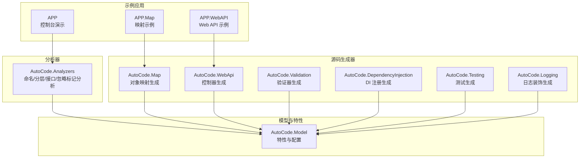
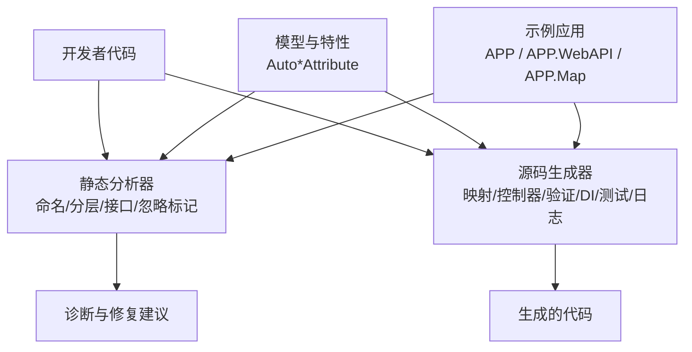
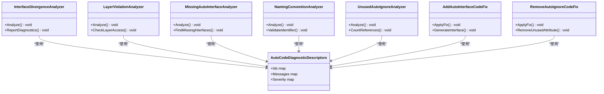
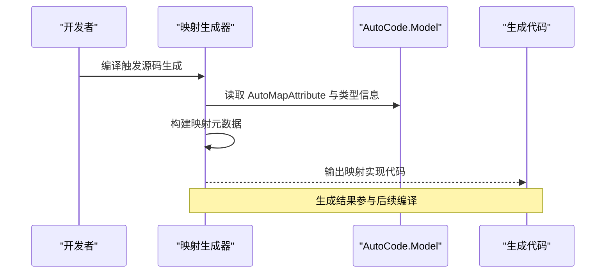
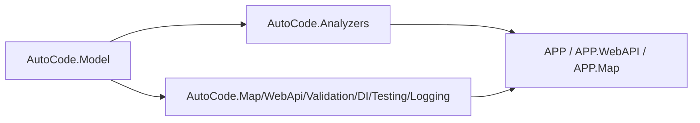

# 静态代码分析器

<cite>
**本文引用的文件**   
- [README.md](file://README.md)
- [AutoCode.sln](file://src/AutoCode.sln)
- [Program.cs](file://src/APP/Program.cs)
- [AnalyzerDemo.cs](file://src/APP/AnalyzerDemo.cs)
- [InterfaceDivergenceAnalyzer.cs](file://src/AutoCode.Analyzers/Analyzers/InterfaceDivergenceAnalyzer.cs)
- [LayerViolationAnalyzer.cs](file://src/AutoCode.Analyzers/Analyzers/LayerViolationAnalyzer.cs)
- [MissingAutoInterfaceAnalyzer.cs](file://src/AutoCode.Analyzers/Analyzers/MissingAutoInterfaceAnalyzer.cs)
- [NamingConventionAnalyzer.cs](file://src/AutoCode.Analyzers/Analyzers/NamingConventionAnalyzer.cs)
- [UnusedAutoIgnoreAnalyzer.cs](file://src/AutoCode.Analyzers/Analyzers/UnusedAutoIgnoreAnalyzer.cs)
- [AddAutoInterfaceCodeFix.cs](file://src/AutoCode.Analyzers/CodeFixes/AddAutoInterfaceCodeFix.cs)
- [RemoveAutoIgnoreCodeFix.cs](file://src/AutoCode.Analyzers/CodeFixes/RemoveAutoIgnoreCodeFix.cs)
- [AutoCodeDiagnosticDescriptors.cs](file://src/AutoCode.Analyzers/Diagnostics/AutoCodeDiagnosticDescriptors.cs)
- [AutoCode.Analyzers.csproj](file://src/AutoCode.Analyzers/AutoCode.Analyzers.csproj)
- [MapperGenerator.cs](file://src/AutoCode.Map/MapperGenerator.cs)
- [AutoCode.Map.csproj](file://src/AutoCode.Map/AutoCode.Map.csproj)
- [AutoCode.Model.csproj](file://src/AutoCode.Model/AutoCode.Model.csproj)
- [AutoMapAttribute.cs](file://src/AutoCode.Model/AutoMapAttribute.cs)
- [AutoControllerAttribute.cs](file://src/AutoCode.Model/AutoControllerAttribute.cs)
- [AutoDTOAttribute.cs](file://src/AutoCode.Model/AutoDTOAttribute.cs)
- [AutoLogAttribute.cs](file://src/AutoCode.Model/AutoLogAttribute.cs)
- [AutoTestAttribute.cs](file://src/AutoCode.Model/AutoTestAttribute.cs)
- [AutoValidatorAttribute.cs](file://src/AutoCode.Model/AutoValidatorAttribute.cs)
- [Behavior.cs](file://src/Auto.MapModels/Behavior.cs)
- [UserInfo.cs](file://src/APP.Map/UserInfo.cs)
- [Controllers/BookingController.cs](file://src/APP.WebAPI/Controllers/BookingController.cs)
- [Services/BookingService.cs](file://src/APP.WebAPI/Services/BookingService.cs)
- [Services/UserService.cs](file://src/APP.WebAPI/Services/UserService.cs)
- [Models/Requests.cs](file://src/APP.WebAPI/Models/Requests.cs)
- [Models/UserDto.cs](file://src/APP.WebAPI/Models/UserDto.cs)
- [Models/UserEntity.cs](file://src/APP.WebAPI/Models/UserEntity.cs)
- [DependencyInjectionServiceCollectionExtensions.cs](file://src/APP.WebAPI.Core/DependencyInjection/DependencyInjectionServiceCollectionExtensions.cs)
- [AppCore.cs](file://src/APP.WebAPI.Core/Application/AppCore.cs)
- [IServiceCollectionExtensions.cs](file://src/APP.WebAPI.Core/Application/Extensions/ServiceCollectionExtensions.cs)
- [IDependencyBase.cs](file://src/APP.WebAPI.Core/DependencyInjection/LifeType/IDependencyBase.cs)
- [IScoped.cs](file://src/APP.WebAPI.Core/DependencyInjection/LifeType/IScoped.cs)
- [ISingleton.cs](file://src/APP.WebAPI.Core/DependencyInjection/LifeType/ISingleton.cs)
- [ITransient.cs](file://src/APP.WebAPI.Core/DependencyInjection/LifeType/ITransient.cs)
- [AutoCode.Tests.csproj](file://src/AutoCode.Tests/AutoCode.Tests.csproj)
- [AnalyzerTests.cs](file://src/AutoCode.Tests/AnalyzerTests.cs)
</cite>

## 目录
1. [简介](#简介)
2. [项目结构](#项目结构)
3. [核心组件](#核心组件)
4. [架构总览](#架构总览)
5. [详细组件分析](#详细组件分析)
6. [依赖关系分析](#依赖关系分析)
7. [性能考量](#性能考量)
8. [故障排查指南](#故障排查指南)
9. [结论](#结论)
10. [附录](#附录)

## 简介
本项目是一个面向 .NET 的“静态代码分析器与源码生成器”一体化平台。它通过 Roslyn 在编译期对代码进行静态分析，提供诊断与修复建议，并基于约定与特性（Attribute）自动生成接口、映射、控制器、日志装饰、验证规则与测试骨架等代码，从而减少样板代码、统一规范、提升一致性与可维护性。

- 静态分析：命名规范、分层违规、接口分歧、未使用的忽略标记等。
- 源码生成：DTO 映射、Web API 控制器、依赖注入注册、日志装饰、验证器、测试用例。
- 扩展能力：模板引擎与外部扩展支持，便于自定义生成逻辑。

本仓库同时包含示例应用（控制台、WebAPI）、演示与分析器测试，帮助快速上手与验证功能。

## 项目结构
整体采用多项目解决方案组织，按职责划分模块：
- AutoCode.Analyzers：静态分析器与代码修复实现。
- AutoCode.Map / AutoCode.WebApi / AutoCode.Validation / AutoCode.DependencyInjection / AutoCode.Testing / AutoCode.Logging：各类源码生成器。
- AutoCode.Model：通用模型与特性定义（如 AutoMapAttribute、AutoControllerAttribute 等）。
- APP / APP.WebAPI / APP.Map：示例应用与映射演示。
- AutoCode.Tests：分析器与生成器的单元测试。
- AutoCode.SourceGenerator.Extensions：NuGet 包与工具脚本。

图表来源
- [AutoCode.Analyzers.csproj](file://src/AutoCode.Analyzers/AutoCode.Analyzers.csproj)
- [AutoCode.Map.csproj](file://src/AutoCode.Map/AutoCode.Map.csproj)
- [AutoCode.Model.csproj](file://src/AutoCode.Model/AutoCode.Model.csproj)
- [AutoCode.sln](file://src/AutoCode.sln)

章节来源
- [AutoCode.sln](file://src/AutoCode.sln)
- [README.md](file://README.md)

## 核心组件
- 静态分析器集合
  - 命名规范分析器：检查类、方法、属性等是否符合约定。
  - 分层违规分析器：检测跨层调用或不当依赖。
  - 接口分歧分析器：识别接口与其实现之间的不一致。
  - 未使用 AutoIgnore 分析器：提示未被引用的忽略标记。
- 代码修复（Code Fix）
  - 自动添加缺失的 AutoInterface。
  - 移除未使用的 AutoIgnore。
- 诊断描述
  - 统一的诊断 ID、标题、消息模板与严重级别。
- 源码生成器
  - 映射生成器：根据特性与类型信息生成映射代码。
  - Web API 控制器生成器：基于模型与特性生成控制器。
  - 验证器生成器：基于模型字段生成验证规则。
  - DI 注册生成器：扫描生命周期接口并生成注册代码。
  - 测试生成器：为业务逻辑生成基础测试骨架。
  - 日志装饰生成器：为服务方法生成日志包装。
- 模型与特性
  - 定义各生成器所需的特性（如 AutoMapAttribute、AutoControllerAttribute、AutoDTOAttribute、AutoLogAttribute、AutoTestAttribute、AutoValidatorAttribute）。
  - 提供通用选项与枚举策略。

章节来源
- [InterfaceDivergenceAnalyzer.cs](file://src/AutoCode.Analyzers/Analyzers/InterfaceDivergenceAnalyzer.cs)
- [LayerViolationAnalyzer.cs](file://src/AutoCode.Analyzers/Analyzers/LayerViolationAnalyzer.cs)
- [MissingAutoInterfaceAnalyzer.cs](file://src/AutoCode.Analyzers/Analyzers/MissingAutoInterfaceAnalyzer.cs)
- [NamingConventionAnalyzer.cs](file://src/AutoCode.Analyzers/Analyzers/NamingConventionAnalyzer.cs)
- [UnusedAutoIgnoreAnalyzer.cs](file://src/AutoCode.Analyzers/Analyzers/UnusedAutoIgnoreAnalyzer.cs)
- [AddAutoInterfaceCodeFix.cs](file://src/AutoCode.Analyzers/CodeFixes/AddAutoInterfaceCodeFix.cs)
- [RemoveAutoIgnoreCodeFix.cs](file://src/AutoCode.Analyzers/CodeFixes/RemoveAutoIgnoreCodeFix.cs)
- [AutoCodeDiagnosticDescriptors.cs](file://src/AutoCode.Analyzers/Diagnostics/AutoCodeDiagnosticDescriptors.cs)
- [MapperGenerator.cs](file://src/AutoCode.Map/MapperGenerator.cs)
- [AutoCode.Map.csproj](file://src/AutoCode.Map/AutoCode.Map.csproj)
- [AutoCode.Model.csproj](file://src/AutoCode.Model/AutoCode.Model.csproj)
- [AutoMapAttribute.cs](file://src/AutoCode.Model/AutoMapAttribute.cs)
- [AutoControllerAttribute.cs](file://src/AutoCode.Model/AutoControllerAttribute.cs)
- [AutoDTOAttribute.cs](file://src/AutoCode.Model/AutoDTOAttribute.cs)
- [AutoLogAttribute.cs](file://src/AutoCode.Model/AutoLogAttribute.cs)
- [AutoTestAttribute.cs](file://src/AutoCode.Model/AutoTestAttribute.cs)
- [AutoValidatorAttribute.cs](file://src/AutoCode.Model/AutoValidatorAttribute.cs)

## 架构总览
系统由“分析器 + 生成器 + 模型特性 + 示例应用”构成。分析器在编译期运行，输出诊断；生成器基于特性与语法树生成目标代码；示例应用展示如何使用这些能力。

图表来源
- [AutoCode.Analyzers.csproj](file://src/AutoCode.Analyzers/AutoCode.Analyzers.csproj)
- [AutoCode.Map.csproj](file://src/AutoCode.Map/AutoCode.Map.csproj)
- [AutoCode.Model.csproj](file://src/AutoCode.Model/AutoCode.Model.csproj)
- [Program.cs](file://src/APP/Program.cs)
- [Controllers/BookingController.cs](file://src/APP.WebAPI/Controllers/BookingController.cs)
- [UserInfo.cs](file://src/APP.Map/UserInfo.cs)

## 详细组件分析

### 静态分析器组件
- 命名规范分析器
  - 作用：校验标识符命名是否符合约定（如类名、方法名、属性名等）。
  - 行为：遍历语法节点，匹配命名模式，不符合则报告诊断。
- 分层违规分析器
  - 作用：检测跨层调用（如 UI 直接访问数据层），违反分层架构。
  - 行为：基于命名空间与引用关系判断层级，越界即告警。
- 接口分歧分析器
  - 作用：对比接口与其实现的成员差异，发现新增/删除成员未同步。
  - 行为：收集接口与实现，比较成员集合，输出不一致项。
- 未使用 AutoIgnore 分析器
  - 作用：定位未被任何地方引用的 AutoIgnore 标记，提示清理。
  - 行为：统计引用计数，零引用则报告。
- 代码修复
  - 自动添加缺失的 AutoInterface：为需要暴露接口的类型补全接口声明与实现。
  - 移除未使用的 AutoIgnore：安全删除无引用的忽略标记。

图表来源
- [InterfaceDivergenceAnalyzer.cs](file://src/AutoCode.Analyzers/Analyzers/InterfaceDivergenceAnalyzer.cs)
- [LayerViolationAnalyzer.cs](file://src/AutoCode.Analyzers/Analyzers/LayerViolationAnalyzer.cs)
- [MissingAutoInterfaceAnalyzer.cs](file://src/AutoCode.Analyzers/Analyzers/MissingAutoInterfaceAnalyzer.cs)
- [NamingConventionAnalyzer.cs](file://src/AutoCode.Analyzers/Analyzers/NamingConventionAnalyzer.cs)
- [UnusedAutoIgnoreAnalyzer.cs](file://src/AutoCode.Analyzers/Analyzers/UnusedAutoIgnoreAnalyzer.cs)
- [AddAutoInterfaceCodeFix.cs](file://src/AutoCode.Analyzers/CodeFixes/AddAutoInterfaceCodeFix.cs)
- [RemoveAutoIgnoreCodeFix.cs](file://src/AutoCode.Analyzers/CodeFixes/RemoveAutoIgnoreCodeFix.cs)
- [AutoCodeDiagnosticDescriptors.cs](file://src/AutoCode.Analyzers/Diagnostics/AutoCodeDiagnosticDescriptors.cs)

章节来源
- [InterfaceDivergenceAnalyzer.cs](file://src/AutoCode.Analyzers/Analyzers/InterfaceDivergenceAnalyzer.cs)
- [LayerViolationAnalyzer.cs](file://src/AutoCode.Analyzers/Analyzers/LayerViolationAnalyzer.cs)
- [MissingAutoInterfaceAnalyzer.cs](file://src/AutoCode.Analyzers/Analyzers/MissingAutoInterfaceAnalyzer.cs)
- [NamingConventionAnalyzer.cs](file://src/AutoCode.Analyzers/Analyzers/NamingConventionAnalyzer.cs)
- [UnusedAutoIgnoreAnalyzer.cs](file://src/AutoCode.Analyzers/Analyzers/UnusedAutoIgnoreAnalyzer.cs)
- [AddAutoInterfaceCodeFix.cs](file://src/AutoCode.Analyzers/CodeFixes/AddAutoInterfaceCodeFix.cs)
- [RemoveAutoIgnoreCodeFix.cs](file://src/AutoCode.Analyzers/CodeFixes/RemoveAutoIgnoreCodeFix.cs)
- [AutoCodeDiagnosticDescriptors.cs](file://src/AutoCode.Analyzers/Diagnostics/AutoCodeDiagnosticDescriptors.cs)

### 源码生成器组件（以映射为例）
- 映射生成器
  - 输入：带有 AutoMapAttribute 的类型与属性映射策略。
  - 处理：解析语法树与特性，构建映射元数据，生成映射代码。
  - 输出：强类型映射实现，减少手动编写映射逻辑。

图表来源
- [MapperGenerator.cs](file://src/AutoCode.Map/MapperGenerator.cs)
- [AutoCode.Map.csproj](file://src/AutoCode.Map/AutoCode.Map.csproj)
- [AutoCode.Model.csproj](file://src/AutoCode.Model/AutoCode.Model.csproj)
- [AutoMapAttribute.cs](file://src/AutoCode.Model/AutoMapAttribute.cs)

章节来源
- [MapperGenerator.cs](file://src/AutoCode.Map/MapperGenerator.cs)
- [AutoCode.Map.csproj](file://src/AutoCode.Map/AutoCode.Map.csproj)
- [AutoCode.Model.csproj](file://src/AutoCode.Model/AutoCode.Model.csproj)
- [AutoMapAttribute.cs](file://src/AutoCode.Model/AutoMapAttribute.cs)

### 示例应用与集成点
- 控制台演示（APP）
  - Program.cs：入口程序，用于演示分析器与生成器的效果。
  - AnalyzerDemo.cs：具体演示场景，触发分析与生成流程。
- Web API 示例（APP.WebAPI）
  - Controllers/BookingController.cs：控制器示例，可能结合控制器生成器。
  - Services/BookingService.cs、UserService.cs：服务层示例。
  - Models/Requests.cs、UserDto.cs、UserEntity.cs：请求与数据传输模型。
- 映射示例（APP.Map）
  - UserInfo.cs：演示映射特性的使用与生成结果。

图表来源
- [Program.cs](file://src/APP/Program.cs)
- [AnalyzerDemo.cs](file://src/APP/AnalyzerDemo.cs)
- [Controllers/BookingController.cs](file://src/APP.WebAPI/Controllers/BookingController.cs)
- [Services/BookingService.cs](file://src/APP.WebAPI/Services/BookingService.cs)
- [Services/UserService.cs](file://src/APP.WebAPI/Services/UserService.cs)
- [Models/Requests.cs](file://src/APP.WebAPI/Models/Requests.cs)
- [Models/UserDto.cs](file://src/APP.WebAPI/Models/UserDto.cs)
- [Models/UserEntity.cs](file://src/APP.WebAPI/Models/UserEntity.cs)
- [UserInfo.cs](file://src/APP.Map/UserInfo.cs)

章节来源
- [Program.cs](file://src/APP/Program.cs)
- [AnalyzerDemo.cs](file://src/APP/AnalyzerDemo.cs)
- [Controllers/BookingController.cs](file://src/APP.WebAPI/Controllers/BookingController.cs)
- [Services/BookingService.cs](file://src/APP.WebAPI/Services/BookingService.cs)
- [Services/UserService.cs](file://src/APP.WebAPI/Services/UserService.cs)
- [Models/Requests.cs](file://src/APP.WebAPI/Models/Requests.cs)
- [Models/UserDto.cs](file://src/APP.WebAPI/Models/UserDto.cs)
- [Models/UserEntity.cs](file://src/APP.WebAPI/Models/UserEntity.cs)
- [UserInfo.cs](file://src/APP.Map/UserInfo.cs)

## 依赖关系分析
- 分析器与模型
  - 所有分析器依赖 AutoCode.Model 中的特性与配置，用于识别目标元素与规则。
- 生成器与模型
  - 各生成器（映射、控制器、验证、DI、测试、日志）均依赖 AutoCode.Model 的特性定义。
- 示例与应用
  - 示例应用通过引入分析器与生成器，体验编译期增强与代码生成。

图表来源
- [AutoCode.Model.csproj](file://src/AutoCode.Model/AutoCode.Model.csproj)
- [AutoCode.Analyzers.csproj](file://src/AutoCode.Analyzers/AutoCode.Analyzers.csproj)
- [AutoCode.Map.csproj](file://src/AutoCode.Map/AutoCode.Map.csproj)
- [AutoCode.sln](file://src/AutoCode.sln)

章节来源
- [AutoCode.Model.csproj](file://src/AutoCode.Model/AutoCode.Model.csproj)
- [AutoCode.Analyzers.csproj](file://src/AutoCode.Analyzers/AutoCode.Analyzers.csproj)
- [AutoCode.Map.csproj](file://src/AutoCode.Map/AutoCode.Map.csproj)
- [AutoCode.sln](file://src/AutoCode.sln)

## 性能考量
- 增量分析
  - 利用 Roslyn 增量分析能力，仅对变更部分进行分析与生成，降低编译开销。
- 轻量诊断
  - 诊断规则尽量简单高效，避免复杂计算与 I/O 操作。
- 生成优化
  - 生成器缓存元数据，减少重复解析；按需生成最小化代码。
- 资源管理
  - 及时释放语法树与语义分析结果，避免内存占用过高。

[本节为通用指导，不直接分析具体文件]

## 故障排查指南
- 常见问题
  - 诊断未触发：确认特性是否正确标注，命名空间与引用是否完整。
  - 生成失败：检查模型定义与特性参数是否合法，确保类型可解析。
  - 运行时异常：查看生成代码是否存在冲突或循环依赖。
- 调试建议
  - 启用详细日志，定位分析器与生成器执行路径。
  - 使用单元测试（AnalyzerTests）复现问题，缩小范围。
- 修复步骤
  - 依据诊断消息修正命名或分层问题。
  - 使用提供的 Code Fix 自动修复缺失接口或未使用标记。

章节来源
- [AnalyzerTests.cs](file://src/AutoCode.Tests/AnalyzerTests.cs)
- [AutoCodeDiagnosticDescriptors.cs](file://src/AutoCode.Analyzers/Diagnostics/AutoCodeDiagnosticDescriptors.cs)
- [AddAutoInterfaceCodeFix.cs](file://src/AutoCode.Analyzers/CodeFixes/AddAutoInterfaceCodeFix.cs)
- [RemoveAutoIgnoreCodeFix.cs](file://src/AutoCode.Analyzers/CodeFixes/RemoveAutoIgnoreCodeFix.cs)

## 结论
该项目将静态分析与源码生成深度融合，通过特性驱动与约定优先的方式，显著减少样板代码、统一开发规范、提升质量与效率。分析器保障代码健康，生成器加速开发，示例应用帮助快速上手。建议在团队中推广使用，并结合 CI 流水线持续验证。

[本节为总结性内容，不直接分析具体文件]

## 附录
- 相关项目与包
  - AutoCode.SourceGenerator.Extensions：NuGet 包与安装脚本，便于分发与集成。
- 扩展点
  - 模板引擎与外部扩展：支持自定义生成逻辑与模板，满足个性化需求。

[本节为补充信息，不直接分析具体文件]